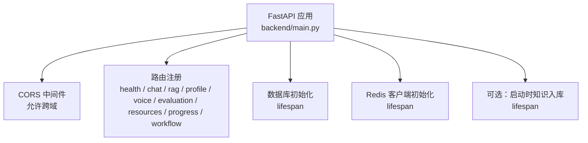
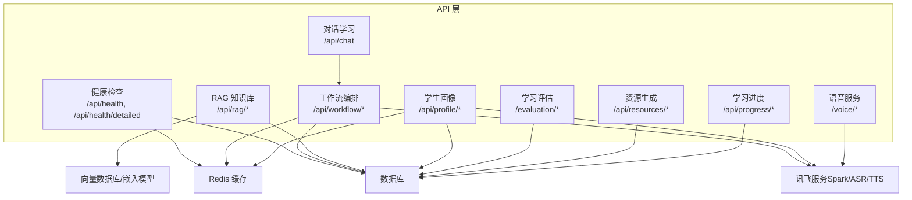
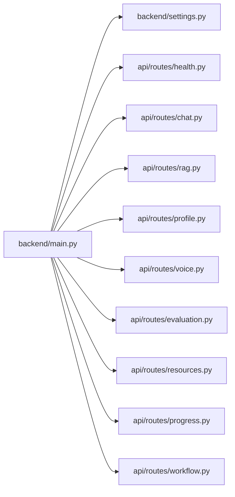

# API接口文档

<cite>
**本文引用的文件**
- [backend/main.py](file://backend/main.py)
- [backend/settings.py](file://backend/settings.py)
- [api/routes/health.py](file://api/routes/health.py)
- [api/routes/chat.py](file://api/routes/chat.py)
- [api/routes/rag.py](file://api/routes/rag.py)
- [api/routes/profile.py](file://api/routes/profile.py)
- [api/routes/voice.py](file://api/routes/voice.py)
- [api/routes/evaluation.py](file://api/routes/evaluation.py)
- [api/routes/resources.py](file://api/routes/resources.py)
- [api/routes/progress.py](file://api/routes/progress.py)
- [api/routes/workflow.py](file://api/routes/workflow.py)
- [schemas/profile.py](file://schemas/profile.py)
- [scripts/test_chat_api.py](file://scripts/test_chat_api.py)
</cite>

## 目录
1. [简介](#简介)
2. [项目结构](#项目结构)
3. [核心组件](#核心组件)
4. [架构总览](#架构总览)
5. [详细组件分析](#详细组件分析)
6. [依赖分析](#依赖分析)
7. [性能考虑](#性能考虑)
8. [故障排查指南](#故障排查指南)
9. [结论](#结论)
10. [附录](#附录)

## 简介
本文件为 EduAgent 多智能体教育平台的完整 API 接口文档，覆盖健康检查、对话学习、RAG 知识库、学生画像、语音服务、工作流编排、学习评估、资源生成、学习进度等模块。文档提供每个端点的 HTTP 方法、URL 模式、请求参数、响应格式、错误码说明，并给出认证方式、限流策略、版本管理、错误处理机制与性能优化建议，便于前端与第三方系统集成。

## 项目结构
后端基于 FastAPI 构建，通过统一入口注册各模块路由；数据库与缓存在应用生命周期内初始化；部分外部能力（讯飞星火、ASR/TTS）通过配置启用。

图表来源
- [backend/main.py:46-70](file://backend/main.py#L46-L70)

章节来源
- [backend/main.py:1-70](file://backend/main.py#L1-L70)

## 核心组件
- 版本号：0.2.0
- 标题：EduAgent API
- 描述：多智能体高校个性化学习平台后端（阶段一～十）
- CORS：允许来自配置列表的源进行跨域访问
- 健康检查：提供基础健康与详细健康信息，包含数据库、Redis、讯飞配置状态
- 数据库与缓存：应用启动时初始化，支持降级（内存回退）

章节来源
- [backend/main.py:46-70](file://backend/main.py#L46-L70)
- [backend/settings.py:53-61](file://backend/settings.py#L53-L61)

## 架构总览
下图展示 API 层与业务模块的关系，以及关键外部依赖（数据库、Redis、向量库、讯飞服务）：

图表来源
- [backend/main.py:61-69](file://backend/main.py#L61-L69)
- [backend/settings.py:17-49](file://backend/settings.py#L17-L49)

## 详细组件分析

### 健康检查
- 基础健康
  - 方法：GET
  - 路径：/api/health
  - 请求参数：无
  - 响应字段：状态、环境、讯飞配置状态、讯飞模式、嵌入模型
  - 错误码：200 成功
- 详细健康
  - 方法：GET
  - 路径：/api/health/detailed
  - 请求参数：无
  - 响应字段：状态、环境、数据库、Redis、讯飞配置、讯飞领域、嵌入模型、向量库持久化目录
  - 错误码：200 成功；数据库异常时状态降级为“degraded”

章节来源
- [api/routes/health.py:14-52](file://api/routes/health.py#L14-L52)

### 对话学习
- 端点：POST /api/chat
  - 请求体：message（字符串，必填）、session_id（字符串，可选）
  - 响应体：reply（字符串）、session_id（字符串，可选）、student_profile（字典，可选）、state（字典）
  - 行为：构建简单工作流，传入初始状态并异步执行，汇总助手消息作为回复
  - 错误码：200 成功；异常时返回 500
  - 示例请求：见脚本 [scripts/test_chat_api.py:21-25](file://scripts/test_chat_api.py#L21-L25)

章节来源
- [api/routes/chat.py:23-36](file://api/routes/chat.py#L23-L36)
- [scripts/test_chat_api.py:16-34](file://scripts/test_chat_api.py#L16-L34)

### RAG 知识库
- 统计信息
  - 方法：GET
  - 路径：/api/rag/stats
  - 请求参数：无
  - 响应：入库摘要（条目数、分块数等）
- 批量入库
  - 方法：POST
  - 路径：/api/rag/ingest
  - 查询参数：sync（布尔，是否同步执行）
  - 响应：状态（started/done）、消息或入库统计
  - 行为：支持同步或后台任务异步执行
- 检索查询
  - 方法：POST
  - 路径：/api/rag/query
  - 请求体：query（字符串，必填）、top_k（整数，1~20，默认4）
  - 响应体：query（字符串）、results（列表，检索结果项）

章节来源
- [api/routes/rag.py:24-42](file://api/routes/rag.py#L24-L42)

### 学生画像
- 构建画像
  - 方法：POST
  - 路径：/api/profile/build
  - 请求体：message（字符串，必填）、session_id（字符串，可选）
  - 响应体：session_id（字符串）、profile（学生画像对象）、source（来源）、cached（布尔）
  - 行为：调用画像服务构建，不使用缓存
- 获取画像
  - 方法：GET
  - 路径：/api/profile/{session_id}
  - 路径参数：session_id（字符串，必填）
  - 响应体：同上
  - 错误码：404 未找到该会话的画像
- 分析画像
  - 方法：POST
  - 路径：/api/profile/analyze
  - 请求体：message（字符串，必填）、session_id（字符串，可选）
  - 响应体：同上
  - 行为：对话式分析，自动生成 session_id

章节来源
- [api/routes/profile.py:21-56](file://api/routes/profile.py#L21-L56)
- [schemas/profile.py:8-36](file://schemas/profile.py#L8-L36)

### 语音服务
- 语音识别 ASR
  - 方法：POST
  - 路径：/voice/asr
  - 表单参数：audio（文件，必填，wav/mp3/pcm）、format（字符串，可选，默认wav）
  - 响应体：text（识别结果）
  - 错误码：503 服务不可用；500 其他异常
- 语音合成 TTS
  - 方法：POST
  - 路径：/voice/tts
  - 表单参数：text（字符串，必填）、voice（字符串，可选，默认xiaoyan）
  - 响应：二进制音频（audio/mpeg），带下载头
  - 错误码：503 服务不可用；500 其他异常
- 语音服务状态
  - 方法：GET
  - 路径：/voice/status
  - 响应体：asr_configured、tts_configured、fully_configured（布尔）

章节来源
- [api/routes/voice.py:18-64](file://api/routes/voice.py#L18-L64)

### 学习评估
- 生成评估报告
  - 方法：POST
  - 路径：/evaluation/report
  - 请求体：student_profile（字典，必填）、learning_behavior（对象，必填）
  - 响应体：score（0-100）、level（优秀/良好/中等/需加强）、comment、analysis、strengths、weaknesses、suggestions、evaluated
  - 错误码：500 评估失败
- 提交学习行为
  - 方法：POST
  - 路径：/evaluation/behavior
  - 请求体：study_duration_minutes、quiz_results、knowledge_mastery、resource_usage
  - 响应：success、message、analysis
  - 错误码：500 提交失败
- 评估指标说明
  - 方法：GET
  - 路径：/evaluation/metrics
  - 响应：指标中文说明
- 更新画像（基于评估）
  - 方法：POST
  - 路径：/evaluation/profile-update
  - 请求体：student_profile（字典）、report（字典）
  - 响应：success、updated_profile
  - 错误码：500 更新失败

章节来源
- [api/routes/evaluation.py:58-119](file://api/routes/evaluation.py#L58-L119)

### 资源生成
- 获取会话全部资源
  - 方法：GET
  - 路径：/api/resources/{session_id}
  - 路径参数：session_id（字符串，必填）
  - 响应体：session_id、resources（列表，含 id、session_id、resource_type、content、created_at）
- 按类型获取资源
  - 方法：GET
  - 路径：/api/resources/{session_id}/{resource_type}
  - 路径参数：session_id、resource_type
  - 响应体：session_id、resource_type、resources（列表）

章节来源
- [api/routes/resources.py:34-77](file://api/routes/resources.py#L34-L77)

### 学习进度
- 获取进度概览
  - 方法：GET
  - 路径：/api/progress/{session_id}
  - 路径参数：session_id（字符串，必填）
  - 响应体：session_id、profile_exists（布尔）、resources（总数与按类型统计）、evaluation（报告总数与最新分数/等级）、updated_at（最近更新时间）
  - 等级映射：≥90 优秀，≥75 良好，≥60 中等，否则 需改进

章节来源
- [api/routes/progress.py:44-99](file://api/routes/progress.py#L44-L99)

### 工作流编排
- 执行工作流
  - 方法：POST
  - 路径：/api/workflow/execute
  - 请求体：message（字符串，必填）、session_id（字符串，可选）
  - 响应体：session_id、student_profile、learning_path、knowledge_tree、ppt_deck、quiz_set、code_set、mindmap、video_script、evaluation_report、messages
  - 错误码：500 执行失败
- 查询工作流状态
  - 方法：GET
  - 路径：/api/workflow/status/{session_id}
  - 路径参数：session_id（字符串，必填）
  - 响应体：session_id、student_profile、resources（列表）、evaluation_reports（列表）

章节来源
- [api/routes/workflow.py:54-120](file://api/routes/workflow.py#L54-L120)

## 依赖分析
- 应用生命周期
  - 初始化日志、数据库、Redis
  - 可选：启动时批量知识入库
- 路由注册
  - 健康检查、对话学习、RAG、画像、语音、评估、资源、进度、工作流
- 外部依赖
  - 讯飞（WebSocket/HTTP）、ASR、TTS
  - 向量数据库（Chroma）、嵌入模型
  - Redis 缓存

图表来源
- [backend/main.py:15-69](file://backend/main.py#L15-L69)
- [backend/settings.py:6-66](file://backend/settings.py#L6-L66)

章节来源
- [backend/main.py:23-41](file://backend/main.py#L23-L41)
- [backend/main.py:61-69](file://backend/main.py#L61-L69)

## 性能考虑
- 启动时知识入库
  - 可配置开关，避免启动阻塞；建议在维护窗口执行
- RAG 批量入库
  - 支持后台异步执行，减少请求等待
- 画像与评估
  - 使用 Redis 缓存（画像服务内部逻辑），合理设置 TTL
- 语音服务
  - 异常时返回 503，前端应具备重试与降级策略
- 数据库连接
  - 使用依赖注入的 Session，避免重复连接
- 日志与监控
  - 应用启动即初始化日志，便于定位性能瓶颈

[本节为通用性能建议，无需特定文件引用]

## 故障排查指南
- 健康检查
  - /api/health：确认环境、讯飞配置、嵌入模型
  - /api/health/detailed：查看数据库与 Redis 状态，判断降级原因
- 语音服务
  - /voice/status：确认 ASR/TTS 是否配置完成
  - /voice/asr、/voice/tts：出现 503/500 时检查外部服务可用性与鉴权
- 评估与画像
  - 评估失败（500）：检查请求体结构与服务内部异常日志
  - 画像不存在（404）：确认 session_id 正确且已构建
- 资源与进度
  - 返回空列表属正常，确认会话 ID 与资源类型
- 工作流
  - 执行失败（500）：检查输入 message 与 session_id，查看服务端异常堆栈

章节来源
- [api/routes/health.py:14-52](file://api/routes/health.py#L14-L52)
- [api/routes/voice.py:57-64](file://api/routes/voice.py#L57-L64)
- [api/routes/evaluation.py:70-72](file://api/routes/evaluation.py#L70-L72)
- [api/routes/profile.py:40-43](file://api/routes/profile.py#L40-L43)

## 结论
本文档提供了 EduAgent 的完整 API 参考，涵盖从健康检查到工作流编排的全链路接口。建议在生产环境中结合健康检查与降级策略，合理利用缓存与异步任务提升用户体验，并通过日志与监控持续优化性能与稳定性。

[本节为总结，无需特定文件引用]

## 附录

### API 版本管理
- 当前版本：0.2.0
- 建议：采用语义化版本控制，变更重大接口时升级主版本

章节来源
- [backend/main.py:46-51](file://backend/main.py#L46-L51)

### 认证与限流
- 认证：当前路由未强制实现认证中间件
- 限流：未内置限流策略，建议在网关或中间件层添加

[本节为通用建议，无需特定文件引用]

### 错误处理机制
- 统一返回结构：成功返回 2xx；异常返回 4xx/5xx，包含明确错误信息
- 语音服务：运行时异常返回 503，其他异常返回 500
- 评估与工作流：内部异常返回 500，并记录异常日志

章节来源
- [api/routes/voice.py:28-34](file://api/routes/voice.py#L28-L34)
- [api/routes/evaluation.py:70-72](file://api/routes/evaluation.py#L70-L72)
- [api/routes/workflow.py:63-65](file://api/routes/workflow.py#L63-L65)

### 请求与响应示例
- 对话学习
  - 请求：POST /api/chat
  - 示例：见 [scripts/test_chat_api.py:21-25](file://scripts/test_chat_api.py#L21-L25)
- RAG 查询
  - 请求：POST /api/rag/query
  - 示例：query="如何安装Python？"，top_k=4
- 语音识别
  - 请求：POST /voice/asr
  - 示例：上传 wav 文件，format="wav"
- 语音合成
  - 请求：POST /voice/tts
  - 示例：text="你好世界"，voice="xiaoyan"

章节来源
- [scripts/test_chat_api.py:16-34](file://scripts/test_chat_api.py#L16-L34)
- [api/routes/rag.py:38-42](file://api/routes/rag.py#L38-L42)
- [api/routes/voice.py:18-48](file://api/routes/voice.py#L18-L48)