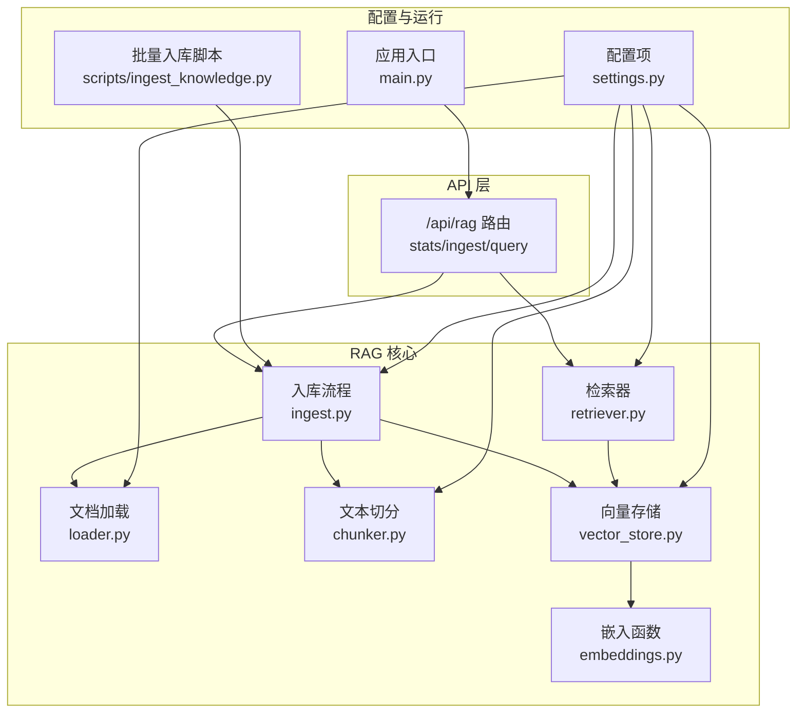
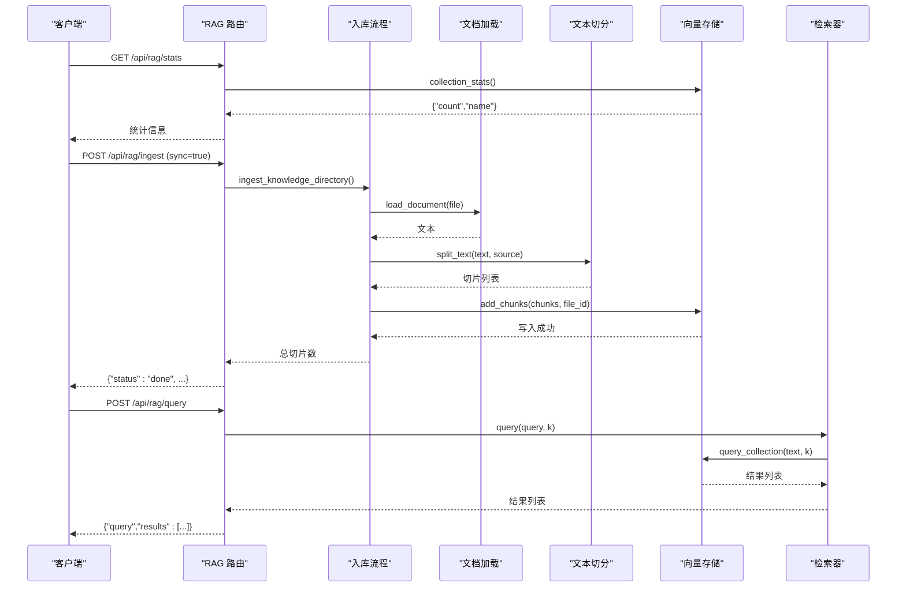
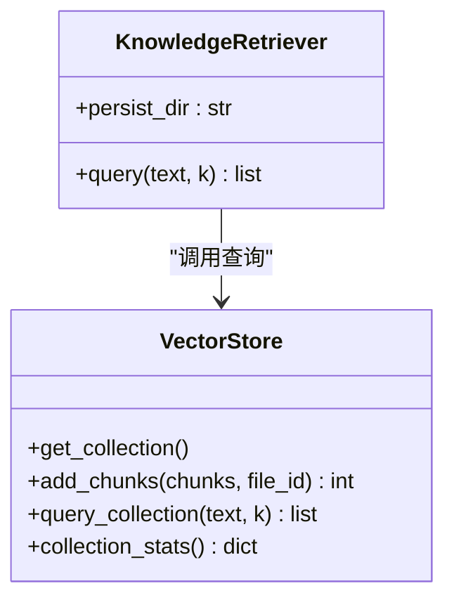
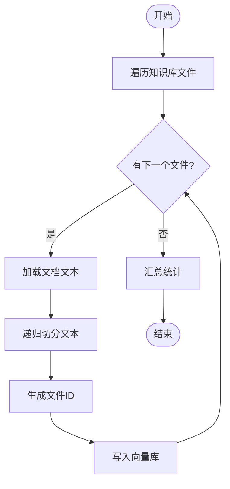
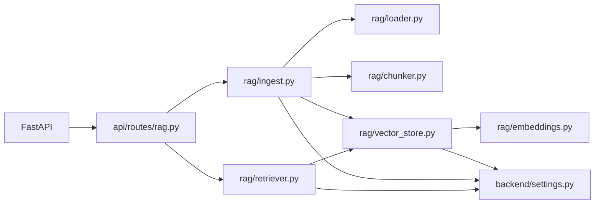

# RAG知识库接口

<cite>
**本文档引用的文件**
- [api/routes/rag.py](file://api/routes/rag.py)
- [rag/__init__.py](file://rag/__init__.py)
- [rag/chunker.py](file://rag/chunker.py)
- [rag/embeddings.py](file://rag/embeddings.py)
- [rag/vector_store.py](file://rag/vector_store.py)
- [rag/retriever.py](file://rag/retriever.py)
- [rag/ingest.py](file://rag/ingest.py)
- [rag/loader.py](file://rag/loader.py)
- [backend/settings.py](file://backend/settings.py)
- [backend/main.py](file://backend/main.py)
- [scripts/ingest_knowledge.py](file://scripts/ingest_knowledge.py)
- [requirements.txt](file://requirements.txt)
- [knowledge/courses/python_basics.md](file://knowledge/courses/python_basics.md)
</cite>

## 目录
1. [简介](#简介)
2. [项目结构](#项目结构)
3. [核心组件](#核心组件)
4. [架构总览](#架构总览)
5. [详细组件分析](#详细组件分析)
6. [依赖分析](#依赖分析)
7. [性能考虑](#性能考虑)
8. [故障排查指南](#故障排查指南)
9. [结论](#结论)
10. [附录](#附录)

## 简介
本文件为 EduAgent 的 RAG 知识库接口 API 文档，覆盖知识库管理、文档处理、向量检索与问答生成相关的端点与流程。重点包括：
- 知识库统计查询
- 文档入库（同步/异步）
- 向量检索接口
- 检索结果与相关性分数、引用来源说明
- 错误处理与常见问题排查
- 知识库构建流程、检索优化策略与性能调优建议

## 项目结构
RAG 能力由独立模块实现，并通过 FastAPI 路由暴露为 HTTP 接口。主要目录与职责如下：
- api/routes/rag.py：RAG 相关路由定义（统计、入库、查询）
- rag/*：RAG 核心实现（文档加载、切分、嵌入、向量存储、检索）
- backend/settings.py：RAG 相关配置项（知识库路径、嵌入模型、切块参数、TopK 等）
- backend/main.py：应用启动与路由挂载
- scripts/ingest_knowledge.py：命令行批量入库脚本
- knowledge/courses：示例知识库文档

图表来源
- [api/routes/rag.py:11-42](file://api/routes/rag.py#L11-L42)
- [rag/loader.py:11-50](file://rag/loader.py#L11-L50)
- [rag/chunker.py:8-20](file://rag/chunker.py#L8-L20)
- [rag/embeddings.py:11-20](file://rag/embeddings.py#L11-L20)
- [rag/vector_store.py:16-64](file://rag/vector_store.py#L16-L64)
- [rag/retriever.py:12-23](file://rag/retriever.py#L12-L23)
- [rag/ingest.py:21-47](file://rag/ingest.py#L21-L47)
- [backend/settings.py:41-49](file://backend/settings.py#L41-L49)
- [backend/main.py:44-69](file://backend/main.py#L44-L69)
- [scripts/ingest_knowledge.py:13-18](file://scripts/ingest_knowledge.py#L13-L18)

章节来源
- [api/routes/rag.py:11-42](file://api/routes/rag.py#L11-L42)
- [backend/main.py:44-69](file://backend/main.py#L44-L69)

## 核心组件
- 路由与请求/响应模型
  - 统计接口：GET /api/rag/stats
  - 入库接口：POST /api/rag/ingest（支持同步/异步）
  - 查询接口：POST /api/rag/query（返回检索结果列表）
- 检索器：KnowledgeRetriever，封装向量检索逻辑
- 向量存储：基于 ChromaDB 的持久化集合，使用 SentenceTransformer 嵌入函数
- 文档加载：支持 md/markdown/txt/pdf/docx/doc
- 文本切分：递归字符切分，支持多种分隔符与重叠
- 入库流程：遍历知识库目录，加载文档、切分、向量化并写入集合

章节来源
- [api/routes/rag.py:14-42](file://api/routes/rag.py#L14-L42)
- [rag/retriever.py:12-23](file://rag/retriever.py#L12-L23)
- [rag/vector_store.py:16-64](file://rag/vector_store.py#L16-L64)
- [rag/loader.py:11-50](file://rag/loader.py#L11-L50)
- [rag/chunker.py:8-20](file://rag/chunker.py#L8-L20)
- [rag/ingest.py:21-47](file://rag/ingest.py#L21-L47)

## 架构总览
RAG 接口通过 FastAPI 路由对外提供能力，内部以“文档加载 → 文本切分 → 向量嵌入 → 写入向量库”的流水线完成知识库构建；检索时通过嵌入函数将查询向量化，在集合中进行相似度检索，返回文本、相关性分数与元数据。

图表来源
- [api/routes/rag.py:24-42](file://api/routes/rag.py#L24-L42)
- [rag/ingest.py:21-47](file://rag/ingest.py#L21-L47)
- [rag/loader.py:11-38](file://rag/loader.py#L11-L38)
- [rag/chunker.py:8-20](file://rag/chunker.py#L8-L20)
- [rag/vector_store.py:34-59](file://rag/vector_store.py#L34-L59)
- [rag/retriever.py:18-23](file://rag/retriever.py#L18-L23)

## 详细组件分析

### API 端点定义
- 统计信息
  - 方法与路径：GET /api/rag/stats
  - 功能：返回当前向量库中的条目数量、集合名称以及知识库目录下的文件清单
  - 返回：字典，包含 vector_count、collection、knowledge_files
- 入库
  - 方法与路径：POST /api/rag/ingest
  - 参数：
    - sync: bool（默认 false），是否同步执行
    - 异步模式下会将入库任务加入后台任务队列
  - 行为：
    - sync=true：立即执行入库，返回状态 done 与入库统计
    - sync=false：启动后台任务，返回状态 started 与提示消息
- 查询
  - 方法与路径：POST /api/rag/query
  - 请求体模型：
    - query: string（必填，最小长度 1）
    - top_k: int（默认 4，范围 1..20）
  - 响应体模型：
    - query: string
    - results: list[dict]，每项包含 text、score、meta

章节来源
- [api/routes/rag.py:24-42](file://api/routes/rag.py#L24-L42)

### 检索器与向量检索
- KnowledgeRetriever
  - 初始化：可指定持久化目录
  - query(text, k=None)：将查询文本传入向量库检索，异常时记录警告并返回空列表
- 向量存储查询
  - query_collection(text, k=None)：
    - 读取配置的 top_k 或传入 k
    - 若集合为空则返回空列表
    - 执行查询，将距离转换为相关性分数（1 - distance），并返回文本、分数与元数据
- 相关性分数说明
  - 使用余弦空间，距离越小相关性越高
  - 分数按 1 - distance 计算并保留 4 位小数

图表来源
- [rag/retriever.py:12-23](file://rag/retriever.py#L12-L23)
- [rag/vector_store.py:24-64](file://rag/vector_store.py#L24-L64)

章节来源
- [rag/retriever.py:12-23](file://rag/retriever.py#L12-L23)
- [rag/vector_store.py:45-59](file://rag/vector_store.py#L45-L59)

### 文档加载与切分
- 文档加载
  - 支持扩展名：.md/.markdown/.txt/.pdf/.docx/.doc
  - 文本编码统一为 utf-8，忽略错误
  - PDF 使用逐页提取，段落以双换行拼接
  - DOC/DOCX 提取段落文本并过滤空白
- 文本切分
  - 使用递归字符切分器，支持多种分隔符与重叠
  - 生成每个切片的元数据：source（相对路径）、chunk_index
  - 过滤空白切片

章节来源
- [rag/loader.py:11-50](file://rag/loader.py#L11-L50)
- [rag/chunker.py:8-20](file://rag/chunker.py#L8-L20)

### 向量嵌入与存储
- 嵌入函数
  - 懒加载，使用 SentenceTransformerEmbeddingFunction
  - 模型名称来自配置 embedding_model，默认 BAAI/bge-small-zh-v1.5
- 向量存储
  - ChromaDB 持久化客户端，路径来自配置 chroma_persist_dir
  - 集合名称来自配置 chroma_collection，默认 eduagent_courses
  - 创建集合时设置余弦空间参数
  - upsert 写入：ids、documents、metadatas
- 统计
  - collection_stats 返回集合名称与条目数量

章节来源
- [rag/embeddings.py:11-20](file://rag/embeddings.py#L11-L20)
- [rag/vector_store.py:16-31](file://rag/vector_store.py#L16-L31)
- [rag/vector_store.py:62-64](file://rag/vector_store.py#L62-L64)

### 入库流程
- 文件遍历
  - iter_knowledge_files 遍历知识库目录，支持的扩展名与过滤规则
- 单文件入库
  - load_document → split_text → add_chunks（写入集合）
  - 为每个文件生成 file_id（基于相对路径的哈希前缀）
- 批量入库
  - ingest_knowledge_directory 遍历所有文件并逐个入库
  - get_ingest_summary 返回向量总数、集合名与知识库文件列表

图表来源
- [rag/ingest.py:31-47](file://rag/ingest.py#L31-L47)
- [rag/loader.py:41-50](file://rag/loader.py#L41-L50)
- [rag/chunker.py:8-20](file://rag/chunker.py#L8-L20)
- [rag/vector_store.py:34-42](file://rag/vector_store.py#L34-L42)
- [rag/ingest.py:44-47](file://rag/ingest.py#L44-L47)

章节来源
- [rag/ingest.py:21-47](file://rag/ingest.py#L21-L47)
- [rag/loader.py:41-50](file://rag/loader.py#L41-L50)
- [rag/chunker.py:8-20](file://rag/chunker.py#L8-L20)
- [rag/vector_store.py:34-42](file://rag/vector_store.py#L34-L42)
- [rag/ingest.py:44-47](file://rag/ingest.py#L44-L47)

### 配置项与环境
- RAG 相关配置（来自 settings）
  - knowledge_dir：知识库根目录，默认 ./knowledge
  - chroma_persist_dir：ChromaDB 持久化目录，默认 ./vector_db/chroma
  - chroma_collection：集合名称，默认 eduagent_courses
  - embedding_model：嵌入模型名称，默认 BAAI/bge-small-zh-v1.5
  - chunk_size：切块大小，默认 500
  - chunk_overlap：切块重叠，默认 80
  - rag_top_k：默认 TopK，默认 4
  - auto_ingest_on_startup：启动时自动入库，默认 false
- 应用启动
  - main.py 中在 lifespan 钩子中根据配置决定是否自动执行入库

章节来源
- [backend/settings.py:41-49](file://backend/settings.py#L41-L49)
- [backend/main.py:23-41](file://backend/main.py#L23-L41)

## 依赖分析
- 外部依赖（节选）
  - fastapi、uvicorn：Web 框架与服务器
  - langchain、langchain-text-splitters：文本切分
  - chromadb、sentence-transformers：向量存储与嵌入
  - pypdf、python-docx：PDF/DOC 文档解析
- 内部模块耦合
  - api/routes/rag.py 依赖 rag/ingest 与 rag/retriever
  - rag/retriever 依赖 rag/vector_store
  - rag/ingest 依赖 rag/loader、rag/chunker、rag/vector_store
  - rag/vector_store 依赖 backend/settings 与 rag/embeddings

图表来源
- [requirements.txt:1-18](file://requirements.txt#L1-L18)
- [api/routes/rag.py:8-9](file://api/routes/rag.py#L8-L9)
- [rag/retriever.py:6-7](file://rag/retriever.py#L6-L7)
- [rag/ingest.py:8-10](file://rag/ingest.py#L8-L10)
- [rag/vector_store.py:10-11](file://rag/vector_store.py#L10-L11)
- [rag/embeddings.py:6](file://rag/embeddings.py#L6)

章节来源
- [requirements.txt:1-18](file://requirements.txt#L1-L18)
- [api/routes/rag.py:8-9](file://api/routes/rag.py#L8-L9)
- [rag/retriever.py:6-7](file://rag/retriever.py#L6-L7)
- [rag/ingest.py:8-10](file://rag/ingest.py#L8-L10)
- [rag/vector_store.py:10-11](file://rag/vector_store.py#L10-L11)
- [rag/embeddings.py:6](file://rag/embeddings.py#L6)

## 性能考虑
- 检索性能
  - 使用余弦相似度与合适的 TopK（默认 4），减少无关结果
  - 集合为空时直接返回空结果，避免无效查询
- 向量库写入
  - upsert 批量写入，避免频繁 IO
  - 切块大小与重叠影响召回与性能，可根据文档密度调整
- 模型与缓存
  - 嵌入函数使用 LRU 缓存，避免重复初始化
- 并发与异步
  - 入库支持异步后台任务，避免阻塞主请求
- 自动入库
  - 可在启动时自动执行入库，确保服务就绪时已有向量数据

章节来源
- [rag/vector_store.py:45-59](file://rag/vector_store.py#L45-L59)
- [rag/embeddings.py:11-20](file://rag/embeddings.py#L11-L20)
- [api/routes/rag.py:29-35](file://api/routes/rag.py#L29-L35)
- [backend/main.py:32-39](file://backend/main.py#L32-L39)

## 故障排查指南
- 常见问题
  - 入库后查询无结果：检查集合是否为空或未正确写入
  - 检索速度慢：适当降低 TopK 或优化切块参数
  - 文档类型不支持：确认扩展名是否在支持列表内
  - 模型加载失败：检查 embedding_model 配置与网络访问
- 日志与调试
  - 入库异常会在日志中记录失败文件与异常信息
  - 检索异常会被捕获并记录警告，返回空结果
- 快速验证
  - 使用 /api/rag/stats 查看集合条目数与知识库文件列表
  - 使用 /api/rag/ingest?sync=true 触发同步入库并查看返回统计
  - 使用 /api/rag/query 发送简单查询验证检索链路

章节来源
- [rag/ingest.py:37-41](file://rag/ingest.py#L37-L41)
- [rag/retriever.py:21-23](file://rag/retriever.py#L21-L23)
- [api/routes/rag.py:24-35](file://api/routes/rag.py#L24-L35)

## 结论
本 RAG 接口提供了从知识库构建到检索查询的完整链路，具备良好的可扩展性与性能特征。通过合理的配置与参数调优，可在教学资源场景中实现稳定高效的语义检索与问答增强。

## 附录

### API 规范摘要
- 统计信息
  - 方法：GET /api/rag/stats
  - 返回：vector_count、collection、knowledge_files
- 入库
  - 方法：POST /api/rag/ingest
  - 参数：sync（bool）
  - 返回：状态与统计信息（同步模式）
- 查询
  - 方法：POST /api/rag/query
  - 请求体：query（string）、top_k（int）
  - 返回：results（list），每项包含 text、score、meta

章节来源
- [api/routes/rag.py:24-42](file://api/routes/rag.py#L24-L42)

### 示例知识库文件
- 示例文档位于 knowledge/courses/python_basics.md，可用于验证入库与检索流程

章节来源
- [knowledge/courses/python_basics.md:1-54](file://knowledge/courses/python_basics.md#L1-L54)