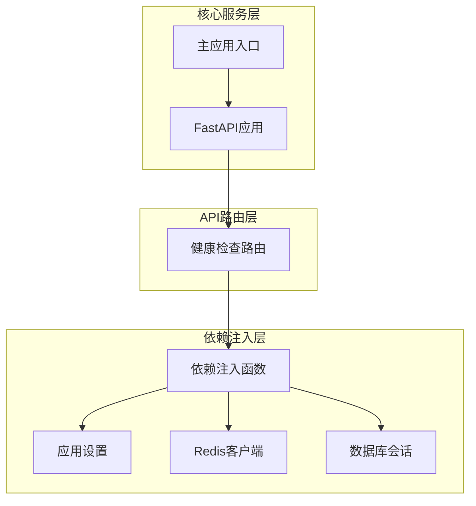
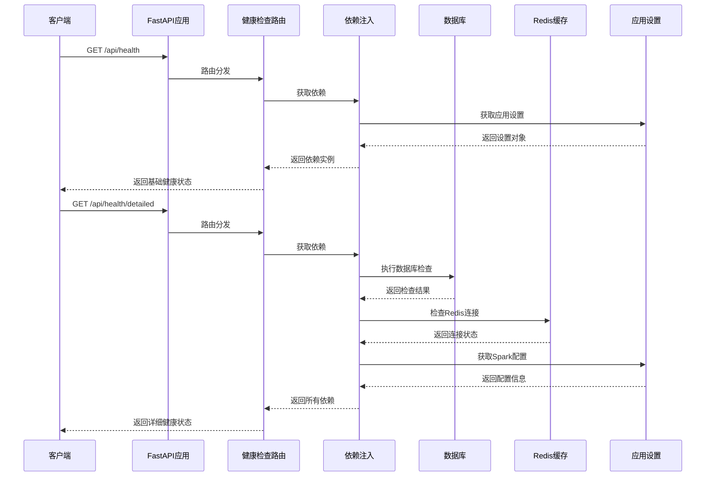
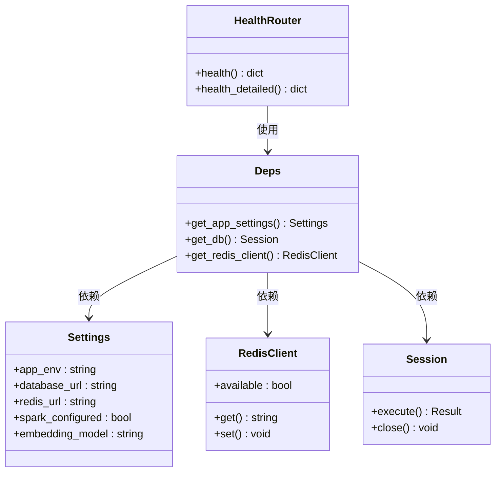
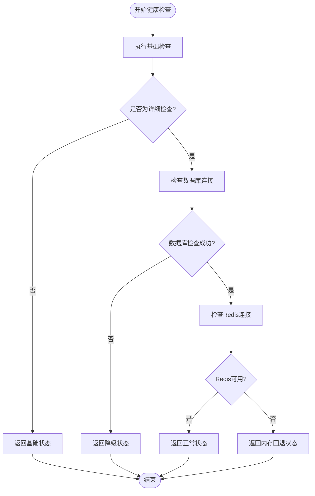
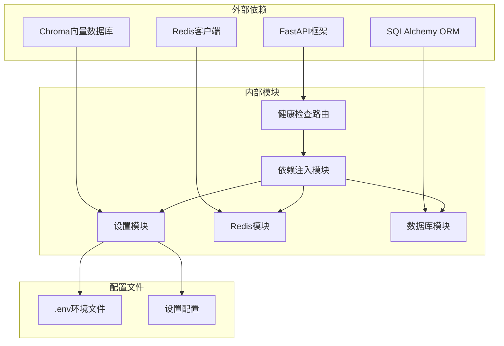

# 健康检查接口

<cite>
**本文档引用的文件**
- [api/routes/health.py](file://api/routes/health.py)
- [backend/main.py](file://backend/main.py)
- [backend/settings.py](file://backend/settings.py)
- [backend/core/redis_client.py](file://backend/core/redis_client.py)
- [backend/core/deps.py](file://backend/core/deps.py)
- [database/session.py](file://database/session.py)
- [rag/vector_store.py](file://rag/vector_store.py)
</cite>

## 目录
1. [简介](#简介)
2. [项目结构](#项目结构)
3. [核心组件](#核心组件)
4. [架构概览](#架构概览)
5. [详细组件分析](#详细组件分析)
6. [依赖关系分析](#依赖关系分析)
7. [性能考虑](#性能考虑)
8. [故障排除指南](#故障排除指南)
9. [结论](#结论)

## 简介

EduAgent健康检查接口提供了系统运行状态的实时监控能力，通过两个端点 `/api/health` 和 `/api/health/detailed` 来展示应用的基础健康状态和详细运行状态。该接口对于运维监控、容器编排、负载均衡和故障检测具有重要意义。

## 项目结构

健康检查功能位于API路由模块中，采用FastAPI框架构建，与主应用在同一进程中运行，确保了检查的准确性和实时性。



**图表来源**
- [api/routes/health.py:11](file://api/routes/health.py#L11)
- [backend/main.py:61](file://backend/main.py#L61)
- [backend/core/deps.py:12](file://backend/core/deps.py#L12)

**章节来源**
- [api/routes/health.py:1-52](file://api/routes/health.py#L1-L52)
- [backend/main.py:46-70](file://backend/main.py#L46-L70)

## 核心组件

健康检查接口由以下核心组件构成：

### 路由定义
- **基础健康检查路由**: `/api/health`
- **详细健康检查路由**: `/api/health/detailed`

### 依赖注入系统
- 应用设置获取器：`get_app_settings`
- 数据库会话管理：`get_db`
- Redis客户端管理：`get_redis_client`

### 状态监控组件
- 数据库连接状态检查
- Redis连接状态检查
- Spark配置状态验证
- 向量数据库状态监控

**章节来源**
- [api/routes/health.py:11-11](file://api/routes/health.py#L11-L11)
- [backend/core/deps.py:20-26](file://backend/core/deps.py#L20-L26)

## 架构概览

健康检查接口采用分层架构设计，确保了系统的可维护性和扩展性。



**图表来源**
- [api/routes/health.py:14-24](file://api/routes/health.py#L14-L24)
- [api/routes/health.py:27-52](file://api/routes/health.py#L27-L52)
- [backend/core/deps.py:12-26](file://backend/core/deps.py#L12-L26)

## 详细组件分析

### 基础健康检查端点

#### 端点规范
- **HTTP方法**: GET
- **URL路径**: `/api/health`
- **请求参数**: 无
- **响应格式**: JSON对象

#### 响应字段说明
| 字段名 | 类型 | 描述 | 示例值 |
|--------|------|------|--------|
| status | string | 应用整体状态 | "ok" |
| env | string | 应用环境类型 | "development" |
| spark | string | Spark配置状态 | "configured" 或 "not_configured" |
| spark_mode | string | Spark API类型 | "websocket" 或 "http" |
| embedding_model | string | 嵌入模型名称 | "BAAI/bge-small-zh-v1.5" |

#### 响应示例
```json
{
    "status": "ok",
    "env": "development",
    "spark": "configured",
    "spark_mode": "websocket",
    "embedding_model": "BAAI/bge-small-zh-v1.5"
}
```

**章节来源**
- [api/routes/health.py:14-24](file://api/routes/health.py#L14-L24)

### 详细健康检查端点

#### 端点规范
- **HTTP方法**: GET
- **URL路径**: `/api/health/detailed`
- **请求参数**: 无
- **响应格式**: JSON对象

#### 响应字段说明
| 字段名 | 类型 | 描述 | 示例值 |
|--------|------|------|--------|
| status | string | 应用整体状态 | "ok" 或 "degraded" |
| env | string | 应用环境类型 | "development" |
| database | string | 数据库连接状态 | "ok" 或具体错误信息 |
| redis | string | Redis连接状态 | "ok" 或 "unavailable (memory fallback)" |
| spark | string | Spark配置状态 | "configured" 或 "not_configured" |
| spark_mode | string | Spark API类型 | "websocket" 或 "http" |
| spark_domain | string | Spark域名 | "4.0Ultra" |
| embedding_model | string | 嵌入模型名称 | "BAAI/bge-small-zh-v1.5" |
| chroma_dir | string | 向量数据库持久化目录 | "./vector_db/chroma" |

#### 状态码说明
- **200 OK**: 请求成功，返回健康检查状态
- **500 Internal Server Error**: 服务器内部错误

#### 响应示例
```json
{
    "status": "ok",
    "env": "development",
    "database": "ok",
    "redis": "ok",
    "spark": "configured",
    "spark_mode": "websocket",
    "spark_domain": "4.0Ultra",
    "embedding_model": "BAAI/bge-small-zh-v1.5",
    "chroma_dir": "./vector_db/chroma"
}
```

**章节来源**
- [api/routes/health.py:27-52](file://api/routes/health.py#L27-L52)

### 依赖注入机制

健康检查接口通过依赖注入系统获取所需的运行时资源：



**图表来源**
- [api/routes/health.py:7-9](file://api/routes/health.py#L7-L9)
- [backend/core/deps.py:12-26](file://backend/core/deps.py#L12-L26)
- [backend/settings.py:6-66](file://backend/settings.py#L6-L66)

**章节来源**
- [backend/core/deps.py:12-26](file://backend/core/deps.py#L12-L26)
- [backend/core/redis_client.py:12-63](file://backend/core/redis_client.py#L12-L63)
- [database/session.py:14-22](file://database/session.py#L14-L22)

### 错误处理机制

健康检查接口实现了完善的错误处理策略：



**图表来源**
- [api/routes/health.py:33-40](file://api/routes/health.py#L33-L40)
- [backend/core/redis_client.py:22-30](file://backend/core/redis_client.py#L22-L30)

**章节来源**
- [api/routes/health.py:33-40](file://api/routes/health.py#L33-L40)
- [backend/core/redis_client.py:12-30](file://backend/core/redis_client.py#L12-L30)

## 依赖关系分析

健康检查接口的依赖关系体现了清晰的关注点分离：



**图表来源**
- [backend/main.py:15](file://backend/main.py#L15)
- [backend/settings.py:64-66](file://backend/settings.py#L64-L66)

**章节来源**
- [backend/main.py:15-18](file://backend/main.py#L15-L18)
- [backend/settings.py:64-66](file://backend/settings.py#L64-L66)

## 性能考虑

健康检查接口在设计时充分考虑了性能影响：

### 内存优化
- Redis客户端支持内存回退模式，当Redis不可用时自动切换到内存存储
- 数据库连接检查使用轻量级查询，避免对生产环境造成压力

### 缓存策略
- 设置信息使用LRU缓存，减少重复读取开销
- 向量数据库客户端使用缓存机制，避免重复初始化

### 异常处理
- 所有检查操作都包含异常捕获，确保单个组件故障不影响整体健康检查
- 数据库检查采用try-except模式，避免异常传播影响应用稳定性

## 故障排除指南

### 常见问题诊断

#### 数据库连接问题
**症状**: 详细健康检查返回降级状态
**诊断步骤**:
1. 检查数据库URL配置是否正确
2. 验证数据库服务是否正常运行
3. 确认网络连接是否畅通
4. 查看数据库日志获取详细错误信息

**解决方案**:
- 更新正确的数据库连接字符串
- 重启数据库服务
- 检查防火墙设置
- 验证数据库凭据

#### Redis连接问题
**症状**: Redis状态显示为内存回退模式
**诊断步骤**:
1. 检查Redis服务器状态
2. 验证Redis连接URL配置
3. 确认Redis服务端口开放
4. 检查Redis认证配置

**解决方案**:
- 启动Redis服务
- 修复连接URL配置
- 开放必要的防火墙端口
- 配置正确的认证信息

#### Spark配置问题
**症状**: Spark状态显示未配置
**诊断步骤**:
1. 检查Spark应用ID配置
2. 验证API密钥配置
3. 确认API类型配置
4. 验证Spark域名配置

**解决方案**:
- 填写完整的Spark应用配置
- 更新有效的API密钥
- 选择正确的API类型
- 配置正确的Spark域名

### 监控集成建议

#### Kubernetes集成
```yaml
livenessProbe:
  httpGet:
    path: /api/health
    port: 8001
  initialDelaySeconds: 30
  periodSeconds: 10

readinessProbe:
  httpGet:
    path: /api/health
    port: 8001
  initialDelaySeconds: 5
  periodSeconds: 5
```

#### Prometheus集成
```prometheus
# 健康检查指标
health_status{endpoint="/api/health"} 1
health_status{endpoint="/api/health/detailed"} 1

# 错误计数器
health_check_errors_total{endpoint="/api/health"} 0
health_check_errors_total{endpoint="/api/health/detailed"} 0
```

#### 日志监控
- 健康检查成功: `INFO - 健康检查通过`
- Redis不可用: `WARNING - Redis 不可用，使用内存缓存`
- 数据库连接失败: `ERROR - 数据库连接检查失败: [错误信息]`

**章节来源**
- [backend/core/redis_client.py:29](file://backend/core/redis_client.py#L29)
- [api/routes/health.py:37](file://api/routes/health.py#L37)

## 结论

EduAgent健康检查接口提供了全面的系统监控能力，通过基础和详细两个层次的检查，能够有效监控应用的核心运行状态。接口设计简洁高效，错误处理完善，为系统的稳定运行提供了重要保障。

### 主要优势
- **双层检查机制**: 基础检查快速响应，详细检查全面覆盖
- **完善的错误处理**: 单点故障不影响整体监控
- **灵活的配置管理**: 支持多种部署环境和配置方式
- **易于集成**: 符合标准的RESTful API设计

### 最佳实践建议
- 在生产环境中定期调用健康检查接口进行监控
- 结合容器编排平台的健康检查功能使用
- 建立基于健康检查状态的告警机制
- 定期审查和更新健康检查配置