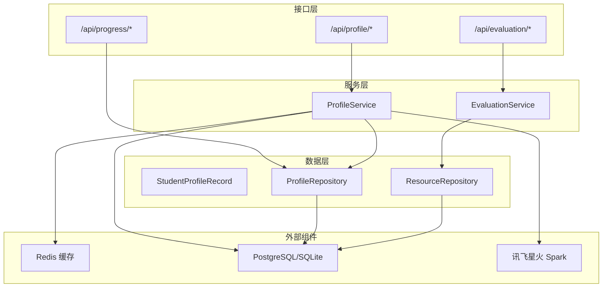
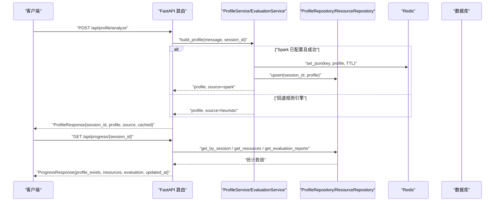
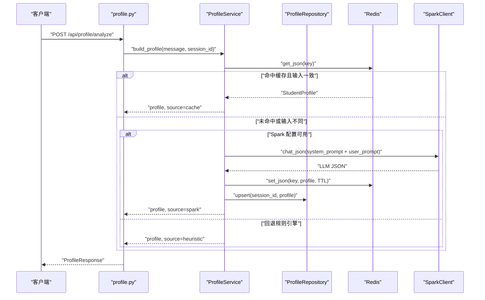
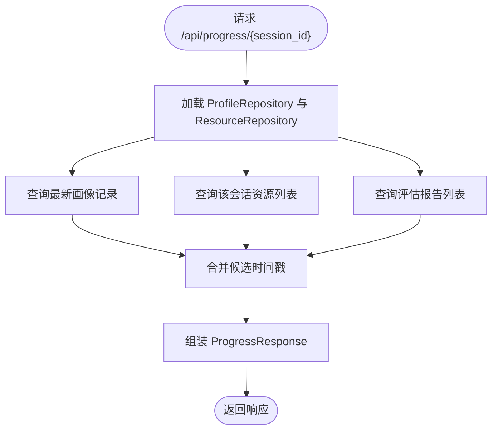
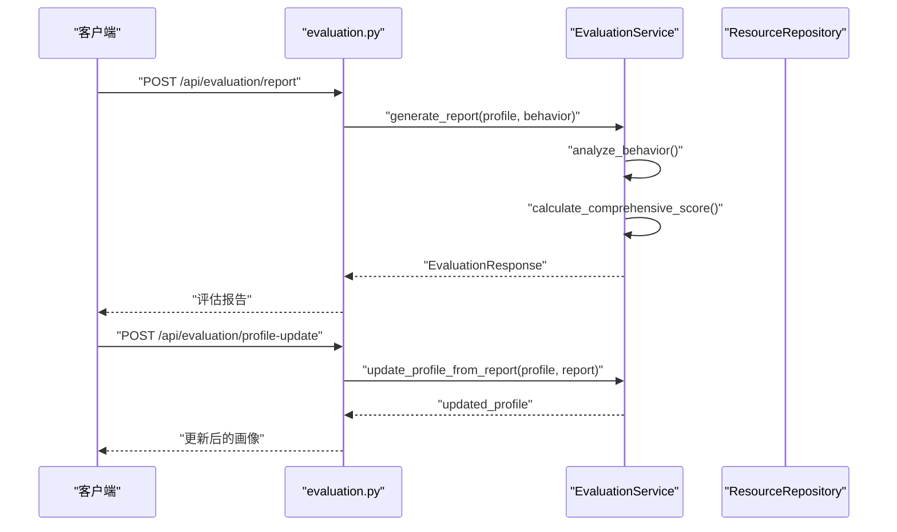
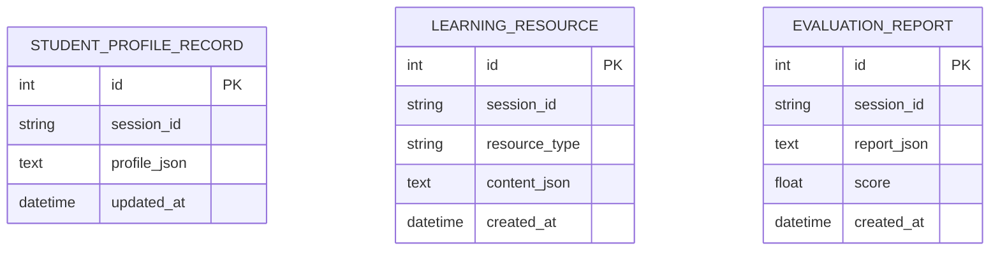
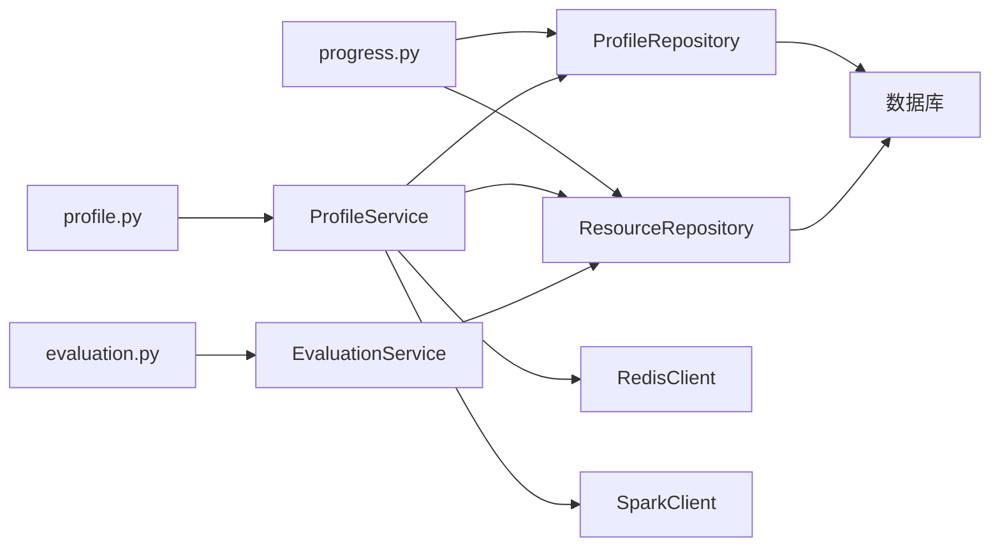

# 学生画像接口

<cite>
**本文引用的文件**
- [api/route/profile.py](file://api/routes/profile.py)
- [schemas/profile.py](file://schemas/profile.py)
- [services/profile_service.py](file://services/profile_service.py)
- [agents/profile_agent.py](file://agents/profile_agent.py)
- [database/models.py](file://database/models.py)
- [database/repository.py](file://database/repository.py)
- [prompts/profile_agent.md](file://prompts/profile_agent.md)
- [backend/settings.py](file://backend/settings.py)
- [api/route/progress.py](file://api/route/progress.py)
- [api/route/evaluation.py](file://api/route/evaluation.py)
- [services/evaluation_service.py](file://services/evaluation_service.py)
- [backend/main.py](file://backend/main.py)
- [README.md](file://README.md)
- [software_cup_ai_education_system_architecture.md](file://software_cup_ai_education_system_architecture.md)
</cite>

## 目录
1. [简介](#简介)
2. [项目结构](#项目结构)
3. [核心组件](#核心组件)
4. [架构总览](#架构总览)
5. [详细组件分析](#详细组件分析)
6. [依赖分析](#依赖分析)
7. [性能考虑](#性能考虑)
8. [故障排查指南](#故障排查指南)
9. [结论](#结论)
10. [附录](#附录)

## 简介
本文件为 EduAgent 学生画像接口的完整 API 文档，覆盖学生画像的构建、查询、缓存与持久化，以及与学习评估闭环的联动更新。文档聚焦以下能力：
- 学生画像构建与查询：支持对话式分析与批量构建，返回结构化画像与来源标记
- 学习进度跟踪：按会话聚合画像、资源与评估数据，提供最新更新时间
- 学习评估闭环：基于学习行为数据生成评估报告，并可将评估结果回写更新画像
- 数据验证与隐私：Pydantic 模型校验、缓存 TTL、敏感信息处理与密钥安全
- 更新策略与同步：Redis 缓存 + 数据库存储双写，画像变更触发资源与路径的动态优化

## 项目结构
围绕“学生画像”相关的核心模块与文件如下：
- 接口层：api/routes/profile.py、api/route/progress.py、api/route/evaluation.py
- 数据模型：schemas/profile.py
- 服务层：services/profile_service.py、services/evaluation_service.py
- 数据访问：database/models.py、database/repository.py
- 配置与提示：backend/settings.py、prompts/profile_agent.md
- 工作流与入口：agents/profile_agent.py、backend/main.py
- 文档与架构：README.md、software_cup_ai_education_system_architecture.md

**图表来源**
- [api/routes/profile.py:14-57](file://api/routes/profile.py#L14-L57)
- [api/route/progress.py:12-99](file://api/route/progress.py#L12-L99)
- [api/route/evaluation.py:17-119](file://api/route/evaluation.py#L17-L119)
- [services/profile_service.py:90-166](file://services/profile_service.py#L90-L166)
- [services/evaluation_service.py:89-251](file://services/evaluation_service.py#L89-L251)
- [database/repository.py:12-117](file://database/repository.py#L12-L117)
- [database/models.py:13-40](file://database/models.py#L13-L40)

**章节来源**
- [backend/main.py:61-69](file://backend/main.py#L61-L69)
- [README.md:93-115](file://README.md#L93-L115)

## 核心组件
- 学生画像模型：StudentProfile、ProfileBuildRequest、ProfileResponse
- 画像服务：ProfileService（缓存、持久化、Spark/规则引擎）
- 评估服务：EvaluationService（行为分析、指标计算、报告生成、画像更新）
- 数据模型与仓储：StudentProfileRecord、ProfileRepository、ResourceRepository
- 进度接口：按会话聚合画像、资源与评估统计
- 配置与提示：Settings、profile_agent.md

**章节来源**
- [schemas/profile.py:8-36](file://schemas/profile.py#L8-L36)
- [schemas/profile.py:39-42](file://schemas/profile.py#L39-L42)
- [schemas/profile.py:91-96](file://schemas/profile.py#L91-L96)
- [services/profile_service.py:90-166](file://services/profile_service.py#L90-L166)
- [services/evaluation_service.py:89-251](file://services/evaluation_service.py#L89-L251)
- [database/models.py:13-20](file://database/models.py#L13-L20)
- [database/repository.py:12-44](file://database/repository.py#L12-L44)
- [api/route/progress.py:26-32](file://api/route/progress.py#L26-L32)
- [backend/settings.py:51-51](file://backend/settings.py#L51-L51)

## 架构总览
学生画像接口以 FastAPI 路由为入口，调用 ProfileService 与 EvaluationService，结合 Redis 缓存与数据库实现高性能与持久化。画像构建优先使用 Spark，失败时回退至规则引擎；评估报告生成与画像更新通过统一的服务层完成。

**图表来源**
- [api/routes/profile.py:21-57](file://api/routes/profile.py#L21-L57)
- [services/profile_service.py:124-166](file://services/profile_service.py#L124-L166)
- [database/repository.py:16-44](file://database/repository.py#L16-L44)
- [api/route/progress.py:44-99](file://api/route/progress.py#L44-L99)

## 详细组件分析

### 1) 学生画像构建与查询
- 接口
  - POST /api/profile/analyze：对话式分析，无 session_id 时自动生成
  - POST /api/profile/build：构建完整画像，use_cache=false 强制刷新
  - GET /api/profile/{session_id}：按会话查询缓存或数据库中的画像
- 请求参数
  - ProfileBuildRequest：message（必填，最小长度1）、session_id（可选，1~64字符）
- 响应
  - ProfileResponse：session_id、profile（StudentProfile）、source（spark/heuristic）、cached（默认false）
- 数据模型
  - StudentProfile：包含知识水平、学习风格、薄弱点、目标标识、每日学习时长、专业、学习目标原文、学习基础描述、风格原文、原始输入等字段
- 缓存与持久化
  - 缓存键前缀 eduagent:profile:{session_id}，TTL 来自 Settings.profile_cache_ttl
  - 优先从 Redis 读取，缺失则回退数据库；写入时同时更新 Redis 与数据库
- 错误处理
  - 查询不到画像返回 404

**图表来源**
- [api/routes/profile.py:21-57](file://api/routes/profile.py#L21-L57)
- [services/profile_service.py:124-166](file://services/profile_service.py#L124-L166)
- [backend/settings.py:51-51](file://backend/settings.py#L51-L51)
- [prompts/profile_agent.md:1-28](file://prompts/profile_agent.md#L1-L28)

**章节来源**
- [api/routes/profile.py:21-57](file://api/routes/profile.py#L21-L57)
- [schemas/profile.py:8-36](file://schemas/profile.py#L8-L36)
- [schemas/profile.py:39-42](file://schemas/profile.py#L39-L42)
- [schemas/profile.py:91-96](file://schemas/profile.py#L91-L96)
- [services/profile_service.py:106-123](file://services/profile_service.py#L106-L123)
- [database/repository.py:24-36](file://database/repository.py#L24-L36)
- [backend/settings.py:51-51](file://backend/settings.py#L51-L51)
- [prompts/profile_agent.md:1-28](file://prompts/profile_agent.md#L1-L28)

### 2) 学习进度跟踪
- 接口：GET /api/progress/{session_id}
- 功能：统计该会话下画像是否存在、资源数量与类型分布、评估报告数量与最新分数/等级，以及最终更新时间
- 响应：ProgressResponse 包含 session_id、profile_exists、resources（总数与按类型计数）、evaluation（报告总数、最新分数与等级）、updated_at（最近时间）

**图表来源**
- [api/route/progress.py:44-99](file://api/route/progress.py#L44-L99)
- [database/repository.py:16-44](file://database/repository.py#L16-L44)
- [database/repository.py:62-99](file://database/repository.py#L62-L99)

**章节来源**
- [api/route/progress.py:26-32](file://api/route/progress.py#L26-L32)
- [api/route/progress.py:44-99](file://api/route/progress.py#L44-L99)
- [database/models.py:13-20](file://database/models.py#L13-L20)
- [database/models.py:22-40](file://database/models.py#L22-L40)
- [database/repository.py:16-44](file://database/repository.py#L16-L44)
- [database/repository.py:62-99](file://database/repository.py#L62-L99)

### 3) 学习评估与画像更新
- 接口
  - POST /api/evaluation/report：生成评估报告（综合评分、等级、评语、维度分析、优劣势、建议）
  - POST /api/evaluation/behavior：提交学习行为数据，返回维度分析
  - GET /api/evaluation/metrics：返回评估指标说明
  - POST /api/evaluation/profile-update：根据评估报告更新学生画像
- 请求与响应
  - LearningBehaviorRequest：学习时长、练习结果、知识掌握度、资源使用次数
  - EvaluationRequest：student_profile（字典）、learning_behavior（LearningBehaviorRequest）
  - EvaluationResponse：score、level、comment、analysis、strengths、weaknesses、suggestions、evaluated
- 评估指标与权重
  - 维度：练习正确率、知识掌握度得分、资源利用率、学习投入度
  - 综合评分按权重加权计算，等级划分（优秀/良好/中等/需改进）
- 画像更新
  - 将评估报告中的分析与得分写入画像，形成动态更新

**图表来源**
- [api/route/evaluation.py:58-119](file://api/route/evaluation.py#L58-L119)
- [services/evaluation_service.py:89-251](file://services/evaluation_service.py#L89-L251)
- [database/repository.py:81-99](file://database/repository.py#L81-L99)

**章节来源**
- [api/route/evaluation.py:29-56](file://api/route/evaluation.py#L29-L56)
- [api/route/evaluation.py:58-119](file://api/route/evaluation.py#L58-L119)
- [services/evaluation_service.py:11-48](file://services/evaluation_service.py#L11-L48)
- [services/evaluation_service.py:89-251](file://services/evaluation_service.py#L89-L251)

### 4) 数据模型与仓储
- 数据模型
  - StudentProfileRecord：session_id、profile_json、updated_at
  - LearningResource：session_id、resource_type、content_json、created_at
  - EvaluationReport：session_id、report_json、score、created_at
- 仓储
  - ProfileRepository：按 session_id 查询最新画像、upsert 持久化
  - ResourceRepository：保存/查询学习资源与评估报告

**图表来源**
- [database/models.py:13-20](file://database/models.py#L13-L20)
- [database/models.py:22-40](file://database/models.py#L22-L40)

**章节来源**
- [database/models.py:13-20](file://database/models.py#L13-L20)
- [database/models.py:22-40](file://database/models.py#L22-L40)
- [database/repository.py:16-44](file://database/repository.py#L16-L44)
- [database/repository.py:50-99](file://database/repository.py#L50-L99)

### 5) 配置与提示
- 配置项
  - profile_cache_ttl：画像缓存过期时间（秒）
  - spark_*：星火 API 配置（WebSocket/HTTP）
- 提示模板
  - profile_agent.md：限定输出 JSON 字段与规则，确保 LLM 结构化输出

**章节来源**
- [backend/settings.py:51-61](file://backend/settings.py#L51-L61)
- [prompts/profile_agent.md:1-28](file://prompts/profile_agent.md#L1-L28)

## 依赖分析
- 组件耦合
  - 路由依赖服务层（ProfileService、EvaluationService）
  - 服务层依赖仓储层（ProfileRepository、ResourceRepository）
  - 服务层依赖外部组件（SparkClient、RedisClient、Settings）
- 外部依赖
  - Redis：缓存画像
  - PostgreSQL/SQLite：持久化画像与资源
  - 讯飞星火：结构化画像生成（可回退规则引擎）

**图表来源**
- [api/routes/profile.py:17-18](file://api/routes/profile.py#L17-L18)
- [api/routes/evaluation.py:19-26](file://api/routes/evaluation.py#L19-L26)
- [api/route/progress.py:49-50](file://api/route/progress.py#L49-L50)
- [services/profile_service.py:90-101](file://services/profile_service.py#L90-L101)
- [services/evaluation_service.py:89-93](file://services/evaluation_service.py#L89-L93)
- [database/repository.py:12-117](file://database/repository.py#L12-L117)

**章节来源**
- [backend/main.py:61-69](file://backend/main.py#L61-L69)
- [services/profile_service.py:90-101](file://services/profile_service.py#L90-L101)
- [services/evaluation_service.py:89-93](file://services/evaluation_service.py#L89-L93)

## 性能考虑
- 缓存策略
  - Redis 缓存画像，命中直接返回，避免重复调用 Spark
  - 缓存 TTL 由 Settings.profile_cache_ttl 控制，默认 3600 秒
- 数据库优化
  - 以 session_id 建索引，加速画像与资源查询
  - upsert 操作仅在变更时更新 updated_at，减少无效写入
- 评估计算
  - 行为分析与指标计算为纯内存运算，复杂度低
  - 综合评分按固定权重加权，避免昂贵的机器学习推理

[本节为通用性能讨论，无需列出具体文件来源]

## 故障排查指南
- 画像查询 404
  - 现象：GET /api/profile/{session_id} 返回 404
  - 原因：Redis 与数据库均无对应 session_id 的画像
  - 处理：先调用 /api/profile/analyze 或 /api/profile/build 生成画像
- Spark 配置错误
  - 现象：画像构建失败回退规则引擎
  - 原因：SPARK_APP_ID/API_KEY/API_SECRET 未正确配置
  - 处理：检查 .env 文件与 Settings.spark_configured
- 评估失败
  - 现象：POST /api/evaluation/report 返回 500
  - 原因：行为数据格式异常或服务内部异常
  - 处理：核对 LearningBehaviorRequest 字段，查看后端日志
- 密钥安全
  - 说明：不要将真实密钥提交到仓库，误提交需立即轮换

**章节来源**
- [api/routes/profile.py:40-43](file://api/routes/profile.py#L40-L43)
- [services/profile_service.py:138-147](file://services/profile_service.py#L138-L147)
- [api/route/evaluation.py:70-72](file://api/route/evaluation.py#L70-L72)
- [backend/settings.py:58-61](file://backend/settings.py#L58-L61)
- [README.md:52-62](file://README.md#L52-L62)

## 结论
学生画像接口通过“对话式分析 + 规则引擎兜底”的双通道设计，结合 Redis 缓存与数据库持久化，实现了高可用、可扩展的画像服务能力。配合学习评估闭环，系统能够持续优化学习路径与资源推荐，形成“画像-规划-资源-评估-画像”的动态优化链路。

[本节为总结性内容，无需列出具体文件来源]

## 附录

### A. 接口清单与规范
- 学生画像
  - POST /api/profile/analyze
    - 请求体：ProfileBuildRequest
    - 响应体：ProfileResponse
  - POST /api/profile/build
    - 请求体：ProfileBuildRequest
    - 响应体：ProfileResponse
  - GET /api/profile/{session_id}
    - 路径参数：session_id
    - 响应体：ProfileResponse
- 学习进度
  - GET /api/progress/{session_id}
    - 响应体：ProgressResponse
- 学习评估
  - POST /api/evaluation/report
    - 请求体：EvaluationRequest
    - 响应体：EvaluationResponse
  - POST /api/evaluation/behavior
    - 请求体：LearningBehaviorRequest
    - 响应体：{"success": true, "analysis": ...}
  - GET /api/evaluation/metrics
    - 响应体：指标说明映射
  - POST /api/evaluation/profile-update
    - 请求体：student_profile（字典）、report（字典）
    - 响应体：{"success": true, "updated_profile": ...}

**章节来源**
- [api/routes/profile.py:21-57](file://api/routes/profile.py#L21-L57)
- [api/route/progress.py:44-99](file://api/route/progress.py#L44-L99)
- [api/route/evaluation.py:58-119](file://api/route/evaluation.py#L58-L119)
- [README.md:95-115](file://README.md#L95-L115)

### B. 数据验证规则
- ProfileBuildRequest
  - message：必填，最小长度 1
  - session_id：可选，长度 1~64
- StudentProfile
  - 字段默认值与枚举范围在模型中定义（如 knowledge_level、learning_style、goal 等）
- 评估请求
  - LearningBehaviorRequest：字段均为数值或字典，提供默认空值
  - EvaluationRequest：student_profile 为字典，learning_behavior 为结构化对象

**章节来源**
- [schemas/profile.py:39-42](file://schemas/profile.py#L39-L42)
- [schemas/profile.py:8-36](file://schemas/profile.py#L8-L36)
- [api/route/evaluation.py:29-43](file://api/route/evaluation.py#L29-L43)

### C. 画像更新策略与数据同步
- 更新策略
  - 评估完成后，调用 /api/evaluation/profile-update 将评估分析与得分写入画像
  - 画像字段新增 last_evaluated、evaluation_score、evaluation_level、evaluation_analysis、knowledge_mastery
- 数据同步
  - Redis 缓存与数据库双写，保证查询一致性
  - 进度接口按最近时间戳聚合画像、资源与评估的更新时间

**章节来源**
- [services/evaluation_service.py:225-241](file://services/evaluation_service.py#L225-L241)
- [services/profile_service.py:115-122](file://services/profile_service.py#L115-L122)
- [api/route/progress.py:73-87](file://api/route/progress.py#L73-L87)

### D. 隐私保护与密钥安全
- 密钥管理
  - 仅在本地 .env 中配置，不在仓库中提交
  - 若误提交，需立即在控制台轮换密钥
- 数据处理
  - 画像与资源以 JSON 形式存储，注意避免敏感字段泄露
  - 评估报告包含学习行为数据，需遵循最小化原则

**章节来源**
- [README.md:52-62](file://README.md#L52-L62)