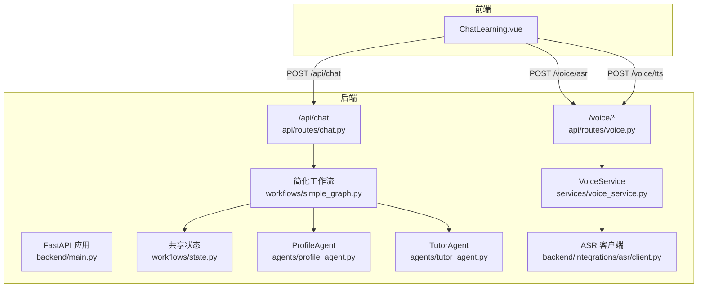
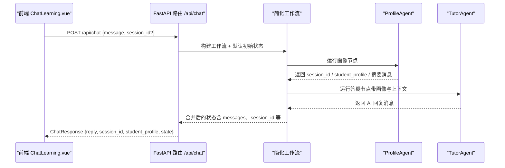
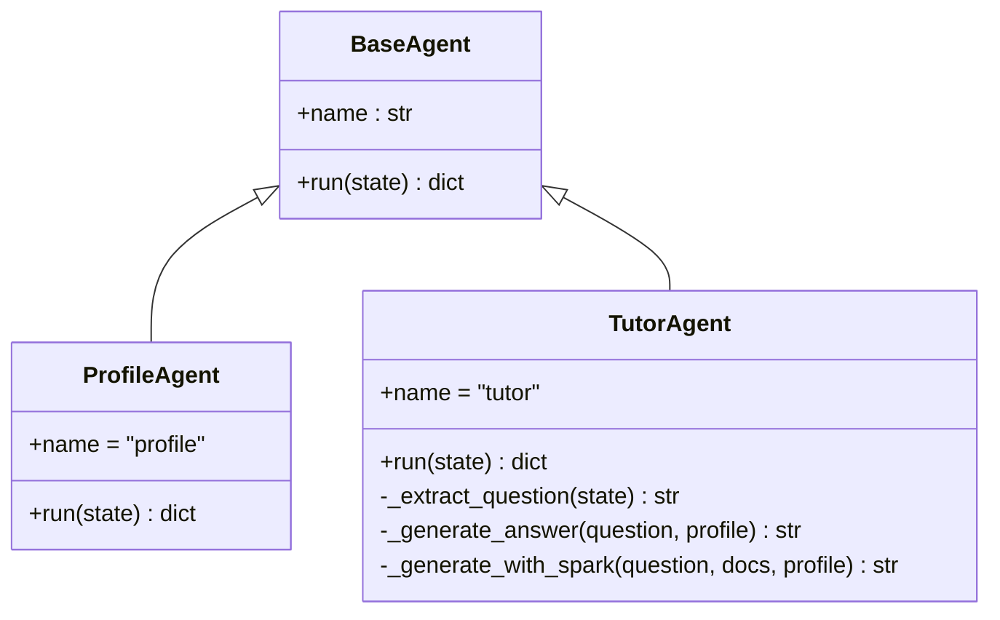
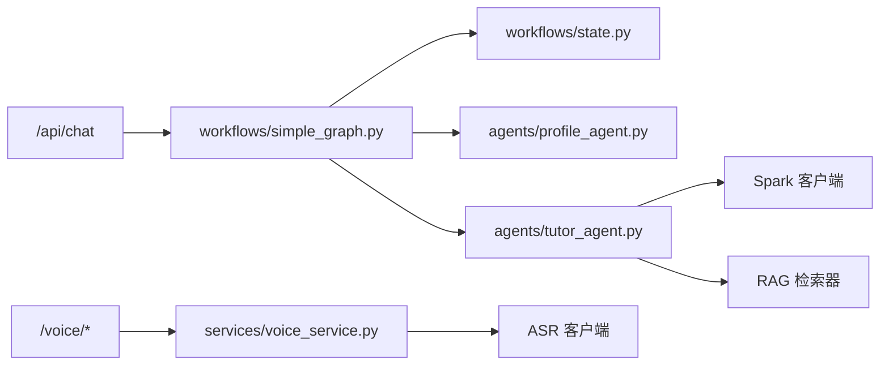

# 对话学习接口

<cite>
**本文引用的文件**
- [backend/main.py](file://backend/main.py)
- [api/routes/chat.py](file://api/routes/chat.py)
- [workflows/simple_graph.py](file://workflows/simple_graph.py)
- [workflows/state.py](file://workflows/state.py)
- [agents/base.py](file://agents/base.py)
- [agents/profile_agent.py](file://agents/profile_agent.py)
- [agents/tutor_agent.py](file://agents/tutor_agent.py)
- [api/routes/voice.py](file://api/routes/voice.py)
- [services/voice_service.py](file://services/voice_service.py)
- [backend/integrations/asr/client.py](file://backend/integrations/asr/client.py)
- [backend/settings.py](file://backend/settings.py)
- [frontend/src/components/ChatLearning.vue](file://frontend/src/components/ChatLearning.vue)
- [README.md](file://README.md)
</cite>

## 目录
1. [简介](#简介)
2. [项目结构](#项目结构)
3. [核心组件](#核心组件)
4. [架构总览](#架构总览)
5. [详细组件分析](#详细组件分析)
6. [依赖分析](#依赖分析)
7. [性能考虑](#性能考虑)
8. [故障排查指南](#故障排查指南)
9. [结论](#结论)
10. [附录](#附录)

## 简介
本文件为 EduAgent 对话学习接口的完整 API 文档，覆盖以下要点：
- 对话交互端点：消息发送、会话管理、上下文维护
- 请求与响应规范：HTTP 方法、URL 模式、参数与字段、状态码与错误信息
- 实时对话示例：从用户输入到 AI 回复的端到端流程
- 会话恢复机制：基于 session_id 的状态延续
- 消息流控制：消息追加、状态合并、多智能体协作
- 高级功能：语音转文字（ASR）、语音合成（TTS）、多模态交互（语音输入/输出）与安全策略

## 项目结构
后端采用 FastAPI，路由集中于 api/routes；对话学习由工作流驱动，核心状态由 workflows/state.py 定义；多智能体位于 agents/，其中 ProfileAgent 负责画像与会话 ID，TutorAgent 负责答疑与安全过滤；语音能力通过 services/voice_service.py 封装 ASR/TTS，并在 api/routes/voice.py 暴露 HTTP 接口。

图表来源
- [backend/main.py:46-70](file://backend/main.py#L46-L70)
- [api/routes/chat.py:23-37](file://api/routes/chat.py#L23-L37)
- [workflows/simple_graph.py:37-59](file://workflows/simple_graph.py#L37-L59)
- [workflows/state.py:7-24](file://workflows/state.py#L7-L24)
- [agents/profile_agent.py:12-40](file://agents/profile_agent.py#L12-L40)
- [agents/tutor_agent.py:90-153](file://agents/tutor_agent.py#L90-L153)
- [api/routes/voice.py:18-64](file://api/routes/voice.py#L18-L64)
- [services/voice_service.py:12-51](file://services/voice_service.py#L12-L51)
- [backend/integrations/asr/client.py:18-95](file://backend/integrations/asr/client.py#L18-L95)

章节来源
- [backend/main.py:46-70](file://backend/main.py#L46-L70)
- [README.md:83-94](file://README.md#L83-L94)

## 核心组件
- 对话路由与模型
  - 路由：/api/chat
  - 请求模型 ChatRequest：包含 message（必填）、session_id（可选）
  - 响应模型 ChatResponse：包含 reply、session_id、student_profile、state
- 工作流与状态
  - 简化工作流：画像 → 规划 → 知识拆解 → 答疑
  - 默认初始状态：包含 user_input、session_id、messages（追加）
- 智能体
  - ProfileAgent：构建学生画像、生成 session_id、追加摘要消息
  - TutorAgent：安全过滤、RAG 检索、星火问答、规则兜底
- 语音服务
  - ASR：/voice/asr（上传音频文件，返回文本）
  - TTS：/voice/tts（输入文本，返回音频）
  - 状态查询：/voice/status（返回 ASR/TTS 配置状态）

章节来源
- [api/routes/chat.py:11-37](file://api/routes/chat.py#L11-L37)
- [workflows/simple_graph.py:37-59](file://workflows/simple_graph.py#L37-L59)
- [workflows/state.py:7-24](file://workflows/state.py#L7-L24)
- [agents/profile_agent.py:12-40](file://agents/profile_agent.py#L12-L40)
- [agents/tutor_agent.py:90-153](file://agents/tutor_agent.py#L90-L153)
- [api/routes/voice.py:18-64](file://api/routes/voice.py#L18-L64)

## 架构总览
对话学习接口以“请求 → 工作流 → 智能体 → 状态合并 → 响应”的链路运行。前端通过 /api/chat 发起对话，后端构建工作流与初始状态，依次执行各智能体节点，最终将 AI 回复与当前状态返回给前端。

图表来源
- [api/routes/chat.py:23-37](file://api/routes/chat.py#L23-L37)
- [workflows/simple_graph.py:37-59](file://workflows/simple_graph.py#L37-L59)
- [agents/profile_agent.py:17-40](file://agents/profile_agent.py#L17-L40)
- [agents/tutor_agent.py:99-153](file://agents/tutor_agent.py#L99-L153)

## 详细组件分析

### 对话接口：/api/chat
- HTTP 方法与路径
  - POST /api/chat
- 请求体
  - message: 字符串，必填，用户自然语言输入
  - session_id: 字符串，可选，用于会话恢复
- 响应体
  - reply: 字符串，AI 回复内容
  - session_id: 字符串，可选，后端生成或沿用
  - student_profile: 字典，可选，学生画像
  - state: 字典，当前工作流状态快照
- 行为说明
  - 构建简化工作流与默认初始状态（包含 user_input、session_id、messages）
  - 执行工作流，收集 messages 中 role=assistant 的内容拼接为 reply
  - 返回 ChatResponse
- 状态码
  - 200 OK：成功
  - 500 Internal Server Error：内部异常
  - 503 Service Unavailable：工作流执行异常（如外部服务不可用）
- 示例
  - 请求：POST /api/chat，Body: {"message":"你好"}
  - 响应：{"reply":"...","session_id":"...","student_profile":{...},"state":{...}}

章节来源
- [api/routes/chat.py:23-37](file://api/routes/chat.py#L23-L37)
- [workflows/simple_graph.py:53-59](file://workflows/simple_graph.py#L53-L59)

### 会话管理与上下文维护
- 会话 ID
  - 若请求未提供 session_id，ProfileAgent 会生成新的 session_id
  - 后续请求携带同一 session_id 可实现会话恢复
- 上下文
  - 初始状态 messages 追加用户输入
  - 各智能体运行后将消息合并回状态 messages
  - TutorAgent 基于最新 messages 提取用户问题并生成回复
- 状态字段
  - student_profile：学生画像
  - learning_path / knowledge_tree / ppt_deck / quiz_set / code_set / mindmap / video_script / resource_result / evaluation_report / evaluation_suggestions：可扩展的资源与评估字段
  - loop_count：循环计数（用于工作流控制）
  - session_id：会话标识
  - user_input：最新用户输入

章节来源
- [agents/profile_agent.py:17-40](file://agents/profile_agent.py#L17-L40)
- [agents/tutor_agent.py:99-153](file://agents/tutor_agent.py#L99-L153)
- [workflows/state.py:7-24](file://workflows/state.py#L7-L24)

### 智能体职责与处理逻辑
- BaseAgent 抽象
  - run(state)：接收共享状态，返回需合并回状态的片段
- ProfileAgent
  - 生成 session_id（若缺失）
  - 构建学生画像并返回摘要消息
- TutorAgent
  - 安全过滤：屏蔽敏感关键词
  - RAG 检索 + 星火问答；若未配置则使用规则兜底
  - 从 messages 中提取最新用户问题

图表来源
- [agents/base.py:7-13](file://agents/base.py#L7-L13)
- [agents/profile_agent.py:12-40](file://agents/profile_agent.py#L12-L40)
- [agents/tutor_agent.py:90-153](file://agents/tutor_agent.py#L90-L153)

章节来源
- [agents/base.py:7-13](file://agents/base.py#L7-L13)
- [agents/profile_agent.py:12-40](file://agents/profile_agent.py#L12-L40)
- [agents/tutor_agent.py:90-153](file://agents/tutor_agent.py#L90-L153)

### 语音接口：ASR/TTS/状态
- 语音识别（ASR）
  - POST /voice/asr
  - 表单参数：
    - audio: 文件（wav/mp3/pcm）
    - format: 字符串，默认 wav
  - 成功返回：{"text": "..."}
  - 异常：
    - 503：ASR 未配置或连接失败
    - 500：其他异常
- 语音合成（TTS）
  - POST /voice/tts
  - 表单参数：
    - text: 字符串，要合成的文字
    - voice: 字符串，默认 xiaoyan
  - 成功返回：二进制音频（audio/mpeg）
  - 异常：
    - 503：TTS 未配置或连接失败
    - 500：其他异常
- 语音服务状态
  - GET /voice/status
  - 返回：{"asr_configured": bool, "tts_configured": bool, "fully_configured": bool}

章节来源
- [api/routes/voice.py:18-64](file://api/routes/voice.py#L18-L64)
- [services/voice_service.py:12-51](file://services/voice_service.py#L12-L51)
- [backend/integrations/asr/client.py:18-95](file://backend/integrations/asr/client.py#L18-L95)

### 前端集成与实时对话体验
- 前端组件 ChatLearning.vue
  - 保持原有 POST /api/chat 调用
  - 支持流式打字机效果、Markdown 渲染、代码高亮、消息操作（点赞/复制/重新生成）
  - 自动维护 session_id，首次响应后写入
- 关键交互
  - Enter 发送，Shift+Enter 换行
  - 重新生成：基于上一条用户消息再次调用 /api/chat
  - 清空对话：停止打字机、清空消息与 session_id

章节来源
- [frontend/src/components/ChatLearning.vue:133-182](file://frontend/src/components/ChatLearning.vue#L133-L182)
- [frontend/src/components/ChatLearning.vue:184-233](file://frontend/src/components/ChatLearning.vue#L184-L233)
- [frontend/src/components/ChatLearning.vue:260-266](file://frontend/src/components/ChatLearning.vue#L260-L266)

## 依赖分析
- 组件耦合
  - /api/chat 依赖 workflows/simple_graph 与 workflows/state
  - ProfileAgent 依赖数据库会话与 Redis 缓存
  - TutorAgent 依赖星火客户端与 RAG 检索器
  - /voice/* 依赖 VoiceService 与 ASR/TTS 客户端
- 外部依赖
  - 星火（Spark）：问答与语音服务
  - Redis：缓存与可用性降级
  - ChromaDB：RAG 向量存储
- 循环依赖
  - 未发现直接循环导入；工作流通过函数式节点组织，避免类继承循环

图表来源
- [api/routes/chat.py:23-37](file://api/routes/chat.py#L23-L37)
- [workflows/simple_graph.py:37-59](file://workflows/simple_graph.py#L37-L59)
- [agents/tutor_agent.py:90-153](file://agents/tutor_agent.py#L90-L153)
- [api/routes/voice.py:18-64](file://api/routes/voice.py#L18-L64)
- [services/voice_service.py:12-51](file://services/voice_service.py#L12-L51)

章节来源
- [backend/main.py:46-70](file://backend/main.py#L46-L70)
- [backend/settings.py:6-67](file://backend/settings.py#L6-L67)

## 性能考虑
- 工作流编排
  - 简化工作流减少节点数量，降低调用开销
  - 消息追加（messages: Annotated[list, operator.add]）避免深拷贝成本
- 缓存与降级
  - ProfileAgent 使用 Redis 缓存，减轻重复画像构建压力
  - TutorAgent 在星火未配置时启用规则兜底，保证可用性
- 语音服务
  - ASR/TTS 通过 WebSocket 传输，建议前端进行音频格式校验与压缩
- 数据库
  - 使用短 TTL 缓存画像，避免频繁 IO

## 故障排查指南
- /api/chat 返回 500
  - 检查工作流执行链路（ProfileAgent/TutorAgent）日志
  - 确认星火配置与网络连通性
- /voice/asr 返回 503
  - 检查 ASR 配置项（APPID/APIKey/API Secret）是否正确
  - 确认音频格式与大小限制
- /voice/tts 返回 503
  - 检查 TTS 配置项与 WebSocket 地址
- /api/health 与 /api/health/detailed
  - 使用健康检查接口确认数据库、Redis、向量库与星火配置状态

章节来源
- [api/routes/health.py:14-52](file://api/routes/health.py#L14-L52)
- [backend/integrations/asr/client.py:36-76](file://backend/integrations/asr/client.py#L36-L76)
- [services/voice_service.py:31-41](file://services/voice_service.py#L31-L41)

## 结论
对话学习接口以简洁的 /api/chat 为核心，结合 LangGraph 工作流与多智能体协作，实现了从学生画像到答疑辅导的完整闭环。配合 /voice/* 接口，可实现语音输入与输出的多模态交互。通过 session_id 与状态合并机制，支持会话恢复与上下文维护。建议在生产环境中完善密钥管理、监控告警与缓存策略，确保稳定性与性能。

## 附录

### API 定义总览
- 对话
  - POST /api/chat
    - 请求体：message（必填）、session_id（可选）
    - 响应体：reply、session_id、student_profile、state
- 语音
  - POST /voice/asr
    - 表单：audio（文件）、format（wav/mp3/pcm）
    - 响应：{"text": "..."}
  - POST /voice/tts
    - 表单：text（字符串）、voice（可选）
    - 响应：audio/mpeg 二进制
  - GET /voice/status
    - 响应：{"asr_configured": bool, "tts_configured": bool, "fully_configured": bool}

章节来源
- [api/routes/chat.py:23-37](file://api/routes/chat.py#L23-L37)
- [api/routes/voice.py:18-64](file://api/routes/voice.py#L18-L64)