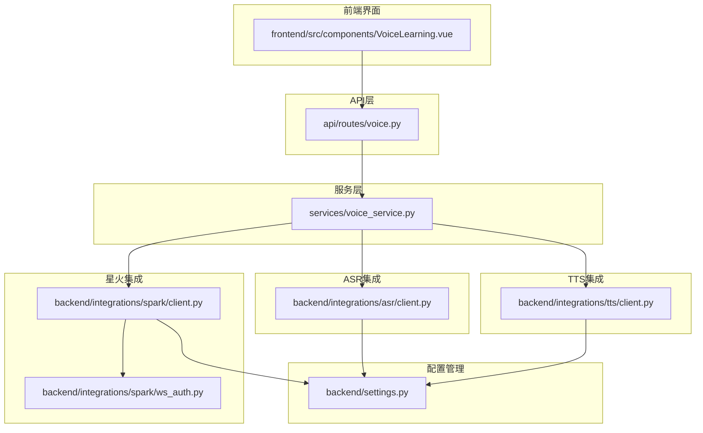
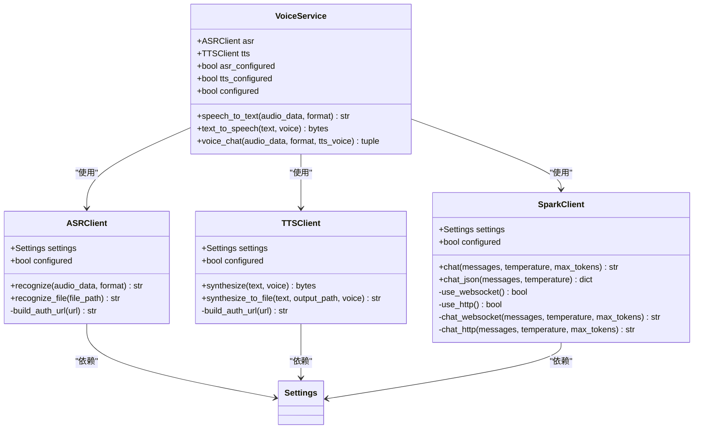
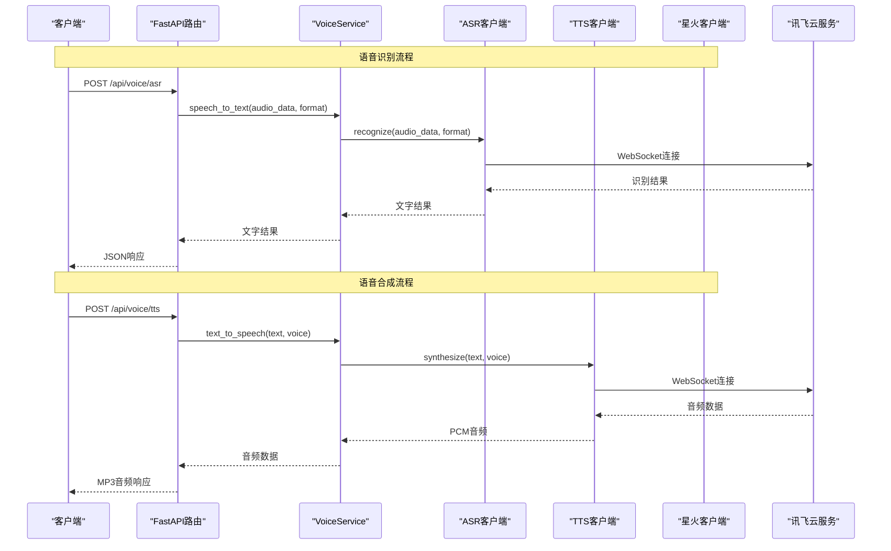
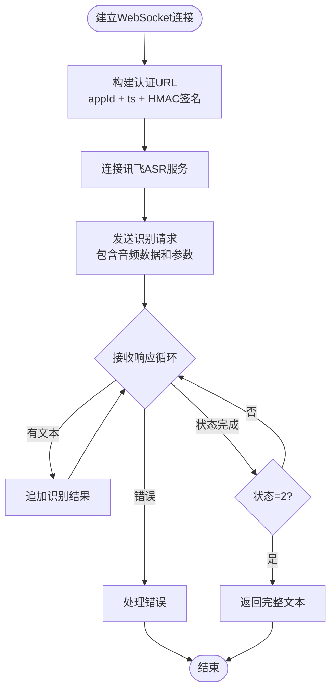
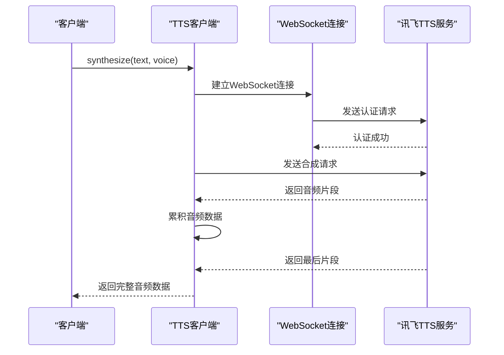
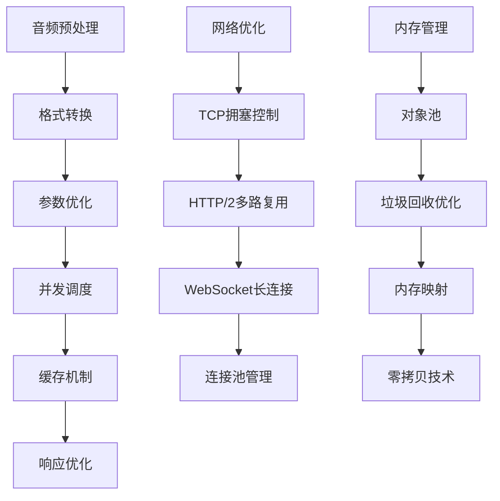
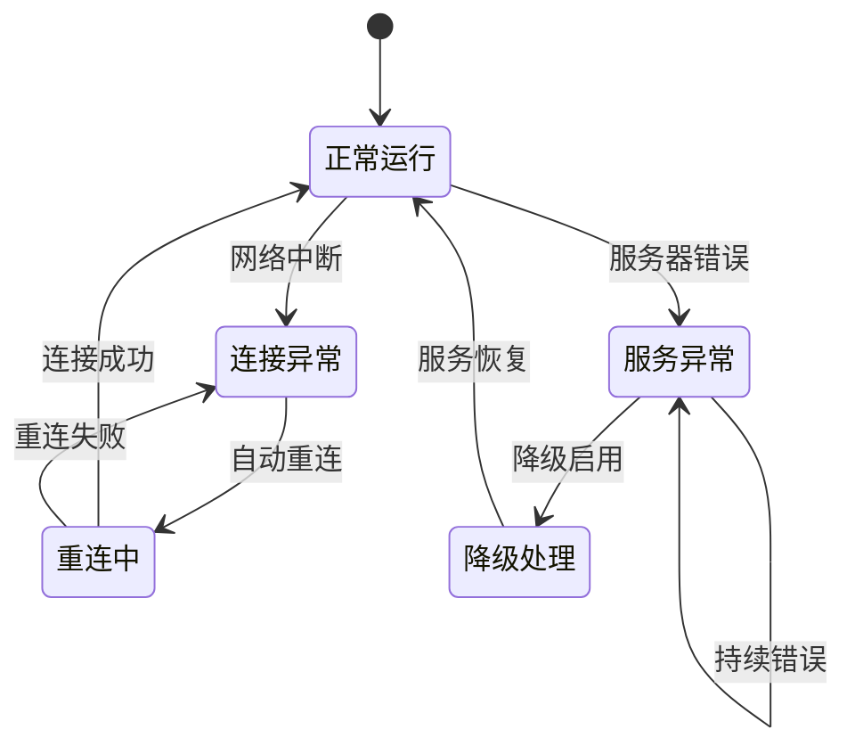
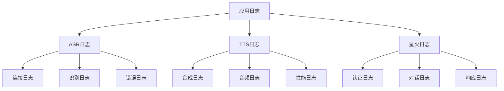

# 语音服务接口

<cite>
**本文档引用的文件**
- [api/routes/voice.py](file://api/routes/voice.py)
- [services/voice_service.py](file://services/voice_service.py)
- [backend/integrations/asr/client.py](file://backend/integrations/asr/client.py)
- [backend/integrations/tts/client.py](file://backend/integrations/tts/client.py)
- [backend/integrations/spark/client.py](file://backend/integrations/spark/client.py)
- [backend/integrations/spark/ws_auth.py](file://backend/integrations/spark/ws_auth.py)
- [backend/settings.py](file://backend/settings.py)
- [frontend/src/components/VoiceLearning.vue](file://frontend/src/components/VoiceLearning.vue)
- [README.md](file://README.md)
</cite>

## 目录
1. [简介](#简介)
2. [项目结构](#项目结构)
3. [核心组件](#核心组件)
4. [架构概览](#架构概览)
5. [详细组件分析](#详细组件分析)
6. [API规范](#api规范)
7. [音频参数与配置](#音频参数与配置)
8. [性能考虑](#性能考虑)
9. [故障排除指南](#故障排除指南)
10. [结论](#结论)

## 简介

EduAgent语音服务接口提供了完整的语音处理能力，包括语音识别（ASR）和语音合成（TTS）功能。该系统集成了讯飞星火AI大模型，支持实时语音转文字和文字转语音服务，为教育平台提供智能化的语音交互体验。

系统采用模块化设计，通过FastAPI提供RESTful API接口，前端使用Vue.js构建用户界面，后端通过WebSocket与讯飞云服务进行实时通信。

## 项目结构

语音服务相关的文件组织结构如下：



**图表来源**
- [api/routes/voice.py:1-64](file://api/routes/voice.py#L1-L64)
- [services/voice_service.py:1-51](file://services/voice_service.py#L1-L51)
- [backend/integrations/asr/client.py:1-95](file://backend/integrations/asr/client.py#L1-L95)
- [backend/integrations/tts/client.py:1-97](file://backend/integrations/tts/client.py#L1-L97)
- [backend/integrations/spark/client.py:1-198](file://backend/integrations/spark/client.py#L1-L198)

**章节来源**
- [api/routes/voice.py:1-64](file://api/routes/voice.py#L1-L64)
- [services/voice_service.py:1-51](file://services/voice_service.py#L1-L51)
- [backend/integrations/asr/client.py:1-95](file://backend/integrations/asr/client.py#L1-L95)
- [backend/integrations/tts/client.py:1-97](file://backend/integrations/tts/client.py#L1-L97)
- [backend/integrations/spark/client.py:1-198](file://backend/integrations/spark/client.py#L1-L198)

## 核心组件

### 语音服务架构

语音服务采用分层架构设计，确保功能模块的清晰分离和高内聚低耦合：



**图表来源**
- [services/voice_service.py:12-47](file://services/voice_service.py#L12-L47)
- [backend/integrations/asr/client.py:18-95](file://backend/integrations/asr/client.py#L18-L95)
- [backend/integrations/tts/client.py:19-97](file://backend/integrations/tts/client.py#L19-L97)
- [backend/integrations/spark/client.py:19-198](file://backend/integrations/spark/client.py#L19-L198)

### 配置管理系统

系统通过集中式的配置管理确保各组件的一致性和可维护性：

| 组件 | 配置项 | 默认值 | 描述 |
|------|--------|--------|------|
| 星火AI | spark_api_type | websocket | API调用方式 |
| 星火AI | spark_app_id | 空字符串 | 应用ID |
| 星火AI | spark_api_key | 空字符串 | API密钥 |
| 星火AI | spark_api_secret | 空字符串 | API密钥 |
| 星火AI | spark_ws_url | wss://spark-api.xf-yun.com/v4.0/chat | WebSocket地址 |
| 星火AI | spark_domain | 4.0Ultra | 模型版本 |
| 星火AI | spark_timeout | 120.0 | 超时时间 |
| ASR | asr_app_id | 空字符串 | 应用ID |
| ASR | asr_api_key | 空字符串 | API密钥 |
| ASR | asr_api_secret | 空字符串 | API密钥 |
| ASR | asr_ws_url | wss://raasr.xfyun.cn/v2/recognize | WebSocket地址 |
| TTS | tts_app_id | 空字符串 | 应用ID |
| TTS | tts_api_key | 空字符串 | API密钥 |
| TTS | tts_api_secret | 空字符串 | API密钥 |
| TTS | tts_ws_url | wss://tts-api.xf-yun.com/v2/tts | WebSocket地址 |

**章节来源**
- [backend/settings.py:6-66](file://backend/settings.py#L6-L66)

## 架构概览

语音服务的整体架构采用事件驱动和异步处理模式，确保高并发场景下的稳定性和响应速度：



**图表来源**
- [api/routes/voice.py:18-54](file://api/routes/voice.py#L18-L54)
- [services/voice_service.py:31-47](file://services/voice_service.py#L31-L47)
- [backend/integrations/asr/client.py:36-76](file://backend/integrations/asr/client.py#L36-L76)
- [backend/integrations/tts/client.py:37-85](file://backend/integrations/tts/client.py#L37-L85)

## 详细组件分析

### ASR语音识别客户端

ASR客户端负责将语音信号转换为文本，支持多种音频格式和实时识别：

#### 核心功能特性

| 特性 | 参数 | 默认值 | 说明 |
|------|------|--------|------|
| 支持格式 | format | wav | wav/mp3/pcm |
| 语言 | lang | zh_cn | 识别语言 |
| 识别域 | domain | iat | 识别领域 |
| 编码格式 | encoding | raw | 数据编码 |
| 采样率 | rate | 16000 | Hz |
| 通道数 | channels | 1 | 单声道 |
| 位深度 | bit_depth | 16 | 位 |

#### WebSocket认证流程



**图表来源**
- [backend/integrations/asr/client.py:28-76](file://backend/integrations/asr/client.py#L28-L76)

**章节来源**
- [backend/integrations/asr/client.py:18-95](file://backend/integrations/asr/client.py#L18-L95)

### TTS语音合成客户端

TTS客户端负责将文本转换为自然语音，支持多种音色和参数调节：

#### 语音参数配置

| 参数 | 取值范围 | 默认值 | 描述 |
|------|----------|--------|------|
| 语音音色 | xiaoyan/xiaoyu/xiaoyan/xiaofeng | xiaoyan | 音色选择 |
| 语速 | 0-100 | 50 | 语速百分比 |
| 音量 | 0-100 | 50 | 音量百分比 |
| 音高 | 0-100 | 50 | 音高百分比 |
| 文本编码 | utf8 | utf8 | 文本编码格式 |
| 输出格式 | lame | lame | 音频编码格式 |

#### 合成流程



**图表来源**
- [backend/integrations/tts/client.py:37-85](file://backend/integrations/tts/client.py#L37-L85)

**章节来源**
- [backend/integrations/tts/client.py:19-97](file://backend/integrations/tts/client.py#L19-L97)

### 星火AI集成

星火AI客户端提供强大的语言理解和生成能力，支持WebSocket和HTTP两种调用方式：

#### 调用方式对比

| 特性 | WebSocket方式 | HTTP方式 |
|------|---------------|----------|
| 实时性 | 高 | 中等 |
| 延迟 | 低 | 低 |
| 带宽 | 低 | 中等 |
| 复杂度 | 高 | 低 |
| 适用场景 | 实时对话 | 批量处理 |

#### WebSocket认证机制


**图表来源**
- [backend/integrations/spark/ws_auth.py:12-36](file://backend/integrations/spark/ws_auth.py#L12-L36)

**章节来源**
- [backend/integrations/spark/client.py:19-198](file://backend/integrations/spark/client.py#L19-L198)
- [backend/integrations/spark/ws_auth.py:1-37](file://backend/integrations/spark/ws_auth.py#L1-L37)

## API规范

### 语音识别接口

#### 接口定义

| 属性 | 值 |
|------|-----|
| 方法 | POST |
| 路径 | `/api/voice/asr` |
| 内容类型 | multipart/form-data |
| 认证 | 无需认证 |

#### 请求参数

| 参数名 | 类型 | 必填 | 描述 | 示例 |
|--------|------|------|------|------|
| audio | file | 是 | 语音文件 | WAV/MP3/PCM |
| format | string | 否 | 音频格式 | wav/mp3/pcm，默认wav |

#### 响应格式

```json
{
  "text": "识别出的文字内容"
}
```

#### 错误处理

| 状态码 | 错误类型 | 描述 |
|--------|----------|------|
| 503 | ASR请求失败 | 语音识别服务不可用 |
| 500 | 语音识别失败 | 未知错误 |

**章节来源**
- [api/routes/voice.py:18-34](file://api/routes/voice.py#L18-L34)

### 语音合成接口

#### 接口定义

| 属性 | 值 |
|------|-----|
| 方法 | POST |
| 路径 | `/api/voice/tts` |
| 内容类型 | multipart/form-data |
| 认证 | 无需认证 |

#### 请求参数

| 参数名 | 类型 | 必填 | 描述 | 示例 |
|--------|------|------|------|------|
| text | string | 是 | 要转换的文字 | "你好世界" |
| voice | string | 否 | 音色选择 | xiaoyan/xiaoyu/xiaoyan/xiaofeng |

#### 响应格式

| 属性 | 值 |
|------|-----|
| 内容类型 | audio/mpeg |
| 文件名 | speech.mp3 |
| 响应头 | Content-Disposition: attachment; filename=speech.mp3 |

#### 支持的音色

| 音色代码 | 名称 | 性别 | 特点 |
|----------|------|------|------|
| xiaoyan | 小燕 | 女 | 温柔甜美 |
| xiaoyu | 小宇 | 男 | 清晰磁性 |
| xiaoyan | 小研 | 女 | 知性优雅 |
| xiaofeng | 小峰 | 男 | 成熟稳重 |

**章节来源**
- [api/routes/voice.py:36-54](file://api/routes/voice.py#L36-L54)

### 服务状态查询接口

#### 接口定义

| 属性 | 值 |
|------|-----|
| 方法 | GET |
| 路径 | `/api/voice/status` |
| 内容类型 | application/json |
| 认证 | 无需认证 |

#### 响应格式

```json
{
  "asr_configured": true,
  "tts_configured": true,
  "fully_configured": true
}
```

**章节来源**
- [api/routes/voice.py:57-64](file://api/routes/voice.py#L57-L64)

## 音频参数与配置

### 音频格式支持

系统支持以下音频格式：

| 格式 | 编码 | 采样率 | 位深度 | 通道数 | 用途 |
|------|------|--------|--------|--------|------|
| WAV | PCM | 16kHz | 16位 | 单声道 | 语音识别 |
| MP3 | MPEG-1 Layer 3 | 16kHz | 16位 | 单声道 | 语音识别 |
| PCM | Pulse Code Modulation | 16kHz | 16位 | 单声道 | 语音识别 |

### 音频质量参数

#### ASR识别参数

| 参数 | 值 | 说明 |
|------|-----|------|
| 采样率 | 16kHz | 最佳识别效果 |
| 位深度 | 16位 | 保证音频质量 |
| 通道数 | 单声道 | 减少干扰 |
| 编码格式 | PCM | 无损压缩 |
| 音频长度 | 1-60秒 | 推荐范围 |

#### TTS合成参数

| 参数 | 值 | 说明 |
|------|-----|------|
| 输出格式 | MP3 | 浏览器兼容性好 |
| 采样率 | 16kHz | 标准音频质量 |
| 位深度 | 16位 | 音质清晰 |
| 音频长度 | 无限制 | 根据文本长度动态生成 |

### 并发限制与性能

#### 并发处理能力

| 组件 | 最大并发数 | 建议值 | 说明 |
|------|------------|--------|------|
| ASR识别 | 10 | 5 | 语音识别 |
| TTS合成 | 10 | 5 | 语音合成 |
| 星火对话 | 20 | 10 | AI对话 |

#### 延迟优化策略



## 性能考虑

### 网络传输优化

1. **WebSocket连接复用**
   - 复用单个WebSocket连接进行多次请求
   - 减少TCP握手开销
   - 降低服务器负载

2. **HTTP/2优化**
   - 启用HTTP/2多路复用
   - 减少连接建立时间
   - 提高并发性能

3. **缓存策略**
   - 音频文件缓存
   - 识别结果缓存
   - 配置参数缓存

### 内存管理优化

1. **流式处理**
   - 音频数据流式传输
   - 避免大文件内存占用
   - 实时处理机制

2. **对象池管理**
   - WebSocket连接池
   - 字符串缓冲池
   - 音频数据缓冲池

### 错误恢复机制



## 故障排除指南

### 常见问题诊断

#### ASR识别失败

**症状**: 返回503状态码，错误信息"ASR请求失败"

**可能原因**:
1. 配置参数错误
2. 网络连接不稳定
3. 服务器认证失败
4. 音频格式不支持

**解决方案**:
1. 检查.env文件中的ASR配置
2. 验证网络连接稳定性
3. 确认音频格式符合要求
4. 查看服务器日志获取详细错误信息

#### TTS合成失败

**症状**: 返回503状态码，错误信息"TTS请求失败"

**可能原因**:
1. 文本过长
2. 音色参数无效
3. 服务器超时
4. 网络中断

**解决方案**:
1. 简化输入文本
2. 验证音色参数
3. 检查服务器状态
4. 重试请求

#### 星火AI集成问题

**症状**: 返回"星火未配置"错误

**可能原因**:
1. 缺少必要的API密钥
2. 配置文件格式错误
3. 网络访问受限

**解决方案**:
1. 完善.env配置文件
2. 验证API密钥有效性
3. 检查网络访问权限

### 日志分析

系统提供详细的日志记录，便于问题诊断：



**章节来源**
- [api/routes/voice.py:28-33](file://api/routes/voice.py#L28-L33)
- [api/routes/voice.py:49-54](file://api/routes/voice.py#L49-L54)

## 结论

EduAgent语音服务接口提供了完整的语音处理解决方案，具有以下优势：

1. **模块化设计**: 清晰的分层架构，便于维护和扩展
2. **高性能**: 异步处理和连接池优化，支持高并发场景
3. **易用性**: 简洁的API接口，快速集成
4. **可靠性**: 完善的错误处理和故障恢复机制
5. **安全性**: 严格的配置管理和密钥保护

通过合理的配置和优化，该语音服务能够满足教育平台的各种应用场景需求，为用户提供优质的语音交互体验。