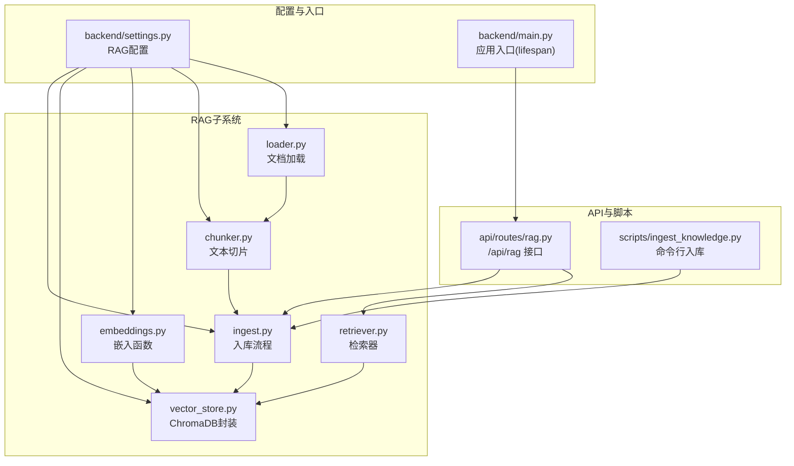
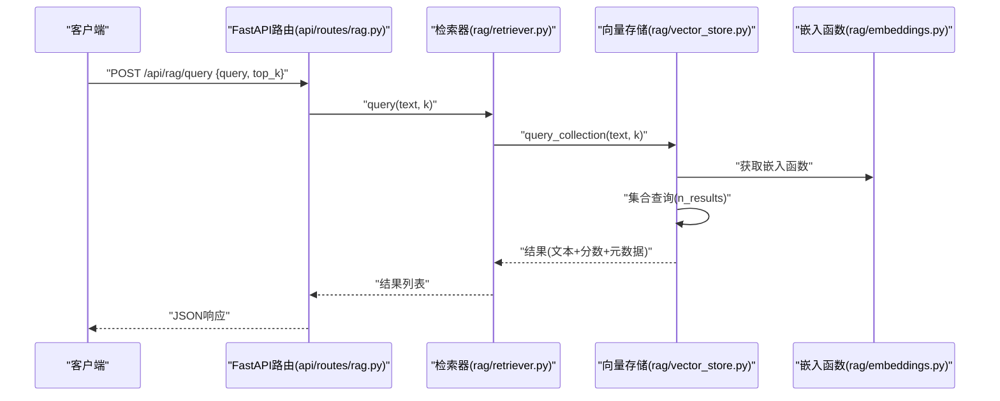
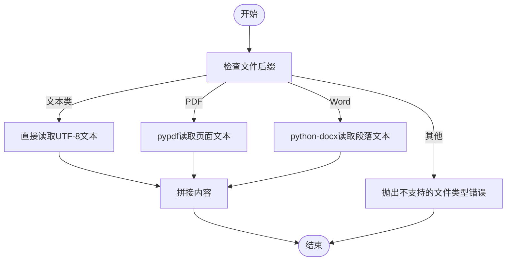
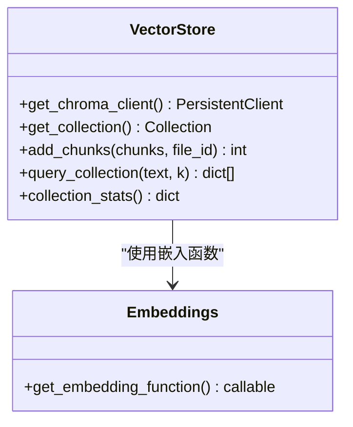
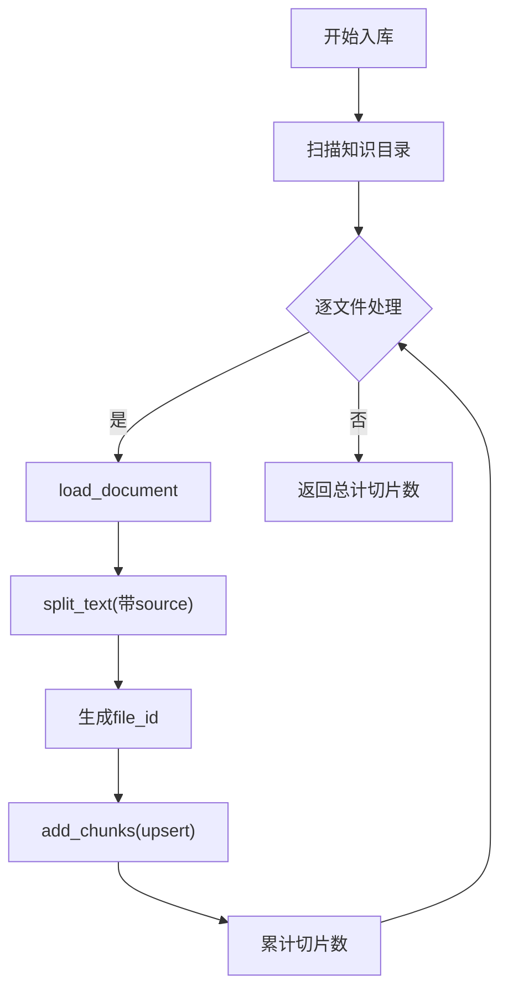
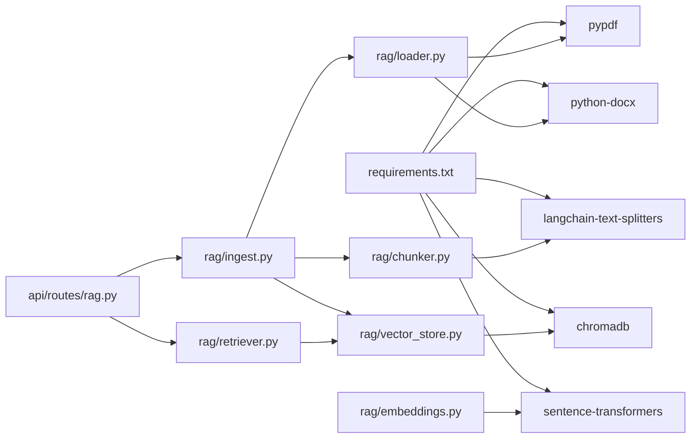

# RAG知识库系统

<cite>
**本文引用的文件**
- [rag/__init__.py](file://rag/__init__.py)
- [rag/loader.py](file://rag/loader.py)
- [rag/chunker.py](file://rag/chunker.py)
- [rag/embeddings.py](file://rag/embeddings.py)
- [rag/vector_store.py](file://rag/vector_store.py)
- [rag/retriever.py](file://rag/retriever.py)
- [rag/ingest.py](file://rag/ingest.py)
- [api/routes/rag.py](file://api/routes/rag.py)
- [scripts/ingest_knowledge.py](file://scripts/ingest_knowledge.py)
- [backend/settings.py](file://backend/settings.py)
- [backend/main.py](file://backend/main.py)
- [requirements.txt](file://requirements.txt)
- [knowledge/courses/lanqiao_python.md](file://knowledge/courses/lanqiao_python.md)
- [knowledge/courses/python_basics.md](file://knowledge/courses/python_basics.md)
</cite>

## 目录
1. [简介](#简介)
2. [项目结构](#项目结构)
3. [核心组件](#核心组件)
4. [架构总览](#架构总览)
5. [详细组件分析](#详细组件分析)
6. [依赖分析](#依赖分析)
7. [性能考虑](#性能考虑)
8. [故障排除指南](#故障排除指南)
9. [结论](#结论)
10. [附录](#附录)

## 简介
本文件为 EduAgent 的 RAG（检索增强生成）知识库系统技术文档，覆盖从“文档加载、文本切片、向量化处理、向量存储、检索”到“查询接口”的完整链路。重点包括：
- ChromaDB 向量数据库的集成方式与集合元数据配置
- 嵌入模型选择策略（SentenceTransformer/BGE 系列）
- 文本切片策略与分隔符优化
- 知识库构建流程、更新机制与性能调优
- RAG 系统配置项、扩展指南与监控指标
- 使用示例、故障排除与最佳实践

## 项目结构
RAG 子系统位于 rag/ 目录，围绕“加载-切片-嵌入-入库-检索”形成清晰的模块化分层：
- 文档加载：loader.py 支持多种格式读取
- 文本切片：chunker.py 基于 LangChain 的递归字符切分器
- 嵌入函数：embeddings.py 延迟加载 SentenceTransformer 嵌入
- 向量存储：vector_store.py 封装 ChromaDB 客户端与集合操作
- 入库流程：ingest.py 组织文件扫描、加载、切片、入库
- 检索器：retriever.py 对外提供异步查询接口
- API 路由：api/routes/rag.py 提供统计、入库、查询接口
- 启动脚本：scripts/ingest_knowledge.py 提供命令行批量入库
- 配置中心：backend/settings.py 定义 RAG 相关参数

图表来源
- [rag/loader.py:1-51](file://rag/loader.py#L1-L51)
- [rag/chunker.py:1-21](file://rag/chunker.py#L1-L21)
- [rag/embeddings.py:1-21](file://rag/embeddings.py#L1-L21)
- [rag/vector_store.py:1-65](file://rag/vector_store.py#L1-L65)
- [rag/ingest.py:1-48](file://rag/ingest.py#L1-L48)
- [rag/retriever.py:1-24](file://rag/retriever.py#L1-L24)
- [api/routes/rag.py:1-43](file://api/routes/rag.py#L1-L43)
- [scripts/ingest_knowledge.py:1-23](file://scripts/ingest_knowledge.py#L1-L23)
- [backend/settings.py:41-49](file://backend/settings.py#L41-L49)
- [backend/main.py:32-41](file://backend/main.py#L32-L41)

章节来源
- [backend/settings.py:41-49](file://backend/settings.py#L41-L49)
- [backend/main.py:32-41](file://backend/main.py#L32-L41)

## 核心组件
- 文档加载器：支持 .md/.markdown/.txt/.pdf/.docx/.doc，按后缀选择解析器，统一输出纯文本
- 文本切片器：基于 RecursiveCharacterTextSplitter，支持中英文分隔符与重叠策略
- 嵌入函数：延迟加载 SentenceTransformerEmbeddingFunction，模型名来自配置
- 向量存储：ChromaDB 持久化客户端 + 集合（cosine 距离空间），upsert 写入，query 查询
- 入库流程：扫描知识目录、逐文件加载/切片、生成文件级 ID、写入向量库
- 检索器：对外提供异步查询，异常降级为空结果
- API 路由：/api/rag/stats、/api/rag/ingest、/api/rag/query
- 启动时自动入库：可选配置项控制是否在应用启动时执行入库

章节来源
- [rag/loader.py:11-50](file://rag/loader.py#L11-L50)
- [rag/chunker.py:8-20](file://rag/chunker.py#L8-L20)
- [rag/embeddings.py:11-20](file://rag/embeddings.py#L11-L20)
- [rag/vector_store.py:16-64](file://rag/vector_store.py#L16-L64)
- [rag/ingest.py:21-47](file://rag/ingest.py#L21-L47)
- [rag/retriever.py:18-23](file://rag/retriever.py#L18-L23)
- [api/routes/rag.py:24-42](file://api/routes/rag.py#L24-L42)
- [backend/main.py:32-41](file://backend/main.py#L32-L41)

## 架构总览
下图展示从“请求发起”到“返回检索结果”的端到端流程。

图表来源
- [api/routes/rag.py:38-42](file://api/routes/rag.py#L38-L42)
- [rag/retriever.py:18-23](file://rag/retriever.py#L18-L23)
- [rag/vector_store.py:45-59](file://rag/vector_store.py#L45-L59)
- [rag/embeddings.py:11-20](file://rag/embeddings.py#L11-L20)

## 详细组件分析

### 文档加载器（loader.py）
- 功能：根据文件后缀选择解析器，统一输出 UTF-8 文本
- 支持格式：.md/.markdown/.txt/.pdf/.docx/.doc
- 异常处理：遇到不支持的后缀抛出异常
- 目录扫描：iter_knowledge_files 递归遍历知识目录，过滤隐藏文件与不支持后缀

图表来源
- [rag/loader.py:11-50](file://rag/loader.py#L11-L50)

章节来源
- [rag/loader.py:11-50](file://rag/loader.py#L11-L50)

### 文本切片器（chunker.py）
- 算法：RecursiveCharacterTextSplitter
- 关键参数：chunk_size、chunk_overlap、separators（含中英文标点与空白）
- 输出：规范化后的切片列表，附带 source 与 chunk_index 元数据

章节来源
- [rag/chunker.py:8-20](file://rag/chunker.py#L8-L20)
- [backend/settings.py:46-47](file://backend/settings.py#L46-L47)

### 嵌入函数（embeddings.py）
- 策略：@lru_cache 延迟加载，避免重复初始化
- 模型：SentenceTransformerEmbeddingFunction，模型名来自配置
- 日志：加载时记录模型名称

章节来源
- [rag/embeddings.py:11-20](file://rag/embeddings.py#L11-L20)
- [backend/settings.py](file://backend/settings.py#L45)

### 向量存储（vector_store.py）
- 客户端：PersistentClient，持久化目录来自配置
- 集合：get_or_create_collection，指定集合名与 embedding_function
- 元数据：集合启用 cosine 距离空间（hnsw:space）
- 写入：add_chunks 使用 upsert，ID 规则为 “file_id::chunk_index”
- 查询：query_collection 返回文本、分数与元数据，距离转相似度

图表来源
- [rag/vector_store.py:16-64](file://rag/vector_store.py#L16-L64)
- [rag/embeddings.py:11-20](file://rag/embeddings.py#L11-L20)

章节来源
- [rag/vector_store.py:16-64](file://rag/vector_store.py#L16-L64)
- [backend/settings.py:43-48](file://backend/settings.py#L43-L48)

### 入库流程（ingest.py）
- 文件扫描：iter_knowledge_files
- 加载与切片：load_document -> split_text
- 文件 ID：基于相对路径的哈希前缀，确保稳定唯一
- 写入：add_chunks 批量 upsert
- 统计：get_ingest_summary 返回向量总数、集合名与知识文件清单

图表来源
- [rag/ingest.py:31-47](file://rag/ingest.py#L31-L47)
- [rag/loader.py:41-50](file://rag/loader.py#L41-L50)
- [rag/chunker.py:8-20](file://rag/chunker.py#L8-L20)
- [rag/vector_store.py:34-42](file://rag/vector_store.py#L34-L42)

章节来源
- [rag/ingest.py:15-47](file://rag/ingest.py#L15-L47)

### 检索器（retriever.py）
- 封装：异步 query(text, k)，内部委托 query_collection
- 容错：捕获异常并返回空列表，避免中断请求

章节来源
- [rag/retriever.py:12-23](file://rag/retriever.py#L12-L23)
- [api/routes/rag.py:38-42](file://api/routes/rag.py#L38-L42)

### API 路由（api/routes/rag.py）
- GET /api/rag/stats：返回入库统计
- POST /api/rag/ingest：支持同步或后台异步入库
- POST /api/rag/query：接收查询与 top_k，返回检索结果

章节来源
- [api/routes/rag.py:24-42](file://api/routes/rag.py#L24-L42)

### 启动脚本与应用入口
- scripts/ingest_knowledge.py：命令行批量入库，打印入库数量与统计
- backend/main.py：应用生命周期内可选自动入库（auto_ingest_on_startup）

章节来源
- [scripts/ingest_knowledge.py:13-18](file://scripts/ingest_knowledge.py#L13-L18)
- [backend/main.py:32-41](file://backend/main.py#L32-L41)
- [backend/settings.py](file://backend/settings.py#L49)

## 依赖分析
- 外部库：chromadb、sentence-transformers、langchain-text-splitters、pypdf、python-docx
- 模块耦合：loader/chunker/embeddings/vector_store/ingest/retriever 形成清晰的单向依赖链
- 配置耦合：所有组件通过 backend/settings.py 的 get_settings 获取运行参数

图表来源
- [requirements.txt:8-17](file://requirements.txt#L8-L17)
- [rag/loader.py:22-38](file://rag/loader.py#L22-L38)
- [rag/chunker.py](file://rag/chunker.py#L3)
- [rag/embeddings.py](file://rag/embeddings.py#L18)
- [rag/vector_store.py](file://rag/vector_store.py#L8)
- [rag/ingest.py](file://rag/ingest.py#L9)
- [api/routes/rag.py:8-9](file://api/routes/rag.py#L8-L9)

章节来源
- [requirements.txt:1-18](file://requirements.txt#L1-L18)

## 性能考虑
- 嵌入模型缓存：@lru_cache 避免重复初始化，减少冷启动开销
- 向量集合：cosine 距离空间适合语义相似度，查询时按集合大小限制 n_results
- 切片参数：chunk_size 与 chunk_overlap 需权衡召回与上下文长度，结合下游 LLM 上限调整
- 并发入库：API 支持后台任务，避免阻塞主请求线程
- 自动入库：生产环境谨慎开启 auto_ingest_on_startup，避免启动时阻塞
- I/O 优化：PDF/DOCX 解析可能较慢，建议在专用队列或异步任务中执行

## 故障排除指南
- 入库失败：检查知识目录权限、文件编码与格式支持；查看日志定位具体文件
- 检索无结果：确认集合是否为空；核对 embedding_model 与查询文本长度
- 模型加载失败：确认 sentence-transformers 可用与网络可达；检查模型名配置
- PDF/DOCX 解析异常：确认 pypdf、python-docx 版本兼容性
- 启动自动入库异常：查看 lifespan 中异常日志，确认知识目录存在且可写

章节来源
- [rag/ingest.py:37-40](file://rag/ingest.py#L37-L40)
- [rag/retriever.py:21-23](file://rag/retriever.py#L21-L23)
- [backend/main.py:36-39](file://backend/main.py#L36-L39)

## 结论
该 RAG 系统以模块化设计实现了从文档到向量的完整流水线，结合 ChromaDB 的高效检索与 BGE 嵌入模型，具备良好的可维护性与扩展性。通过合理的配置与调优，可在教学资源检索场景中取得稳定效果。

## 附录

### 配置选项（RAG 相关）
- knowledge_dir：知识目录路径
- chroma_persist_dir：ChromaDB 持久化目录
- chroma_collection：集合名称
- embedding_model：SentenceTransformer 模型名
- chunk_size：切片长度
- chunk_overlap：切片重叠
- rag_top_k：默认检索返回条数
- auto_ingest_on_startup：启动时自动入库开关

章节来源
- [backend/settings.py:41-49](file://backend/settings.py#L41-L49)

### 使用示例
- 启动后台入库并查看统计
  - POST /api/rag/ingest（sync=false，默认）
  - GET /api/rag/stats
- 同步入库
  - POST /api/rag/ingest（sync=true）
- 查询
  - POST /api/rag/query {query, top_k}

章节来源
- [api/routes/rag.py:29-42](file://api/routes/rag.py#L29-L42)

### 扩展指南
- 新增文档格式：在 loader.py 中添加后缀与解析器
- 调整切片策略：修改 chunker.py 的 separators 与阈值
- 更换嵌入模型：修改 embedding_model 并验证性能
- 自定义集合元数据：在 get_collection 中增加 metadata 字段
- 增加过滤检索：在 query_collection 中加入 where 过滤条件

章节来源
- [rag/loader.py:8-19](file://rag/loader.py#L8-L19)
- [rag/chunker.py:10-14](file://rag/chunker.py#L10-L14)
- [rag/embeddings.py](file://rag/embeddings.py#L15)
- [rag/vector_store.py:27-31](file://rag/vector_store.py#L27-L31)
- [rag/vector_store.py](file://rag/vector_store.py#L51)

### 监控指标
- 向量总数：/api/rag/stats 中的 vector_count
- 集合名称：/api/rag/stats 中的 collection
- 知识文件清单：/api/rag/stats 中的 knowledge_files
- 入库耗时：可通过日志时间戳估算
- 检索耗时：可在 API 层埋点统计

章节来源
- [api/routes/rag.py:24-26](file://api/routes/rag.py#L24-L26)
- [rag/ingest.py:44-47](file://rag/ingest.py#L44-L47)

### 最佳实践
- 切片参数：先小后大，逐步调优，避免过长导致上下文溢出
- 嵌入模型：优先选择中文语料训练的模型，如 BGE 系列
- 入库策略：增量入库 + 定期全量校验，保证向量与源文件一致性
- 缓存与并发：利用 @lru_cache 与后台任务，提升吞吐
- 日志与告警：对入库失败与检索异常进行分级告警