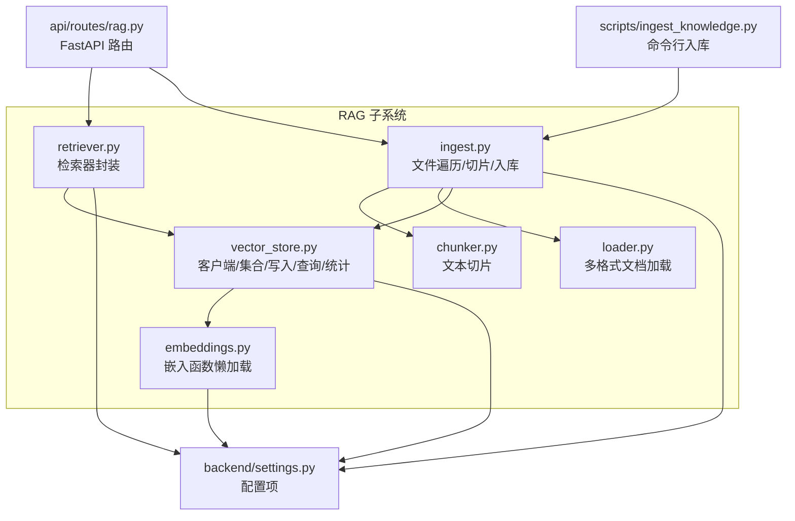
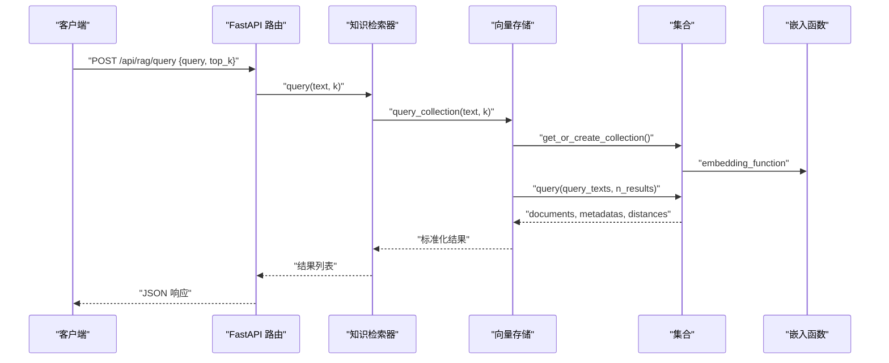
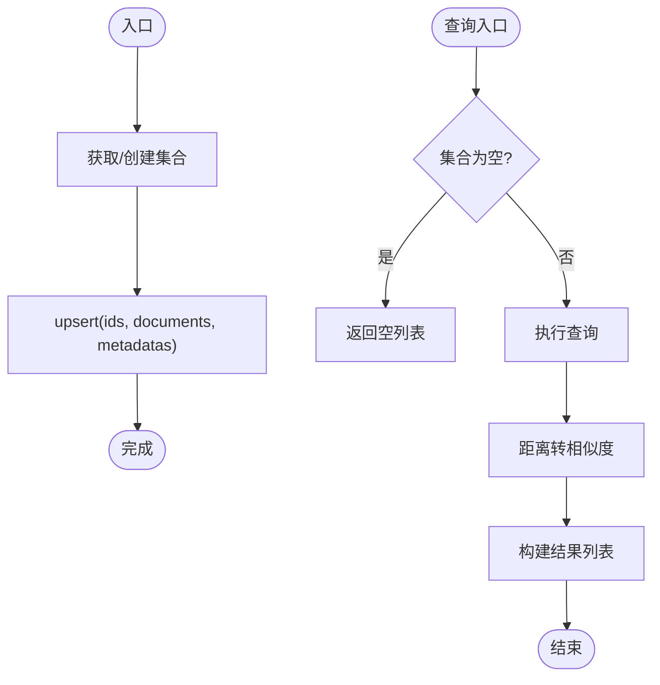
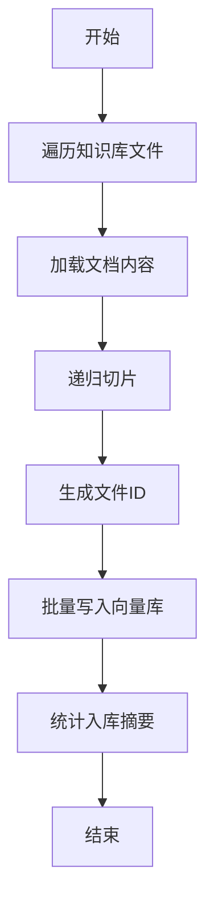
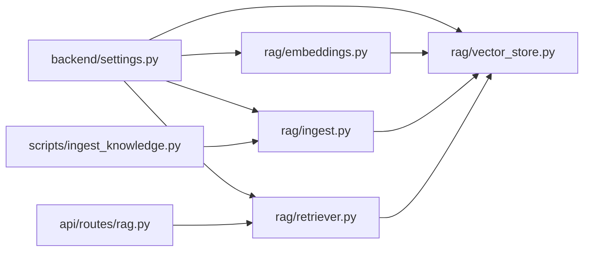

# 向量存储管理

<cite>
**本文引用的文件**
- [rag/vector_store.py](file://rag/vector_store.py)
- [rag/embeddings.py](file://rag/embeddings.py)
- [rag/ingest.py](file://rag/ingest.py)
- [rag/retriever.py](file://rag/retriever.py)
- [rag/chunker.py](file://rag/chunker.py)
- [rag/loader.py](file://rag/loader.py)
- [backend/settings.py](file://backend/settings.py)
- [api/routes/rag.py](file://api/routes/rag.py)
- [scripts/ingest_knowledge.py](file://scripts/ingest_knowledge.py)
- [requirements.txt](file://requirements.txt)
</cite>

## 目录
1. [简介](#简介)
2. [项目结构](#项目结构)
3. [核心组件](#核心组件)
4. [架构总览](#架构总览)
5. [详细组件分析](#详细组件分析)
6. [依赖分析](#依赖分析)
7. [性能考虑](#性能考虑)
8. [故障排查指南](#故障排查指南)
9. [结论](#结论)
10. [附录](#附录)

## 简介
本文件面向EduAgent的向量存储管理子系统，聚焦ChromaDB向量数据库的集成与使用，覆盖以下主题：
- 数据库初始化与集合管理
- 向量索引策略与检索优化
- 向量数据存储结构与元数据管理
- 批量写入机制与入库流程
- 查询优化、索引类型选择与性能调优
- 数据持久化、备份与恢复思路
- 配置参数、连接池与并发控制策略
- 实际存储操作示例、性能监控指标与容量规划建议

## 项目结构
向量存储相关代码主要位于 rag/ 子目录，并通过 FastAPI 路由暴露查询与入库能力，同时提供独立脚本用于批量入库。

图表来源
- [rag/vector_store.py:1-65](file://rag/vector_store.py#L1-L65)
- [rag/embeddings.py:1-21](file://rag/embeddings.py#L1-L21)
- [rag/ingest.py:1-48](file://rag/ingest.py#L1-L48)
- [rag/retriever.py:1-24](file://rag/retriever.py#L1-L24)
- [rag/chunker.py:1-21](file://rag/chunker.py#L1-L21)
- [rag/loader.py:1-51](file://rag/loader.py#L1-L51)
- [backend/settings.py:1-67](file://backend/settings.py#L1-L67)
- [api/routes/rag.py:1-43](file://api/routes/rag.py#L1-L43)
- [scripts/ingest_knowledge.py:1-23](file://scripts/ingest_knowledge.py#L1-L23)

章节来源
- [backend/settings.py:41-49](file://backend/settings.py#L41-L49)
- [api/routes/rag.py:1-43](file://api/routes/rag.py#L1-L43)
- [scripts/ingest_knowledge.py:1-23](file://scripts/ingest_knowledge.py#L1-L23)

## 核心组件
- ChromaDB 客户端与集合管理
  - 通过懒加载缓存获取持久化客户端，确保单实例复用。
  - 自动创建或获取集合，设置嵌入函数与索引元数据（余弦相似度空间）。
- 向量写入与批量更新
  - 使用 upsert 进行幂等写入，基于“文件ID+块索引”生成唯一ID。
  - 将原始文本、元数据与派生字段（如 file_id）一并写入。
- 查询与结果处理
  - 支持 top-k 参数与默认值，自动处理空集合与边界情况。
  - 将距离转换为相似度分数并返回统一结构。
- 入库流水线
  - 文档加载 → 文本切片 → 向量化入库 → 统计汇总。
- 检索器封装
  - 对外提供异步查询接口，内部委托向量查询逻辑。

章节来源
- [rag/vector_store.py:16-64](file://rag/vector_store.py#L16-L64)
- [rag/ingest.py:21-47](file://rag/ingest.py#L21-L47)
- [rag/retriever.py:12-23](file://rag/retriever.py#L12-L23)
- [rag/chunker.py:8-20](file://rag/chunker.py#L8-L20)
- [rag/loader.py:11-50](file://rag/loader.py#L11-L50)

## 架构总览
下图展示从API请求到向量数据库的完整链路，以及入库脚本与路由的关系。

图表来源
- [api/routes/rag.py:38-42](file://api/routes/rag.py#L38-L42)
- [rag/retriever.py:18-23](file://rag/retriever.py#L18-L23)
- [rag/vector_store.py:45-59](file://rag/vector_store.py#L45-L59)
- [rag/embeddings.py:11-20](file://rag/embeddings.py#L11-L20)

## 详细组件分析

### 向量存储与集合管理
- 客户端初始化
  - 通过持久化路径创建客户端，确保目录存在。
  - 使用 LRU 缓存避免重复初始化。
- 集合创建与元数据
  - 自动创建/获取集合，指定集合名与嵌入函数。
  - 设置索引元数据，启用余弦相似度空间。
- 写入与更新
  - upsert 幂等写入，保证重复入库不产生重复记录。
  - ID 采用“文件ID::块索引”的复合键，便于去重与定位。
- 查询与结果
  - 当集合为空时直接返回空列表。
  - 将距离映射为相似度分数，统一输出结构。
- 统计信息
  - 返回集合名称与向量数量，便于监控与运维。

图表来源
- [rag/vector_store.py:34-64](file://rag/vector_store.py#L34-L64)

章节来源
- [rag/vector_store.py:16-64](file://rag/vector_store.py#L16-L64)

### 嵌入函数与模型懒加载
- 嵌入函数通过缓存懒加载，减少初始化成本。
- 使用 ChromaDB 提供的 SentenceTransformerEmbeddingFunction，模型名来自配置。
- 日志记录模型加载动作，便于追踪。

章节来源
- [rag/embeddings.py:11-20](file://rag/embeddings.py#L11-L20)
- [backend/settings.py:45-45](file://backend/settings.py#L45-L45)

### 入库流水线与批量写入
- 文件发现
  - 遍历知识库目录，支持多种文档格式。
- 文档加载
  - 多格式读取，统一返回文本内容。
- 文本切片
  - 基于递归字符分割器，按分隔符与长度切片，保留来源与块索引。
- 文件ID生成
  - 基于相对路径的哈希前缀与相对路径组合，确保稳定且可追溯。
- 批量入库
  - 将切片列表写入向量库，返回入库条数。
- 汇总统计
  - 返回集合名、向量总数与知识文件清单。

图表来源
- [rag/ingest.py:21-47](file://rag/ingest.py#L21-L47)
- [rag/loader.py:11-50](file://rag/loader.py#L11-L50)
- [rag/chunker.py:8-20](file://rag/chunker.py#L8-L20)

章节来源
- [rag/ingest.py:15-47](file://rag/ingest.py#L15-L47)
- [rag/loader.py:11-50](file://rag/loader.py#L11-L50)
- [rag/chunker.py:8-20](file://rag/chunker.py#L8-L20)

### 检索器封装与查询
- 检索器对外提供异步查询方法，内部调用向量查询。
- 异常捕获与降级：查询异常时记录警告并返回空列表。
- 默认 top_k 来自配置，支持外部传参覆盖。

章节来源
- [rag/retriever.py:12-23](file://rag/retriever.py#L12-L23)
- [backend/settings.py:48-48](file://backend/settings.py#L48-L48)

### API 路由与使用
- 查询接口
  - 接收查询文本与 top_k，返回标准化结果。
- 入库接口
  - 支持同步与异步两种模式，异步通过后台任务执行。
- 统计接口
  - 返回当前集合状态与知识文件清单。

章节来源
- [api/routes/rag.py:14-42](file://api/routes/rag.py#L14-L42)

### 命令行入库脚本
- 通过独立脚本批量将知识库目录导入向量库。
- 初始化日志配置，打印入库摘要。

章节来源
- [scripts/ingest_knowledge.py:13-18](file://scripts/ingest_knowledge.py#L13-L18)

## 依赖分析
- 外部依赖
  - chromadb：向量数据库客户端与集合管理。
  - sentence-transformers：提供嵌入模型。
  - langchain-text-splitters：文本切片工具。
  - pypdf / python-docx：PDF/Word 文档解析。
- 内部依赖
  - backend/settings：集中式配置，影响嵌入模型、切片参数、集合名与持久化路径。
  - rag.embeddings：嵌入函数工厂。
  - rag.vector_store：ChromaDB 客户端、集合、写入与查询。
  - rag.ingest / rag.retriever：入库与检索编排。

图表来源
- [backend/settings.py:41-49](file://backend/settings.py#L41-L49)
- [rag/embeddings.py:11-20](file://rag/embeddings.py#L11-L20)
- [rag/vector_store.py:16-31](file://rag/vector_store.py#L16-L31)
- [rag/ingest.py:21-28](file://rag/ingest.py#L21-L28)
- [rag/retriever.py:18-23](file://rag/retriever.py#L18-L23)
- [api/routes/rag.py:38-42](file://api/routes/rag.py#L38-L42)
- [scripts/ingest_knowledge.py:10-18](file://scripts/ingest_knowledge.py#L10-L18)

章节来源
- [requirements.txt:8-9](file://requirements.txt#L8-L9)
- [backend/settings.py:41-49](file://backend/settings.py#L41-L49)

## 性能考虑
- 索引与相似度
  - 集合元数据指定了余弦相似度空间，适合文本语义检索。
- 查询参数
  - top_k 默认值来自配置，可通过请求覆盖；查询时会限制 n_results 不超过集合大小。
- 写入策略
  - upsert 幂等，适合增量入库与重复运行脚本。
- 模型与资源
  - 嵌入模型懒加载，首次查询时有冷启动开销；建议在服务启动阶段预热。
- 并发与连接
  - 当前实现未显式使用连接池；若并发较高，建议评估 ChromaDB 客户端复用与线程安全。
- 切片参数
  - chunk_size 与 chunk_overlap 影响召回质量与查询速度，需结合业务权衡。
- 监控指标
  - 建议采集：入库速率、查询延迟、top-k 结果数量、集合规模、内存占用、磁盘使用。

## 故障排查指南
- 查询返回空列表
  - 可能原因：集合尚未写入数据；检查入库是否成功或集合名是否一致。
- 入库失败
  - 可能原因：文件格式不受支持、解析异常、网络/磁盘问题；查看日志定位具体文件。
- 检索异常
  - 可能原因：嵌入模型加载失败、ChromaDB 客户端异常；确认模型路径与权限。
- 性能下降
  - 可能原因：集合过大、top_k 过大、切片过小；调整参数并观察效果。
- 建议操作
  - 使用统计接口确认集合状态。
  - 在启动阶段预热嵌入模型。
  - 对高并发场景评估客户端复用与线程安全。

章节来源
- [rag/vector_store.py:49-50](file://rag/vector_store.py#L49-L50)
- [rag/retriever.py:21-22](file://rag/retriever.py#L21-L22)
- [api/routes/rag.py:24-26](file://api/routes/rag.py#L24-L26)

## 结论
该向量存储管理组件以简洁清晰的方式实现了从文档入库到语义检索的完整链路。通过集合元数据配置余弦相似度空间，结合 upsert 幂等写入与懒加载嵌入函数，满足了 EduAgent 的 RAG 场景需求。建议在生产环境中关注入库与查询的并发控制、模型预热与参数调优，并建立完善的监控与容量规划机制。

## 附录

### 关键配置参数
- 知识库目录：知识文件根路径
- 向量数据库持久化目录：ChromaDB 数据存放位置
- 集合名称：向量集合标识
- 嵌入模型：SentenceTransformer 模型名
- 切片尺寸与重叠：文本切片策略
- RAG top-k：默认检索返回数量
- 启动时自动入库：是否随应用启动执行入库

章节来源
- [backend/settings.py:42-49](file://backend/settings.py#L42-L49)

### 存储操作示例（步骤说明）
- 入库
  - 通过 API：POST /api/rag/ingest，支持同步或异步模式。
  - 通过脚本：运行命令行脚本，批量导入知识库目录。
- 查询
  - 通过 API：POST /api/rag/query，传入查询文本与 top_k。
- 统计
  - 通过 API：GET /api/rag/stats，查看集合状态与文件清单。

章节来源
- [api/routes/rag.py:29-42](file://api/routes/rag.py#L29-L42)
- [scripts/ingest_knowledge.py:13-18](file://scripts/ingest_knowledge.py#L13-L18)

### 数据持久化与备份恢复
- 持久化
  - ChromaDB 以本地文件形式存储，持久化目录由配置决定。
- 备份
  - 建议定期复制持久化目录至安全位置。
- 恢复
  - 停止服务后替换持久化目录，重启服务即可恢复。

章节来源
- [backend/settings.py:43-43](file://backend/settings.py#L43-L43)
- [rag/vector_store.py:19-21](file://rag/vector_store.py#L19-L21)

### 并发控制与连接池
- 当前实现未显式使用连接池；建议：
  - 复用 ChromaDB 客户端实例（已通过缓存实现）。
  - 在高并发场景下评估线程安全与锁竞争。
  - 对嵌入模型与 IO 密集操作进行限流与队列化。

章节来源
- [rag/vector_store.py:16-21](file://rag/vector_store.py#L16-L21)
- [rag/embeddings.py:11-11](file://rag/embeddings.py#L11-L11)

### 容量规划建议
- 集合规模
  - 根据知识库体量与切片密度估算向量数量，预留磁盘空间。
- 切片参数
  - 较大的 chunk_size 降低向量数量但可能降低召回精度；较小 chunk_size 提升召回但增加存储与查询开销。
- 查询负载
  - 控制 top_k 与并发查询数，避免查询延迟飙升。

章节来源
- [backend/settings.py:46-48](file://backend/settings.py#L46-L48)