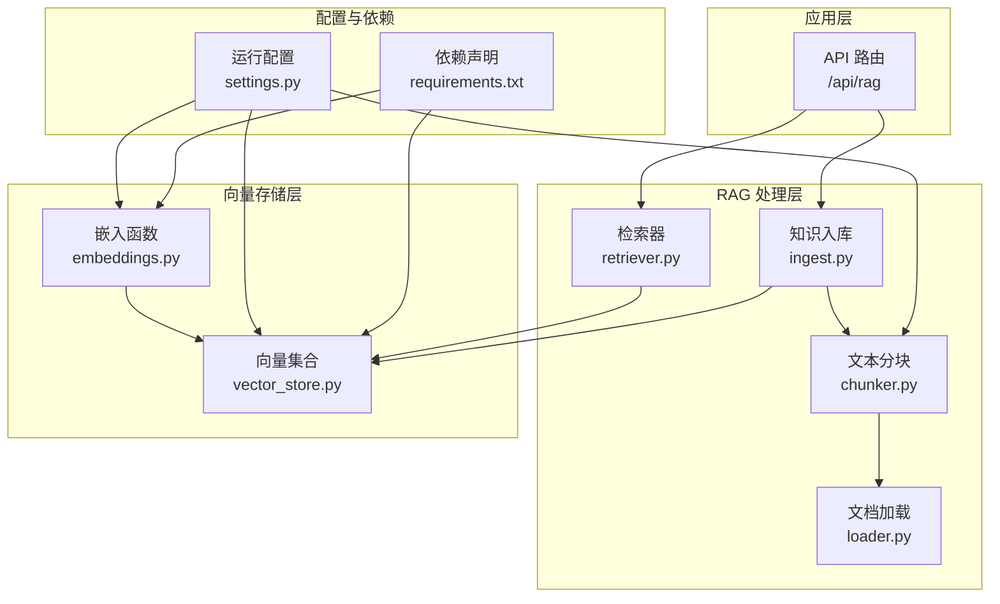
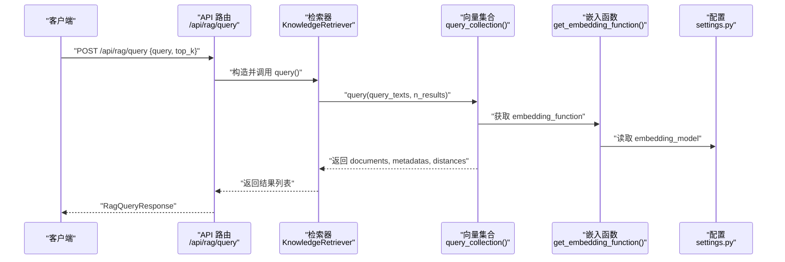
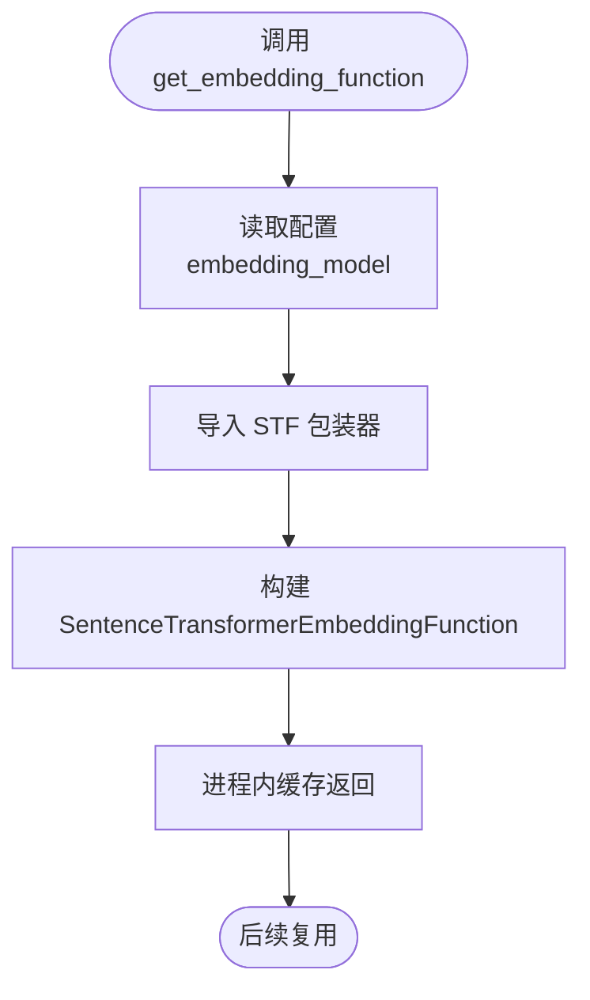
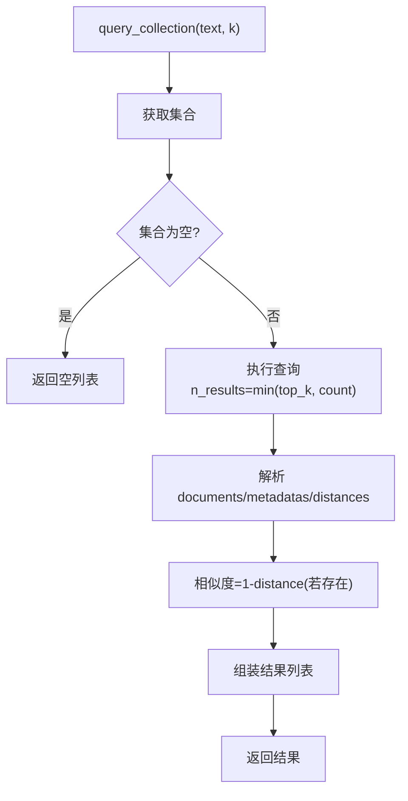
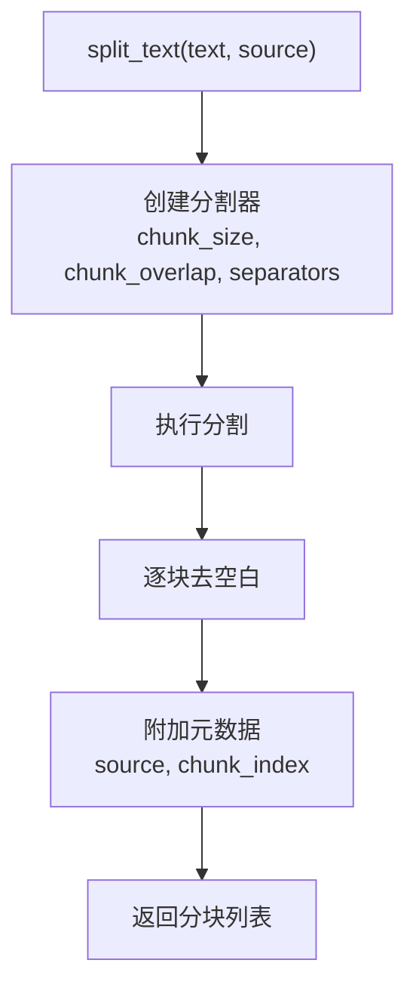
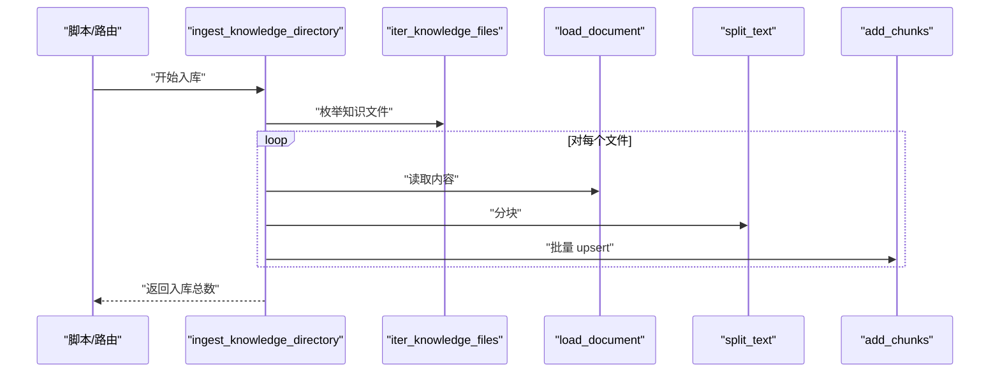
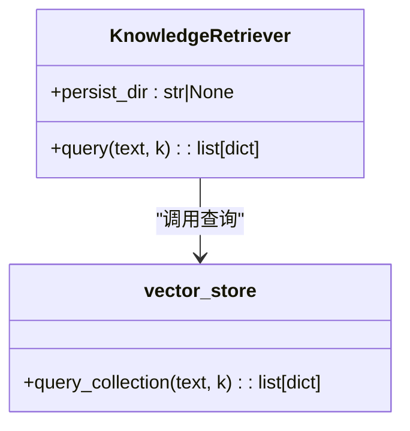
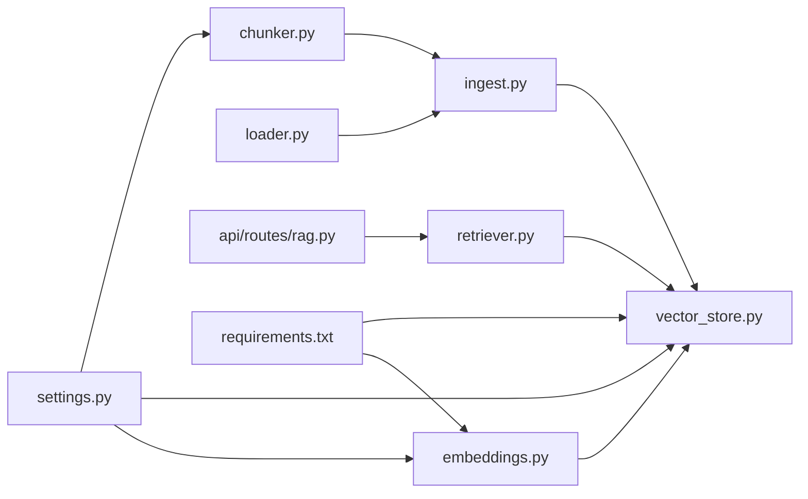

# 嵌入向量化处理

<cite>
**本文引用的文件**
- [rag/embeddings.py](file://rag/embeddings.py)
- [rag/vector_store.py](file://rag/vector_store.py)
- [rag/chunker.py](file://rag/chunker.py)
- [rag/loader.py](file://rag/loader.py)
- [rag/ingest.py](file://rag/ingest.py)
- [rag/retriever.py](file://rag/retriever.py)
- [api/routes/rag.py](file://api/routes/rag.py)
- [backend/settings.py](file://backend/settings.py)
- [requirements.txt](file://requirements.txt)
- [scripts/ingest_knowledge.py](file://scripts/ingest_knowledge.py)
</cite>

## 目录
1. [简介](#简介)
2. [项目结构](#项目结构)
3. [核心组件](#核心组件)
4. [架构总览](#架构总览)
5. [详细组件分析](#详细组件分析)
6. [依赖分析](#依赖分析)
7. [性能考虑](#性能考虑)
8. [故障排除指南](#故障排除指南)
9. [结论](#结论)
10. [附录](#附录)

## 简介
本文件聚焦 EduAgent 的“嵌入向量化处理”子系统，系统性阐述从文本到向量的完整流水线：文本预处理与分块、Sentence Transformers 嵌入模型集成、向量入库与检索、相似度计算与排序、以及批量处理与性能优化策略。文档同时给出模型配置、实际使用示例与常见问题排查方法，帮助开发者快速理解并高效部署。

## 项目结构
围绕嵌入向量化处理的相关模块主要分布在 rag/ 子目录与 backend/settings.py 中，API 层通过 /api/rag 路由对外提供入库与查询能力，底层以 ChromaDB 作为持久化向量库，Sentence Transformers 提供嵌入函数。

图表来源
- [api/routes/rag.py:1-43](file://api/routes/rag.py#L1-L43)
- [rag/retriever.py:1-24](file://rag/retriever.py#L1-L24)
- [rag/ingest.py:1-48](file://rag/ingest.py#L1-L48)
- [rag/chunker.py:1-21](file://rag/chunker.py#L1-L21)
- [rag/loader.py:1-51](file://rag/loader.py#L1-L51)
- [rag/vector_store.py:1-65](file://rag/vector_store.py#L1-L65)
- [rag/embeddings.py:1-21](file://rag/embeddings.py#L1-L21)
- [backend/settings.py:1-67](file://backend/settings.py#L1-L67)
- [requirements.txt:1-18](file://requirements.txt#L1-L18)

章节来源
- [api/routes/rag.py:1-43](file://api/routes/rag.py#L1-L43)
- [backend/settings.py:1-67](file://backend/settings.py#L1-L67)

## 核心组件
- 嵌入函数工厂：按配置动态加载 Sentence Transformers 嵌入函数，封装为 ChromaDB 可用的 embedding_function。
- 向量集合：创建或获取集合，指定余弦相似度空间，负责 upsert 文档与查询。
- 文本分块：基于递归字符分割器，结合中英文标点与空格进行智能切分。
- 文档加载：支持 md/markdown/txt/pdf/docx/doc 等格式读取。
- 入库流程：遍历知识目录，加载文档、分块、去噪、入库。
- 检索器：异步查询集合，返回文本、相似度分数与元数据。
- API 路由：提供入库统计、后台入库、查询接口。

章节来源
- [rag/embeddings.py:1-21](file://rag/embeddings.py#L1-L21)
- [rag/vector_store.py:1-65](file://rag/vector_store.py#L1-L65)
- [rag/chunker.py:1-21](file://rag/chunker.py#L1-L21)
- [rag/loader.py:1-51](file://rag/loader.py#L1-L51)
- [rag/ingest.py:1-48](file://rag/ingest.py#L1-L48)
- [rag/retriever.py:1-24](file://rag/retriever.py#L1-L24)
- [api/routes/rag.py:1-43](file://api/routes/rag.py#L1-L43)

## 架构总览
下图展示从请求到向量检索的关键交互路径，涵盖异步查询、缓存与错误降级。

图表来源
- [api/routes/rag.py:38-43](file://api/routes/rag.py#L38-L43)
- [rag/retriever.py:18-23](file://rag/retriever.py#L18-L23)
- [rag/vector_store.py:45-59](file://rag/vector_store.py#L45-L59)
- [rag/embeddings.py:11-20](file://rag/embeddings.py#L11-L20)
- [backend/settings.py:41-49](file://backend/settings.py#L41-L49)

## 详细组件分析

### 组件一：嵌入函数与模型选择
- 加载策略：通过装饰器实现懒加载与进程内缓存，避免重复初始化。
- 模型来源：使用 ChromaDB 提供的 SentenceTransformerEmbeddingFunction 包装器，直接传入配置项中的模型名。
- 配置项：embedding_model 默认为 BAAI/bge-small-zh-v1.5，可按需调整以平衡精度与性能。
- 向量维度：由所选模型决定，无需手动配置维度参数。

图表来源
- [rag/embeddings.py:11-20](file://rag/embeddings.py#L11-L20)
- [backend/settings.py:45](file://backend/settings.py#L45)

章节来源
- [rag/embeddings.py:1-21](file://rag/embeddings.py#L1-L21)
- [backend/settings.py:41-49](file://backend/settings.py#L41-L49)

### 组件二：向量集合与相似度计算
- 集合创建：自动获取或创建集合，设置空间为余弦相似度（cosine）。
- 批量写入：upsert 支持批量插入/更新，键由 file_id 与 chunk_index 组合生成。
- 查询流程：按 top_k 返回文档、元数据与距离；将距离转换为相似度分数（1 - distance）。
- 缓存与幂等：集合与嵌入函数均采用进程内缓存，减少重复初始化开销。

图表来源
- [rag/vector_store.py:24-59](file://rag/vector_store.py#L24-L59)

章节来源
- [rag/vector_store.py:1-65](file://rag/vector_store.py#L1-L65)

### 组件三：文本分块与预处理
- 分块策略：递归字符分割器，支持中英文换行、段落与标点断句，保证语义完整性。
- 参数控制：chunk_size 与 chunk_overlap 由配置项统一管理，便于权衡召回与冗余。
- 输出结构：每个分块包含文本与元数据（来源与序号），并去除空白与空串。

图表来源
- [rag/chunker.py:8-20](file://rag/chunker.py#L8-L20)
- [backend/settings.py:46-47](file://backend/settings.py#L46-L47)

章节来源
- [rag/chunker.py:1-21](file://rag/chunker.py#L1-L21)
- [backend/settings.py:41-49](file://backend/settings.py#L41-L49)

### 组件四：文档加载与批量入库
- 文件扫描：遍历知识目录，支持多种扩展名，自动创建目录。
- 内容提取：针对不同格式采用对应解析器，统一输出 UTF-8 文本。
- 入库流程：计算文件指纹作为 file_id，分块后批量 upsert，记录日志与统计。

图表来源
- [scripts/ingest_knowledge.py:13-18](file://scripts/ingest_knowledge.py#L13-L18)
- [rag/ingest.py:31-47](file://rag/ingest.py#L31-L47)
- [rag/loader.py:41-50](file://rag/loader.py#L41-L50)
- [rag/chunker.py:8-20](file://rag/chunker.py#L8-L20)
- [rag/vector_store.py:34-42](file://rag/vector_store.py#L34-L42)

章节来源
- [rag/ingest.py:1-48](file://rag/ingest.py#L1-L48)
- [rag/loader.py:1-51](file://rag/loader.py#L1-L51)
- [scripts/ingest_knowledge.py:1-23](file://scripts/ingest_knowledge.py#L1-L23)

### 组件五：检索器与错误处理
- 异步查询：检索器封装查询逻辑，捕获异常并返回空列表，保障服务稳定性。
- 结果映射：将底层距离转换为相似度，保留文本与元数据，便于上层消费。

图表来源
- [rag/retriever.py:12-23](file://rag/retriever.py#L12-L23)
- [rag/vector_store.py:45-59](file://rag/vector_store.py#L45-L59)

章节来源
- [rag/retriever.py:1-24](file://rag/retriever.py#L1-L24)
- [rag/vector_store.py:45-59](file://rag/vector_store.py#L45-L59)

## 依赖分析
- 运行时依赖：FastAPI、Uvicorn、Pydantic Settings、ChromaDB、Sentence Transformers、LangChain 生态、PDF/DOCX 解析库等。
- 关键耦合点：嵌入函数依赖配置项；向量集合依赖嵌入函数；入库流程串联加载、分块与 upsert；API 路由依赖检索器与入库工具。

图表来源
- [backend/settings.py:1-67](file://backend/settings.py#L1-L67)
- [rag/embeddings.py:1-21](file://rag/embeddings.py#L1-L21)
- [rag/vector_store.py:1-65](file://rag/vector_store.py#L1-L65)
- [rag/chunker.py:1-21](file://rag/chunker.py#L1-L21)
- [rag/loader.py:1-51](file://rag/loader.py#L1-L51)
- [rag/ingest.py:1-48](file://rag/ingest.py#L1-L48)
- [api/routes/rag.py:1-43](file://api/routes/rag.py#L1-L43)
- [requirements.txt:1-18](file://requirements.txt#L1-L18)

章节来源
- [requirements.txt:1-18](file://requirements.txt#L1-L18)
- [backend/settings.py:1-67](file://backend/settings.py#L1-L67)

## 性能考虑
- 模型选择与维度
  - 使用更小的模型（如 bge-small 系列）可降低显存占用与推理延迟，适合中小规模知识库与在线查询场景。
  - 若对召回质量要求更高，可选用更大模型，但需关注 GPU 显存与冷启动时间。
- 批量处理与内存管理
  - 入库阶段采用批量 upsert，减少网络与磁盘 IO 次数；分块阶段按 chunk_size 与 chunk_overlap 控制内存峰值。
  - 进程内缓存嵌入函数与集合实例，避免重复初始化带来的 CPU 与内存抖动。
- GPU 加速与设备选择
  - Sentence Transformers 默认优先使用可用 GPU；若显存不足，可切换 CPU 或通过环境变量限制并发。
  - ChromaDB 本地持久化，查询在内存中进行，适合中小规模向量集。
- 相似度与距离度量
  - 集合空间设置为余弦相似度，查询返回的距离越小，相似度越高；内部将距离转换为相似度用于展示。
- 推理速度优化
  - 减少 top_k、合并短查询、启用缓存命中（如重复查询）可显著降低延迟。
  - 将入库任务放入后台，避免阻塞主请求。
- 存储空间节省
  - 合理设置 chunk_size 与 chunk_overlap，避免过度切分导致冗余。
  - 定期清理无效或低价值文档，保持集合规模可控。

## 故障排除指南
- 常见问题与定位
  - 模型加载失败：检查 embedding_model 是否存在于本地或可下载；确认网络可达与缓存目录权限。
  - 查询无结果：确认集合是否已入库；检查知识目录路径与文件扩展名；查看 /api/rag/stats 获取集合统计。
  - 入库异常：查看日志中具体文件路径与错误堆栈；确保 PDF/DOCX 解析库安装完整。
  - 相似度异常：确认集合空间为余弦；检查距离是否为 None 导致转换异常。
- 快速修复步骤
  - 清理缓存：重启服务以释放进程内缓存；必要时删除向量数据库持久化目录后重新入库。
  - 调整参数：适当增大 chunk_size 降低分块数量；减小 top_k 降低查询负载。
  - 检查依赖：核对 requirements.txt 与已安装版本，确保 ChromaDB 与 Sentence Transformers 版本兼容。
- 日志与监控
  - 使用 /api/health 与 /api/health/detailed 检查服务状态、嵌入模型与 ChromaDB 路径。
  - 在生产环境开启 INFO/DEBUG 日志级别，定位慢查询与异常。

章节来源
- [api/routes/rag.py:24-35](file://api/routes/rag.py#L24-L35)
- [api/routes/health.py:14-52](file://api/routes/health.py#L14-L52)
- [rag/retriever.py:18-23](file://rag/retriever.py#L18-L23)
- [rag/ingest.py:37-41](file://rag/ingest.py#L37-L41)

## 结论
该嵌入向量化处理子系统以简洁稳定的架构实现了从知识入库到语义检索的全链路能力。通过可配置的嵌入模型、智能分块与余弦相似度空间，系统在准确性与性能之间取得良好平衡。配合后台入库与缓存策略，可在中小规模场景下实现低延迟与高可用。建议在生产环境中持续监控集合规模、查询延迟与显存占用，按需调整模型与参数以获得最佳性价比。

## 附录

### 实际向量生成示例（操作步骤）
- 入库知识库
  - 方式一：通过 API 后台入库
    - 请求：POST /api/rag/ingest（可选同步模式）
    - 返回：任务状态与入库统计
  - 方式二：命令行脚本
    - 运行：python scripts/ingest_knowledge.py
    - 输出：入库条目计数与集合摘要
- 查询知识库
  - 请求：POST /api/rag/query {query, top_k}
  - 返回：匹配文本、相似度分数与元数据

章节来源
- [api/routes/rag.py:29-43](file://api/routes/rag.py#L29-L43)
- [scripts/ingest_knowledge.py:13-18](file://scripts/ingest_knowledge.py#L13-L18)

### 模型配置指南
- 嵌入模型
  - 配置项：embedding_model
  - 默认值：BAAI/bge-small-zh-v1.5
  - 建议：根据硬件资源与召回需求选择合适规模的中文模型
- 分块参数
  - 配置项：chunk_size、chunk_overlap
  - 建议：较大 chunk_size 降低分块数量，较小 overlap 提升召回连续性
- 检索参数
  - 配置项：rag_top_k
  - 建议：小规模集合可设为 4~8，大规模集合可适度上调

章节来源
- [backend/settings.py:41-49](file://backend/settings.py#L41-L49)