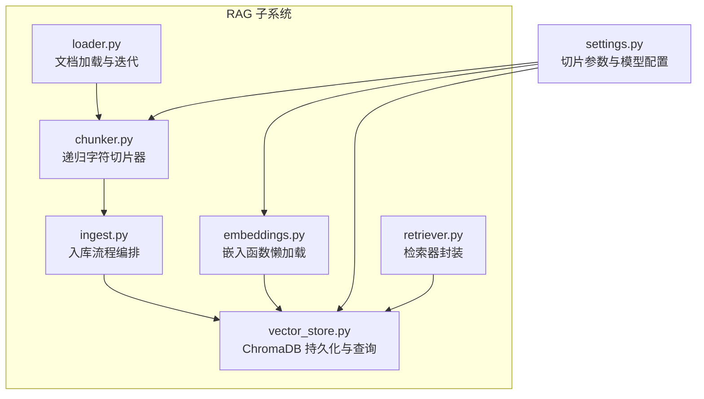
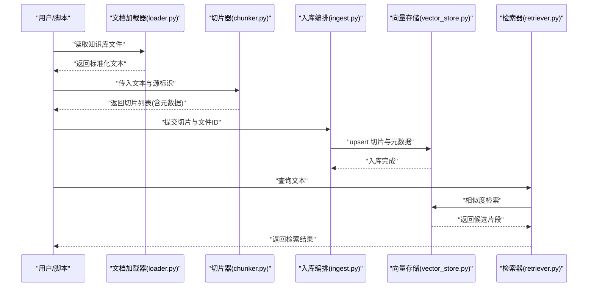
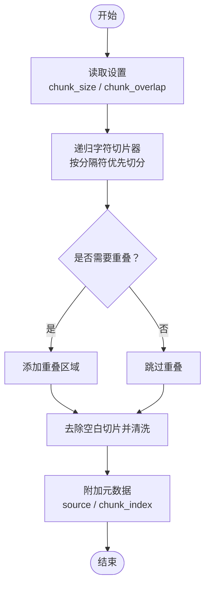
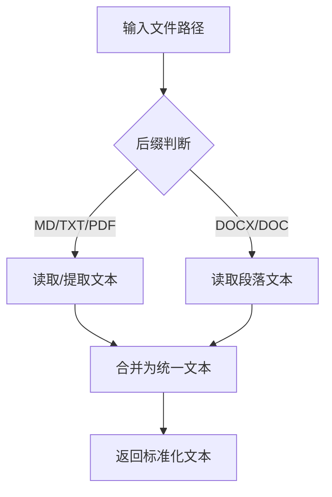
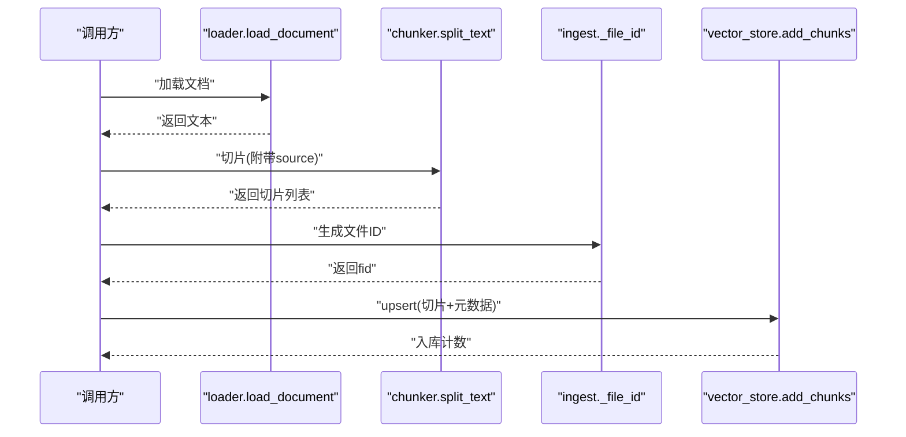
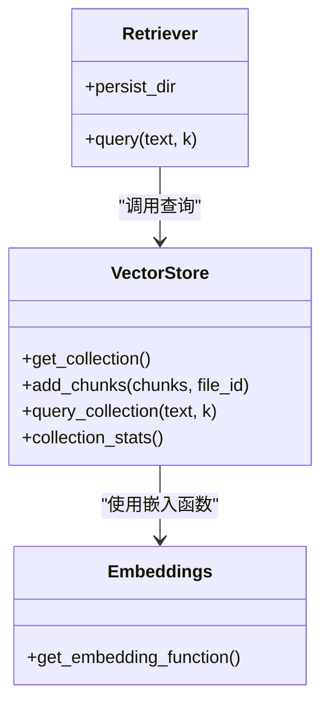
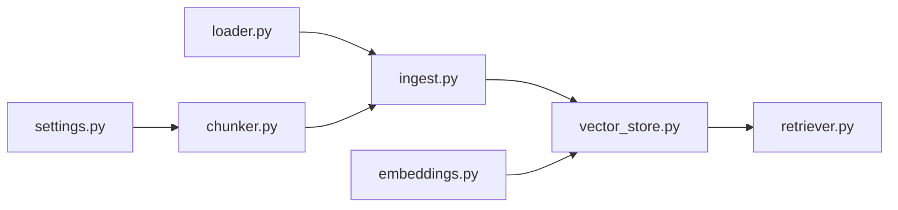

# 文本切片处理

<cite>
**本文引用的文件**
- [rag/chunker.py](file://rag/chunker.py)
- [backend/settings.py](file://backend/settings.py)
- [rag/ingest.py](file://rag/ingest.py)
- [rag/loader.py](file://rag/loader.py)
- [rag/vector_store.py](file://rag/vector_store.py)
- [rag/retriever.py](file://rag/retriever.py)
- [rag/embeddings.py](file://rag/embeddings.py)
- [knowledge/courses/python_basics.md](file://knowledge/courses/python_basics.md)
- [knowledge/courses/lanqiao_python.md](file://knowledge/courses/lanqiao_python.md)
</cite>

## 目录
1. [简介](#简介)
2. [项目结构](#项目结构)
3. [核心组件](#核心组件)
4. [架构总览](#架构总览)
5. [详细组件分析](#详细组件分析)
6. [依赖分析](#依赖分析)
7. [性能考虑](#性能考虑)
8. [故障排查指南](#故障排查指南)
9. [结论](#结论)
10. [附录](#附录)

## 简介
本文件聚焦于 EduAgent 的文本切片处理组件，系统性阐述基于 LangChain 的递归字符切片器在项目中的实现与应用。内容涵盖：
- 固定长度切片与语义边界结合的策略
- 切片大小与重叠区域的配置与影响
- 上下文保持机制与元数据管理
- 不同来源文本（Markdown、PDF、Word）的预处理与规范化
- 切片质量评估、重复内容检测与碎片化处理思路
- 参数配置、性能调优与内存优化建议
- 实际切片示例与算法对比、最佳实践

## 项目结构
与文本切片直接相关的模块主要位于 rag 子系统，以及后端配置 settings。整体流程为：读取知识库文档 → 文本加载与规范化 → 使用递归字符切片器进行切片 → 向量化与入库 → 检索查询。

图表来源
- [rag/loader.py:1-51](file://rag/loader.py#L1-L51)
- [rag/chunker.py:1-21](file://rag/chunker.py#L1-L21)
- [rag/ingest.py:1-48](file://rag/ingest.py#L1-L48)
- [rag/vector_store.py:1-65](file://rag/vector_store.py#L1-L65)
- [rag/embeddings.py:1-21](file://rag/embeddings.py#L1-L21)
- [backend/settings.py:1-67](file://backend/settings.py#L1-L67)
- [rag/retriever.py:1-24](file://rag/retriever.py#L1-L24)

章节来源
- [rag/loader.py:1-51](file://rag/loader.py#L1-L51)
- [rag/chunker.py:1-21](file://rag/chunker.py#L1-L21)
- [rag/ingest.py:1-48](file://rag/ingest.py#L1-L48)
- [rag/vector_store.py:1-65](file://rag/vector_store.py#L1-L65)
- [rag/embeddings.py:1-21](file://rag/embeddings.py#L1-L21)
- [backend/settings.py:1-67](file://backend/settings.py#L1-L67)
- [rag/retriever.py:1-24](file://rag/retriever.py#L1-L24)

## 核心组件
- 递归字符切片器：负责根据设定的块大小与重叠、以及语义分隔符（如段落、句号、换行等）对文本进行切片。
- 文档加载器：统一处理 Markdown、TXT、PDF、DOCX 等格式，输出标准化文本。
- 入库编排：将切片结果写入向量数据库，同时生成唯一 ID 并附加元数据。
- 向量存储与检索：ChromaDB 持久化 + BGE 嵌入，提供相似度检索能力。
- 设置中心：集中管理切片大小、重叠、嵌入模型、集合名称等关键参数。

章节来源
- [rag/chunker.py:8-21](file://rag/chunker.py#L8-L21)
- [rag/loader.py:11-38](file://rag/loader.py#L11-L38)
- [rag/ingest.py:21-28](file://rag/ingest.py#L21-L28)
- [rag/vector_store.py:34-42](file://rag/vector_store.py#L34-L42)
- [backend/settings.py:41-49](file://backend/settings.py#L41-L49)

## 架构总览
从“文档加载”到“切片入库”的完整链路如下：

图表来源
- [rag/loader.py:11-38](file://rag/loader.py#L11-L38)
- [rag/chunker.py:8-21](file://rag/chunker.py#L8-L21)
- [rag/ingest.py:21-28](file://rag/ingest.py#L21-L28)
- [rag/vector_store.py:34-42](file://rag/vector_store.py#L34-L42)
- [rag/retriever.py:18-23](file://rag/retriever.py#L18-L23)

## 详细组件分析

### 递归字符切片器（chunker）
- 实现原理
  - 基于 LangChain 的递归字符切片器，优先按语义分隔符切分，若仍超过块大小则回退到字符级切分。
  - 支持的分隔符顺序体现了“段落 > 换行 > 中文句号/感叹号/问号/分号 > 空格 > 字符”，以尽可能保留语义完整性。
- 关键参数
  - 块大小与重叠：来自设置中心，分别控制切片长度与相邻切片的重叠范围。
  - 分隔符：自定义的优先级列表，兼顾英文与中文的断句习惯。
- 输出结构
  - 返回每个切片的文本与元数据（来源路径、切片索引），并对空白切片进行过滤与清洗。
- 上下文保持
  - 通过重叠区域确保跨切片的连续性；元数据中记录来源与索引，便于溯源与去重。

图表来源
- [rag/chunker.py:8-21](file://rag/chunker.py#L8-L21)
- [backend/settings.py:46-47](file://backend/settings.py#L46-L47)

章节来源
- [rag/chunker.py:8-21](file://rag/chunker.py#L8-L21)
- [backend/settings.py:46-47](file://backend/settings.py#L46-L47)

### 文档加载器（loader）
- 多格式支持
  - Markdown/TXT：直接读取文本，忽略编码错误字符。
  - PDF：逐页提取文本并用双换行连接。
  - DOCX/DOC：读取段落文本并过滤空白段落。
- 文件迭代
  - 支持目录递归扫描，筛选受支持的扩展名，排除占位文件。
- 规范化
  - 统一输出 UTF-8 文本，便于后续切片器处理。

图表来源
- [rag/loader.py:11-38](file://rag/loader.py#L11-L38)
- [rag/loader.py:41-50](file://rag/loader.py#L41-L50)

章节来源
- [rag/loader.py:8-19](file://rag/loader.py#L8-L19)
- [rag/loader.py:22-38](file://rag/loader.py#L22-L38)
- [rag/loader.py:41-50](file://rag/loader.py#L41-L50)

### 入库编排（ingest）
- 流程
  - 加载文档 → 切片 → 生成文件级 ID → 写入向量库。
- 文件 ID 生成
  - 基于相对路径的哈希前缀与原始路径组合，保证跨会话稳定且可追溯。
- 日志与异常
  - 对单文件入库过程进行异常捕获与记录，避免中断整个入库任务。

图表来源
- [rag/ingest.py:21-28](file://rag/ingest.py#L21-L28)
- [rag/chunker.py:8-21](file://rag/chunker.py#L8-L21)
- [rag/vector_store.py:34-42](file://rag/vector_store.py#L34-L42)

章节来源
- [rag/ingest.py:15-28](file://rag/ingest.py#L15-L28)
- [rag/ingest.py:31-41](file://rag/ingest.py#L31-L41)

### 向量存储与检索（vector_store / retriever）
- 持久化客户端
  - 基于 ChromaDB 的持久化客户端，自动创建目录。
- 集合管理
  - 获取或创建集合，指定嵌入函数与距离空间（余弦）。
- 写入与查询
  - upsert 写入：批量写入切片文本、ID 与元数据。
  - 查询：当集合非空时，返回前 K 个最相似片段及其相似度分数。
- 懒加载嵌入
  - 延迟初始化嵌入函数，减少启动成本。

图表来源
- [rag/vector_store.py:24-64](file://rag/vector_store.py#L24-L64)
- [rag/retriever.py:12-23](file://rag/retriever.py#L12-L23)
- [rag/embeddings.py:11-20](file://rag/embeddings.py#L11-L20)

章节来源
- [rag/vector_store.py:16-42](file://rag/vector_store.py#L16-L42)
- [rag/vector_store.py:45-64](file://rag/vector_store.py#L45-L64)
- [rag/retriever.py:12-23](file://rag/retriever.py#L12-L23)
- [rag/embeddings.py:11-20](file://rag/embeddings.py#L11-L20)

## 依赖分析
- 组件耦合
  - chunker 依赖 settings 提供切片参数；ingest 编排串联 loader、chunker 与 vector_store；retriever 仅依赖 vector_store。
- 外部依赖
  - LangChain 文本切片器、ChromaDB、SentenceTransformer 嵌入函数。
- 潜在风险
  - PDF/DOCX 解析依赖第三方库；若解析失败可能影响入库；建议在生产环境增加健壮性与降级策略。

图表来源
- [backend/settings.py:46-47](file://backend/settings.py#L46-L47)
- [rag/chunker.py:8-21](file://rag/chunker.py#L8-L21)
- [rag/loader.py:11-38](file://rag/loader.py#L11-L38)
- [rag/ingest.py:21-28](file://rag/ingest.py#L21-L28)
- [rag/vector_store.py:34-42](file://rag/vector_store.py#L34-L42)
- [rag/embeddings.py:11-20](file://rag/embeddings.py#L11-L20)
- [rag/retriever.py:18-23](file://rag/retriever.py#L18-L23)

章节来源
- [backend/settings.py:46-47](file://backend/settings.py#L46-L47)
- [rag/chunker.py:8-21](file://rag/chunker.py#L8-L21)
- [rag/ingest.py:21-28](file://rag/ingest.py#L21-L28)
- [rag/vector_store.py:34-42](file://rag/vector_store.py#L34-L42)
- [rag/retriever.py:18-23](file://rag/retriever.py#L18-L23)

## 性能考虑
- 切片参数调优
  - 块大小：增大可提升语义完整性但增加检索负担；减小可提高召回粒度但带来碎片化与重叠开销。建议结合下游嵌入维度与检索目标权衡。
  - 重叠比例：适度重叠有助于跨切片上下文连贯，但会增加向量数量与存储/计算成本。可按 10%~20% 的比例试调。
- 文本预处理
  - PDF/DOCX 的解析与拼接可能引入噪声，建议在入库前做基本清洗（如去除多余空白、统一换行）。
- 向量化与检索
  - 嵌入函数懒加载减少冷启动时间；ChromaDB 使用余弦距离，注意集合规模增长带来的索引与查询延迟。
- 内存优化
  - 批量入库时控制批次大小，避免一次性加载过多切片；对大文档采用流式处理与分批写入。
  - 合理设置 top_k，避免返回过多候选导致内存压力。

## 故障排查指南
- 常见问题
  - 切片为空：检查分隔符列表与文本是否包含可识别的语义边界；确认空白切片过滤逻辑生效。
  - 入库失败：查看异常日志，定位具体文件与解析阶段；确认 ChromaDB 持久化目录权限与磁盘空间。
  - 检索无结果：确认集合已写入数据；检查嵌入模型是否正确加载；核对查询文本是否过短或过于稀疏。
- 建议步骤
  - 在 ingest 层增加更细粒度的日志与异常分类；
  - 对 PDF/DOCX 解析失败的文件单独隔离并记录原因；
  - 对超长文档进行采样切片验证，逐步扩大规模。

章节来源
- [rag/ingest.py:37-41](file://rag/ingest.py#L37-L41)
- [rag/vector_store.py:49-51](file://rag/vector_store.py#L49-L51)
- [rag/retriever.py:18-23](file://rag/retriever.py#L18-L23)

## 结论
本组件以“递归字符切片器 + 语义分隔符优先”的方式，在保证语义完整性的前提下实现了可控的切片粒度。通过设置中心集中管理参数、向量库持久化与懒加载嵌入函数，整体具备良好的可维护性与扩展性。建议在生产环境中结合业务场景持续调优切片参数，并完善异常处理与监控告警。

## 附录

### 切片参数配置清单
- 切片大小（chunk_size）：决定单个切片的最大字符数
- 切片重叠（chunk_overlap）：相邻切片共享的字符数
- 嵌入模型（embedding_model）：用于向量化的模型名称
- 检索返回条数（rag_top_k）：查询时返回的候选数量
- ChromaDB 持久化目录（chroma_persist_dir）与集合名（chroma_collection）

章节来源
- [backend/settings.py:41-49](file://backend/settings.py#L41-L49)

### 实际切片示例（基于仓库示例文档）
- 示例来源：知识库中的 Markdown 文档
- 处理流程：加载 → 切片 → 元数据附加 → 入库 → 检索
- 参考文件路径
  - [python_basics.md](file://knowledge/courses/python_basics.md)
  - [lanqiao_python.md](file://knowledge/courses/lanqiao_python.md)

章节来源
- [rag/loader.py:11-19](file://rag/loader.py#L11-L19)
- [rag/chunker.py:8-21](file://rag/chunker.py#L8-L21)
- [rag/ingest.py:21-28](file://rag/ingest.py#L21-L28)
- [rag/vector_store.py:34-42](file://rag/vector_store.py#L34-L42)

### 算法对比与选择建议
- 固定长度切片 vs 语义切片
  - 固定长度：实现简单、性能稳定，但可能破坏语义边界。
  - 语义切片：更贴合检索需求，但对分隔符与语言适配有要求。
- 本实现采用“递归字符 + 自定义分隔符优先”的混合策略，兼顾稳定性与语义完整性。

### 最佳实践
- 切片大小与重叠：先以默认值跑通流程，再依据检索准确率与召回率微调。
- 特殊字符与换行：保持默认分隔符列表，必要时按目标语言补充标点。
- 重复内容检测：可在入库前对切片做指纹去重（如基于哈希），或在检索时过滤低相似度结果。
- 碎片化处理：对极短切片进行合并，避免过度碎片化；对长切片进行二次拆分或摘要抽取。