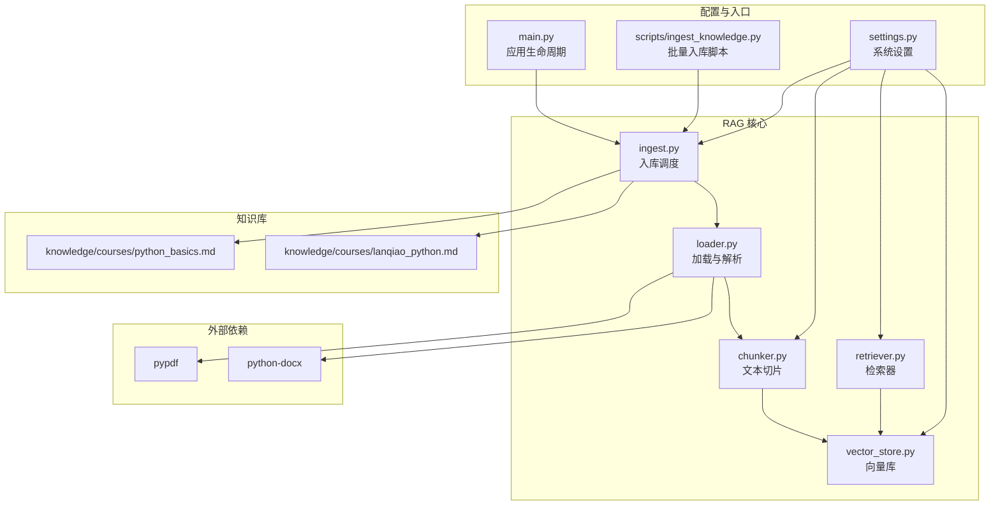
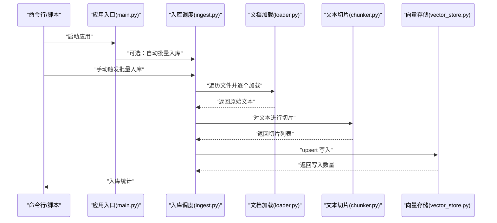
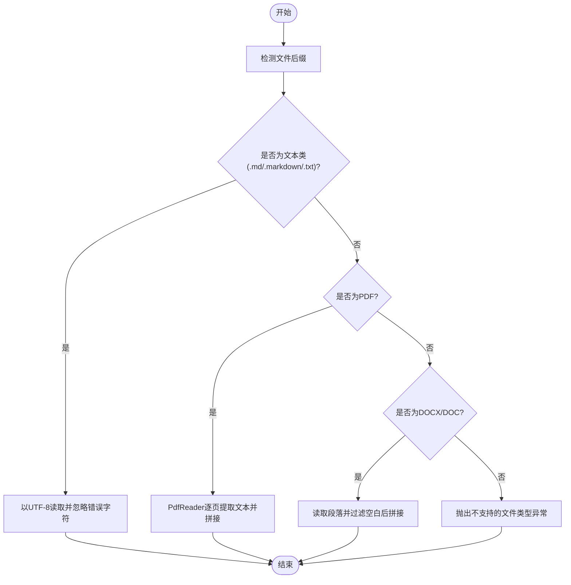
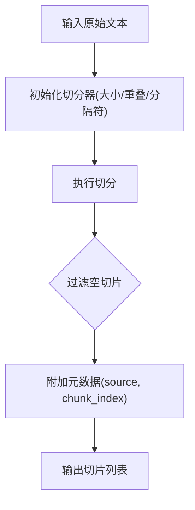
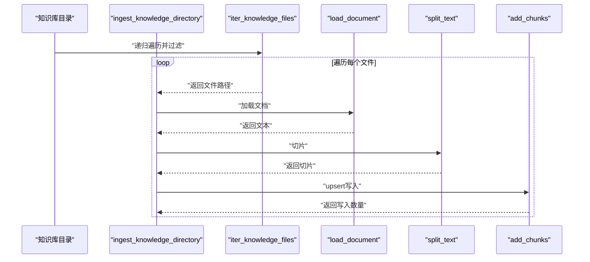
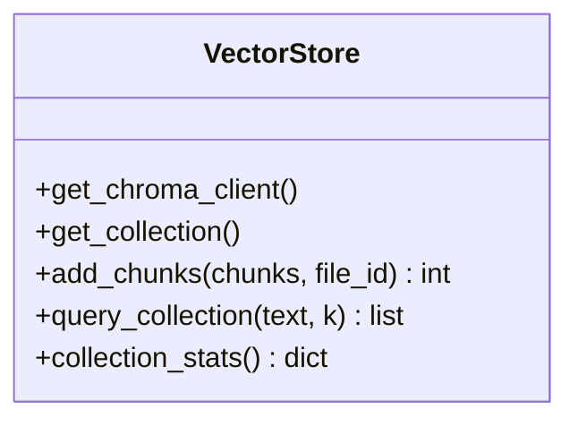
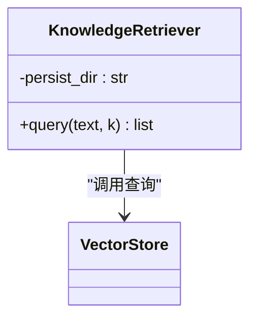
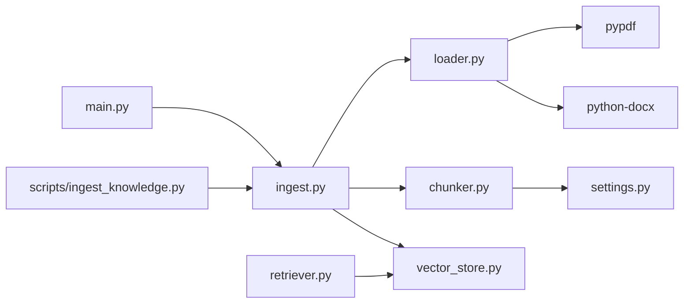

# 文档加载器

<cite>
**本文引用的文件**
- [rag/loader.py](file://rag/loader.py)
- [requirements.txt](file://requirements.txt)
- [rag/chunker.py](file://rag/chunker.py)
- [rag/ingest.py](file://rag/ingest.py)
- [backend/settings.py](file://backend/settings.py)
- [scripts/ingest_knowledge.py](file://scripts/ingest_knowledge.py)
- [knowledge/courses/python_basics.md](file://knowledge/courses/python_basics.md)
- [knowledge/courses/lanqiao_python.md](file://knowledge/courses/lanqiao_python.md)
- [rag/vector_store.py](file://rag/vector_store.py)
- [rag/retriever.py](file://rag/retriever.py)
- [backend/main.py](file://backend/main.py)
</cite>

## 目录
1. [简介](#简介)
2. [项目结构](#项目结构)
3. [核心组件](#核心组件)
4. [架构总览](#架构总览)
5. [详细组件分析](#详细组件分析)
6. [依赖分析](#依赖分析)
7. [性能考虑](#性能考虑)
8. [故障排查指南](#故障排查指南)
9. [结论](#结论)
10. [附录](#附录)

## 简介
本章节介绍 EduAgent 的文档加载器组件，重点覆盖多格式文档的加载机制与流程，包括：
- 文件类型检测与内容提取
- 编码处理策略
- PDF 文档的页面遍历与文本提取
- DOCX 文档的段落提取与空白字符处理
- 文件路径遍历、递归搜索与过滤
- 错误处理与异常恢复
- 性能优化建议
- 使用示例与配置选项

该组件位于 RAG 流程的前端，负责从知识库目录读取并解析各类文档，为后续的切片、向量化与检索提供原始文本。

## 项目结构
与文档加载器直接相关的模块与文件如下：
- 加载与解析：rag/loader.py
- 切片与分块：rag/chunker.py
- 入库与调度：rag/ingest.py
- 向量化存储：rag/vector_store.py
- 检索器封装：rag/retriever.py
- 设置与配置：backend/settings.py
- 启动入口与自动入库：backend/main.py
- 批量入库脚本：scripts/ingest_knowledge.py
- 示例知识文档：knowledge/courses/*.md
- 依赖声明：requirements.txt

图表来源
- [rag/loader.py:1-51](file://rag/loader.py#L1-L51)
- [rag/chunker.py:1-21](file://rag/chunker.py#L1-L21)
- [rag/ingest.py:1-48](file://rag/ingest.py#L1-L48)
- [rag/vector_store.py:1-65](file://rag/vector_store.py#L1-L65)
- [rag/retriever.py:1-24](file://rag/retriever.py#L1-L24)
- [backend/settings.py:1-67](file://backend/settings.py#L1-L67)
- [backend/main.py:1-70](file://backend/main.py#L1-L70)
- [scripts/ingest_knowledge.py:1-23](file://scripts/ingest_knowledge.py#L1-L23)
- [requirements.txt:1-18](file://requirements.txt#L1-L18)

章节来源
- [rag/loader.py:1-51](file://rag/loader.py#L1-L51)
- [backend/settings.py:1-67](file://backend/settings.py#L1-L67)

## 核心组件
- 文档加载器（loader.py）
  - 支持扩展名：.md、.markdown、.txt、.pdf、.docx、.doc
  - 文件类型检测：基于路径后缀小写匹配
  - 内容提取：
    - 文本类：UTF-8 解码，忽略错误字符
    - PDF：逐页提取文本并拼接
    - DOCX：提取非空段落文本并拼接
  - 文件遍历：递归搜索知识库目录，按后缀过滤，排除特定隐藏文件
- 文本切片（chunker.py）
  - 基于 LangChain 的递归字符切分器
  - 支持中英文分隔符序列，控制切片大小与重叠
- 入库调度（ingest.py）
  - 生成文件唯一标识，调用加载与切片，写入向量库
  - 提供批量入库与汇总查询接口
- 向量存储（vector_store.py）
  - 基于 ChromaDB 的持久化客户端与集合管理
  - upsert 写入，支持元数据携带
- 检索器（retriever.py）
  - 包装查询接口，统一异常处理
- 配置（settings.py）
  - 定义知识库目录、向量库路径与集合名称、嵌入模型、切片参数、RAG 检索参数等
- 启动入口（backend/main.py）
  - 应用生命周期中可选择自动执行批量入库
- 批量入库脚本（scripts/ingest_knowledge.py）
  - CLI 方式触发入库与汇总打印

章节来源
- [rag/loader.py:11-50](file://rag/loader.py#L11-L50)
- [rag/chunker.py:8-20](file://rag/chunker.py#L8-L20)
- [rag/ingest.py:21-47](file://rag/ingest.py#L21-L47)
- [rag/vector_store.py:34-42](file://rag/vector_store.py#L34-L42)
- [rag/retriever.py:18-23](file://rag/retriever.py#L18-L23)
- [backend/settings.py:41-49](file://backend/settings.py#L41-L49)
- [backend/main.py:32-39](file://backend/main.py#L32-L39)
- [scripts/ingest_knowledge.py:13-18](file://scripts/ingest_knowledge.py#L13-L18)

## 架构总览
下图展示从知识库到向量库的完整流程，以及各模块间的调用关系。

图表来源
- [backend/main.py:32-39](file://backend/main.py#L32-L39)
- [rag/ingest.py:31-41](file://rag/ingest.py#L31-L41)
- [rag/loader.py:11-38](file://rag/loader.py#L11-L38)
- [rag/chunker.py:8-20](file://rag/chunker.py#L8-L20)
- [rag/vector_store.py:34-42](file://rag/vector_store.py#L34-L42)

## 详细组件分析

### 文档加载器（loader.py）
- 文件类型检测
  - 通过路径后缀（小写）判断文档类型，支持 .md/.markdown/.txt/.pdf/.docx/.doc
- 编码处理
  - 文本类文档以 UTF-8 读取，遇到无法解码的字符时忽略
- PDF 处理
  - 使用 pypdf 的 PdfReader 逐页提取文本，过滤空内容并以双换行拼接
- DOCX 处理
  - 使用 python-docx 读取文档段落数组，过滤空白段落并以双换行拼接
- 文件遍历
  - 递归搜索知识库根目录，按支持后缀过滤，排除特定隐藏文件名

图表来源
- [rag/loader.py:11-38](file://rag/loader.py#L11-L38)

章节来源
- [rag/loader.py:8-19](file://rag/loader.py#L8-L19)
- [rag/loader.py:22-31](file://rag/loader.py#L22-L31)
- [rag/loader.py:34-38](file://rag/loader.py#L34-L38)
- [rag/loader.py:41-50](file://rag/loader.py#L41-L50)

### 文本切片（chunker.py）
- 使用 LangChain 的递归字符切分器，按设定的分隔符序列进行切分
- 切片大小与重叠由配置决定，最终过滤空切片并附加元数据（来源与索引）

图表来源
- [rag/chunker.py:8-20](file://rag/chunker.py#L8-L20)
- [backend/settings.py:46-47](file://backend/settings.py#L46-L47)

章节来源
- [rag/chunker.py:8-20](file://rag/chunker.py#L8-L20)
- [backend/settings.py:46-47](file://backend/settings.py#L46-L47)

### 入库调度（ingest.py）
- 生成文件唯一 ID（基于相对路径的哈希前缀与原路径）
- 对每个文件执行加载、切片、写入向量库，并记录日志
- 批量入口会遍历知识库目录，逐个文件尝试入库，捕获异常并继续

图表来源
- [rag/ingest.py:31-41](file://rag/ingest.py#L31-L41)
- [rag/loader.py:11-19](file://rag/loader.py#L11-L19)
- [rag/chunker.py:8-20](file://rag/chunker.py#L8-L20)
- [rag/vector_store.py:34-42](file://rag/vector_store.py#L34-L42)

章节来源
- [rag/ingest.py:15-28](file://rag/ingest.py#L15-L28)
- [rag/ingest.py:31-41](file://rag/ingest.py#L31-L41)

### 向量存储（vector_store.py）
- 获取或创建集合，指定嵌入函数与距离度量空间
- upsert 写入时为每条切片生成唯一 ID（文件 ID + 切片索引），并合并元数据
- 查询时根据 top_k 返回结果并转换相似度分数

图表来源
- [rag/vector_store.py:16-64](file://rag/vector_store.py#L16-L64)

章节来源
- [rag/vector_store.py:24-42](file://rag/vector_store.py#L24-L42)
- [rag/vector_store.py:45-64](file://rag/vector_store.py#L45-L64)

### 检索器（retriever.py）
- 封装查询接口，内部调用向量库查询并统一异常处理
- 提供异步查询能力，便于在 API 中使用

图表来源
- [rag/retriever.py:12-23](file://rag/retriever.py#L12-L23)
- [rag/vector_store.py:45-59](file://rag/vector_store.py#L45-L59)

章节来源
- [rag/retriever.py:12-23](file://rag/retriever.py#L12-L23)

### 配置（settings.py）
- 关键配置项
  - 知识库目录：knowledge_dir
  - 向量库持久化目录：chroma_persist_dir
  - 集合名称：chroma_collection
  - 嵌入模型：embedding_model
  - 切片参数：chunk_size、chunk_overlap
  - 检索参数：rag_top_k
  - 启动时自动入库：auto_ingest_on_startup

章节来源
- [backend/settings.py:41-49](file://backend/settings.py#L41-L49)

### 启动入口与自动入库（backend/main.py）
- 应用生命周期中可选择自动执行批量入库
- 异常记录但不影响主服务启动

章节来源
- [backend/main.py:32-39](file://backend/main.py#L32-L39)

### 批量入库脚本（scripts/ingest_knowledge.py）
- CLI 触发入库与汇总打印
- 用于离线或定时任务场景

章节来源
- [scripts/ingest_knowledge.py:13-18](file://scripts/ingest_knowledge.py#L13-L18)

## 依赖分析
- 外部依赖
  - pypdf：用于 PDF 文本提取
  - python-docx：用于 DOCX 文本提取
  - langchain-text-splitters：用于文本切片
  - chromadb：用于向量存储
- 内部模块耦合
  - loader 仅依赖标准库与第三方库，低耦合
  - chunker 依赖 settings 提供切片参数
  - ingest 串联 loader、chunker、vector_store
  - retriever 依赖 vector_store
  - main 与 scripts 作为入口，间接依赖 ingest

图表来源
- [requirements.txt:16-17](file://requirements.txt#L16-L17)
- [rag/loader.py:23-35](file://rag/loader.py#L23-L35)
- [rag/chunker.py:3](file://rag/chunker.py#L3)
- [backend/settings.py:46-47](file://backend/settings.py#L46-L47)
- [rag/ingest.py:9](file://rag/ingest.py#L9)
- [rag/vector_store.py:8](file://rag/vector_store.py#L8)
- [rag/retriever.py:7](file://rag/retriever.py#L7)
- [backend/main.py:34-36](file://backend/main.py#L34-L36)
- [scripts/ingest_knowledge.py:10](file://scripts/ingest_knowledge.py#L10)

章节来源
- [requirements.txt:16-17](file://requirements.txt#L16-L17)
- [backend/settings.py:46-47](file://backend/settings.py#L46-L47)

## 性能考虑
- I/O 与 CPU
  - PDF 逐页提取文本，大文档可能产生较多小切片，建议合理设置 chunk_size 与 chunk_overlap
  - DOCX 过滤空白段落，减少无效切片
- 存储写入
  - upsert 写入具备幂等性，适合增量入库
  - 批量入库时建议控制并发与重试策略，避免磁盘压力过大
- 编码与解码
  - 文本类文档采用 UTF-8 并忽略错误字符，确保稳定性
- 检索效率
  - 集合创建时指定余弦距离空间，有助于检索质量
  - 检索 top_k 受集合内条目数量限制，避免超界

[本节为通用性能建议，无需具体文件分析]

## 故障排查指南
- 不支持的文件类型
  - 现象：抛出“不支持的文件类型”异常
  - 处理：确认文件后缀在支持集合内，必要时添加新格式处理器
- PDF 文本缺失或乱码
  - 现象：提取为空或内容异常
  - 处理：检查 PDF 是否加密、字体嵌入情况；必要时转为可复制文本后再入库
- DOCX 空白段落过多
  - 现象：切片后出现大量空行
  - 处理：确认段落文本是否仅含空白字符；可在加载器中进一步清洗
- 入库异常
  - 现象：个别文件入库失败但整体继续
  - 处理：查看日志定位具体文件与异常原因，修复后重新入库
- 启动时自动入库失败
  - 现象：应用启动但未完成入库
  - 处理：检查知识库目录权限与网络访问（如需在线获取资源），查看日志

章节来源
- [rag/loader.py:19](file://rag/loader.py#L19)
- [rag/ingest.py:37-40](file://rag/ingest.py#L37-L40)
- [backend/main.py:38](file://backend/main.py#L38)

## 结论
文档加载器组件以清晰的职责划分与稳健的错误处理实现了多格式文档的统一加载与入库。通过合理的切片策略与向量存储写入，为后续检索提供了高质量的文本基础。建议在生产环境中结合日志监控与定期校验，持续优化切片参数与入库流程。

[本节为总结性内容，无需具体文件分析]

## 附录

### 使用示例
- 启动时自动入库
  - 在设置中启用 auto_ingest_on_startup，应用启动时自动扫描知识库并入库
- CLI 批量入库
  - 运行脚本触发入库与汇总输出
- 手动触发入库
  - 在业务流程中调用批量入库接口，传入知识库目录路径

章节来源
- [backend/main.py:32-39](file://backend/main.py#L32-L39)
- [scripts/ingest_knowledge.py:13-18](file://scripts/ingest_knowledge.py#L13-L18)
- [rag/ingest.py:31-41](file://rag/ingest.py#L31-L41)

### 配置选项
- 知识库目录：knowledge_dir
- 向量库持久化目录：chroma_persist_dir
- 集合名称：chroma_collection
- 嵌入模型：embedding_model
- 切片参数：chunk_size、chunk_overlap
- 检索参数：rag_top_k
- 启动时自动入库：auto_ingest_on_startup

章节来源
- [backend/settings.py:41-49](file://backend/settings.py#L41-L49)

### 示例知识文档
- Python 基础：包含标题、段落、代码块与要点
- 蓝桥杯备考：包含要点与学习路径

章节来源
- [knowledge/courses/python_basics.md:1-54](file://knowledge/courses/python_basics.md#L1-L54)
- [knowledge/courses/lanqiao_python.md:1-25](file://knowledge/courses/lanqiao_python.md#L1-L25)