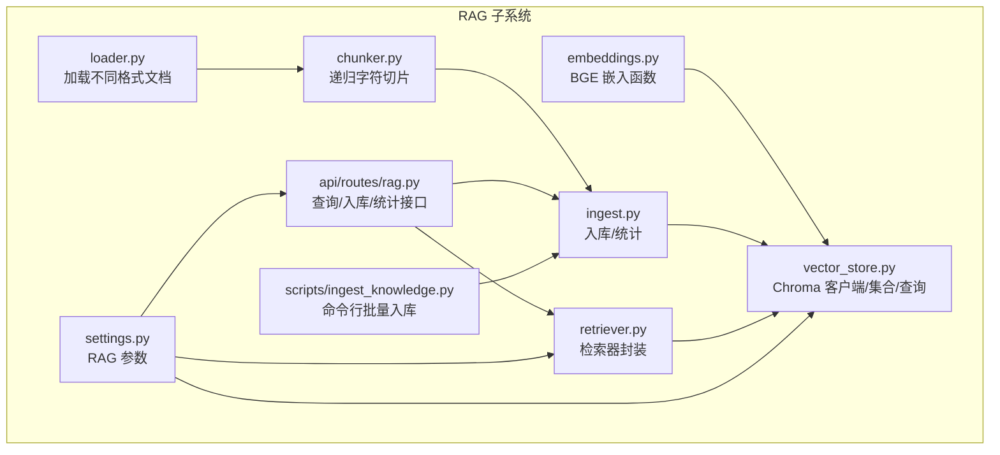
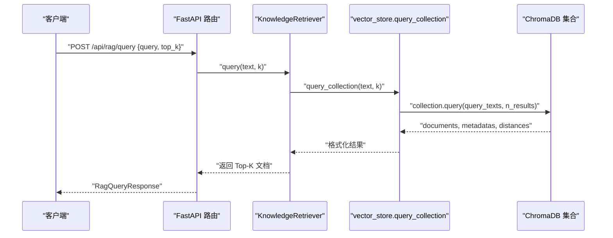
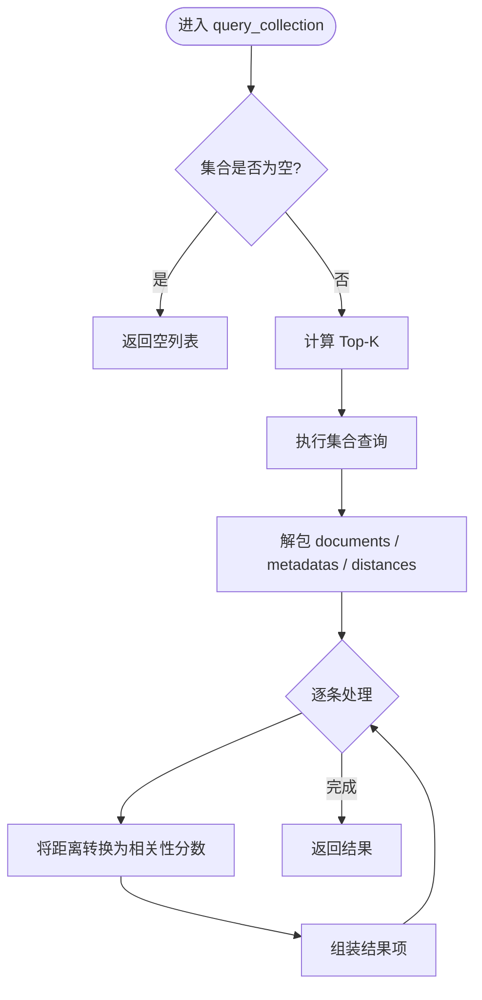
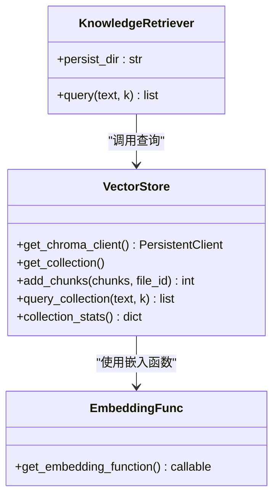
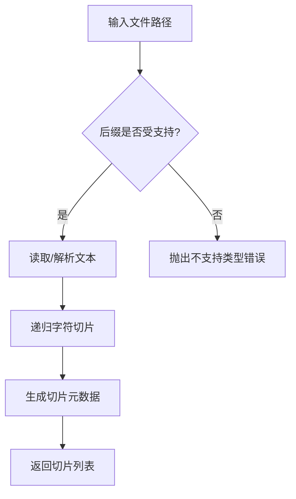
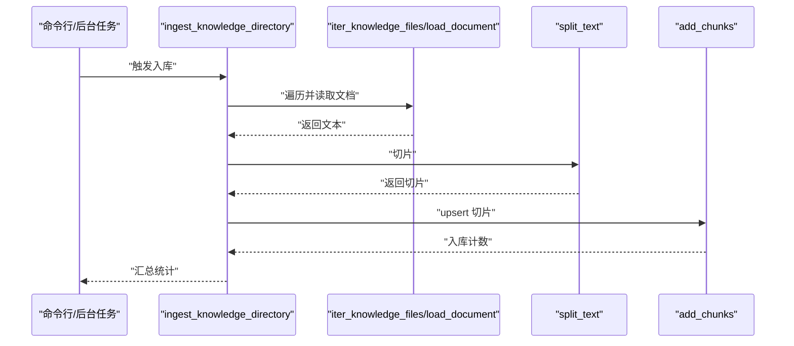
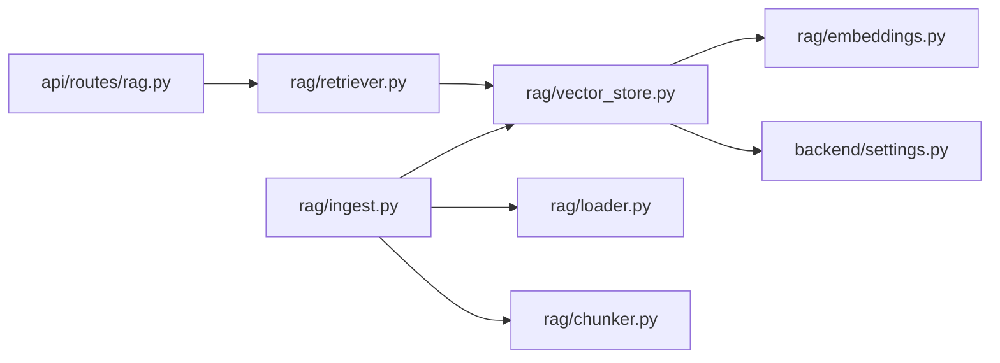

# 检索增强生成

<cite>
**本文引用的文件**
- [rag/__init__.py](file://rag/__init__.py)
- [rag/retriever.py](file://rag/retriever.py)
- [rag/vector_store.py](file://rag/vector_store.py)
- [rag/embeddings.py](file://rag/embeddings.py)
- [rag/chunker.py](file://rag/chunker.py)
- [rag/loader.py](file://rag/loader.py)
- [rag/ingest.py](file://rag/ingest.py)
- [api/routes/rag.py](file://api/routes/rag.py)
- [backend/settings.py](file://backend/settings.py)
- [scripts/ingest_knowledge.py](file://scripts/ingest_knowledge.py)
- [knowledge/courses/python_basics.md](file://knowledge/courses/python_basics.md)
- [prompts/knowledge_agent.md](file://prompts/knowledge_agent.md)
- [backend/core/redis_client.py](file://backend/core/redis_client.py)
</cite>

## 目录
1. [简介](#简介)
2. [项目结构](#项目结构)
3. [核心组件](#核心组件)
4. [架构总览](#架构总览)
5. [详细组件分析](#详细组件分析)
6. [依赖分析](#依赖分析)
7. [性能考虑](#性能考虑)
8. [故障排查指南](#故障排查指南)
9. [结论](#结论)
10. [附录](#附录)

## 简介
本文件聚焦 EduAgent 的检索增强生成（RAG）子系统，系统采用“文档解析 → 文本切片 → 向量化 → 向量检索”的流水线，结合 ChromaDB 向量数据库与 BGE 系列嵌入模型，提供基于课程知识库的语义检索能力。检索器以异步接口对外提供查询能力，支持 Top-K 返回、基础错误处理与日志记录。本文将深入解释检索器工作原理、相似度与相关性评分、上下文召回机制、检索算法现状与扩展方向、查询理解与语义匹配流程、排序与去重策略、质量过滤、性能优化与缓存策略、实时更新机制、检索示例、参数调优与效果评估方法。

## 项目结构
RAG 子系统位于 rag/ 目录，围绕以下模块协同工作：
- 文档加载与迭代：loader.py
- 文本切片：chunker.py
- 知识入库与统计：ingest.py
- 向量嵌入与客户端：embeddings.py、vector_store.py
- 检索器封装：retriever.py
- 对外路由：api/routes/rag.py
- 配置项：backend/settings.py
- 批量入库脚本：scripts/ingest_knowledge.py

图表来源
- [rag/loader.py:11-51](file://rag/loader.py#L11-L51)
- [rag/chunker.py:8-21](file://rag/chunker.py#L8-L21)
- [rag/ingest.py:21-48](file://rag/ingest.py#L21-L48)
- [rag/embeddings.py:11-21](file://rag/embeddings.py#L11-L21)
- [rag/vector_store.py:16-65](file://rag/vector_store.py#L16-L65)
- [rag/retriever.py:12-24](file://rag/retriever.py#L12-L24)
- [api/routes/rag.py:14-43](file://api/routes/rag.py#L14-L43)
- [backend/settings.py:41-50](file://backend/settings.py#L41-L50)
- [scripts/ingest_knowledge.py:13-23](file://scripts/ingest_knowledge.py#L13-L23)

章节来源
- [rag/__init__.py:1-7](file://rag/__init__.py#L1-L7)
- [api/routes/rag.py:11-43](file://api/routes/rag.py#L11-L43)
- [backend/settings.py:41-50](file://backend/settings.py#L41-L50)

## 核心组件
- 检索器 KnowledgeRetriever：封装向量检索调用，提供异步 query 接口，负责异常捕获与默认回退。
- 向量存储与查询 vector_store：提供 Chroma 客户端、集合管理、批量 upsert、查询与统计。
- 嵌入函数 embeddings：基于 BGE 的 SentenceTransformer 嵌入函数，支持懒加载与缓存。
- 文档加载与切片 loader/chunker：支持多种文档格式读取与递归字符切片。
- 入库与统计 ingest：按文件维度切片入库、统计集合状态。
- API 路由 api/routes/rag：提供 /stats、/ingest、/query 接口。
- 配置 settings：集中定义知识库目录、Chroma 持久化路径、集合名、嵌入模型、切片尺寸、Top-K 等。

章节来源
- [rag/retriever.py:12-24](file://rag/retriever.py#L12-L24)
- [rag/vector_store.py:16-65](file://rag/vector_store.py#L16-L65)
- [rag/embeddings.py:11-21](file://rag/embeddings.py#L11-L21)
- [rag/chunker.py:8-21](file://rag/chunker.py#L8-L21)
- [rag/loader.py:11-51](file://rag/loader.py#L11-L51)
- [rag/ingest.py:21-48](file://rag/ingest.py#L21-L48)
- [api/routes/rag.py:14-43](file://api/routes/rag.py#L14-L43)
- [backend/settings.py:41-50](file://backend/settings.py#L41-L50)

## 架构总览
下图展示从“查询请求”到“检索结果”的端到端流程，以及与知识入库、向量存储的关系。

图表来源
- [api/routes/rag.py:38-43](file://api/routes/rag.py#L38-L43)
- [rag/retriever.py:18-23](file://rag/retriever.py#L18-L23)
- [rag/vector_store.py:45-65](file://rag/vector_store.py#L45-L65)

## 详细组件分析

### 检索器与查询流程
- 异步查询：检索器封装对 vector_store.query_collection 的调用，统一异常处理与默认回退。
- 相似度与评分：Chroma 查询返回余弦距离，系统将其转换为 0~1 的相关性分数，数值越大表示越相关。
- 上下文召回：通过 Top-K 返回最相关的文本片段，供上层 Agent 组合提示词进行生成或决策。

图表来源
- [rag/vector_store.py:45-65](file://rag/vector_store.py#L45-L65)

章节来源
- [rag/retriever.py:12-24](file://rag/retriever.py#L12-L24)
- [rag/vector_store.py:45-65](file://rag/vector_store.py#L45-L65)

### 向量存储与嵌入
- Chroma 客户端与集合：支持持久化路径、集合元数据（余弦空间），自动创建或获取集合。
- 批量入库：根据切片生成 ID、文本与元数据，upsert 到集合。
- 嵌入函数：基于 BGE 的 SentenceTransformer 嵌入函数，支持懒加载与缓存，减少初始化成本。

图表来源
- [rag/retriever.py:12-24](file://rag/retriever.py#L12-L24)
- [rag/vector_store.py:16-65](file://rag/vector_store.py#L16-L65)
- [rag/embeddings.py:11-21](file://rag/embeddings.py#L11-L21)

章节来源
- [rag/vector_store.py:16-65](file://rag/vector_store.py#L16-L65)
- [rag/embeddings.py:11-21](file://rag/embeddings.py#L11-L21)

### 文档加载与切片
- 加载器：支持 .md、.markdown、.txt、.pdf、.doc/.docx，PDF 使用 pypdf 提取文本，Word 使用 python-docx。
- 迭代器：遍历知识库目录，筛选受支持后缀的文件。
- 切片器：递归字符切片，支持多种分隔符与重叠，保证语义完整性。

图表来源
- [rag/loader.py:11-51](file://rag/loader.py#L11-L51)
- [rag/chunker.py:8-21](file://rag/chunker.py#L8-L21)

章节来源
- [rag/loader.py:11-51](file://rag/loader.py#L11-L51)
- [rag/chunker.py:8-21](file://rag/chunker.py#L8-L21)

### 入库与统计
- 文件到切片：按相对路径生成文件级 ID，确保同一文件多次入库可幂等更新。
- 批量 upsert：将切片文本与元数据写入集合，ID 规范化为 “file_id::chunk_index”。
- 统计接口：返回集合名称与条目数量，配合 /stats 接口对外展示。

图表来源
- [rag/ingest.py:31-48](file://rag/ingest.py#L31-L48)
- [rag/loader.py:41-51](file://rag/loader.py#L41-L51)
- [rag/chunker.py:8-21](file://rag/chunker.py#L8-L21)
- [rag/vector_store.py:34-42](file://rag/vector_store.py#L34-L42)

章节来源
- [rag/ingest.py:21-48](file://rag/ingest.py#L21-L48)
- [scripts/ingest_knowledge.py:13-23](file://scripts/ingest_knowledge.py#L13-L23)

### API 路由与使用
- /api/rag/stats：返回向量库统计信息。
- /api/rag/ingest：支持同步/异步入库，异步模式通过后台任务执行。
- /api/rag/query：接收查询文本与 Top-K，返回检索结果列表。

章节来源
- [api/routes/rag.py:24-43](file://api/routes/rag.py#L24-L43)

### 查询理解与语义匹配
- 查询理解：当前实现直接将用户输入作为查询文本传入向量检索，未包含显式的关键词抽取或查询重写步骤。
- 语义匹配：基于 BGE 嵌入与 Chroma 余弦距离，实现语义层面的相似度匹配。
- 上下文召回：Top-K 返回最相关的片段，供上层 Agent（如知识 Agent）组合提示词进行结构化解析或生成。

章节来源
- [rag/retriever.py:18-23](file://rag/retriever.py#L18-L23)
- [rag/vector_store.py:45-65](file://rag/vector_store.py#L45-L65)
- [prompts/knowledge_agent.md:1-17](file://prompts/knowledge_agent.md#L1-L17)

### 相关性评分与排序
- 距离到分数：系统将 Chroma 返回的余弦距离转换为 0~1 的相关性分数，数值越大越相关。
- 排序：Chroma 查询已按距离升序返回，系统取前 K 项即为相关性从高到低的排序。
- 去重与质量过滤：当前实现未内置去重与质量过滤逻辑，建议在上层业务或预处理阶段补充。

章节来源
- [rag/vector_store.py:56-65](file://rag/vector_store.py#L56-L65)

### 检索算法现状与扩展
- 当前实现：仅使用向量相似度（Chroma + BGE + 余弦距离）。
- 可扩展策略（建议）：
  - BM25：在传统检索引擎中引入 BM25，与向量检索融合，提升关键词相关性与可解释性。
  - 混合检索：加权融合 BM25 与向量相似度，动态调整权重。
  - 查询扩展：基于 TF-IDF 或同义词扩展提升召回。
  - 多路召回：同时走向量与关键词两条路径，合并排序。
  - 重排（Re-Ranker）：引入细粒度重排模型对候选集进行二次排序。

说明：以上为架构扩展建议，当前代码未实现上述算法。

## 依赖分析
- 组件耦合：检索器仅依赖向量存储查询接口；向量存储依赖嵌入函数与配置；API 路由依赖检索器与入库模块。
- 外部依赖：ChromaDB、SentenceTransformer（BGE）、pypdf、python-docx。
- 配置依赖：RAG 参数集中在 settings 中，影响切片、嵌入模型、Top-K、集合名与持久化路径。

图表来源
- [api/routes/rag.py:8-9](file://api/routes/rag.py#L8-L9)
- [rag/retriever.py:6-7](file://rag/retriever.py#L6-L7)
- [rag/vector_store.py:10-11](file://rag/vector_store.py#L10-L11)
- [rag/embeddings.py:6](file://rag/embeddings.py#L6)
- [backend/settings.py:41-50](file://backend/settings.py#L41-L50)
- [rag/ingest.py:8-10](file://rag/ingest.py#L8-L10)
- [rag/loader.py:11-19](file://rag/loader.py#L11-L19)
- [rag/chunker.py:8-21](file://rag/chunker.py#L8-L21)

章节来源
- [backend/settings.py:41-50](file://backend/settings.py#L41-L50)

## 性能考虑
- 向量检索性能
  - 合理设置 Top-K：过大的 K 会增加网络与解析开销，建议结合业务阈值调优。
  - 集合规模控制：定期清理无效/重复切片，保持集合规模可控。
  - 嵌入模型缓存：嵌入函数已启用懒加载与缓存，避免重复初始化。
- I/O 与并发
  - 入库采用批量 upsert，减少往返次数；建议在后台任务中执行，避免阻塞主线程。
  - 查询为异步接口，便于与上层并发编排。
- 缓存策略
  - 当前未内置检索结果缓存；可在应用层（如 Redis）对热点查询进行缓存，结合 TTL 控制一致性。
  - Redis 客户端已封装，具备可用性降级（不可用时使用内存字典）。
- 实时更新机制
  - 新增/更新知识文件后，通过 /api/rag/ingest 启动入库任务；可通过 /api/rag/stats 观察增量。
  - 建议在文件变更检测基础上触发增量入库，减少全量扫描成本。

章节来源
- [backend/core/redis_client.py:12-45](file://backend/core/redis_client.py#L12-L45)
- [api/routes/rag.py:29-35](file://api/routes/rag.py#L29-L35)
- [api/routes/rag.py:24-26](file://api/routes/rag.py#L24-L26)

## 故障排查指南
- 检索为空
  - 检查集合是否已入库（/api/rag/stats），确认集合计数大于 0。
  - 确认查询文本非空且长度满足最小限制。
- 检索失败
  - 检索器对异常进行捕获并记录警告日志，返回空列表；检查 Chroma 持久化路径与集合元数据。
- 入库异常
  - 单个文件入库失败会被记录异常日志；检查文件格式与内容编码。
- 配置问题
  - 确认嵌入模型名、切片尺寸、重叠、Top-K、集合名与持久化路径均已在配置中正确设置。

章节来源
- [rag/retriever.py:18-23](file://rag/retriever.py#L18-L23)
- [rag/vector_store.py:49-51](file://rag/vector_store.py#L49-L51)
- [api/routes/rag.py:29-42](file://api/routes/rag.py#L29-L42)
- [backend/settings.py:41-50](file://backend/settings.py#L41-L50)

## 结论
EduAgent 的 RAG 子系统以简洁高效的流水线实现了“语义检索 + 上层生成”的基础能力：文档加载与切片、向量嵌入与持久化、向量检索与评分、对外 API 与批量入库。当前实现以向量相似度为核心，具备良好的可扩展性，可在不改变现有接口的前提下引入 BM25、混合检索、重排等策略，进一步提升召回质量与可解释性。建议结合缓存与增量入库策略，持续优化检索性能与用户体验。

## 附录

### 实际检索示例
- 示例文档：[python_basics.md](file://knowledge/courses/python_basics.md)
- 示例提示词：[knowledge_agent.md](file://prompts/knowledge_agent.md)
- 示例调用：
  - 获取统计：GET /api/rag/stats
  - 启动入库：POST /api/rag/ingest
  - 查询检索：POST /api/rag/query { "query": "Python 循环结构", "top_k": 4 }

章节来源
- [api/routes/rag.py:24-43](file://api/routes/rag.py#L24-L43)
- [knowledge/courses/python_basics.md:1-54](file://knowledge/courses/python_basics.md#L1-L54)
- [prompts/knowledge_agent.md:1-17](file://prompts/knowledge_agent.md#L1-L17)

### 参数调优指南
- 切片参数
  - chunk_size：建议 300~800，兼顾语义完整性与上下文长度。
  - chunk_overlap：建议 50~150，平衡相邻切片重叠与冗余。
- 检索参数
  - rag_top_k：建议 3~8，结合上下文长度与生成模型上下文窗口。
- 嵌入模型
  - embedding_model：BAAI/bge-small-zh-v1.5 已在配置中，默认即可；如需更高精度可更换更大模型，但会增加资源消耗。
- 持久化与集合
  - chroma_persist_dir：确保磁盘空间充足，定期备份。
  - chroma_collection：命名规范，避免冲突。

章节来源
- [backend/settings.py:41-50](file://backend/settings.py#L41-L50)
- [rag/chunker.py:10-14](file://rag/chunker.py#L10-L14)
- [rag/vector_store.py:47](file://rag/vector_store.py#L47)

### 效果评估方法
- 人工评估
  - 抽样查询，评估相关性、完整性与可读性。
- 自动指标（建议）
  - NDCG@K、Recall@K：衡量排序质量。
  - 关键词命中率：评估 BM25 补充带来的关键词相关性提升。
  - 生成质量：结合上层 Agent 的输出（如知识树结构、题目质量）进行端到端评估。
- A/B 实验
  - 对比仅向量检索与混合检索的差异，动态调整权重或阈值。

说明：以上为通用评估方法建议，当前代码未内置自动化评估模块。