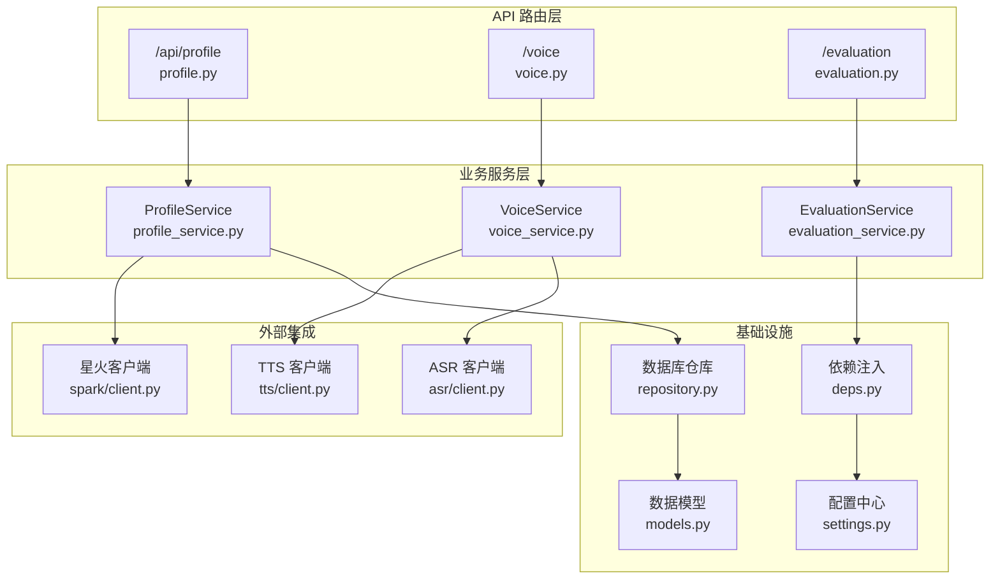
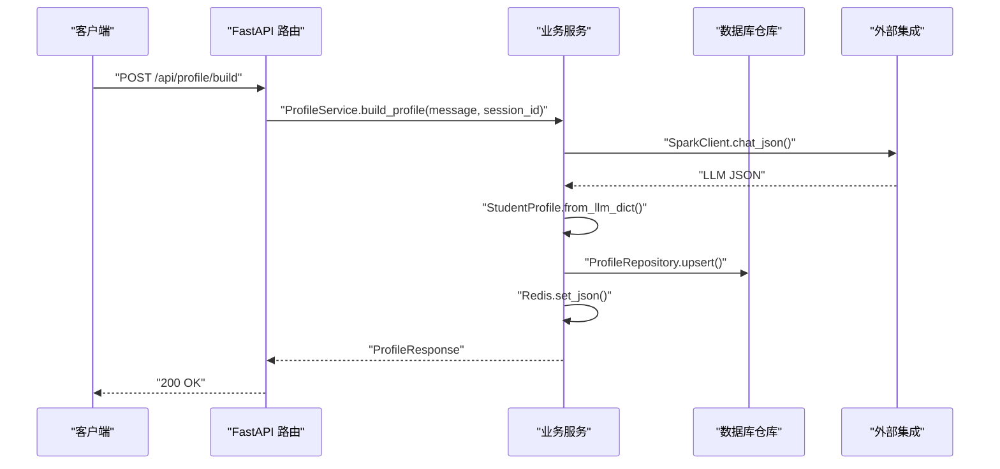
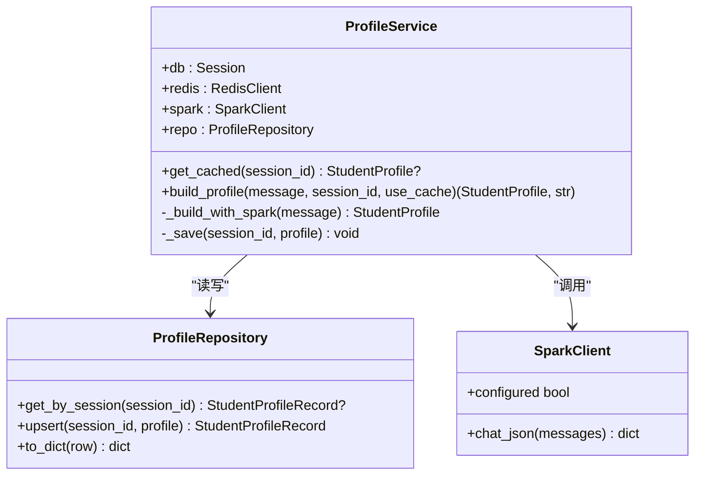
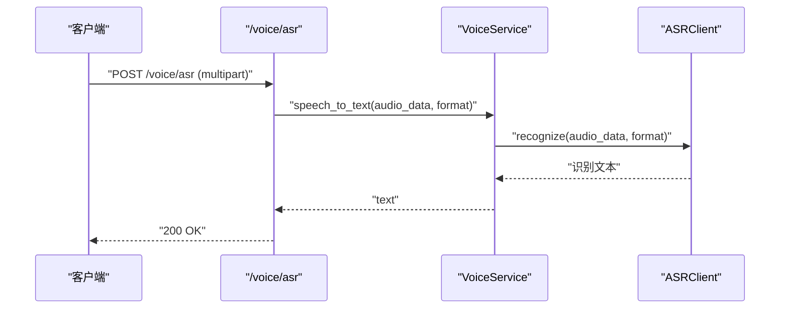
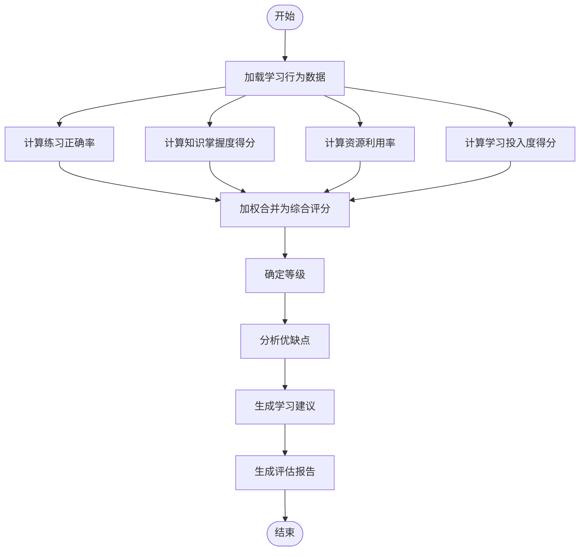
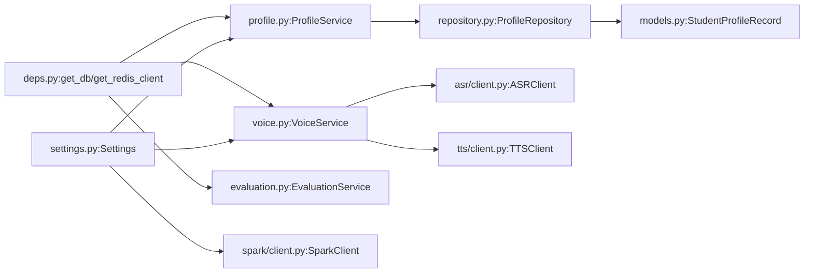

# 业务服务层

<cite>
**本文引用的文件**
- [services/profile_service.py](file://services/profile_service.py)
- [services/voice_service.py](file://services/voice_service.py)
- [services/evaluation_service.py](file://services/evaluation_service.py)
- [backend/main.py](file://backend/main.py)
- [backend/core/deps.py](file://backend/core/deps.py)
- [backend/settings.py](file://backend/settings.py)
- [backend/integrations/spark/client.py](file://backend/integrations/spark/client.py)
- [backend/integrations/asr/client.py](file://backend/integrations/asr/client.py)
- [backend/integrations/tts/client.py](file://backend/integrations/tts/client.py)
- [schemas/profile.py](file://schemas/profile.py)
- [api/routes/profile.py](file://api/routes/profile.py)
- [api/routes/voice.py](file://api/routes/voice.py)
- [api/routes/evaluation.py](file://api/routes/evaluation.py)
- [database/repository.py](file://database/repository.py)
- [database/models.py](file://database/models.py)
</cite>

## 目录
1. [引言](#引言)
2. [项目结构](#项目结构)
3. [核心组件](#核心组件)
4. [架构总览](#架构总览)
5. [详细组件分析](#详细组件分析)
6. [依赖分析](#依赖分析)
7. [性能考虑](#性能考虑)
8. [故障排查指南](#故障排查指南)
9. [结论](#结论)
10. [附录](#附录)

## 引言
本文件聚焦 EduAgent 的业务服务层，系统性阐述三类核心业务服务：学生画像服务、语音服务、评估服务。文档覆盖服务层设计模式、依赖注入机制、事务管理策略；解释各业务服务的功能职责、接口设计与数据流转；提供扩展指南、性能优化方案与错误处理机制，并给出服务调用示例、集成测试方案与监控指标设计。

## 项目结构
业务服务层位于 services 目录，配合 FastAPI 路由层（api/routes）对外暴露 REST 接口，底层通过数据库仓库（database/repository）持久化数据，依赖注入由 backend/core/deps 提供，外部能力通过 backend/integrations 封装（星火、ASR、TTS）。

图表来源
- [api/routes/profile.py:1-57](file://api/routes/profile.py#L1-L57)
- [api/routes/voice.py:1-64](file://api/routes/voice.py#L1-L64)
- [api/routes/evaluation.py:1-119](file://api/routes/evaluation.py#L1-L119)
- [services/profile_service.py:1-166](file://services/profile_service.py#L1-L166)
- [services/voice_service.py:1-51](file://services/voice_service.py#L1-L51)
- [services/evaluation_service.py:1-251](file://services/evaluation_service.py#L1-L251)
- [backend/core/deps.py:1-26](file://backend/core/deps.py#L1-L26)
- [backend/settings.py:1-67](file://backend/settings.py#L1-L67)
- [database/repository.py:1-117](file://database/repository.py#L1-L117)
- [database/models.py:1-40](file://database/models.py#L1-L40)
- [backend/integrations/spark/client.py:1-198](file://backend/integrations/spark/client.py#L1-L198)
- [backend/integrations/asr/client.py:1-95](file://backend/integrations/asr/client.py#L1-L95)
- [backend/integrations/tts/client.py:1-97](file://backend/integrations/tts/client.py#L1-L97)

章节来源
- [backend/main.py:1-70](file://backend/main.py#L1-L70)
- [backend/core/deps.py:1-26](file://backend/core/deps.py#L1-L26)

## 核心组件
- 学生画像服务（ProfileService）
  - 职责：基于用户输入构建/缓存学生画像；支持星火大模型 JSON 解析与规则兜底；统一写入 Redis 缓存与数据库。
  - 关键接口：build_profile、get_cached、_build_with_spark。
  - 数据模型：StudentProfile（Pydantic）。
- 语音服务（VoiceService）
  - 职责：封装 ASR/TTS，提供语音识别、语音合成与语音对话能力；内置配置检测。
  - 关键接口：speech_to_text、text_to_speech、voice_chat。
- 评估服务（EvaluationService）
  - 职责：对学习行为数据进行分析与打分，生成评估报告与建议；支持从报告更新画像。
  - 关键接口：generate_report、calculate_comprehensive_score、generate_suggestions、update_profile_from_report。

章节来源
- [services/profile_service.py:90-166](file://services/profile_service.py#L90-L166)
- [services/voice_service.py:12-51](file://services/voice_service.py#L12-L51)
- [services/evaluation_service.py:89-251](file://services/evaluation_service.py#L89-L251)
- [schemas/profile.py:8-36](file://schemas/profile.py#L8-L36)

## 架构总览
业务服务层采用“路由 → 服务 → 仓库/外部集成”的分层架构，依赖注入通过 FastAPI 的 Depends 获取数据库会话与 Redis 客户端，外部能力通过统一客户端封装，确保配置与错误处理一致。

图表来源
- [api/routes/profile.py:21-30](file://api/routes/profile.py#L21-L30)
- [services/profile_service.py:124-166](file://services/profile_service.py#L124-L166)
- [backend/integrations/spark/client.py:141-171](file://backend/integrations/spark/client.py#L141-L171)
- [database/repository.py:24-36](file://database/repository.py#L24-L36)

## 详细组件分析

### 学生画像服务（ProfileService）
- 设计模式
  - 策略模式：优先使用星火 JSON 解析，失败则回退规则引擎（heuristic_profile）。
  - 缓存模式：Redis + 数据库双写，命中优先返回缓存。
  - 工厂/单例：SparkClient 通过 get_spark_client 缓存实例；Settings 通过 get_settings 缓存实例。
- 依赖注入
  - 通过 FastAPI 路由函数注入 Session 与 RedisClient；SparkClient 通过 get_spark_client 注入。
- 事务管理
  - ProfileRepository 使用 SQLAlchemy 会话进行 upsert，commit 刷新后返回。
- 数据流
  - 输入：message、session_id、use_cache。
  - 输出：StudentProfile、source（spark/heuristic）、cached 标记。
- 错误处理
  - 星火调用异常时记录警告并回退规则；缓存未命中返回数据库记录；无记录抛出 404。
- 扩展建议
  - 支持多模态输入（文本+图片）；引入 LLM 抽取器与正则兜底的混合策略；增加画像版本控制与增量更新。

图表来源
- [services/profile_service.py:90-166](file://services/profile_service.py#L90-L166)
- [database/repository.py:12-44](file://database/repository.py#L12-L44)
- [backend/integrations/spark/client.py:19-27](file://backend/integrations/spark/client.py#L19-L27)

章节来源
- [services/profile_service.py:90-166](file://services/profile_service.py#L90-L166)
- [api/routes/profile.py:21-57](file://api/routes/profile.py#L21-L57)
- [database/repository.py:12-44](file://database/repository.py#L12-L44)
- [backend/integrations/spark/client.py:19-27](file://backend/integrations/spark/client.py#L19-L27)

### 语音服务（VoiceService）
- 设计模式
  - 适配器模式：统一封装 ASR/TTS 客户端，屏蔽底层认证与协议细节。
  - 状态检查：提供 asr_configured/tts_configured/configured 三态判断。
- 依赖注入
  - 通过 get_asr_client/get_tts_client 获取客户端实例。
- 数据流
  - ASR：接收二进制音频 → 返回识别文本。
  - TTS：接收文本 → 返回音频字节流。
  - voice_chat：ASR → 文本处理 → TTS → 返回文本与音频。
- 错误处理
  - 未配置时抛出运行时错误；WebSocket 连接异常捕获并转换为运行时错误；路由层转换为 HTTP 503/500。

图表来源
- [api/routes/voice.py:18-34](file://api/routes/voice.py#L18-L34)
- [services/voice_service.py:31-35](file://services/voice_service.py#L31-L35)
- [backend/integrations/asr/client.py:36-76](file://backend/integrations/asr/client.py#L36-L76)

章节来源
- [services/voice_service.py:12-51](file://services/voice_service.py#L12-L51)
- [api/routes/voice.py:18-64](file://api/routes/voice.py#L18-L64)
- [backend/integrations/asr/client.py:18-95](file://backend/integrations/asr/client.py#L18-L95)
- [backend/integrations/tts/client.py:19-97](file://backend/integrations/tts/client.py#L19-L97)

### 评估服务（EvaluationService）
- 设计模式
  - 计算器模式：EvaluationMetrics 封装各项指标计算方法。
  - 报告生成器模式：generate_report 组合分析、评分、等级、优缺点与建议。
- 数据模型
  - LearningBehaviorData：学习行为数据结构（学习时长、测验结果、知识掌握度、资源使用）。
  - StudentProfile：学生画像结构（来自 schemas/profile）。
- 数据流
  - 输入：student_profile + learning_behavior。
  - 输出：综合评分、等级、分析明细、优缺点、建议、评估完成标记。
- 扩展建议
  - 引入权重动态调整（基于画像或课程目标）；支持多课程/多知识点维度；加入置信度与置信区间。

图表来源
- [services/evaluation_service.py:95-223](file://services/evaluation_service.py#L95-L223)

章节来源
- [services/evaluation_service.py:89-251](file://services/evaluation_service.py#L89-L251)
- [api/routes/evaluation.py:58-119](file://api/routes/evaluation.py#L58-L119)
- [schemas/profile.py:8-36](file://schemas/profile.py#L8-L36)

## 依赖分析
- 依赖注入
  - 数据库会话：get_db 通过 SessionLocal 创建并关闭；Redis 客户端：get_redis_client。
  - 应用配置：get_settings 提供 Settings 实例，含缓存 TTL、星火/ASR/TTS 配置等。
- 外部集成
  - SparkClient：优先 WebSocket，其次 HTTP；支持 JSON 解析与错误码处理。
  - ASR/TTS：基于 WebSocket 的认证签名与流式返回。
- 数据持久化
  - ProfileRepository：按 session_id upsert 学生画像；to_dict 反序列化。
  - EvaluationReport/LearningResource：用于评估报告与学习资源的持久化。

图表来源
- [backend/core/deps.py:12-25](file://backend/core/deps.py#L12-L25)
- [backend/settings.py:6-66](file://backend/settings.py#L6-L66)
- [services/profile_service.py:90-101](file://services/profile_service.py#L90-L101)
- [services/voice_service.py:15-17](file://services/voice_service.py#L15-L17)
- [services/evaluation_service.py:92-93](file://services/evaluation_service.py#L92-L93)
- [database/repository.py:12-44](file://database/repository.py#L12-L44)
- [database/models.py:13-39](file://database/models.py#L13-L39)
- [backend/integrations/spark/client.py:19-27](file://backend/integrations/spark/client.py#L19-L27)
- [backend/integrations/asr/client.py:18-27](file://backend/integrations/asr/client.py#L18-L27)
- [backend/integrations/tts/client.py:19-27](file://backend/integrations/tts/client.py#L19-L27)

章节来源
- [backend/core/deps.py:12-25](file://backend/core/deps.py#L12-L25)
- [backend/settings.py:6-66](file://backend/settings.py#L6-L66)
- [database/repository.py:12-44](file://database/repository.py#L12-L44)
- [database/models.py:13-39](file://database/models.py#L13-L39)

## 性能考虑
- 缓存策略
  - 学生画像：Redis TTL 由 Settings.profile_cache_ttl 控制；命中直接返回，避免重复调用外部模型。
- 并发与超时
  - 星火 WebSocket/HTTP 调用设置超时；ASR/TTS 流式接收，避免阻塞。
- I/O 优化
  - 语音服务返回音频字节流，减少中间对象拷贝；评估服务纯计算，避免数据库往返。
- 扩展建议
  - 引入批量评估接口；对高频画像构建增加预热与异步队列；对评估报告增加分页与索引。

## 故障排查指南
- 星火相关
  - 现象：构建画像失败，回退规则；日志出现警告。
  - 排查：检查 .env 中 SPARK_* 配置是否齐全；确认 WebSocket/HTTP 地址与鉴权参数。
- ASR/TTS 相关
  - 现象：路由返回 503/500。
  - 排查：确认 ASR/TTS 的 appId/apiKey/apiSecret 是否配置；检查 WebSocket 地址可用性与网络连通。
- 数据持久化
  - 现象：画像未保存或读取失败。
  - 排查：检查数据库初始化与表结构；确认 JSON 字段编码与解码逻辑。

章节来源
- [services/profile_service.py:140-147](file://services/profile_service.py#L140-L147)
- [api/routes/voice.py:24-33](file://api/routes/voice.py#L24-L33)
- [backend/integrations/spark/client.py:148-161](file://backend/integrations/spark/client.py#L148-L161)
- [backend/integrations/asr/client.py:36-76](file://backend/integrations/asr/client.py#L36-L76)
- [backend/integrations/tts/client.py:37-85](file://backend/integrations/tts/client.py#L37-L85)

## 结论
业务服务层以清晰的分层与依赖注入实现了高内聚、低耦合的架构。学生画像服务通过缓存与规则兜底保障可用性；语音服务统一了 ASR/TTS 的接入与错误处理；评估服务提供了可扩展的指标体系与报告生成流程。建议后续引入异步评估、动态权重与更细粒度的监控埋点，持续提升稳定性与可维护性。

## 附录

### 服务调用示例（路径指引）
- 构建学生画像
  - 请求：POST /api/profile/build
  - 参数：ProfileBuildRequest（message, session_id）
  - 响应：ProfileResponse（session_id, profile, source, cached）
  - 参考路径：[api/routes/profile.py:21-30](file://api/routes/profile.py#L21-L30)
- 查询学生画像
  - 请求：GET /api/profile/{session_id}
  - 响应：ProfileResponse（cached=true）
  - 参考路径：[api/routes/profile.py:33-43](file://api/routes/profile.py#L33-L43)
- 语音识别
  - 请求：POST /voice/asr（multipart: audio, format）
  - 响应：{"text": "..."}
  - 参考路径：[api/routes/voice.py:18-34](file://api/routes/voice.py#L18-L34)
- 语音合成
  - 请求：POST /voice/tts（form: text, voice）
  - 响应：audio/mpeg 文件
  - 参考路径：[api/routes/voice.py:36-54](file://api/routes/voice.py#L36-L54)
- 评估报告
  - 请求：POST /evaluation/report（EvaluationRequest）
  - 响应：EvaluationResponse（score, level, strengths, weaknesses, suggestions）
  - 参考路径：[api/routes/evaluation.py:58-69](file://api/routes/evaluation.py#L58-L69)

### 集成测试方案
- 单元测试
  - ProfileService：mock SparkClient 返回固定 JSON，验证 StudentProfile 构造与缓存写入。
  - EvaluationService：构造 LearningBehaviorData，断言各项指标与综合评分。
- 端到端测试
  - 使用 FastAPI TestClient 调用 /api/profile/build 与 /evaluation/report，验证完整链路。
- 外部集成测试
  - 在测试环境配置 SPARK/ASR/TTS，执行真实调用并断言响应格式与错误码。

### 监控指标设计
- 画像服务
  - 指标：画像构建耗时、缓存命中率、星火调用成功率、规则兜底比例。
- 语音服务
  - 指标：ASR/TTS 成功率、平均响应时延、音频大小分布、错误分类统计。
- 评估服务
  - 指标：评估报告生成耗时、各维度得分分布、建议条数统计、画像更新频率。