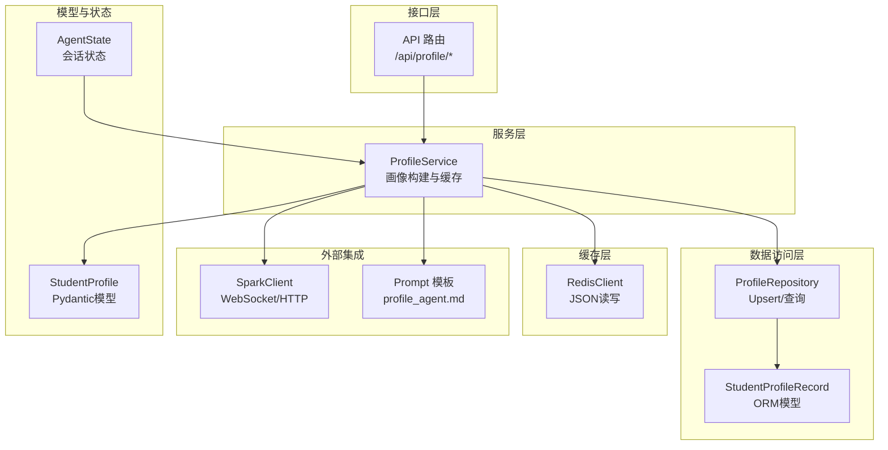
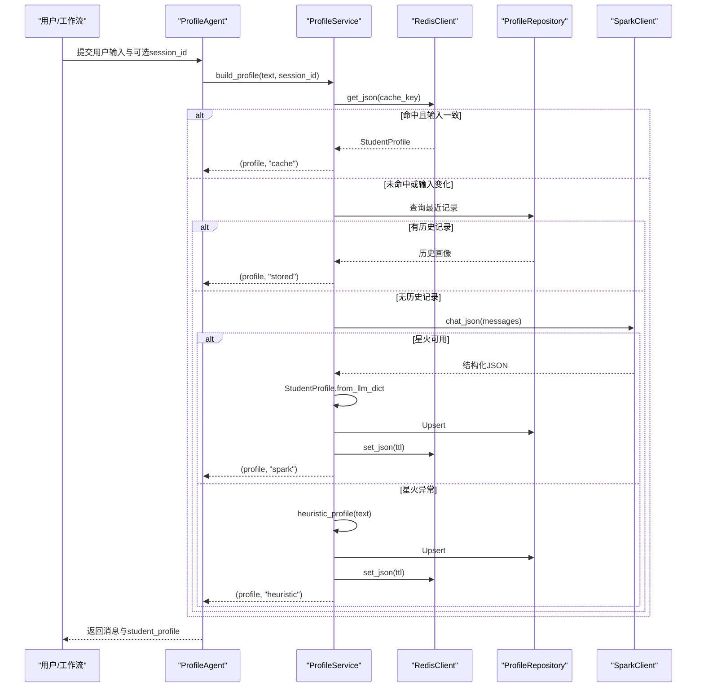
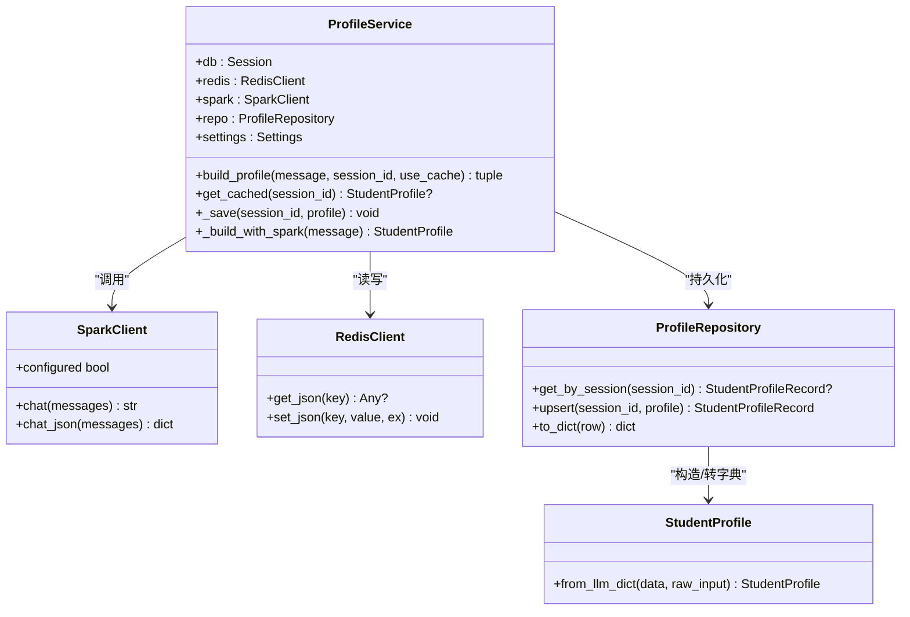
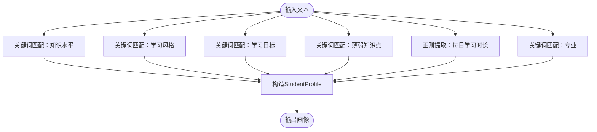
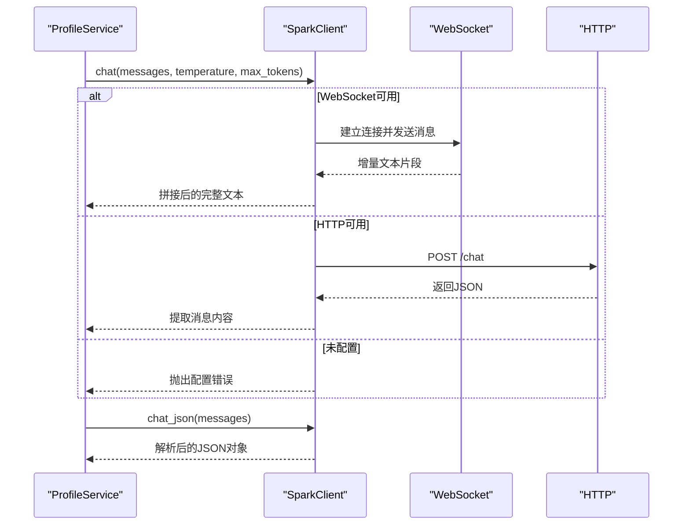
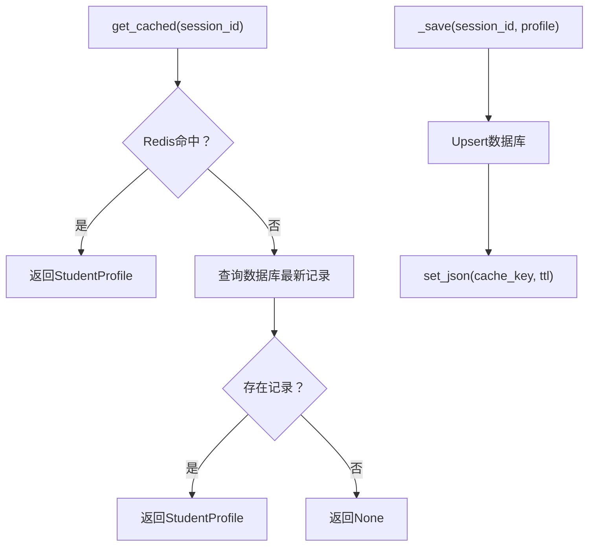
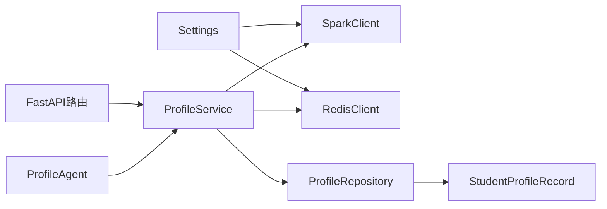

# 学生画像服务

<cite>
**本文引用的文件**
- [agents/profile_agent.py](file://agents/profile_agent.py)
- [services/profile_service.py](file://services/profile_service.py)
- [schemas/profile.py](file://schemas/profile.py)
- [prompts/profile_agent.md](file://prompts/profile_agent.md)
- [backend/integrations/spark/client.py](file://backend/integrations/spark/client.py)
- [database/repository.py](file://database/repository.py)
- [database/models.py](file://database/models.py)
- [backend/core/redis_client.py](file://backend/core/redis_client.py)
- [api/routes/profile.py](file://api/routes/profile.py)
- [backend/settings.py](file://backend/settings.py)
- [workflows/state.py](file://workflows/state.py)
- [software_cup_ai_education_system_architecture.md](file://software_cup_ai_education_system_architecture.md)
- [README.md](file://README.md)
</cite>

## 目录
1. [引言](#引言)
2. [项目结构](#项目结构)
3. [核心组件](#核心组件)
4. [架构总览](#架构总览)
5. [详细组件分析](#详细组件分析)
6. [依赖分析](#依赖分析)
7. [性能考虑](#性能考虑)
8. [故障排查指南](#故障排查指南)
9. [结论](#结论)
10. [附录](#附录)

## 引言
本文件针对EduAgent“学生画像服务”的技术实现进行全面、系统的说明，重点覆盖以下方面：
- ProfileService类的设计架构与职责边界
- 画像构建算法与启发式规则引擎
- 缓存机制与数据库持久化策略
- 讯飞星火API集成策略与错误恢复
- 画像数据结构设计与字段定义
- 从用户输入到最终画像输出的完整数据流
- 质量控制与错误恢复策略
- 实际画像生成示例、性能优化建议与调试技巧
- 缓存策略、数据库持久化与Redis集成

## 项目结构
学生画像服务位于后端服务层，围绕ProfileService为核心，串联Prompt模板、讯飞星火客户端、Redis缓存、SQLAlchemy仓储层与FastAPI路由层，形成“输入→分析→缓存/持久化→输出”的闭环。

图表来源
- [api/routes/profile.py:14-57](file://api/routes/profile.py#L14-L57)
- [services/profile_service.py:90-166](file://services/profile_service.py#L90-L166)
- [backend/integrations/spark/client.py:19-198](file://backend/integrations/spark/client.py#L19-L198)
- [backend/core/redis_client.py:12-73](file://backend/core/redis_client.py#L12-L73)
- [database/repository.py:12-44](file://database/repository.py#L12-L44)
- [database/models.py:13-20](file://database/models.py#L13-L20)
- [schemas/profile.py:8-37](file://schemas/profile.py#L8-L37)
- [prompts/profile_agent.md:1-28](file://prompts/profile_agent.md#L1-L28)
- [workflows/state.py:7-24](file://workflows/state.py#L7-L24)

章节来源
- [README.md:23-41](file://README.md#L23-L41)
- [software_cup_ai_education_system_architecture.md:401-453](file://software_cup_ai_education_system_architecture.md#L401-L453)

## 核心组件
- ProfileAgent：工作流中的入口Agent，负责调用ProfileService并组装返回消息。
- ProfileService：画像构建的核心服务，负责缓存命中、规则兜底、星火分析、数据落库与缓存写入。
- SparkClient：讯飞星火客户端，支持WebSocket与HTTP两种模式，提供JSON解析与错误处理。
- RedisClient：统一的缓存抽象，可用时走Redis，不可用时降级为内存字典。
- ProfileRepository/StudentProfileRecord：画像持久化，Upsert并按session_id查询最新记录。
- StudentProfile：画像数据模型，包含结构化字段与from_llm_dict工厂方法。
- Prompt模板：定义输出字段、规则与期望格式，确保LLM稳定产出JSON。
- API路由：提供/build、/analyze、/{session_id}三个端点，支持缓存读取与禁用缓存的构建。

章节来源
- [agents/profile_agent.py:12-40](file://agents/profile_agent.py#L12-L40)
- [services/profile_service.py:90-166](file://services/profile_service.py#L90-L166)
- [backend/integrations/spark/client.py:19-198](file://backend/integrations/spark/client.py#L19-L198)
- [backend/core/redis_client.py:12-73](file://backend/core/redis_client.py#L12-L73)
- [database/repository.py:12-44](file://database/repository.py#L12-L44)
- [database/models.py:13-20](file://database/models.py#L13-L20)
- [schemas/profile.py:8-37](file://schemas/profile.py#L8-L37)
- [prompts/profile_agent.md:1-28](file://prompts/profile_agent.md#L1-L28)
- [api/routes/profile.py:14-57](file://api/routes/profile.py#L14-L57)

## 架构总览
学生画像服务采用“缓存优先、规则兜底、LLM增强”的三层策略：
- 缓存层：Redis优先，内存降级，避免重复调用星火。
- 规则引擎：当星火未配置或异常时，使用启发式规则快速生成画像。
- LLM增强：通过Prompt约束与JSON解析，提升结构化输出质量。

图表来源
- [agents/profile_agent.py:17-39](file://agents/profile_agent.py#L17-L39)
- [services/profile_service.py:124-166](file://services/profile_service.py#L124-L166)
- [backend/core/redis_client.py:47-57](file://backend/core/redis_client.py#L47-L57)
- [database/repository.py:16-36](file://database/repository.py#L16-L36)
- [backend/integrations/spark/client.py:163-171](file://backend/integrations/spark/client.py#L163-L171)

## 详细组件分析

### ProfileService 类设计与职责
- 职责边界清晰：负责缓存、持久化、LLM调用与回退策略。
- 关键方法
  - 构建入口：build_profile(message, session_id, use_cache)
  - 缓存读取：get_cached(session_id)，优先Redis，其次数据库
  - 保存：_save(session_id, profile)，同时写入数据库与Redis
  - 星火分析：_build_with_spark(message) → chat_json → from_llm_dict
  - 规则兜底：heuristic_profile(text) → 生成基础画像
- 缓存键命名：eduagent:profile:{session_id}，结合settings.profile_cache_ttl

图表来源
- [services/profile_service.py:90-166](file://services/profile_service.py#L90-L166)
- [backend/integrations/spark/client.py:19-198](file://backend/integrations/spark/client.py#L19-L198)
- [backend/core/redis_client.py:12-73](file://backend/core/redis_client.py#L12-L73)
- [database/repository.py:12-44](file://database/repository.py#L12-L44)
- [schemas/profile.py:8-37](file://schemas/profile.py#L8-L37)

章节来源
- [services/profile_service.py:90-166](file://services/profile_service.py#L90-L166)

### 启发式规则引擎工作原理
- 目标：在星火未配置或异常时，仍能快速生成可用画像，保障开发与演示体验。
- 设计原则：以关键词匹配与正则提取为主，保证鲁棒性与可解释性。
- 关键规则
  - 知识水平：基于“熟练/进阶/高级/学过/基础/中等/中级”等词判断
  - 学习风格：基于“图解/图像/看图/视觉/听讲/音频/听课/动手/实践/实验”等词判断
  - 学习目标：基于“蓝桥/考研/研究生/就业/求职/面试”等词判断
  - 薄弱知识点：优先匹配“循环/函数/面向对象/指针/递归/数组”
  - 每日学习时长：基于“每天X小时”“1小时/一小时”等正则提取
  - 专业：基于“计算机/软件”等关键词
- 输出字段映射：与StudentProfile字段一一对应，缺失时使用默认值

图表来源
- [services/profile_service.py:32-87](file://services/profile_service.py#L32-L87)

章节来源
- [services/profile_service.py:32-87](file://services/profile_service.py#L32-L87)

### 讯飞星火API集成策略
- 配置检测：通过Settings.spark_configured判断是否启用WebSocket或HTTP模式
- 请求策略
  - WebSocket优先：适用于Spark Ultra v4，具备流式增量输出能力
  - HTTP备选：适用于开放接口，兼容性更好
- 认证头：支持API Key/Secret或密码认证
- JSON解析：内置鲁棒解析器，支持去除代码块、定位首尾花括号等
- 错误处理：异常时记录警告并回退至规则引擎

图表来源
- [backend/integrations/spark/client.py:59-171](file://backend/integrations/spark/client.py#L59-L171)
- [backend/settings.py:58-61](file://backend/settings.py#L58-L61)

章节来源
- [backend/integrations/spark/client.py:19-198](file://backend/integrations/spark/client.py#L19-L198)
- [backend/settings.py:17-28](file://backend/settings.py#L17-L28)

### 缓存机制与数据库持久化
- 缓存键：eduagent:profile:{session_id}
- 缓存策略
  - 读：先Redis，再数据库
  - 写：Upsert数据库 + set_json(ttl)
- TTL：来自Settings.profile_cache_ttl，默认1小时
- 降级：Redis不可用时使用内存字典，不影响主流程
- 数据库：按session_id查询最新记录，Upsert时更新updated_at

图表来源
- [services/profile_service.py:106-123](file://services/profile_service.py#L106-L123)
- [backend/core/redis_client.py:36-57](file://backend/core/redis_client.py#L36-L57)
- [database/repository.py:16-36](file://database/repository.py#L16-L36)
- [backend/settings.py](file://backend/settings.py#L51)

章节来源
- [services/profile_service.py:103-123](file://services/profile_service.py#L103-L123)
- [backend/core/redis_client.py:12-73](file://backend/core/redis_client.py#L12-L73)
- [database/repository.py:12-44](file://database/repository.py#L12-L44)
- [backend/settings.py](file://backend/settings.py#L51)

### 画像数据结构设计与字段定义
- 核心字段
  - knowledge_level：知识水平，枚举值：beginner/intermediate/advanced
  - learning_style：学习风格，枚举值：visual/auditory/reading/kinesthetic
  - weakness：薄弱知识点关键词
  - goal：目标标识，英文snake_case
  - study_time：每日学习时长，如“1h/day”
  - major：专业
  - learning_goal_text：学习目标原文摘要
  - learning_base：基础描述，如“初学/有基础”
  - learning_style_text：风格原文
  - raw_input：用户原始输入
- 工厂方法：from_llm_dict(data, raw_input)支持多种字段别名映射，增强健壮性

章节来源
- [schemas/profile.py:8-37](file://schemas/profile.py#L8-L37)

### Prompt工程与质量控制
- Prompt模板明确要求：仅输出合法JSON，不得使用代码块或额外解释
- 输出字段清单与示例值：确保LLM遵循固定Schema
- 规则约束：信息不足时合理推断，但knowledge_level不得留空；goal使用英文snake_case标识
- ProfileService在调用前拼接系统提示与用户提示，并限定字段集合，降低输出漂移

章节来源
- [prompts/profile_agent.md:1-28](file://prompts/profile_agent.md#L1-L28)
- [services/profile_service.py:152-166](file://services/profile_service.py#L152-L166)

### API与工作流集成
- FastAPI路由
  - POST /api/profile/build：禁用缓存构建画像
  - GET /api/profile/{session_id}：读取缓存/数据库中的画像
  - POST /api/profile/analyze：启用缓存构建画像
- 工作流状态
  - AgentState中包含student_profile键，ProfileAgent运行后将画像写入共享状态供后续Agent使用

章节来源
- [api/routes/profile.py:14-57](file://api/routes/profile.py#L14-L57)
- [workflows/state.py:7-24](file://workflows/state.py#L7-L24)
- [agents/profile_agent.py:17-39](file://agents/profile_agent.py#L17-L39)

## 依赖分析
- 组件耦合
  - ProfileService依赖SparkClient、RedisClient、ProfileRepository与Settings
  - ProfileAgent依赖ProfileService与数据库会话
  - API路由依赖ProfileService与SparkClient单例
- 外部依赖
  - Redis：缓存与降级
  - PostgreSQL/SQLite：画像持久化
  - 讯飞星火：大模型推理
- 潜在风险
  - 星火不可用时的回退链路是否足够健壮
  - 缓存一致性与TTL策略
  - JSON解析失败的兜底处理

图表来源
- [agents/profile_agent.py:17-39](file://agents/profile_agent.py#L17-L39)
- [services/profile_service.py:90-102](file://services/profile_service.py#L90-L102)
- [api/routes/profile.py:17-18](file://api/routes/profile.py#L17-L18)
- [backend/settings.py:58-61](file://backend/settings.py#L58-L61)

章节来源
- [agents/profile_agent.py:12-40](file://agents/profile_agent.py#L12-L40)
- [services/profile_service.py:90-102](file://services/profile_service.py#L90-L102)
- [api/routes/profile.py:14-57](file://api/routes/profile.py#L14-L57)

## 性能考虑
- 缓存优先：命中缓存直接返回，避免LLM调用
- TTL策略：合理设置profile_cache_ttl，平衡新鲜度与成本
- 并发与超时：SparkClient支持异步调用，注意超时与重试策略
- 数据库写入：Upsert操作在高并发下需关注锁竞争，必要时引入队列或批处理
- Prompt长度：控制用户提示长度，减少Token消耗与延迟
- Redis降级：在网络抖动或Redis故障时，内存缓存保证服务可用

## 故障排查指南
- 星火未配置
  - 现象：抛出配置错误
  - 处理：检查.env中SPARK_*配置项，或启用规则兜底
- 星火响应异常
  - 现象：chat_json解析失败或返回非JSON
  - 处理：查看日志warning，确认Prompt约束与JSON解析逻辑
- 缓存不可用
  - 现象：Redis不可达，使用内存缓存
  - 处理：检查Redis连接参数与网络，必要时临时关闭redis_enabled
- 数据库异常
  - 现象：Upsert失败或查询不到记录
  - 处理：确认session_id一致性与表结构，检查updated_at更新逻辑
- API返回404
  - 现象：GET /api/profile/{session_id}返回未找到
  - 处理：确认session_id是否正确，或先POST /api/profile/analyze生成画像

章节来源
- [backend/integrations/spark/client.py:148-162](file://backend/integrations/spark/client.py#L148-L162)
- [services/profile_service.py:143-147](file://services/profile_service.py#L143-L147)
- [backend/core/redis_client.py:20-31](file://backend/core/redis_client.py#L20-L31)
- [database/repository.py:24-36](file://database/repository.py#L24-L36)
- [api/routes/profile.py:41-43](file://api/routes/profile.py#L41-L43)

## 结论
学生画像服务通过“缓存优先、规则兜底、LLM增强”的设计，在保证用户体验的同时兼顾了稳定性与可扩展性。其核心在于：
- 清晰的服务边界与职责划分
- 健壮的错误恢复与降级策略
- 结构化的数据模型与Prompt工程
- 可观测、可配置的缓存与持久化

## 附录

### 画像生成示例（路径指引）
- 简化工作流测试：参考脚本执行ProfileAgent与PlannerAgent，观察state中student_profile字段
  - [scripts/test_workflow_simple.py:18-46](file://scripts/test_workflow_simple.py#L18-L46)
- API调用示例
  - POST /api/profile/analyze：构建并返回画像
  - GET /api/profile/{session_id}：读取缓存/数据库中的画像
  - POST /api/profile/build：禁用缓存构建
  - [api/routes/profile.py:21-57](file://api/routes/profile.py#L21-L57)

### 调试技巧
- 启用详细日志：关注星火调用与缓存命中日志
- 检查Prompt：确认输出字段与规则约束
- 验证缓存键：使用Redis命令查看eduagent:profile:*键值
- 校验数据库：确认student_profiles表中是否存在对应session_id记录

### 关键配置项
- 星火相关：SPARK_API_TYPE、SPARK_APP_ID、SPARK_API_KEY、SPARK_API_SECRET、SPARK_WS_URL、SPARK_API_URL、SPARK_DOMAIN、SPARK_MODEL、SPARK_TIMEOUT
- 缓存与数据库：REDIS_URL、REDIS_ENABLED、DATABASE_URL、PROFILE_CACHE_TTL
- CORS与日志：CORS_ORIGINS、LOG_LEVEL

章节来源
- [backend/settings.py:17-51](file://backend/settings.py#L17-L51)
- [api/routes/profile.py:14-57](file://api/routes/profile.py#L14-L57)
- [README.md:95-111](file://README.md#L95-L111)