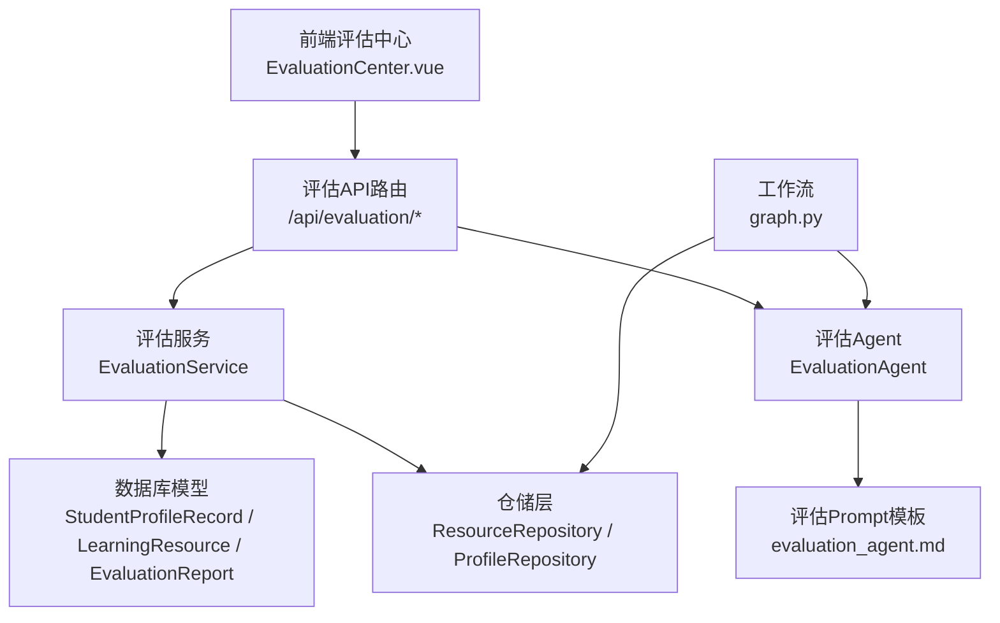
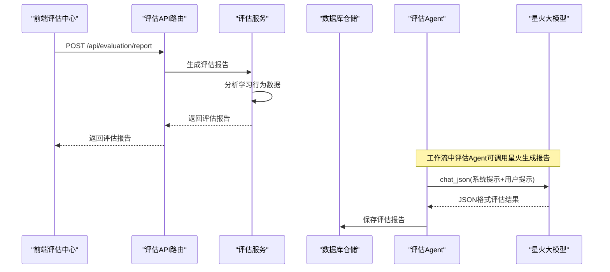
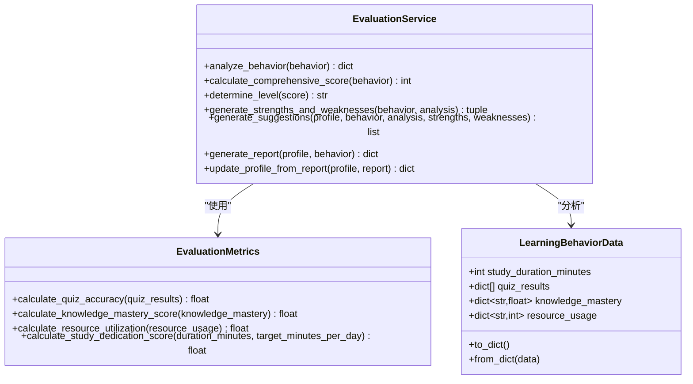
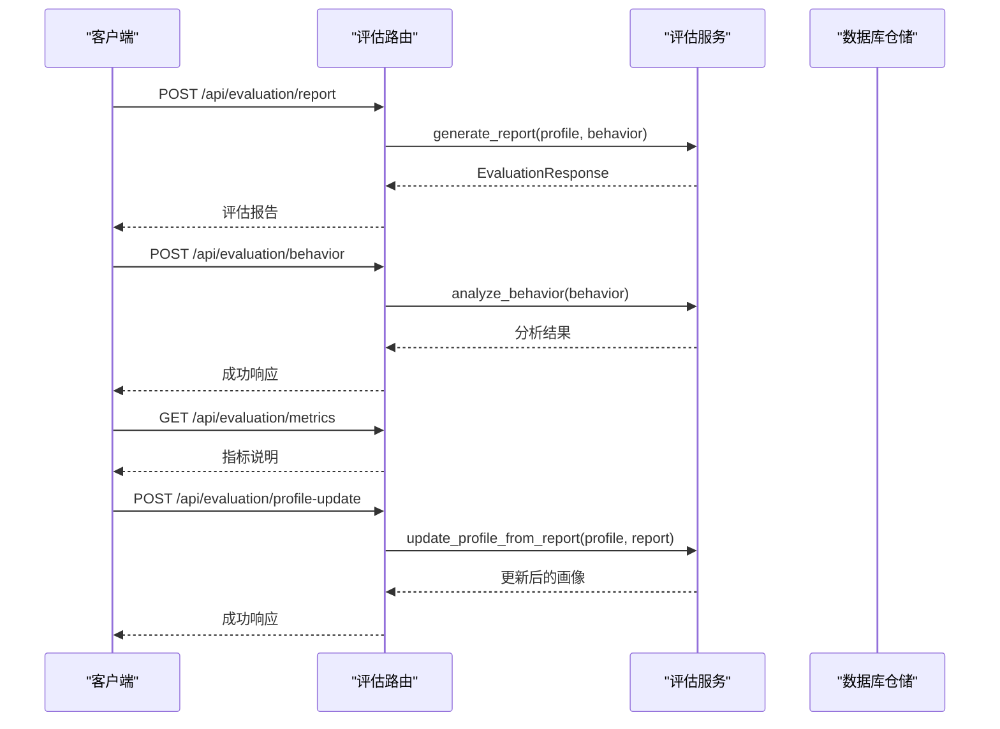
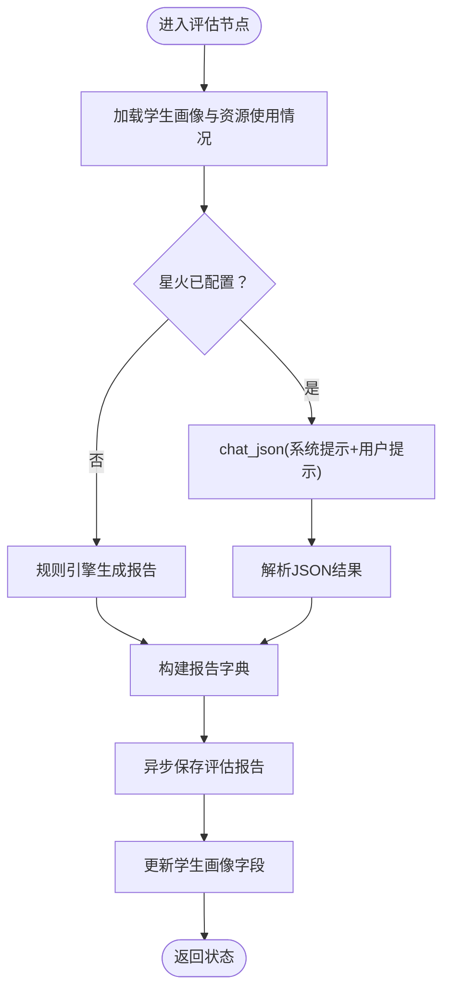
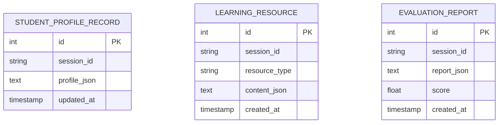
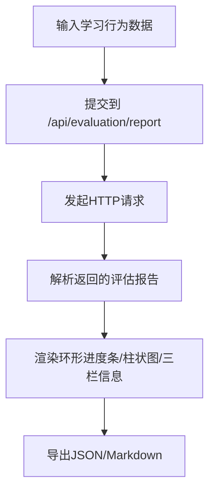
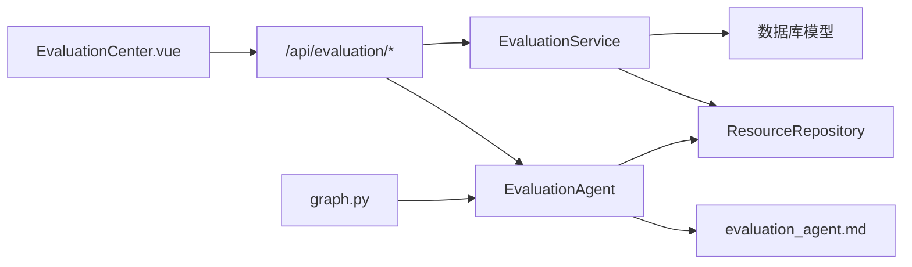

# 评估服务

<cite>
**本文引用的文件**
- [agents/evaluation_agent.py](file://agents/evaluation_agent.py)
- [services/evaluation_service.py](file://services/evaluation_service.py)
- [api/routes/evaluation.py](file://api/routes/evaluation.py)
- [prompts/evaluation_agent.md](file://prompts/evaluation_agent.md)
- [database/models.py](file://database/models.py)
- [database/repository.py](file://database/repository.py)
- [workflows/graph.py](file://workflows/graph.py)
- [schemas/profile.py](file://schemas/profile.py)
- [frontend/src/components/EvaluationCenter.vue](file://frontend/src/components/EvaluationCenter.vue)
- [README.md](file://README.md)
</cite>

## 目录
1. [简介](#简介)
2. [项目结构](#项目结构)
3. [核心组件](#核心组件)
4. [架构概览](#架构概览)
5. [详细组件分析](#详细组件分析)
6. [依赖分析](#依赖分析)
7. [性能考虑](#性能考虑)
8. [故障排查指南](#故障排查指南)
9. [结论](#结论)
10. [附录](#附录)

## 简介
本文件面向EduAgent的评估服务，系统性阐述其设计理念、评估指标体系、报告生成机制，并深入解析学习行为分析算法、评估数据收集策略、报告模板设计。同时，文档解释评估服务与多智能体系统的集成方式、评估Agent的协作机制、动态评估更新流程；覆盖评估指标定义、权重计算方法、趋势分析算法；提供评估报告的实际生成示例、评估结果可视化方案、性能监控指标；并涵盖评估数据的存储策略、历史数据分析、个性化评估建议等核心功能实现。

## 项目结构
评估服务位于后端服务层，围绕“学习行为数据”驱动“评估指标计算”，最终生成“评估报告”。前端提供交互界面用于输入学习行为数据并展示评估结果。数据库层负责持久化学生画像、学习资源与评估报告。

图表来源
- [frontend/src/components/EvaluationCenter.vue](file://frontend/src/components/EvaluationCenter.vue)
- [api/routes/evaluation.py](file://api/routes/evaluation.py)
- [services/evaluation_service.py](file://services/evaluation_service.py)
- [database/models.py](file://database/models.py)
- [database/repository.py](file://database/repository.py)
- [agents/evaluation_agent.py](file://agents/evaluation_agent.py)
- [prompts/evaluation_agent.md](file://prompts/evaluation_agent.md)
- [workflows/graph.py](file://workflows/graph.py)

章节来源
- [README.md](file://README.md)
- [frontend/src/components/EvaluationCenter.vue](file://frontend/src/components/EvaluationCenter.vue)
- [api/routes/evaluation.py](file://api/routes/evaluation.py)
- [services/evaluation_service.py](file://services/evaluation_service.py)
- [database/models.py](file://database/models.py)
- [database/repository.py](file://database/repository.py)
- [agents/evaluation_agent.py](file://agents/evaluation_agent.py)
- [prompts/evaluation_agent.md](file://prompts/evaluation_agent.md)
- [workflows/graph.py](file://workflows/graph.py)

## 核心组件
- 评估服务（EvaluationService）：负责学习行为数据的分析、指标计算、综合评分、等级判定、优势与薄弱点分析、个性化建议生成、以及将评估报告更新到学生画像。
- 评估API路由（/api/evaluation）：提供评估报告生成、学习行为提交、指标说明查询、以及基于评估报告更新学生画像的接口。
- 评估Agent（EvaluationAgent）：在多智能体工作流中运行，结合星火大模型与规则引擎生成评估报告，并将报告持久化。
- 数据库模型与仓储：提供学生画像、学习资源、评估报告的持久化能力。
- 前端评估中心：提供学习行为数据输入、实时可视化展示、报告导出等功能。

章节来源
- [services/evaluation_service.py](file://services/evaluation_service.py)
- [api/routes/evaluation.py](file://api/routes/evaluation.py)
- [agents/evaluation_agent.py](file://agents/evaluation_agent.py)
- [database/models.py](file://database/models.py)
- [database/repository.py](file://database/repository.py)
- [frontend/src/components/EvaluationCenter.vue](file://frontend/src/components/EvaluationCenter.vue)

## 架构概览
评估服务采用“服务层 + API路由 + Agent + 数据库”的分层架构。前端通过REST API提交学习行为数据，后端评估服务进行指标计算与报告生成；在工作流中，评估Agent作为独立节点参与多智能体编排，支持回流机制以实现动态优化。

图表来源
- [api/routes/evaluation.py](file://api/routes/evaluation.py)
- [services/evaluation_service.py](file://services/evaluation_service.py)
- [agents/evaluation_agent.py](file://agents/evaluation_agent.py)
- [database/repository.py](file://database/repository.py)

## 详细组件分析

### 评估服务（EvaluationService）
- 学习行为数据结构（LearningBehaviorData）：包含学习时长、练习结果、知识掌握度、资源使用次数等字段，提供序列化/反序列化能力。
- 评估指标（EvaluationMetrics）：提供练习正确率、知识掌握度得分、资源利用率、学习投入度得分的计算方法。
- 综合评分与等级：采用加权求和的方式计算综合评分，并按阈值划分等级。
- 优势与薄弱点分析：基于各指标阈值判断学习者的优势与薄弱点。
- 个性化建议：结合学习者画像与行为分析，生成针对性建议。
- 报告生成：整合分析结果、评分、等级、评论、优势、薄弱点、建议等字段，形成完整评估报告。
- 画像更新：将评估报告的关键信息写回学生画像，便于后续个性化推荐与路径调整。

图表来源
- [services/evaluation_service.py](file://services/evaluation_service.py)

章节来源
- [services/evaluation_service.py](file://services/evaluation_service.py)

### 评估API路由（/api/evaluation）
- /api/evaluation/report：接收学生画像与学习行为数据，返回评估报告。
- /api/evaluation/behavior：提交学习行为数据，返回各维度分析结果。
- /api/evaluation/metrics：返回评估指标说明。
- /api/evaluation/profile-update：根据评估报告更新学生画像。

图表来源
- [api/routes/evaluation.py](file://api/routes/evaluation.py)
- [services/evaluation_service.py](file://services/evaluation_service.py)
- [database/repository.py](file://database/repository.py)

章节来源
- [api/routes/evaluation.py](file://api/routes/evaluation.py)

### 评估Agent（EvaluationAgent）
- 在工作流中作为独立节点运行，从状态中提取学生画像与资源使用情况，生成评估报告。
- 支持星火大模型生成报告，失败时回退到规则引擎生成。
- 将评估报告格式化为Markdown消息，写回状态并持久化到数据库。

图表来源
- [agents/evaluation_agent.py](file://agents/evaluation_agent.py)
- [prompts/evaluation_agent.md](file://prompts/evaluation_agent.md)
- [workflows/graph.py](file://workflows/graph.py)
- [database/repository.py](file://database/repository.py)

章节来源
- [agents/evaluation_agent.py](file://agents/evaluation_agent.py)
- [prompts/evaluation_agent.md](file://prompts/evaluation_agent.md)
- [workflows/graph.py](file://workflows/graph.py)
- [database/repository.py](file://database/repository.py)

### 数据模型与仓储
- StudentProfileRecord：学生画像记录，包含session_id、profile_json、updated_at。
- LearningResource：学习资源记录，包含session_id、resource_type、content_json、created_at。
- EvaluationReport：评估报告记录，包含session_id、report_json、score、created_at。
- ResourceRepository：提供资源与评估报告的保存、查询能力。
- ProfileRepository：提供学生画像的查询与更新能力。

图表来源
- [database/models.py](file://database/models.py)

章节来源
- [database/models.py](file://database/models.py)
- [database/repository.py](file://database/repository.py)

### 前端评估中心（EvaluationCenter.vue）
- 提供学习时长、测验结果、知识掌握度、资源使用统计的输入与可视化。
- 调用 /api/evaluation/report 生成评估报告，并以环形进度条、柱状图等方式展示。
- 支持导出JSON与Markdown格式的报告。

图表来源
- [frontend/src/components/EvaluationCenter.vue](file://frontend/src/components/EvaluationCenter.vue)
- [api/routes/evaluation.py](file://api/routes/evaluation.py)

章节来源
- [frontend/src/components/EvaluationCenter.vue](file://frontend/src/components/EvaluationCenter.vue)
- [api/routes/evaluation.py](file://api/routes/evaluation.py)

## 依赖分析
- 评估服务依赖学习行为数据结构与评估指标计算方法，输出评估报告。
- 评估API路由依赖评估服务与Pydantic模型，提供REST接口。
- 评估Agent依赖星火客户端与Prompt模板，在工作流中与仓储层交互。
- 仓储层依赖数据库模型，提供持久化能力。
- 前端依赖评估API，负责数据输入与可视化展示。

图表来源
- [frontend/src/components/EvaluationCenter.vue](file://frontend/src/components/EvaluationCenter.vue)
- [api/routes/evaluation.py](file://api/routes/evaluation.py)
- [services/evaluation_service.py](file://services/evaluation_service.py)
- [database/models.py](file://database/models.py)
- [database/repository.py](file://database/repository.py)
- [agents/evaluation_agent.py](file://agents/evaluation_agent.py)
- [prompts/evaluation_agent.md](file://prompts/evaluation_agent.md)
- [workflows/graph.py](file://workflows/graph.py)

章节来源
- [frontend/src/components/EvaluationCenter.vue](file://frontend/src/components/EvaluationCenter.vue)
- [api/routes/evaluation.py](file://api/routes/evaluation.py)
- [services/evaluation_service.py](file://services/evaluation_service.py)
- [database/models.py](file://database/models.py)
- [database/repository.py](file://database/repository.py)
- [agents/evaluation_agent.py](file://agents/evaluation_agent.py)
- [prompts/evaluation_agent.md](file://prompts/evaluation_agent.md)
- [workflows/graph.py](file://workflows/graph.py)

## 性能考虑
- 异步持久化：评估Agent在工作流中通过异步线程保存评估报告，避免阻塞主流程。
- 指标计算复杂度：评估指标均为O(n)线性复杂度，适合大规模并发。
- 星火调用降级：当星火不可用时自动回退到规则引擎，保证服务可用性。
- 前端渲染优化：使用骨架屏与过渡动画提升用户体验，避免长时间等待。

## 故障排查指南
- 星火调用失败：评估Agent捕获异常并记录警告，随后使用规则引擎生成报告。
- 评估API异常：路由层捕获异常并返回500错误，前端显示错误信息。
- 数据库保存失败：仓储层捕获异常并记录警告，不影响整体流程。
- 指标计算异常：评估服务对空数据进行保护，返回默认值。

章节来源
- [agents/evaluation_agent.py](file://agents/evaluation_agent.py)
- [api/routes/evaluation.py](file://api/routes/evaluation.py)
- [database/repository.py](file://database/repository.py)
- [services/evaluation_service.py](file://services/evaluation_service.py)

## 结论
评估服务通过明确的数据结构、清晰的指标计算与报告生成流程，实现了对学习行为的量化评估与个性化建议。其与多智能体工作流的集成支持动态回流与持续优化，前端提供了直观的可视化与导出能力。数据库层确保了评估数据的持久化与历史追踪，为后续的趋势分析与个性化推荐奠定基础。

## 附录

### 评估指标定义与权重
- 练习正确率：基于练习结果的正确比例，用于衡量知识掌握与练习效果。
- 知识掌握度得分：基于知识点掌握度的平均值，反映学习深度。
- 资源利用率：基于资源使用次数的非零占比，反映学习投入与资源利用效率。
- 学习投入度得分：基于学习时长与目标时长的比例，反映学习持续性。

权重分配（加权求和）：
- 练习正确率：30%
- 知识掌握度得分：30%
- 资源利用率：20%
- 学习投入度得分：20%

章节来源
- [services/evaluation_service.py](file://services/evaluation_service.py)

### 动态评估更新流程
- 工作流在评估节点生成报告后，异步保存至数据库。
- 若评估分数低于阈值且回流次数未达上限，则将评估建议注入状态，回流至画像节点进行路径调整。
- 评估报告更新学生画像的关键字段，便于后续个性化推荐。

章节来源
- [workflows/graph.py](file://workflows/graph.py)
- [database/repository.py](file://database/repository.py)
- [services/evaluation_service.py](file://services/evaluation_service.py)

### 评估报告生成示例
- 前端通过输入学习时长、测验结果、知识掌握度、资源使用统计，调用评估API生成报告。
- 报告包含综合评分、等级、总体评价、优势、薄弱点、建议等字段。
- 支持导出JSON与Markdown格式，便于归档与分享。

章节来源
- [frontend/src/components/EvaluationCenter.vue](file://frontend/src/components/EvaluationCenter.vue)
- [api/routes/evaluation.py](file://api/routes/evaluation.py)

### 评估结果可视化方案
- 环形进度条：展示综合评分与等级，支持动画填充。
- 知识掌握度柱状图：使用CSS渐变柱展示各知识点掌握度百分比。
- 三栏分区：优势、薄弱点、建议分别展示，配合颜色编码与图标。
- 学习行为摘要：展示学习时长、测验正确率、资源使用统计。

章节来源
- [frontend/src/components/EvaluationCenter.vue](file://frontend/src/components/EvaluationCenter.vue)

### 性能监控指标
- 评估API响应时间、成功率、错误率。
- 星火调用成功率与延迟。
- 数据库保存耗时与失败率。
- 前端渲染耗时与用户交互响应时间。

章节来源
- [api/routes/evaluation.py](file://api/routes/evaluation.py)
- [agents/evaluation_agent.py](file://agents/evaluation_agent.py)
- [database/repository.py](file://database/repository.py)

### 评估数据存储策略与历史数据分析
- 评估报告与学习资源均以JSON形式存储，便于历史追踪与二次分析。
- 支持按session_id查询评估报告与学习资源，便于生成历史趋势图与对比分析。
- 可扩展为定期聚合统计，生成学习轨迹与改进曲线。

章节来源
- [database/models.py](file://database/models.py)
- [database/repository.py](file://database/repository.py)
- [workflows/graph.py](file://workflows/graph.py)

### 个性化评估建议
- 基于学习者画像与行为分析，生成针对性建议，如加强薄弱知识点、提高资源利用率、增加学习时长等。
- 当评估报告为空或异常时，提供通用建议以维持用户体验。

章节来源
- [services/evaluation_service.py](file://services/evaluation_service.py)
- [schemas/profile.py](file://schemas/profile.py)