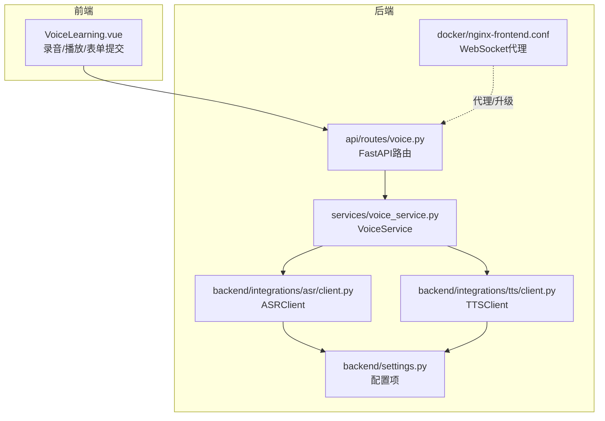
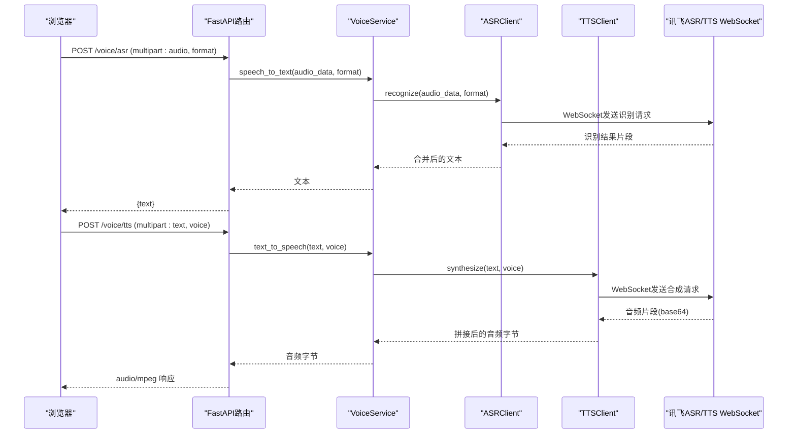
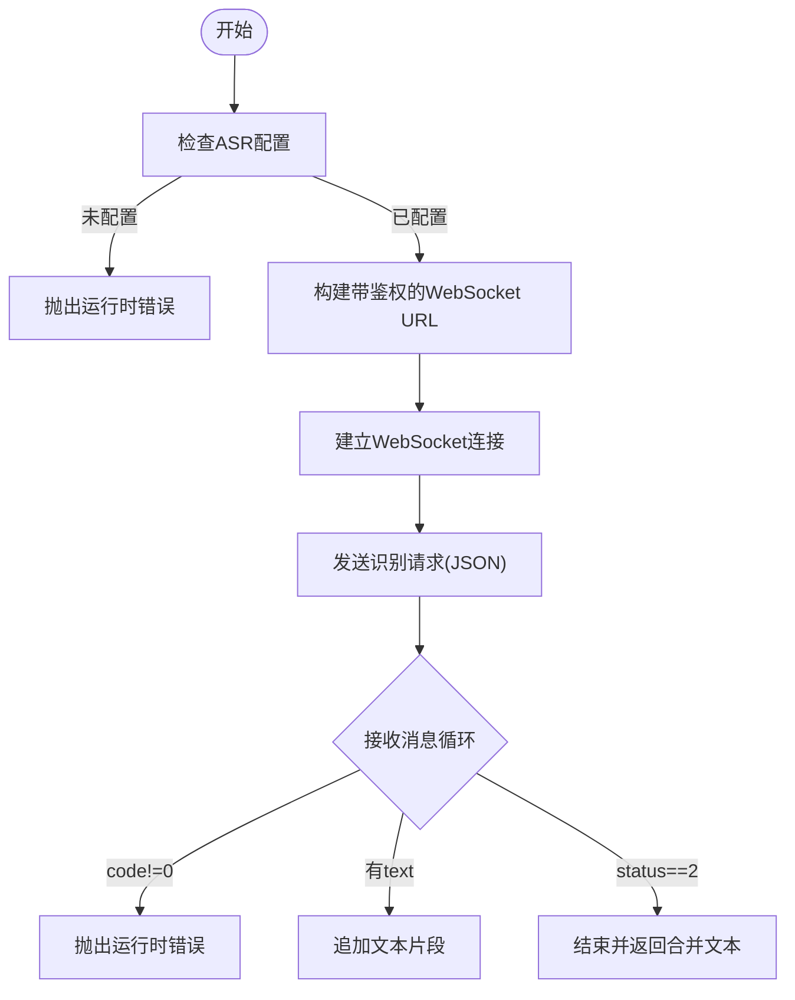
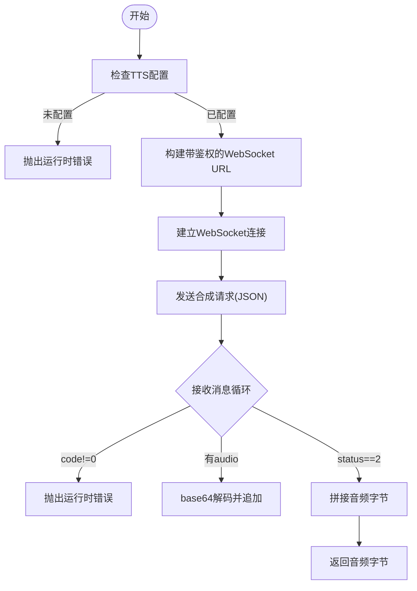
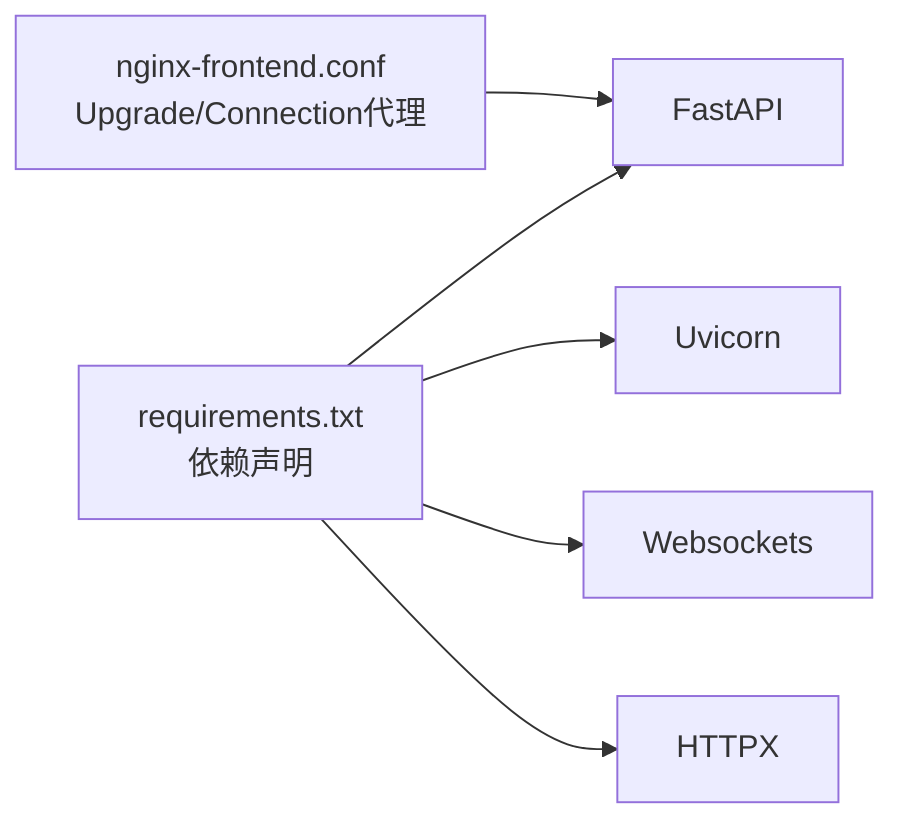

# 语音服务

<cite>
**本文引用的文件列表**
- [api/routes/voice.py](file://api/routes/voice.py)
- [services/voice_service.py](file://services/voice_service.py)
- [backend/integrations/asr/client.py](file://backend/integrations/asr/client.py)
- [backend/integrations/tts/client.py](file://backend/integrations/tts/client.py)
- [backend/integrations/spark/client.py](file://backend/integrations/spark/client.py)
- [backend/integrations/spark/ws_auth.py](file://backend/integrations/spark/ws_auth.py)
- [backend/settings.py](file://backend/settings.py)
- [frontend/src/components/VoiceLearning.vue](file://frontend/src/components/VoiceLearning.vue)
- [docker/nginx-frontend.conf](file://docker/nginx-frontend.conf)
- [requirements.txt](file://requirements.txt)
</cite>

## 目录
1. [简介](#简介)
2. [项目结构](#项目结构)
3. [核心组件](#核心组件)
4. [架构总览](#架构总览)
5. [详细组件分析](#详细组件分析)
6. [依赖关系分析](#依赖关系分析)
7. [性能与优化](#性能与优化)
8. [故障排查指南](#故障排查指南)
9. [结论](#结论)
10. [附录](#附录)

## 简介
本文件面向EduAgent的语音服务，系统性阐述其整体架构、ASR语音识别与TTS语音合成的实现方式、端到端语音数据处理流程（从音频采集到文本转换再到语音播放）、讯飞ASR/TTS API的集成细节、实时语音处理机制、音频格式策略、配置参数、性能优化、错误处理、WebSocket实时通信、音频流处理与并发控制等关键技术点，并提供实际使用示例与音频质量控制、延迟优化建议。

## 项目结构
语音服务位于后端的API路由层、服务层与集成层之间，前端通过浏览器原生API进行录音与播放，后端通过FastAPI暴露REST接口，内部通过ASR/TTS客户端对接讯飞云WebSocket服务。

图表来源
- [api/routes/voice.py:1-64](file://api/routes/voice.py#L1-L64)
- [services/voice_service.py:1-51](file://services/voice_service.py#L1-L51)
- [backend/integrations/asr/client.py:1-95](file://backend/integrations/asr/client.py#L1-L95)
- [backend/integrations/tts/client.py:1-97](file://backend/integrations/tts/client.py#L1-L97)
- [backend/settings.py:1-67](file://backend/settings.py#L1-L67)
- [docker/nginx-frontend.conf:17-30](file://docker/nginx-frontend.conf#L17-L30)

章节来源
- [api/routes/voice.py:1-64](file://api/routes/voice.py#L1-L64)
- [services/voice_service.py:1-51](file://services/voice_service.py#L1-L51)
- [backend/integrations/asr/client.py:1-95](file://backend/integrations/asr/client.py#L1-L95)
- [backend/integrations/tts/client.py:1-97](file://backend/integrations/tts/client.py#L1-L97)
- [backend/settings.py:1-67](file://backend/settings.py#L1-L67)
- [docker/nginx-frontend.conf:17-30](file://docker/nginx-frontend.conf#L17-L30)

## 核心组件
- API路由层：提供/voice/asr、/voice/tts、/voice/status三个端点，负责参数校验、异常映射与响应封装。
- 服务层：VoiceService统一编排ASR/TTS客户端，提供语音对话链路（识别+合成）。
- 集成层：
  - ASRClient：基于WebSocket对接讯飞ASR，支持wav/mp3/pcm格式。
  - TTSClient：基于WebSocket对接讯飞TTS，返回PCM音频分片并拼接。
  - SparkClient：用于大模型对话（非语音主链路，但同属讯飞生态）。
- 配置层：Settings集中管理讯飞各服务的AppId、ApiKey、ApiSecret、WebSocket地址等。
- 前端：VoiceLearning.vue负责录音、播放、表单提交，调用后端API完成语音功能。

章节来源
- [api/routes/voice.py:18-64](file://api/routes/voice.py#L18-L64)
- [services/voice_service.py:12-51](file://services/voice_service.py#L12-L51)
- [backend/integrations/asr/client.py:18-95](file://backend/integrations/asr/client.py#L18-L95)
- [backend/integrations/tts/client.py:19-97](file://backend/integrations/tts/client.py#L19-L97)
- [backend/integrations/spark/client.py:19-198](file://backend/integrations/spark/client.py#L19-L198)
- [backend/settings.py:29-39](file://backend/settings.py#L29-L39)
- [frontend/src/components/VoiceLearning.vue:1-449](file://frontend/src/components/VoiceLearning.vue#L1-L449)

## 架构总览
语音服务采用“前端采集—后端API—ASR/TTS客户端—讯飞WebSocket”的链路。前端通过浏览器MediaRecorder录制音频，以multipart表单上传；后端FastAPI路由接收请求，调用VoiceService，再分别调用ASR/TTS客户端，最终通过WebSocket与讯飞云服务交互。

图表来源
- [api/routes/voice.py:18-64](file://api/routes/voice.py#L18-L64)
- [services/voice_service.py:31-47](file://services/voice_service.py#L31-L47)
- [backend/integrations/asr/client.py:36-76](file://backend/integrations/asr/client.py#L36-L76)
- [backend/integrations/tts/client.py:37-85](file://backend/integrations/tts/client.py#L37-L85)

## 详细组件分析

### API路由层（/voice）
- /voice/asr：接收音频文件与格式参数，调用VoiceService.speech_to_text，返回识别文本。
- /voice/tts：接收文本与音色参数，调用VoiceService.text_to_speech，返回MP3音频。
- /voice/status：返回ASR/TTS配置状态，便于前端判断是否可用。

章节来源
- [api/routes/voice.py:18-64](file://api/routes/voice.py#L18-L64)

### 服务层（VoiceService）
- 统一持有ASR/TTS客户端实例，提供配置状态查询与语音对话链路。
- voice_chat：先识别再合成，形成完整的语音对话闭环。

章节来源
- [services/voice_service.py:12-51](file://services/voice_service.py#L12-L51)

### ASR客户端（讯飞ASR）
- 鉴权：基于时间戳与HMAC-SHA256生成签名，附加到WebSocket URL。
- 请求体：包含common/appId、business/lang/domain、data/audio等字段。
- 实时处理：循环接收服务端返回的文本片段，直到status=2结束。
- 支持格式：wav/mp3/pcm，通过data.format传入。

图表来源
- [backend/integrations/asr/client.py:36-76](file://backend/integrations/asr/client.py#L36-L76)

章节来源
- [backend/integrations/asr/client.py:18-95](file://backend/integrations/asr/client.py#L18-L95)

### TTS客户端（讯飞TTS）
- 鉴权：与ASR相同的HMAC-SHA256签名策略。
- 请求体：包含common/appId、business参数（aue/auf/vcn/speed/volume/pitch/tte）与data/text。
- 实时处理：接收base64音频片段，解码后累积，直到status=2结束。
- 输出：返回PCM音频字节（前端通常再由浏览器解码播放）。

图表来源
- [backend/integrations/tts/client.py:37-85](file://backend/integrations/tts/client.py#L37-L85)

章节来源
- [backend/integrations/tts/client.py:19-97](file://backend/integrations/tts/client.py#L19-L97)

### 星火客户端（SparkClient，非语音主链路）
- 支持WebSocket与HTTP两种模式，按配置自动选择。
- 提供chat与chat_json方法，内部进行消息格式化与错误处理。

章节来源
- [backend/integrations/spark/client.py:19-198](file://backend/integrations/spark/client.py#L19-L198)

### 配置与鉴权
- Settings集中定义讯飞ASR/TTS的AppId、ApiKey、ApiSecret、WebSocket地址等。
- ASR/TTS客户端各自实现鉴权函数，构造带签名的WebSocket URL。
- SparkClient使用独立的WebSocket鉴权工具函数。

章节来源
- [backend/settings.py:29-39](file://backend/settings.py#L29-L39)
- [backend/integrations/asr/client.py:28-34](file://backend/integrations/asr/client.py#L28-L34)
- [backend/integrations/tts/client.py:29-35](file://backend/integrations/tts/client.py#L29-L35)
- [backend/integrations/spark/ws_auth.py:12-37](file://backend/integrations/spark/ws_auth.py#L12-L37)

### 前端语音交互（VoiceLearning.vue）
- 录音：使用navigator.mediaDevices.getUserMedia获取音频流，MediaRecorder录制为Blob，5秒后自动停止并上传。
- 合成：表单提交文本与音色，后端返回MP3，前端创建ObjectURL并播放。
- 播放器：支持播放/暂停/进度条/拖拽定位，显示当前时间与总时长。
- UI反馈：波形动画、复制识别结果、错误提示等。

章节来源
- [frontend/src/components/VoiceLearning.vue:146-194](file://frontend/src/components/VoiceLearning.vue#L146-L194)
- [frontend/src/components/VoiceLearning.vue:63-90](file://frontend/src/components/VoiceLearning.vue#L63-L90)

## 依赖关系分析
- 运行时依赖：FastAPI、Uvicorn、Pydantic-Settings、Websockets、HTTPX等。
- WebSocket代理：Nginx配置对/upgrade头进行升级，支持WebSocket长连接，适用于语音与聊天等场景。

图表来源
- [requirements.txt:1-18](file://requirements.txt#L1-L18)
- [docker/nginx-frontend.conf:26-29](file://docker/nginx-frontend.conf#L26-L29)

章节来源
- [requirements.txt:1-18](file://requirements.txt#L1-L18)
- [docker/nginx-frontend.conf:17-30](file://docker/nginx-frontend.conf#L17-L30)

## 性能与优化
- WebSocket长连接复用：ASR/TTS均使用长连接，避免频繁握手开销。
- 分片传输与累积：TTS按音频片段返回，前端无需等待完整音频即可开始播放（需浏览器支持边播边解码）。
- 前端录音时长控制：前端默认5秒录音，减少网络传输与服务端压力。
- 音频格式策略：前端以wav格式上传，ASR/TTS客户端按data.format传递，确保服务端正确解析。
- 并发控制：当前实现为单次请求单连接，若需高并发，可在服务层引入连接池或限流策略（建议）。
- 缓存与鉴权：ASR/TTS客户端使用LRU缓存实例，避免重复初始化。

章节来源
- [frontend/src/components/VoiceLearning.vue:155-187](file://frontend/src/components/VoiceLearning.vue#L155-L187)
- [backend/integrations/asr/client.py:36-76](file://backend/integrations/asr/client.py#L36-L76)
- [backend/integrations/tts/client.py:37-85](file://backend/integrations/tts/client.py#L37-L85)
- [backend/integrations/asr/client.py:93-95](file://backend/integrations/asr/client.py#L93-L95)
- [backend/integrations/tts/client.py:95-97](file://backend/integrations/tts/client.py#L95-L97)

## 故障排查指南
- 配置缺失
  - 症状：ASR/TTS抛出“未配置”错误。
  - 排查：确认.env中ASR/TTS的AppId、ApiKey、ApiSecret、WebSocket地址均已设置。
- WebSocket连接失败
  - 症状：ASR/TTS连接异常，日志记录WebSocketException。
  - 排查：检查网络连通性、代理配置（Nginx需支持Upgrade），确认鉴权URL正确。
- 业务错误码
  - 症状：收到code!=0的错误信息。
  - 排查：根据返回message定位问题（如格式不支持、鉴权失败、额度不足等）。
- 前端录音权限
  - 症状：无法访问麦克风或录音按钮不可用。
  - 排查：确认HTTPS环境、浏览器权限、设备可用性。
- 响应为空
  - 症状：TTS未返回音频数据。
  - 排查：检查文本长度、音色参数、网络状况。

章节来源
- [backend/integrations/asr/client.py:38-76](file://backend/integrations/asr/client.py#L38-L76)
- [backend/integrations/tts/client.py:39-85](file://backend/integrations/tts/client.py#L39-L85)
- [frontend/src/components/VoiceLearning.vue:188-193](file://frontend/src/components/VoiceLearning.vue#L188-L193)
- [docker/nginx-frontend.conf:26-29](file://docker/nginx-frontend.conf#L26-L29)

## 结论
EduAgent的语音服务以清晰的分层架构实现了从音频采集到文本识别再到语音合成的完整链路。通过WebSocket与讯飞云服务对接，结合前端的录音与播放能力，形成了可用性强、扩展性好的语音交互体系。建议后续在高并发场景下引入连接池与限流、优化音频格式与采样率、增强前端边播体验与错误恢复能力。

## 附录

### 配置参数清单（来自Settings）
- ASR相关
  - asr_app_id
  - asr_api_key
  - asr_api_secret
  - asr_ws_url
- TTS相关
  - tts_app_id
  - tts_api_key
  - tts_api_secret
  - tts_ws_url
- 其他
  - 日志级别、CORS、数据库、Redis等通用配置

章节来源
- [backend/settings.py:29-39](file://backend/settings.py#L29-L39)

### 使用示例（后端API）
- 语音识别
  - 方法：POST /voice/asr
  - 参数：audio（文件）、format（wav/mp3/pcm，默认wav）
  - 返回：{text}
- 语音合成
  - 方法：POST /voice/tts
  - 参数：text（字符串）、voice（音色，默认xiaoyan）
  - 返回：audio/mpeg二进制响应
- 状态查询
  - 方法：GET /voice/status
  - 返回：{asr_configured, tts_configured, fully_configured}

章节来源
- [api/routes/voice.py:18-64](file://api/routes/voice.py#L18-L64)

### 音频格式与参数说明
- 录音格式：前端默认使用wav，后端按data.format传给ASR/TTS。
- TTS输出：当前实现返回PCM音频片段，前端通常由浏览器解码播放。
- 采样率与编码：TTS业务参数包含采样率与编码格式，可根据需求调整。

章节来源
- [frontend/src/components/VoiceLearning.vue:164-167](file://frontend/src/components/VoiceLearning.vue#L164-L167)
- [backend/integrations/tts/client.py:49-56](file://backend/integrations/tts/client.py#L49-L56)

### WebSocket与代理
- Nginx对/upgrade头进行升级，支持WebSocket长连接，适用于语音与聊天等场景。
- 代理超时设置：proxy_read_timeout 86400s，适合长时间会话。

章节来源
- [docker/nginx-frontend.conf:26-29](file://docker/nginx-frontend.conf#L26-L29)