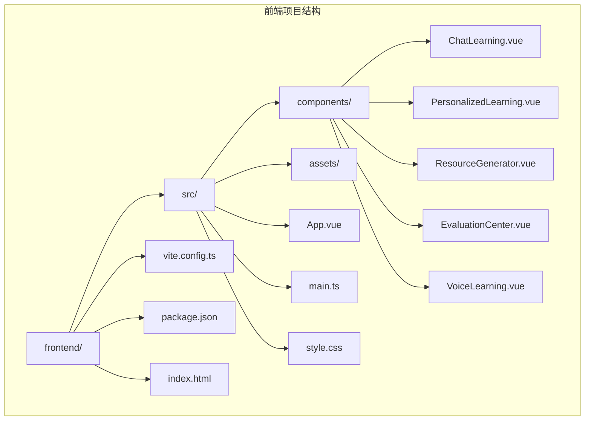
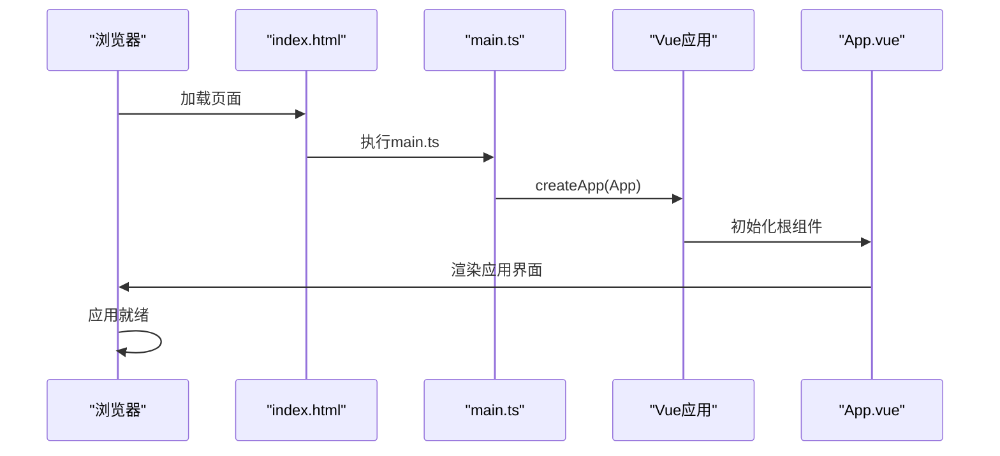
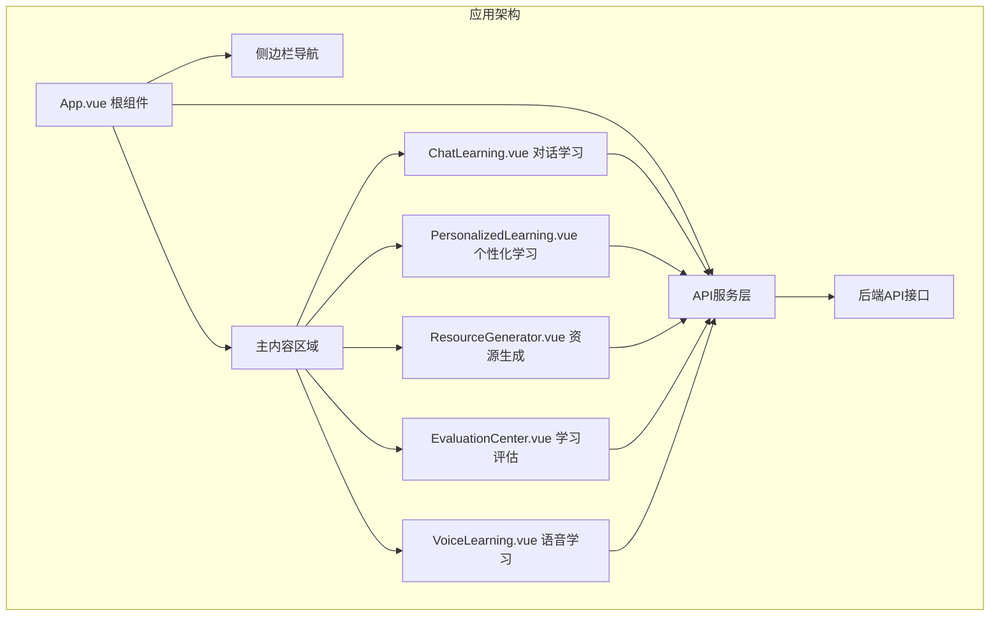
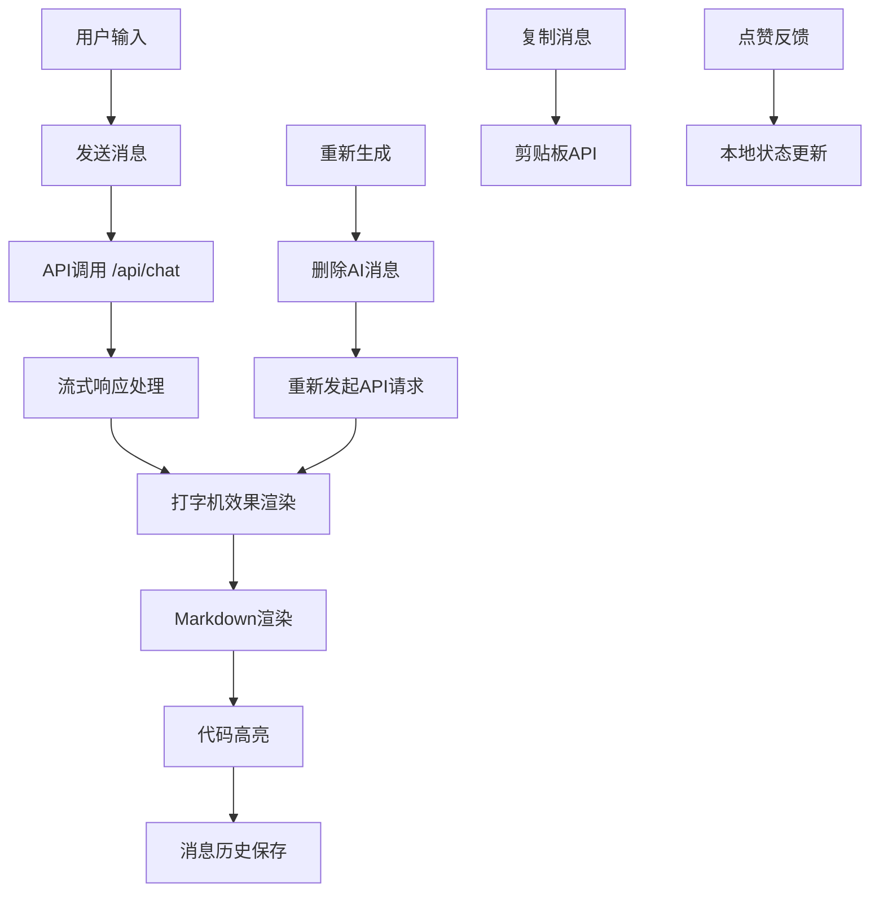
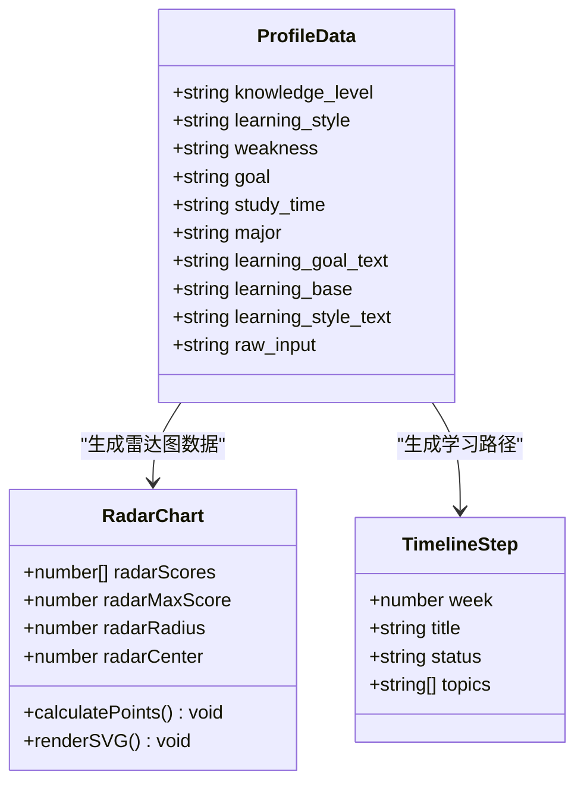
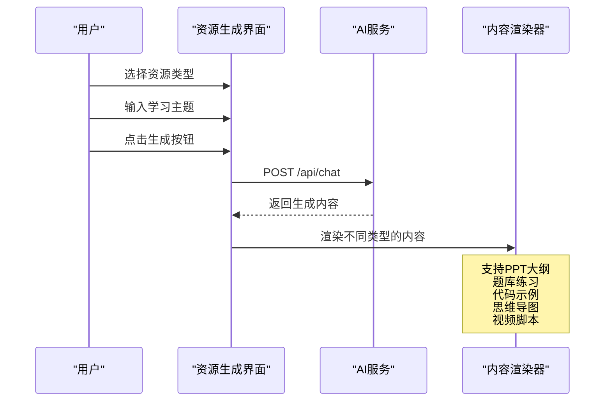
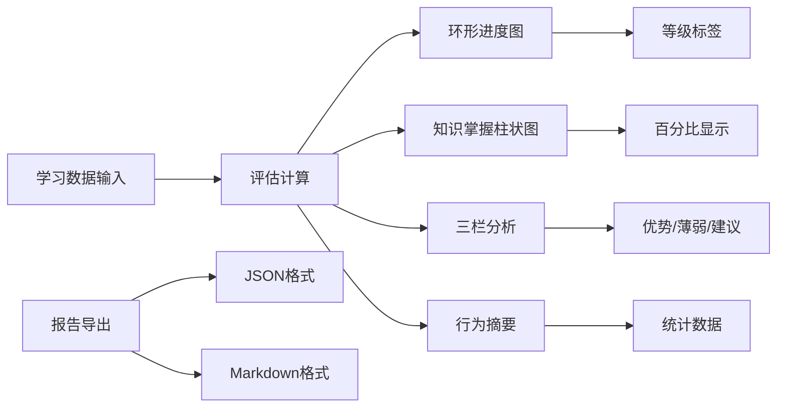
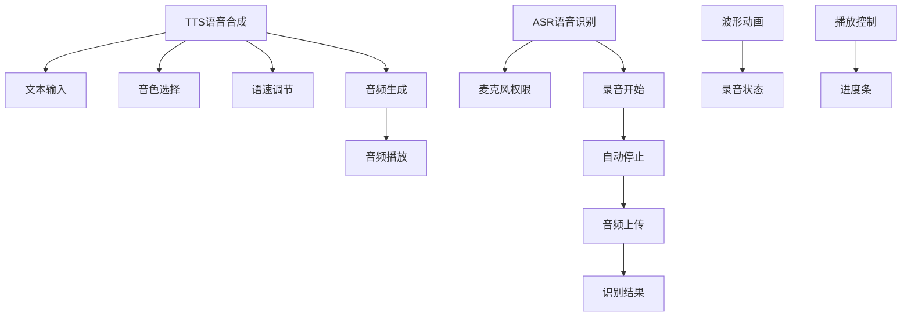
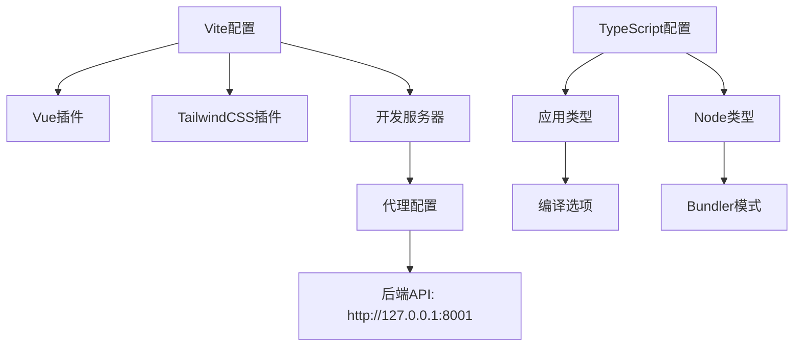

# Vue3应用结构

<cite>
**本文档引用的文件**
- [frontend/src/main.ts](file://frontend/src/main.ts)
- [frontend/src/App.vue](file://frontend/src/App.vue)
- [frontend/index.html](file://frontend/index.html)
- [frontend/vite.config.ts](file://frontend/vite.config.ts)
- [frontend/package.json](file://frontend/package.json)
- [frontend/tsconfig.json](file://frontend/tsconfig.json)
- [frontend/tsconfig.app.json](file://frontend/tsconfig.app.json)
- [frontend/tsconfig.node.json](file://frontend/tsconfig.node.json)
- [frontend/src/style.css](file://frontend/src/style.css)
- [frontend/src/components/ChatLearning.vue](file://frontend/src/components/ChatLearning.vue)
- [frontend/src/components/PersonalizedLearning.vue](file://frontend/src/components/PersonalizedLearning.vue)
- [frontend/src/components/ResourceGenerator.vue](file://frontend/src/components/ResourceGenerator.vue)
- [frontend/src/components/EvaluationCenter.vue](file://frontend/src/components/EvaluationCenter.vue)
- [frontend/src/components/VoiceLearning.vue](file://frontend/src/components/VoiceLearning.vue)
</cite>

## 目录
1. [引言](#引言)
2. [项目结构](#项目结构)
3. [核心组件](#核心组件)
4. [架构概览](#架构概览)
5. [详细组件分析](#详细组件分析)
6. [依赖分析](#依赖分析)
7. [性能考虑](#性能考虑)
8. [故障排除指南](#故障排除指南)
9. [结论](#结论)

## 引言

EduAgent是一个基于Vue3的教育平台前端应用，采用现代化的单页应用程序架构。该应用集成了AI驱动的个性化学习功能，包括对话学习、资源生成、学习评估和语音学习等核心模块。应用采用TypeScript进行类型安全开发，使用Vite作为构建工具，配合TailwindCSS实现响应式设计。

## 项目结构

前端项目遵循标准的Vue3单页应用结构，主要分为以下几个关键目录：

**图表来源**
- [frontend/src/main.ts:1-6](file://frontend/src/main.ts#L1-L6)
- [frontend/src/App.vue:1-320](file://frontend/src/App.vue#L1-L320)
- [frontend/index.html:1-17](file://frontend/index.html#L1-L17)

### 目录组织原则

应用采用功能模块化的目录组织方式：

- **src/components/**: 包含所有业务组件，每个组件负责特定的功能领域
- **src/assets/**: 存放静态资源文件
- **src/**: 应用入口和全局样式文件
- **public/**: 静态公共资源目录

### 模块导入规范

应用严格遵循ES模块导入规范，使用相对路径导入组件和工具函数，确保模块间的清晰依赖关系。

**章节来源**
- [frontend/src/main.ts:1-6](file://frontend/src/main.ts#L1-L6)
- [frontend/src/App.vue:1-320](file://frontend/src/App.vue#L1-L320)
- [frontend/index.html:1-17](file://frontend/index.html#L1-L17)

## 核心组件

### 应用入口配置

应用的启动过程从入口文件开始，通过Vue的createApp函数创建应用实例，并挂载到DOM元素中。

**图表来源**
- [frontend/src/main.ts:1-6](file://frontend/src/main.ts#L1-L6)
- [frontend/index.html:1-17](file://frontend/index.html#L1-L17)

### 根组件结构

App.vue作为应用的根组件，实现了完整的布局结构和状态管理：

- **全局布局**: 采用侧边栏+主内容区域的设计
- **导航系统**: 支持6个核心功能模块的切换
- **状态管理**: 统一管理应用级别的状态和API调用
- **主题系统**: 基于TailwindCSS的主题定制

**章节来源**
- [frontend/src/App.vue:1-320](file://frontend/src/App.vue#L1-L320)

## 架构概览

应用采用模块化的组件架构，每个功能模块都是独立的Vue组件，通过根组件进行统一管理和路由切换。

**图表来源**
- [frontend/src/App.vue:70-86](file://frontend/src/App.vue#L70-L86)
- [frontend/src/components/ChatLearning.vue:133-182](file://frontend/src/components/ChatLearning.vue#L133-L182)

### 数据流管理

应用采用自上而下的数据流管理模式：

1. **状态定义**: 在App.vue中定义全局状态
2. **事件处理**: 通过方法处理用户交互
3. **API调用**: 统一的fetch API进行后端通信
4. **状态更新**: 异步操作完成后更新组件状态

## 详细组件分析

### 对话学习模块

ChatLearning.vue实现了完整的AI对话交互功能：

**图表来源**
- [frontend/src/components/ChatLearning.vue:133-182](file://frontend/src/components/ChatLearning.vue#L133-L182)
- [frontend/src/components/ChatLearning.vue:184-233](file://frontend/src/components/ChatLearning.vue#L184-L233)

#### 核心特性

- **流式打字机效果**: 模拟AI实时响应的用户体验
- **Markdown渲染**: 支持代码块、表格、公式等丰富内容
- **代码高亮**: 使用highlight.js提供语法高亮
- **消息管理**: 支持点赞、复制、重新生成等操作

**章节来源**
- [frontend/src/components/ChatLearning.vue:1-618](file://frontend/src/components/ChatLearning.vue#L1-L618)

### 个性化学习中心

PersonalizedLearning.vue专注于学生画像分析和学习路径规划：

**图表来源**
- [frontend/src/components/PersonalizedLearning.vue:23-34](file://frontend/src/components/PersonalizedLearning.vue#L23-L34)
- [frontend/src/components/PersonalizedLearning.vue:66-97](file://frontend/src/components/PersonalizedLearning.vue#L66-L97)

#### 功能特点

- **雷达图可视化**: 将6个学习维度映射到SVG雷达图
- **标签云生成**: 基于画像数据生成彩色标签
- **时间轴渲染**: 将学习计划转换为可视化的时间轴
- **智能解析**: 自动解析后端返回的结构化数据

**章节来源**
- [frontend/src/components/PersonalizedLearning.vue:1-583](file://frontend/src/components/PersonalizedLearning.vue#L1-L583)

### 资源生成中心

ResourceGenerator.vue提供了多种AI教育资源的生成能力：

**图表来源**
- [frontend/src/components/ResourceGenerator.vue:119-156](file://frontend/src/components/ResourceGenerator.vue#L119-L156)

#### 技术实现

- **进度模拟**: 使用定时器模拟生成进度
- **内容渲染**: 针对不同资源类型采用专门的渲染策略
- **思维导图**: 集成Mermaid库实现实时渲染
- **代码高亮**: 支持多种编程语言的语法高亮

**章节来源**
- [frontend/src/components/ResourceGenerator.vue:1-496](file://frontend/src/components/ResourceGenerator.vue#L1-L496)

### 学习评估中心

EvaluationCenter.vue专注于学习效果的量化评估：

**图表来源**
- [frontend/src/components/EvaluationCenter.vue:113-142](file://frontend/src/components/EvaluationCenter.vue#L113-L142)

#### 评估指标

- **环形进度条**: 展示总体学习评分和等级
- **知识掌握度**: 通过柱状图显示各知识点掌握情况
- **三栏分析**: 优势、薄弱环节、学习建议的结构化展示
- **行为统计**: 学习时长、答题数量、资源使用等指标

**章节来源**
- [frontend/src/components/EvaluationCenter.vue:1-578](file://frontend/src/components/EvaluationCenter.vue#L1-L578)

### 语音学习中心

VoiceLearning.vue提供了完整的语音交互功能：

**图表来源**
- [frontend/src/components/VoiceLearning.vue:63-90](file://frontend/src/components/VoiceLearning.vue#L63-L90)
- [frontend/src/components/VoiceLearning.vue:146-194](file://frontend/src/components/VoiceLearning.vue#L146-L194)

#### 语音功能

- **TTS合成**: 支持多种音色和语速配置
- **ASR识别**: 集成浏览器媒体设备API
- **波形可视化**: CSS动画模拟录音波形
- **播放器控制**: 完整的音频播放控制功能

**章节来源**
- [frontend/src/components/VoiceLearning.vue:1-449](file://frontend/src/components/VoiceLearning.vue#L1-L449)

## 依赖分析

### 构建工具配置

应用使用Vite作为构建工具，配置了Vue和TailwindCSS插件：

**图表来源**
- [frontend/vite.config.ts:1-17](file://frontend/vite.config.ts#L1-L17)
- [frontend/tsconfig.app.json:1-15](file://frontend/tsconfig.app.json#L1-L15)
- [frontend/tsconfig.node.json:1-25](file://frontend/tsconfig.node.json#L1-L25)

### 依赖关系

应用的主要依赖包括：

- **Vue3**: 核心框架，提供响应式数据绑定和组件系统
- **TypeScript**: 类型安全开发，提高代码质量和开发效率
- **TailwindCSS**: 原子化CSS框架，实现快速样式开发
- **marked**: Markdown解析器，支持丰富的文本格式
- **highlight.js**: 代码语法高亮库
- **mermaid**: 流程图和思维导图渲染

**章节来源**
- [frontend/package.json:1-28](file://frontend/package.json#L1-L28)
- [frontend/vite.config.ts:1-17](file://frontend/vite.config.ts#L1-L17)

## 性能考虑

### 构建优化

应用采用了多项性能优化策略：

- **按需加载**: 组件按需导入，减少初始包体积
- **代码分割**: Vite自动进行代码分割优化
- **Tree Shaking**: TypeScript配置启用无用代码消除
- **静态资源优化**: 自动压缩和缓存策略

### 运行时优化

- **虚拟滚动**: 大列表数据的虚拟滚动实现
- **防抖节流**: 输入框和搜索功能的性能优化
- **懒加载**: 图片和组件的懒加载策略
- **内存管理**: 及时清理定时器和事件监听器

## 故障排除指南

### 常见问题

1. **API连接失败**: 检查代理配置是否正确指向后端服务
2. **TypeScript编译错误**: 确认类型定义和编译配置正确
3. **样式加载问题**: 验证TailwindCSS配置和CSS导入路径
4. **组件渲染异常**: 检查props传递和事件处理逻辑

### 调试技巧

- 使用Vue DevTools进行组件状态调试
- 利用浏览器开发者工具监控网络请求
- 通过console.log输出关键变量值
- 检查TypeScript编译错误和警告信息

**章节来源**
- [frontend/src/App.vue:29-68](file://frontend/src/App.vue#L29-L68)

## 结论

EduAgent的Vue3应用展现了现代前端开发的最佳实践。通过模块化的组件架构、完善的TypeScript类型系统、以及高效的构建工具配置，应用实现了良好的可维护性和扩展性。

应用的核心优势包括：

- **清晰的架构设计**: 模块化组件结构便于维护和扩展
- **强大的功能集成**: 多个AI驱动的功能模块协同工作
- **优秀的用户体验**: 流畅的交互和丰富的视觉效果
- **完善的开发工具链**: 从开发到生产的完整工具支持

未来可以考虑的改进方向包括：进一步优化性能、增加更多的测试覆盖、以及探索更多AI功能的集成。