# 前端架构设计

<cite>
**本文档引用的文件**
- [frontend/src/main.ts](file://frontend/src/main.ts)
- [frontend/src/App.vue](file://frontend/src/App.vue)
- [frontend/src/components/ChatLearning.vue](file://frontend/src/components/ChatLearning.vue)
- [frontend/src/components/PersonalizedLearning.vue](file://frontend/src/components/PersonalizedLearning.vue)
- [frontend/src/components/ResourceGenerator.vue](file://frontend/src/components/ResourceGenerator.vue)
- [frontend/src/components/EvaluationCenter.vue](file://frontend/src/components/EvaluationCenter.vue)
- [frontend/src/components/VoiceLearning.vue](file://frontend/src/components/VoiceLearning.vue)
- [frontend/src/style.css](file://frontend/src/style.css)
- [frontend/vite.config.ts](file://frontend/vite.config.ts)
- [frontend/package.json](file://frontend/package.json)
- [frontend/tsconfig.app.json](file://frontend/tsconfig.app.json)
- [frontend/README.md](file://frontend/README.md)
</cite>

## 目录
1. [简介](#简介)
2. [项目结构](#项目结构)
3. [核心组件](#核心组件)
4. [架构概览](#架构概览)
5. [详细组件分析](#详细组件分析)
6. [依赖关系分析](#依赖关系分析)
7. [性能考虑](#性能考虑)
8. [故障排除指南](#故障排除指南)
9. [结论](#结论)
10. [附录](#附录)

## 简介

EduAgent是一个基于Vue3 + TypeScript + Vite构建的现代化单页应用(SPA)，专为高校个性化学习设计。该应用采用AI SaaS风格的浅色主题界面，集成了对话学习、个性化学习中心、资源生成中心、学习评估中心和语音学习中心五大核心功能模块。

应用的核心架构特点包括：
- **响应式设计**：完全适配桌面、平板和移动端设备
- **实时交互**：流式打字机效果、骨架屏加载、平滑动画过渡
- **AI集成**：深度整合讯飞星火等AI服务，提供智能化学习体验
- **组件化架构**：高度模块化的Vue组件设计，便于维护和扩展

## 项目结构

前端项目采用标准的Vite + Vue3 + TypeScript项目结构：

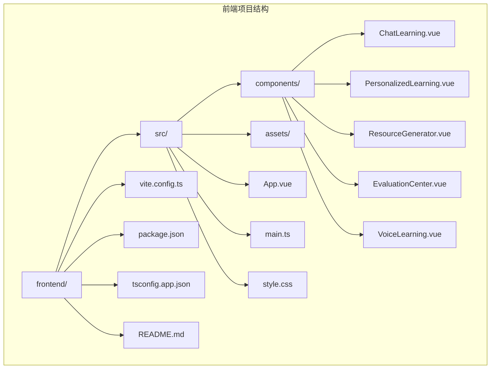

**图表来源**
- [frontend/src/main.ts:1-6](file://frontend/src/main.ts#L1-L6)
- [frontend/src/App.vue:1-320](file://frontend/src/App.vue#L1-L320)

### 核心技术栈

- **框架层**：Vue 3.5.32 + TypeScript 6.0.2
- **构建工具**：Vite 8.0.10
- **样式框架**：TailwindCSS 4.3.0
- **UI组件**：原生Vue组件 + 自定义SVG图标
- **第三方库**：marked 18.0.4、highlight.js 11.11.1、mermaid 11.15.0

**章节来源**
- [frontend/package.json:1-28](file://frontend/package.json#L1-L28)
- [frontend/tsconfig.app.json:1-15](file://frontend/tsconfig.app.json#L1-L15)
- [frontend/vite.config.ts:1-17](file://frontend/vite.config.ts#L1-L17)

## 核心组件

### 组件层次设计

应用采用三层组件架构：

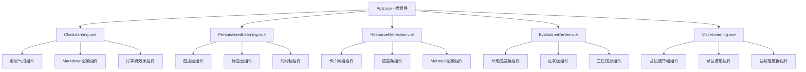

**图表来源**
- [frontend/src/App.vue:12-86](file://frontend/src/App.vue#L12-L86)
- [frontend/src/components/ChatLearning.vue:1-618](file://frontend/src/components/ChatLearning.vue#L1-L618)
- [frontend/src/components/PersonalizedLearning.vue:1-583](file://frontend/src/components/PersonalizedLearning.vue#L1-L583)
- [frontend/src/components/ResourceGenerator.vue:1-496](file://frontend/src/components/ResourceGenerator.vue#L1-L496)
- [frontend/src/components/EvaluationCenter.vue:1-578](file://frontend/src/components/EvaluationCenter.vue#L1-L578)
- [frontend/src/components/VoiceLearning.vue:1-449](file://frontend/src/components/VoiceLearning.vue#L1-L449)

### 状态管理模式

应用采用Vue3的Composition API模式，通过ref和reactive实现响应式状态管理：

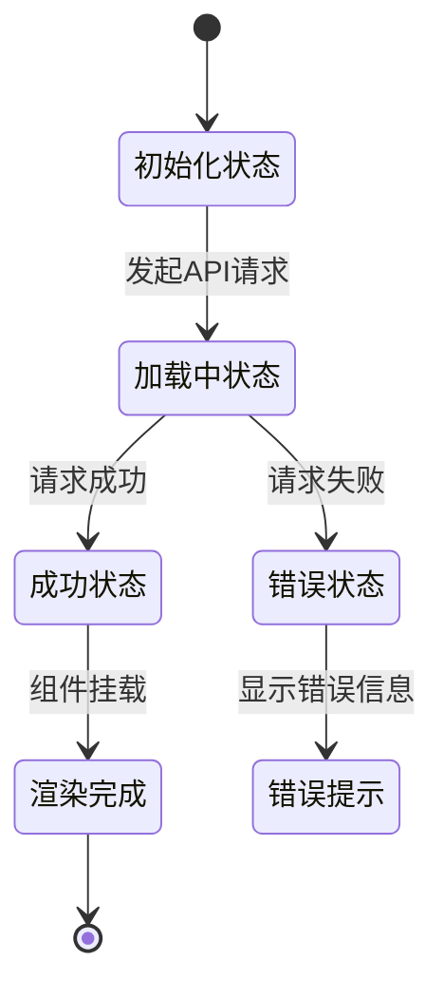

**图表来源**
- [frontend/src/components/ChatLearning.vue:133-182](file://frontend/src/components/ChatLearning.vue#L133-L182)
- [frontend/src/components/PersonalizedLearning.vue:223-248](file://frontend/src/components/PersonalizedLearning.vue#L223-L248)

**章节来源**
- [frontend/src/App.vue:19-86](file://frontend/src/App.vue#L19-L86)
- [frontend/src/components/ChatLearning.vue:16-35](file://frontend/src/components/ChatLearning.vue#L16-L35)

## 架构概览

### 整体架构设计

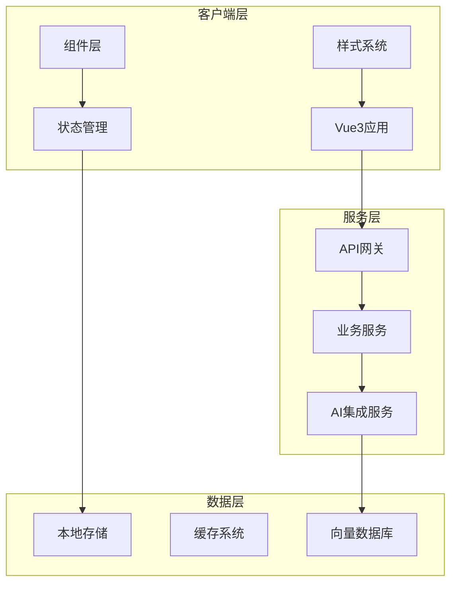

**图表来源**
- [frontend/src/main.ts:1-6](file://frontend/src/main.ts#L1-L6)
- [frontend/src/App.vue:29-68](file://frontend/src/App.vue#L29-L68)

### 组件通信机制

应用采用多种组件通信方式：

1. **Props传递**：父子组件间的数据传递
2. **事件发射**：子组件向父组件传递事件
3. **全局状态**：通过Vue的响应式系统共享状态
4. **API调用**：组件间通过HTTP请求进行数据交换

**章节来源**
- [frontend/src/App.vue:77-84](file://frontend/src/App.vue#L77-L84)
- [frontend/src/components/ChatLearning.vue:133-182](file://frontend/src/components/ChatLearning.vue#L133-L182)

## 详细组件分析

### 对话学习组件 (ChatLearning)

#### 核心功能特性

对话学习组件实现了完整的AI对话交互体验：

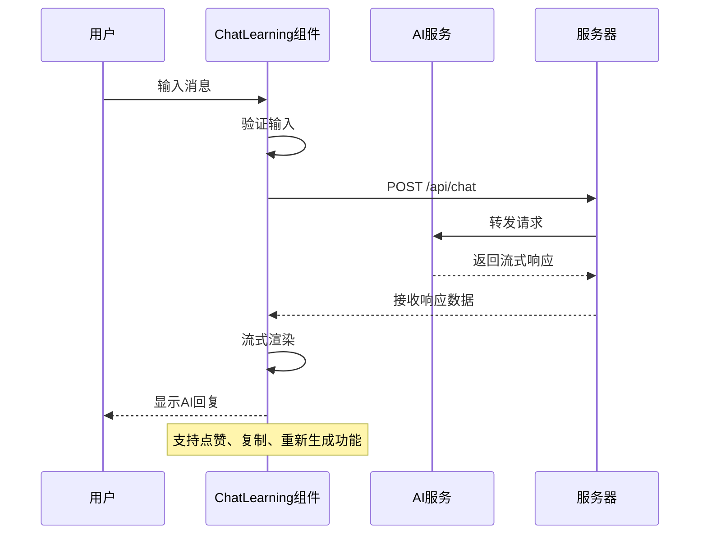

**图表来源**
- [frontend/src/components/ChatLearning.vue:133-182](file://frontend/src/components/ChatLearning.vue#L133-L182)
- [frontend/src/components/ChatLearning.vue:184-233](file://frontend/src/components/ChatLearning.vue#L184-L233)

#### 技术实现亮点

1. **流式打字机效果**：通过定时器实现逐字渲染，模拟真实的大模型输出体验
2. **Markdown渲染**：集成marked.js和highlight.js，支持代码高亮、表格、公式等
3. **消息气泡设计**：用户/AI双色区分，AI侧支持点赞、复制、重新生成操作
4. **增强输入框**：支持Enter发送、Shift+Enter换行，预留附件上传和语音输入功能

**章节来源**
- [frontend/src/components/ChatLearning.vue:1-618](file://frontend/src/components/ChatLearning.vue#L1-L618)

### 个性化学习中心 (PersonalizedLearning)

#### 学生画像分析

个性化学习中心提供了完整的AI画像分析和学习路径规划功能：

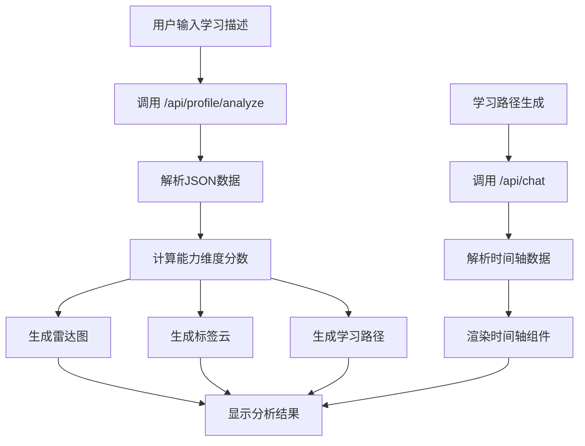

**图表来源**
- [frontend/src/components/PersonalizedLearning.vue:223-273](file://frontend/src/components/PersonalizedLearning.vue#L223-L273)
- [frontend/src/components/PersonalizedLearning.vue:167-211](file://frontend/src/components/PersonalizedLearning.vue#L167-L211)

#### 数据可视化组件

1. **雷达图组件**：使用SVG绘制六边形雷达图，直观展示学生六个能力维度
2. **标签云组件**：从画像数据中提取关键词，生成彩色标签云
3. **时间轴组件**：解析AI生成的学习路径，渲染为三色状态的时间轴

**章节来源**
- [frontend/src/components/PersonalizedLearning.vue:1-583](file://frontend/src/components/PersonalizedLearning.vue#L1-L583)

### 资源生成中心 (ResourceGenerator)

#### 多格式资源生成

资源生成中心支持五种类型的AI资源生成：

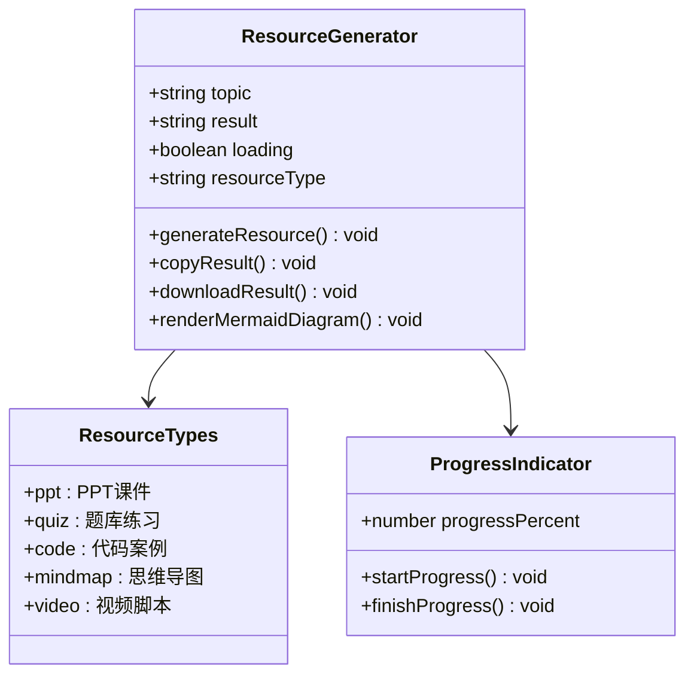

**图表来源**
- [frontend/src/components/ResourceGenerator.vue:21-42](file://frontend/src/components/ResourceGenerator.vue#L21-L42)
- [frontend/src/components/ResourceGenerator.vue:98-117](file://frontend/src/components/ResourceGenerator.vue#L98-L117)

#### 核心功能实现

1. **卡片化网格布局**：五种资源类型卡片，含图标、预览缩略图、状态标签
2. **实时进度条**：模拟生成步骤，避免白屏等待
3. **代码案例渲染**：使用marked + highlight.js实现语法高亮
4. **思维导图渲染**：集成mermaid库，支持实时渲染和交互

**章节来源**
- [frontend/src/components/ResourceGenerator.vue:1-496](file://frontend/src/components/ResourceGenerator.vue#L1-L496)

### 学习评估中心 (EvaluationCenter)

#### 多维度评估报告

学习评估中心提供了完整的评估分析功能：

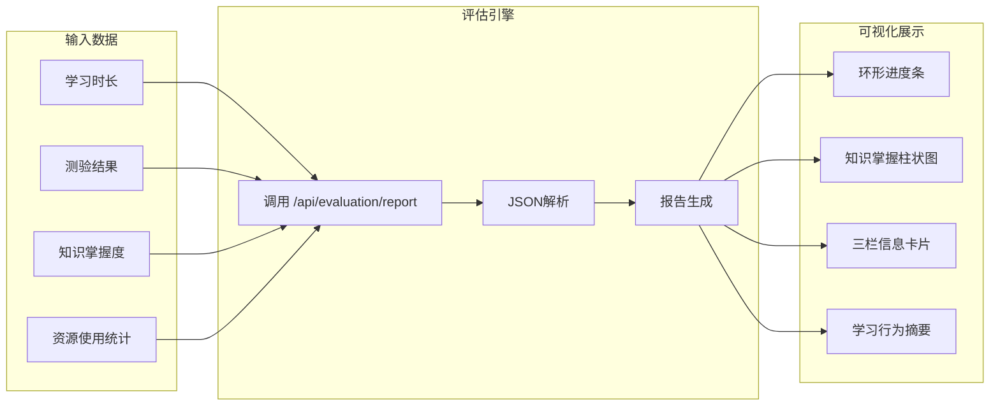

**图表来源**
- [frontend/src/components/EvaluationCenter.vue:113-142](file://frontend/src/components/EvaluationCenter.vue#L113-L142)
- [frontend/src/components/EvaluationCenter.vue:390-422](file://frontend/src/components/EvaluationCenter.vue#L390-L422)

#### 报告可视化组件

1. **环形进度条**：总评分数 + 等级标签，支持动画填充
2. **知识掌握柱状图**：纯CSS实现，带渐变柱和百分比标签
3. **三栏信息卡片**：优势、薄弱、建议三分区展示
4. **学习行为摘要**：时长、做题数、资源使用统计

**章节来源**
- [frontend/src/components/EvaluationCenter.vue:1-578](file://frontend/src/components/EvaluationCenter.vue#L1-L578)

### 语音学习中心 (VoiceLearning)

#### 语音AI服务集成

语音学习中心集成了TTS和ASR两大语音AI服务：

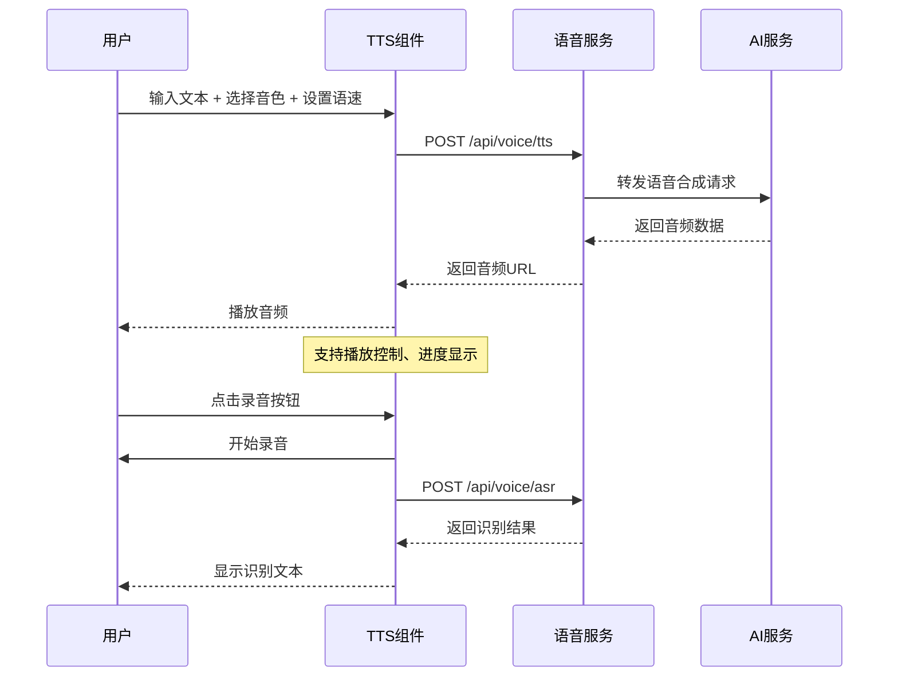

**图表来源**
- [frontend/src/components/VoiceLearning.vue:63-90](file://frontend/src/components/VoiceLearning.vue#L63-L90)
- [frontend/src/components/VoiceLearning.vue:146-194](file://frontend/src/components/VoiceLearning.vue#L146-L194)

#### 语音功能特性

1. **音色选择器**：卡片式音色选择，包含头像、名称、性别标签
2. **语速调节**：可视化滑块，带快捷预设（慢/中/快）
3. **录音波形**：CSS动画模拟音频柱状波动画
4. **现代播放器**：圆角控制条，支持播放/暂停、进度条、时间显示

**章节来源**
- [frontend/src/components/VoiceLearning.vue:1-449](file://frontend/src/components/VoiceLearning.vue#L1-L449)

## 依赖关系分析

### 外部依赖管理

应用的依赖关系如下：

```mermaid
graph TB
subgraph "运行时依赖"
A[vue@^3.5.32]
B[marked@^18.0.4]
C[highlight.js@^11.11.1]
D[mermaid@^11.15.0]
end
subgraph "开发时依赖"
E[@vitejs/plugin-vue@^6.0.6]
F[tailwindcss@^4.3.0]
G[@types/node@^24.12.2]
H[typescript@~6.0.2]
I[vite@^8.0.10]
J[vue-tsc@^3.2.7]
end
subgraph "构建工具"
K[Vite]
L[TailwindCSS]
M[TypeScript]
end
A --> K
B --> K
C --> K
D --> K
E --> K
F --> L
G --> M
H --> M
I --> K
J --> M
```

**图表来源**
- [frontend/package.json:11-26](file://frontend/package.json#L11-L26)

### 样式系统架构

应用采用TailwindCSS + 自定义样式的混合方案：

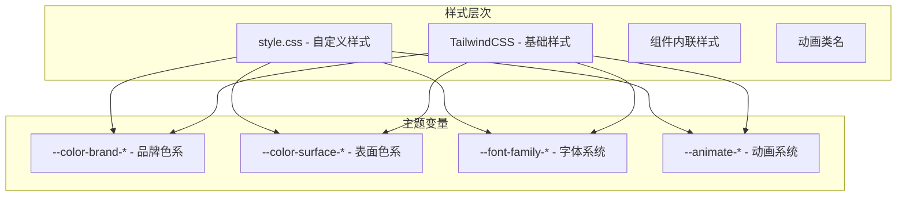

**图表来源**
- [frontend/src/style.css:3-35](file://frontend/src/style.css#L3-L35)

**章节来源**
- [frontend/package.json:1-28](file://frontend/package.json#L1-L28)
- [frontend/src/style.css:1-144](file://frontend/src/style.css#L1-L144)

## 性能考虑

### 响应式设计实现

应用采用了多层次的响应式设计策略：

1. **移动端优先**：使用TailwindCSS的移动端断点系统
2. **自适应布局**：Grid和Flexbox结合实现灵活布局
3. **触摸友好**：按钮和交互元素尺寸适配移动设备
4. **性能优化**：懒加载、虚拟滚动、图片优化

### 性能优化建议

1. **组件懒加载**：对大型组件实现按需加载
2. **图片优化**：使用WebP格式，实现响应式图片
3. **代码分割**：利用Vite的动态导入实现代码分割
4. **缓存策略**：合理使用浏览器缓存和CDN
5. **动画优化**：使用transform和opacity属性优化动画性能

### 跨浏览器兼容性

应用通过以下方式确保跨浏览器兼容性：

1. **PostCSS转换**：自动添加浏览器前缀
2. **Polyfill支持**：为旧版浏览器提供必要的JavaScript polyfill
3. **渐进增强**：核心功能在所有浏览器中可用
4. **特性检测**：使用Modernizr等工具进行特性检测

## 故障排除指南

### 常见问题诊断

#### API连接问题

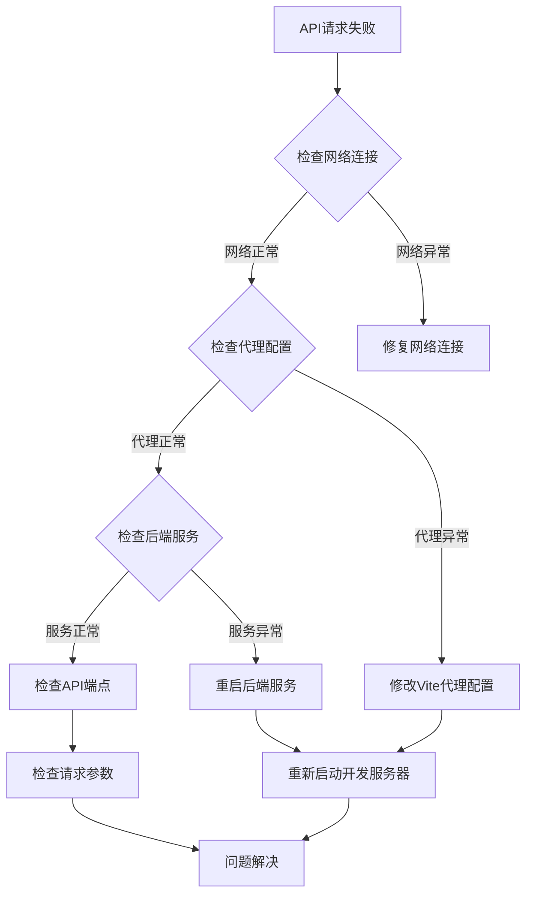

**图表来源**
- [frontend/vite.config.ts:8-15](file://frontend/vite.config.ts#L8-L15)

#### 组件渲染问题

1. **空白页面**：检查根组件是否正确挂载
2. **样式丢失**：确认TailwindCSS配置正确
3. **动画不工作**：检查CSS变量和动画类名
4. **响应式失效**：验证断点设置和媒体查询

**章节来源**
- [frontend/src/main.ts:1-6](file://frontend/src/main.ts#L1-L6)
- [frontend/vite.config.ts:1-17](file://frontend/vite.config.ts#L1-L17)

### 调试技巧

1. **Vue DevTools**：使用Vue官方调试工具
2. **浏览器开发者工具**：检查网络请求和控制台错误
3. **性能分析**：使用Chrome Lighthouse进行性能分析
4. **移动端调试**：使用浏览器的设备模拟功能

## 结论

EduAgent前端架构展现了现代Web应用的最佳实践：

### 架构优势

1. **模块化设计**：清晰的组件层次和职责分离
2. **响应式体验**：流畅的动画和良好的用户体验
3. **AI集成**：深度整合AI服务，提供智能化功能
4. **可扩展性**：良好的架构设计便于功能扩展

### 技术亮点

1. **Vue3 Composition API**：现代化的组件开发模式
2. **TypeScript集成**：提供更好的类型安全和开发体验
3. **Vite构建工具**：快速的开发服务器和热重载
4. **TailwindCSS样式系统**：高效的原子化CSS开发

### 改进建议

1. **状态管理**：考虑引入Pinia或Vuex进行复杂状态管理
2. **测试覆盖**：增加单元测试和集成测试
3. **文档完善**：补充组件API文档和使用示例
4. **性能监控**：集成性能监控和错误追踪

## 附录

### 开发环境设置

```bash
# 安装依赖
npm install

# 开发模式
npm run dev

# 生产构建
npm run build

# 预览构建
npm run preview
```

### 项目配置说明

1. **Vite配置**：支持Vue单文件组件和TypeScript
2. **TypeScript配置**：严格的类型检查和编译选项
3. **TailwindCSS配置**：自定义主题和实用类
4. **代理配置**：开发环境API代理设置

**章节来源**
- [frontend/README.md:1-6](file://frontend/README.md#L1-L6)
- [frontend/vite.config.ts:1-17](file://frontend/vite.config.ts#L1-L17)
- [frontend/tsconfig.app.json:1-15](file://frontend/tsconfig.app.json#L1-L15)