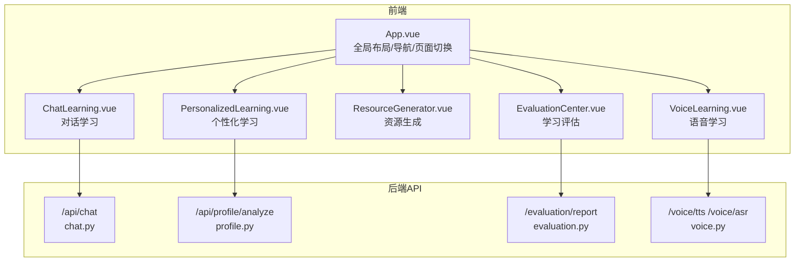
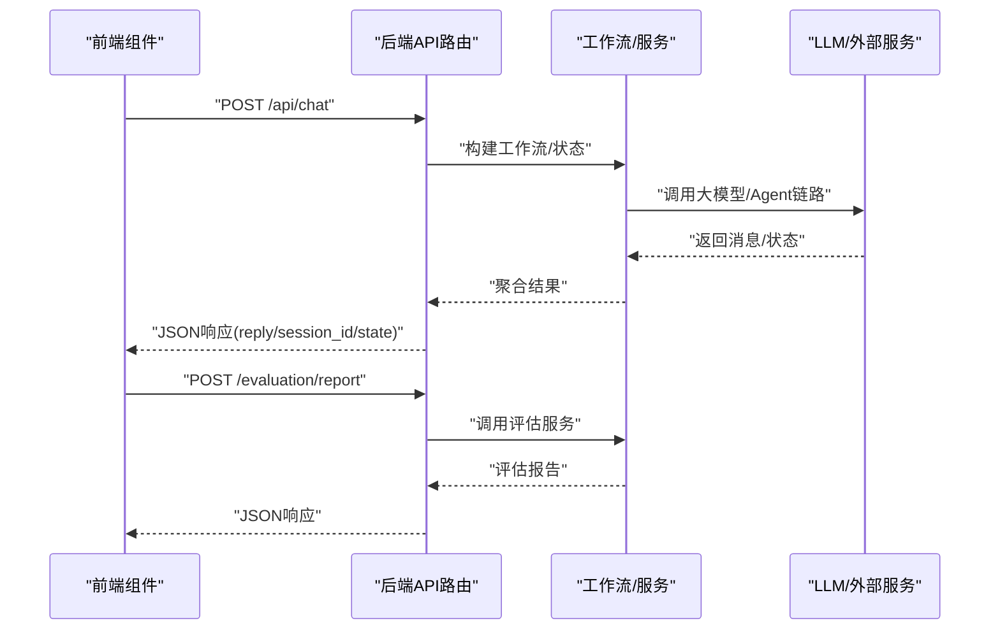
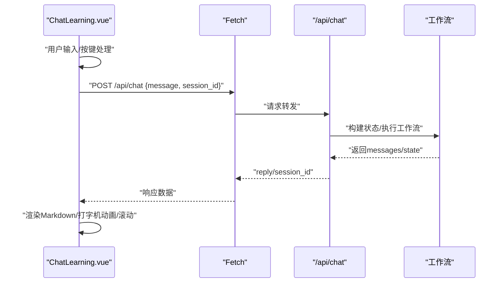
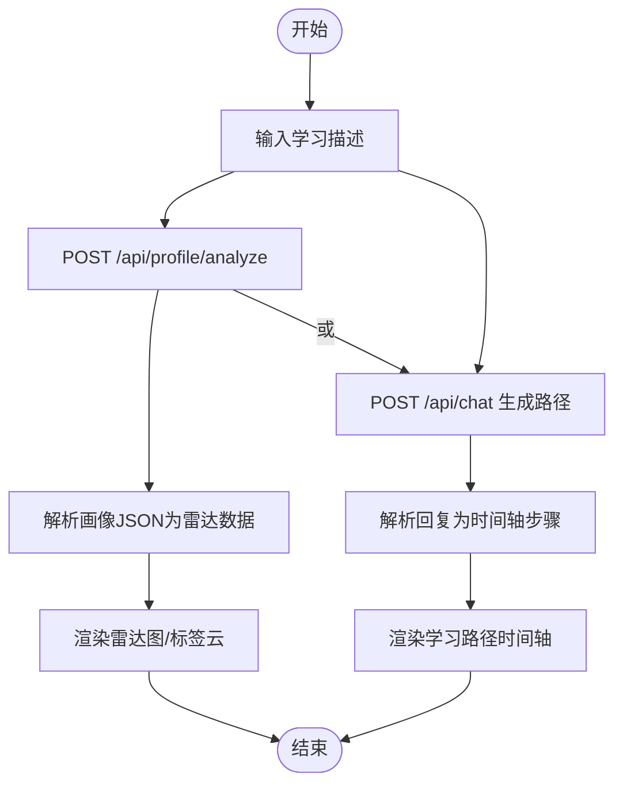
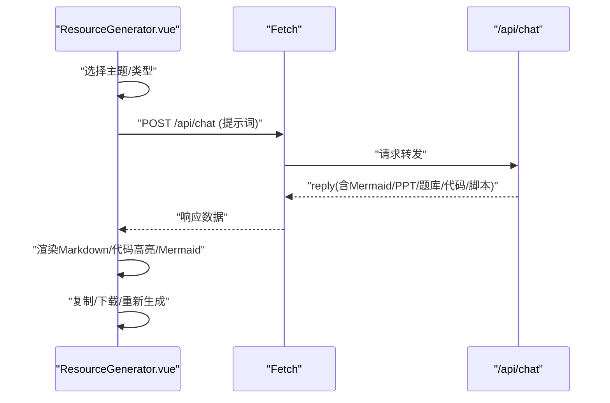
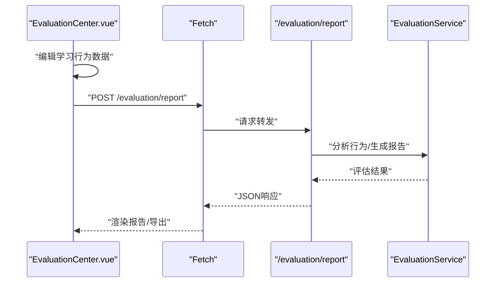
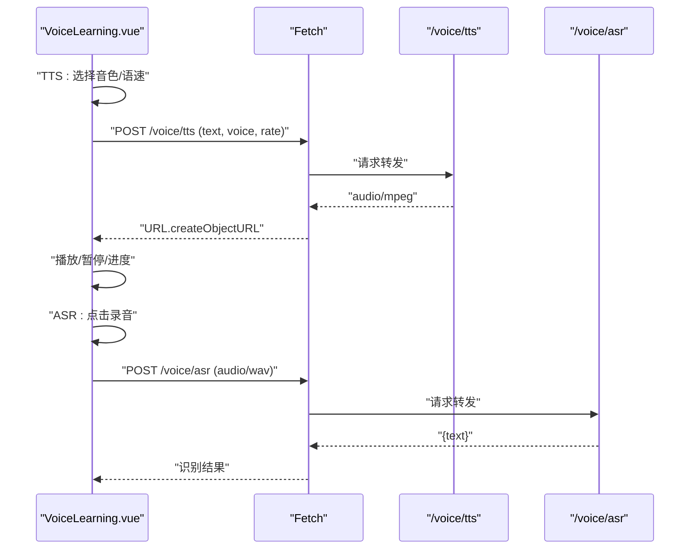
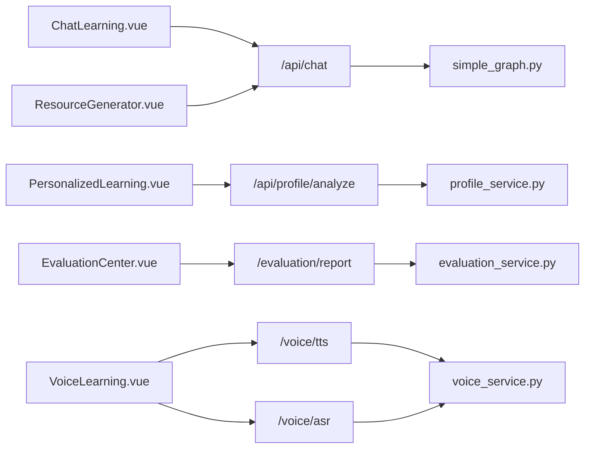

# 核心组件设计

<cite>
**本文引用的文件**   
- [ChatLearning.vue](file://frontend/src/components/ChatLearning.vue)
- [PersonalizedLearning.vue](file://frontend/src/components/PersonalizedLearning.vue)
- [ResourceGenerator.vue](file://frontend/src/components/ResourceGenerator.vue)
- [EvaluationCenter.vue](file://frontend/src/components/EvaluationCenter.vue)
- [VoiceLearning.vue](file://frontend/src/components/VoiceLearning.vue)
- [App.vue](file://frontend/src/App.vue)
- [style.css](file://frontend/src/style.css)
- [chat.py](file://api/routes/chat.py)
- [evaluation.py](file://api/routes/evaluation.py)
- [voice.py](file://api/routes/voice.py)
- [profile.py](file://api/routes/profile.py)
- [evaluation_service.py](file://services/evaluation_service.py)
- [profile_service.py](file://services/profile_service.py)
- [voice_service.py](file://services/voice_service.py)
- [simple_graph.py](file://workflows/simple_graph.py)
</cite>

## 目录
1. [引言](#引言)
2. [项目结构](#项目结构)
3. [核心组件](#核心组件)
4. [架构总览](#架构总览)
5. [详细组件分析](#详细组件分析)
6. [依赖关系分析](#依赖关系分析)
7. [性能考量](#性能考量)
8. [故障排查指南](#故障排查指南)
9. [结论](#结论)
10. [附录](#附录)

## 引言
本设计文档聚焦EduAgent五大核心组件：对话学习、个性化学习、资源生成、学习评估、语音学习。文档从功能定位、UI设计、交互逻辑入手，深入解释各组件的实时聊天界面、学习路径展示、AI内容创作界面、数据可视化、音频交互界面；并阐述组件间通信机制、数据传递方式与事件处理策略，最后给出组件复用性设计、可扩展性考虑与用户体验优化方案。

## 项目结构
前端采用Vue 3 + TypeScript + TailwindCSS，后端基于FastAPI，组件通过REST API进行通信。全局布局负责导航与页面切换，五大组件分别承载独立功能域。



**图表来源**
- [App.vue:77-84](file://frontend/src/App.vue#L77-L84)
- [chat.py:23-36](file://api/routes/chat.py#L23-L36)
- [profile.py:46-56](file://api/routes/profile.py#L46-L56)
- [evaluation.py:58-68](file://api/routes/evaluation.py#L58-L68)
- [voice.py:18-54](file://api/routes/voice.py#L18-L54)

**章节来源**
- [App.vue:89-294](file://frontend/src/App.vue#L89-L294)
- [style.css:1-144](file://frontend/src/style.css#L1-L144)

## 核心组件
- 对话学习：提供流式打字机渲染、Markdown渲染、消息气泡、点赞/复制/重新生成、骨架屏与空状态引导。
- 个性化学习：学生画像雷达图、标签云、学习路径时间轴，支持画像分析与路径生成。
- 资源生成：五类资源卡片（PPT/题库/代码/思维导图/视频脚本）、实时进度条、代码高亮、思维导图渲染。
- 学习评估：环形进度条、知识掌握柱状图、优势/薄弱/建议三栏、学习行为摘要、报告导出。
- 语音学习：音色卡片选择、语速滑块、录音波形动画、现代播放器、识别结果卡片。

**章节来源**
- [ChatLearning.vue:1-618](file://frontend/src/components/ChatLearning.vue#L1-L618)
- [PersonalizedLearning.vue:1-583](file://frontend/src/components/PersonalizedLearning.vue#L1-L583)
- [ResourceGenerator.vue:1-496](file://frontend/src/components/ResourceGenerator.vue#L1-L496)
- [EvaluationCenter.vue:1-578](file://frontend/src/components/EvaluationCenter.vue#L1-L578)
- [VoiceLearning.vue:1-449](file://frontend/src/components/VoiceLearning.vue#L1-L449)

## 架构总览
前端组件通过HTTP请求与后端API交互，后端API路由将请求转发至对应服务或工作流，最终返回结构化数据供前端渲染。



**图表来源**
- [chat.py:23-36](file://api/routes/chat.py#L23-L36)
- [evaluation.py:58-68](file://api/routes/evaluation.py#L58-L68)
- [simple_graph.py:37-50](file://workflows/simple_graph.py#L37-L50)

## 详细组件分析

### 对话学习组件（ChatLearning）
- 功能定位：以“流式打字机”体验为核心，提供自然语言问答、消息气泡、Markdown渲染、代码高亮、操作反馈与错误提示。
- UI设计：深色主题下的消息气泡、骨架屏、空状态引导、Toast提示、Markdown样式覆盖。
- 交互逻辑：Enter发送、Shift+Enter换行；支持点赞、复制、重新生成；滚动到底部；打字机动画。
- 数据传递：每次发送携带message与可选session_id；后端返回reply与session_id；前端按消息追加并渲染。
- 事件处理：键盘事件、点击事件、滚动监听、生命周期清理（停止打字机、取消定时器）。



**图表来源**
- [ChatLearning.vue:133-182](file://frontend/src/components/ChatLearning.vue#L133-L182)
- [chat.py:23-36](file://api/routes/chat.py#L23-L36)
- [simple_graph.py:53-58](file://workflows/simple_graph.py#L53-L58)

**章节来源**
- [ChatLearning.vue:1-618](file://frontend/src/components/ChatLearning.vue#L1-L618)
- [chat.py:1-37](file://api/routes/chat.py#L1-L37)

### 个性化学习组件（PersonalizedLearning）
- 功能定位：学生画像分析与学习路径规划，支持画像雷达图、标签云、学习路径时间轴。
- UI设计：Tab切换、骨架屏、SVG雷达图、标签云、时间轴步骤条、详情卡片。
- 交互逻辑：输入学习描述，生成画像；点击生成学习路径；解析后端回复为时间轴。
- 数据传递：画像分析调用/profile/analyze；路径生成调用/chat；解析JSON与文本为可视化数据。
- 事件处理：输入变更、Tab切换、解析步骤、错误提示。



**图表来源**
- [PersonalizedLearning.vue:223-273](file://frontend/src/components/PersonalizedLearning.vue#L223-L273)
- [profile.py:46-56](file://api/routes/profile.py#L46-L56)
- [chat.py:23-36](file://api/routes/chat.py#L23-L36)

**章节来源**
- [PersonalizedLearning.vue:1-583](file://frontend/src/components/PersonalizedLearning.vue#L1-L583)
- [profile.py:1-57](file://api/routes/profile.py#L1-L57)

### 资源生成组件（ResourceGenerator）
- 功能定位：根据主题与资源类型生成PPT、题库、代码、思维导图、视频脚本，提供复制与下载。
- UI设计：卡片网格选择资源类型、实时进度条、Markdown/代码高亮、Mermaid思维导图渲染。
- 交互逻辑：选择主题与类型，触发生成；实时进度模拟；点击复制/下载；代码块一键复制。
- 数据传递：统一走/chat接口，按类型构造提示词；思维导图通过提取Mermaid代码渲染。
- 事件处理：进度定时器、Mermaid初始化与渲染、错误处理、生命周期清理。



**图表来源**
- [ResourceGenerator.vue:119-156](file://frontend/src/components/ResourceGenerator.vue#L119-L156)
- [chat.py:23-36](file://api/routes/chat.py#L23-L36)

**章节来源**
- [ResourceGenerator.vue:1-496](file://frontend/src/components/ResourceGenerator.vue#L1-L496)
- [chat.py:1-37](file://api/routes/chat.py#L1-L37)

### 学习评估组件（EvaluationCenter）
- 功能定位：多维度评估学习效果，生成环形进度、知识掌握柱状图、优势/薄弱/建议三栏与学习行为摘要，并支持导出。
- UI设计：Tab切换、骨架屏、环形进度条、柱状图、三栏信息、摘要卡片、导出按钮。
- 交互逻辑：输入学习时长、测验结果、知识掌握度、资源使用；提交生成报告；导出JSON/Markdown。
- 数据传递：POST /evaluation/report，后端服务计算指标、等级、建议并返回。
- 事件处理：范围滑条、增删项、导出流程、错误提示。



**图表来源**
- [EvaluationCenter.vue:113-142](file://frontend/src/components/EvaluationCenter.vue#L113-L142)
- [evaluation.py:58-68](file://api/routes/evaluation.py#L58-L68)
- [evaluation_service.py:89-251](file://services/evaluation_service.py#L89-L251)

**章节来源**
- [EvaluationCenter.vue:1-578](file://frontend/src/components/EvaluationCenter.vue#L1-L578)
- [evaluation.py:1-119](file://api/routes/evaluation.py#L1-L119)
- [evaluation_service.py:1-251](file://services/evaluation_service.py#L1-L251)

### 语音学习组件（VoiceLearning）
- 功能定位：文本转语音与语音识别，提供音色选择、语速调节、录音波形、现代播放器与识别结果卡片。
- UI设计：Tab切换TTS/ASR、音色卡片、语速滑块、录音波形动画、播放器控件、识别结果卡片。
- 交互逻辑：TTS：填写文本、选择音色、设置语速、合成并播放；ASR：点击录音、自动停止、识别并展示结果。
- 数据传递：TTS POST /voice/tts 返回音频Blob；ASR POST /voice/asr 返回识别文本。
- 事件处理：媒体录制、播放器事件、进度定时器、权限与错误处理。



**图表来源**
- [VoiceLearning.vue:63-194](file://frontend/src/components/VoiceLearning.vue#L63-L194)
- [voice.py:18-54](file://api/routes/voice.py#L18-L54)

**章节来源**
- [VoiceLearning.vue:1-449](file://frontend/src/components/VoiceLearning.vue#L1-L449)
- [voice.py:1-64](file://api/routes/voice.py#L1-L64)

## 依赖关系分析
- 组件耦合：各组件通过独立API端点与后端交互，低耦合、高内聚。
- 数据流：前端组件负责UI与交互，后端API负责编排与服务调用，工作流/服务层负责具体业务逻辑。
- 外部依赖：Markdown渲染（marked/highlight.js）、Mermaid（思维导图）、浏览器媒体设备（录音/播放）。



**图表来源**
- [ChatLearning.vue:159-166](file://frontend/src/components/ChatLearning.vue#L159-L166)
- [PersonalizedLearning.vue:229-236](file://frontend/src/components/PersonalizedLearning.vue#L229-L236)
- [ResourceGenerator.vue:127-134](file://frontend/src/components/ResourceGenerator.vue#L127-L134)
- [EvaluationCenter.vue:119-131](file://frontend/src/components/EvaluationCenter.vue#L119-L131)
- [VoiceLearning.vue:74-77](file://frontend/src/components/VoiceLearning.vue#L74-L77)
- [chat.py:23-36](file://api/routes/chat.py#L23-L36)
- [profile.py:46-56](file://api/routes/profile.py#L46-L56)
- [evaluation.py:58-68](file://api/routes/evaluation.py#L58-L68)
- [voice.py:18-54](file://api/routes/voice.py#L18-L54)
- [simple_graph.py:37-50](file://workflows/simple_graph.py#L37-L50)
- [profile_service.py:90-166](file://services/profile_service.py#L90-L166)
- [evaluation_service.py:89-251](file://services/evaluation_service.py#L89-L251)
- [voice_service.py:12-51](file://services/voice_service.py#L12-L51)

**章节来源**
- [App.vue:13-17](file://frontend/src/App.vue#L13-L17)
- [style.css:1-144](file://frontend/src/style.css#L1-L144)

## 性能考量
- 前端渲染优化：使用骨架屏减少白屏感知；Markdown与代码高亮按需渲染；Mermaid渲染失败回退为文本。
- 交互流畅性：打字机动画与进度条采用定时器节流；播放器与录音使用事件驱动更新，避免频繁重绘。
- 后端吞吐：工作流编排按节点串行，避免并发瓶颈；画像与评估服务按需计算，缓存命中优先。
- 网络传输：按需请求，错误快速反馈；音频以二进制流返回，减少序列化开销。

## 故障排查指南
- 对话学习
  - 现象：请求失败/无回复
  - 排查：检查网络与后端健康状态；查看错误Toast；确认session_id是否传入。
  - 参考
    - [ChatLearning.vue:174-177](file://frontend/src/components/ChatLearning.vue#L174-L177)
    - [chat.py:23-36](file://api/routes/chat.py#L23-L36)
- 个性化学习
  - 现象：画像解析失败/路径为空
  - 排查：确认/profile/analyze与/chat返回格式；检查正则解析逻辑。
  - 参考
    - [PersonalizedLearning.vue:229-247](file://frontend/src/components/PersonalizedLearning.vue#L229-L247)
    - [profile.py:46-56](file://api/routes/profile.py#L46-L56)
- 资源生成
  - 现象：Mermaid渲染失败/进度条异常
  - 排查：检查提示词是否包含```mermaid代码块；确认定时器清理。
  - 参考
    - [ResourceGenerator.vue:142-156](file://frontend/src/components/ResourceGenerator.vue#L142-L156)
- 学习评估
  - 现象：报告为空/导出失败
  - 排查：确认输入数据结构；检查服务计算逻辑与异常捕获。
  - 参考
    - [EvaluationCenter.vue:119-142](file://frontend/src/components/EvaluationCenter.vue#L119-L142)
    - [evaluation_service.py:197-223](file://services/evaluation_service.py#L197-L223)
- 语音学习
  - 现象：无法录音/播放失败
  - 排查：检查麦克风权限；确认音频格式；验证播放器事件绑定。
  - 参考
    - [VoiceLearning.vue:155-194](file://frontend/src/components/VoiceLearning.vue#L155-L194)
    - [voice.py:18-54](file://api/routes/voice.py#L18-L54)

**章节来源**
- [ChatLearning.vue:528-541](file://frontend/src/components/ChatLearning.vue#L528-L541)
- [PersonalizedLearning.vue:478-482](file://frontend/src/components/PersonalizedLearning.vue#L478-L482)
- [ResourceGenerator.vue:394-403](file://frontend/src/components/ResourceGenerator.vue#L394-L403)
- [EvaluationCenter.vue:557-560](file://frontend/src/components/EvaluationCenter.vue#L557-L560)
- [VoiceLearning.vue:188-194](file://frontend/src/components/VoiceLearning.vue#L188-L194)

## 结论
五大核心组件围绕“对话—画像—资源—评估—语音”的学习闭环构建，前端以现代化UI与流畅交互提升体验，后端通过API路由与服务/工作流实现可扩展的业务编排。组件间通过标准化REST接口通信，具备良好的复用性与可维护性。后续可在提示词工程、缓存策略、多模态融合等方面持续优化。

## 附录
- 组件复用性设计
  - 统一的错误提示与Toast机制，便于跨组件复用。
  - 骨架屏与动画常量集中管理，便于主题与动效一致性。
- 可扩展性考虑
  - 新增资源类型：在资源生成组件中扩展类型枚举与提示词映射。
  - 新增评估指标：在评估服务中扩展指标计算与报告字段。
  - 新增语音音色：在语音学习组件中扩展音色卡片与后端TTS参数。
- 用户体验优化
  - 增强可访问性：为按钮与表单添加aria-label与键盘导航。
  - 降低等待感：继续完善进度指示与骨架屏覆盖范围。
  - 个性化设置：为常用偏好（主题、字体、动画速度）提供持久化开关。