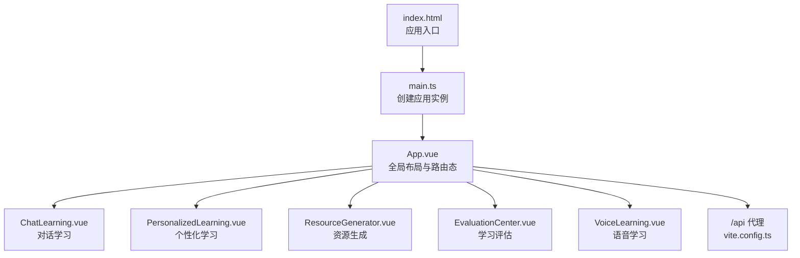
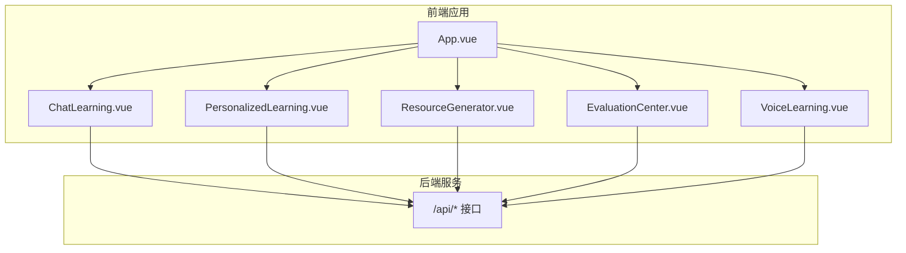
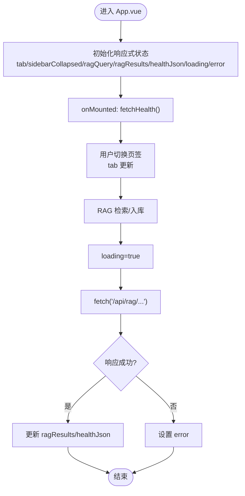
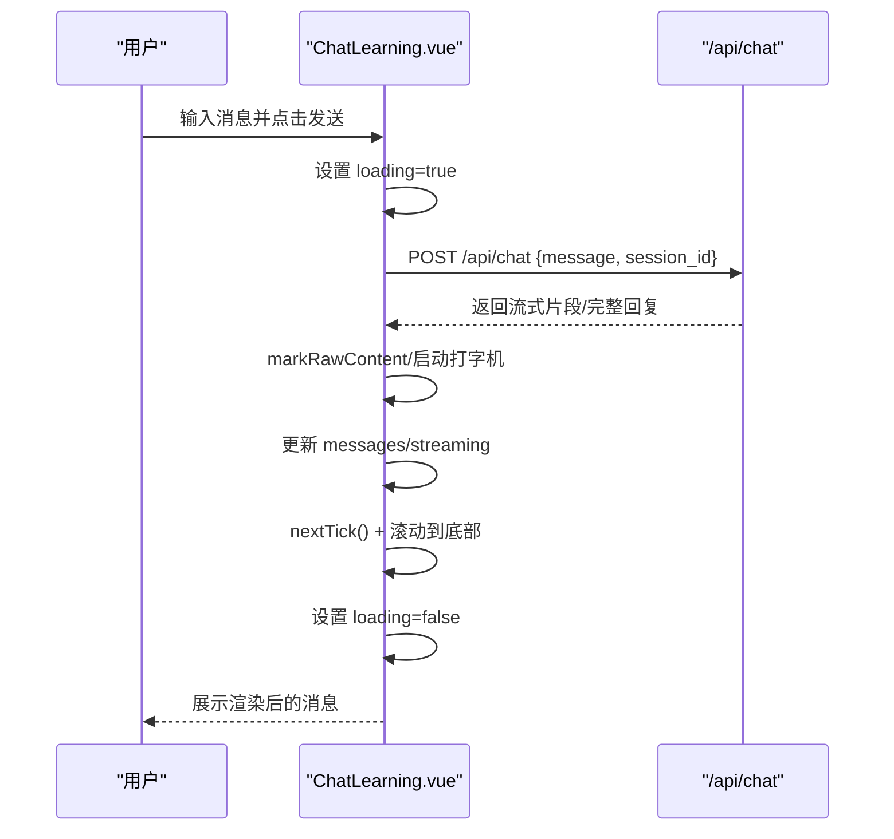
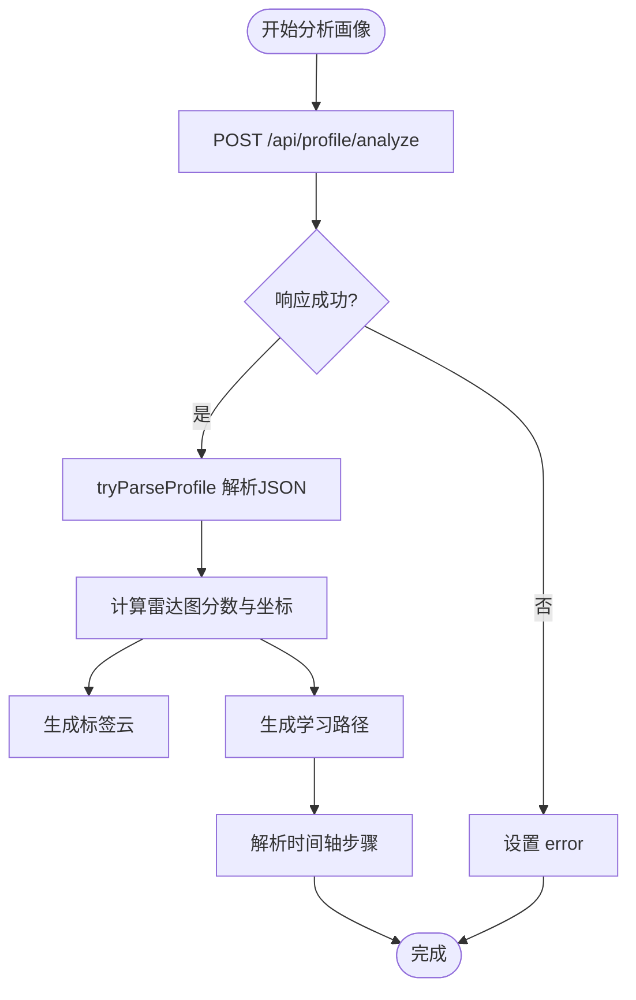
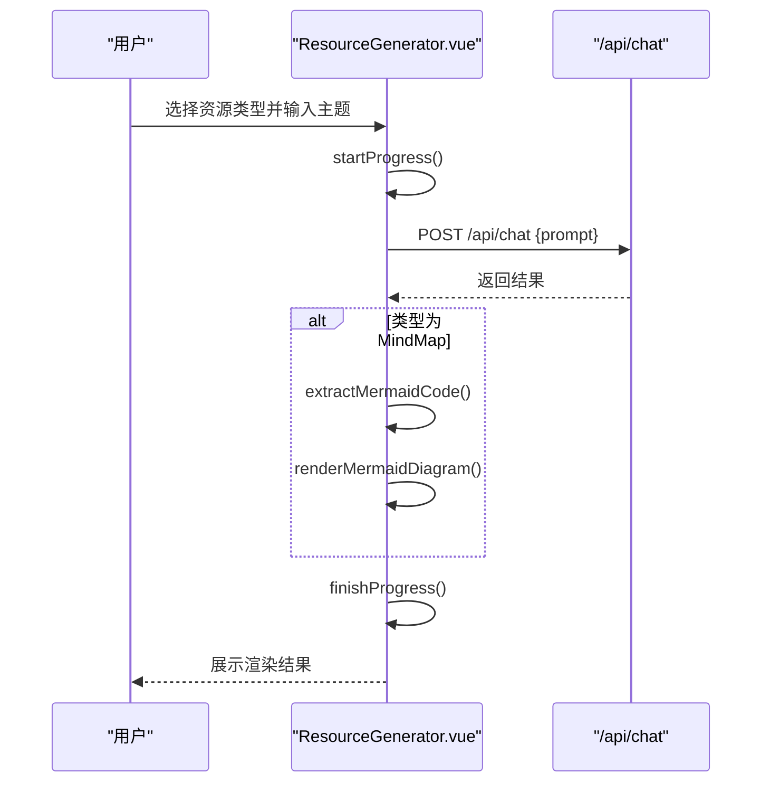
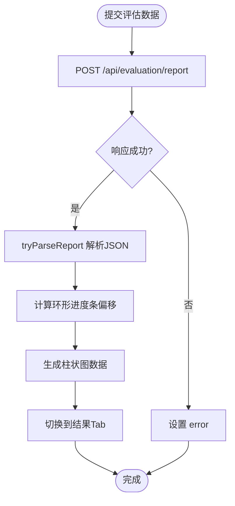
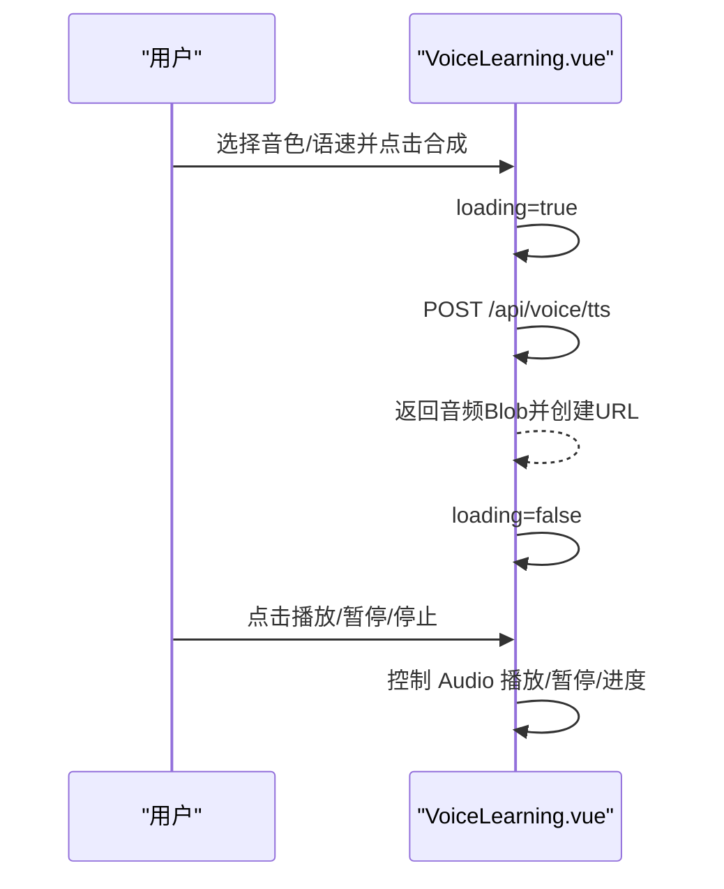
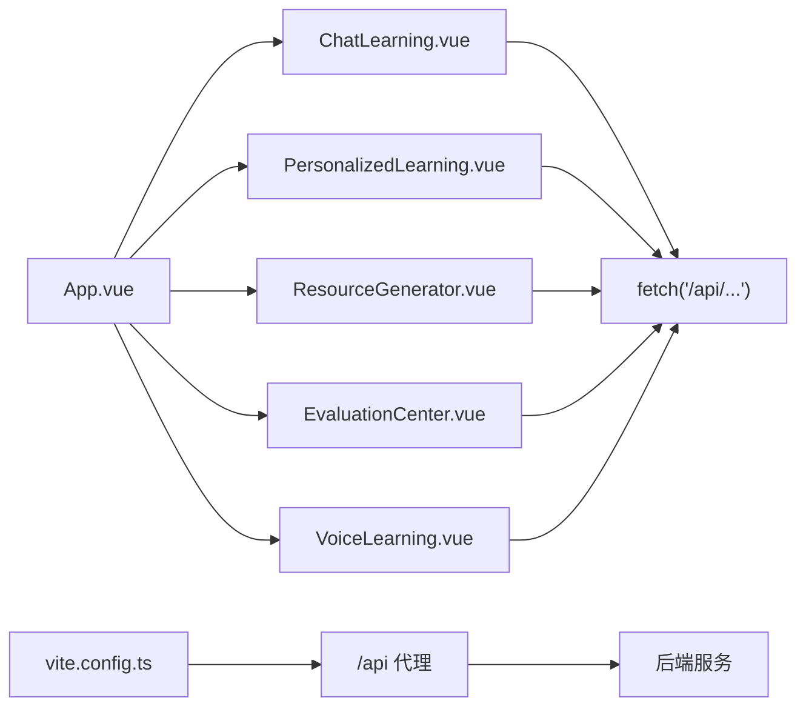

# 状态管理策略

<cite>
**本文档引用的文件**
- [frontend/src/App.vue](file://frontend/src/App.vue)
- [frontend/src/main.ts](file://frontend/src/main.ts)
- [frontend/src/components/ChatLearning.vue](file://frontend/src/components/ChatLearning.vue)
- [frontend/src/components/PersonalizedLearning.vue](file://frontend/src/components/PersonalizedLearning.vue)
- [frontend/src/components/ResourceGenerator.vue](file://frontend/src/components/ResourceGenerator.vue)
- [frontend/src/components/EvaluationCenter.vue](file://frontend/src/components/EvaluationCenter.vue)
- [frontend/src/components/VoiceLearning.vue](file://frontend/src/components/VoiceLearning.vue)
- [frontend/vite.config.ts](file://frontend/vite.config.ts)
- [frontend/package.json](file://frontend/package.json)
- [frontend/index.html](file://frontend/index.html)
</cite>

## 目录
1. [引言](#引言)
2. [项目结构](#项目结构)
3. [核心组件](#核心组件)
4. [架构总览](#架构总览)
5. [详细组件分析](#详细组件分析)
6. [依赖分析](#依赖分析)
7. [性能考虑](#性能考虑)
8. [故障排查指南](#故障排查指南)
9. [结论](#结论)
10. [附录](#附录)

## 引言
本文件面向EduAgent前端的状态管理策略，聚焦于Vue3 Composition API的状态管理模式与实践。通过对各功能模块的源码分析，总结响应式数据绑定、计算属性与侦听器的使用方式，梳理全局状态管理策略、组件间数据共享机制以及状态持久化方案。同时给出Pinia或Vuex的选择理由、状态模块划分原则、异步状态处理方法，并提供最佳实践、性能优化技巧与调试工具使用指南。

## 项目结构
前端采用Vite + Vue3 + TypeScript构建，组件按功能域拆分至src/components目录，入口位于src/main.ts，通过index.html挂载到DOM节点。开发服务器通过vite.config.ts配置代理，将/api前缀转发至后端服务。

图表来源
- [frontend/index.html:1-17](file://frontend/index.html#L1-L17)
- [frontend/src/main.ts:1-6](file://frontend/src/main.ts#L1-L6)
- [frontend/src/App.vue:1-320](file://frontend/src/App.vue#L1-L320)
- [frontend/vite.config.ts:1-17](file://frontend/vite.config.ts#L1-L17)

章节来源
- [frontend/src/main.ts:1-6](file://frontend/src/main.ts#L1-L6)
- [frontend/index.html:1-17](file://frontend/index.html#L1-L17)
- [frontend/vite.config.ts:1-17](file://frontend/vite.config.ts#L1-L17)

## 核心组件
- App.vue：负责全局布局、侧边栏与主内容区切换，维护当前选中页签、RAG检索参数与健康检查状态。
- ChatLearning.vue：对话学习模块，管理消息列表、会话ID、流式打字机渲染、错误与加载状态。
- PersonalizedLearning.vue：个性化学习中心，解析画像数据并可视化为雷达图与标签云，生成学习路径并以时间轴展示。
- ResourceGenerator.vue：AI资源生成中心，支持多种资源类型，内置实时进度条与Markdown/Mermaid渲染。
- EvaluationCenter.vue：学习评估中心，汇总学习行为数据，生成环形进度、柱状图与三栏分析报告。
- VoiceLearning.vue：语音学习中心，提供TTS与ASR能力，管理录音波形、播放器状态与识别结果。

章节来源
- [frontend/src/App.vue:1-320](file://frontend/src/App.vue#L1-L320)
- [frontend/src/components/ChatLearning.vue:1-618](file://frontend/src/components/ChatLearning.vue#L1-L618)
- [frontend/src/components/PersonalizedLearning.vue:1-583](file://frontend/src/components/PersonalizedLearning.vue#L1-L583)
- [frontend/src/components/ResourceGenerator.vue:1-496](file://frontend/src/components/ResourceGenerator.vue#L1-L496)
- [frontend/src/components/EvaluationCenter.vue:1-578](file://frontend/src/components/EvaluationCenter.vue#L1-L578)
- [frontend/src/components/VoiceLearning.vue:1-449](file://frontend/src/components/VoiceLearning.vue#L1-L449)

## 架构总览
EduAgent前端采用“单页应用 + 组件化”的架构，所有状态均在组件内部通过Composition API进行声明与更新。组件间通过props与事件传递数据，少量跨组件共享通过顶层App.vue集中管理（如RAG检索、健康检查）。异步状态通过loading/error标志位与骨架屏/空状态进行用户体验优化。API调用统一通过fetch完成，开发环境通过Vite代理到后端服务。

图表来源
- [frontend/src/App.vue:1-320](file://frontend/src/App.vue#L1-L320)
- [frontend/src/components/ChatLearning.vue:1-618](file://frontend/src/components/ChatLearning.vue#L1-L618)
- [frontend/src/components/PersonalizedLearning.vue:1-583](file://frontend/src/components/PersonalizedLearning.vue#L1-L583)
- [frontend/src/components/ResourceGenerator.vue:1-496](file://frontend/src/components/ResourceGenerator.vue#L1-L496)
- [frontend/src/components/EvaluationCenter.vue:1-578](file://frontend/src/components/EvaluationCenter.vue#L1-L578)
- [frontend/src/components/VoiceLearning.vue:1-449](file://frontend/src/components/VoiceLearning.vue#L1-L449)
- [frontend/vite.config.ts:8-15](file://frontend/vite.config.ts#L8-L15)

## 详细组件分析

### App.vue：全局状态与路由态
- 响应式状态
  - tab：当前选中的页签键值，驱动主内容区切换。
  - sidebarCollapsed：侧边栏折叠状态。
  - ragQuery/ragResults/healthJson/loading/error：RAG检索与健康检查相关的状态。
- 计算属性与侦听
  - 使用watch监听消息数量变化以滚动到底部（在ChatLearning中）。
  - 在mounted钩子中发起健康检查。
- 异步处理
  - ingestRag/queryRag：调用后端RAG接口，统一错误处理与加载状态。
- 组件间共享
  - 作为顶层容器，承载少量跨组件共享状态（如RAG查询参数），避免引入外部状态库。

图表来源
- [frontend/src/App.vue:21-86](file://frontend/src/App.vue#L21-L86)

章节来源
- [frontend/src/App.vue:1-320](file://frontend/src/App.vue#L1-L320)

### ChatLearning.vue：对话学习与流式渲染
- 响应式状态
  - message/sessionId/loading/streaming/error/messages：消息输入、会话ID、加载/流式状态、错误与消息数组。
- 计算属性与侦听
  - 使用computed对Markdown渲染结果进行缓存（在模板中直接使用渲染后的HTML）。
  - 使用watch(messages)自动滚动到底部；使用onBeforeUnmount清理定时器。
- 异步处理
  - sendMessage：提交用户消息，接收流式回复，启动打字机动画，更新消息内容。
  - regenerateMessage：基于历史消息重新生成AI回复。
  - 错误处理：捕获异常并设置错误提示。
- 性能优化
  - 使用nextTick确保DOM更新后再滚动。
  - typewriter定时器在组件卸载时清理，防止内存泄漏。

图表来源
- [frontend/src/components/ChatLearning.vue:133-182](file://frontend/src/components/ChatLearning.vue#L133-L182)

章节来源
- [frontend/src/components/ChatLearning.vue:1-618](file://frontend/src/components/ChatLearning.vue#L1-L618)

### PersonalizedLearning.vue：画像分析与学习路径
- 响应式状态
  - message/sessionId/profileJson/learningPathText/loading/error/activeTab：输入、会话ID、原始JSON、路径文本、加载/错误与活动Tab。
- 计算属性
  - radarScores/radarPoints/radarPolygonPoints：基于解析后的画像数据计算雷达图坐标与分数。
  - profileTags：将画像字段映射为彩色标签云。
  - timelineSteps：解析学习路径文本为时间轴步骤。
- 异步处理
  - analyzeProfile：调用/profile/analyze生成画像JSON。
  - generatePath：调用/chat生成学习路径。
- 数据解析
  - tryParseProfile：安全解析JSON字符串为ProfileData对象。

图表来源
- [frontend/src/components/PersonalizedLearning.vue:223-273](file://frontend/src/components/PersonalizedLearning.vue#L223-L273)

章节来源
- [frontend/src/components/PersonalizedLearning.vue:1-583](file://frontend/src/components/PersonalizedLearning.vue#L1-L583)

### ResourceGenerator.vue：资源生成与渲染
- 响应式状态
  - topic/sessionId/resourceType/result/loading/error/actionFeedback/mermaidContainerRef/mermaidRenderFailed：主题、会话ID、资源类型、结果、加载/错误、操作反馈与Mermaid渲染状态。
- 计算属性
  - resourceTypes：资源类型卡片元数据（颜色、图标、描述）。
- 异步处理
  - generateResource：根据resourceType拼装提示词，调用/chat生成结果；MindMap类型时抽取Mermaid代码并渲染。
  - startProgress/finishProgress：模拟生成进度。
- 渲染与交互
  - Markdown渲染（marked + highlight.js）与代码复制。
  - Mermaid渲染失败回退为原始文本。

图表来源
- [frontend/src/components/ResourceGenerator.vue:119-156](file://frontend/src/components/ResourceGenerator.vue#L119-L156)

章节来源
- [frontend/src/components/ResourceGenerator.vue:1-496](file://frontend/src/components/ResourceGenerator.vue#L1-L496)

### EvaluationCenter.vue：评估报告与可视化
- 响应式状态
  - studyDuration/quizResults/knowledgeMastery/resourceUsage/report/parsedReport/loading/error/activeTab：学习行为数据、报告JSON与解析结果、Tab切换。
- 计算属性
  - quizCorrect/quizTotal/resourceUsageTotal：统计指标。
  - ringOffset：环形进度条偏移量。
  - barColor/levelColor/ringColor：可视化配色映射。
- 异步处理
  - submitEvaluation：提交学习行为数据，生成评估报告并解析。
  - exportReport：导出JSON或Markdown格式报告。
- 可视化
  - 环形进度条、柱状图、三栏分析与学习行为摘要卡片。

图表来源
- [frontend/src/components/EvaluationCenter.vue:113-142](file://frontend/src/components/EvaluationCenter.vue#L113-L142)

章节来源
- [frontend/src/components/EvaluationCenter.vue:1-578](file://frontend/src/components/EvaluationCenter.vue#L1-L578)

### VoiceLearning.vue：语音合成与识别
- 响应式状态
  - text/voice/speechRate/audioUrl/audioBase64/recognitionText/loading/error/activeTab/isRecording/recordingDuration/audioPlaying/audioProgress/audioDuration/audioCurrentTime/actionFeedback：文本、音色、语速、音频URL、识别文本、加载/错误、录音状态、播放器状态与操作反馈。
- 异步处理
  - synthesizeSpeech：TTS合成，返回音频Blob并创建URL。
  - playAudio/pauseAudio/toggleAudio/stopAudio：播放器控制与进度跟踪。
  - recognizeSpeech：麦克风录音5秒，上传识别并返回文本。
- 性能与资源管理
  - onBeforeUnmount：清理定时器、释放音频URL、停止媒体流。

图表来源
- [frontend/src/components/VoiceLearning.vue:63-137](file://frontend/src/components/VoiceLearning.vue#L63-L137)

章节来源
- [frontend/src/components/VoiceLearning.vue:1-449](file://frontend/src/components/VoiceLearning.vue#L1-L449)

## 依赖分析
- 依赖关系
  - App.vue作为根容器，直接依赖各功能组件。
  - 各功能组件通过fetch调用后端API，形成“组件 -> API”的单向依赖。
  - vite.config.ts提供/api代理，简化前后端联调。
- 外部库
  - marked/highlight.js：Markdown渲染与代码高亮。
  - mermaid：思维导图渲染。
  - vue：框架核心，Composition API用于状态管理。

图表来源
- [frontend/src/App.vue:13-17](file://frontend/src/App.vue#L13-L17)
- [frontend/src/components/ChatLearning.vue:159-182](file://frontend/src/components/ChatLearning.vue#L159-L182)
- [frontend/src/components/PersonalizedLearning.vue:229-248](file://frontend/src/components/PersonalizedLearning.vue#L229-L248)
- [frontend/src/components/ResourceGenerator.vue:127-156](file://frontend/src/components/ResourceGenerator.vue#L127-L156)
- [frontend/src/components/EvaluationCenter.vue:119-142](file://frontend/src/components/EvaluationCenter.vue#L119-L142)
- [frontend/src/components/VoiceLearning.vue:74-90](file://frontend/src/components/VoiceLearning.vue#L74-L90)
- [frontend/vite.config.ts:8-15](file://frontend/vite.config.ts#L8-L15)

章节来源
- [frontend/vite.config.ts:1-17](file://frontend/vite.config.ts#L1-L17)
- [frontend/package.json:11-26](file://frontend/package.json#L11-L26)

## 性能考虑
- 响应式更新粒度
  - 使用细粒度ref/响应式对象，避免不必要的重渲染。
  - 将计算属性用于昂贵的派生数据（如雷达图坐标、时间轴步骤）。
- DOM更新时机
  - 在需要读取DOM尺寸或滚动位置前使用nextTick，确保视图同步。
- 定时器与副作用
  - 在onBeforeUnmount中清理定时器、媒体流与音频对象，防止内存泄漏。
- 渲染优化
  - 使用骨架屏与空状态减少白屏时间。
  - 对大文本渲染（Markdown/Mermaid）采用懒渲染或条件渲染。
- 网络请求
  - 通过loading/error标志位与防抖/节流策略避免重复请求。
  - 对流式响应采用增量更新，提升感知速度。

## 故障排查指南
- 常见问题
  - API调用失败：检查代理配置与后端服务状态；在组件内捕获异常并设置错误提示。
  - 加载状态异常：确认loading标志位在请求前后正确切换；检查finally块是否执行。
  - 流式渲染卡顿：检查定时器清理与nextTick使用；避免在渲染循环中进行重型计算。
  - 音频/录音异常：确认浏览器权限与媒体设备可用性；在卸载时释放资源。
- 调试建议
  - 使用浏览器开发者工具Network面板观察请求与响应。
  - 在组件中添加日志输出（如console.log）定位状态更新路径。
  - 对关键计算属性增加缓存与边界条件判断，避免重复计算。

章节来源
- [frontend/src/components/ChatLearning.vue:174-182](file://frontend/src/components/ChatLearning.vue#L174-L182)
- [frontend/src/components/ResourceGenerator.vue:148-156](file://frontend/src/components/ResourceGenerator.vue#L148-L156)
- [frontend/src/components/VoiceLearning.vue:188-194](file://frontend/src/components/VoiceLearning.vue#L188-L194)

## 结论
EduAgent前端采用Composition API实现全栈状态管理，通过细粒度响应式状态、计算属性与侦听器满足复杂业务需求。组件间通过props/事件与顶层App.vue共享少量全局状态，避免引入外部状态库。异步状态通过loading/error与骨架屏优化用户体验，API调用统一通过fetch并在开发环境通过Vite代理。该策略在可维护性、性能与开发效率之间取得平衡，适合中大型前端项目演进。

## 附录

### 状态管理最佳实践
- 使用组合式函数（composables）封装可复用逻辑与状态。
- 将昂贵的计算放入computed，避免在模板中进行复杂表达式。
- 在watch回调中进行副作用操作，注意清理与去抖。
- 对全局共享状态保持最小化，优先通过props/事件传递。

### Pinia vs Vuex 选择理由
- 选择Pinia的理由
  - 更简洁的API与TypeScript原生支持。
  - 更好的模块化与热重载体验。
  - 更贴近Composition API的开发范式。
- 选择Vuex的理由
  - 更成熟的生态与社区支持。
  - 对严格模式与中间件有更完善的内置支持。
- 针对EduAgent的建议
  - 当前项目规模适中，Composition API足以覆盖需求；若未来扩展为大型应用，再引入Pinia以获得更好的模块化与可观测性。

### 状态模块划分原则
- 按功能域划分：对话、画像、资源、评估、语音分别独立管理。
- 按生命周期划分：初始化、运行期、销毁期分别处理副作用与资源回收。
- 按共享范围划分：仅在顶层App.vue共享的少量全局状态，其余状态尽量局部化。

### 异步状态处理
- 请求前设置loading=true，请求后统一设置loading=false。
- 对错误进行分类处理并提供用户可见的反馈。
- 对流式响应采用增量更新与打字机效果提升感知速度。
- 对多媒体资源（音频/录音）在组件卸载时及时释放。