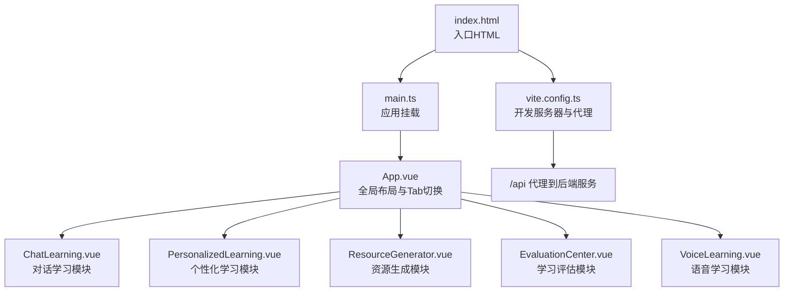
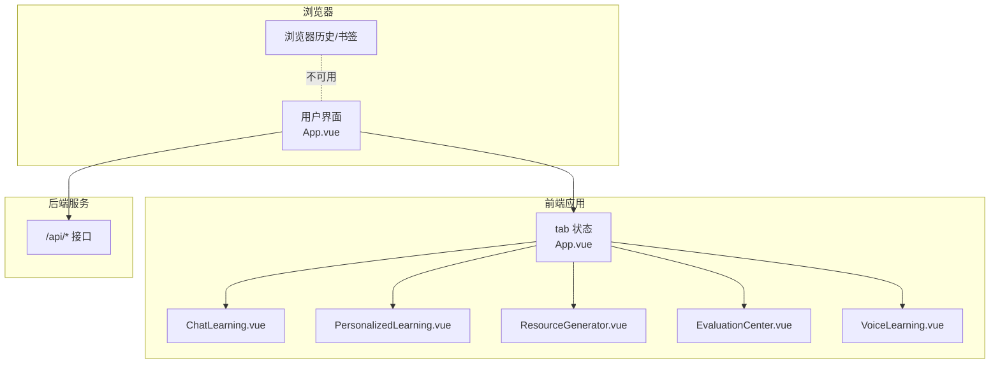
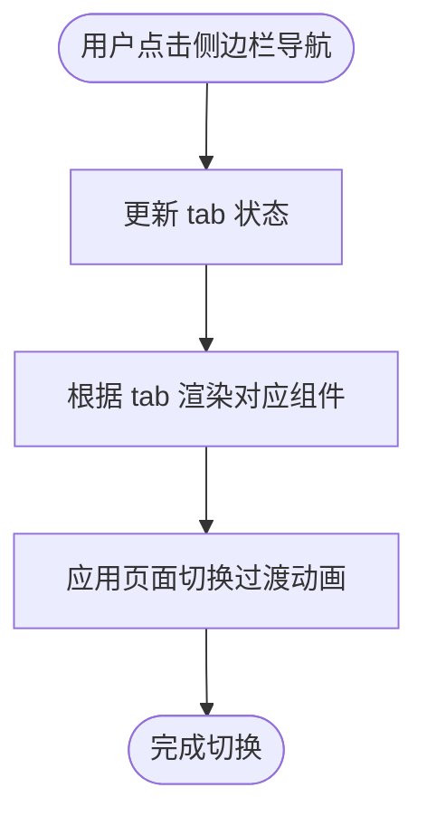
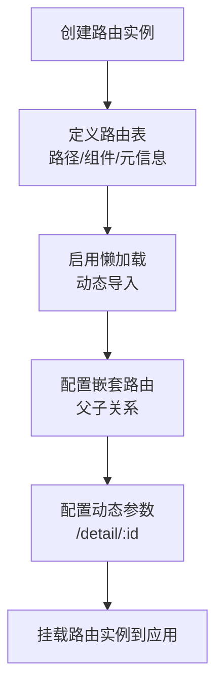
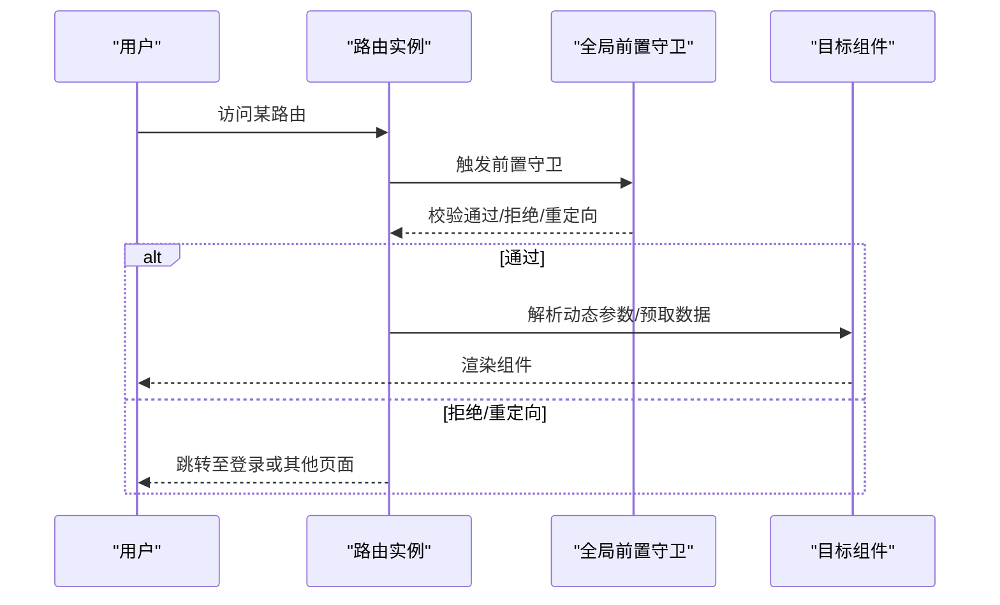
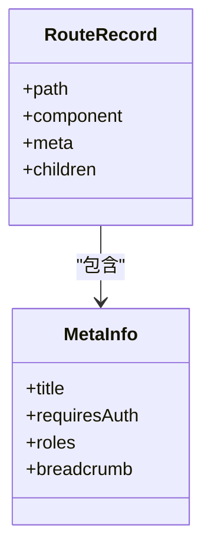
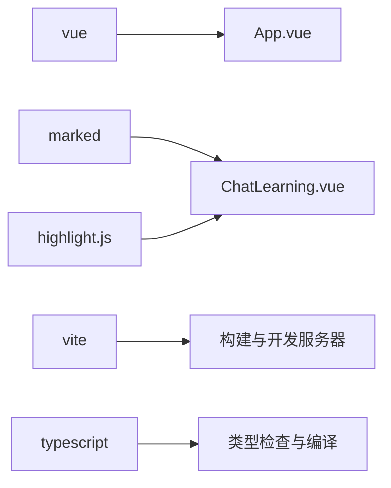

# 路由系统配置

<cite>
**本文引用的文件**
- [frontend/src/App.vue](file://frontend/src/App.vue)
- [frontend/src/main.ts](file://frontend/src/main.ts)
- [frontend/package.json](file://frontend/package.json)
- [frontend/vite.config.ts](file://frontend/vite.config.ts)
- [frontend/index.html](file://frontend/index.html)
- [frontend/src/components/ChatLearning.vue](file://frontend/src/components/ChatLearning.vue)
</cite>

## 目录
1. [引言](#引言)
2. [项目结构](#项目结构)
3. [核心组件](#核心组件)
4. [架构总览](#架构总览)
5. [详细组件分析](#详细组件分析)
6. [依赖分析](#依赖分析)
7. [性能考虑](#性能考虑)
8. [故障排查指南](#故障排查指南)
9. [结论](#结论)
10. [附录](#附录)

## 引言
本技术文档聚焦于EduAgent前端路由系统的现状与演进方案。当前仓库中的前端采用单页应用（SPA）模式，通过全局状态驱动页面切换，未引入Vue Router进行URL路由管理。本文将基于现有代码，系统阐述当前的“无路由”架构如何工作，并提出引入Vue Router后的配置要点、路由守卫、懒加载、嵌套与动态参数、元信息与权限控制、性能优化与SEO策略等实践建议，帮助团队在保持现有功能的基础上平滑升级到标准的前端路由体系。

## 项目结构
前端位于frontend目录，采用Vite构建工具与TypeScript开发环境。当前路由实现集中在根组件中，通过状态变量控制不同功能模块的显示与切换。

图表来源
- [frontend/index.html:1-17](file://frontend/index.html#L1-L17)
- [frontend/src/main.ts:1-6](file://frontend/src/main.ts#L1-L6)
- [frontend/src/App.vue:1-320](file://frontend/src/App.vue#L1-L320)
- [frontend/src/components/ChatLearning.vue:1-618](file://frontend/src/components/ChatLearning.vue#L1-L618)
- [frontend/vite.config.ts:1-17](file://frontend/vite.config.ts#L1-L17)

章节来源
- [frontend/index.html:1-17](file://frontend/index.html#L1-L17)
- [frontend/src/main.ts:1-6](file://frontend/src/main.ts#L1-L6)
- [frontend/src/App.vue:1-320](file://frontend/src/App.vue#L1-L320)
- [frontend/vite.config.ts:1-17](file://frontend/vite.config.ts#L1-L17)

## 核心组件
- 全局布局与路由状态
  - App.vue负责侧边栏导航、顶部栏、主内容区与底部信息展示；通过tab状态在多个功能模块间切换，形成“伪路由”的页面切换体验。
  - 该模式避免了URL变化，所有交互均在内存态完成，适合内部演示或轻量级应用。
- 应用入口与构建
  - main.ts仅创建并挂载根组件，未引入路由实例。
  - vite.config.ts提供开发服务器与/api代理，便于前后端联调。
- 组件化模块
  - 各功能模块以独立组件形式存在，当前通过App.vue的条件渲染进行切换。

章节来源
- [frontend/src/App.vue:1-320](file://frontend/src/App.vue#L1-L320)
- [frontend/src/main.ts:1-6](file://frontend/src/main.ts#L1-L6)
- [frontend/vite.config.ts:1-17](file://frontend/vite.config.ts#L1-L17)

## 架构总览
当前架构采用“状态驱动的单页应用”，而非“URL驱动的路由应用”。其优势在于实现简单、首屏加载快；劣势在于无法利用浏览器历史、书签、分享URL等标准Web能力。

图表来源
- [frontend/src/App.vue:1-320](file://frontend/src/App.vue#L1-L320)
- [frontend/src/components/ChatLearning.vue:1-618](file://frontend/src/components/ChatLearning.vue#L1-L618)
- [frontend/vite.config.ts:1-17](file://frontend/vite.config.ts#L1-L17)

## 详细组件分析

### 当前路由实现（状态驱动）
- 切换机制
  - App.vue定义导航项与tab状态，点击侧边栏导航项更新tab，主内容区根据tab值渲染对应组件。
  - 使用过渡动画实现页面切换的视觉体验。
- 数据与API
  - 各模块通过fetch调用后端接口，如健康检查、RAG入库与查询、聊天对话等。
- 优点
  - 实现简洁，无需额外路由配置。
- 局限
  - 无法通过URL分享具体页面；浏览器前进后退无效；SEO不可用。

图表来源
- [frontend/src/App.vue:70-135](file://frontend/src/App.vue#L70-L135)
- [frontend/src/App.vue:215-284](file://frontend/src/App.vue#L215-L284)

章节来源
- [frontend/src/App.vue:1-320](file://frontend/src/App.vue#L1-L320)

### 引入Vue Router后的演进建议

#### 1) Vue Router配置与懒加载
- 安装与入口
  - 在现有依赖基础上增加路由依赖，修改入口以创建并挂载路由实例。
- 路由表设计
  - 将现有tab映射为路由路径，每个模块对应一个路由记录。
  - 使用动态导入实现按需加载，结合webpack魔法注释进行代码分割。
- 嵌套路由
  - 若存在子页面或二级导航，可设计父子路由关系，保持面包屑与布局一致。
- 动态路由参数
  - 对需要参数的页面（如详情页、会话页）使用动态段，配合路由守卫解析参数。

（本图为概念流程图，不对应具体源码）

#### 2) 路由守卫与导航控制
- 全局前置守卫
  - 在进入任意路由前校验登录态与权限，必要时重定向至登录页。
- 路由独享守卫
  - 针对特定路由进行鉴权或数据预取。
- 组件内守卫
  - 在组件生命周期内进行数据准备或离开确认。

（本图为概念流程图，不对应具体源码）

#### 3) 路由元信息与权限控制
- 元信息字段
  - 在路由记录中添加权限标识、页面标题、面包屑等元信息。
- 权限控制
  - 结合用户角色与路由元信息，决定是否允许访问；未授权时跳转或显示无权限提示。

（本图为概念类图，不对应具体源码）

#### 4) SEO友好性与用户体验
- 路由级SEO
  - 为每个路由设置标题与描述，结合预渲染或SSR提升SEO表现。
- 性能优化
  - 使用路由级别的懒加载与缓存策略，减少首屏体积与白屏时间。
- 用户体验
  - 提供骨架屏、骨架屏占位与渐进式渲染，改善感知性能；支持浏览器前进后退与书签。

（本节为通用实践说明，不对应具体源码）

## 依赖分析
- 运行时依赖
  - Vue：应用框架。
  - marked/highlight.js：ChatLearning模块用于Markdown渲染与代码高亮。
- 开发依赖
  - Vite、@vitejs/plugin-vue、TailwindCSS、TypeScript等。
- 路由相关
  - 当前未安装vue-router，若引入将作为新的运行时依赖。

图表来源
- [frontend/package.json:11-26](file://frontend/package.json#L11-L26)
- [frontend/src/components/ChatLearning.vue:13-19](file://frontend/src/components/ChatLearning.vue#L13-L19)

章节来源
- [frontend/package.json:1-28](file://frontend/package.json#L1-L28)
- [frontend/src/components/ChatLearning.vue:1-618](file://frontend/src/components/ChatLearning.vue#L1-L618)

## 性能考虑
- 代码分割与懒加载
  - 将大型模块拆分为独立chunk，按需加载，降低首屏脚本体积。
- 缓存策略
  - 利用浏览器缓存与Service Worker，缓存静态资源与非敏感数据。
- 骨架屏与渐进式渲染
  - 在路由切换时提供骨架屏，提升感知性能。
- 预取与预加载
  - 在用户可能访问的下一页面上进行预取，缩短二次进入延迟。

（本节为通用性能指导，不对应具体源码）

## 故障排查指南
- 路由未生效
  - 确认已正确安装并挂载路由实例；检查路由表是否包含目标路径。
- 懒加载不生效
  - 确保使用动态导入语法；检查打包配置与分包策略。
- 权限控制异常
  - 校验守卫逻辑与用户状态；确保元信息字段与守卫规则一致。
- SEO问题
  - 检查页面标题与描述是否随路由变化；必要时引入预渲染或SSR。

（本节为通用排查建议，不对应具体源码）

## 结论
当前EduAgent前端采用状态驱动的单页应用模式，实现简洁且易于维护。若需进一步提升可发现性、可分享性与可扩展性，建议引入Vue Router，结合懒加载、守卫、元信息与权限控制，构建标准化的前端路由体系。同时配合SEO与性能优化策略，全面提升用户体验与可维护性。

## 附录
- 当前路由实现参考路径
  - [frontend/src/App.vue:1-320](file://frontend/src/App.vue#L1-L320)
  - [frontend/src/main.ts:1-6](file://frontend/src/main.ts#L1-L6)
  - [frontend/vite.config.ts:1-17](file://frontend/vite.config.ts#L1-L17)
  - [frontend/index.html:1-17](file://frontend/index.html#L1-L17)
  - [frontend/src/components/ChatLearning.vue:1-618](file://frontend/src/components/ChatLearning.vue#L1-L618)