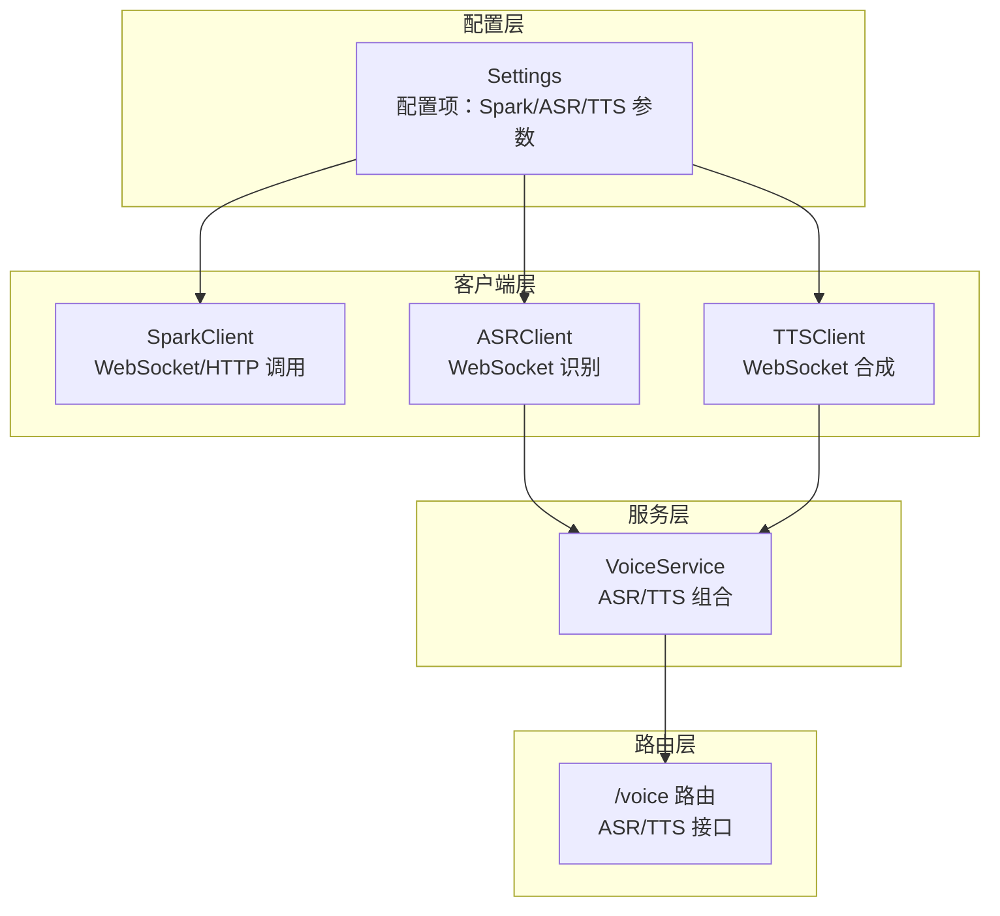
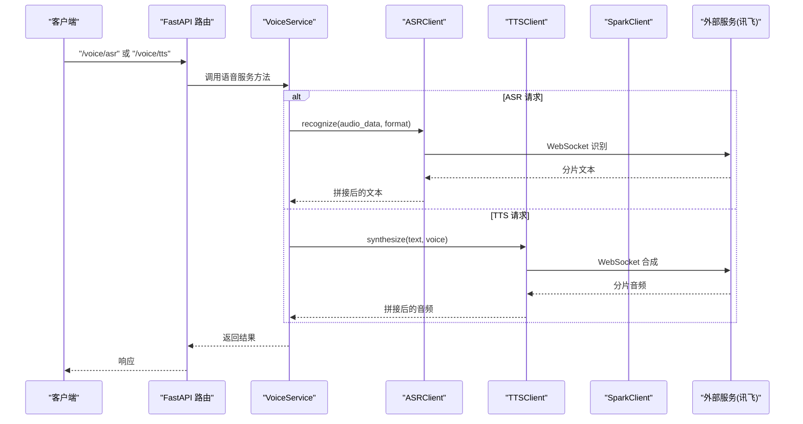
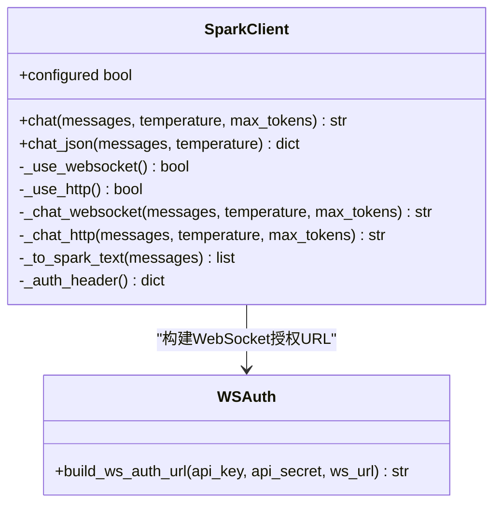
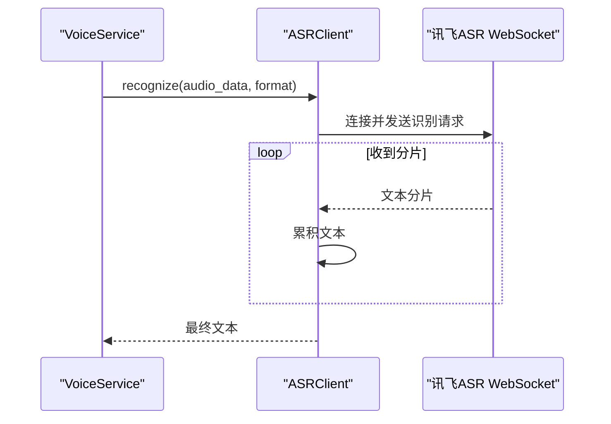
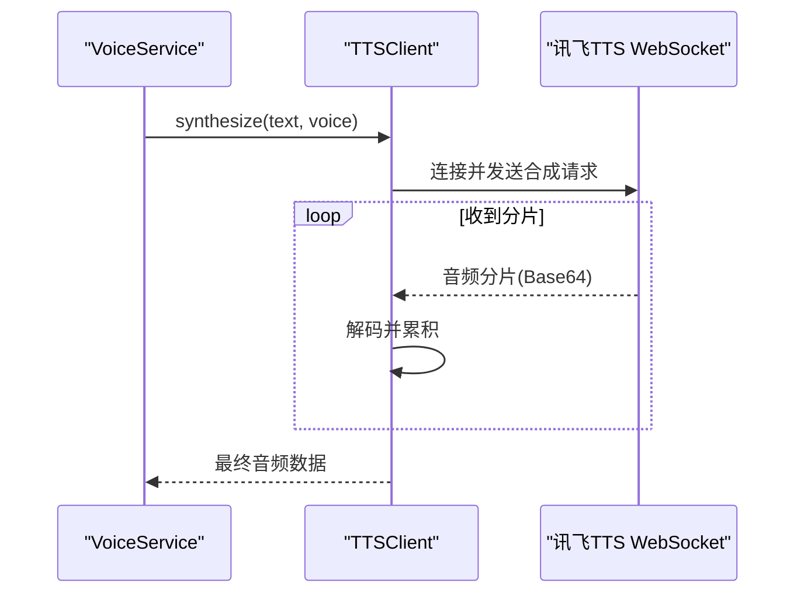
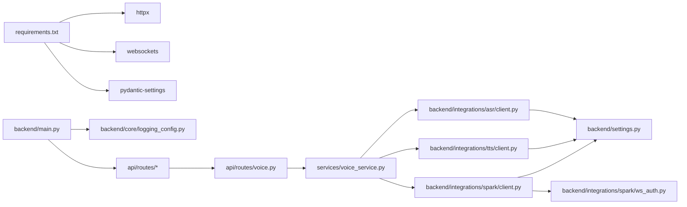

# 外部服务集成

<cite>
**本文引用的文件列表**
- [backend/integrations/spark/client.py](file://backend/integrations/spark/client.py)
- [backend/integrations/spark/ws_auth.py](file://backend/integrations/spark/ws_auth.py)
- [backend/integrations/asr/client.py](file://backend/integrations/asr/client.py)
- [backend/integrations/tts/client.py](file://backend/integrations/tts/client.py)
- [backend/settings.py](file://backend/settings.py)
- [api/routes/voice.py](file://api/routes/voice.py)
- [services/voice_service.py](file://services/voice_service.py)
- [scripts/test_spark_ws.py](file://scripts/test_spark_ws.py)
- [scripts/test_spark_http.py](file://scripts/test_spark_http.py)
- [scripts/test_spark_debug.py](file://scripts/test_spark_debug.py)
- [backend/core/logging_config.py](file://backend/core/logging_config.py)
- [backend/main.py](file://backend/main.py)
- [requirements.txt](file://requirements.txt)
</cite>

## 目录
1. [简介](#简介)
2. [项目结构](#项目结构)
3. [核心组件](#核心组件)
4. [架构总览](#架构总览)
5. [详细组件分析](#详细组件分析)
6. [依赖关系分析](#依赖关系分析)
7. [性能考虑](#性能考虑)
8. [故障排除指南](#故障排除指南)
9. [结论](#结论)
10. [附录](#附录)

## 简介
本文件面向EduAgent的外部服务集成功能，重点说明讯飞星火（Spark）、讯飞语音识别（ASR）与讯飞语音合成（TTS）的集成方式。内容涵盖：
- 两种通信模式：WebSocket与HTTP
- 认证机制与消息协议
- ASR与TTS服务的集成实现、配置参数、错误处理策略
- API密钥安全、重试机制与超时控制
- 扩展指南、替代方案、监控与日志记录
- 实际集成示例、性能优化建议与故障排除方案

## 项目结构
外部服务集成主要分布在以下模块：
- 配置层：集中于设置类，定义各服务的AppId、API Key/Secret、URL、超时等参数
- 客户端层：分别封装Spark、ASR、TTS的调用逻辑
- 服务层：对ASR/TTS进行组合，提供统一的语音服务能力
- 路由层：对外暴露语音相关的REST接口
- 测试脚本：用于验证WebSocket与HTTP两种模式的工作流

图表来源
- [backend/settings.py:6-67](file://backend/settings.py#L6-L67)
- [backend/integrations/spark/client.py:19-198](file://backend/integrations/spark/client.py#L19-L198)
- [backend/integrations/asr/client.py:18-95](file://backend/integrations/asr/client.py#L18-L95)
- [backend/integrations/tts/client.py:19-97](file://backend/integrations/tts/client.py#L19-L97)
- [services/voice_service.py:12-51](file://services/voice_service.py#L12-L51)
- [api/routes/voice.py:18-64](file://api/routes/voice.py#L18-L64)

章节来源
- [backend/settings.py:6-67](file://backend/settings.py#L6-L67)
- [backend/integrations/spark/client.py:19-198](file://backend/integrations/spark/client.py#L19-L198)
- [backend/integrations/asr/client.py:18-95](file://backend/integrations/asr/client.py#L18-L95)
- [backend/integrations/tts/client.py:19-97](file://backend/integrations/tts/client.py#L19-L97)
- [services/voice_service.py:12-51](file://services/voice_service.py#L12-L51)
- [api/routes/voice.py:18-64](file://api/routes/voice.py#L18-L64)

## 核心组件
- SparkClient：支持WebSocket（v4 Ultra）与HTTP两种模式，自动选择并封装认证、消息体构造与结果解析
- ASRClient：基于WebSocket的语音识别，支持多种音频格式，按分片返回文本
- TTSClient：基于WebSocket的文字转语音，返回PCM/WAV音频数据
- VoiceService：对ASR/TTS进行组合，提供统一的语音交互能力
- Settings：集中管理各服务的配置参数与校验

章节来源
- [backend/integrations/spark/client.py:19-198](file://backend/integrations/spark/client.py#L19-L198)
- [backend/integrations/asr/client.py:18-95](file://backend/integrations/asr/client.py#L18-L95)
- [backend/integrations/tts/client.py:19-97](file://backend/integrations/tts/client.py#L19-L97)
- [services/voice_service.py:12-51](file://services/voice_service.py#L12-L51)
- [backend/settings.py:6-67](file://backend/settings.py#L6-L67)

## 架构总览
下图展示从FastAPI路由到语音服务再到外部服务的调用链路，以及Spark的两种通信模式选择逻辑。

图表来源
- [api/routes/voice.py:18-64](file://api/routes/voice.py#L18-L64)
- [services/voice_service.py:31-47](file://services/voice_service.py#L31-L47)
- [backend/integrations/asr/client.py:36-76](file://backend/integrations/asr/client.py#L36-L76)
- [backend/integrations/tts/client.py:37-85](file://backend/integrations/tts/client.py#L37-L85)

## 详细组件分析

### SparkClient：WebSocket与HTTP双模式
- 模式选择
  - WebSocket：当配置满足AppId、API Key、API Secret与WebSocket URL时启用
  - HTTP：当配置满足AppId、API Key、API Secret与HTTP API URL时启用
- 认证机制
  - WebSocket：通过构建授权URL，使用HMAC-SHA256签名，包含Host、Date、Request-Line
  - HTTP：支持多种认证头格式（Key:Secret或仅Key）
- 消息协议
  - WebSocket：消息包含header（app_id、uid）、parameter（domain、temperature、max_tokens）、payload（message.text）
  - HTTP：消息包含model、messages、temperature、max_tokens
- 结果解析
  - WebSocket：累积choices.text，直到header.status==2
  - HTTP：解析choices[0].message.content

图表来源
- [backend/integrations/spark/client.py:19-198](file://backend/integrations/spark/client.py#L19-L198)
- [backend/integrations/spark/ws_auth.py:12-37](file://backend/integrations/spark/ws_auth.py#L12-L37)

章节来源
- [backend/integrations/spark/client.py:25-161](file://backend/integrations/spark/client.py#L25-L161)
- [backend/integrations/spark/ws_auth.py:12-37](file://backend/integrations/spark/ws_auth.py#L12-L37)

### ASRClient：语音识别
- 配置校验：要求AppId、API Key、API Secret齐全
- 认证URL：使用AppId、时间戳与HMAC-SHA256签名
- 协议要点：common.appId、business.lang/domain、data.format/encoding/audio
- 数据流：持续接收分片文本，直到status==2
- 错误处理：捕获WebSocket异常并抛出运行时错误

图表来源
- [services/voice_service.py:31-35](file://services/voice_service.py#L31-L35)
- [backend/integrations/asr/client.py:36-76](file://backend/integrations/asr/client.py#L36-L76)

章节来源
- [backend/integrations/asr/client.py:24-76](file://backend/integrations/asr/client.py#L24-L76)
- [services/voice_service.py:31-35](file://services/voice_service.py#L31-L35)

### TTSClient：语音合成
- 配置校验：要求AppId、API Key、API Secret齐全
- 认证URL：使用AppId、时间戳与HMAC-SHA256签名
- 协议要点：business.aue/auf/vcn/speed/volume/pitch/tte；data.text为Base64
- 数据流：持续接收分片音频，直到status==2
- 错误处理：捕获WebSocket异常并抛出运行时错误；若无音频则报错

图表来源
- [services/voice_service.py:37-41](file://services/voice_service.py#L37-L41)
- [backend/integrations/tts/client.py:37-85](file://backend/integrations/tts/client.py#L37-L85)

章节来源
- [backend/integrations/tts/client.py:25-85](file://backend/integrations/tts/client.py#L25-L85)
- [services/voice_service.py:37-41](file://services/voice_service.py#L37-L41)

### VoiceService：统一语音服务
- 组合ASR与TTS，提供语音聊天能力
- 提供配置状态查询接口，便于前端判断服务可用性

章节来源
- [services/voice_service.py:12-51](file://services/voice_service.py#L12-L51)
- [api/routes/voice.py:57-64](file://api/routes/voice.py#L57-L64)

### 配置参数与安全
- Spark配置
  - 通信模式：websocket/http
  - AppId、API Key、API Secret、可选API Password
  - WebSocket URL、Domain、HTTP API URL、Model、Timeout
- ASR配置：AppId、API Key、API Secret、WebSocket URL
- TTS配置：AppId、API Key、API Secret、WebSocket URL
- 安全建议
  - 使用环境变量存储密钥，避免硬编码
  - 限制日志中敏感信息输出
  - 在生产环境启用HTTPS与严格的CORS策略

章节来源
- [backend/settings.py:17-39](file://backend/settings.py#L17-L39)
- [backend/main.py:53-59](file://backend/main.py#L53-L59)

### 认证与消息协议细节
- Spark WebSocket
  - 授权URL：HMAC-SHA256签名，包含Host、Date、Request-Line
  - 消息体：header.app_id、parameter.chat.domain/temperature/max_tokens、payload.message.text
- Spark HTTP
  - 认证头：支持多种格式（Key:Secret或仅Key）
  - 消息体：model、messages、temperature、max_tokens
- ASR/TTS WebSocket
  - 认证：AppId+时间戳+HMAC-SHA256签名
  - 消息体：common.appId、business参数、data分片

章节来源
- [backend/integrations/spark/ws_auth.py:12-37](file://backend/integrations/spark/ws_auth.py#L12-L37)
- [backend/integrations/spark/client.py:68-78](file://backend/integrations/spark/client.py#L68-L78)
- [backend/integrations/spark/client.py:120-125](file://backend/integrations/spark/client.py#L120-L125)
- [backend/integrations/asr/client.py:28-34](file://backend/integrations/asr/client.py#L28-L34)
- [backend/integrations/tts/client.py:29-35](file://backend/integrations/tts/client.py#L29-L35)

### 错误处理策略
- WebSocket异常：捕获并记录，抛出运行时错误
- HTTP响应：检查状态码并抛出异常
- 业务错误：根据返回的code/message进行处理
- 路由层：将运行时错误映射为HTTP 503/500，并记录日志

章节来源
- [backend/integrations/asr/client.py:72-76](file://backend/integrations/asr/client.py#L72-L76)
- [backend/integrations/tts/client.py:78-81](file://backend/integrations/tts/client.py#L78-L81)
- [api/routes/voice.py:28-34](file://api/routes/voice.py#L28-L34)
- [api/routes/voice.py:49-54](file://api/routes/voice.py#L49-L54)

## 依赖关系分析
- 外部依赖
  - httpx：异步HTTP客户端
  - websockets：WebSocket客户端
  - pydantic-settings：配置加载
- 内部依赖
  - settings：提供配置
  - logging_config：统一日志配置
  - main：应用入口，注册路由与中间件

图表来源
- [requirements.txt:1-18](file://requirements.txt#L1-L18)
- [backend/main.py:15-69](file://backend/main.py#L15-L69)
- [backend/core/logging_config.py:9-27](file://backend/core/logging_config.py#L9-L27)
- [api/routes/voice.py:10-15](file://api/routes/voice.py#L10-L15)
- [services/voice_service.py:6-17](file://services/voice_service.py#L6-L17)
- [backend/integrations/asr/client.py:13](file://backend/integrations/asr/client.py#L13)
- [backend/integrations/tts/client.py:14](file://backend/integrations/tts/client.py#L14)
- [backend/integrations/spark/client.py:13-14](file://backend/integrations/spark/client.py#L13-L14)
- [backend/integrations/spark/ws_auth.py:8](file://backend/integrations/spark/ws_auth.py#L8)
- [backend/settings.py:7](file://backend/settings.py#L7)

章节来源
- [requirements.txt:1-18](file://requirements.txt#L1-L18)
- [backend/main.py:15-69](file://backend/main.py#L15-L69)
- [backend/core/logging_config.py:9-27](file://backend/core/logging_config.py#L9-L27)

## 性能考虑
- 超时控制
  - Spark WebSocket/HTTP均使用统一超时配置，避免长时间阻塞
- 连接复用
  - 当前实现为每次调用新建连接，建议在高并发场景引入连接池或长连接复用
- 数据分片
  - ASR/TTS采用分片传输，注意网络抖动下的重连与丢包处理
- 缓存与降级
  - 可结合Redis进行会话状态缓存；若外部服务不可用，可降级为本地回退策略
- 日志级别
  - 生产环境建议提升日志级别，减少高频日志对性能的影响

章节来源
- [backend/settings.py:27](file://backend/settings.py#L27)
- [backend/integrations/spark/client.py:84-86](file://backend/integrations/spark/client.py#L84-L86)
- [backend/integrations/spark/client.py:127](file://backend/integrations/spark/client.py#L127)
- [backend/core/logging_config.py:9-27](file://backend/core/logging_config.py#L9-L27)

## 故障排除指南
- 常见问题定位
  - 配置不完整：检查AppId、API Key、API Secret与对应URL是否正确
  - WebSocket连接失败：确认网络可达、时间戳与签名计算正确
  - HTTP认证失败：尝试不同认证头格式，核对API URL与模型名称
- 日志与监控
  - 启用统一日志配置，关注路由层的HTTP异常映射
  - 对外部服务调用增加埋点与指标上报
- 重试与超时
  - 当前未内置重试机制，可在上层调用处增加指数退避重试
  - 调整超时阈值以适配网络环境

章节来源
- [api/routes/voice.py:28-34](file://api/routes/voice.py#L28-L34)
- [api/routes/voice.py:49-54](file://api/routes/voice.py#L49-L54)
- [backend/core/logging_config.py:9-27](file://backend/core/logging_config.py#L9-L27)

## 结论
EduAgent的外部服务集成以清晰的分层设计实现了对讯飞星火、ASR与TTS的统一接入。通过WebSocket与HTTP两种模式，配合完善的认证与消息协议封装，能够满足多样化的语音与对话需求。建议在生产环境中进一步完善重试、超时、缓存与监控体系，确保稳定性与可观测性。

## 附录

### 实际集成示例
- Spark WebSocket测试
  - 示例路径：[scripts/test_spark_ws.py:14-23](file://scripts/test_spark_ws.py#L14-L23)
- Spark HTTP测试
  - 示例路径：[scripts/test_spark_http.py:15-58](file://scripts/test_spark_http.py#L15-L58)
  - 调试认证方式示例：[scripts/test_spark_debug.py:32-54](file://scripts/test_spark_debug.py#L32-L54)

章节来源
- [scripts/test_spark_ws.py:14-23](file://scripts/test_spark_ws.py#L14-L23)
- [scripts/test_spark_http.py:15-58](file://scripts/test_spark_http.py#L15-L58)
- [scripts/test_spark_debug.py:32-54](file://scripts/test_spark_debug.py#L32-L54)

### 扩展指南与替代方案
- 新增外部服务
  - 参考现有客户端模式：在integrations目录下新增子模块，实现配置校验、认证、消息协议与错误处理
  - 在service层组合新能力，并在routes层暴露接口
- 替代方案
  - 若需替换为其他大模型或语音服务，只需实现相同接口的客户端类，保持上层调用不变
- 监控与日志
  - 在客户端层增加调用耗时与错误计数指标
  - 使用统一日志格式，便于集中检索与告警

章节来源
- [services/voice_service.py:12-51](file://services/voice_service.py#L12-L51)
- [backend/integrations/asr/client.py:18-95](file://backend/integrations/asr/client.py#L18-L95)
- [backend/integrations/tts/client.py:19-97](file://backend/integrations/tts/client.py#L19-L97)
- [backend/integrations/spark/client.py:19-198](file://backend/integrations/spark/client.py#L19-L198)