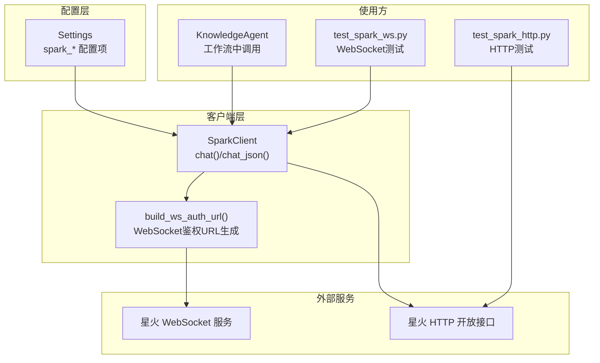
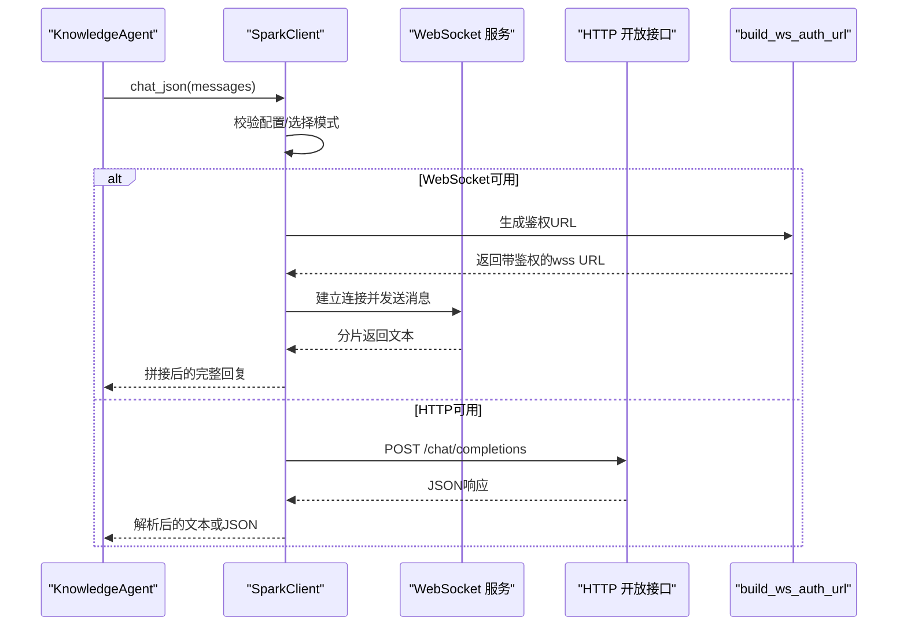
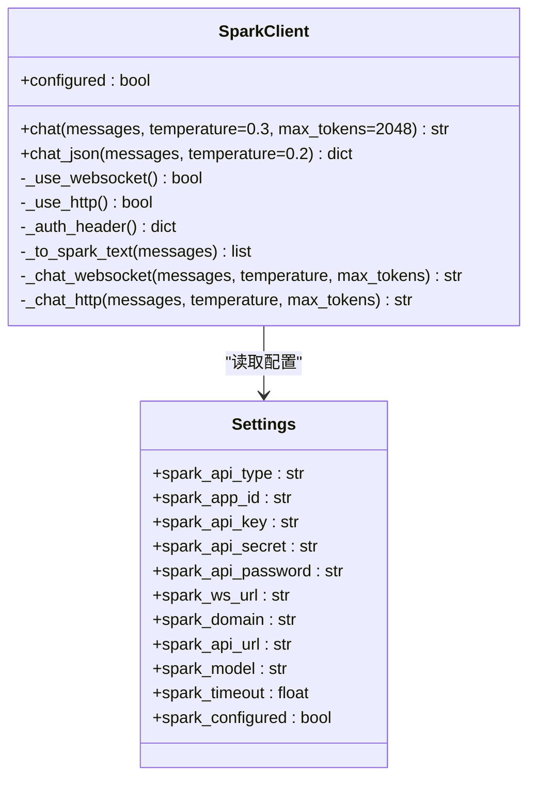
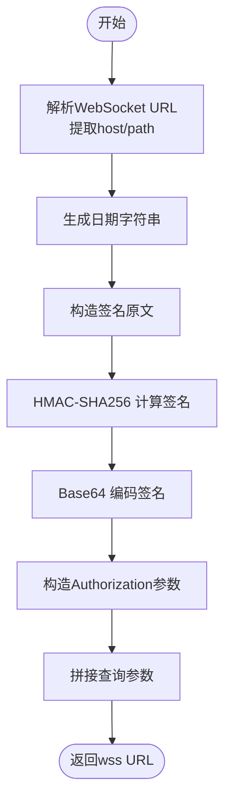
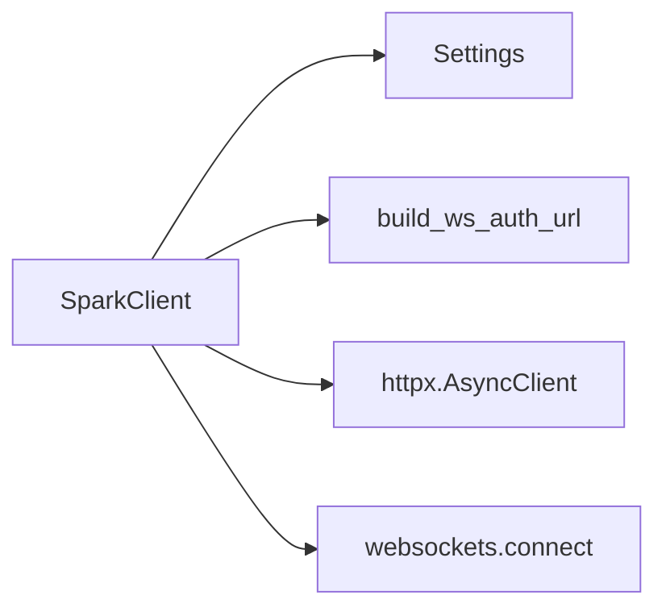

# 讯飞星火API集成

<cite>
**本文引用的文件**
- [backend/integrations/spark/client.py](file://backend/integrations/spark/client.py)
- [backend/integrations/spark/ws_auth.py](file://backend/integrations/spark/ws_auth.py)
- [backend/settings.py](file://backend/settings.py)
- [scripts/test_spark_ws.py](file://scripts/test_spark_ws.py)
- [scripts/test_spark_http.py](file://scripts/test_spark_http.py)
- [agents/knowledge_agent.py](file://agents/knowledge_agent.py)
- [requirements.txt](file://requirements.txt)
</cite>

## 目录
1. [简介](#简介)
2. [项目结构](#项目结构)
3. [核心组件](#核心组件)
4. [架构总览](#架构总览)
5. [详细组件分析](#详细组件分析)
6. [依赖分析](#依赖分析)
7. [性能考虑](#性能考虑)
8. [故障排查指南](#故障排查指南)
9. [结论](#结论)
10. [附录](#附录)

## 简介
本文档围绕 EduAgent 的讯飞星火 API 集成进行系统化技术说明，重点覆盖 SparkClient 类的设计与实现，包括 WebSocket 与 HTTP 两种通信模式的原理、切换机制与适用场景；认证机制（API 密钥管理、Authorization 头构建、WebSocket 鉴权 URL 生成）；消息格式转换、温度参数与最大 token 数等配置项；完整的 API 调用示例、错误处理策略与性能优化建议；以及配置文件设置、环境变量管理与缓存机制的实现细节。

## 项目结构
与讯飞星火集成直接相关的模块分布如下：
- 配置层：backend/settings.py 定义了所有与星火相关的配置项与校验逻辑
- 客户端层：backend/integrations/spark/client.py 提供统一的聊天接口与两种通信模式
- WebSocket 鉴权：backend/integrations/spark/ws_auth.py 生成带鉴权参数的 WebSocket URL
- 使用示例：scripts/test_spark_ws.py 与 scripts/test_spark_http.py 展示如何调用
- Agent 使用：agents/knowledge_agent.py 展示在工作流中如何通过 SparkClient 获取结构化输出
- 依赖声明：requirements.txt 指明异步 HTTP 与 WebSocket 客户端依赖

图表来源
- [backend/integrations/spark/client.py:19-198](file://backend/integrations/spark/client.py#L19-L198)
- [backend/integrations/spark/ws_auth.py:12-37](file://backend/integrations/spark/ws_auth.py#L12-L37)
- [backend/settings.py:17-28](file://backend/settings.py#L17-L28)
- [agents/knowledge_agent.py:109-140](file://agents/knowledge_agent.py#L109-L140)
- [scripts/test_spark_ws.py:14-27](file://scripts/test_spark_ws.py#L14-L27)
- [scripts/test_spark_http.py:15-61](file://scripts/test_spark_http.py#L15-L61)

章节来源
- [backend/integrations/spark/client.py:1-198](file://backend/integrations/spark/client.py#L1-L198)
- [backend/integrations/spark/ws_auth.py:1-37](file://backend/integrations/spark/ws_auth.py#L1-L37)
- [backend/settings.py:1-67](file://backend/settings.py#L1-L67)
- [scripts/test_spark_ws.py:1-28](file://scripts/test_spark_ws.py#L1-L28)
- [scripts/test_spark_http.py:1-62](file://scripts/test_spark_http.py#L1-L62)
- [agents/knowledge_agent.py:1-140](file://agents/knowledge_agent.py#L1-L140)
- [requirements.txt:1-18](file://requirements.txt#L1-L18)

## 核心组件
- SparkClient：统一的星火客户端，支持 WebSocket（v4 Ultra）与 HTTP 开放接口两种模式，自动根据配置选择最优模式；提供 chat 与 chat_json 两个入口，后者用于解析 JSON 结构化输出。
- build_ws_auth_url：生成带 HMAC-SHA256 鉴权签名的 WebSocket URL，满足星火 WebSocket v4 的鉴权要求。
- Settings：集中管理星火相关配置项，包含 API 类型、APP ID、API Key、API Secret、WebSocket/HTTP 地址、模型名、超时时间等，并提供配置完整性校验。

章节来源
- [backend/integrations/spark/client.py:19-198](file://backend/integrations/spark/client.py#L19-L198)
- [backend/integrations/spark/ws_auth.py:12-37](file://backend/integrations/spark/ws_auth.py#L12-L37)
- [backend/settings.py:17-61](file://backend/settings.py#L17-L61)

## 架构总览
下图展示了从 Agent 到 SparkClient，再到外部星火服务的调用链路，以及两种通信模式的选择逻辑。

图表来源
- [agents/knowledge_agent.py:138-140](file://agents/knowledge_agent.py#L138-L140)
- [backend/integrations/spark/client.py:141-161](file://backend/integrations/spark/client.py#L141-L161)
- [backend/integrations/spark/client.py:59-103](file://backend/integrations/spark/client.py#L59-L103)
- [backend/integrations/spark/client.py:112-139](file://backend/integrations/spark/client.py#L112-L139)
- [backend/integrations/spark/ws_auth.py:12-37](file://backend/integrations/spark/ws_auth.py#L12-L37)

## 详细组件分析

### SparkClient 设计与实现
- 统一入口
  - chat：根据配置选择 WebSocket 或 HTTP，支持温度与最大 token 参数。
  - chat_json：在 chat 基础上尝试解析 JSON，便于结构化输出。
- 模式选择
  - WebSocket：当 spark_api_type 为 websocket 且具备 APP ID、API Key、API Secret、WebSocket URL 时启用。
  - HTTP：当 spark_api_type 为 http 且具备 APP ID、API Key、API Secret、HTTP API URL 时启用。
  - 若未配置或配置不完整则抛出错误。
- 消息格式转换
  - 将传入的消息列表标准化为 ["system","user","assistant"] 角色集合，过滤空内容，必要时补充默认用户消息。
- WebSocket 通信流程
  - 使用 build_ws_auth_url 生成鉴权 URL。
  - 发送包含 header（app_id、uid）、parameter（domain、temperature、max_tokens）与 payload（text）的完整消息。
  - 循环接收分片，拼接 content，直到状态为结束。
  - 对返回 header 中的 code 进行校验，非 0 即抛错。
- HTTP 通信流程
  - 构造标准 OpenAI 风格的请求体（model、messages、temperature、max_tokens）。
  - Authorization 头支持两种形式：密码直连（spark_api_password）或 Key:Secret 形式。
  - 校验响应状态码并解析 choices[0].message.content。
- 缓存与工厂
  - 提供 get_spark_client 工厂函数，使用 LRU 缓存以减少重复初始化成本。

图表来源
- [backend/integrations/spark/client.py:19-198](file://backend/integrations/spark/client.py#L19-L198)
- [backend/settings.py:17-61](file://backend/settings.py#L17-L61)

章节来源
- [backend/integrations/spark/client.py:19-198](file://backend/integrations/spark/client.py#L19-L198)
- [backend/settings.py:17-61](file://backend/settings.py#L17-L61)

### WebSocket 鉴权 URL 生成
- 输入：API Key、API Secret、WebSocket URL
- 步骤：
  - 解析主机与路径，构造日期字符串。
  - 依据规范生成签名原文，使用 HMAC-SHA256 计算签名，再进行 Base64 编码。
  - 将签名与头部信息编码为 Authorization，拼接到查询参数中，最终得到 wss://...?authorization=...&date=...&host=...
- 输出：带鉴权参数的 WebSocket 连接地址

图表来源
- [backend/integrations/spark/ws_auth.py:12-37](file://backend/integrations/spark/ws_auth.py#L12-L37)

章节来源
- [backend/integrations/spark/ws_auth.py:12-37](file://backend/integrations/spark/ws_auth.py#L12-L37)

### 配置与环境变量管理
- 关键配置项
  - spark_api_type：websocket 或 http
  - spark_app_id、spark_api_key、spark_api_secret：鉴权凭据
  - spark_api_password：可选的密码直连方式
  - spark_ws_url：WebSocket 服务地址（默认 v4 Ultra）
  - spark_domain：模型域（如 4.0Ultra）
  - spark_api_url：HTTP 开放接口地址
  - spark_model：模型名（如 generalv3.5）
  - spark_timeout：超时秒数
- 配置校验
  - spark_configured：至少满足 WebSocket 或 HTTP 的最小配置集合即视为已配置
- 加载方式
  - 通过 pydantic-settings 从 .env 文件加载，支持 UTF-8 编码与额外字段忽略

章节来源
- [backend/settings.py:17-61](file://backend/settings.py#L17-L61)

### 消息格式转换与参数
- 角色规范化
  - 仅保留 system、user、assistant 三类角色；其他角色统一转为 user。
  - 若为空则补充默认用户消息，确保对话有效。
- 温度与最大 token
  - chat：默认 temperature=0.3，max_tokens=2048
  - chat_json：默认 temperature=0.2，更偏向确定性 JSON 输出
- HTTP 请求体
  - model：来自配置
  - messages：经规范化后的文本列表
  - temperature、max_tokens：来自调用参数

章节来源
- [backend/integrations/spark/client.py:42-57](file://backend/integrations/spark/client.py#L42-L57)
- [backend/integrations/spark/client.py:141-161](file://backend/integrations/spark/client.py#L141-L161)
- [backend/integrations/spark/client.py:112-125](file://backend/integrations/spark/client.py#L112-L125)

### 认证机制
- WebSocket 鉴权
  - 通过 build_ws_auth_url 生成带 Authorization、Date、Host 的查询参数，连接 wss 地址
- HTTP 认证
  - 若配置了 spark_api_password，则 Authorization 为 Bearer <password>
  - 否则为 Bearer <api_key>:<api_secret>
- 依赖库
  - httpx 用于 HTTP 异步请求
  - websockets 用于 WebSocket 连接

章节来源
- [backend/integrations/spark/client.py:36-40](file://backend/integrations/spark/client.py#L36-L40)
- [backend/integrations/spark/client.py:112-126](file://backend/integrations/spark/client.py#L112-L126)
- [backend/integrations/spark/ws_auth.py:12-37](file://backend/integrations/spark/ws_auth.py#L12-L37)
- [requirements.txt:13-14](file://requirements.txt#L13-L14)

### 在工作流中的使用示例
- KnowledgeAgent 在生成知识树时，若 SparkClient 可用则通过 chat_json 获取结构化 JSON；否则回退到规则引擎。
- 示例调用路径参考：
  - [agents/knowledge_agent.py:138-140](file://agents/knowledge_agent.py#L138-L140)
  - [scripts/test_spark_ws.py:18-23](file://scripts/test_spark_ws.py#L18-L23)
  - [scripts/test_spark_http.py:30-55](file://scripts/test_spark_http.py#L30-L55)

章节来源
- [agents/knowledge_agent.py:109-140](file://agents/knowledge_agent.py#L109-L140)
- [scripts/test_spark_ws.py:14-27](file://scripts/test_spark_ws.py#L14-L27)
- [scripts/test_spark_http.py:15-61](file://scripts/test_spark_http.py#L15-L61)

## 依赖分析
- 内部依赖
  - SparkClient 依赖 Settings 提供的配置项
  - WebSocket 模式依赖 build_ws_auth_url 生成鉴权 URL
- 外部依赖
  - httpx：异步 HTTP 客户端
  - websockets：异步 WebSocket 客户端
- 版本要求
  - requirements.txt 明确了 httpx 与 websockets 的最低版本

图表来源
- [backend/integrations/spark/client.py:10-14](file://backend/integrations/spark/client.py#L10-L14)
- [requirements.txt:13-14](file://requirements.txt#L13-L14)

章节来源
- [backend/integrations/spark/client.py:1-198](file://backend/integrations/spark/client.py#L1-L198)
- [requirements.txt:1-18](file://requirements.txt#L1-L18)

## 性能考虑
- 连接复用与缓存
  - get_spark_client 使用 LRU 缓存，避免重复初始化客户端实例
- 超时与重试
  - Settings 提供 spark_timeout 控制整体超时；WebSocket 与 HTTP 均显式设置超时参数
  - 建议在上层业务中对网络异常进行指数退避重试
- 消息体积与分片
  - WebSocket 采用分片传输，需注意拼接顺序与完整性；建议在上层做去重与顺序校验
- 并发与限流
  - 在高并发场景下，建议限制并发连接数并结合后端限流策略
- 日志与可观测性
  - 客户端在不同模式下记录调试日志，便于定位问题

章节来源
- [backend/integrations/spark/client.py:195-198](file://backend/integrations/spark/client.py#L195-L198)
- [backend/integrations/spark/client.py:81-86](file://backend/integrations/spark/client.py#L81-L86)
- [backend/settings.py](file://backend/settings.py#L27)

## 故障排查指南
- 配置不完整
  - 症状：抛出“未配置”或“配置不完整”的错误
  - 排查：确认 .env 中是否设置了 APP ID、API Key、API Secret；WebSocket 需要 ws_url，HTTP 需要 api_url
- WebSocket 鉴权失败
  - 症状：连接建立后收到 header.code 非 0
  - 排查：检查 API Key/Secret 是否正确；确认 ws_auth 生成的 URL 是否包含 authorization/date/host 参数
- HTTP 响应解析失败
  - 症状：无法从响应中解析出 content
  - 排查：确认 Authorization 头格式；检查 model 与 domain 是否匹配
- JSON 解析失败
  - 症状：chat_json 抛出“无法从模型输出解析 JSON”
  - 排查：提高 temperature；确保提示词引导模型输出 JSON；必要时在上层增加容错与重试
- 超时与网络异常
  - 症状：连接或请求超时
  - 排查：增大 spark_timeout；检查网络连通性与防火墙策略

章节来源
- [backend/integrations/spark/client.py:148-161](file://backend/integrations/spark/client.py#L148-L161)
- [backend/integrations/spark/client.py:93-96](file://backend/integrations/spark/client.py#L93-L96)
- [backend/integrations/spark/client.py:139-140](file://backend/integrations/spark/client.py#L139-L140)
- [backend/integrations/spark/client.py:173-192](file://backend/integrations/spark/client.py#L173-L192)

## 结论
SparkClient 将 WebSocket 与 HTTP 两种模式统一抽象为一致的调用接口，配合灵活的配置与鉴权机制，能够稳定地接入讯飞星火 v4 Ultra 与 HTTP 开放接口。通过消息格式转换、参数化控制与 LRU 缓存，既保证了易用性也兼顾了性能。在实际部署中，建议结合日志与监控完善可观测性，并针对网络与并发场景制定合理的超时与重试策略。

## 附录

### API 调用示例与最佳实践
- WebSocket 调用
  - 参考：[scripts/test_spark_ws.py:14-27](file://scripts/test_spark_ws.py#L14-L27)
  - 关键点：使用 get_spark_client 获取实例，调用 chat 并指定 temperature 与 max_tokens
- HTTP 调用
  - 参考：[scripts/test_spark_http.py:15-61](file://scripts/test_spark_http.py#L15-L61)
  - 关键点：构造标准请求体，设置 Authorization 头，使用 httpx.AsyncClient 发送 POST
- 在 Agent 中使用
  - 参考：[agents/knowledge_agent.py:138-140](file://agents/knowledge_agent.py#L138-L140)
  - 关键点：先进行 RAG 检索，再通过 chat_json 生成结构化 JSON；异常时回退至规则引擎

章节来源
- [scripts/test_spark_ws.py:14-27](file://scripts/test_spark_ws.py#L14-L27)
- [scripts/test_spark_http.py:15-61](file://scripts/test_spark_http.py#L15-L61)
- [agents/knowledge_agent.py:109-140](file://agents/knowledge_agent.py#L109-L140)