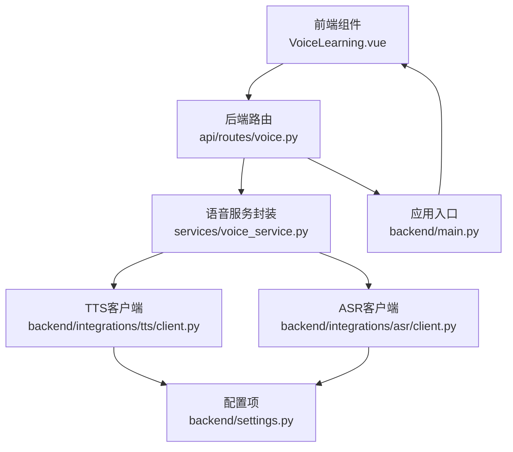
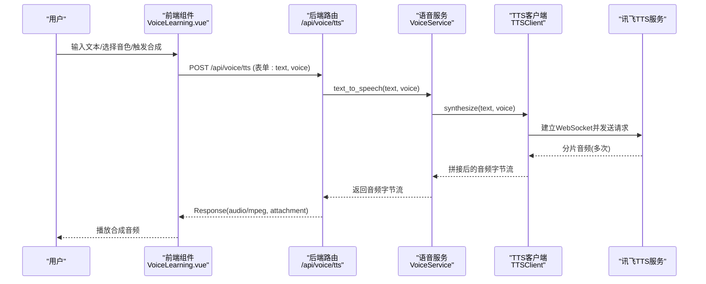
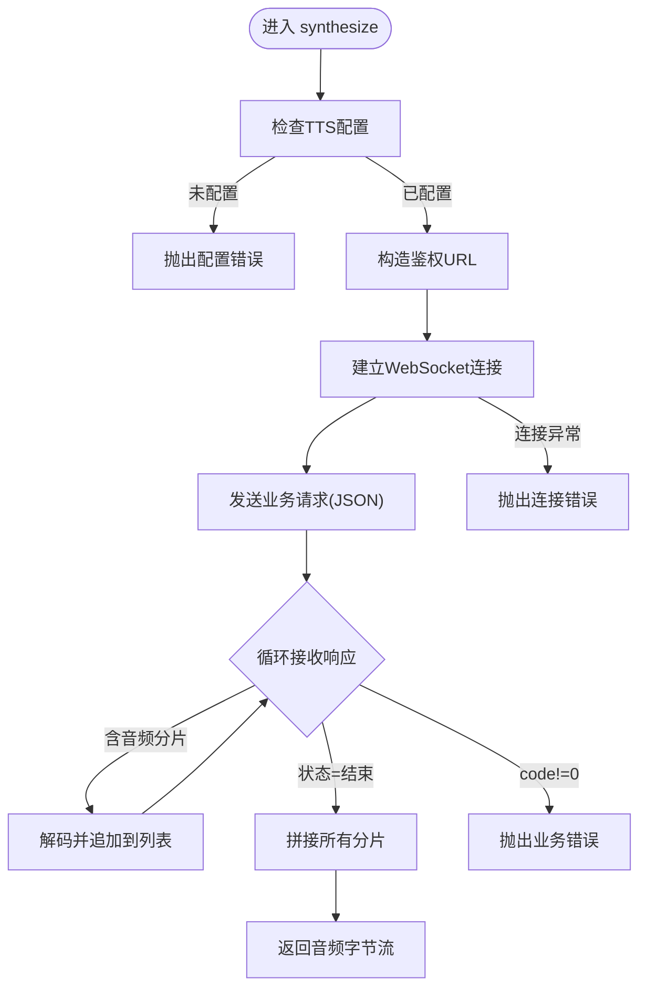
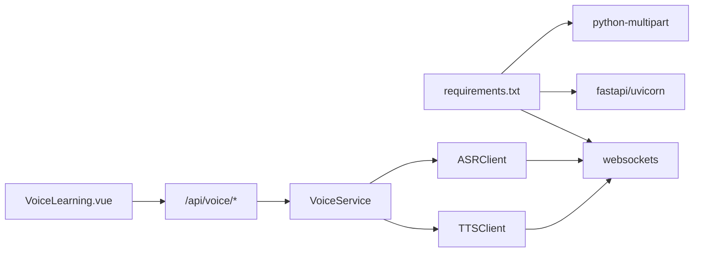

# 语音合成服务集成

<cite>
**本文引用的文件**
- [backend/integrations/tts/client.py](file://backend/integrations/tts/client.py)
- [backend/integrations/asr/client.py](file://backend/integrations/asr/client.py)
- [backend/integrations/tts/__init__.py](file://backend/integrations/tts/__init__.py)
- [backend/integrations/__init__.py](file://backend/integrations/__init__.py)
- [services/voice_service.py](file://services/voice_service.py)
- [api/routes/voice.py](file://api/routes/voice.py)
- [backend/settings.py](file://backend/settings.py)
- [backend/main.py](file://backend/main.py)
- [frontend/src/components/VoiceLearning.vue](file://frontend/src/components/VoiceLearning.vue)
- [requirements.txt](file://requirements.txt)
- [README.md](file://README.md)
</cite>

## 目录
1. [简介](#简介)
2. [项目结构](#项目结构)
3. [核心组件](#核心组件)
4. [架构总览](#架构总览)
5. [详细组件分析](#详细组件分析)
6. [依赖分析](#依赖分析)
7. [性能考虑](#性能考虑)
8. [故障排查指南](#故障排查指南)
9. [结论](#结论)
10. [附录](#附录)

## 简介
本文件面向EduAgent的语音合成（TTS）服务集成，围绕“文本转语音”的完整链路进行技术说明，涵盖客户端实现架构、文本处理流程、音频格式与质量控制、API接口规范、音色与参数配置、音频输出优化与延迟控制、并发处理策略、集成示例、配置参数说明、性能优化建议以及错误处理与资源管理最佳实践。

## 项目结构
EduAgent采用前后端分离架构，语音合成能力通过后端FastAPI路由暴露，前端Vue组件负责用户交互与调用。TTS与ASR均基于讯飞星火生态，通过WebSocket协议与讯飞服务对接。

图表来源
- [frontend/src/components/VoiceLearning.vue](file://frontend/src/components/VoiceLearning.vue)
- [api/routes/voice.py](file://api/routes/voice.py)
- [services/voice_service.py](file://services/voice_service.py)
- [backend/integrations/tts/client.py](file://backend/integrations/tts/client.py)
- [backend/integrations/asr/client.py](file://backend/integrations/asr/client.py)
- [backend/settings.py](file://backend/settings.py)
- [backend/main.py](file://backend/main.py)

章节来源
- [backend/main.py:1-70](file://backend/main.py#L1-L70)
- [api/routes/voice.py:1-64](file://api/routes/voice.py#L1-L64)
- [services/voice_service.py:1-51](file://services/voice_service.py#L1-L51)
- [backend/integrations/tts/client.py:1-97](file://backend/integrations/tts/client.py#L1-L97)
- [backend/integrations/asr/client.py:1-95](file://backend/integrations/asr/client.py#L1-L95)
- [backend/settings.py:1-67](file://backend/settings.py#L1-L67)
- [frontend/src/components/VoiceLearning.vue:1-449](file://frontend/src/components/VoiceLearning.vue#L1-L449)

## 核心组件
- TTS客户端：封装讯飞TTS WebSocket调用，负责鉴权、消息发送、音频分片接收与拼接、错误处理与返回字节流。
- ASR客户端：封装讯飞ASR WebSocket调用，负责语音识别，返回文本。
- 语音服务封装：统一暴露ASR/TTS能力，提供配置状态查询与组合式语音对话能力。
- API路由：提供TTS/ASR/status三个接口，返回音频或文本，支持表单参数与响应头定制。
- 前端组件：提供TTS/ASR双Tab界面，支持音色选择、语速调节、录音与播放控制等。

章节来源
- [backend/integrations/tts/client.py:19-97](file://backend/integrations/tts/client.py#L19-L97)
- [backend/integrations/asr/client.py:18-95](file://backend/integrations/asr/client.py#L18-L95)
- [services/voice_service.py:12-51](file://services/voice_service.py#L12-L51)
- [api/routes/voice.py:18-64](file://api/routes/voice.py#L18-L64)
- [frontend/src/components/VoiceLearning.vue:37-449](file://frontend/src/components/VoiceLearning.vue#L37-L449)

## 架构总览
从用户操作到音频输出的端到端流程如下：

图表来源
- [frontend/src/components/VoiceLearning.vue:63-90](file://frontend/src/components/VoiceLearning.vue#L63-L90)
- [api/routes/voice.py:36-54](file://api/routes/voice.py#L36-L54)
- [services/voice_service.py:37-41](file://services/voice_service.py#L37-L41)
- [backend/integrations/tts/client.py:37-85](file://backend/integrations/tts/client.py#L37-L85)

## 详细组件分析

### TTS客户端实现与处理流程
- 配置校验：通过Settings中的TTS密钥与WS地址判断是否已配置。
- 鉴权签名：按APPID+时间戳生成HMAC-SHA256签名，附加到WebSocket URL。
- 请求构建：发送JSON消息，包含通用字段、业务参数与数据载荷；业务参数包含编码、采样率、音色、速度、音量、音高、字符集等。
- 流式接收：循环接收服务端分片音频，解码后累积；当状态为结束时退出。
- 错误处理：捕获WebSocket异常与业务错误码，抛出运行时异常；空音频数据时也抛错。
- 输出格式：当前实现返回PCM/WAV字节流，由上层路由包装为MP3响应。

图表来源
- [backend/integrations/tts/client.py:37-85](file://backend/integrations/tts/client.py#L37-L85)

章节来源
- [backend/integrations/tts/client.py:19-97](file://backend/integrations/tts/client.py#L19-L97)

### API接口规范（TTS/ASR/status）
- TTS接口
  - 方法与路径：POST /api/voice/tts
  - 表单参数：
    - text：要转换的文字
    - voice：音色标识，默认"xiaoyan"
  - 响应：
    - Content-Type: audio/mpeg
    - Content-Disposition: attachment; filename=speech.mp3
    - Body: 音频字节流
  - 异常：
    - 503：TTS未配置或连接失败
    - 500：其他异常
- ASR接口
  - 方法与路径：POST /api/voice/asr
  - 表单参数：
    - audio：上传的语音文件（wav/mp3/pcm）
    - format：音频格式，默认"wav"
  - 响应：{"text": "..."}
  - 异常：同上
- 状态接口
  - 方法与路径：GET /api/voice/status
  - 响应：{"asr_configured": bool, "tts_configured": bool, "fully_configured": bool}

章节来源
- [api/routes/voice.py:18-64](file://api/routes/voice.py#L18-L64)

### 语音参数配置与音色选择
- 音色选择：前端组件提供多种音色卡片，后端路由接受voice参数；TTS客户端将voice映射至业务参数。
- 业务参数（来自请求载荷）：
  - aue：音频编码（当前为lame）
  - auf：音频格式与采样率（audio/L16;rate=16000）
  - vcn：音色名称
  - speed：语速
  - volume：音量
  - pitch：音高
  - tte：文本编码
- 前端语速调节：提供1-10的滑杆，用于演示参数传递，当前TTS实现未直接消费该参数（可作为扩展点）。

章节来源
- [backend/integrations/tts/client.py:47-62](file://backend/integrations/tts/client.py#L47-L62)
- [api/routes/voice.py:36-40](file://api/routes/voice.py#L36-L40)
- [frontend/src/components/VoiceLearning.vue:37-48](file://frontend/src/components/VoiceLearning.vue#L37-L48)

### 音频格式生成与质量控制
- 音频格式：TTS客户端返回PCM/WAV字节流；后端路由将其作为MP3响应返回给前端。
- 质量控制：
  - 采样率：16kHz（L16）
  - 编码：lame（MP3）
  - 语速/音量/音高：可通过业务参数调整（当前前端未传入语速参数）
- 建议：
  - 若需更高质量，可在上游调整采样率与比特率；若需更低延迟，可考虑降低缓冲与分片大小（需结合服务端支持）。

章节来源
- [backend/integrations/tts/client.py:50-56](file://backend/integrations/tts/client.py#L50-L56)
- [api/routes/voice.py:44-47](file://api/routes/voice.py#L44-L47)

### 并发处理与延迟控制
- 并发模型：TTS/ASR均为异步WebSocket调用，每个请求独立建立连接与会话；服务端未对并发做全局限流。
- 延迟控制：
  - WebSocket直连讯飞，避免中间层过多转发。
  - 前端在收到Blob后立即创建对象URL并播放，减少等待。
  - 建议：对高频场景增加连接池与请求合并策略，或在网关层做限流与排队。

章节来源
- [backend/integrations/tts/client.py:46](file://backend/integrations/tts/client.py#L46)
- [frontend/src/components/VoiceLearning.vue:80-84](file://frontend/src/components/VoiceLearning.vue#L80-L84)

### 集成示例与最佳实践
- 前端调用示例（参考组件逻辑）：
  - 使用FormData携带text与voice，POST到/api/voice/tts，解析响应Blob并创建URL播放。
  - 录音识别：使用浏览器MediaRecorder录制WAV，上传到/api/voice/asr，解析返回的text。
- 后端集成要点：
  - 确保配置项齐全（TTS/ASR APPID/APIKey/API Secret/WS URL）。
  - 在路由层对异常进行分类处理，返回明确的HTTP状态码。
  - 对外暴露/status接口便于前端引导用户正确配置。
- 资源管理：
  - 前端在组件卸载时释放对象URL与定时器。
  - 后端WebSocket连接在上下文内自动关闭，避免泄漏。

章节来源
- [frontend/src/components/VoiceLearning.vue:63-194](file://frontend/src/components/VoiceLearning.vue#L63-L194)
- [api/routes/voice.py:18-64](file://api/routes/voice.py#L18-L64)
- [services/voice_service.py:12-51](file://services/voice_service.py#L12-L51)

## 依赖分析
- 第三方库：
  - websockets：WebSocket客户端，用于与讯飞服务通信。
  - fastapi/uvicorn：后端框架与服务器。
  - python-multipart：表单解析。
- 组件耦合：
  - TTS/ASR客户端依赖Settings读取配置。
  - 语音服务封装同时依赖ASR/TTS客户端。
  - API路由依赖语音服务封装。
  - 前端组件依赖后端API。

图表来源
- [requirements.txt:1-18](file://requirements.txt#L1-L18)
- [backend/integrations/tts/client.py:12](file://backend/integrations/tts/client.py#L12)
- [backend/integrations/asr/client.py:11](file://backend/integrations/asr/client.py#L11)
- [api/routes/voice.py:7](file://api/routes/voice.py#L7)
- [frontend/src/components/VoiceLearning.vue:63](file://frontend/src/components/VoiceLearning.vue#L63)

章节来源
- [requirements.txt:1-18](file://requirements.txt#L1-L18)
- [backend/integrations/tts/client.py:1-97](file://backend/integrations/tts/client.py#L1-L97)
- [backend/integrations/asr/client.py:1-95](file://backend/integrations/asr/client.py#L1-L95)
- [services/voice_service.py:1-51](file://services/voice_service.py#L1-L51)
- [api/routes/voice.py:1-64](file://api/routes/voice.py#L1-L64)
- [frontend/src/components/VoiceLearning.vue:1-449](file://frontend/src/components/VoiceLearning.vue#L1-L449)

## 性能考虑
- 传输与编解码：
  - 使用lame编码与16kHz采样率平衡体积与清晰度。
  - 建议在需要更高音质时提升采样率与码率（需服务端支持）。
- 延迟优化：
  - WebSocket直连减少中间层开销。
  - 前端尽早创建对象URL并开始播放，避免阻塞。
- 并发与缓存：
  - 对频繁请求可引入连接池与请求合并。
  - 对热点文本可考虑本地缓存（需注意版权与隐私合规）。
- 资源回收：
  - 前端及时释放对象URL与媒体资源。
  - 后端确保WebSocket连接生命周期受控。

## 故障排查指南
- 常见错误与定位
  - 未配置：检查Settings中的TTS/ASR密钥与WS URL是否填写。
  - 连接失败：查看WebSocket异常日志，确认网络可达性与签名参数。
  - 业务错误：根据返回的code/message定位具体问题。
  - 无音频数据：确认文本长度与服务端可用性。
- 建议的排查步骤
  - 使用/status接口确认配置状态。
  - 查看后端日志（INFO/ERROR级别）。
  - 前端检查fetch响应状态与错误提示。
  - 在独立脚本中最小化复现问题（仅调用TTS/ASR客户端）。

章节来源
- [backend/integrations/tts/client.py:39-85](file://backend/integrations/tts/client.py#L39-L85)
- [backend/integrations/asr/client.py:38-76](file://backend/integrations/asr/client.py#L38-L76)
- [api/routes/voice.py:49-54](file://api/routes/voice.py#L49-L54)
- [services/voice_service.py:31-47](file://services/voice_service.py#L31-L47)

## 结论
EduAgent的TTS服务集成以简洁的WebSocket直连为核心，配合后端路由与前端组件形成完整的“文本→语音”链路。当前实现具备良好的可扩展性：可在业务参数中加入语速等控制项，或在后端引入缓存与限流策略以提升性能与稳定性。建议在生产环境中完善监控与告警，并持续关注讯飞服务端的参数与能力变化。

## 附录

### 配置参数说明（来自Settings）
- TTS相关
  - tts_app_id：应用ID
  - tts_api_key：API Key
  - tts_api_secret：API Secret
  - tts_ws_url：WebSocket服务地址
- ASR相关
  - asr_app_id：应用ID
  - asr_api_key：API Key
  - asr_api_secret：API Secret
  - asr_ws_url：WebSocket服务地址

章节来源
- [backend/settings.py:35-39](file://backend/settings.py#L35-L39)
- [backend/settings.py:29-33](file://backend/settings.py#L29-L33)

### API定义概览
- GET /api/voice/status
  - 返回：asr_configured, tts_configured, fully_configured
- POST /api/voice/tts
  - 表单：text, voice
  - 响应：audio/mpeg（附件）
- POST /api/voice/asr
  - 表单：audio（文件）, format
  - 响应：{"text": "..."}

章节来源
- [api/routes/voice.py:18-64](file://api/routes/voice.py#L18-L64)