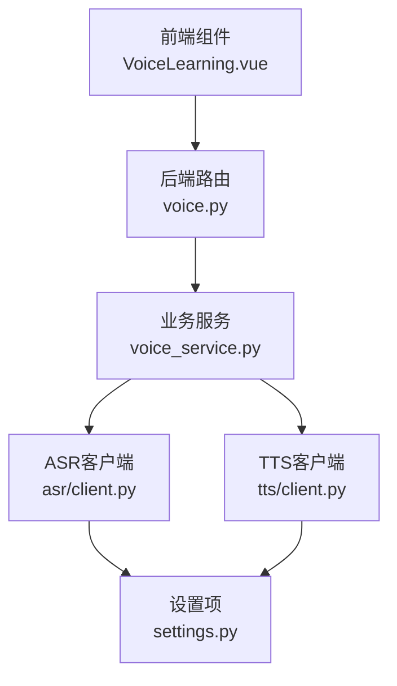
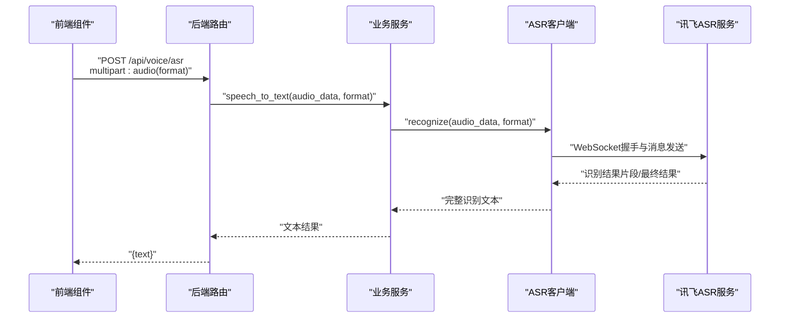
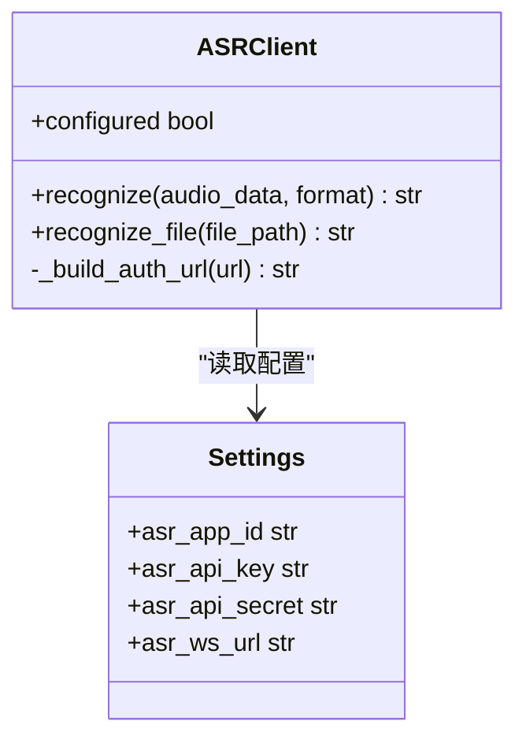
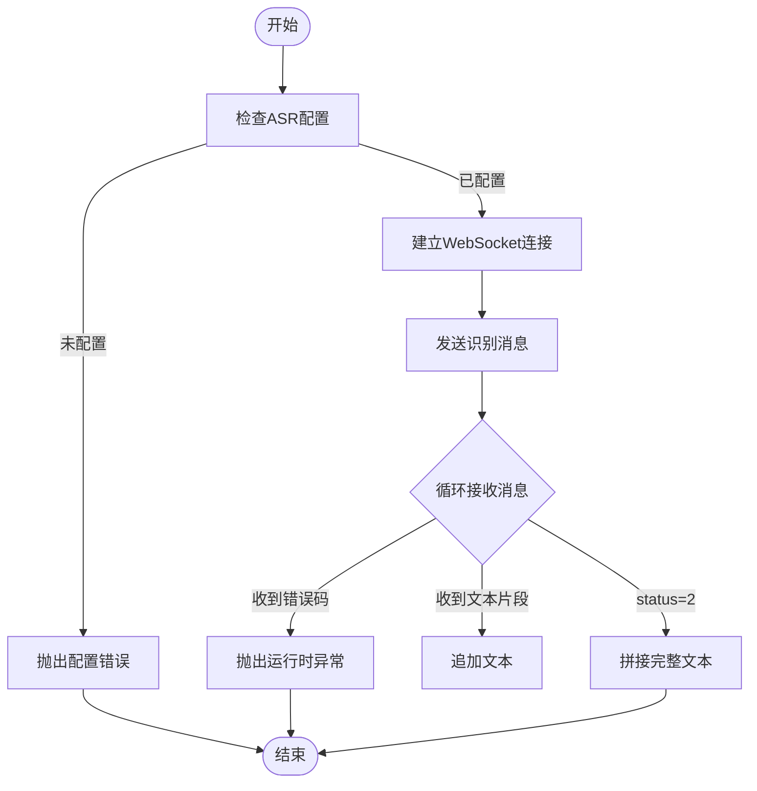
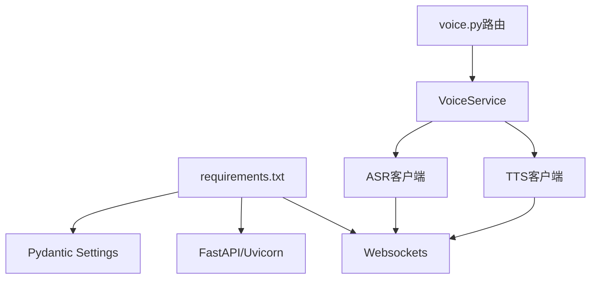

# 语音识别服务集成

<cite>
**本文引用的文件**
- [backend/integrations/asr/client.py](file://backend/integrations/asr/client.py)
- [backend/integrations/tts/client.py](file://backend/integrations/tts/client.py)
- [api/routes/voice.py](file://api/routes/voice.py)
- [services/voice_service.py](file://services/voice_service.py)
- [backend/settings.py](file://backend/settings.py)
- [frontend/src/components/VoiceLearning.vue](file://frontend/src/components/VoiceLearning.vue)
- [requirements.txt](file://requirements.txt)
- [README.md](file://README.md)
- [software_cup_ai_education_system_architecture.md](file://software_cup_ai_education_system_architecture.md)
</cite>

## 目录
1. [简介](#简介)
2. [项目结构](#项目结构)
3. [核心组件](#核心组件)
4. [架构总览](#架构总览)
5. [详细组件分析](#详细组件分析)
6. [依赖分析](#依赖分析)
7. [性能考虑](#性能考虑)
8. [故障排查指南](#故障排查指南)
9. [结论](#结论)
10. [附录](#附录)

## 简介
本技术文档面向EduAgent的语音识别（ASR）服务集成，聚焦于ASR客户端的实现架构、音频格式处理、实时转录流程、错误恢复机制；同时覆盖API接口规范、请求参数配置、响应数据解析；并补充音频质量优化、噪声处理、多语言支持等技术细节。文档还提供完整的集成示例、配置指南、性能调优建议以及错误处理策略、超时控制与重试机制的实现方案。

## 项目结构
EduAgent采用前后端分离架构，语音识别能力由后端FastAPI服务提供，前端Vue组件负责录音与调用后端ASR/TTS接口。ASR与TTS分别封装在独立客户端中，统一由业务服务VoiceService协调对外提供能力。

图表来源
- [frontend/src/components/VoiceLearning.vue](file://frontend/src/components/VoiceLearning.vue)
- [api/routes/voice.py](file://api/routes/voice.py)
- [services/voice_service.py](file://services/voice_service.py)
- [backend/integrations/asr/client.py](file://backend/integrations/asr/client.py)
- [backend/integrations/tts/client.py](file://backend/integrations/tts/client.py)
- [backend/settings.py](file://backend/settings.py)

章节来源
- [README.md](file://README.md)
- [software_cup_ai_education_system_architecture.md](file://software_cup_ai_education_system_architecture.md)

## 核心组件
- ASR客户端：封装讯飞ASR WebSocket鉴权与识别流程，支持wav/mp3/pcm等格式，返回完整识别文本。
- TTS客户端：封装讯飞TTS WebSocket鉴权与合成流程，返回PCM/WAV音频字节流。
- 业务服务VoiceService：统一管理ASR/TTS客户端，提供语音转文字、文字转语音、语音对话等能力。
- API路由voice.py：暴露ASR/TTS接口，处理文件上传、参数校验与错误映射。
- 设置项settings.py：集中管理讯飞ASR/TTS的AppID、APIKey、APISecret与WebSocket地址。
- 前端组件VoiceLearning.vue：提供录音、识别、播放、复制等功能，调用后端ASR/TTS接口。

章节来源
- [backend/integrations/asr/client.py](file://backend/integrations/asr/client.py)
- [backend/integrations/tts/client.py](file://backend/integrations/tts/client.py)
- [services/voice_service.py](file://services/voice_service.py)
- [api/routes/voice.py](file://api/routes/voice.py)
- [backend/settings.py](file://backend/settings.py)
- [frontend/src/components/VoiceLearning.vue](file://frontend/src/components/VoiceLearning.vue)

## 架构总览
ASR/TTS能力通过WebSocket协议与讯飞云服务对接，后端以FastAPI提供REST接口，前端通过浏览器MediaRecorder录制音频并上传至后端，后端再通过ASR/TTS客户端完成云端识别/合成。

图表来源
- [api/routes/voice.py](file://api/routes/voice.py)
- [services/voice_service.py](file://services/voice_service.py)
- [backend/integrations/asr/client.py](file://backend/integrations/asr/client.py)

## 详细组件分析

### ASR客户端实现
- 配置校验：通过settings中的asr_app_id、asr_api_key、asr_api_secret判断是否已配置。
- 鉴权签名：按“AppID + 时间戳”生成HMAC-SHA256签名，附加到WebSocket URL参数。
- WebSocket消息：发送common/business/data三段结构，其中data包含音频编码后的base64。
- 实时转录：持续接收服务端返回，拼接text字段，直到status=2结束。
- 错误处理：捕获WebSocket异常与服务端code非0错误，抛出运行时异常供上层处理。

图表来源
- [backend/integrations/asr/client.py](file://backend/integrations/asr/client.py)
- [backend/settings.py](file://backend/settings.py)

章节来源
- [backend/integrations/asr/client.py](file://backend/integrations/asr/client.py)
- [backend/settings.py](file://backend/settings.py)

### API接口规范（ASR）
- 路径：POST /api/voice/asr
- 请求参数：
  - multipart/form-data
  - audio: 语音文件（wav/mp3/pcm），必填
  - format: 音频格式字符串（wav/mp3/pcm），默认wav
- 成功响应：{"text": "..."}，text为识别结果
- 错误映射：
  - 503：ASR连接失败或鉴权失败
  - 500：其他异常

章节来源
- [api/routes/voice.py](file://api/routes/voice.py)

### API接口规范（TTS）
- 路径：POST /api/voice/tts
- 请求参数：
  - multipart/form-data
  - text: 要合成的文字，必填
  - voice: 音色标识（如xiaoyan等），默认xiaoyan
- 成功响应：二进制音频数据（audio/mpeg），可直接播放
- 错误映射：
  - 503：TTS连接失败或鉴权失败
  - 500：其他异常

章节来源
- [api/routes/voice.py](file://api/routes/voice.py)

### 响应数据解析
- ASR：后端返回JSON对象，包含text字段；前端组件将该字段渲染为识别结果卡片。
- TTS：后端返回二进制音频数据，前端以Blob形式创建URL并播放。

章节来源
- [api/routes/voice.py](file://api/routes/voice.py)
- [frontend/src/components/VoiceLearning.vue](file://frontend/src/components/VoiceLearning.vue)

### 音频格式处理与质量优化
- 支持格式：wav、mp3、pcm（通过文件扩展名判定，优先使用wav）。
- 前端录制：使用浏览器MediaRecorder录制wav格式音频，时长固定为5秒。
- 音频质量：TTS侧通过business.auf指定采样率与编码格式；ASR侧data.format字段与编码方式影响识别准确率。
- 噪声处理：当前实现未内置降噪算法，建议在前端采集阶段引导用户在安静环境下录音，或在网络层引入降噪SDK。

章节来源
- [backend/integrations/asr/client.py](file://backend/integrations/asr/client.py)
- [backend/integrations/tts/client.py](file://backend/integrations/tts/client.py)
- [frontend/src/components/VoiceLearning.vue](file://frontend/src/components/VoiceLearning.vue)

### 多语言支持
- 当前ASR默认语言为zh_cn（简体中文），可通过修改business.lang字段扩展其他语言。
- 若需多语言识别，需在调用侧传入对应语言代码，并确保讯飞服务端支持。

章节来源
- [backend/integrations/asr/client.py](file://backend/integrations/asr/client.py)

### 错误恢复机制
- WebSocket异常：捕获websockets.exceptions.WebSocketException，记录日志并向上抛出运行时异常。
- 服务端错误码：当返回code非0时，解析message并抛出运行时异常。
- 上层处理：API路由将运行时异常映射为HTTP 503或500，前端显示错误提示。

图表来源
- [backend/integrations/asr/client.py](file://backend/integrations/asr/client.py)

章节来源
- [backend/integrations/asr/client.py](file://backend/integrations/asr/client.py)
- [api/routes/voice.py](file://api/routes/voice.py)

### 集成示例与配置指南
- 配置步骤：
  1) 复制.env.example为.env
  2) 在讯飞开放平台获取APPID、APIKey、APISecret
  3) 填写ASR/TTS相关环境变量（asr_app_id、asr_api_key、asr_api_secret、asr_ws_url；tts_app_id、tts_api_key、tts_api_secret、tts_ws_url）
- 前端调用：
  - 录音并识别：前端组件通过MediaRecorder录制wav音频，构造FormData并调用POST /api/voice/asr
  - 文字转语音：构造FormData并调用POST /api/voice/tts，将返回的二进制音频以Blob方式播放
- 后端启动：
  - pip install -r requirements.txt
  - uvicorn backend.main:app --reload

章节来源
- [README.md](file://README.md)
- [backend/settings.py](file://backend/settings.py)
- [frontend/src/components/VoiceLearning.vue](file://frontend/src/components/VoiceLearning.vue)

## 依赖分析
- 运行时依赖：FastAPI、Uvicorn、Pydantic Settings、Websockets、python-multipart等。
- 语音能力依赖：ASR/TTS客户端通过websockets与讯飞云WebSocket服务通信。
- 前后端耦合点：前端通过约定的multipart字段名与后端API保持一致。

图表来源
- [requirements.txt](file://requirements.txt)
- [backend/integrations/asr/client.py](file://backend/integrations/asr/client.py)
- [backend/integrations/tts/client.py](file://backend/integrations/tts/client.py)
- [services/voice_service.py](file://services/voice_service.py)
- [api/routes/voice.py](file://api/routes/voice.py)

章节来源
- [requirements.txt](file://requirements.txt)

## 性能考虑
- 连接复用：ASR/TTS客户端使用LRU缓存实例，减少重复初始化开销。
- 数据传输：音频以base64传输，体积约为原始字节的4/3倍，建议在满足兼容性的前提下尽量使用低压缩比格式。
- 超时控制：当前未显式设置WebSocket超时，建议在生产环境增加连接与读取超时参数。
- 并发处理：后端FastAPI默认异步，ASR/TTS均为异步客户端，适合高并发场景。
- 前端体验：前端录音时长固定为5秒，避免过长音频导致网络与服务端压力。

章节来源
- [backend/integrations/asr/client.py](file://backend/integrations/asr/client.py)
- [backend/integrations/tts/client.py](file://backend/integrations/tts/client.py)
- [frontend/src/components/VoiceLearning.vue](file://frontend/src/components/VoiceLearning.vue)

## 故障排查指南
- 配置错误（503）：检查.env中ASR/TTS密钥与WebSocket地址是否正确填写。
- 网络异常（503）：确认外网可访问wss://raasr.xfyun.cn/v2/recognize与wss://tts-api.xfyun.cn/v2/tts。
- WebSocket连接失败：查看后端日志中的WebSocketException堆栈，定位网络或鉴权问题。
- 识别结果为空：确认音频格式与编码符合ASR要求，且音频时长与信噪比合理。
- 前端无法播放：确认后端返回Content-Type为audio/mpeg，前端以Blob方式正确创建URL。

章节来源
- [api/routes/voice.py](file://api/routes/voice.py)
- [backend/integrations/asr/client.py](file://backend/integrations/asr/client.py)
- [backend/integrations/tts/client.py](file://backend/integrations/tts/client.py)

## 结论
EduAgent的ASR服务集成以简洁的WebSocket协议与清晰的分层架构实现，前端通过MediaRecorder与后端FastAPI接口完成端到端语音识别与合成。当前版本重点覆盖中文识别与基础TTS能力，后续可在多语言支持、降噪算法、超时与重试策略等方面进一步完善。

## 附录
- 语音服务状态查询：GET /api/voice/status，返回ASR/TTS配置状态与整体可用性。
- 语音对话流程：前端先调用ASR得到文本，再调用TTS合成音频，最后播放返回的音频。

章节来源
- [api/routes/voice.py](file://api/routes/voice.py)
- [services/voice_service.py](file://services/voice_service.py)