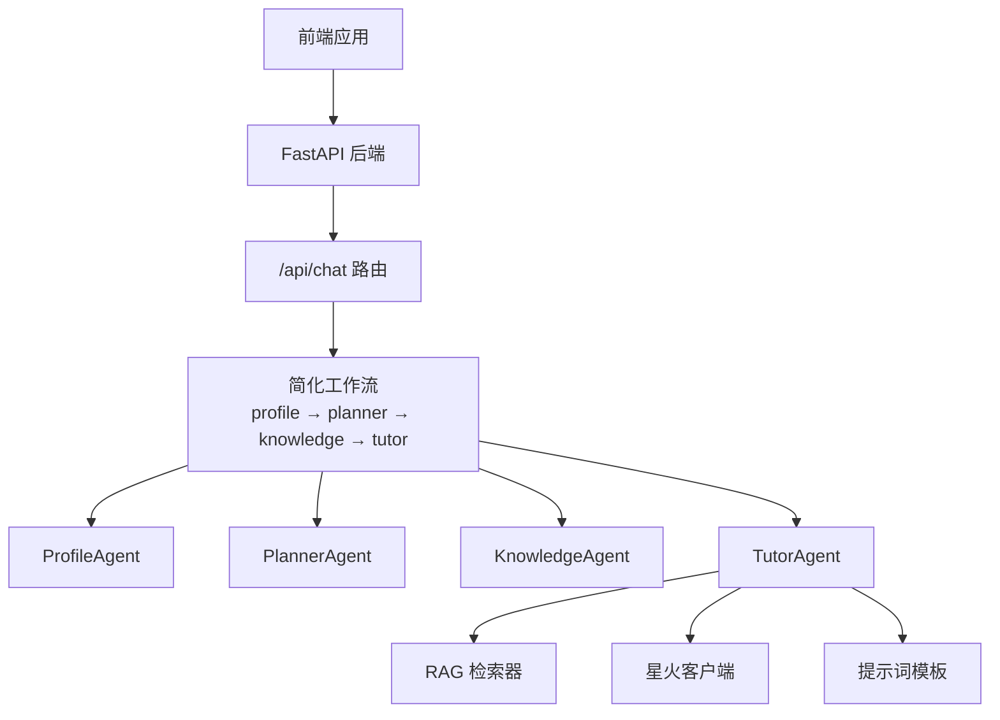
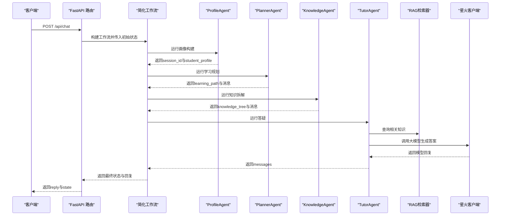
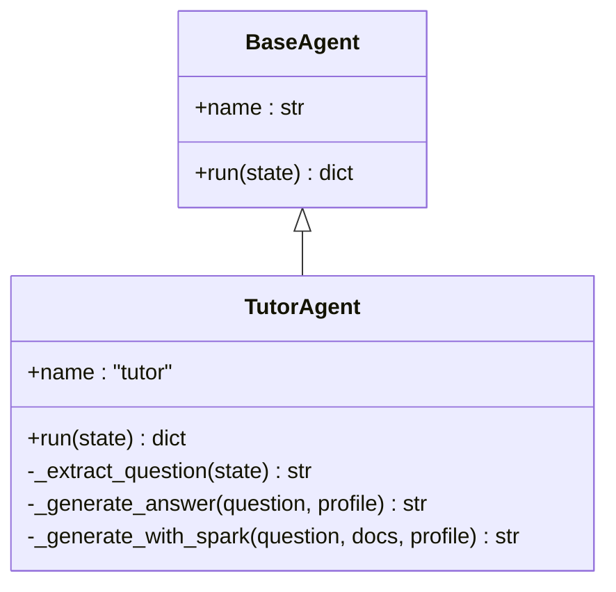
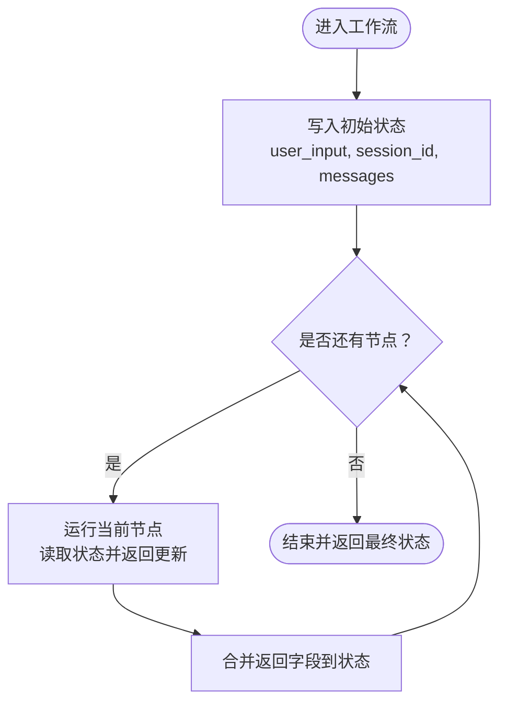
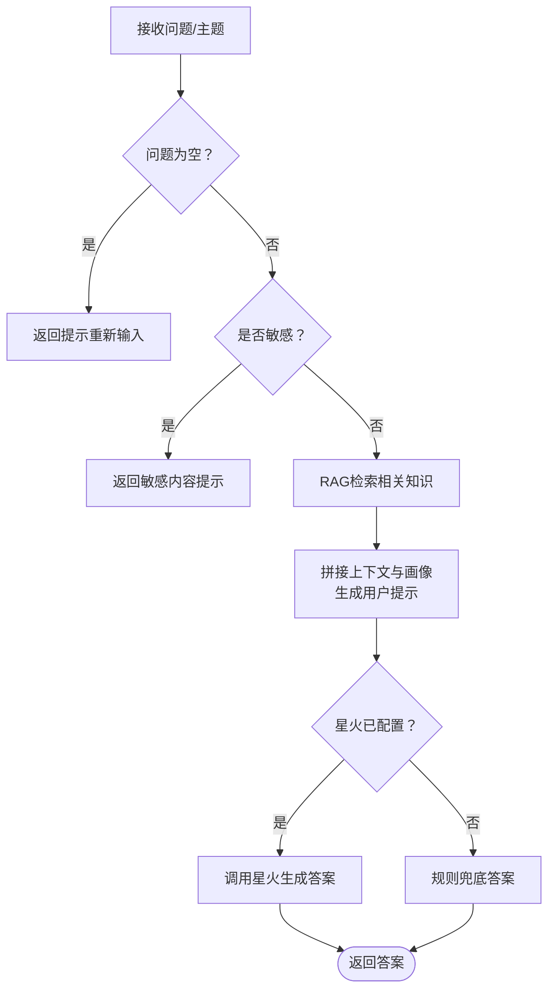
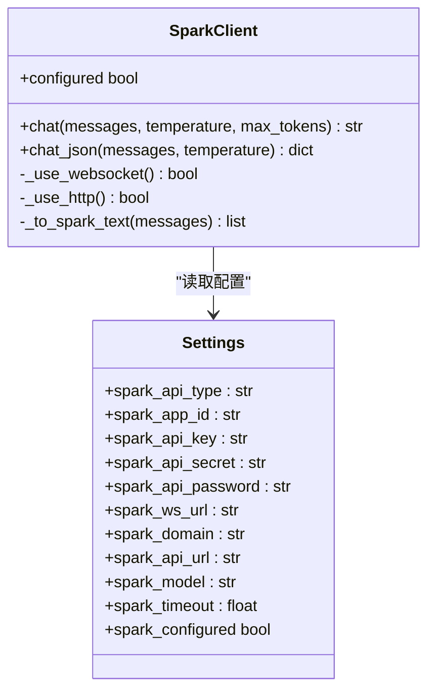
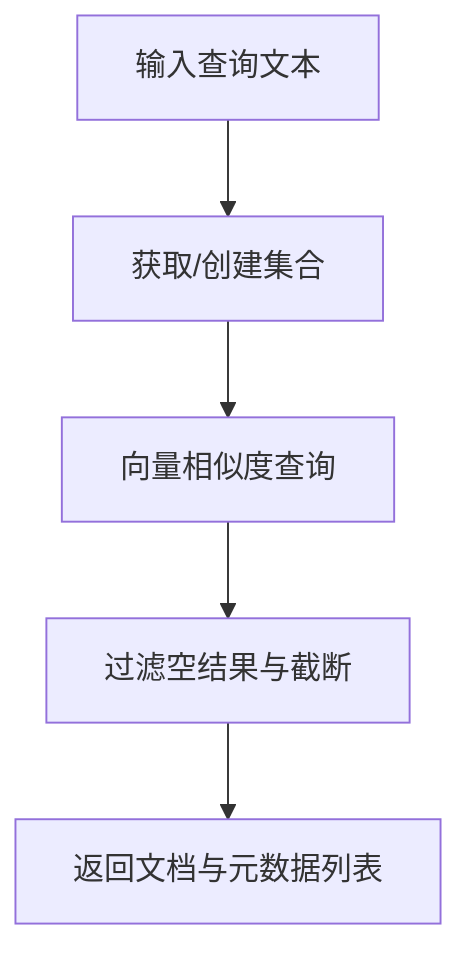
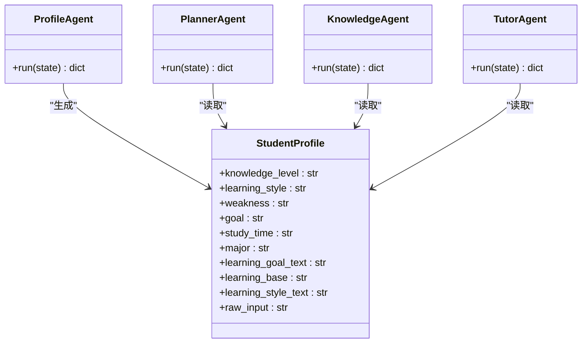
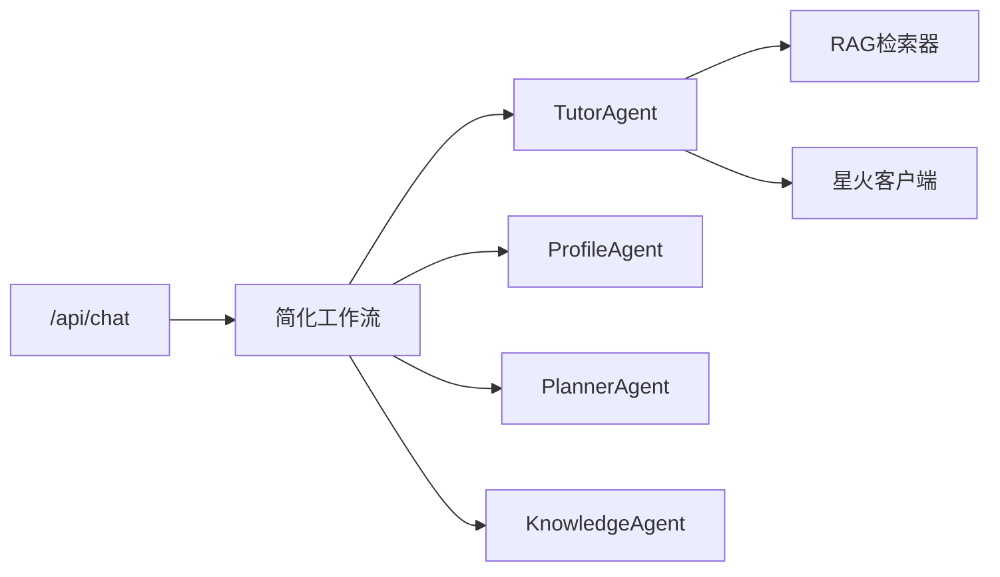

# 交互式智能体

<cite>
**本文引用的文件**
- [agents/tutor_agent.py](file://agents/tutor_agent.py)
- [prompts/tutor_agent.md](file://prompts/tutor_agent.md)
- [api/routes/chat.py](file://api/routes/chat.py)
- [backend/main.py](file://backend/main.py)
- [workflows/simple_graph.py](file://workflows/simple_graph.py)
- [workflows/state.py](file://workflows/state.py)
- [backend/integrations/spark/client.py](file://backend/integrations/spark/client.py)
- [rag/retriever.py](file://rag/retriever.py)
- [schemas/profile.py](file://schemas/profile.py)
- [backend/settings.py](file://backend/settings.py)
- [rag/vector_store.py](file://rag/vector_store.py)
- [agents/base.py](file://agents/base.py)
- [agents/profile_agent.py](file://agents/profile_agent.py)
- [agents/planner_agent.py](file://agents/planner_agent.py)
- [agents/knowledge_agent.py](file://agents/knowledge_agent.py)
</cite>

## 目录
1. [引言](#引言)
2. [项目结构](#项目结构)
3. [核心组件](#核心组件)
4. [架构总览](#架构总览)
5. [详细组件分析](#详细组件分析)
6. [依赖分析](#依赖分析)
7. [性能考虑](#性能考虑)
8. [故障排查指南](#故障排查指南)
9. [结论](#结论)
10. [附录](#附录)

## 引言
本技术文档聚焦于EduAgent的交互式智能体——答疑辅导智能体（TutorAgent）。文档系统性阐述其如何提供实时学习指导、处理复杂问题解答、支持多轮对话交互；深入解析其对话管理机制、上下文保持策略、个性化回答生成算法；说明智能体对学习者意图的理解、适切学习建议的生成、以及对模糊查询的处理策略；并给出交互式智能体的对话流程设计、情感分析集成、多语言支持配置的实现指南。

## 项目结构
EduAgent采用“后端API + 工作流编排 + 多智能体 + RAG + 大模型对接”的分层架构。前端通过REST API与后端交互，后端以FastAPI提供路由，工作流编排负责串联画像、规划、知识拆解与答疑四个Agent节点，TutorAgent位于链路末端，负责最终答疑输出。

图表来源
- [backend/main.py:46-70](file://backend/main.py#L46-L70)
- [api/routes/chat.py:23-37](file://api/routes/chat.py#L23-L37)
- [workflows/simple_graph.py:37-59](file://workflows/simple_graph.py#L37-L59)
- [agents/profile_agent.py:17-40](file://agents/profile_agent.py#L17-L40)
- [agents/planner_agent.py:161-181](file://agents/planner_agent.py#L161-L181)
- [agents/knowledge_agent.py:79-92](file://agents/knowledge_agent.py#L79-L92)
- [agents/tutor_agent.py:99-115](file://agents/tutor_agent.py#L99-L115)

章节来源
- [backend/main.py:1-70](file://backend/main.py#L1-L70)
- [api/routes/chat.py:1-37](file://api/routes/chat.py#L1-L37)
- [workflows/simple_graph.py:1-59](file://workflows/simple_graph.py#L1-L59)
- [workflows/state.py:1-24](file://workflows/state.py#L1-L24)

## 核心组件
- TutorAgent：基于RAG检索与星火大模型的答疑智能体，负责将学习者问题转化为清晰、可理解的答案，并结合学习者画像调整回答风格与深度。
- 工作流与状态：通过简化工作流串联Profile、Planner、Knowledge、Tutor四步，共享状态包含messages、session_id、student_profile等，确保多轮对话上下文连贯。
- 星火客户端：统一管理WebSocket与HTTP两种调用方式，支持温度、最大token等参数配置，具备错误处理与JSON解析能力。
- RAG检索：基于ChromaDB向量库与嵌入模型，提供课程知识检索，支撑个性化答疑。
- 学生画像：结构化数据模型，包含知识水平、学习风格、薄弱点、目标等，作为个性化回答与学习建议的重要依据。

章节来源
- [agents/tutor_agent.py:90-153](file://agents/tutor_agent.py#L90-L153)
- [workflows/simple_graph.py:37-59](file://workflows/simple_graph.py#L37-L59)
- [workflows/state.py:7-24](file://workflows/state.py#L7-L24)
- [backend/integrations/spark/client.py:19-198](file://backend/integrations/spark/client.py#L19-L198)
- [rag/retriever.py:12-24](file://rag/retriever.py#L12-L24)
- [schemas/profile.py:8-37](file://schemas/profile.py#L8-L37)

## 架构总览
下图展示从API入口到TutorAgent的完整调用链路，包括工作流编排、状态传递、RAG检索与大模型调用的关键节点。

图表来源
- [api/routes/chat.py:23-37](file://api/routes/chat.py#L23-L37)
- [workflows/simple_graph.py:37-59](file://workflows/simple_graph.py#L37-L59)
- [agents/profile_agent.py:17-40](file://agents/profile_agent.py#L17-L40)
- [agents/planner_agent.py:161-181](file://agents/planner_agent.py#L161-L181)
- [agents/knowledge_agent.py:79-92](file://agents/knowledge_agent.py#L79-L92)
- [agents/tutor_agent.py:99-153](file://agents/tutor_agent.py#L99-L153)
- [rag/retriever.py:18-23](file://rag/retriever.py#L18-L23)
- [backend/integrations/spark/client.py:141-162](file://backend/integrations/spark/client.py#L141-L162)

## 详细组件分析

### TutorAgent：答疑辅导智能体
TutorAgent是交互式智能体的核心节点，负责：
- 从共享状态中提取最新用户问题
- 安全性检查与规则兜底
- 结合RAG检索结果与学习者画像生成个性化回答
- 通过星火客户端调用大模型，回退至规则答案

图表来源
- [agents/base.py:7-13](file://agents/base.py#L7-L13)
- [agents/tutor_agent.py:90-153](file://agents/tutor_agent.py#L90-L153)

关键流程与策略
- 问题提取：优先从messages中取最近一条用户消息，否则回退到user_input。
- 安全检查：对敏感关键词进行阻断，保障内容安全。
- 规则兜底：当星火未配置或异常时，使用启发式规则生成常见问题答案。
- 个性化回答：结合RAG检索到的相关知识与学习者画像（知识水平）组织回答。
- 大模型调用：通过星火客户端发送system+user消息，获取模型回复。

章节来源
- [agents/tutor_agent.py:99-153](file://agents/tutor_agent.py#L99-L153)
- [prompts/tutor_agent.md:1-15](file://prompts/tutor_agent.md#L1-L15)

### 对话管理与上下文保持
- 初始状态：API路由将用户输入与可选session_id写入AgentState，同时追加一条用户消息。
- 多轮累积：AgentState中的messages以累加方式保存，后续节点可读取历史消息，形成上下文。
- 会话标识：session_id贯穿工作流，便于缓存与追踪。

图表来源
- [api/routes/chat.py:53-59](file://api/routes/chat.py#L53-L59)
- [workflows/state.py:7-24](file://workflows/state.py#L7-L24)
- [workflows/simple_graph.py:53-59](file://workflows/simple_graph.py#L53-L59)

章节来源
- [api/routes/chat.py:23-37](file://api/routes/chat.py#L23-L37)
- [workflows/state.py:7-24](file://workflows/state.py#L7-L24)
- [workflows/simple_graph.py:53-59](file://workflows/simple_graph.py#L53-L59)

### 个性化回答生成算法
- RAG检索：根据问题或主题检索相关知识片段，限制返回数量以提升相关性与效率。
- 上下文拼接：将检索到的知识摘要拼接到用户问题前，作为大模型的背景知识。
- 画像融合：从student_profile中读取知识水平，影响回答的深度与术语使用。
- 提示词约束：通过提示词模板限定输出风格（简洁、条理、适合学习者理解）与安全边界。

图表来源
- [agents/tutor_agent.py:104-131](file://agents/tutor_agent.py#L104-L131)
- [rag/retriever.py:18-23](file://rag/retriever.py#L18-L23)
- [prompts/tutor_agent.md:3-15](file://prompts/tutor_agent.md#L3-L15)

章节来源
- [agents/tutor_agent.py:123-153](file://agents/tutor_agent.py#L123-L153)
- [rag/retriever.py:12-24](file://rag/retriever.py#L12-L24)
- [prompts/tutor_agent.md:1-15](file://prompts/tutor_agent.md#L1-L15)

### 星火客户端与多模态集成
- 支持WebSocket与HTTP两种调用方式，自动选择可用通道。
- 统一消息格式转换，保证system/user/assistant角色顺序与合法性。
- 提供chat与chat_json两类接口，后者内置JSON抽取与校验。
- 配置项集中于Settings，支持超时、域名、模型等参数。

图表来源
- [backend/integrations/spark/client.py:19-198](file://backend/integrations/spark/client.py#L19-L198)
- [backend/settings.py:6-67](file://backend/settings.py#L6-L67)

章节来源
- [backend/integrations/spark/client.py:19-198](file://backend/integrations/spark/client.py#L19-L198)
- [backend/settings.py:17-49](file://backend/settings.py#L17-L49)

### RAG检索与向量存储
- 向量库：ChromaDB持久化客户端，按集合名与嵌入函数创建/获取集合。
- 检索：query_collection按查询文本检索top-k条记录，返回文档与元数据。
- 缓存：通过LRU缓存获取Chroma客户端，减少重复初始化开销。

图表来源
- [rag/vector_store.py:24-65](file://rag/vector_store.py#L24-L65)
- [rag/retriever.py:18-23](file://rag/retriever.py#L18-L23)

章节来源
- [rag/vector_store.py:16-65](file://rag/vector_store.py#L16-L65)
- [rag/retriever.py:12-24](file://rag/retriever.py#L12-L24)

### 学生画像与个性化建议
- 数据模型：StudentProfile包含知识水平、学习风格、薄弱点、目标、学习时长等字段。
- 来源：ProfileAgent结合星火分析与数据库/缓存生成画像，并汇总简要摘要。
- 使用：PlannerAgent与KnowledgeAgent在生成学习路径与知识树时读取画像；TutorAgent在答疑时依据知识水平调整回答。

图表来源
- [schemas/profile.py:8-37](file://schemas/profile.py#L8-L37)
- [agents/profile_agent.py:17-40](file://agents/profile_agent.py#L17-L40)
- [agents/planner_agent.py:161-181](file://agents/planner_agent.py#L161-L181)
- [agents/knowledge_agent.py:79-92](file://agents/knowledge_agent.py#L79-L92)
- [agents/tutor_agent.py:99-115](file://agents/tutor_agent.py#L99-L115)

章节来源
- [schemas/profile.py:8-37](file://schemas/profile.py#L8-L37)
- [agents/profile_agent.py:17-40](file://agents/profile_agent.py#L17-L40)
- [agents/planner_agent.py:161-181](file://agents/planner_agent.py#L161-L181)
- [agents/knowledge_agent.py:79-92](file://agents/knowledge_agent.py#L79-L92)
- [agents/tutor_agent.py:99-115](file://agents/tutor_agent.py#L99-L115)

## 依赖分析
- 组件耦合
  - TutorAgent依赖RAG检索器与星火客户端，耦合度适中，便于替换与扩展。
  - 工作流通过共享状态连接各Agent，降低节点间直接依赖。
- 外部依赖
  - 星火大模型：通过WebSocket或HTTP访问，需正确配置密钥与域名。
  - ChromaDB：持久化向量库，需确保目录权限与磁盘空间。
- 循环依赖
  - 未发现直接循环导入；Agent均通过工厂函数获取外部依赖。

图表来源
- [agents/tutor_agent.py:95-98](file://agents/tutor_agent.py#L95-L98)
- [workflows/simple_graph.py:37-59](file://workflows/simple_graph.py#L37-L59)
- [api/routes/chat.py:23-37](file://api/routes/chat.py#L23-L37)

章节来源
- [agents/tutor_agent.py:90-153](file://agents/tutor_agent.py#L90-L153)
- [workflows/simple_graph.py:37-59](file://workflows/simple_graph.py#L37-L59)
- [api/routes/chat.py:23-37](file://api/routes/chat.py#L23-L37)

## 性能考虑
- RAG检索优化
  - 控制返回k值与分块大小，平衡召回率与响应速度。
  - 在无知识库或空集合时快速返回空结果，避免无效查询。
- 大模型调用
  - 优先使用WebSocket以获得更低延迟与更稳定的流式输出。
  - 合理设置temperature与max_tokens，兼顾创造性与稳定性。
- 缓存与复用
  - 星火客户端与Chroma客户端采用LRU缓存，减少重复初始化成本。
- 并发与超时
  - 星火客户端与HTTP客户端均设置超时，避免阻塞等待。

## 故障排查指南
- 星火未配置或配置不完整
  - 现象：调用chat时报错，提示未配置或配置不完整。
  - 排查：检查Settings中SPARK_*相关字段是否齐全，确认API类型与域名。
  - 参考
    - [backend/integrations/spark/client.py:148-162](file://backend/integrations/spark/client.py#L148-L162)
    - [backend/settings.py:57-61](file://backend/settings.py#L57-L61)
- RAG检索失败
  - 现象：检索返回空列表或警告日志。
  - 排查：确认知识库目录存在且有数据；检查嵌入模型与集合名配置。
  - 参考
    - [rag/vector_store.py:49-51](file://rag/vector_store.py#L49-L51)
    - [rag/retriever.py:21-23](file://rag/retriever.py#L21-L23)
- 敏感内容拦截
  - 现象：直接返回敏感内容提示。
  - 排查：检查BLOCKED_KEYWORDS与is_safe_question逻辑。
  - 参考
    - [agents/tutor_agent.py:107-109](file://agents/tutor_agent.py#L107-L109)
    - [agents/tutor_agent.py:35-42](file://agents/tutor_agent.py#L35-L42)
- 多轮对话上下文丢失
  - 现象：回答缺乏上下文或重复提问。
  - 排查：确认messages是否正确累加，session_id是否传递。
  - 参考
    - [workflows/state.py:22](file://workflows/state.py#L22)
    - [api/routes/chat.py:53-59](file://api/routes/chat.py#L53-L59)

章节来源
- [backend/integrations/spark/client.py:148-162](file://backend/integrations/spark/client.py#L148-L162)
- [backend/settings.py:57-61](file://backend/settings.py#L57-L61)
- [rag/vector_store.py:49-51](file://rag/vector_store.py#L49-L51)
- [rag/retriever.py:21-23](file://rag/retriever.py#L21-L23)
- [agents/tutor_agent.py:107-109](file://agents/tutor_agent.py#L107-L109)
- [workflows/state.py:22](file://workflows/state.py#L22)
- [api/routes/chat.py:53-59](file://api/routes/chat.py#L53-L59)

## 结论
TutorAgent通过“工作流编排 + RAG检索 + 星火大模型 + 学生画像”的组合，实现了面向学习者的实时答疑与个性化指导。其对话管理机制以共享状态为核心，确保多轮交互的上下文连贯；安全性与规则兜底保障了鲁棒性；提示词与画像融合提升了回答的适切性。未来可在情感分析、多语言支持、会话记忆增强等方面进一步扩展。

## 附录

### 对话流程设计指南
- 输入规范
  - 用户输入需非空，工作流入口会进行校验并提示重试。
- 上下文管理
  - 通过messages累加历史消息，必要时可裁剪早期消息以控制长度。
- 输出格式
  - TutorAgent返回messages列表，API路由将其拼接为字符串作为reply。

章节来源
- [agents/tutor_agent.py:104-106](file://agents/tutor_agent.py#L104-L106)
- [api/routes/chat.py:29-36](file://api/routes/chat.py#L29-L36)

### 情感分析集成建议
- 方案
  - 在ProfileAgent或PlannerAgent阶段引入情感检测（如基于文本的积极/消极/中性分类），作为学习动机与压力的辅助指标。
  - 将情感标签写入student_profile，TutorAgent在生成回答时可选择更温和或更具激励性的语言风格。
- 注意
  - 需要额外的NLP服务或本地模型，注意隐私与性能开销。

### 多语言支持配置指南
- 当前现状
  - 星火客户端与提示词模板均为中文；RAG向量库使用中文嵌入模型。
- 实施步骤
  - 语言检测：在ProfileAgent中增加语言识别，决定后续处理分支。
  - 多语言提示词：维护多语言版本的提示词模板，并按语言切换。
  - 多语言RAG：准备多语言知识库与对应嵌入模型，按语言选择检索集合。
  - 大模型选择：根据目标语言选择合适的多语言模型或翻译中间层。
- 配置参考
  - 星火配置项：见Settings中SPARK_*字段。
  - RAG配置项：见Settings中knowledge_dir、chroma_*、embedding_model等。

章节来源
- [backend/integrations/spark/client.py:19-198](file://backend/integrations/spark/client.py#L19-L198)
- [backend/settings.py:41-49](file://backend/settings.py#L41-L49)
- [prompts/tutor_agent.md:1-15](file://prompts/tutor_agent.md#L1-L15)