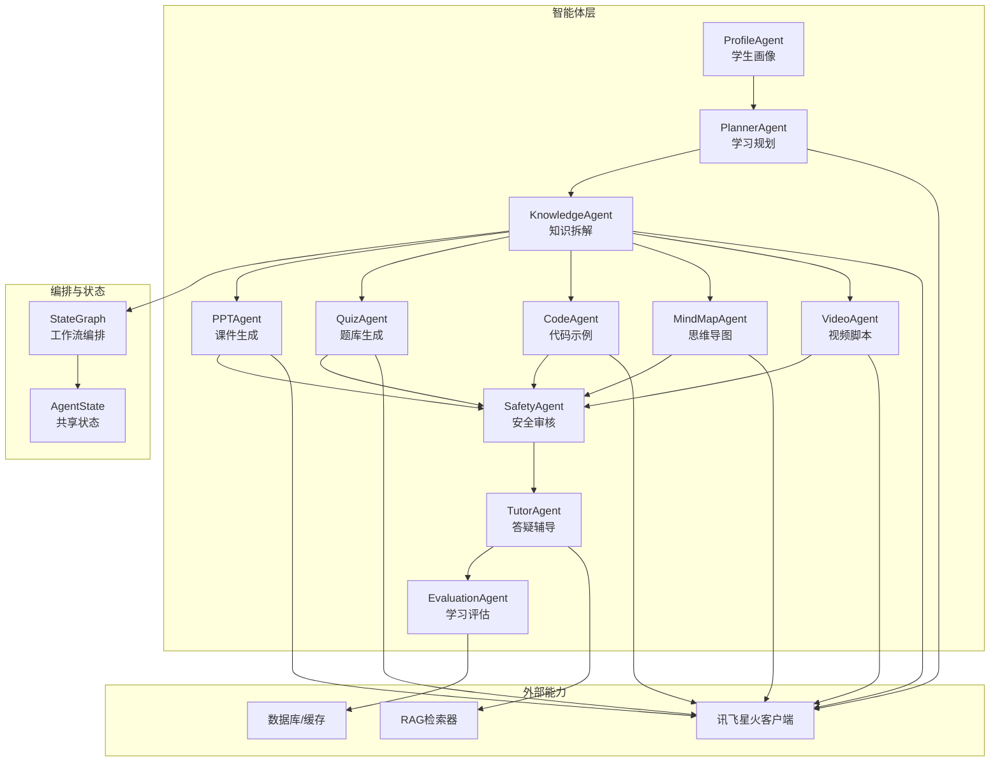
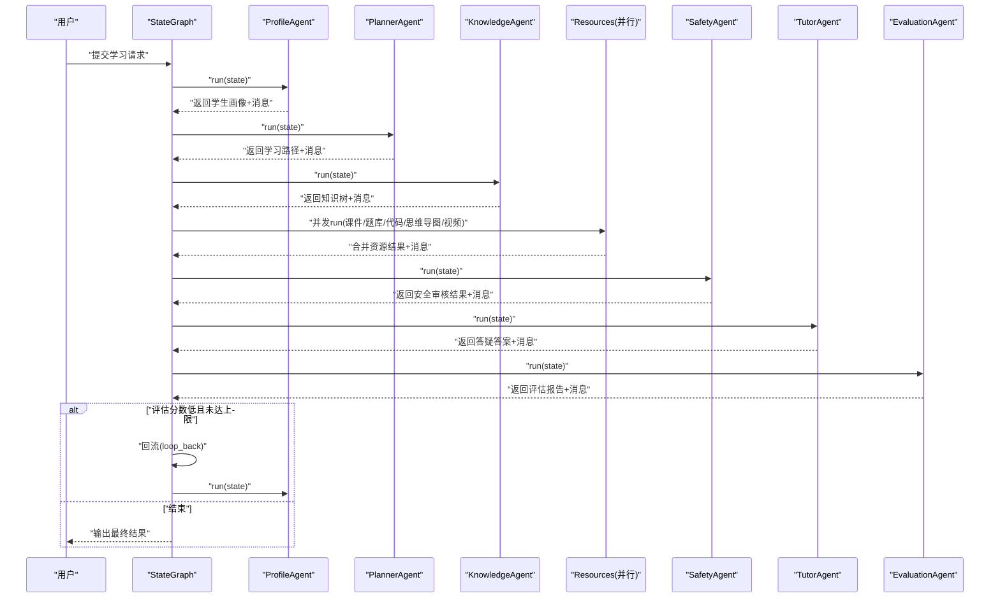
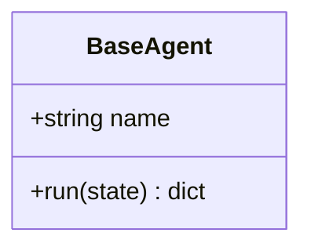
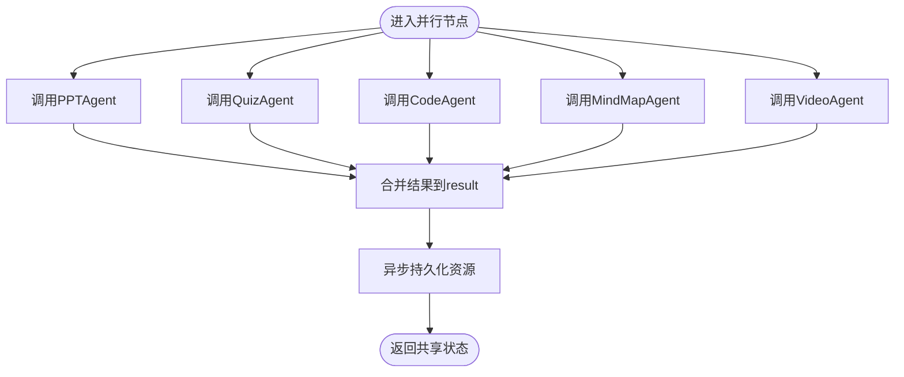
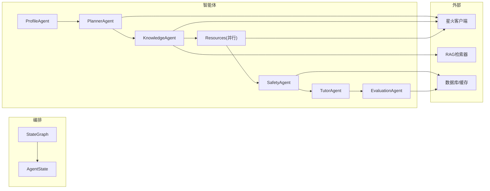

# 多智能体系统

<cite>
**本文引用的文件**
- [agents/base.py](file://agents/base.py)
- [agents/__init__.py](file://agents/__init__.py)
- [workflows/state.py](file://workflows/state.py)
- [workflows/graph.py](file://workflows/graph.py)
- [workflows/__init__.py](file://workflows/__init__.py)
- [agents/profile_agent.py](file://agents/profile_agent.py)
- [agents/planner_agent.py](file://agents/planner_agent.py)
- [agents/knowledge_agent.py](file://agents/knowledge_agent.py)
- [agents/ppt_agent.py](file://agents/ppt_agent.py)
- [agents/quiz_agent.py](file://agents/quiz_agent.py)
- [agents/code_agent.py](file://agents/code_agent.py)
- [agents/mindmap_agent.py](file://agents/mindmap_agent.py)
- [agents/video_agent.py](file://agents/video_agent.py)
- [agents/safety_agent.py](file://agents/safety_agent.py)
- [agents/tutor_agent.py](file://agents/tutor_agent.py)
</cite>

## 目录
1. [引言](#引言)
2. [项目结构](#项目结构)
3. [核心组件](#核心组件)
4. [架构总览](#架构总览)
5. [详细组件分析](#详细组件分析)
6. [依赖分析](#依赖分析)
7. [性能考虑](#性能考虑)
8. [故障排查指南](#故障排查指南)
9. [结论](#结论)
10. [附录](#附录)

## 引言
本技术文档围绕EduAgent的多智能体系统展开，系统以LangGraph为编排引擎，通过11个智能体协同工作，覆盖“学生画像→学习规划→知识拆解→并行资源生成→安全审核→答疑辅导→评估闭环”的完整学习流程。文档深入解释BaseAgent抽象基类的设计模式、智能体间的状态流转与通信协议、状态管理机制，并对核心智能体（学生画像、学习规划、知识拆解、资源生成、答疑辅导、安全审核、学习评估等）的实现原理进行剖析。同时提供扩展指南与自定义Agent开发最佳实践，帮助读者在复杂学习场景中高效落地。

## 项目结构
EduAgent采用“按功能域划分”的模块组织方式，核心目录如下：
- agents：11个智能体实现与统一抽象基类
- workflows：LangGraph工作流编排、共享状态定义
- backend：后端服务、集成客户端（如讯飞星火）
- rag：RAG检索与向量存储
- services：业务服务（如画像服务）
- database：数据库会话与仓库
- api/routes：HTTP接口路由
- schemas：数据模型（学习路径、题库、代码示例等）
- prompts：各Agent提示词模板
- frontend：前端界面（聊天、测评、个性化学习、资源生成、语音学习）

图表来源
- [workflows/graph.py:186-211](file://workflows/graph.py#L186-L211)
- [workflows/state.py:7-24](file://workflows/state.py#L7-L24)
- [agents/__init__.py:16-29](file://agents/__init__.py#L16-L29)

章节来源
- [workflows/graph.py:186-211](file://workflows/graph.py#L186-L211)
- [workflows/state.py:7-24](file://workflows/state.py#L7-L24)
- [agents/__init__.py:1-30](file://agents/__init__.py#L1-L30)

## 核心组件
本节聚焦于多智能体系统的核心基础设施与通用抽象。

- BaseAgent抽象基类
  - 设计模式：面向接口编程，约束所有智能体实现run方法，统一异步执行与状态合并返回。
  - 关键点：name标识、run(state) -> dict[str, Any]，返回需合并入共享状态的片段。
  - 价值：保证编排一致性、便于扩展与替换。

- LangGraph工作流与状态
  - StateGraph：定义节点、边与条件分支，形成“画像→规划→知识→并行资源→安全→答疑→评估→（可回流）→结束”的闭环。
  - AgentState：TypedDict定义共享状态键，包括学生画像、学习路径、知识树、各类资源、评估报告、消息历史、会话ID、用户输入等；支持消息拼接聚合。
  - 节点函数：每个Agent封装为异步节点函数，负责run并返回状态片段；并行资源节点并发调用多个Agent并汇总结果。
  - 回流机制：评估分数低于阈值且循环次数未达上限时，注入评估建议并回流至画像节点重新生成。

- 通信协议与状态管理
  - 协议：所有Agent仅通过共享状态读写，不直接互相调用；节点函数返回字典，由编排器合并到共享状态。
  - 状态管理：消息列表使用operator.add聚合；资源持久化在对应节点完成后异步落库；评估报告与回流建议独立键位管理。

章节来源
- [agents/base.py:7-13](file://agents/base.py#L7-L13)
- [workflows/graph.py:39-98](file://workflows/graph.py#L39-L98)
- [workflows/graph.py:136-183](file://workflows/graph.py#L136-L183)
- [workflows/state.py:7-24](file://workflows/state.py#L7-L24)

## 架构总览
EduAgent采用“流水线+并行+回流”的编排策略：
- 串行阶段：学生画像 → 学习规划 → 知识拆解
- 并行阶段：课件、题库、代码、思维导图、视频脚本五类资源并行生成
- 安全审核：对并行生成的资源进行统一安全审查
- 答疑辅导：基于RAG检索与星火问答，回答学生问题
- 评估闭环：生成评估报告，依据分数与循环次数决定是否回流

图表来源
- [workflows/graph.py:186-211](file://workflows/graph.py#L186-L211)
- [workflows/graph.py:136-183](file://workflows/graph.py#L136-L183)

## 详细组件分析

### BaseAgent 抽象基类
- 角色定位：所有智能体的共同父类，统一接口与生命周期。
- 设计要点：run方法接收共享状态字典，返回需合并回状态的片段；name用于日志与追踪。
- 扩展建议：新增Agent只需继承BaseAgent并实现run，即可无缝接入编排。

图表来源
- [agents/base.py:7-13](file://agents/base.py#L7-L13)

章节来源
- [agents/base.py:7-13](file://agents/base.py#L7-L13)

### 学生画像 Agent（ProfileAgent）
- 职责：基于用户输入构建学生画像，包含专业、水平、风格、目标、薄弱点、学习时长等；生成会话ID并记录来源。
- 数据来源：ProfileService（结合Redis缓存与数据库）。
- 输出：student_profile、session_id、消息摘要。
- 价值：为后续规划与内容生成提供个性化依据。

章节来源
- [agents/profile_agent.py:12-40](file://agents/profile_agent.py#L12-L40)

### 学习规划 Agent（PlannerAgent）
- 职责：根据学生画像生成个性化学习路径（含周数、阶段、资源、评估）。
- 生成策略：优先使用星火生成；失败时回退规则策略（heuristic_path）。
- 输出：learning_path、消息（含路径摘要与Markdown）。
- 价值：将抽象学习目标转化为可执行计划。

章节来源
- [agents/planner_agent.py:153-209](file://agents/planner_agent.py#L153-L209)

### 知识拆解 Agent（KnowledgeAgent）
- 职责：根据主题（来自学习路径或用户输入）生成结构化知识树。
- 生成策略：RAG检索+星火生成；失败回退规则策略（heuristic_knowledge_tree）。
- 输出：knowledge_tree、消息（含知识树Markdown）。
- 价值：为资源生成提供结构化知识骨架。

章节来源
- [agents/knowledge_agent.py:70-140](file://agents/knowledge_agent.py#L70-L140)

### 资源生成系列（并行节点）
并行节点“resources”并发调用以下Agent，汇总结果并持久化：
- PPT课件（PPTAgent）：生成Markdown课件结构，支持规则兜底。
- 练习题库（QuizAgent）：生成多种题型，支持规则兜底。
- 代码示例（CodeAgent）：生成可运行示例与解析，支持规则兜底。
- 思维导图（MindMapAgent）：生成可渲染的思维导图结构，支持规则兜底。
- 视频脚本（VideoAgent）：生成教学视频脚本，支持规则兜底。

图表来源
- [workflows/graph.py:73-98](file://workflows/graph.py#L73-L98)

章节来源
- [agents/ppt_agent.py:107-165](file://agents/ppt_agent.py#L107-L165)
- [agents/quiz_agent.py:193-250](file://agents/quiz_agent.py#L193-L250)
- [agents/code_agent.py:208-263](file://agents/code_agent.py#L208-L263)
- [agents/mindmap_agent.py:236-290](file://agents/mindmap_agent.py#L236-L290)
- [agents/video_agent.py:273-326](file://agents/video_agent.py#L273-L326)
- [workflows/graph.py:73-98](file://workflows/graph.py#L73-L98)

### 安全审核 Agent（SafetyAgent）
- 职责：对并行生成的各类资源进行安全审核，识别敏感关键词与可疑代码模式。
- 审核范围：PPT（逐页内容）、题库（题目与答案）、代码（示例）、思维导图根节点、视频脚本（逐幕内容）。
- 输出：resource_result（包含每项审核结果、是否全部通过、审核人等），消息汇总问题清单。
- 价值：保障生成内容合规，防止风险扩散。

章节来源
- [agents/safety_agent.py:111-158](file://agents/safety_agent.py#L111-L158)

### 答疑辅导 Agent（TutorAgent）
- 职责：结合RAG检索与星火问答回答学生问题，支持安全过滤与规则兜底。
- 生成策略：RAG检索+星火问答；失败回退规则策略（heuristic_answer）。
- 输出：messages（包含答案文本）。
- 价值：提供即时、个性化的学习支持。

章节来源
- [agents/tutor_agent.py:90-153](file://agents/tutor_agent.py#L90-L153)

### 学习评估 Agent（EvaluationAgent）
- 职责：对学习过程与结果进行评估，生成评估报告与建议。
- 评估逻辑：在工作流中由条件边触发；若分数低于阈值且循环次数未达上限，则回流至画像节点。
- 输出：evaluation_report、evaluation_suggestions（注入到共享状态供回流使用）。
- 价值：形成“评估→回流→再规划”的闭环，持续优化学习路径。

章节来源
- [workflows/graph.py:125-133](file://workflows/graph.py#L125-L133)
- [workflows/graph.py:136-154](file://workflows/graph.py#L136-L154)

## 依赖分析
- 组件耦合
  - 智能体与编排：强依赖共享状态；彼此无直接调用，降低耦合。
  - 外部能力：多数Agent依赖星火客户端与RAG检索器；ProfileAgent依赖画像服务与缓存。
  - 数据持久化：资源与评估报告通过数据库仓库异步持久化，避免阻塞主流程。
- 条件路由与回流
  - 评估节点通过条件边决定“loop”或“end”，回流节点更新loop_count与注入评估建议，形成闭环。
- 并发与容错
  - 并行资源节点使用异步并发调用，提升吞吐；各Agent均具备失败回退策略，增强鲁棒性。

图表来源
- [workflows/graph.py:186-211](file://workflows/graph.py#L186-L211)
- [workflows/state.py:7-24](file://workflows/state.py#L7-L24)

章节来源
- [workflows/graph.py:186-211](file://workflows/graph.py#L186-L211)
- [workflows/state.py:7-24](file://workflows/state.py#L7-L24)

## 性能考虑
- 并行化：并行资源节点显著缩短整体时延，建议在资源生成阶段充分利用并发。
- 异步I/O：数据库与外部API调用均采用异步，避免阻塞事件循环。
- 缓存与兜底：星火未配置或失败时使用规则策略，减少端到端等待时间。
- 日志与可观测性：关键节点记录日志，便于定位瓶颈与异常。
- 扩展性：新增Agent仅需实现run并注册到编排，不影响既有链路。

## 故障排查指南
- 星火不可用或报错
  - 现象：对应Agent回退规则策略，日志出现警告。
  - 排查：检查星火配置、网络连通性；确认提示词文件存在。
- RAG检索失败
  - 现象：知识拆解与答疑回退规则策略。
  - 排查：确认向量库可用、检索参数合理、知识入库成功。
- 安全审核拦截
  - 现象：安全审核报告包含问题项。
  - 排查：检查敏感词库与可疑代码模式匹配，修正生成内容。
- 评估分数偏低且频繁回流
  - 现象：多次回流至画像节点。
  - 排查：调整阈值与最大循环次数；优化学习路径与资源质量。

章节来源
- [agents/planner_agent.py:183-190](file://agents/planner_agent.py#L183-L190)
- [agents/knowledge_agent.py:109-118](file://agents/knowledge_agent.py#L109-L118)
- [agents/tutor_agent.py:123-131](file://agents/tutor_agent.py#L123-L131)
- [agents/safety_agent.py:59-108](file://agents/safety_agent.py#L59-L108)
- [workflows/graph.py:136-154](file://workflows/graph.py#L136-L154)

## 结论
EduAgent通过清晰的抽象与编排，实现了从学生画像到学习评估的全链路自动化与个性化。BaseAgent统一了接口，LangGraph提供了稳定的协作机制，各Agent在保证安全与质量的前提下高效生成多样化学习资源，并通过评估回流持续优化。该架构易于扩展与演进，适合在复杂学习场景中规模化落地。

## 附录

### 自定义Agent开发最佳实践
- 继承BaseAgent并实现run：遵循“只读共享状态→生成片段→合并回状态”的模式。
- 使用提示词模板：将Prompt集中管理，便于迭代与复用。
- 实现失败回退：提供规则策略兜底，确保系统可用性。
- 注入消息：通过messages向对话历史追加摘要或Markdown，提升用户体验。
- 并行友好：避免阻塞操作，必要时使用异步I/O与并发调用。
- 安全前置：在生成阶段内置安全检查，降低下游审核压力。
- 可观测性：在关键节点记录日志，便于监控与排障。

### 扩展指南
- 新增Agent：在agents目录添加实现，导入到agents/__init__.py并加入编排节点。
- 新增工作流：在workflows/graph.py中注册节点与边，必要时扩展AgentState键位。
- 新增提示词：在prompts目录添加对应模板文件，Agent中加载使用。
- 新增数据模型：在schemas目录定义，Agent中使用Pydantic校验与序列化。
- 新增外部能力：在backend/integrations中封装客户端，Agent中注入使用。