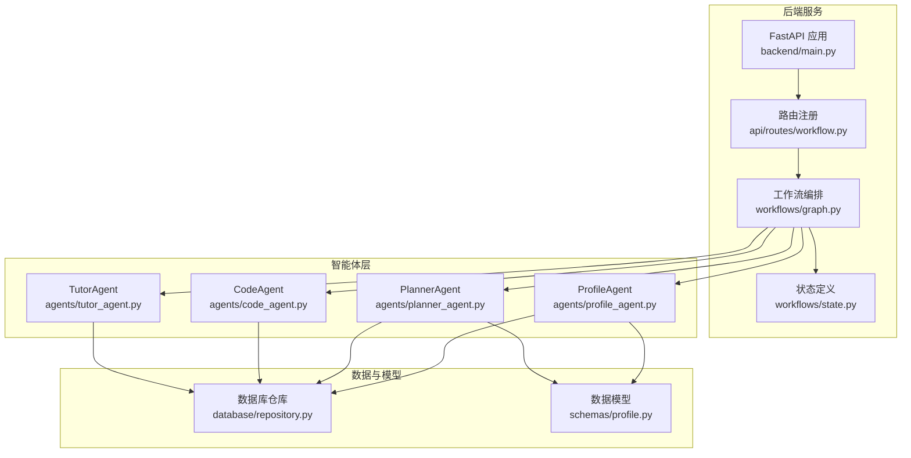
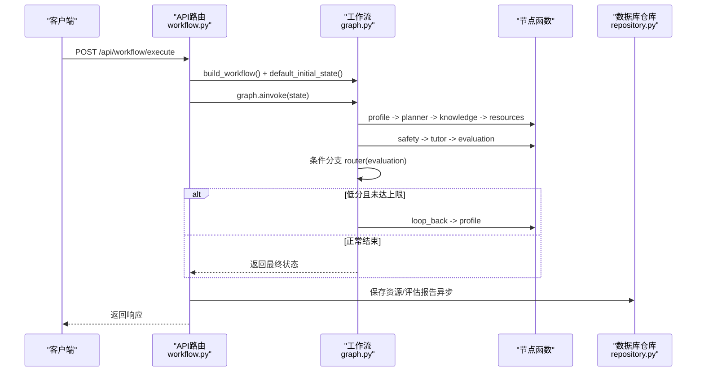
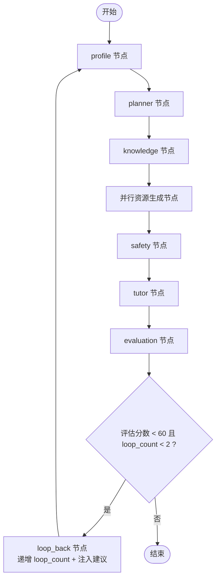
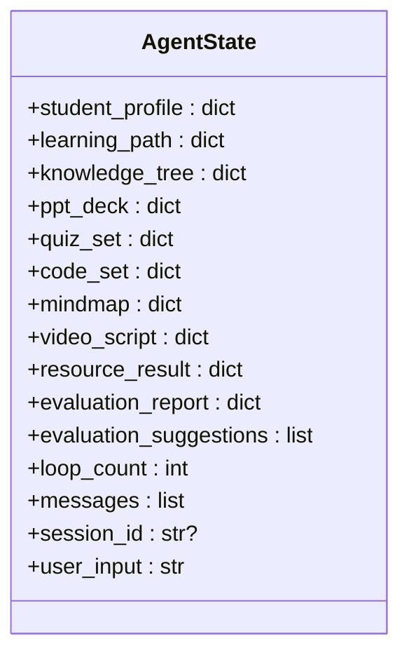
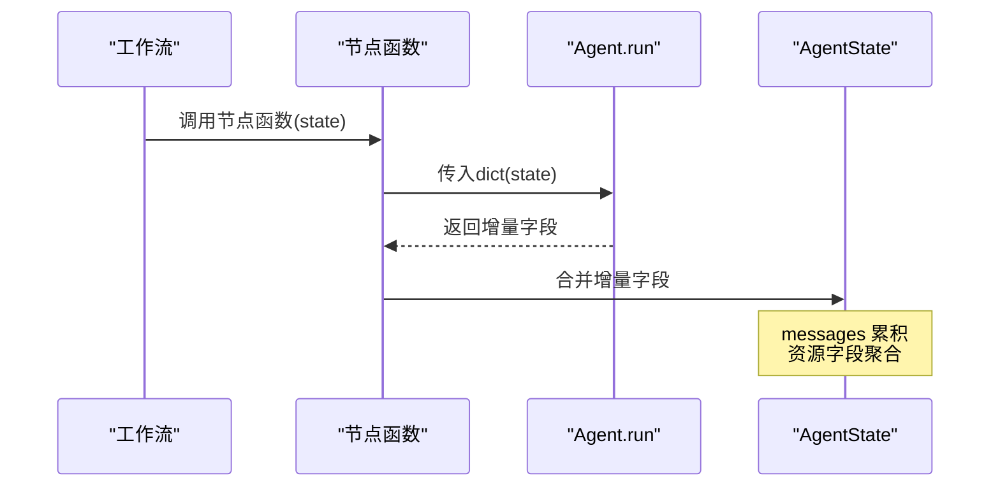
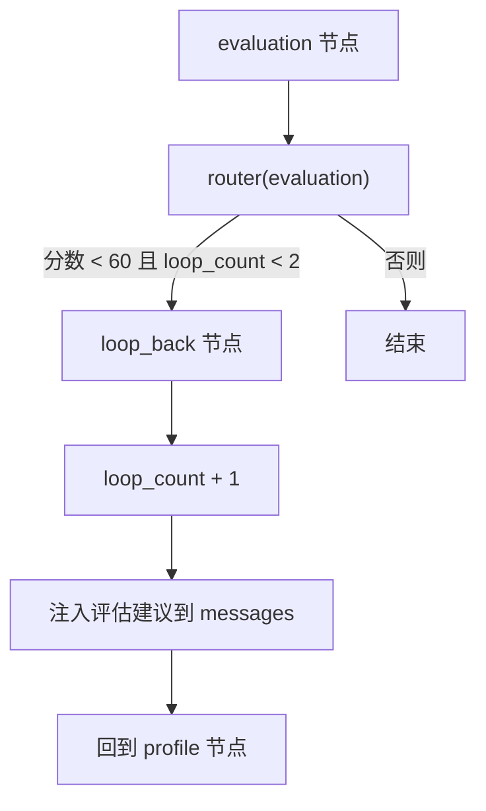
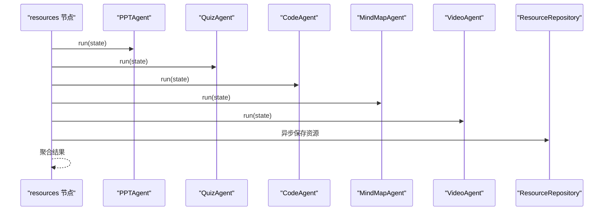
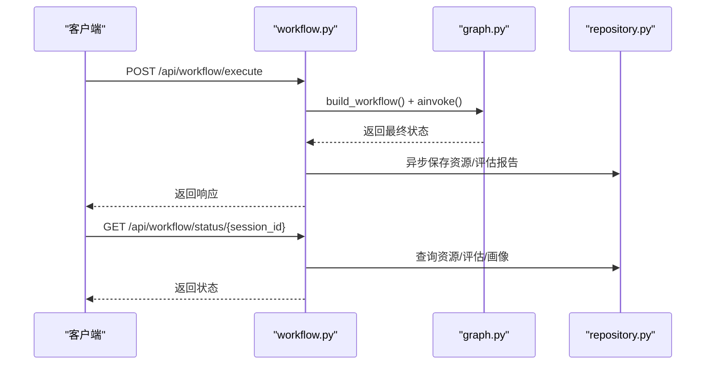
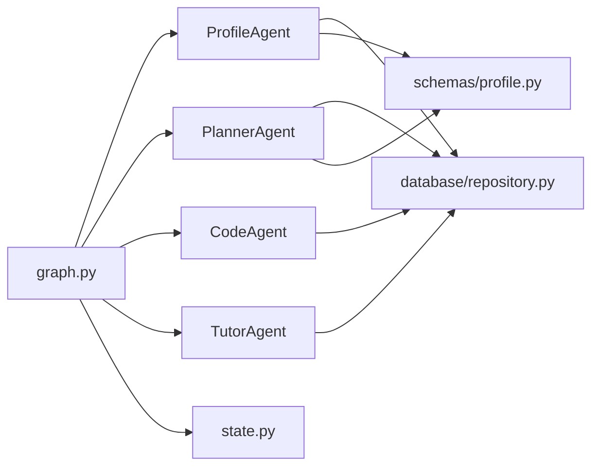

# 智能体协作与工作流

<cite>
**本文引用的文件**
- [workflows/graph.py](file://workflows/graph.py)
- [workflows/state.py](file://workflows/state.py)
- [workflows/simple_graph.py](file://workflows/simple_graph.py)
- [agents/base.py](file://agents/base.py)
- [agents/profile_agent.py](file://agents/profile_agent.py)
- [agents/planner_agent.py](file://agents/planner_agent.py)
- [agents/code_agent.py](file://agents/code_agent.py)
- [agents/tutor_agent.py](file://agents/tutor_agent.py)
- [api/routes/workflow.py](file://api/routes/workflow.py)
- [backend/main.py](file://backend/main.py)
- [database/repository.py](file://database/repository.py)
- [schemas/profile.py](file://schemas/profile.py)
- [scripts/test_workflow_simple.py](file://scripts/test_workflow_simple.py)
- [scripts/smoke_workflow.py](file://scripts/smoke_workflow.py)
</cite>

## 目录
1. [简介](#简介)
2. [项目结构](#项目结构)
3. [核心组件](#核心组件)
4. [架构总览](#架构总览)
5. [详细组件分析](#详细组件分析)
6. [依赖关系分析](#依赖关系分析)
7. [性能考量](#性能考量)
8. [故障排查指南](#故障排查指南)
9. [结论](#结论)
10. [附录](#附录)

## 简介
本技术文档聚焦于EduAgent的智能体协作与工作流系统，围绕LangGraph工作流编排机制、智能体间通信协议、状态传递规则展开，系统性阐述：
- 工作流图的构建方法与节点调度策略
- 条件分支与回流机制（循环优化）
- 共享状态设计模式与数据流转
- 错误恢复策略与持久化
- 调试技巧、性能监控与动态调整工作流的实现指南
- 简单工作流与复杂工作流的使用场景与最佳实践

## 项目结构
EduAgent采用“分层+按职责划分”的组织方式：
- workflows：工作流编排与状态定义
- agents：各智能体实现（抽象基类与具体Agent）
- api/routes：对外接口（FastAPI路由）
- backend：应用入口与生命周期管理
- database：数据库访问与持久化
- schemas：数据模型（画像、学习路径、资源等）
- scripts：工作流测试与冒烟测试脚本

图表来源
- [backend/main.py:46-70](file://backend/main.py#L46-L70)
- [api/routes/workflow.py:17-19](file://api/routes/workflow.py#L17-L19)
- [workflows/graph.py:186-211](file://workflows/graph.py#L186-L211)
- [workflows/state.py:7-24](file://workflows/state.py#L7-L24)
- [agents/profile_agent.py:12-40](file://agents/profile_agent.py#L12-L40)
- [agents/planner_agent.py:153-181](file://agents/planner_agent.py#L153-L181)
- [agents/code_agent.py:208-229](file://agents/code_agent.py#L208-L229)
- [agents/tutor_agent.py:90-114](file://agents/tutor_agent.py#L90-L114)
- [database/repository.py:46-117](file://database/repository.py#L46-L117)
- [schemas/profile.py:8-36](file://schemas/profile.py#L8-L36)

章节来源
- [backend/main.py:46-70](file://backend/main.py#L46-L70)
- [api/routes/workflow.py:17-19](file://api/routes/workflow.py#L17-L19)
- [workflows/graph.py:186-211](file://workflows/graph.py#L186-L211)
- [workflows/state.py:7-24](file://workflows/state.py#L7-L24)

## 核心组件
- LangGraph工作流编排：通过StateGraph定义节点、边与条件分支，支持同步与异步节点组合。
- 共享状态AgentState：TypedDict定义的统一状态结构，包含消息队列、资源、评估报告、循环计数等。
- 智能体基类BaseAgent：统一run接口，接收共享状态并返回增量更新。
- API路由：暴露工作流执行与状态查询接口，负责会话ID生成与结果聚合。
- 数据持久化：Profile/资源/评估报告的入库与查询。

章节来源
- [workflows/graph.py:186-211](file://workflows/graph.py#L186-L211)
- [workflows/state.py:7-24](file://workflows/state.py#L7-L24)
- [agents/base.py:7-13](file://agents/base.py#L7-L13)
- [api/routes/workflow.py:54-79](file://api/routes/workflow.py#L54-L79)
- [database/repository.py:46-117](file://database/repository.py#L46-L117)

## 架构总览
整体流程从“学生画像”开始，依次经过“规划”“知识拆解”“并行资源生成”“安全审核”“答疑”“评估”，评估通过后结束；若分数不足且循环次数未达上限，则回流至“画像”以调整学习路径。

图表来源
- [api/routes/workflow.py:54-79](file://api/routes/workflow.py#L54-L79)
- [workflows/graph.py:186-211](file://workflows/graph.py#L186-L211)
- [workflows/graph.py:51-71](file://workflows/graph.py#L51-L71)
- [workflows/graph.py:109-133](file://workflows/graph.py#L109-L133)
- [workflows/graph.py:136-153](file://workflows/graph.py#L136-L153)
- [workflows/graph.py:156-183](file://workflows/graph.py#L156-L183)

## 详细组件分析

### 工作流构建与节点调度
- 节点定义：每个Agent封装为异步节点函数，接收AgentState并返回增量字段；部分节点（如资源生成）使用并发gather提升吞吐。
- 边与条件分支：顺序边连接核心节点；评估节点后使用router根据分数与循环次数决定“loop_back”或“END”。
- 初始状态：default_initial_state提供用户输入、会话ID与消息队列的最小集合。

图表来源
- [workflows/graph.py:186-211](file://workflows/graph.py#L186-L211)
- [workflows/graph.py:136-153](file://workflows/graph.py#L136-L153)
- [workflows/graph.py:156-183](file://workflows/graph.py#L156-L183)

章节来源
- [workflows/graph.py:186-211](file://workflows/graph.py#L186-L211)
- [workflows/graph.py:73-98](file://workflows/graph.py#L73-L98)
- [workflows/graph.py:136-153](file://workflows/graph.py#L136-L153)
- [workflows/graph.py:156-183](file://workflows/graph.py#L156-L183)
- [workflows/graph.py:214-220](file://workflows/graph.py#L214-L220)

### 共享状态设计与数据流转
- AgentState：统一承载画像、学习路径、知识树、各类资源、评估报告、建议、循环计数、消息队列、会话ID与用户输入。
- 消息队列：Annotated[list, operator.add]确保消息在节点间累积，便于后续RAG与答疑使用。
- 数据合并：各Agent的run返回增量字段，LangGraph自动合并到共享状态。

图表来源
- [workflows/state.py:7-24](file://workflows/state.py#L7-L24)

章节来源
- [workflows/state.py:7-24](file://workflows/state.py#L7-L24)

### 智能体通信协议与状态传递
- 协议：所有Agent均实现BaseAgent.run(state)，返回增量字段；消息队列作为公共通道。
- 状态传递：节点函数将Agent.run结果合并回AgentState；资源生成节点通过并发聚合多个Agent输出。
- 安全与兜底：当外部服务不可用时，Agent内部提供heuristic兜底逻辑，保证工作流可用性。

图表来源
- [agents/base.py:10-12](file://agents/base.py#L10-L12)
- [workflows/graph.py:39-44](file://workflows/graph.py#L39-L44)
- [workflows/graph.py:73-98](file://workflows/graph.py#L73-L98)

章节来源
- [agents/base.py:7-13](file://agents/base.py#L7-L13)
- [workflows/graph.py:39-44](file://workflows/graph.py#L39-L44)
- [workflows/graph.py:73-98](file://workflows/graph.py#L73-L98)

### 条件分支与回流机制
- router(evaluation)：根据评估报告中的分数与loop_count判断是否回流。
- loop_back：递增loop_count，并将评估建议注入messages与evaluation_suggestions，供后续规划调整使用。
- 限制：最多两次回流，避免无限循环。

图表来源
- [workflows/graph.py:136-153](file://workflows/graph.py#L136-L153)
- [workflows/graph.py:156-183](file://workflows/graph.py#L156-L183)

章节来源
- [workflows/graph.py:136-153](file://workflows/graph.py#L136-L153)
- [workflows/graph.py:156-183](file://workflows/graph.py#L156-L183)

### 并行资源生成与持久化
- 并行节点：resources节点并发调用PPT、Quiz、Code、MindMap、Video等Agent，使用gather聚合结果。
- 持久化：异步线程池保存资源与评估报告，异常仅记录警告，不影响主流程。
- 会话绑定：通过session_id将资源与评估报告与会话关联。

图表来源
- [workflows/graph.py:73-98](file://workflows/graph.py#L73-L98)
- [workflows/graph.py:51-71](file://workflows/graph.py#L51-L71)
- [database/repository.py:50-60](file://database/repository.py#L50-L60)

章节来源
- [workflows/graph.py:73-98](file://workflows/graph.py#L73-L98)
- [workflows/graph.py:51-71](file://workflows/graph.py#L51-L71)
- [database/repository.py:50-60](file://database/repository.py#L50-L60)

### API与工作流集成
- 执行接口：POST /api/workflow/execute，生成session_id，调用graph.ainvoke，返回完整状态。
- 状态查询：GET /api/workflow/status/{session_id}，查询资源、评估报告与学生画像。
- 异常处理：捕获执行异常并返回HTTP 500，日志记录详细信息。

图表来源
- [api/routes/workflow.py:54-79](file://api/routes/workflow.py#L54-L79)
- [api/routes/workflow.py:86-119](file://api/routes/workflow.py#L86-L119)
- [workflows/graph.py:186-211](file://workflows/graph.py#L186-L211)
- [database/repository.py:62-99](file://database/repository.py#L62-L99)

章节来源
- [api/routes/workflow.py:54-79](file://api/routes/workflow.py#L54-L79)
- [api/routes/workflow.py:86-119](file://api/routes/workflow.py#L86-L119)

### 简化工作流（无资源生成）
- 适用场景：快速验证核心流程（画像→规划→知识拆解→答疑），减少外部依赖与耗时。
- 构建方法：直接编译不含resources与loop_back的链路，适合开发调试与性能测试。

章节来源
- [workflows/simple_graph.py:37-50](file://workflows/simple_graph.py#L37-L50)
- [workflows/simple_graph.py:53-59](file://workflows/simple_graph.py#L53-L59)

## 依赖关系分析
- 组件耦合：工作流对Agent强依赖；Agent对外部服务（星火、RAG）与数据库存在间接依赖。
- 外部依赖：LangGraph（工作流引擎）、星火客户端（LLM）、RAG检索器（知识库）、数据库与Redis缓存。
- 循环依赖：当前文件未见循环导入，但需关注Agent内部对服务层的调用链。

图表来源
- [workflows/graph.py:186-211](file://workflows/graph.py#L186-L211)
- [agents/profile_agent.py:12-40](file://agents/profile_agent.py#L12-L40)
- [agents/planner_agent.py:153-181](file://agents/planner_agent.py#L153-L181)
- [agents/code_agent.py:208-229](file://agents/code_agent.py#L208-L229)
- [agents/tutor_agent.py:90-114](file://agents/tutor_agent.py#L90-L114)
- [database/repository.py:46-117](file://database/repository.py#L46-L117)
- [schemas/profile.py:8-36](file://schemas/profile.py#L8-L36)

章节来源
- [workflows/graph.py:186-211](file://workflows/graph.py#L186-L211)
- [agents/profile_agent.py:12-40](file://agents/profile_agent.py#L12-L40)
- [agents/planner_agent.py:153-181](file://agents/planner_agent.py#L153-L181)
- [agents/code_agent.py:208-229](file://agents/code_agent.py#L208-L229)
- [agents/tutor_agent.py:90-114](file://agents/tutor_agent.py#L90-L114)
- [database/repository.py:46-117](file://database/repository.py#L46-L117)
- [schemas/profile.py:8-36](file://schemas/profile.py#L8-L36)

## 性能考量
- 并发优化：资源生成节点使用并发gather，显著降低端到端延迟。
- 异步持久化：保存资源与评估报告使用异步线程池，避免阻塞主流程。
- 缓存与兜底：ProfileAgent结合Redis缓存与heuristic逻辑，提升稳定性与响应速度。
- 日志与可观测性：API层记录执行异常，工作流内记录回流与建议注入信息，便于定位问题。

章节来源
- [workflows/graph.py:73-98](file://workflows/graph.py#L73-L98)
- [workflows/graph.py:51-71](file://workflows/graph.py#L51-L71)
- [agents/profile_agent.py:17-39](file://agents/profile_agent.py#L17-L39)
- [api/routes/workflow.py:61-65](file://api/routes/workflow.py#L61-L65)

## 故障排查指南
- 执行失败：检查API层异常捕获与日志，确认会话ID与状态键是否存在；查看评估回流是否被正确触发。
- 资源未入库：确认持久化函数是否被调用，检查数据库连接与事务提交；关注异常仅记录警告的策略。
- 星火不可用：Agent内部提供heuristic兜底逻辑，确认兜底分支是否生效；检查提示词加载与配置。
- 状态不一致：核对messages是否按operator.add累积，确认各Agent返回的键名与类型是否匹配。

章节来源
- [api/routes/workflow.py:61-65](file://api/routes/workflow.py#L61-L65)
- [workflows/graph.py:51-71](file://workflows/graph.py#L51-L71)
- [workflows/graph.py:136-153](file://workflows/graph.py#L136-L153)
- [agents/code_agent.py:237-244](file://agents/code_agent.py#L237-L244)
- [agents/tutor_agent.py:123-131](file://agents/tutor_agent.py#L123-L131)

## 结论
EduAgent的工作流系统以LangGraph为核心，通过统一的共享状态与标准化的智能体协议，实现了从画像到资源生成再到评估的闭环。系统具备良好的并发能力、容错与可观测性，并通过回流机制实现动态优化。建议在生产环境中结合缓存与限流策略，持续监控关键指标，以保障高并发下的稳定性与一致性。

## 附录

### 使用场景与最佳实践
- 复杂工作流（完整版）：适用于需要生成多种学习资源与进行循环优化的场景。建议开启并发资源生成与评估回流，配合数据库持久化与日志监控。
- 简化工作流（无资源生成）：适用于快速验证核心流程、性能测试与开发调试。建议关闭资源生成节点，保留评估与回流逻辑以观察收敛效果。
- 动态调整：通过调整评估阈值与loop_count上限，控制回流强度；通过修改节点顺序或新增节点，扩展工作流能力。

章节来源
- [workflows/graph.py:186-211](file://workflows/graph.py#L186-L211)
- [workflows/simple_graph.py:37-50](file://workflows/simple_graph.py#L37-L50)
- [scripts/test_workflow_simple.py:18-46](file://scripts/test_workflow_simple.py#L18-L46)
- [scripts/smoke_workflow.py:11-15](file://scripts/smoke_workflow.py#L11-L15)