# 智能体基类设计

<cite>
**本文档引用的文件**
- [agents/base.py](file://agents/base.py)
- [agents/__init__.py](file://agents/__init__.py)
- [agents/code_agent.py](file://agents/code_agent.py)
- [agents/knowledge_agent.py](file://agents/knowledge_agent.py)
- [agents/tutor_agent.py](file://agents/tutor_agent.py)
- [agents/planner_agent.py](file://agents/planner_agent.py)
- [agents/profile_agent.py](file://agents/profile_agent.py)
- [agents/quiz_agent.py](file://agents/quiz_agent.py)
- [agents/mindmap_agent.py](file://agents/mindmap_agent.py)
- [agents/ppt_agent.py](file://agents/ppt_agent.py)
- [workflows/state.py](file://workflows/state.py)
- [backend/integrations/spark/client.py](file://backend/integrations/spark/client.py)
- [schemas/profile.py](file://schemas/profile.py)
- [backend/core/logging_config.py](file://backend/core/logging_config.py)
</cite>

## 目录
1. [简介](#简介)
2. [项目结构](#项目结构)
3. [核心组件](#核心组件)
4. [架构概览](#架构概览)
5. [详细组件分析](#详细组件分析)
6. [依赖分析](#依赖分析)
7. [性能考虑](#性能考虑)
8. [故障排除指南](#故障排除指南)
9. [结论](#结论)
10. [附录](#附录)

## 简介
本文件为 EduAgent 智能体基类设计的详细技术文档。系统采用多智能体架构，通过统一的 BaseAgent 抽象基类为所有具体智能体提供一致的接口规范、异步处理能力、错误处理机制和日志记录规范。本文档深入解释 BaseAgent 的设计模式、抽象方法定义、智能体接口规范，详细描述 run 方法的参数和返回值约定、状态管理机制、智能体生命周期，并提供最佳实践指南、扩展方法和自定义实现示例。

## 项目结构
EduAgent 项目采用模块化组织，智能体相关代码集中在 agents 目录，每个智能体都是 BaseAgent 的具体实现，遵循统一的接口规范。

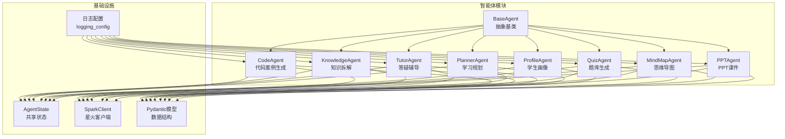

**图表来源**
- [agents/base.py:1-13](file://agents/base.py#L1-L13)
- [agents/__init__.py:1-30](file://agents/__init__.py#L1-L30)
- [workflows/state.py:1-24](file://workflows/state.py#L1-L24)
- [backend/integrations/spark/client.py:19-198](file://backend/integrations/spark/client.py#L19-L198)
- [schemas/profile.py:8-326](file://schemas/profile.py#L8-L326)

**章节来源**
- [agents/__init__.py:1-30](file://agents/__init__.py#L1-L30)
- [workflows/state.py:1-24](file://workflows/state.py#L1-L24)

## 核心组件
BaseAgent 抽象基类是整个智能体系统的基石，定义了所有智能体必须实现的统一接口。

### BaseAgent 设计模式
BaseAgent 采用抽象基类（ABC）设计模式，确保所有具体智能体都遵循相同的接口规范：

```mermaid
classDiagram
class BaseAgent {
<<abstract>>
+string name
+run(state : dict) dict
<<abstractmethod>> run(state : dict) dict
}
class CodeAgent {
+string name = "code"
+SparkClient spark
+run(state : dict) dict
-_extract_topic(state : dict) str
-_generate_code(topic : str, profile) tuple
-_generate_with_spark(topic : str, profile) CodeSet
}
class KnowledgeAgent {
+string name = "knowledge"
+SparkClient spark
+KnowledgeRetriever retriever
+run(state : dict) dict
-_extract_topic(state : dict) str
-_generate_knowledge_tree(topic : str, profile) tuple
-_generate_with_spark(topic : str, docs, profile) dict
}
class TutorAgent {
+string name = "tutor"
+SparkClient spark
+KnowledgeRetriever retriever
+run(state : dict) dict
-_extract_question(state : dict) str
-_generate_answer(question : str, profile) str
-_generate_with_spark(question : str, docs, profile) str
}
class PlannerAgent {
+string name = "planner"
+SparkClient spark
+run(state : dict) dict
-_generate_path(profile) tuple
-_generate_with_spark(profile) LearningPath
}
class ProfileAgent {
+string name = "profile"
+run(state : dict) dict
}
class QuizAgent {
+string name = "quiz"
+SparkClient spark
+run(state : dict) dict
-_extract_topic(state : dict) str
-_generate_quiz(topic : str, profile) tuple
-_generate_with_spark(topic : str, profile) QuizSet
}
class MindMapAgent {
+string name = "mindmap"
+SparkClient spark
+run(state : dict) dict
-_extract_topic(state : dict) str
-_generate_mindmap(topic : str, profile) tuple
-_generate_with_spark(topic : str) MindMap
}
class PPTAgent {
+string name = "ppt"
+SparkClient spark
+run(state : dict) dict
-_extract_topic(state : dict) str
-_generate_ppt(topic : str, profile) tuple
-_generate_with_spark(topic : str, profile) PPTDeck
}
BaseAgent <|-- CodeAgent
BaseAgent <|-- KnowledgeAgent
BaseAgent <|-- TutorAgent
BaseAgent <|-- PlannerAgent
BaseAgent <|-- ProfileAgent
BaseAgent <|-- QuizAgent
BaseAgent <|-- MindMapAgent
BaseAgent <|-- PPTAgent
```

**图表来源**
- [agents/base.py:7-13](file://agents/base.py#L7-L13)
- [agents/code_agent.py:208-263](file://agents/code_agent.py#L208-L263)
- [agents/knowledge_agent.py:70-140](file://agents/knowledge_agent.py#L70-L140)
- [agents/tutor_agent.py:90-153](file://agents/tutor_agent.py#L90-L153)
- [agents/planner_agent.py:153-209](file://agents/planner_agent.py#L153-L209)
- [agents/profile_agent.py:12-40](file://agents/profile_agent.py#L12-L40)
- [agents/quiz_agent.py:193-250](file://agents/quiz_agent.py#L193-L250)
- [agents/mindmap_agent.py:236-290](file://agents/mindmap_agent.py#L236-L290)
- [agents/ppt_agent.py:107-165](file://agents/ppt_agent.py#L107-L165)

### 抽象方法定义
BaseAgent 定义了唯一的抽象方法 run，这是智能体的核心执行入口：

- **方法签名**: `async def run(self, state: dict[str, Any]) -> dict[str, Any]`
- **参数**: 接收共享状态字典，包含智能体间传递的数据
- **返回值**: 返回需要合并回状态的片段字典
- **异步性**: 使用 async/await 支持异步处理
- **约定**: 返回值必须包含键值对，其中键表示要合并到状态中的数据标识

### 智能体接口规范
所有具体智能体必须遵循以下接口规范：

1. **继承关系**: 必须继承 BaseAgent
2. **name 属性**: 设置智能体名称标识
3. **run 方法**: 实现异步执行逻辑
4. **状态交互**: 读取和写入共享状态
5. **错误处理**: 提供兜底机制
6. **日志记录**: 使用标准日志记录

**章节来源**
- [agents/base.py:7-13](file://agents/base.py#L7-L13)

## 架构概览
EduAgent 采用多智能体协作架构，通过共享状态实现智能体间的通信和数据传递。

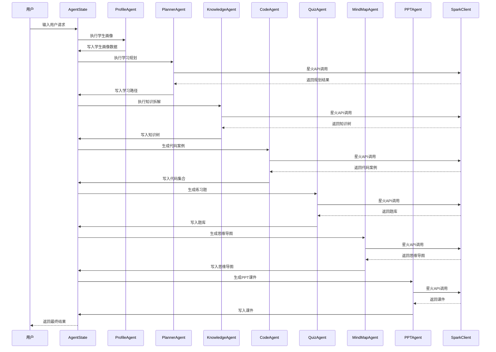

**图表来源**
- [workflows/state.py:7-24](file://workflows/state.py#L7-L24)
- [agents/profile_agent.py:17-39](file://agents/profile_agent.py#L17-L39)
- [agents/planner_agent.py:161-181](file://agents/planner_agent.py#L161-L181)
- [agents/knowledge_agent.py:79-92](file://agents/knowledge_agent.py#L79-L92)
- [agents/code_agent.py:216-229](file://agents/code_agent.py#L216-L229)
- [agents/quiz_agent.py:201-214](file://agents/quiz_agent.py#L201-L214)
- [agents/mindmap_agent.py:244-258](file://agents/mindmap_agent.py#L244-L258)
- [agents/ppt_agent.py:115-128](file://agents/ppt_agent.py#L115-L128)
- [backend/integrations/spark/client.py:141-171](file://backend/integrations/spark/client.py#L141-L171)

## 详细组件分析

### BaseAgent 抽象基类
BaseAgent 是所有智能体的抽象基类，定义了统一的接口规范和基本行为。

#### 设计特点
- **抽象方法**: 仅定义 run 方法，强制所有子类实现
- **状态管理**: 通过字典参数接收和返回状态数据
- **异步支持**: 支持异步执行，便于集成外部服务
- **名称标识**: 提供 name 属性用于识别智能体类型

#### 生命周期管理
智能体的生命周期包括初始化、执行和状态更新三个阶段：

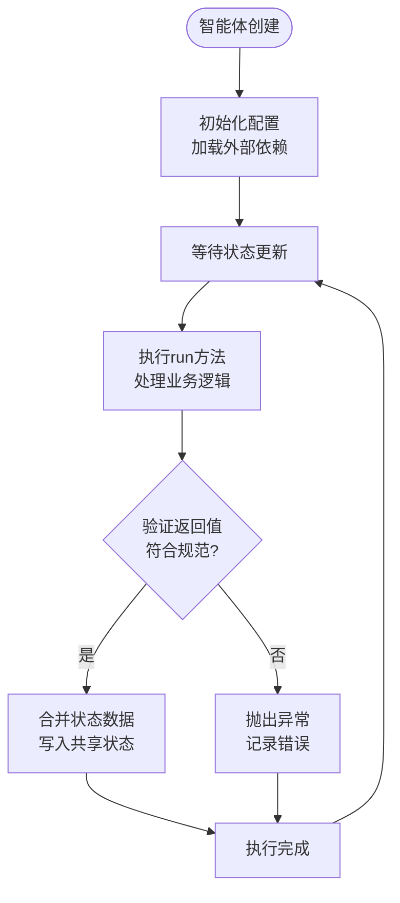

**图表来源**
- [agents/base.py:7-13](file://agents/base.py#L7-L13)

**章节来源**
- [agents/base.py:7-13](file://agents/base.py#L7-L13)

### 具体智能体实现分析

#### ProfileAgent - 学生画像智能体
ProfileAgent 负责构建和维护学生画像，是整个智能体流程的起点。

##### 核心功能
- **画像构建**: 分析用户输入，提取学习者特征
- **缓存机制**: 使用 Redis 缓存已有的画像信息
- **数据库集成**: 与 PostgreSQL/SQLite 数据库存储
- **会话管理**: 通过 session_id 关联用户会话

##### 状态交互
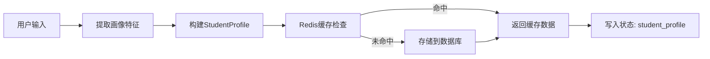

**图表来源**
- [agents/profile_agent.py:17-39](file://agents/profile_agent.py#L17-L39)

**章节来源**
- [agents/profile_agent.py:12-40](file://agents/profile_agent.py#L12-L40)

#### PlannerAgent - 学习规划智能体
PlannerAgent 基于学生画像生成个性化学习路径。

##### 规则兜底机制
当星火配置不可用时，使用启发式规则生成学习路径：
- **基础主题池**: 针对初学者的基础知识点
- **进阶主题池**: 针对中等水平的进阶内容
- **高级主题池**: 针对高级用户的深度内容
- **目标导向**: 根据学习目标调整重点区域

##### 路径生成算法
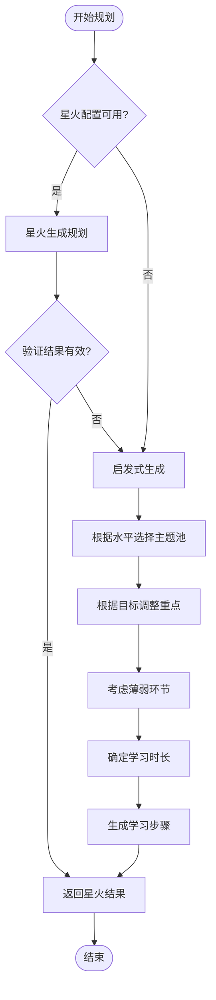

**图表来源**
- [agents/planner_agent.py:183-191](file://agents/planner_agent.py#L183-L191)
- [agents/planner_agent.py:25-151](file://agents/planner_agent.py#L25-L151)

**章节来源**
- [agents/planner_agent.py:153-209](file://agents/planner_agent.py#L153-L209)

#### KnowledgeAgent - 知识拆解智能体
KnowledgeAgent 结合 RAG 检索和星火大模型生成结构化知识树。

##### RAG 集成
- **检索器**: 使用 KnowledgeRetriever 查询相关文档
- **上下文构建**: 将检索到的知识整合为提示词
- **多源融合**: 同时利用检索结果和星火生成

##### 输出格式
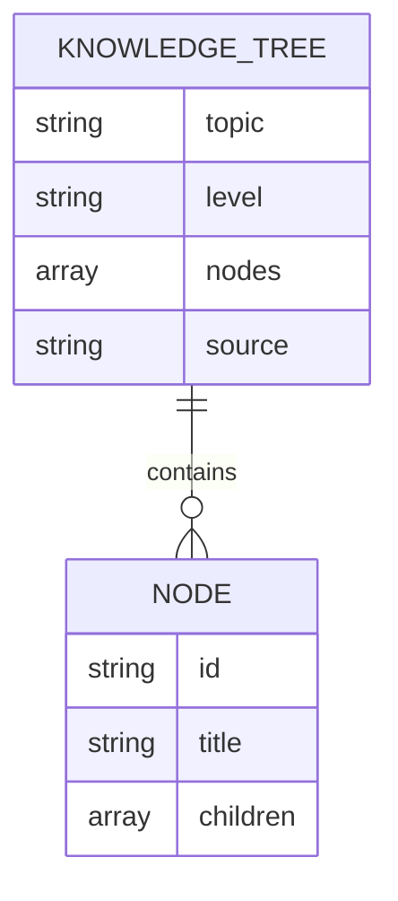

**图表来源**
- [agents/knowledge_agent.py:62-67](file://agents/knowledge_agent.py#L62-L67)
- [agents/knowledge_agent.py:26-67](file://agents/knowledge_agent.py#L26-L67)

**章节来源**
- [agents/knowledge_agent.py:70-140](file://agents/knowledge_agent.py#L70-L140)

#### CodeAgent - 代码案例智能体
CodeAgent 生成与学习主题相关的代码示例集合。

##### 代码生成策略
- **主题分类**: 针对循环、函数、面向对象等不同主题
- **难度分级**: 提供 easy、medium、hard 不同难度级别
- **示例丰富**: 每个主题包含多个代表性代码示例
- **学习建议**: 提供针对性的学习建议和练习方向

##### 代码示例结构
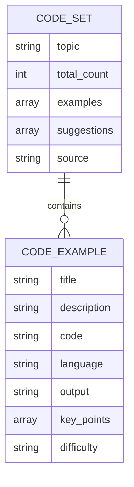

**图表来源**
- [agents/code_agent.py:40-46](file://agents/code_agent.py#L40-L46)
- [agents/code_agent.py:150-178](file://agents/code_agent.py#L150-L178)

**章节来源**
- [agents/code_agent.py:208-263](file://agents/code_agent.py#L208-L263)

#### QuizAgent - 题库生成智能体
QuizAgent 生成与学习主题相关的练习题集合。

##### 题型覆盖
- **选择题**: 单选题，检验基础知识掌握
- **判断题**: 判断对错，测试概念理解
- **填空题**: 补充缺失信息，强化记忆
- **编程题**: 实际编码，提升实践能力

##### 难度设计
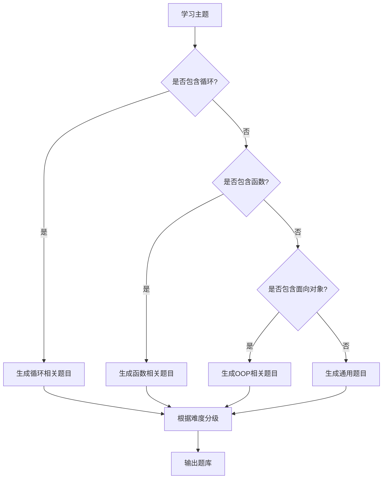

**图表来源**
- [agents/quiz_agent.py:25-47](file://agents/quiz_agent.py#L25-L47)
- [agents/quiz_agent.py:49-148](file://agents/quiz_agent.py#L49-L148)

**章节来源**
- [agents/quiz_agent.py:193-250](file://agents/quiz_agent.py#L193-L250)

#### MindMapAgent - 思维导图智能体
MindMapAgent 生成结构化的思维导图，帮助学习者理解知识结构。

##### 导图生成策略
- **主题映射**: 将学习主题映射到对应的思维导图结构
- **层次化组织**: 采用树状结构展示知识点的层次关系
- **可视化支持**: 支持 Mermaid 格式导出，便于前端渲染

##### 导图结构
```mermaid
mindmap
root((Python学习))
循环结构
for循环
range函数
遍历列表
enumerate
while循环
条件判断
避免死循环
循环控制
break退出
continue跳过
pass占位
嵌套循环
二维数组遍历
图案打印
函数
函数定义
def关键字
函数命名
参数列表
函数参数
位置参数
关键字参数
默认参数
可变参数
返回值
返回单个值
返回多个值
返回None
作用域
局部变量
全局变量
nonlocal
高级特性
lambda表达式
闭包
装饰器
递归
```

**图表来源**
- [agents/mindmap_agent.py:38-79](file://agents/mindmap_agent.py#L38-L79)
- [agents/mindmap_agent.py:82-136](file://agents/mindmap_agent.py#L82-L136)

**章节来源**
- [agents/mindmap_agent.py:236-290](file://agents/mindmap_agent.py#L236-L290)

#### PPTAgent - PPT课件智能体
PPTAgent 生成结构化的课件内容，支持教学和学习场景。

##### 课件设计原则
- **学习风格适配**: 根据视觉型、阅读型等不同学习风格调整内容
- **难度匹配**: 根据学习者水平调整课件复杂度
- **结构化组织**: 采用清晰的层级结构组织知识点

##### 课件结构
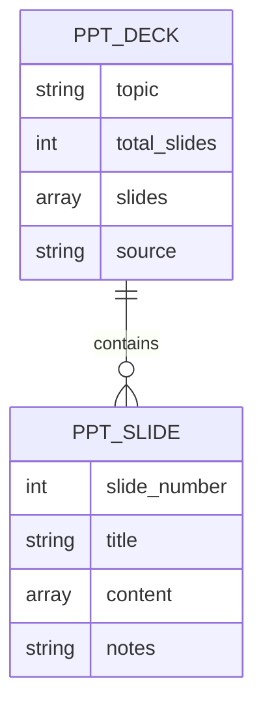

**图表来源**
- [agents/ppt_agent.py:42-47](file://agents/ppt_agent.py#L42-L47)
- [agents/ppt_agent.py:209-243](file://agents/ppt_agent.py#L209-L243)

**章节来源**
- [agents/ppt_agent.py:107-165](file://agents/ppt_agent.py#L107-L165)

#### TutorAgent - 答疑辅导智能体
TutorAgent 提供智能问答和学习指导服务。

##### 安全过滤机制
- **敏感词检测**: 过滤暴力、赌博、色情等敏感内容
- **安全回答**: 提供安全、正面的学习指导
- **规则兜底**: 当星火不可用时提供启发式回答

##### 知识融合
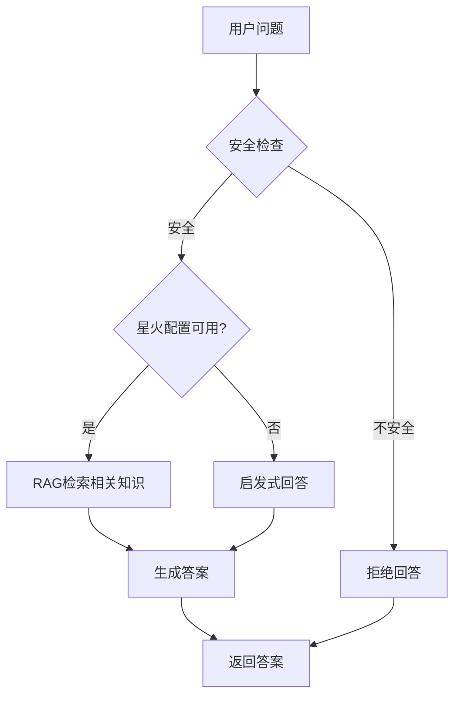

**图表来源**
- [agents/tutor_agent.py:99-115](file://agents/tutor_agent.py#L99-L115)
- [agents/tutor_agent.py:35-42](file://agents/tutor_agent.py#L35-L42)
- [agents/tutor_agent.py:123-132](file://agents/tutor_agent.py#L123-L132)

**章节来源**
- [agents/tutor_agent.py:90-153](file://agents/tutor_agent.py#L90-L153)

## 依赖分析
智能体系统具有清晰的依赖层次结构，从基础设施到业务逻辑逐层展开。

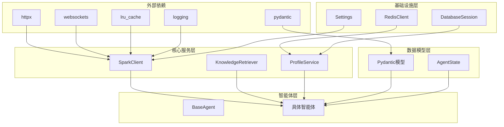

**图表来源**
- [backend/integrations/spark/client.py:19-198](file://backend/integrations/spark/client.py#L19-L198)
- [schemas/profile.py:8-326](file://schemas/profile.py#L8-L326)
- [workflows/state.py:7-24](file://workflows/state.py#L7-L24)

### 组件耦合度分析
- **低耦合**: BaseAgent 与具体智能体之间通过接口解耦
- **中等耦合**: 具体智能体与 SparkClient、RAG 检索器之间的耦合
- **高内聚**: 每个智能体内部功能相对独立，职责明确

### 外部依赖管理
- **配置管理**: 通过 Settings 统一管理外部服务配置
- **连接池**: SparkClient 使用 LRU 缓存优化连接复用
- **超时控制**: 统一的超时设置确保系统稳定性

**章节来源**
- [backend/integrations/spark/client.py:19-198](file://backend/integrations/spark/client.py#L19-L198)
- [schemas/profile.py:8-326](file://schemas/profile.py#L8-L326)

## 性能考虑
智能体系统在设计时充分考虑了性能优化和资源管理。

### 异步处理优化
- **并发执行**: 所有智能体都支持异步执行，提高系统吞吐量
- **连接复用**: SparkClient 使用 LRU 缓存复用连接
- **超时控制**: 统一的超时设置防止资源泄露

### 缓存策略
- **Redis 缓存**: ProfileAgent 使用 Redis 缓存学生画像
- **LRU 缓存**: SparkClient 使用 LRU 缓存客户端实例
- **内存优化**: 合理的内存使用避免内存泄漏

### 错误处理机制
- **降级策略**: 当外部服务不可用时使用启发式规则
- **重试机制**: 对临时性错误进行重试
- **监控告警**: 详细的日志记录便于问题排查

## 故障排除指南
智能体系统提供了完善的错误处理和故障排除机制。

### 常见问题诊断
1. **星火配置错误**
   - 检查环境变量配置
   - 验证 API 密钥有效性
   - 确认网络连接正常

2. **RAG 检索失败**
   - 检查向量数据库连接
   - 验证索引完整性
   - 确认查询参数正确

3. **Redis 缓存异常**
   - 检查 Redis 服务器状态
   - 验证连接配置
   - 清理过期缓存

### 日志分析
系统使用标准日志记录机制，便于问题定位：

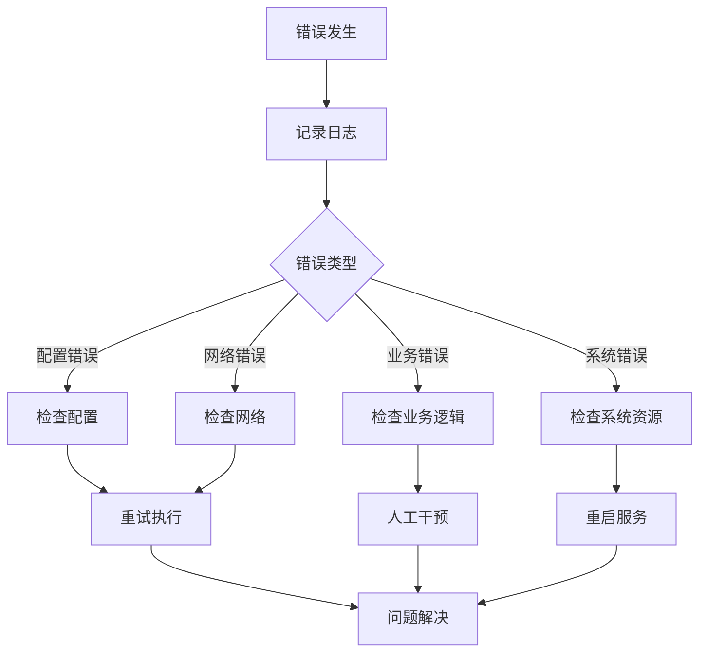

**图表来源**
- [backend/core/logging_config.py:9-27](file://backend/core/logging_config.py#L9-L27)

**章节来源**
- [backend/core/logging_config.py:9-27](file://backend/core/logging_config.py#L9-L27)

## 结论
EduAgent 的智能体基类设计体现了良好的软件工程实践，通过抽象基类统一了接口规范，通过启发式规则提供了可靠的降级机制，通过异步处理提升了系统性能。该设计模式为教育领域的智能体应用提供了可扩展、可维护的架构基础。

系统的主要优势包括：
- **统一接口**: 所有智能体遵循相同的接口规范
- **可扩展性**: 新增智能体只需继承 BaseAgent 并实现 run 方法
- **可靠性**: 完善的错误处理和降级机制
- **性能优化**: 异步处理和缓存策略
- **可观测性**: 详细的日志记录和监控

## 附录

### 最佳实践指南

#### 自定义智能体实现
1. **继承 BaseAgent**: 创建新的智能体类继承 BaseAgent
2. **设置名称**: 在类中设置 name 属性
3. **实现 run 方法**: 实现异步执行逻辑
4. **状态管理**: 正确读取和写入共享状态
5. **错误处理**: 提供合理的错误处理和降级策略
6. **日志记录**: 使用标准日志记录关键信息

#### 扩展方法
1. **添加新智能体**: 在 agents 目录下创建新文件
2. **更新导出**: 在 agents/__init__.py 中添加新智能体
3. **集成测试**: 编写单元测试验证功能正确性
4. **文档更新**: 更新相关文档和注释

#### 自定义实现示例
以下是一个简单的智能体实现示例：

```python
class CustomAgent(BaseAgent):
    """自定义智能体示例"""
    
    name = "custom"
    
    async def run(self, state: dict[str, Any]) -> dict[str, Any]:
        # 1. 从状态中读取数据
        input_text = state.get("input_text", "")
        
        # 2. 执行业务逻辑
        result = self.process_text(input_text)
        
        # 3. 返回需要合并的状态数据
        return {
            "processed_text": result,
            "messages": [{"role": "assistant", "content": f"处理完成: {result}"}]
        }
    
    def process_text(self, text: str) -> str:
        """处理文本的业务逻辑"""
        return text.upper()
```

### 接口规范参考
- **参数**: `state: dict[str, Any]` - 共享状态字典
- **返回值**: `dict[str, Any]` - 需要合并回状态的数据
- **异常**: 继承 BaseException 或其子类
- **日志**: 使用 `logger` 记录信息和错误

### 配置要求
- **环境变量**: SPARK_APP_ID、SPARK_API_KEY、SPARK_API_SECRET
- **数据库**: PostgreSQL 或 SQLite
- **缓存**: Redis 服务器
- **网络**: 可访问外部 API 服务