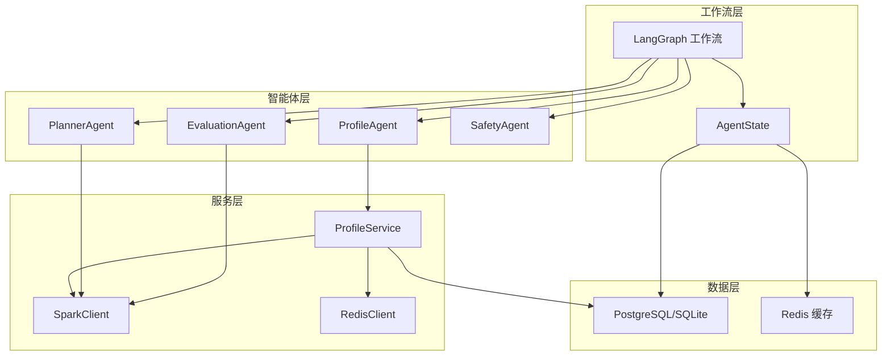
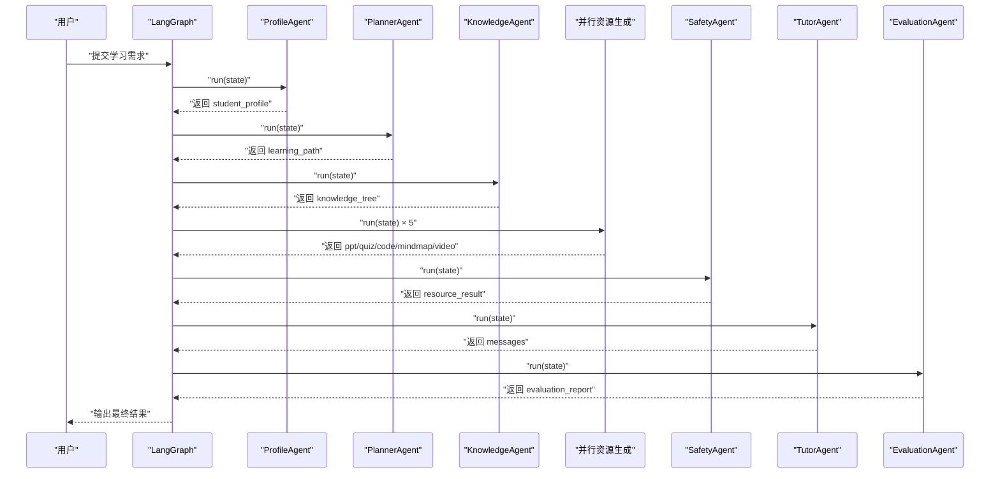
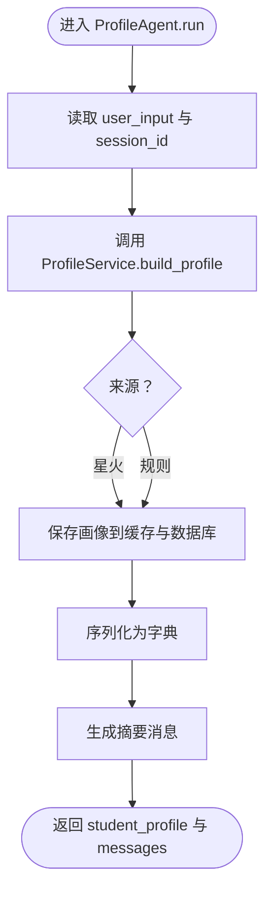
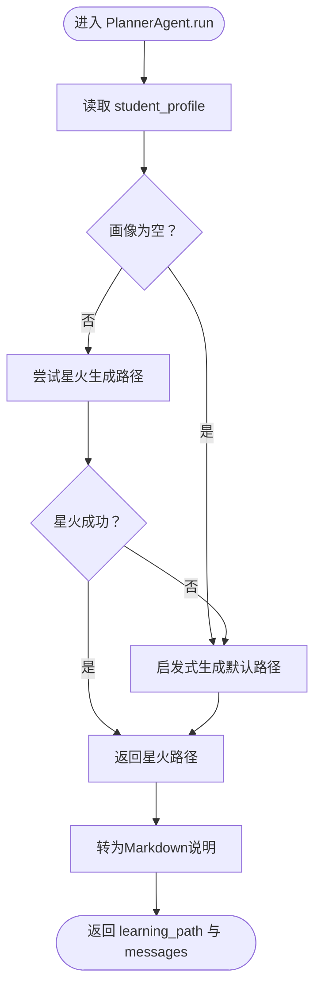
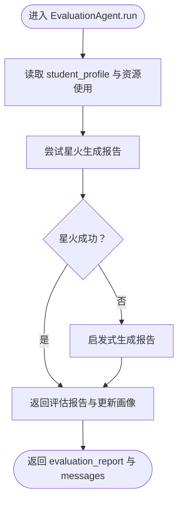
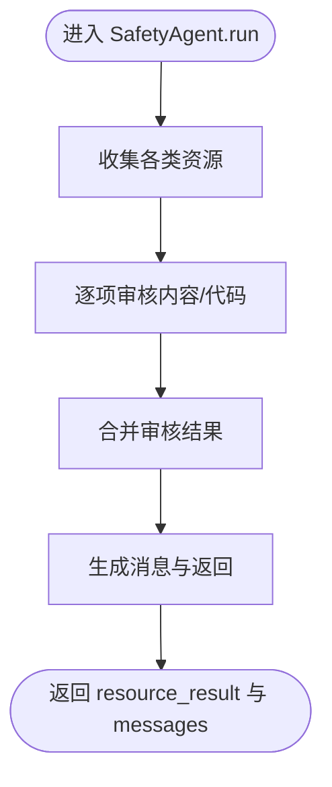
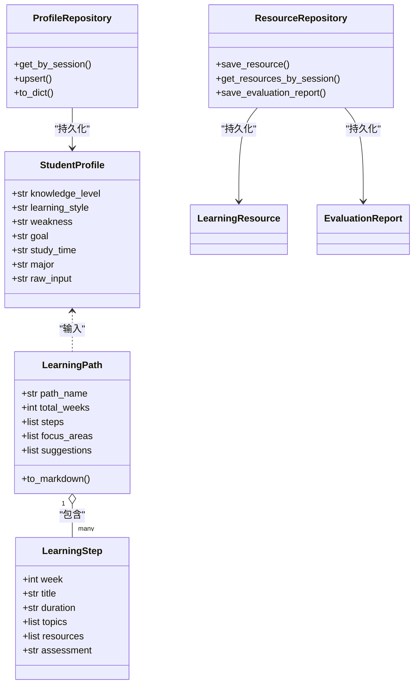
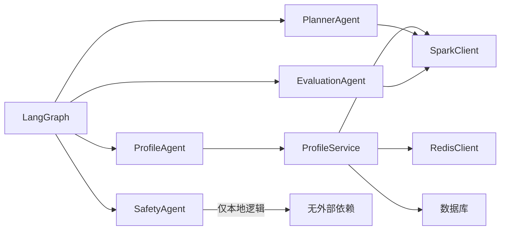

# 核心智能体

<cite>
**本文引用的文件**
- [agents/base.py](file://agents/base.py)
- [agents/profile_agent.py](file://agents/profile_agent.py)
- [agents/planner_agent.py](file://agents/planner_agent.py)
- [agents/evaluation_agent.py](file://agents/evaluation_agent.py)
- [agents/safety_agent.py](file://agents/safety_agent.py)
- [schemas/profile.py](file://schemas/profile.py)
- [services/profile_service.py](file://services/profile_service.py)
- [backend/integrations/spark/client.py](file://backend/integrations/spark/client.py)
- [backend/settings.py](file://backend/settings.py)
- [workflows/state.py](file://workflows/state.py)
- [workflows/graph.py](file://workflows/graph.py)
- [database/models.py](file://database/models.py)
- [database/repository.py](file://database/repository.py)
- [prompts/profile_agent.md](file://prompts/profile_agent.md)
- [prompts/planner_agent.md](file://prompts/planner_agent.md)
</cite>

## 目录
1. [引言](#引言)
2. [项目结构](#项目结构)
3. [核心组件](#核心组件)
4. [架构总览](#架构总览)
5. [详细组件分析](#详细组件分析)
6. [依赖分析](#依赖分析)
7. [性能考虑](#性能考虑)
8. [故障排除指南](#故障排除指南)
9. [结论](#结论)
10. [附录](#附录)

## 引言
本文件聚焦EduAgent的核心智能体：学生画像智能体(ProfileAgent)、学习规划智能体(PlannerAgent)、学习评估智能体(EvaluationAgent)、安全审核智能体(SafetyAgent)。文档从系统架构、数据流、处理逻辑、算法实现、配置参数、性能优化与故障排除等方面进行深入说明，并提供可视化图示帮助读者快速理解各智能体之间的协作关系与控制流。

## 项目结构
EduAgent采用“智能体 + 工作流”的分层设计：
- 智能体层：负责具体业务能力（画像、规划、评估、安全）。
- 服务层：封装数据库、缓存、外部模型调用等基础设施。
- 工作流层：以LangGraph编排智能体执行顺序与条件路由。
- 数据模型与仓库：持久化学习者画像、资源与评估报告。
- 提示词：为大模型提供结构化指令与约束。

图表来源
- [workflows/graph.py:186-211](file://workflows/graph.py#L186-L211)
- [agents/profile_agent.py:12-39](file://agents/profile_agent.py#L12-L39)
- [agents/planner_agent.py:153-181](file://agents/planner_agent.py#L153-L181)
- [agents/evaluation_agent.py:106-141](file://agents/evaluation_agent.py#L106-L141)
- [agents/safety_agent.py:111-158](file://agents/safety_agent.py#L111-L158)
- [services/profile_service.py:90-166](file://services/profile_service.py#L90-L166)
- [backend/integrations/spark/client.py:19-198](file://backend/integrations/spark/client.py#L19-L198)
- [database/repository.py:12-117](file://database/repository.py#L12-L117)

章节来源
- [workflows/state.py:7-24](file://workflows/state.py#L7-L24)
- [workflows/graph.py:186-211](file://workflows/graph.py#L186-L211)

## 核心组件
- 基类与抽象接口：统一智能体的命名与异步运行协议。
- 学生画像智能体：解析用户输入，构建结构化画像，支持缓存与回退策略。
- 学习规划智能体：基于画像生成个性化学习路径，支持星火与规则双通道。
- 学习评估智能体：汇总资源使用情况，生成评估报告并更新画像。
- 安全审核智能体：对生成资源进行内容与代码安全检查。
- 数据模型与仓库：统一的画像、资源、评估报告的数据结构与持久化。
- 工作流编排：定义节点、边与条件路由，实现闭环学习流程。

章节来源
- [agents/base.py:7-13](file://agents/base.py#L7-L13)
- [schemas/profile.py:8-326](file://schemas/profile.py#L8-L326)
- [database/models.py:13-40](file://database/models.py#L13-L40)
- [database/repository.py:12-117](file://database/repository.py#L12-L117)

## 架构总览
EduAgent采用LangGraph工作流驱动的流水线式执行：
- 入口：用户输入进入“画像”节点，产出结构化画像。
- 规划：依据画像生成学习路径。
- 知识拆解：将学习路径转化为知识树（由知识智能体负责，此处作为前置步骤）。
- 并行资源生成：同时生成PPT、测验、代码、思维导图、视频脚本。
- 安全审核：对生成资源进行内容与代码安全检查。
- 答疑：教师/助教智能体提供答疑与反馈。
- 评估：根据资源使用情况生成评估报告，并根据阈值决定是否回流调整。

图表来源
- [workflows/graph.py:39-133](file://workflows/graph.py#L39-L133)
- [agents/profile_agent.py:17-39](file://agents/profile_agent.py#L17-L39)
- [agents/planner_agent.py:161-181](file://agents/planner_agent.py#L161-L181)
- [agents/evaluation_agent.py:114-141](file://agents/evaluation_agent.py#L114-L141)
- [agents/safety_agent.py:116-158](file://agents/safety_agent.py#L116-L158)

## 详细组件分析

### 学生画像智能体 ProfileAgent
- 职责：解析用户输入，构建结构化画像；支持缓存与回退策略；将画像写回共享状态。
- 关键流程：
  - 从共享状态读取用户输入与会话ID。
  - 调用ProfileService进行画像构建（优先星火，失败则规则回退）。
  - 将画像与来源信息写回状态，并生成摘要消息。
- 算法与数据结构：
  - 使用StudentProfile模型承载画像字段。
  - ProfileService结合Redis缓存与数据库UPSER进行缓存与持久化。
- 决策逻辑：
  - 若未配置星火，则使用启发式规则生成画像。
  - 若命中缓存且原始输入一致，则直接返回缓存。
- 性能特性：
  - Redis缓存减少重复调用；数据库持久化保证跨会话复用。

图表来源
- [agents/profile_agent.py:17-39](file://agents/profile_agent.py#L17-L39)
- [services/profile_service.py:124-150](file://services/profile_service.py#L124-L150)
- [schemas/profile.py:8-36](file://schemas/profile.py#L8-L36)

章节来源
- [agents/profile_agent.py:12-39](file://agents/profile_agent.py#L12-L39)
- [services/profile_service.py:90-166](file://services/profile_service.py#L90-L166)
- [schemas/profile.py:8-36](file://schemas/profile.py#L8-L36)
- [prompts/profile_agent.md:1-28](file://prompts/profile_agent.md#L1-L28)

### 学习规划智能体 PlannerAgent
- 职责：基于学生画像生成个性化学习路径；若星火不可用则使用启发式规则。
- 关键流程：
  - 从共享状态读取画像；若为空则生成默认路径。
  - 优先调用星火生成JSON路径；失败则回退到启发式规则。
  - 将路径与Markdown说明写回状态。
- 算法与数据结构：
  - LearningPath/LearningStep模型定义路径结构。
  - 启发式规则按目标（竞赛/考研/就业/通用）、薄弱点、学习时长、知识水平分配周数与主题。
- 决策逻辑：
  - 星火可用且成功：使用星火输出。
  - 星火不可用或失败：使用启发式生成固定主题池与周数分配。
- 性能特性：
  - 星火调用成本较高，建议在生产环境启用并配置合理超时。

图表来源
- [agents/planner_agent.py:161-191](file://agents/planner_agent.py#L161-L191)
- [agents/planner_agent.py:25-150](file://agents/planner_agent.py#L25-L150)
- [schemas/profile.py:44-89](file://schemas/profile.py#L44-L89)

章节来源
- [agents/planner_agent.py:153-209](file://agents/planner_agent.py#L153-L209)
- [schemas/profile.py:44-89](file://schemas/profile.py#L44-L89)
- [prompts/planner_agent.md:1-76](file://prompts/planner_agent.md#L1-L76)

### 学习评估智能体 EvaluationAgent
- 职责：根据资源使用情况生成评估报告；更新画像中的评估字段。
- 关键流程：
  - 从共享状态聚合PPT、测验、代码、思维导图、视频脚本等使用情况。
  - 优先调用星火生成结构化报告；失败则使用启发式评分与建议。
  - 将评估报告与更新后的画像写回状态。
- 算法与数据结构：
  - 评分规则：基于资源使用情况加权，结合知识水平上限。
  - 报告结构：包含等级、评语、优势、薄弱点、建议等。
- 决策逻辑：
  - 星火可用且成功：使用星火输出。
  - 星火不可用或失败：使用启发式规则生成报告。
- 性能特性：
  - 星火调用成本高，建议在评估阶段按需启用。

图表来源
- [agents/evaluation_agent.py:114-174](file://agents/evaluation_agent.py#L114-L174)
- [agents/evaluation_agent.py:25-103](file://agents/evaluation_agent.py#L25-L103)

章节来源
- [agents/evaluation_agent.py:106-201](file://agents/evaluation_agent.py#L106-L201)

### 安全审核智能体 SafetyAgent
- 职责：对生成的各类学习资源进行内容与代码安全检查。
- 关键流程：
  - 遍历PPT、测验、代码、思维导图、视频脚本等资源。
  - 对每类资源逐项检查敏感关键词与可疑代码模式。
  - 汇总审核结果并写回状态。
- 算法与数据结构：
  - 敏感词表与可疑代码模式表。
  - 审核结果结构包含类型、是否安全、问题列表等。
- 决策逻辑：
  - 任一资源不安全即标记整体不安全，并列出问题明细。
- 性能特性：
  - 字符串扫描线性复杂度，适合批量资源审核。

图表来源
- [agents/safety_agent.py:116-158](file://agents/safety_agent.py#L116-L158)
- [agents/safety_agent.py:26-109](file://agents/safety_agent.py#L26-L109)

章节来源
- [agents/safety_agent.py:111-158](file://agents/safety_agent.py#L111-L158)

### 数据模型与持久化
- StudentProfile：结构化画像字段，支持从LLM字典构造。
- LearningPath/LearningStep：学习路径与步骤模型，支持Markdown导出。
- ResourceRepository/EvaluationRepository：统一资源与评估报告的持久化。
- ProfileRepository：画像的缓存与数据库UPSER。

图表来源
- [schemas/profile.py:8-326](file://schemas/profile.py#L8-L326)
- [database/models.py:13-40](file://database/models.py#L13-L40)
- [database/repository.py:12-117](file://database/repository.py#L12-L117)

章节来源
- [schemas/profile.py:8-326](file://schemas/profile.py#L8-L326)
- [database/models.py:13-40](file://database/models.py#L13-L40)
- [database/repository.py:12-117](file://database/repository.py#L12-L117)

## 依赖分析
- 模型依赖：智能体均依赖Pydantic模型进行数据校验与序列化。
- 外部集成：通过SparkClient对接星火模型，支持WebSocket与HTTP两种模式。
- 缓存与存储：ProfileService使用Redis缓存与数据库UPSER，提高画像查询与生成效率。
- 工作流耦合：四个核心智能体通过LangGraph串联，形成闭环学习流程。

图表来源
- [services/profile_service.py:90-166](file://services/profile_service.py#L90-L166)
- [backend/integrations/spark/client.py:19-198](file://backend/integrations/spark/client.py#L19-L198)
- [workflows/graph.py:186-211](file://workflows/graph.py#L186-L211)

章节来源
- [backend/integrations/spark/client.py:19-198](file://backend/integrations/spark/client.py#L19-L198)
- [backend/settings.py:53-61](file://backend/settings.py#L53-L61)

## 性能考虑
- 星火调用成本：WebSocket/HTTP均有超时与错误处理，建议在生产环境启用并设置合理超时与重试。
- 缓存策略：ProfileService对画像进行Redis缓存与数据库UPSER，命中率高可显著降低延迟。
- 并行生成：资源生成阶段采用并发执行，缩短端到端时延。
- 评估回流：当评估分数低于阈值时自动回流调整，避免低效路径反复执行。
- 数据库索引：按session_id建立索引，提升画像与资源查询效率。

## 故障排除指南
- 星火未配置或认证失败
  - 现象：星火调用抛出未配置或认证错误。
  - 排查：检查环境变量与配置项，确认APP ID、API Key、Secret、WS/HTTP地址与域名。
  - 参考
    - [backend/integrations/spark/client.py:148-161](file://backend/integrations/spark/client.py#L148-L161)
    - [backend/settings.py:58-61](file://backend/settings.py#L58-L61)
- 星火响应解析失败
  - 现象：无法从模型输出解析JSON。
  - 排查：检查提示词是否要求严格JSON输出；确认模型返回包裹在代码块中的JSON。
  - 参考
    - [backend/integrations/spark/client.py:163-193](file://backend/integrations/spark/client.py#L163-L193)
- 画像缓存命中但内容不一致
  - 现象：缓存命中但原始输入不同导致画像不准确。
  - 排查：ProfileService在缓存命中时比较原始输入，不一致则回退重建。
  - 参考
    - [services/profile_service.py:133-137](file://services/profile_service.py#L133-L137)
- 评估回流次数过多
  - 现象：多次回流后仍低于阈值。
  - 排查：检查评估建议注入与回流逻辑，适当调整阈值与建议质量。
  - 参考
    - [workflows/graph.py:136-183](file://workflows/graph.py#L136-L183)
- 安全审核误报
  - 现象：正常内容被判定为敏感。
  - 排查：调整敏感词表与可疑模式，或增加白名单机制。
  - 参考
    - [agents/safety_agent.py:26-57](file://agents/safety_agent.py#L26-L57)

章节来源
- [backend/integrations/spark/client.py:148-193](file://backend/integrations/spark/client.py#L148-L193)
- [services/profile_service.py:133-137](file://services/profile_service.py#L133-L137)
- [workflows/graph.py:136-183](file://workflows/graph.py#L136-L183)
- [agents/safety_agent.py:26-57](file://agents/safety_agent.py#L26-L57)

## 结论
EduAgent的核心智能体围绕“画像—规划—资源—安全—评估—回流”的闭环展开，既能在星火可用时发挥大模型的强大能力，也能在离线或受限环境下通过规则回退保障可用性。通过合理的缓存、并行与持久化策略，系统在准确性与性能之间取得平衡。建议在生产环境中完善星火配置、监控评估回流次数，并持续优化提示词与安全策略。

## 附录
- 配置参数参考
  - 星火相关：API类型、APP ID、API Key、API Secret、WS/HTTP地址、域名、模型、超时等。
  - Redis与数据库：URL、启用开关、缓存TTL等。
  - RAG相关：知识目录、向量库持久化目录、集合名、嵌入模型、分块大小与重叠、Top-K等。
  - 参考
    - [backend/settings.py:17-61](file://backend/settings.py#L17-L61)