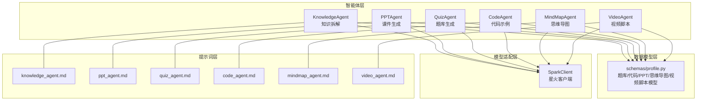
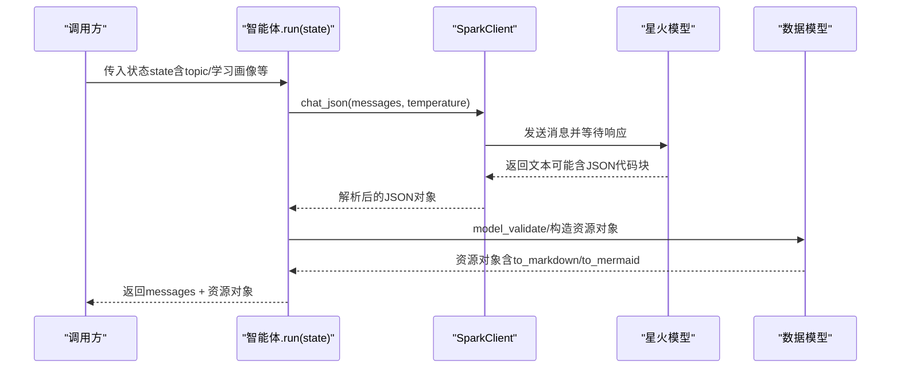
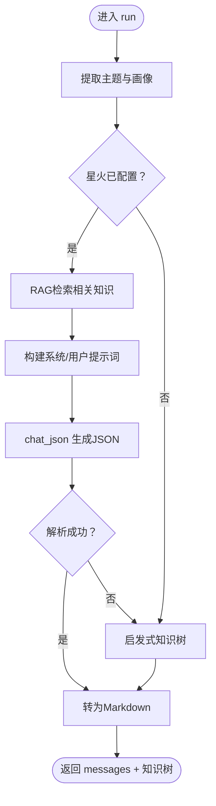
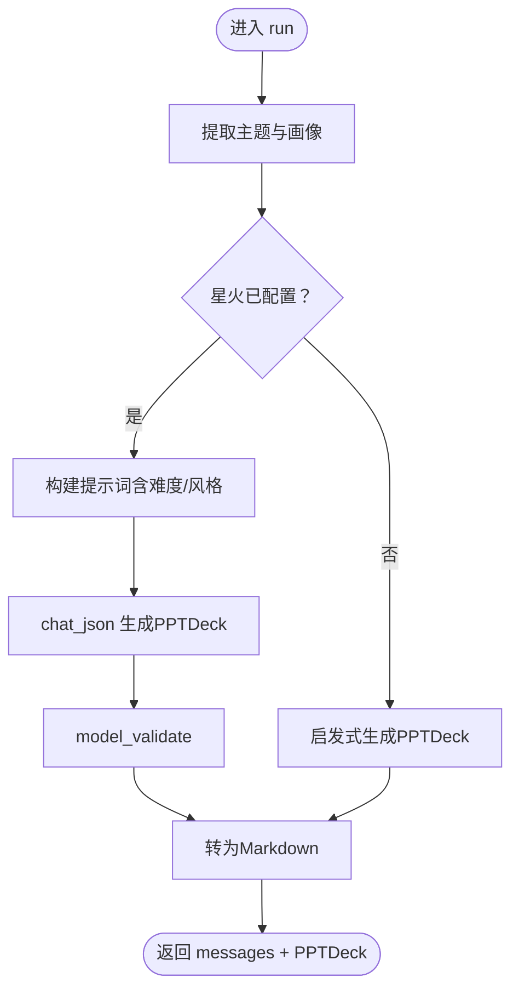
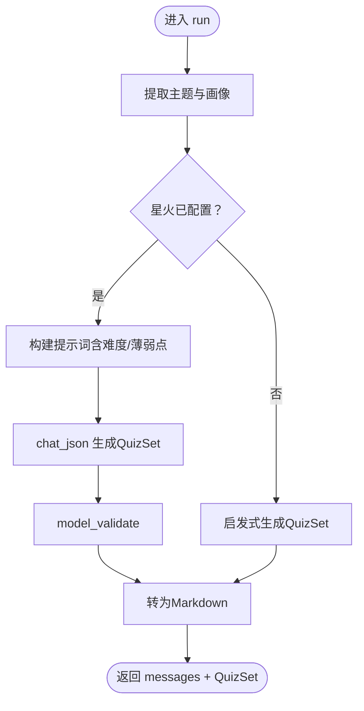
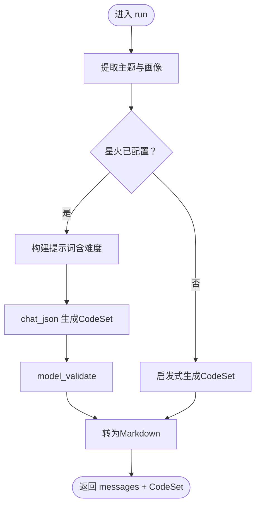
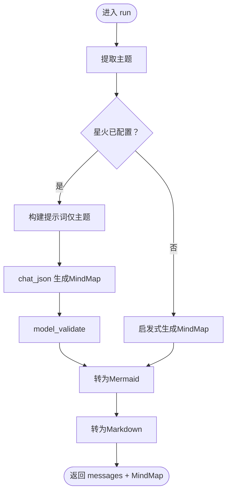
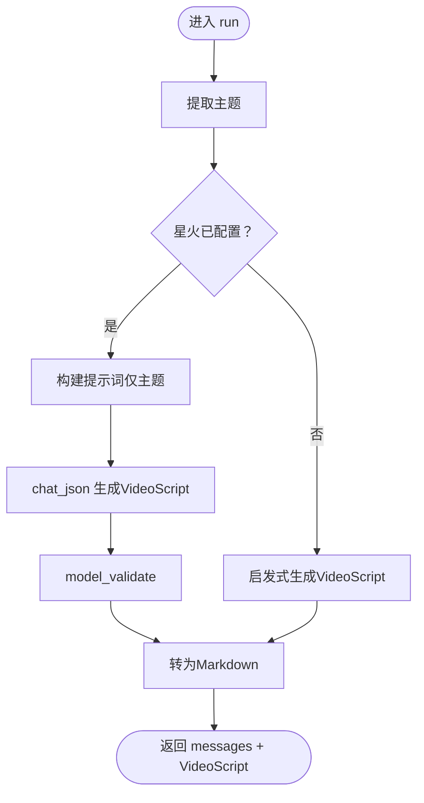
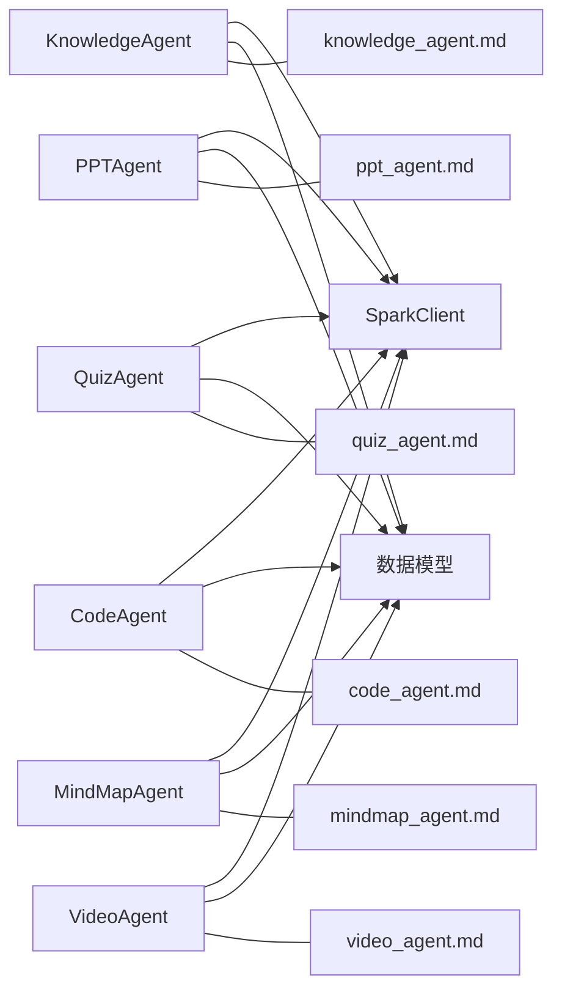

# 资源生成智能体

<cite>
**本文引用的文件**
- [agents/base.py](file://agents/base.py)
- [agents/knowledge_agent.py](file://agents/knowledge_agent.py)
- [agents/ppt_agent.py](file://agents/ppt_agent.py)
- [agents/quiz_agent.py](file://agents/quiz_agent.py)
- [agents/code_agent.py](file://agents/code_agent.py)
- [agents/mindmap_agent.py](file://agents/mindmap_agent.py)
- [agents/video_agent.py](file://agents/video_agent.py)
- [schemas/profile.py](file://schemas/profile.py)
- [backend/integrations/spark/client.py](file://backend/integrations/spark/client.py)
- [prompts/knowledge_agent.md](file://prompts/knowledge_agent.md)
- [prompts/ppt_agent.md](file://prompts/ppt_agent.md)
- [prompts/quiz_agent.md](file://prompts/quiz_agent.md)
- [prompts/code_agent.md](file://prompts/code_agent.md)
- [prompts/mindmap_agent.md](file://prompts/mindmap_agent.md)
- [prompts/video_agent.md](file://prompts/video_agent.md)
</cite>

## 目录
1. [引言](#引言)
2. [项目结构](#项目结构)
3. [核心组件](#核心组件)
4. [架构总览](#架构总览)
5. [详细组件分析](#详细组件分析)
6. [依赖分析](#依赖分析)
7. [性能考虑](#性能考虑)
8. [故障排查指南](#故障排查指南)
9. [结论](#结论)
10. [附录](#附录)

## 引言
本文件系统性阐述EduAgent的资源生成智能体体系，包括知识拆解智能体（KnowledgeAgent）、PPT生成智能体（PPTAgent）、题库生成智能体（QuizAgent）、代码案例智能体（CodeAgent）、思维导图智能体（MindMapAgent）、视频脚本智能体（VideoAgent）。文档围绕以下目标展开：
- 深入解释各智能体如何将复杂知识点转化为可理解、可使用的教学资源
- 描述内容生成算法、格式转换机制与质量控制流程
- 提供模板配置、样式定制与批量处理的使用指南

## 项目结构
EduAgent采用“智能体 + 模型适配 + 数据模型 + 提示词”的分层组织方式：
- agents：各资源生成智能体的实现，统一继承自BaseAgent
- schemas：教学资源的数据模型（题库、代码、PPT、思维导图、视频脚本等）
- backend/integrations/spark：对接星火大模型的客户端与认证
- prompts：各智能体专用提示词模板
- 其他模块：工作流、RAG检索、服务层等支撑资源生成的基础设施

图表来源
- [agents/knowledge_agent.py:70-140](file://agents/knowledge_agent.py#L70-L140)
- [agents/ppt_agent.py:107-165](file://agents/ppt_agent.py#L107-L165)
- [agents/quiz_agent.py:193-250](file://agents/quiz_agent.py#L193-L250)
- [agents/code_agent.py:208-263](file://agents/code_agent.py#L208-L263)
- [agents/mindmap_agent.py:236-290](file://agents/mindmap_agent.py#L236-L290)
- [agents/video_agent.py:273-326](file://agents/video_agent.py#L273-L326)
- [schemas/profile.py:104-326](file://schemas/profile.py#L104-L326)
- [backend/integrations/spark/client.py:19-198](file://backend/integrations/spark/client.py#L19-L198)
- [prompts/knowledge_agent.md:1-17](file://prompts/knowledge_agent.md#L1-L17)
- [prompts/ppt_agent.md:1-16](file://prompts/ppt_agent.md#L1-L16)
- [prompts/quiz_agent.md:1-21](file://prompts/quiz_agent.md#L1-L21)
- [prompts/code_agent.md:1-22](file://prompts/code_agent.md#L1-L22)
- [prompts/mindmap_agent.md:1-16](file://prompts/mindmap_agent.md#L1-L16)
- [prompts/video_agent.md:1-20](file://prompts/video_agent.md#L1-L20)

章节来源
- [agents/base.py:7-13](file://agents/base.py#L7-L13)
- [schemas/profile.py:8-326](file://schemas/profile.py#L8-L326)
- [backend/integrations/spark/client.py:19-198](file://backend/integrations/spark/client.py#L19-L198)

## 核心组件
- BaseAgent：抽象基类，定义统一的run接口，作为所有智能体的契约
- 各智能体：分别负责知识树、课件、题库、代码示例、思维导图、视频脚本的生成
- SparkClient：统一的星火模型客户端，支持WebSocket与HTTP两种调用方式，并内置JSON解析
- 数据模型：题库、代码、PPT、思维导图、视频脚本等Pydantic模型，提供to_markdown/to_mermaid等格式化方法
- 提示词模板：各智能体专用的提示词，约束输出结构与生成原则

章节来源
- [agents/base.py:7-13](file://agents/base.py#L7-L13)
- [agents/knowledge_agent.py:70-140](file://agents/knowledge_agent.py#L70-L140)
- [agents/ppt_agent.py:107-165](file://agents/ppt_agent.py#L107-L165)
- [agents/quiz_agent.py:193-250](file://agents/quiz_agent.py#L193-L250)
- [agents/code_agent.py:208-263](file://agents/code_agent.py#L208-L263)
- [agents/mindmap_agent.py:236-290](file://agents/mindmap_agent.py#L236-L290)
- [agents/video_agent.py:273-326](file://agents/video_agent.py#L273-L326)
- [backend/integrations/spark/client.py:19-198](file://backend/integrations/spark/client.py#L19-L198)
- [schemas/profile.py:104-326](file://schemas/profile.py#L104-L326)
- [prompts/knowledge_agent.md:1-17](file://prompts/knowledge_agent.md#L1-L17)
- [prompts/ppt_agent.md:1-16](file://prompts/ppt_agent.md#L1-L16)
- [prompts/quiz_agent.md:1-21](file://prompts/quiz_agent.md#L1-L21)
- [prompts/code_agent.md:1-22](file://prompts/code_agent.md#L1-L22)
- [prompts/mindmap_agent.md:1-16](file://prompts/mindmap_agent.md#L1-L16)
- [prompts/video_agent.md:1-20](file://prompts/video_agent.md#L1-L20)

## 架构总览
各智能体通过统一的run入口接收状态，按需调用星火模型生成结构化JSON，随后将结果转为Markdown或Mermaid等人类可读格式，并回传消息与资源对象，形成“状态驱动 + 大模型生成 + 多格式输出”的闭环。

图表来源
- [agents/knowledge_agent.py:79-92](file://agents/knowledge_agent.py#L79-L92)
- [agents/ppt_agent.py:115-128](file://agents/ppt_agent.py#L115-L128)
- [agents/quiz_agent.py:201-214](file://agents/quiz_agent.py#L201-L214)
- [agents/code_agent.py:216-229](file://agents/code_agent.py#L216-L229)
- [agents/mindmap_agent.py:244-258](file://agents/mindmap_agent.py#L244-L258)
- [agents/video_agent.py:281-294](file://agents/video_agent.py#L281-L294)
- [backend/integrations/spark/client.py:163-171](file://backend/integrations/spark/client.py#L163-L171)

## 详细组件分析

### 知识拆解智能体（KnowledgeAgent）
- 输入：学习主题（来自学习路径或用户输入），学生画像（知识水平）
- 生成算法：
  - 若星火已配置：通过RAG检索相关知识，拼接系统提示词与用户提示词，调用chat_json生成结构化知识树（topic、level、nodes）
  - 若未配置：基于启发式规则（按主题匹配循环/函数/面向对象/通用）生成知识树
- 格式转换：将知识树转为Markdown层级结构，便于阅读与后续消费
- 质量控制：异常降级为启发式兜底；严格校验JSON输出并标注来源

图表来源
- [agents/knowledge_agent.py:79-140](file://agents/knowledge_agent.py#L79-L140)
- [prompts/knowledge_agent.md:1-17](file://prompts/knowledge_agent.md#L1-L17)
- [backend/integrations/spark/client.py:163-171](file://backend/integrations/spark/client.py#L163-L171)

章节来源
- [agents/knowledge_agent.py:70-140](file://agents/knowledge_agent.py#L70-L140)
- [prompts/knowledge_agent.md:1-17](file://prompts/knowledge_agent.md#L1-L17)

### PPT生成智能体（PPTAgent）
- 输入：学习主题、学生画像（知识水平/学习风格）
- 生成算法：
  - 星火配置时：按提示词生成包含幻灯片数量与内容的JSON，构造PPTDeck
  - 未配置时：按主题与风格生成启发式PPT（循环/函数/面向对象/通用）
- 格式转换：PPTDeck.to_markdown输出结构化课件说明
- 质量控制：异常时回退启发式；严格JSON校验

图表来源
- [agents/ppt_agent.py:115-165](file://agents/ppt_agent.py#L115-L165)
- [prompts/ppt_agent.md:1-16](file://prompts/ppt_agent.md#L1-L16)
- [backend/integrations/spark/client.py:163-171](file://backend/integrations/spark/client.py#L163-L171)

章节来源
- [agents/ppt_agent.py:107-165](file://agents/ppt_agent.py#L107-L165)
- [prompts/ppt_agent.md:1-16](file://prompts/ppt_agent.md#L1-L16)

### 题库生成智能体（QuizAgent）
- 输入：学习主题、学生画像（知识水平/薄弱点）
- 生成算法：
  - 星火配置时：按提示词生成题库（含多种题型、难度分布、解析、建议）
  - 未配置时：按主题生成启发式题库（循环/函数/面向对象/通用）
- 格式转换：QuizSet.to_markdown输出结构化题集
- 质量控制：异常回退启发式；严格JSON校验

图表来源
- [agents/quiz_agent.py:201-250](file://agents/quiz_agent.py#L201-L250)
- [prompts/quiz_agent.md:1-21](file://prompts/quiz_agent.md#L1-L21)
- [backend/integrations/spark/client.py:163-171](file://backend/integrations/spark/client.py#L163-L171)

章节来源
- [agents/quiz_agent.py:193-250](file://agents/quiz_agent.py#L193-L250)
- [prompts/quiz_agent.md:1-21](file://prompts/quiz_agent.md#L1-L21)

### 代码案例智能体（CodeAgent）
- 输入：学习主题、学生画像（知识水平）
- 生成算法：
  - 星火配置时：按提示词生成代码示例集合（含标题、描述、代码、输出、关键点、难度）
  - 未配置时：按主题生成启发式代码示例
- 格式转换：CodeSet.to_markdown输出结构化代码案例
- 质量控制：异常回退启发式；严格JSON校验

图表来源
- [agents/code_agent.py:216-263](file://agents/code_agent.py#L216-L263)
- [prompts/code_agent.md:1-22](file://prompts/code_agent.md#L1-L22)
- [backend/integrations/spark/client.py:163-171](file://backend/integrations/spark/client.py#L163-L171)

章节来源
- [agents/code_agent.py:208-263](file://agents/code_agent.py#L208-L263)
- [prompts/code_agent.md:1-22](file://prompts/code_agent.md#L1-L22)

### 思维导图智能体（MindMapAgent）
- 输入：学习主题
- 生成算法：
  - 星火配置时：按提示词生成思维导图JSON（根节点与递归子节点）
  - 未配置时：按主题生成启发式思维导图
- 格式转换：MindMap.to_mermaid输出Mermaid图；MindMap.to_markdown输出层级化文本
- 质量控制：异常回退启发式；严格JSON校验

图表来源
- [agents/mindmap_agent.py:244-290](file://agents/mindmap_agent.py#L244-L290)
- [prompts/mindmap_agent.md:1-16](file://prompts/mindmap_agent.md#L1-L16)
- [backend/integrations/spark/client.py:163-171](file://backend/integrations/spark/client.py#L163-L171)

章节来源
- [agents/mindmap_agent.py:236-290](file://agents/mindmap_agent.py#L236-L290)
- [prompts/mindmap_agent.md:1-16](file://prompts/mindmap_agent.md#L1-L16)

### 视频脚本智能体（VideoAgent）
- 输入：学习主题
- 生成算法：
  - 星火配置时：按提示词生成视频脚本JSON（场景、时长、内容、视觉/音频说明、建议）
  - 未配置时：按主题生成启发式视频脚本
- 格式转换：VideoScript.to_markdown输出结构化脚本
- 质量控制：异常回退启发式；严格JSON校验

图表来源
- [agents/video_agent.py:281-326](file://agents/video_agent.py#L281-L326)
- [prompts/video_agent.md:1-20](file://prompts/video_agent.md#L1-L20)
- [backend/integrations/spark/client.py:163-171](file://backend/integrations/spark/client.py#L163-L171)

章节来源
- [agents/video_agent.py:273-326](file://agents/video_agent.py#L273-L326)
- [prompts/video_agent.md:1-20](file://prompts/video_agent.md#L1-L20)

## 依赖分析
- 智能体与模型适配：
  - 所有智能体均通过get_spark_client获取SparkClient实例，统一走chat_json接口
  - SparkClient支持WebSocket与HTTP两种调用方式，具备错误码校验与JSON解析能力
- 智能体与数据模型：
  - 各智能体生成的结构化数据通过Pydantic模型进行校验与格式化
  - 模型提供to_markdown/to_mermaid等方法，便于多格式输出
- 智能体与提示词：
  - 每个智能体绑定独立提示词模板，约束输出结构与生成原则

图表来源
- [agents/knowledge_agent.py:75-77](file://agents/knowledge_agent.py#L75-L77)
- [agents/ppt_agent.py:112-113](file://agents/ppt_agent.py#L112-L113)
- [agents/quiz_agent.py:198-199](file://agents/quiz_agent.py#L198-L199)
- [agents/code_agent.py:213-214](file://agents/code_agent.py#L213-L214)
- [agents/mindmap_agent.py:241-242](file://agents/mindmap_agent.py#L241-L242)
- [agents/video_agent.py:278-279](file://agents/video_agent.py#L278-L279)
- [backend/integrations/spark/client.py:195-198](file://backend/integrations/spark/client.py#L195-L198)
- [schemas/profile.py:104-326](file://schemas/profile.py#L104-L326)

章节来源
- [backend/integrations/spark/client.py:19-198](file://backend/integrations/spark/client.py#L19-L198)
- [schemas/profile.py:104-326](file://schemas/profile.py#L104-L326)

## 性能考虑
- 星火调用策略
  - WebSocket优先：具备流式返回与更低延迟，适合长文本生成
  - HTTP备选：适用于无法使用WebSocket的环境
- JSON解析健壮性
  - SparkClient内置正则与边界定位，提升从模型输出中抽取JSON的成功率
- 启发式兜底
  - 当星火不可用或异常时，各智能体自动切换至启发式规则，保障可用性
- 输出格式化成本
  - 各模型提供to_markdown/to_mermaid方法，减少重复格式化逻辑，提高一致性

## 故障排查指南
- 星火未配置
  - 现象：抛出未配置错误
  - 排查：检查环境变量与配置项，确认API类型、密钥与域名
  - 参考
    - [backend/integrations/spark/client.py:148-151](file://backend/integrations/spark/client.py#L148-L151)
- 星火配置不完整
  - 现象：抛出配置不完整错误
  - 排查：核对APP_ID/API_KEY/API_SECRET/API_URL或WS_URL是否齐全
  - 参考
    - [backend/integrations/spark/client.py:160-161](file://backend/integrations/spark/client.py#L160-L161)
- JSON解析失败
  - 现象：提示无法从模型输出解析JSON
  - 排查：检查提示词是否强制输出JSON；确认模型返回包裹在代码块或大括号内
  - 参考
    - [backend/integrations/spark/client.py:173-192](file://backend/integrations/spark/client.py#L173-L192)
- 智能体异常降级
  - 现象：日志出现“使用规则兜底”警告
  - 排查：检查星火可用性与网络连通性；必要时降低temperature或max_tokens
  - 参考
    - [agents/knowledge_agent.py:115-117](file://agents/knowledge_agent.py#L115-L117)
    - [agents/ppt_agent.py:142-143](file://agents/ppt_agent.py#L142-L143)
    - [agents/quiz_agent.py:227-228](file://agents/quiz_agent.py#L227-L228)
    - [agents/code_agent.py:242-243](file://agents/code_agent.py#L242-L243)
    - [agents/mindmap_agent.py:271-272](file://agents/mindmap_agent.py#L271-L272)
    - [agents/video_agent.py:307-308](file://agents/video_agent.py#L307-L308)

章节来源
- [backend/integrations/spark/client.py:148-192](file://backend/integrations/spark/client.py#L148-L192)
- [agents/knowledge_agent.py:115-117](file://agents/knowledge_agent.py#L115-L117)
- [agents/ppt_agent.py:142-143](file://agents/ppt_agent.py#L142-L143)
- [agents/quiz_agent.py:227-228](file://agents/quiz_agent.py#L227-L228)
- [agents/code_agent.py:242-243](file://agents/code_agent.py#L242-L243)
- [agents/mindmap_agent.py:271-272](file://agents/mindmap_agent.py#L271-L272)
- [agents/video_agent.py:307-308](file://agents/video_agent.py#L307-L308)

## 结论
EduAgent的资源生成智能体通过“统一接口 + 星火模型 + 结构化数据模型 + 提示词约束”的设计，实现了从复杂知识点到多样化教学资源的自动化生产。其核心优势在于：
- 可靠性：星火配置失败时自动回退启发式规则
- 一致性：统一的JSON输出与格式化方法
- 可扩展：新增智能体只需遵循BaseAgent与提示词规范

## 附录

### 模板配置与提示词
- 知识拆解：约束输出为包含topic/level/nodes的JSON，强调层次与完整性
  - [prompts/knowledge_agent.md:1-17](file://prompts/knowledge_agent.md#L1-L17)
- 课件生成：约束输出为包含topic/total_slides/slides的JSON，强调结构与可读性
  - [prompts/ppt_agent.md:1-16](file://prompts/ppt_agent.md#L1-L16)
- 题库生成：约束输出为包含topic/total_count/questions/suggestions的JSON，强调题型与解析
  - [prompts/quiz_agent.md:1-21](file://prompts/quiz_agent.md#L1-L21)
- 代码示例：约束输出为包含topic/examples/suggestions的JSON，强调可运行与关键点
  - [prompts/code_agent.md:1-22](file://prompts/code_agent.md#L1-L22)
- 思维导图：约束输出为包含topic/root的JSON，强调递归结构与Mermaid渲染
  - [prompts/mindmap_agent.md:1-16](file://prompts/mindmap_agent.md#L1-L16)
- 视频脚本：约束输出为包含topic/total_duration/scenes/suggestions的JSON，强调场景与时长
  - [prompts/video_agent.md:1-20](file://prompts/video_agent.md#L1-L20)

### 样式定制与批量处理
- 样式定制
  - 各模型提供to_markdown/to_mermaid方法，可在前端或下游系统中进一步定制渲染样式
  - 参考
    - [schemas/profile.py:125-151](file://schemas/profile.py#L125-L151)
    - [schemas/profile.py:175-207](file://schemas/profile.py#L175-L207)
    - [schemas/profile.py:227-242](file://schemas/profile.py#L227-L242)
    - [schemas/profile.py:260-285](file://schemas/profile.py#L260-L285)
    - [schemas/profile.py:307-326](file://schemas/profile.py#L307-L326)
- 批量处理
  - 建议在工作流中按主题批量调用各智能体，统一收集messages与资源对象，再进行聚合与发布
  - 可结合学习路径（LearningPath）与学习画像（StudentProfile）实现个性化批量生成