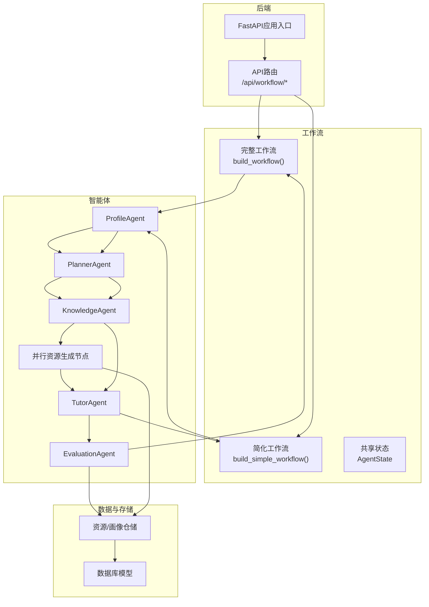
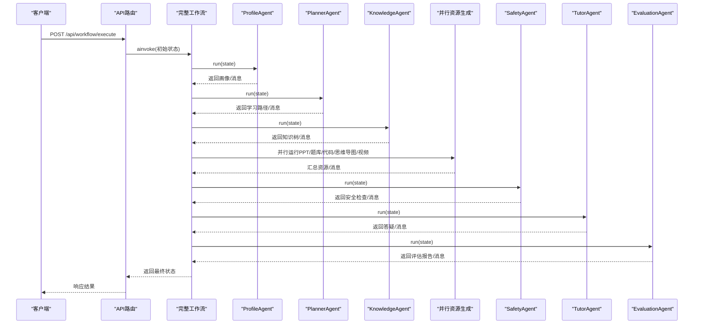
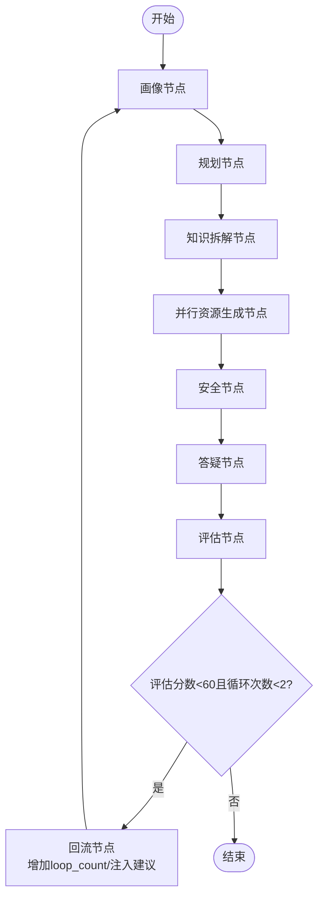
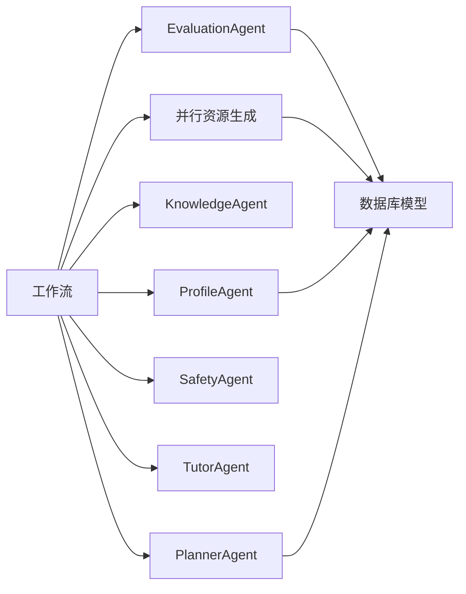

# 工作流编排

<cite>
**本文引用的文件**   
- [workflows/graph.py](file://workflows/graph.py)
- [workflows/simple_graph.py](file://workflows/simple_graph.py)
- [workflows/state.py](file://workflows/state.py)
- [agents/base.py](file://agents/base.py)
- [agents/profile_agent.py](file://agents/profile_agent.py)
- [agents/planner_agent.py](file://agents/planner_agent.py)
- [agents/knowledge_agent.py](file://agents/knowledge_agent.py)
- [agents/tutor_agent.py](file://agents/tutor_agent.py)
- [agents/evaluation_agent.py](file://agents/evaluation_agent.py)
- [api/routes/workflow.py](file://api/routes/workflow.py)
- [backend/main.py](file://backend/main.py)
- [schemas/profile.py](file://schemas/profile.py)
- [database/models.py](file://database/models.py)
- [scripts/test_workflow_direct.py](file://scripts/test_workflow_direct.py)
- [scripts/test_workflow_simple.py](file://scripts/test_workflow_simple.py)
</cite>

## 目录
1. [引言](#引言)
2. [项目结构](#项目结构)
3. [核心组件](#核心组件)
4. [架构总览](#架构总览)
5. [详细组件分析](#详细组件分析)
6. [依赖分析](#依赖分析)
7. [性能考量](#性能考量)
8. [故障排查指南](#故障排查指南)
9. [结论](#结论)
10. [附录](#附录)

## 引言
本文件围绕EduAgent基于LangGraph的多智能体工作流编排系统进行技术文档整理，重点覆盖：
- Graph类的实现原理与状态管理机制
- 智能体间的协调策略与状态转换逻辑
- 异常处理与超时控制策略
- 简化版工作流与完整版工作流的实现差异
- 性能优化、调试技巧与扩展指南
- 实际流程示例、最佳实践与常见问题解决方案

## 项目结构
EduAgent采用“多智能体 + LangGraph工作流”的分层组织方式，核心位于workflows目录，配合agents目录下的各Agent实现，通过FastAPI路由对外提供执行接口。

图表来源
- [backend/main.py:44-70](file://backend/main.py#L44-L70)
- [api/routes/workflow.py:54-79](file://api/routes/workflow.py#L54-L79)
- [workflows/graph.py:186-211](file://workflows/graph.py#L186-L211)
- [workflows/simple_graph.py:37-50](file://workflows/simple_graph.py#L37-L50)
- [workflows/state.py:7-24](file://workflows/state.py#L7-L24)
- [database/models.py:13-40](file://database/models.py#L13-L40)

章节来源
- [backend/main.py:44-70](file://backend/main.py#L44-L70)
- [api/routes/workflow.py:54-79](file://api/routes/workflow.py#L54-L79)
- [workflows/graph.py:186-211](file://workflows/graph.py#L186-L211)
- [workflows/simple_graph.py:37-50](file://workflows/simple_graph.py#L37-L50)
- [workflows/state.py:7-24](file://workflows/state.py#L7-L24)
- [database/models.py:13-40](file://database/models.py#L13-L40)

## 核心组件
- 工作流构建器：完整版与简化版两条编排路径，分别对应全量资源生成与核心问答闭环。
- 共享状态：统一的AgentState类型，承载画像、路径、知识树、资源、评估报告、消息历史、会话ID等。
- 智能体基类：统一run接口，确保各Agent以“状态输入、增量输出”的方式参与工作流。
- API路由：暴露工作流执行与状态查询接口，负责异常捕获与响应封装。

章节来源
- [workflows/graph.py:186-211](file://workflows/graph.py#L186-L211)
- [workflows/simple_graph.py:37-50](file://workflows/simple_graph.py#L37-L50)
- [workflows/state.py:7-24](file://workflows/state.py#L7-L24)
- [agents/base.py:7-13](file://agents/base.py#L7-L13)
- [api/routes/workflow.py:54-79](file://api/routes/workflow.py#L54-L79)

## 架构总览
完整工作流采用线性顺序节点与条件回流相结合的方式，形成“画像→规划→知识拆解→并行资源生成→安全→答疑→评估→回流/结束”的闭环。

图表来源
- [api/routes/workflow.py:54-79](file://api/routes/workflow.py#L54-L79)
- [workflows/graph.py:39-133](file://workflows/graph.py#L39-L133)
- [workflows/graph.py:186-211](file://workflows/graph.py#L186-L211)

## 详细组件分析

### Graph类与状态管理
- 图构建：通过StateGraph注册节点与边，设置入口节点与条件边，形成线性+条件的控制流。
- 状态类型：AgentState为TypedDict，包含可变字段（如messages）与不可变字段（如loop_count），并使用operator.add实现列表拼接的增量合并。
- 节点函数：每个节点包装对应Agent的run方法，返回增量字段；部分节点（如资源生成）使用并发聚合。
- 回流机制：评估节点后根据阈值与循环次数决定是否回流至“回流节点”，由回流节点更新loop_count与注入评估建议，再回到画像节点。

图表来源
- [workflows/graph.py:136-183](file://workflows/graph.py#L136-L183)
- [workflows/graph.py:186-211](file://workflows/graph.py#L186-L211)
- [workflows/state.py:7-24](file://workflows/state.py#L7-L24)

章节来源
- [workflows/graph.py:186-211](file://workflows/graph.py#L186-L211)
- [workflows/state.py:7-24](file://workflows/state.py#L7-L24)

### 简化版工作流
- 目标：快速验证核心链路，跳过资源生成阶段，聚焦画像→规划→知识拆解→答疑。
- 构建：与完整版类似，但移除资源生成与回流分支，终点直接结束。
- 适用：开发调试、性能压测、最小可用验证。

章节来源
- [workflows/simple_graph.py:37-50](file://workflows/simple_graph.py#L37-L50)

### 智能体间协调策略
- 统一接口：所有Agent实现BaseAgent.run，接收状态字典，返回增量字段，确保状态一致性与可组合性。
- 并发聚合：资源生成节点内部并发调用多个Agent，随后汇总结果，减少整体等待时间。
- 安全前置：安全节点在资源生成之后、答疑之前执行，保证后续内容合规。
- 评估驱动：评估节点作为决策点，结合阈值与循环次数决定是否回流，形成自适应学习闭环。

章节来源
- [agents/base.py:7-13](file://agents/base.py#L7-L13)
- [workflows/graph.py:73-98](file://workflows/graph.py#L73-L98)
- [workflows/graph.py:101-133](file://workflows/graph.py#L101-L133)

### 状态转换逻辑
- 线性流转：从画像→规划→知识→资源→安全→答疑→评估，每步仅依赖上一步输出。
- 条件回流：评估后根据分数与循环计数决定是否回流；回流节点更新loop_count与注入评估建议，再回到画像节点。
- 消息累积：messages字段使用operator.add进行列表拼接，便于追踪对话历史。

章节来源
- [workflows/graph.py:136-183](file://workflows/graph.py#L136-L183)
- [workflows/state.py:22](file://workflows/state.py#L22)

### 异常处理机制
- API层：捕获工作流执行异常，记录日志并向上抛出HTTP 500。
- Agent层：各Agent在调用外部服务（如星火、RAG检索）时均包含异常捕获与降级逻辑（规则兜底）。
- 数据持久化：资源与评估报告保存在独立线程中执行，异常仅记录警告，不影响主流程。

章节来源
- [api/routes/workflow.py:61-65](file://api/routes/workflow.py#L61-L65)
- [agents/planner_agent.py:183-190](file://agents/planner_agent.py#L183-L190)
- [agents/knowledge_agent.py:109-118](file://agents/knowledge_agent.py#L109-L118)
- [agents/tutor_agent.py:123-131](file://agents/tutor_agent.py#L123-L131)
- [agents/evaluation_agent.py:167-174](file://agents/evaluation_agent.py#L167-L174)
- [workflows/graph.py:51-71](file://workflows/graph.py#L51-L71)
- [workflows/graph.py:109-122](file://workflows/graph.py#L109-L122)

### 超时控制策略
- 当前实现未显式设置超时参数。建议在生产环境中：
  - 在API层对ainvoke设置超时；
  - 在Agent内部对外部调用（星火、RAG）设置连接/读取超时；
  - 对并发节点（资源生成）设置任务组超时上限，避免单点阻塞影响整体。

（本节为通用建议，不直接分析具体文件）

### 实现差异对比
- 完整版：包含资源生成与回流，适合端到端体验；简化版：仅核心链路，适合快速验证。
- 状态差异：简化版缺少资源相关字段与回流相关字段，初始状态也更精简。

章节来源
- [workflows/graph.py:214-220](file://workflows/graph.py#L214-L220)
- [workflows/simple_graph.py:53-59](file://workflows/simple_graph.py#L53-L59)

### 性能优化考虑
- 并发执行：资源生成节点使用并发聚合，显著降低总耗时。
- 降级策略：当外部服务不可用时，优先使用规则兜底，保障可用性。
- 消息累积：使用operator.add避免深拷贝，降低内存压力。
- 数据持久化：在独立线程中保存资源与评估报告，避免阻塞主流程。

章节来源
- [workflows/graph.py:73-98](file://workflows/graph.py#L73-L98)
- [workflows/graph.py:51-71](file://workflows/graph.py#L51-L71)
- [workflows/graph.py:109-122](file://workflows/graph.py#L109-L122)

### 调试技巧
- 直接调用：通过脚本直接构建简化工作流并执行，便于定位单节点问题。
- 分步测试：先单独测试画像与规划Agent，再逐步加入后续节点。
- 日志级别：提高日志级别观察消息累积与状态变化。

章节来源
- [scripts/test_workflow_direct.py:16-36](file://scripts/test_workflow_direct.py#L16-L36)
- [scripts/test_workflow_simple.py:18-46](file://scripts/test_workflow_simple.py#L18-L46)

### 实际流程示例
- 完整工作流执行：POST /api/workflow/execute，传入用户输入与可选会话ID，返回包含画像、路径、知识树、资源、评估报告与消息的历史。
- 状态查询：GET /api/workflow/status/{session_id}，返回该会话的画像、资源列表与评估报告列表。

章节来源
- [api/routes/workflow.py:54-79](file://api/routes/workflow.py#L54-L79)
- [api/routes/workflow.py:86-119](file://api/routes/workflow.py#L86-L119)

### 最佳实践建议
- 明确状态边界：仅在必要字段上扩展AgentState，避免过度耦合。
- 统一异常处理：在Agent与API层均保留异常捕获与降级，确保稳定性。
- 并发与限流：对高延迟外部服务设置并发上限与超时，防止雪崩。
- 可观测性：为关键节点添加结构化日志与指标埋点，便于追踪与告警。

（本节为通用建议，不直接分析具体文件）

### 常见问题解决方案
- 星火未配置：各Agent具备规则兜底逻辑，确保基本能力可用。
- 评估分数过低：回流机制会自动注入建议并重跑画像→规划→知识拆解流程。
- 资源保存失败：数据库异常仅记录警告，不影响主流程；可在后台任务中重试。

章节来源
- [agents/planner_agent.py:183-190](file://agents/planner_agent.py#L183-L190)
- [agents/knowledge_agent.py:109-118](file://agents/knowledge_agent.py#L109-L118)
- [agents/tutor_agent.py:123-131](file://agents/tutor_agent.py#L123-L131)
- [agents/evaluation_agent.py:167-174](file://agents/evaluation_agent.py#L167-L174)
- [workflows/graph.py:136-153](file://workflows/graph.py#L136-L153)
- [workflows/graph.py:51-71](file://workflows/graph.py#L51-L71)
- [workflows/graph.py:109-122](file://workflows/graph.py#L109-L122)

## 依赖分析
- 组件内聚：各Agent职责单一，通过统一状态与接口耦合度低。
- 外部依赖：星火、RAG检索、数据库与Redis缓存；均具备降级策略。
- 条件依赖：评估回流依赖评估报告与循环计数；资源生成依赖会话ID以持久化。

图表来源
- [workflows/graph.py:186-211](file://workflows/graph.py#L186-L211)
- [database/models.py:13-40](file://database/models.py#L13-L40)

章节来源
- [workflows/graph.py:186-211](file://workflows/graph.py#L186-L211)
- [database/models.py:13-40](file://database/models.py#L13-L40)

## 性能考量
- 并发聚合：资源生成节点并发执行多个Agent，显著缩短端到端时延。
- 降级策略：外部服务失败时快速切换规则兜底，提升鲁棒性。
- 状态增量：operator.add减少深拷贝成本，适合长对话与多轮迭代。
- 异步持久化：资源与评估报告保存在独立线程，避免阻塞主流程。

章节来源
- [workflows/graph.py:73-98](file://workflows/graph.py#L73-L98)
- [workflows/graph.py:51-71](file://workflows/graph.py#L51-L71)
- [workflows/graph.py:109-122](file://workflows/graph.py#L109-L122)

## 故障排查指南
- API异常：查看工作流执行异常日志，确认外部服务可用性与配置。
- Agent异常：检查星火/数据库/RAG检索的异常日志，确认降级是否生效。
- 数据持久化：关注资源与评估报告保存的警告日志，必要时重试或检查数据库连接。

章节来源
- [api/routes/workflow.py:61-65](file://api/routes/workflow.py#L61-L65)
- [agents/planner_agent.py:183-190](file://agents/planner_agent.py#L183-L190)
- [agents/knowledge_agent.py:109-118](file://agents/knowledge_agent.py#L109-L118)
- [agents/tutor_agent.py:123-131](file://agents/tutor_agent.py#L123-L131)
- [agents/evaluation_agent.py:167-174](file://agents/evaluation_agent.py#L167-L174)
- [workflows/graph.py:51-71](file://workflows/graph.py#L51-L71)
- [workflows/graph.py:109-122](file://workflows/graph.py#L109-L122)

## 结论
EduAgent的工作流编排以LangGraph为核心，通过清晰的节点职责划分与统一状态模型，实现了从画像到评估的闭环。完整版工作流覆盖端到端资源生成与回流优化，简化版工作流便于快速验证与调试。整体设计具备良好的可扩展性与可观测性，建议在生产环境中补充超时控制与并发限流策略，并持续完善监控与日志体系。

## 附录
- 数据模型概览：学生画像、学习资源、评估报告三类核心表，支持按会话ID检索与统计。
- 模型定义：学习路径、练习题集、代码案例集、PPT课件、思维导图、视频脚本等结构化输出模型，便于前端渲染与报告生成。

章节来源
- [database/models.py:13-40](file://database/models.py#L13-L40)
- [schemas/profile.py:55-88](file://schemas/profile.py#L55-L88)
- [schemas/profile.py:116-151](file://schemas/profile.py#L116-L151)
- [schemas/profile.py:166-207](file://schemas/profile.py#L166-L207)
- [schemas/profile.py:219-242](file://schemas/profile.py#L219-L242)
- [schemas/profile.py:253-286](file://schemas/profile.py#L253-L286)
- [schemas/profile.py:298-325](file://schemas/profile.py#L298-L325)