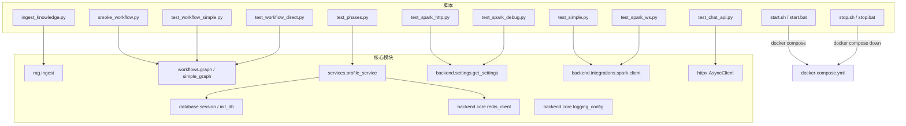
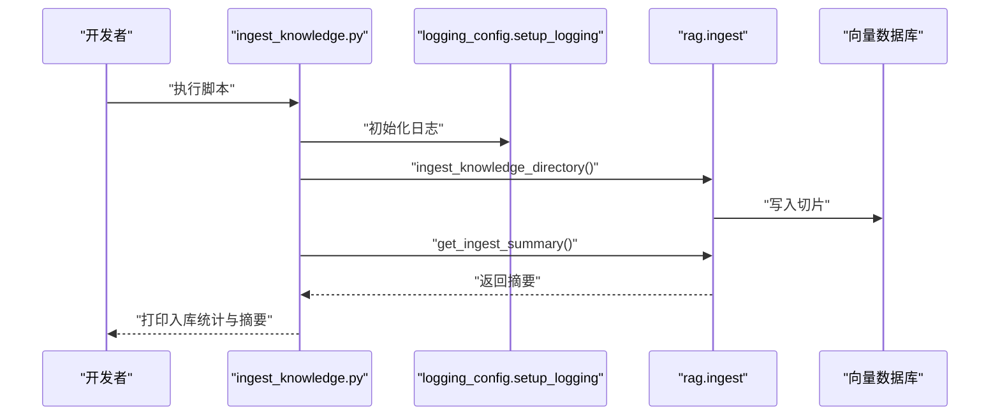
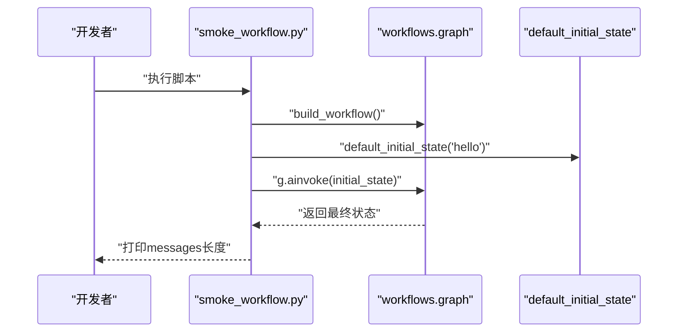
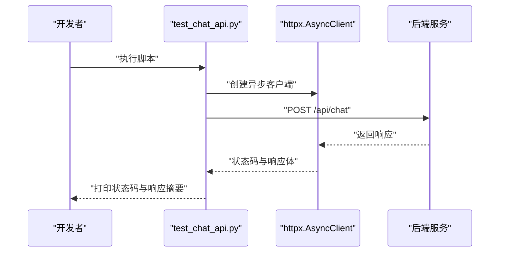
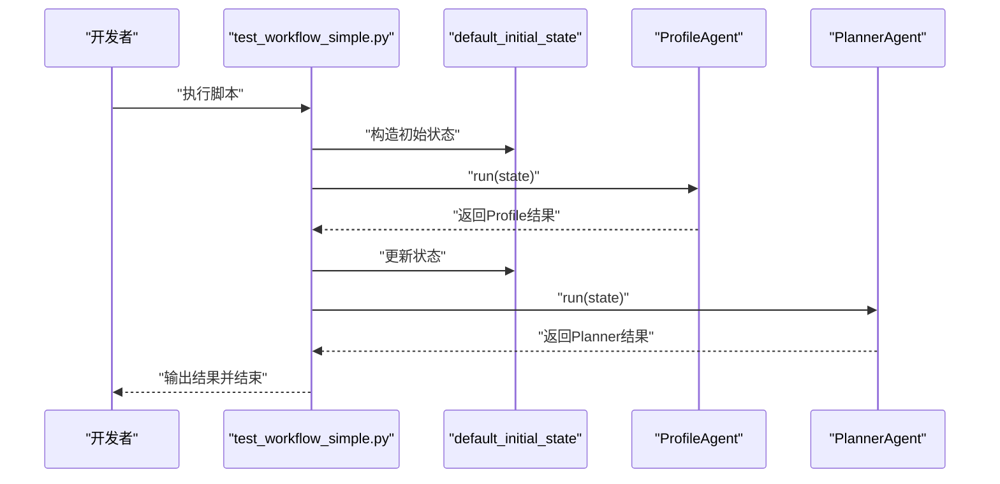
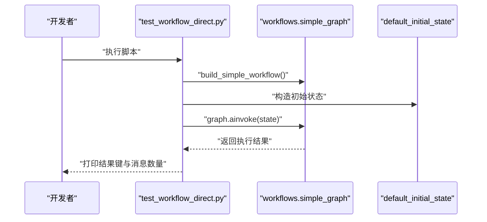
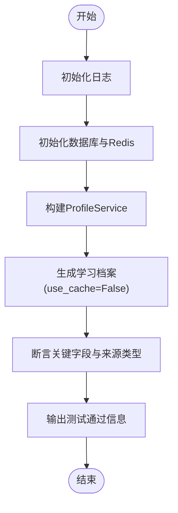
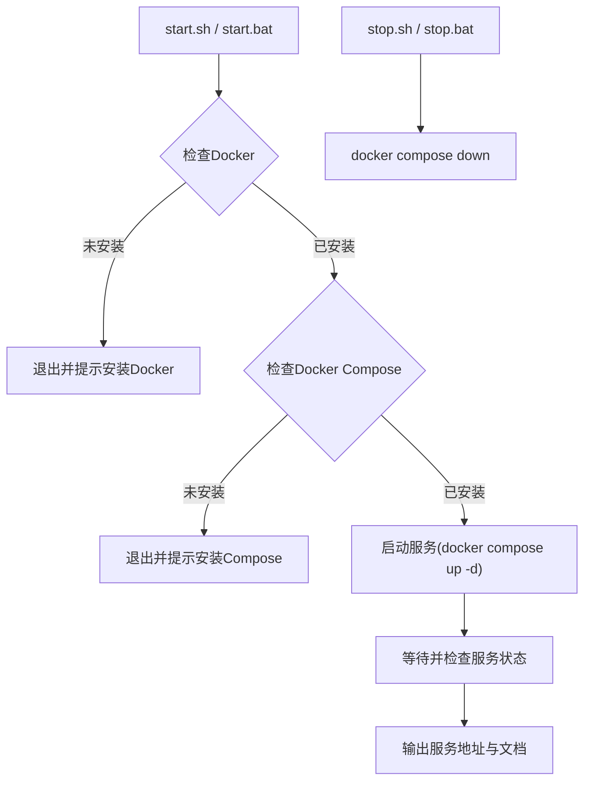
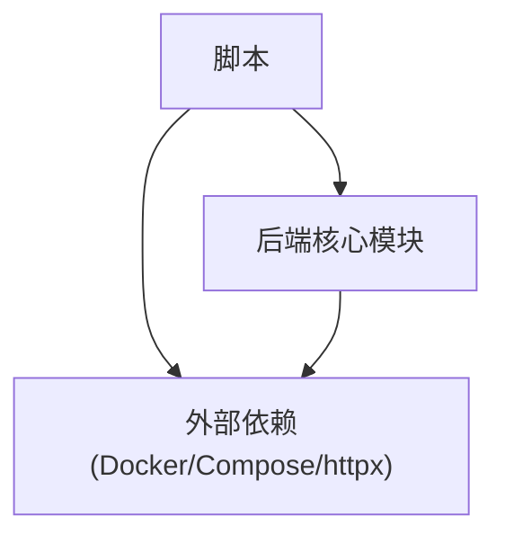

# 开发工具和脚本

<cite>
**本文引用的文件**
- [scripts/ingest_knowledge.py](file://scripts/ingest_knowledge.py)
- [scripts/smoke_workflow.py](file://scripts/smoke_workflow.py)
- [scripts/test_chat_api.py](file://scripts/test_chat_api.py)
- [scripts/test_workflow_simple.py](file://scripts/test_workflow_simple.py)
- [scripts/test_workflow_direct.py](file://scripts/test_workflow_direct.py)
- [scripts/test_simple.py](file://scripts/test_simple.py)
- [scripts/test_phases.py](file://scripts/test_phases.py)
- [scripts/test_spark_ws.py](file://scripts/test_spark_ws.py)
- [scripts/test_spark_http.py](file://scripts/test_spark_http.py)
- [scripts/test_spark_debug.py](file://scripts/test_spark_debug.py)
- [scripts/start.sh](file://scripts/start.sh)
- [scripts/stop.sh](file://scripts/stop.sh)
- [scripts/start.bat](file://scripts/start.bat)
- [scripts/stop.bat](file://scripts/stop.bat)
</cite>

## 目录
1. [简介](#简介)
2. [项目结构](#项目结构)
3. [核心组件](#核心组件)
4. [架构总览](#架构总览)
5. [详细组件分析](#详细组件分析)
6. [依赖分析](#依赖分析)
7. [性能考虑](#性能考虑)
8. [故障排查指南](#故障排查指南)
9. [结论](#结论)
10. [附录](#附录)

## 简介
本文件面向EduAgent的开发与测试团队，系统化梳理仓库中的开发工具与脚本，覆盖以下方面：
- 知识库导入脚本：将课程资料批量入库至向量数据库，支持日志初始化与入库摘要输出。
- 冒烟测试脚本：验证工作流主链路与阶段一至三的核心能力，确保基础模块可用。
- API测试脚本：对聊天接口进行异步请求测试，便于快速验证后端服务连通性与响应稳定性。
- 开发环境辅助工具：跨平台一键启动/停止脚本，支持后端单开模式与跳过构建优化。
- 调试与性能测试：针对星火（Spark）大模型的HTTP/WebSocket连接与多种认证方式的调试脚本。
- 自动化测试方案与持续集成配置建议：基于现有脚本的可扩展测试策略与CI流水线落地要点。

## 项目结构
EduAgent的脚本集中于scripts目录，按功能划分为：
- 知识库导入：ingest_knowledge.py
- 冒烟与工作流测试：smoke_workflow.py、test_workflow_simple.py、test_workflow_direct.py、test_phases.py
- API测试：test_chat_api.py
- 星火集成调试：test_simple.py、test_spark_ws.py、test_spark_http.py、test_spark_debug.py
- 开发环境启动/停止：start.sh、stop.sh（Linux/macOS）、start.bat、stop.bat（Windows）

```mermaid
graph TB
subgraph "脚本目录"
IK["ingest_knowledge.py"]
SW["smoke_workflow.py"]
TWS["test_workflow_simple.py"]
TWD["test_workflow_direct.py"]
TP["test_phases.py"]
TCA["test_chat_api.py"]
TSIM["test_simple.py"]
TSW["test_spark_ws.py"]
TSH["test_spark_http.py"]
TSD["test_spark_debug.py"]
START_SH["start.sh"]
STOP_SH["stop.sh"]
START_BAT["start.bat"]
STOP_BAT["stop.bat"]
end
IK --> |"调用RAG入库"| RAG["rag.ingest"]
SW --> |"构建工作流"| WF["workflows.graph"]
TWS --> |"调用Agent"| AG1["agents.profile_agent"]
TWS --> |"调用Agent"| AG2["agents.planner_agent"]
TWD --> |"构建简化工作流"| WFS["workflows.simple_graph"]
TP --> |"调用ProfileService"| PSVC["services.profile_service"]
TCA --> |"HTTP客户端"| API["httpx.AsyncClient"]
TSIM --> |"获取Spark客户端"| SPK["backend.integrations.spark.client"]
TSW --> |"获取Spark客户端"| SPK
TSH --> |"读取配置"| CFG["backend.settings.get_settings"]
TSD --> |"读取配置"| CFG
START_SH --> |"docker compose"| DC["docker-compose.yml"]
START_BAT --> |"docker compose"| DC
STOP_SH --> |"docker compose down"| DC
STOP_BAT --> |"docker compose down"| DC
```

图表来源
- [scripts/ingest_knowledge.py:1-23](file://scripts/ingest_knowledge.py#L1-L23)
- [scripts/smoke_workflow.py:1-19](file://scripts/smoke_workflow.py#L1-L19)
- [scripts/test_workflow_simple.py:1-51](file://scripts/test_workflow_simple.py#L1-L51)
- [scripts/test_workflow_direct.py:1-41](file://scripts/test_workflow_direct.py#L1-L41)
- [scripts/test_phases.py:1-47](file://scripts/test_phases.py#L1-L47)
- [scripts/test_chat_api.py:1-34](file://scripts/test_chat_api.py#L1-L34)
- [scripts/test_simple.py:1-31](file://scripts/test_simple.py#L1-L31)
- [scripts/test_spark_ws.py:1-28](file://scripts/test_spark_ws.py#L1-L28)
- [scripts/test_spark_http.py:1-62](file://scripts/test_spark_http.py#L1-L62)
- [scripts/test_spark_debug.py:1-58](file://scripts/test_spark_debug.py#L1-L58)
- [scripts/start.sh:1-132](file://scripts/start.sh#L1-L132)
- [scripts/start.bat:1-72](file://scripts/start.bat#L1-L72)
- [scripts/stop.sh:1-19](file://scripts/stop.sh#L1-L19)
- [scripts/stop.bat:1-16](file://scripts/stop.bat#L1-L16)

章节来源
- [scripts/ingest_knowledge.py:1-23](file://scripts/ingest_knowledge.py#L1-L23)
- [scripts/smoke_workflow.py:1-19](file://scripts/smoke_workflow.py#L1-L19)
- [scripts/test_chat_api.py:1-34](file://scripts/test_chat_api.py#L1-L34)
- [scripts/test_workflow_simple.py:1-51](file://scripts/test_workflow_simple.py#L1-L51)
- [scripts/test_workflow_direct.py:1-41](file://scripts/test_workflow_direct.py#L1-L41)
- [scripts/test_simple.py:1-31](file://scripts/test_simple.py#L1-L31)
- [scripts/test_phases.py:1-47](file://scripts/test_phases.py#L1-L47)
- [scripts/test_spark_ws.py:1-28](file://scripts/test_spark_ws.py#L1-L28)
- [scripts/test_spark_http.py:1-62](file://scripts/test_spark_http.py#L1-L62)
- [scripts/test_spark_debug.py:1-58](file://scripts/test_spark_debug.py#L1-L58)
- [scripts/start.sh:1-132](file://scripts/start.sh#L1-L132)
- [scripts/stop.sh:1-19](file://scripts/stop.sh#L1-L19)
- [scripts/start.bat:1-72](file://scripts/start.bat#L1-L72)
- [scripts/stop.bat:1-16](file://scripts/stop.bat#L1-L16)

## 核心组件
- 知识库导入脚本：负责将knowledge/目录下的课程资料加载到ChromaDB，输出新增/更新切片数量与入库摘要。
- 冒烟测试脚本：验证工作流主链路与阶段一至三的Profile构建逻辑，确保数据库、Redis与服务层基本可用。
- API测试脚本：对聊天接口发起异步POST请求，输出状态码与响应内容，便于快速验证后端服务。
- 星火集成调试脚本：提供WebSocket与HTTP两种连接方式的测试，覆盖不同认证头与参数组合，便于定位集成问题。
- 开发环境启动/停止脚本：跨平台一键启动/停止容器编排，支持后端单开与跳过构建优化。

章节来源
- [scripts/ingest_knowledge.py:1-23](file://scripts/ingest_knowledge.py#L1-L23)
- [scripts/smoke_workflow.py:1-19](file://scripts/smoke_workflow.py#L1-L19)
- [scripts/test_chat_api.py:1-34](file://scripts/test_chat_api.py#L1-L34)
- [scripts/test_phases.py:1-47](file://scripts/test_phases.py#L1-L47)
- [scripts/test_spark_ws.py:1-28](file://scripts/test_spark_ws.py#L1-L28)
- [scripts/test_spark_http.py:1-62](file://scripts/test_spark_http.py#L1-L62)
- [scripts/test_spark_debug.py:1-58](file://scripts/test_spark_debug.py#L1-L58)
- [scripts/start.sh:1-132](file://scripts/start.sh#L1-L132)
- [scripts/start.bat:1-72](file://scripts/start.bat#L1-L72)
- [scripts/stop.sh:1-19](file://scripts/stop.sh#L1-L19)
- [scripts/stop.bat:1-16](file://scripts/stop.bat#L1-L16)

## 架构总览
下图展示脚本与核心模块之间的交互关系，包括RAG入库、工作流执行、服务层调用与外部集成等。

图表来源
- [scripts/ingest_knowledge.py:1-23](file://scripts/ingest_knowledge.py#L1-L23)
- [scripts/smoke_workflow.py:1-19](file://scripts/smoke_workflow.py#L1-L19)
- [scripts/test_workflow_simple.py:1-51](file://scripts/test_workflow_simple.py#L1-L51)
- [scripts/test_workflow_direct.py:1-41](file://scripts/test_workflow_direct.py#L1-L41)
- [scripts/test_phases.py:1-47](file://scripts/test_phases.py#L1-L47)
- [scripts/test_chat_api.py:1-34](file://scripts/test_chat_api.py#L1-L34)
- [scripts/test_simple.py:1-31](file://scripts/test_simple.py#L1-L31)
- [scripts/test_spark_ws.py:1-28](file://scripts/test_spark_ws.py#L1-L28)
- [scripts/test_spark_http.py:1-62](file://scripts/test_spark_http.py#L1-L62)
- [scripts/test_spark_debug.py:1-58](file://scripts/test_spark_debug.py#L1-L58)
- [scripts/start.sh:1-132](file://scripts/start.sh#L1-L132)
- [scripts/start.bat:1-72](file://scripts/start.bat#L1-L72)
- [scripts/stop.sh:1-19](file://scripts/stop.sh#L1-L19)
- [scripts/stop.bat:1-16](file://scripts/stop.bat#L1-L16)

## 详细组件分析

### 知识库导入脚本（ingest_knowledge.py）
- 功能概述
  - 初始化日志配置，调用RAG入库模块将knowledge/目录下的课程资料写入向量数据库，并输出新增/更新切片数量与入库摘要。
- 执行流程
  - 设置根路径以便导入后端模块
  - 初始化日志
  - 调用入库函数统计入库条目数
  - 获取入库摘要并打印
- 使用方法
  - 在项目根目录执行脚本，确保后端依赖与向量数据库服务已启动
- 复杂度与性能
  - 入库复杂度取决于数据量与分块策略；建议在非生产环境执行，避免阻塞
- 错误处理
  - 若向量数据库或文件系统异常，脚本会抛出异常并终止

图表来源
- [scripts/ingest_knowledge.py:1-23](file://scripts/ingest_knowledge.py#L1-L23)

章节来源
- [scripts/ingest_knowledge.py:1-23](file://scripts/ingest_knowledge.py#L1-L23)

### 冒烟测试脚本（smoke_workflow.py）
- 功能概述
  - 构建工作流并传入默认初始状态，异步执行一次主链路，校验消息数量是否产生预期增长。
- 执行流程
  - 设置根路径导入工作流模块
  - 构建工作流实例
  - 传入初始状态并异步执行
  - 输出messages长度用于冒烟验证
- 使用方法
  - 在项目根目录执行脚本，确保后端服务与数据库可用
- 复杂度与性能
  - 异步执行，整体开销较小，适合快速冒烟

图表来源
- [scripts/smoke_workflow.py:1-19](file://scripts/smoke_workflow.py#L1-L19)

章节来源
- [scripts/smoke_workflow.py:1-19](file://scripts/smoke_workflow.py#L1-L19)

### API测试脚本（test_chat_api.py）
- 功能概述
  - 对后端聊天接口发起异步POST请求，输出状态码与响应文本片段，便于快速验证服务连通性。
- 执行流程
  - 设置标准输出编码以支持中文
  - 初始化根路径导入HTTP客户端
  - 发送POST请求到本地后端API
  - 打印状态码与响应摘要
- 使用方法
  - 确保后端服务已在本地8001端口运行，然后执行脚本
- 复杂度与性能
  - 异步HTTP请求，延迟主要由网络与后端处理决定

图表来源
- [scripts/test_chat_api.py:1-34](file://scripts/test_chat_api.py#L1-L34)

章节来源
- [scripts/test_chat_api.py:1-34](file://scripts/test_chat_api.py#L1-L34)

### 工作流简化测试（test_workflow_simple.py）
- 功能概述
  - 排除资源生成阶段，直接测试ProfileAgent与PlannerAgent的协作，输出中间结果并更新状态。
- 执行流程
  - 设置根路径与日志级别
  - 构造初始状态
  - 依次执行ProfileAgent与PlannerAgent
  - 更新状态并输出结果
- 使用方法
  - 在项目根目录执行脚本，确保Agent与工作流模块可用
- 复杂度与性能
  - 异步执行两个Agent，整体耗时取决于Agent内部逻辑

图表来源
- [scripts/test_workflow_simple.py:1-51](file://scripts/test_workflow_simple.py#L1-L51)

章节来源
- [scripts/test_workflow_simple.py:1-51](file://scripts/test_workflow_simple.py#L1-L51)

### 工作流直接测试（test_workflow_direct.py）
- 功能概述
  - 不经HTTP，直接调用简化工作流，打印执行结果的关键键与消息列表。
- 执行流程
  - 设置根路径与日志级别
  - 构建简化工作流与初始状态
  - 直接调用ainvoke执行并打印结果
- 使用方法
  - 在项目根目录执行脚本，适用于快速验证工作流逻辑

图表来源
- [scripts/test_workflow_direct.py:1-41](file://scripts/test_workflow_direct.py#L1-L41)

章节来源
- [scripts/test_workflow_direct.py:1-41](file://scripts/test_workflow_direct.py#L1-L41)

### 阶段一至三冒烟测试（test_phases.py）
- 功能概述
  - 在不依赖星火API的前提下，测试ProfileService的构建逻辑与启发式规则，断言关键字段与来源类型。
- 执行流程
  - 初始化日志
  - 初始化数据库与Redis客户端
  - 构建ProfileService并生成学习档案
  - 断言关键字段与来源类型
  - 输出测试通过信息
- 使用方法
  - 在项目根目录执行脚本，确保数据库与Redis可用

图表来源
- [scripts/test_phases.py:1-47](file://scripts/test_phases.py#L1-L47)

章节来源
- [scripts/test_phases.py:1-47](file://scripts/test_phases.py#L1-L47)

### 星火连接简单测试（test_simple.py）
- 功能概述
  - 直接获取星火客户端并尝试一次对话，输出配置状态与回复内容。
- 执行流程
  - 设置根路径
  - 获取星火客户端
  - 判断配置状态
  - 发起一次对话并打印回复
- 使用方法
  - 在项目根目录执行脚本，确保星火配置正确

章节来源
- [scripts/test_simple.py:1-31](file://scripts/test_simple.py#L1-L31)

### 星火WebSocket测试（test_spark_ws.py）
- 功能概述
  - 读取配置并通过WebSocket与星火通信，打印配置信息与回复摘要。
- 执行流程
  - 设置根路径
  - 读取设置并获取星火客户端
  - 调用chat方法并打印回复前200字符
- 使用方法
  - 在项目根目录执行脚本，确保星火配置正确

章节来源
- [scripts/test_spark_ws.py:1-28](file://scripts/test_spark_ws.py#L1-L28)

### 星火HTTP详细调试（test_spark_http.py）
- 功能概述
  - 详细打印配置信息与请求头，构造payload并发送HTTP请求，输出响应状态、头与体。
- 执行流程
  - 设置根路径
  - 读取设置并打印关键配置
  - 构造认证字符串与payload
  - 发送POST请求并打印响应
- 使用方法
  - 在项目根目录执行脚本，便于定位HTTP集成问题

章节来源
- [scripts/test_spark_http.py:1-62](file://scripts/test_spark_http.py#L1-L62)

### 星火HTTP多认证方式调试（test_spark_debug.py）
- 功能概述
  - 尝试多种Authorization头格式，逐个测试HTTP请求响应，便于定位认证问题。
- 执行流程
  - 设置根路径
  - 读取设置并构造不同认证头
  - 循环发送请求并打印响应状态与体
- 使用方法
  - 在项目根目录执行脚本，便于对比不同认证方式的兼容性

章节来源
- [scripts/test_spark_debug.py:1-58](file://scripts/test_spark_debug.py#L1-L58)

### 跨平台启动/停止脚本
- Linux/macOS（start.sh / stop.sh）
  - start.sh支持跳过构建与后端单开模式，自动检测Docker与Compose版本，启动容器并输出服务状态
  - stop.sh关闭所有服务
- Windows（start.bat / stop.bat）
  - 自动搜索docker-compose.yml并启动/停止服务，输出前端、后端与API文档访问地址

图表来源
- [scripts/start.sh:1-132](file://scripts/start.sh#L1-L132)
- [scripts/start.bat:1-72](file://scripts/start.bat#L1-L72)
- [scripts/stop.sh:1-19](file://scripts/stop.sh#L1-L19)
- [scripts/stop.bat:1-16](file://scripts/stop.bat#L1-L16)

章节来源
- [scripts/start.sh:1-132](file://scripts/start.sh#L1-L132)
- [scripts/stop.sh:1-19](file://scripts/stop.sh#L1-L19)
- [scripts/start.bat:1-72](file://scripts/start.bat#L1-L72)
- [scripts/stop.bat:1-16](file://scripts/stop.bat#L1-L16)

## 依赖分析
- 组件内聚与耦合
  - 各脚本通过相对路径插入根目录实现模块导入，降低跨层耦合
  - 大部分脚本仅依赖后端核心模块（如settings、redis_client、logging_config），保持低耦合高内聚
- 外部依赖
  - Docker与docker-compose用于服务编排
  - httpx用于HTTP测试
  - 星火集成客户端与配置模块用于大模型对接
- 潜在循环依赖
  - 当前脚本均为独立入口，未见循环依赖迹象

图表来源
- [scripts/ingest_knowledge.py:1-23](file://scripts/ingest_knowledge.py#L1-L23)
- [scripts/test_chat_api.py:1-34](file://scripts/test_chat_api.py#L1-L34)
- [scripts/test_spark_http.py:1-62](file://scripts/test_spark_http.py#L1-L62)
- [scripts/start.sh:1-132](file://scripts/start.sh#L1-L132)

章节来源
- [scripts/ingest_knowledge.py:1-23](file://scripts/ingest_knowledge.py#L1-L23)
- [scripts/test_chat_api.py:1-34](file://scripts/test_chat_api.py#L1-L34)
- [scripts/test_spark_http.py:1-62](file://scripts/test_spark_http.py#L1-L62)
- [scripts/start.sh:1-132](file://scripts/start.sh#L1-L132)

## 性能考虑
- 入库性能
  - 入库操作与分块策略密切相关，建议在非高峰时段执行，避免影响在线服务
- 工作流执行
  - 使用异步执行减少阻塞，合理设置超时时间
- API测试
  - 控制响应体大小与超时，避免长时间占用连接
- 星火集成
  - WebSocket与HTTP两种方式可根据场景选择，注意并发与限流策略

## 故障排查指南
- Docker/Compose问题
  - 确认Docker与Compose已安装且在PATH中；若启动失败，尝试重建镜像
- 服务状态
  - 使用脚本内置的状态检查命令确认后端与前端服务是否就绪
- 星火集成
  - 使用HTTP详细调试脚本打印配置与请求头，核对认证方式与域名
  - 使用多认证方式调试脚本对比不同Authorization头的响应
- 日志与输出
  - 启用日志配置并关注脚本输出，定位异常发生点

章节来源
- [scripts/start.sh:1-132](file://scripts/start.sh#L1-L132)
- [scripts/start.bat:1-72](file://scripts/start.bat#L1-L72)
- [scripts/test_spark_http.py:1-62](file://scripts/test_spark_http.py#L1-L62)
- [scripts/test_spark_debug.py:1-58](file://scripts/test_spark_debug.py#L1-L58)

## 结论
本文件系统化梳理了EduAgent的开发工具与脚本，明确了各脚本的功能、执行流程与使用方法，并提供了可视化架构图与序列图帮助理解。结合脚本特性，建议在日常开发中：
- 使用冒烟测试脚本快速验证工作流主链路
- 使用API测试脚本验证后端接口连通性
- 使用星火调试脚本定位集成问题
- 使用跨平台启动/停止脚本统一开发环境管理
- 基于现有脚本扩展自动化测试与CI流水线

## 附录
- 实际使用示例
  - 启动服务：在Linux/macOS上执行脚本并根据参数选择后端单开或全量启动；在Windows上执行批处理脚本
  - 导入知识库：在项目根目录执行知识库导入脚本，观察入库统计与摘要
  - 工作流测试：执行简化或直接工作流测试脚本，查看Agent输出与状态更新
  - API测试：确保后端服务运行后执行API测试脚本，观察状态码与响应
  - 星火调试：根据需要选择WebSocket或HTTP调试脚本，逐步定位问题
- 测试策略
  - 分层测试：先阶段冒烟，再工作流测试，最后API与集成测试
  - 并行测试：利用异步脚本并行执行多个测试任务
  - 回归测试：在每次重大改动后执行冒烟与阶段测试
- 开发效率提升技巧
  - 使用跳过构建参数加速启动
  - 使用后端单开模式聚焦后端开发
  - 将常用测试封装为别名或Makefile目标，减少重复输入