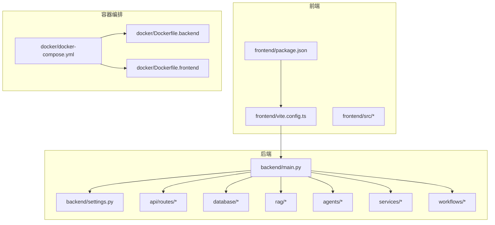
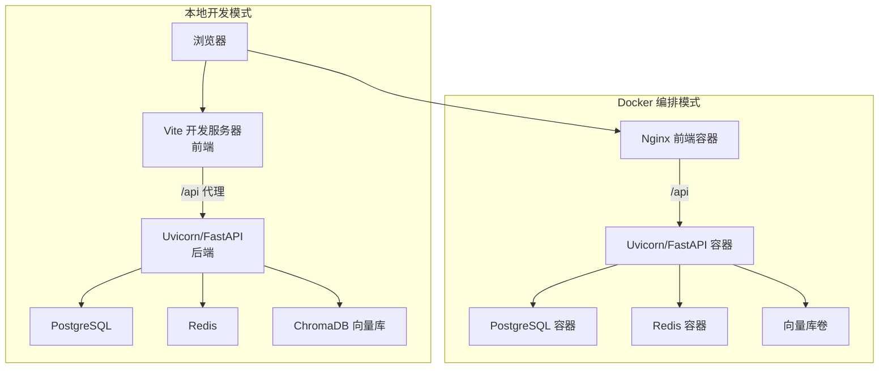
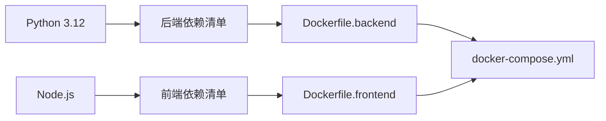

# 快速开始

<cite>
**本文引用的文件**
- [README.md](file://README.md)
- [requirements.txt](file://requirements.txt)
- [backend/main.py](file://backend/main.py)
- [backend/settings.py](file://backend/settings.py)
- [frontend/package.json](file://frontend/package.json)
- [frontend/vite.config.ts](file://frontend/vite.config.ts)
- [docker/docker-compose.yml](file://docker/docker-compose.yml)
- [docker/Dockerfile.backend](file://docker/Dockerfile.backend)
- [docker/Dockerfile.frontend](file://docker/Dockerfile.frontend)
- [scripts/start.sh](file://scripts/start.sh)
- [scripts/start.bat](file://scripts/start.bat)
- [scripts/start.ps1](file://scripts/start.ps1)
- [scripts/ingest_knowledge.py](file://scripts/ingest_knowledge.py)
</cite>

## 目录
1. [简介](#简介)
2. [项目结构](#项目结构)
3. [核心组件](#核心组件)
4. [架构总览](#架构总览)
5. [详细组件分析](#详细组件分析)
6. [依赖分析](#依赖分析)
7. [性能考虑](#性能考虑)
8. [故障排除指南](#故障排除指南)
9. [结论](#结论)
10. [附录](#附录)

## 简介
本指南面向首次接触 EduAgent 的开发者与测试人员，帮助你在 Windows、Linux 和 macOS 上快速完成环境搭建与系统运行。你将学会：
- Python 环境准备与依赖安装
- 环境变量配置（.env）
- RAG 知识库初始化
- 后端 FastAPI 服务启动
- 前端 Vue3 应用运行
- Docker 一键启动（可选）
- 常见问题排查与端口冲突处理
- 依赖版本兼容性提示

## 项目结构
EduAgent 采用前后端分离架构，后端为 FastAPI，前端为 Vue3 + Vite，配合 Docker Compose 实现数据库、缓存与服务编排。

图表来源
- [backend/main.py:1-70](file://backend/main.py#L1-L70)
- [backend/settings.py:1-67](file://backend/settings.py#L1-L67)
- [frontend/package.json:1-28](file://frontend/package.json#L1-L28)
- [frontend/vite.config.ts:1-17](file://frontend/vite.config.ts#L1-L17)
- [docker/docker-compose.yml:1-95](file://docker/docker-compose.yml#L1-L95)
- [docker/Dockerfile.backend:1-34](file://docker/Dockerfile.backend#L1-L34)
- [docker/Dockerfile.frontend:1-19](file://docker/Dockerfile.frontend#L1-L19)

章节来源
- [README.md:23-40](file://README.md#L23-L40)
- [backend/main.py:1-70](file://backend/main.py#L1-L70)
- [frontend/package.json:1-28](file://frontend/package.json#L1-L28)
- [docker/docker-compose.yml:1-95](file://docker/docker-compose.yml#L1-L95)

## 核心组件
- 后端入口与生命周期管理：后端主程序负责加载设置、初始化数据库与 Redis、注册路由，并在启动时可选择自动进行 RAG 入库。
- 设置与环境变量：通过 pydantic-settings 从 .env 加载配置，支持数据库、缓存、讯飞 API、RAG 等参数。
- 前端开发服务器与代理：Vite 开发服务器默认监听本地端口，通过代理将 /api 请求转发至后端。
- 容器编排：Docker Compose 提供数据库、缓存与后端/前端服务的统一启动与健康检查。

章节来源
- [backend/main.py:23-70](file://backend/main.py#L23-L70)
- [backend/settings.py:6-67](file://backend/settings.py#L6-L67)
- [frontend/vite.config.ts:8-16](file://frontend/vite.config.ts#L8-L16)
- [docker/docker-compose.yml:1-95](file://docker/docker-compose.yml#L1-L95)

## 架构总览
下图展示了本地开发与 Docker 两种运行模式下的交互关系。

图表来源
- [frontend/vite.config.ts:8-16](file://frontend/vite.config.ts#L8-L16)
- [backend/main.py:46-70](file://backend/main.py#L46-L70)
- [docker/docker-compose.yml:1-95](file://docker/docker-compose.yml#L1-L95)

## 详细组件分析

### 环境准备与依赖安装
- Python 环境
  - 推荐使用 Python 3.12（与后端镜像一致），确保 pip 可用。
  - 安装后端依赖：根据依赖清单安装所需包。
- 前端环境
  - 安装 Node.js 与 npm（推荐使用当前 LTS 版本）。
  - 在前端目录安装依赖。
- Docker（可选）
  - 安装 Docker 与 Docker Compose（Compose v1 或 v2 均可）。

章节来源
- [requirements.txt:1-18](file://requirements.txt#L1-L18)
- [frontend/package.json:1-28](file://frontend/package.json#L1-L28)
- [scripts/start.sh:40-66](file://scripts/start.sh#L40-L66)
- [scripts/start.bat:36-44](file://scripts/start.bat#L36-L44)
- [scripts/start.ps1:19-43](file://scripts/start.ps1#L19-L43)

### 环境变量与密钥配置
- 复制示例文件并填写本地密钥（仅本地 .env，不要提交到仓库）。
- 讯飞相关配置项用于 WebSocket/HTTP 接入，未配置时部分功能以规则引擎兜底。
- 关键配置项包括数据库连接、缓存连接、CORS 允许来源、RAG 目录与模型、讯飞 API 参数等。

章节来源
- [README.md:57-61](file://README.md#L57-L61)
- [README.md:95-111](file://README.md#L95-L111)
- [backend/settings.py:6-67](file://backend/settings.py#L6-L67)

### RAG 知识库初始化
- 首次运行会在本地下载嵌入模型并把知识目录中的文档切片入库到向量库。
- 可通过脚本执行入库流程；也可在后端启动时自动触发（需开启相应开关）。

章节来源
- [README.md:69-73](file://README.md#L69-L73)
- [scripts/ingest_knowledge.py:13-22](file://scripts/ingest_knowledge.py#L13-L22)
- [backend/main.py:32-41](file://backend/main.py#L32-L41)

### 后端 FastAPI 服务启动
- 本地开发
  - 使用 uvicorn 启动后端应用，绑定本地回环地址与指定端口。
- Docker 编排
  - 通过 Compose 启动后端容器，默认暴露 8000 端口；前端容器通过反向代理访问后端。

章节来源
- [README.md:63-67](file://README.md#L63-L67)
- [docker/docker-compose.yml:47-65](file://docker/docker-compose.yml#L47-L65)
- [docker/Dockerfile.backend:33](file://docker/Dockerfile.backend#L33)

### 前端 Vue3 应用运行
- 本地开发
  - 在前端目录安装依赖后，启动 Vite 开发服务器。
  - Vite 将 /api 代理到后端地址（默认指向本地其他端口，需与后端保持一致）。
- Docker 编排
  - 前端容器使用 Nginx 提供静态页面服务，通过反向代理访问后端。

章节来源
- [README.md:75-81](file://README.md#L75-L81)
- [frontend/package.json:6-10](file://frontend/package.json#L6-L10)
- [frontend/vite.config.ts:8-16](file://frontend/vite.config.ts#L8-L16)
- [docker/docker-compose.yml:67-84](file://docker/docker-compose.yml#L67-L84)
- [docker/Dockerfile.frontend:10-18](file://docker/Dockerfile.frontend#L10-L18)

### Docker 一键启动（Windows/Linux/macOS）
- Linux/macOS
  - 使用 Bash 脚本，支持跳过构建与仅启动后端两种模式。
- Windows（PowerShell）
  - 使用 PowerShell 脚本，支持跳过构建、跳过 npm 安装与仅启动后端。
- Windows（批处理）
  - 使用批处理脚本，自动查找 Compose 文件并启动服务。

章节来源
- [scripts/start.sh:1-132](file://scripts/start.sh#L1-L132)
- [scripts/start.ps1:1-126](file://scripts/start.ps1#L1-L126)
- [scripts/start.bat:1-72](file://scripts/start.bat#L1-L72)

## 依赖分析
- 后端依赖
  - FastAPI、Uvicorn、Pydantic Settings、LangChain/LangGraph、ChromaDB、SQLAlchemy、PostgreSQL 驱动、Redis、HTTPX/Websockets、文件解析库等。
- 前端依赖
  - Vue3、Vite、TailwindCSS、TypeScript、Mermaid、Marked 等。
- 容器镜像
  - 后端镜像基于 Python 3.12，前端镜像基于 Node 22，最终 Nginx 提供静态服务。

图表来源
- [requirements.txt:1-18](file://requirements.txt#L1-L18)
- [frontend/package.json:11-26](file://frontend/package.json#L11-L26)
- [docker/Dockerfile.backend:1-34](file://docker/Dockerfile.backend#L1-L34)
- [docker/Dockerfile.frontend:1-19](file://docker/Dockerfile.frontend#L1-L19)
- [docker/docker-compose.yml:1-95](file://docker/docker-compose.yml#L1-L95)

章节来源
- [requirements.txt:1-18](file://requirements.txt#L1-L18)
- [frontend/package.json:11-26](file://frontend/package.json#L11-L26)
- [docker/Dockerfile.backend:10](file://docker/Dockerfile.backend#L10)
- [docker/Dockerfile.frontend:5-8](file://docker/Dockerfile.frontend#L5-L8)

## 性能考虑
- 首次启动时 RAG 模型下载与知识入库会占用较多时间，建议在网络稳定环境下进行。
- Docker 模式下，数据库与缓存使用独立容器，可提升隔离性与稳定性。
- 生产部署建议启用 HTTPS、限制 CORS 来源、合理设置超时与重试策略。

## 故障排除指南
- 端口冲突
  - 后端默认端口 8000，前端默认端口 8080（Docker 模式）或 5173（Vite 模式）。若冲突，请修改对应配置或停止占用进程。
- Docker 无法启动
  - 确认 Docker 与 Docker Compose 已正确安装且正在运行；检查 Compose 文件路径是否正确。
- 健康检查失败
  - 查看后端/前端健康检查命令返回；确认数据库与缓存服务可用。
- Vite 代理无效
  - 确认前端代理目标地址与后端实际监听地址一致；重启开发服务器。
- RAG 初始化失败
  - 检查知识目录权限与网络连通性；必要时手动执行入库脚本。

章节来源
- [docker/docker-compose.yml:8-16](file://docker/docker-compose.yml#L8-L16)
- [docker/docker-compose.yml:22-30](file://docker/docker-compose.yml#L22-L30)
- [docker/docker-compose.yml:57-62](file://docker/docker-compose.yml#L57-L62)
- [docker/docker-compose.yml:76-81](file://docker/docker-compose.yml#L76-L81)
- [frontend/vite.config.ts:9-13](file://frontend/vite.config.ts#L9-L13)
- [scripts/ingest_knowledge.py:13-22](file://scripts/ingest_knowledge.py#L13-L22)

## 结论
通过本指南，你可以快速完成 EduAgent 的本地开发环境搭建与运行。建议优先使用 Docker 一键启动以获得最稳定的初始体验；在需要调试后端或进行本地开发时，再切换到本地模式。遇到问题时，优先检查端口占用、Docker 服务状态与健康检查结果。

## 附录

### 快速命令清单
- 环境准备与依赖安装
  - 复制并编辑 .env
  - 安装后端依赖
  - 安装前端依赖
- 后端启动
  - 本地：uvicorn 启动后端
  - Docker：Compose 启动后端容器
- RAG 入库
  - 执行入库脚本
- 前端运行
  - 本地：Vite 开发服务器
  - Docker：Nginx 容器提供静态页面
- 一键启动脚本
  - Linux/macOS：Bash 脚本
  - Windows：PowerShell/批处理脚本

章节来源
- [README.md:57-81](file://README.md#L57-L81)
- [scripts/start.sh:1-132](file://scripts/start.sh#L1-L132)
- [scripts/start.ps1:1-126](file://scripts/start.ps1#L1-L126)
- [scripts/start.bat:1-72](file://scripts/start.bat#L1-L72)