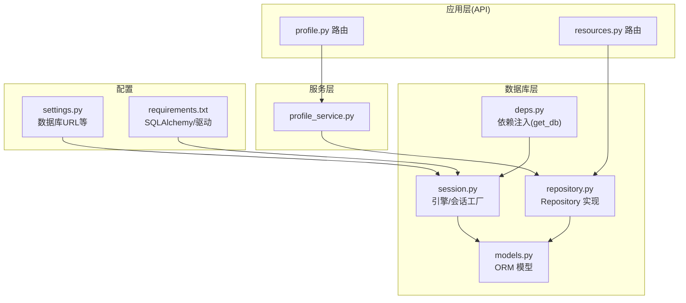
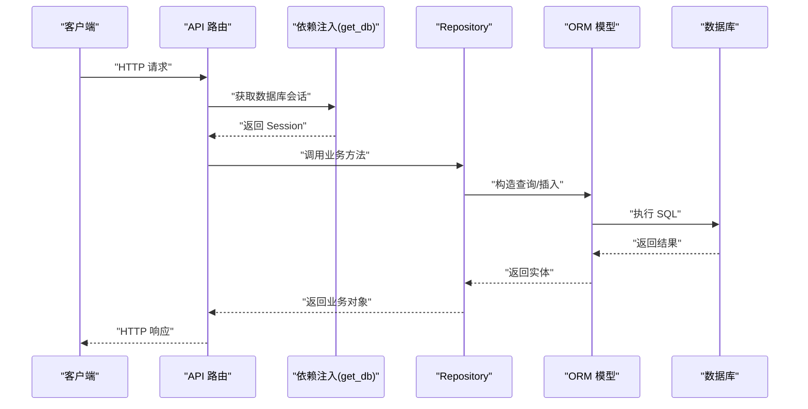
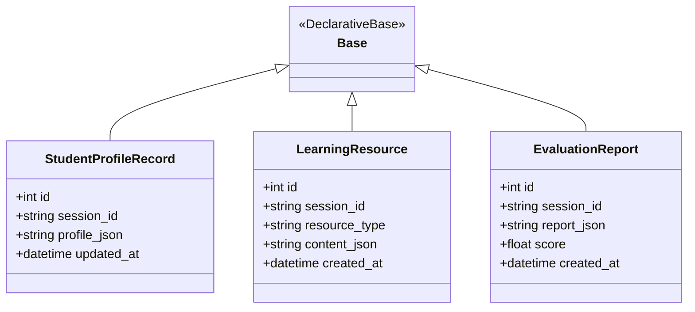
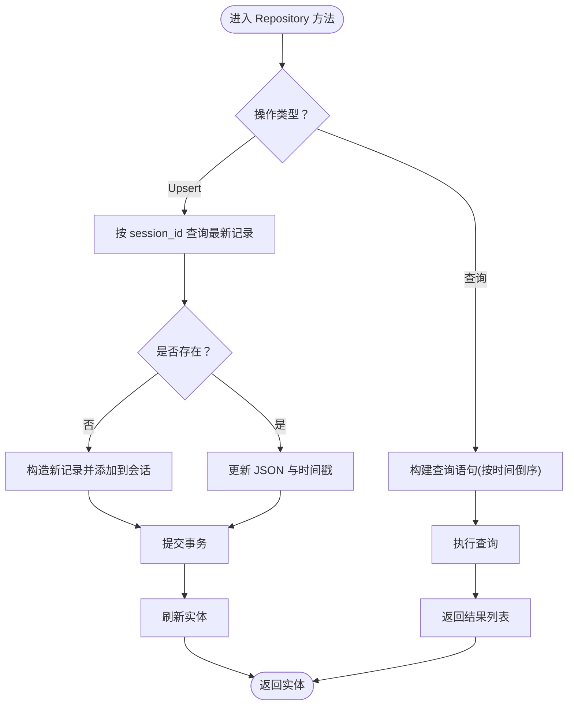
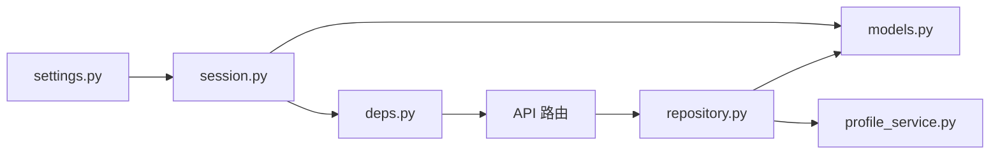

# 数据库设计

<cite>
**本文引用的文件**
- [models.py](file://database/models.py)
- [repository.py](file://database/repository.py)
- [session.py](file://database/session.py)
- [settings.py](file://backend/settings.py)
- [deps.py](file://backend/core/deps.py)
- [requirements.txt](file://requirements.txt)
- [profile.py](file://schemas/profile.py)
- [profile_service.py](file://services/profile_service.py)
- [profile.py 路由](file://api/routes/profile.py)
- [resources.py 路由](file://api/routes/resources.py)
</cite>

## 目录
1. [简介](#简介)
2. [项目结构](#项目结构)
3. [核心组件](#核心组件)
4. [架构总览](#架构总览)
5. [详细组件分析](#详细组件分析)
6. [依赖关系分析](#依赖关系分析)
7. [性能考量](#性能考量)
8. [故障排查指南](#故障排查指南)
9. [结论](#结论)
10. [附录](#附录)

## 简介
本文件系统性阐述 EduAgent 的数据库设计，涵盖 ORM 模型定义、Repository 模式实现、数据库连接管理与事务处理策略。重点解释核心数据模型的字段语义、关系映射与约束，给出查询优化、连接池管理、事务边界控制与错误处理的最佳实践，并提供数据模型扩展、迁移与备份恢复的指导思路。文中所有技术细节均基于仓库现有实现进行归纳总结。

## 项目结构
数据库相关代码集中在 database 目录，配合 FastAPI 依赖注入在 backend/core 中统一管理数据库会话；业务层通过服务类调用 Repository 完成持久化操作；API 层负责对外暴露资源访问接口。

图表来源
- [profile.py 路由:1-57](file://api/routes/profile.py#L1-L57)
- [resources.py 路由:1-76](file://api/routes/resources.py#L1-L76)
- [profile_service.py:1-166](file://services/profile_service.py#L1-L166)
- [repository.py:1-117](file://database/repository.py#L1-L117)
- [session.py:1-23](file://database/session.py#L1-L23)
- [deps.py:1-26](file://backend/core/deps.py#L1-L26)
- [settings.py:1-67](file://backend/settings.py#L1-L67)
- [requirements.txt:1-18](file://requirements.txt#L1-L18)

章节来源
- [models.py:1-40](file://database/models.py#L1-L40)
- [repository.py:1-117](file://database/repository.py#L1-L117)
- [session.py:1-23](file://database/session.py#L1-L23)
- [settings.py:1-67](file://backend/settings.py#L1-L67)
- [deps.py:1-26](file://backend/core/deps.py#L1-L26)
- [requirements.txt:1-18](file://requirements.txt#L1-L18)

## 核心组件
- ORM 模型层：定义三张核心表，分别用于存储学生画像、学习资源与评估报告。
- Repository 层：封装 CRUD 与查询逻辑，屏蔽 SQLAlchemy 细节，提供面向业务的接口。
- 连接与会话：通过 SQLAlchemy 引擎与会话工厂创建会话，FastAPI 依赖注入统一管理生命周期。
- 配置与驱动：从环境变量读取数据库 URL，支持 SQLite 与 PostgreSQL（通过驱动）。

章节来源
- [models.py:9-40](file://database/models.py#L9-L40)
- [repository.py:12-117](file://database/repository.py#L12-L117)
- [session.py:14-22](file://database/session.py#L14-L22)
- [settings.py:12-12](file://backend/settings.py#L12-L12)
- [requirements.txt:10-11](file://requirements.txt#L10-L11)

## 架构总览
下图展示从 API 到数据库的完整调用链路，包括依赖注入、会话创建、Repository 调用与 ORM 操作。

图表来源
- [profile.py 路由:21-30](file://api/routes/profile.py#L21-L30)
- [resources.py 路由:34-51](file://api/routes/resources.py#L34-L51)
- [deps.py:12-17](file://backend/core/deps.py#L12-L17)
- [repository.py:16-36](file://database/repository.py#L16-L36)
- [models.py:13-40](file://database/models.py#L13-L40)

## 详细组件分析

### ORM 模型定义
- 基类 Base：统一元数据与命名约定。
- StudentProfileRecord：学生画像记录，包含会话标识、JSON 化画像、更新时间。
- LearningResource：学习资源记录，包含会话标识、资源类型、JSON 化内容、创建时间。
- EvaluationReport：评估报告记录，包含会话标识、JSON 化报告、分数、创建时间。

字段与约束要点
- 主键与自增：所有表主键均为整型自增。
- 会话索引：session_id 建有索引，便于按会话检索。
- JSON 字段：使用 Text 类型存储 JSON 文本，便于灵活扩展。
- 时间戳：使用默认值或函数生成创建/更新时间。
- 非空约束：资源类型与内容、会话标识、报告内容等字段设置非空。

复杂度与性能
- 单表查询：按 session_id 索引查找，时间复杂度 O(log N)。
- 排序：按时间倒序，适合分页与最新优先展示。
- JSON 解析：Repository 提供反序列化工具，避免重复解析。

章节来源
- [models.py:9-40](file://database/models.py#L9-L40)

### Repository 模式实现
- ProfileRepository
  - 查询：按 session_id 查找最新记录（按更新时间倒序取第一条）。
  - Upsert：若不存在则新增，存在则更新 JSON 与更新时间；提交后刷新实体。
  - 反序列化：提供 to_dict 将 JSON 文本转为字典，异常时回退为包含原始文本的字典。
- ResourceRepository
  - 保存资源：序列化内容后插入，提交并刷新。
  - 按会话查询：按创建时间倒序列出。
  - 按类型查询：复合条件过滤后倒序。
  - 保存评估报告：序列化报告与分数，插入后提交刷新。
  - 获取评估报告：按创建时间倒序列出。
  - 反序列化工具：resource_to_dict 与 report_to_dict，异常时回退为包含原始文本的字典。

事务与一致性
- 所有写入操作在单次事务内完成（add/commit/refresh），保证原子性。
- 读取操作未显式开启事务，遵循 SQLAlchemy 默认隔离级别。

章节来源
- [repository.py:12-117](file://database/repository.py#L12-L117)

### 数据库连接管理
- 引擎创建：从配置读取 database_url，SQLite 使用额外参数以允许多线程访问。
- 会话工厂：关闭自动提交与自动刷新，确保手动控制事务。
- 初始化：初始化时创建所有表的元数据。
- 依赖注入：get_db 生成器在每次请求开始创建会话，在 finally 中关闭，避免泄漏。

章节来源
- [session.py:14-22](file://database/session.py#L14-L22)
- [settings.py:12-12](file://backend/settings.py#L12-L12)
- [deps.py:12-17](file://backend/core/deps.py#L12-L17)

### API 与服务集成
- profile.py 路由：通过依赖注入获取 Session 与 RedisClient，调用 ProfileService 构建/获取学生画像。
- resources.py 路由：通过依赖注入获取 Session，调用 ResourceRepository 获取资源列表。
- ProfileService：封装缓存（Redis）与数据库双写策略，先查缓存，再查数据库，最后落盘并写缓存。

章节来源
- [profile.py 路由:17-30](file://api/routes/profile.py#L17-L30)
- [resources.py 路由:34-51](file://api/routes/resources.py#L34-L51)
- [profile_service.py:106-122](file://services/profile_service.py#L106-L122)

### 数据模型类图

图表来源
- [models.py:9-40](file://database/models.py#L9-L40)

### 查询流程与事务边界

图表来源
- [repository.py:16-36](file://database/repository.py#L16-L36)
- [repository.py:62-99](file://database/repository.py#L62-L99)

## 依赖关系分析
- 外部依赖
  - SQLAlchemy 2.x：ORM 与会话管理。
  - 驱动：PostgreSQL 使用 psycopg2-binary，SQLite 本地默认可用。
- 内部依赖
  - settings.py 提供 database_url。
  - deps.py 通过 get_db 注入 Session。
  - repository.py 依赖 models.py 的实体定义。
  - profile_service.py 依赖 repository.py 与 Redis 缓存。

图表来源
- [settings.py:12-12](file://backend/settings.py#L12-L12)
- [session.py:14-18](file://database/session.py#L14-L18)
- [deps.py:12-17](file://backend/core/deps.py#L12-L17)
- [repository.py:9-9](file://database/repository.py#L9-L9)

章节来源
- [requirements.txt:10-11](file://requirements.txt#L10-L11)
- [settings.py:12-12](file://backend/settings.py#L12-L12)
- [deps.py:12-17](file://backend/core/deps.py#L12-L17)
- [repository.py:9-9](file://database/repository.py#L9-L9)

## 性能考量
- 索引策略
  - session_id 已建立索引，适合高频按会话查询。
  - 建议对 created_at/updated_at 建立索引以优化排序与分页。
- 查询优化
  - 使用 order_by + limit 实现分页，避免一次性加载全量数据。
  - 复合查询使用 where 多条件组合，减少应用侧过滤。
- 事务与连接
  - 显式事务边界：每个写入操作在单事务内完成，降低锁竞争。
  - 连接复用：依赖注入按请求创建会话，避免跨请求共享 Session。
- 缓存协同
  - ProfileService 同时使用 Redis 与数据库，热点数据走缓存，降低数据库压力。
- JSON 字段
  - 采用 Text 存储 JSON，便于扩展；注意在高并发下解析开销，可考虑缓存解析结果。

[本节为通用性能建议，不直接分析具体文件，故无“章节来源”]

## 故障排查指南
- 数据库连接问题
  - 检查 database_url 是否正确（SQLite 文件路径、PostgreSQL 连接串）。
  - 确认驱动安装：PostgreSQL 使用 psycopg2-binary。
- 事务异常
  - 若出现提交失败或锁冲突，检查是否在长事务中执行了大量写操作。
  - 确保在 finally 中关闭会话，避免连接泄漏。
- JSON 解析错误
  - Repository 提供异常回退策略，若 JSON 不合法，返回包含原始文本的对象。
- 缓存一致性
  - 更新画像后同时写入数据库与缓存，确保 TTL 设置合理。

章节来源
- [session.py:14-18](file://database/session.py#L14-L18)
- [repository.py:39-43](file://database/repository.py#L39-L43)
- [repository.py:102-116](file://database/repository.py#L102-L116)
- [profile_service.py:115-122](file://services/profile_service.py#L115-L122)

## 结论
EduAgent 的数据库设计采用清晰的分层架构：ORM 模型简洁明确，Repository 封装了业务查询与写入，依赖注入统一管理会话生命周期。当前实现满足学生画像、学习资源与评估报告的存储需求，具备良好的扩展性与可维护性。建议后续在索引、分页与缓存策略上进一步优化，以提升大规模场景下的性能表现。

[本节为总结性内容，不直接分析具体文件，故无“章节来源”]

## 附录

### 数据模型扩展指南
- 新增字段
  - 在对应模型类中添加字段映射，必要时在 __init__ 或 mapped_column 中设置默认值与约束。
  - 在 Repository 中补充相应查询/更新逻辑。
- 新增表
  - 定义新模型继承 Base，编写字段映射与索引。
  - 在 session.init_db 中确保元数据创建。
- JSON 字段演进
  - 保持向后兼容，新增字段时在反序列化工具中提供默认值。
  - 对于复杂结构，建议引入 Pydantic 模型进行强类型校验。

章节来源
- [models.py:9-40](file://database/models.py#L9-L40)
- [repository.py:12-117](file://database/repository.py#L12-L117)
- [session.py:21-22](file://database/session.py#L21-L22)

### 迁移方案
- 版本化迁移
  - 使用 Alembic 或自定义迁移脚本，记录模型变更与数据迁移。
  - 迁移前备份数据库，迁移后验证数据完整性。
- 兼容性策略
  - 对于 JSON 字段，提供解析回退与默认值。
  - 对于新增非空字段，提供默认值或分步迁移。

[本节为通用迁移建议，不直接分析具体文件，故无“章节来源”]

### 备份与恢复策略
- 备份
  - SQLite：复制数据库文件即可。
  - PostgreSQL：使用 pg_dump 导出结构与数据。
- 恢复
  - 恢复到新实例后，确认 database_url 指向正确位置。
  - 如使用 Redis 缓存，需单独备份与恢复缓存数据。

[本节为通用运维建议，不直接分析具体文件，故无“章节来源”]

### 实际数据操作示例（路径指引）
- 构建并保存学生画像
  - 路由入口：[profile.py 路由:21-30](file://api/routes/profile.py#L21-L30)
  - 服务实现：[profile_service.py:124-150](file://services/profile_service.py#L124-L150)
  - 仓储写入：[repository.py:24-36](file://database/repository.py#L24-L36)
- 获取学习资源
  - 路由入口：[resources.py 路由:34-51](file://api/routes/resources.py#L34-L51)
  - 仓储查询：[repository.py:62-69](file://database/repository.py#L62-L69)
- 保存评估报告
  - 仓储写入：[repository.py:81-91](file://database/repository.py#L81-L91)
  - 仓储查询：[repository.py:93-99](file://database/repository.py#L93-L99)

章节来源
- [profile.py 路由:21-30](file://api/routes/profile.py#L21-L30)
- [resources.py 路由:34-51](file://api/routes/resources.py#L34-L51)
- [profile_service.py:124-150](file://services/profile_service.py#L124-L150)
- [repository.py:24-36](file://database/repository.py#L24-L36)
- [repository.py:81-99](file://database/repository.py#L81-L99)

### 最佳实践规范
- 事务边界
  - 每个写入操作在单事务内完成，避免跨请求共享 Session。
- 查询优化
  - 使用索引列进行过滤与排序，结合分页 limit。
- JSON 处理
  - 统一序列化/反序列化，异常时提供回退策略。
- 缓存与数据库一致性
  - 更新后同时写入缓存与数据库，确保 TTL 合理。
- 配置管理
  - database_url 通过环境变量注入，支持不同部署环境切换。

章节来源
- [repository.py:24-36](file://database/repository.py#L24-L36)
- [repository.py:62-99](file://database/repository.py#L62-L99)
- [profile_service.py:115-122](file://services/profile_service.py#L115-L122)
- [settings.py:12-12](file://backend/settings.py#L12-L12)