# 前端架构设计

<cite>
**本文档引用的文件**
- [frontend/src/main.ts](file://frontend/src/main.ts)
- [frontend/src/App.vue](file://frontend/src/App.vue)
- [frontend/src/components/ChatLearning.vue](file://frontend/src/components/ChatLearning.vue)
- [frontend/src/components/PersonalizedLearning.vue](file://frontend/src/components/PersonalizedLearning.vue)
- [frontend/src/components/ResourceGenerator.vue](file://frontend/src/components/ResourceGenerator.vue)
- [frontend/src/components/EvaluationCenter.vue](file://frontend/src/components/EvaluationCenter.vue)
- [frontend/src/components/VoiceLearning.vue](file://frontend/src/components/VoiceLearning.vue)
- [frontend/src/style.css](file://frontend/src/style.css)
- [frontend/index.html](file://frontend/index.html)
- [frontend/vite.config.ts](file://frontend/vite.config.ts)
- [frontend/package.json](file://frontend/package.json)
- [frontend/tsconfig.app.json](file://frontend/tsconfig.app.json)
- [api/routes/chat.py](file://api/routes/chat.py)
- [api/routes/profile.py](file://api/routes/profile.py)
- [api/routes/evaluation.py](file://api/routes/evaluation.py)
- [api/routes/voice.py](file://api/routes/voice.py)
</cite>

## 目录
1. [引言](#引言)
2. [项目结构](#项目结构)
3. [核心组件](#核心组件)
4. [架构概览](#架构概览)
5. [详细组件分析](#详细组件分析)
6. [依赖分析](#依赖分析)
7. [性能考虑](#性能考虑)
8. [故障排除指南](#故障排除指南)
9. [结论](#结论)
10. [附录](#附录)

## 引言

EduAgent前端采用Vue3 + TypeScript + Vite构建的现代化单页应用(SPA)，专注于AI驱动的个性化教育学习平台。该架构以组件化为核心，通过清晰的路由系统和状态管理模式，实现了对话学习、个性化学习、资源生成、学习评估和语音学习五大核心功能模块。

系统采用现代化的浅色主题设计，结合响应式布局和流畅的动画效果，为用户提供沉浸式的学习体验。前端通过RESTful API与后端服务进行数据交互，确保了系统的可扩展性和维护性。

## 项目结构

前端项目采用模块化的组织方式，主要分为以下层次：

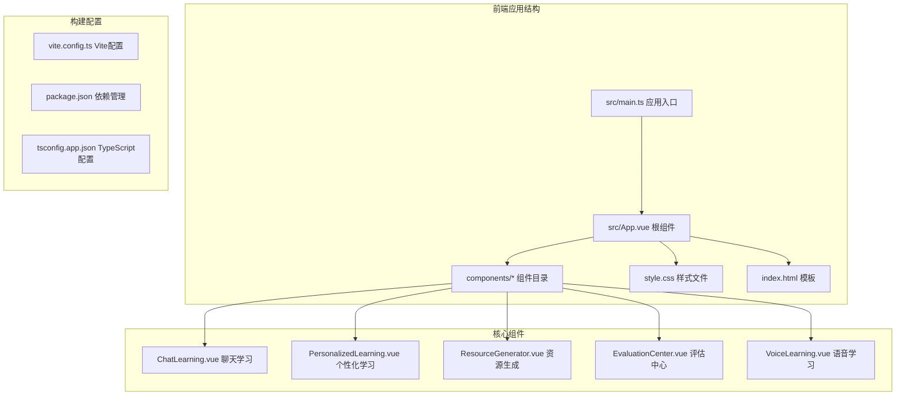

**图表来源**
- [frontend/src/main.ts:1-6](file://frontend/src/main.ts#L1-L6)
- [frontend/src/App.vue:1-320](file://frontend/src/App.vue#L1-L320)

**章节来源**
- [frontend/src/main.ts:1-6](file://frontend/src/main.ts#L1-L6)
- [frontend/src/App.vue:1-320](file://frontend/src/App.vue#L1-L320)
- [frontend/vite.config.ts:1-17](file://frontend/vite.config.ts#L1-L17)
- [frontend/package.json:1-28](file://frontend/package.json#L1-L28)

## 核心组件

### 应用入口与全局配置

应用采用Vue3的组合式API，通过单一入口文件启动整个应用。主应用组件负责全局布局、导航管理和跨组件通信。

### 组件层次结构

系统采用分层组件架构，每个功能模块都是独立的Vue单文件组件，具有明确的职责边界：

- **ChatLearning**: AI对话学习模块，支持流式输出和Markdown渲染
- **PersonalizedLearning**: 个性化学习中心，提供学生画像分析和学习路径规划
- **ResourceGenerator**: AI资源生成中心，支持多种学习资源的智能生成
- **EvaluationCenter**: 学习评估中心，提供多维度学习效果分析
- **VoiceLearning**: 语音学习模块，集成TTS和ASR功能

**章节来源**
- [frontend/src/App.vue:12-86](file://frontend/src/App.vue#L12-L86)

## 架构概览

EduAgent前端采用MVVM架构模式，结合Vue3的响应式系统和TypeScript的类型安全特性：

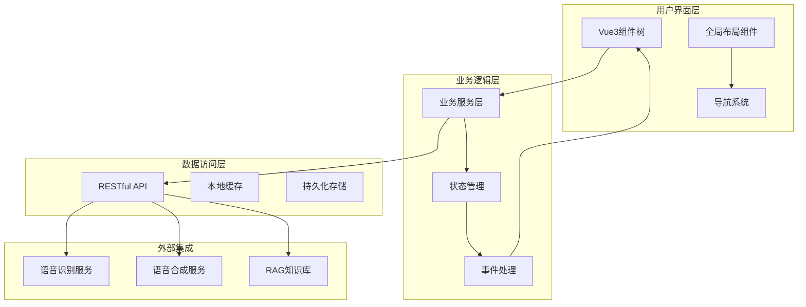

**图表来源**
- [frontend/src/App.vue:12-86](file://frontend/src/App.vue#L12-L86)
- [frontend/src/components/ChatLearning.vue:16-308](file://frontend/src/components/ChatLearning.vue#L16-L308)

## 详细组件分析

### ChatLearning 聊天学习组件

ChatLearning是系统的核心交互组件，实现了完整的AI对话学习功能：

#### 核心功能特性

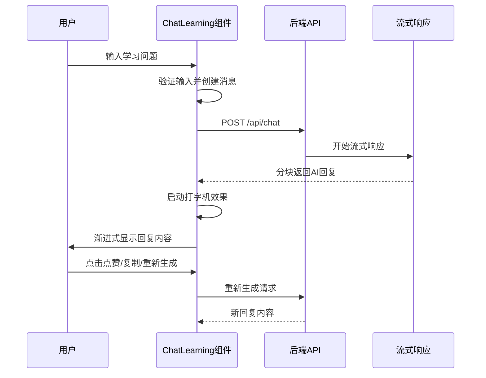

**图表来源**
- [frontend/src/components/ChatLearning.vue:133-182](file://frontend/src/components/ChatLearning.vue#L133-L182)
- [api/routes/chat.py:23-37](file://api/routes/chat.py#L23-L37)

#### 数据流处理

组件内部维护复杂的消息状态管理：

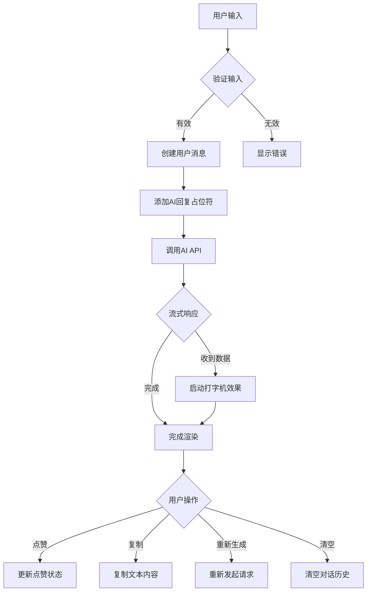

**图表来源**
- [frontend/src/components/ChatLearning.vue:133-233](file://frontend/src/components/ChatLearning.vue#L133-L233)

#### 技术实现特点

- **流式打字机效果**: 使用定时器实现逐字渲染，模拟真实的大模型响应体验
- **Markdown渲染**: 集成marked.js和highlight.js，支持代码高亮和数学公式
- **实时状态管理**: 通过Vue响应式系统管理复杂的对话状态
- **错误处理机制**: 完善的异常捕获和用户友好的错误提示

**章节来源**
- [frontend/src/components/ChatLearning.vue:1-618](file://frontend/src/components/ChatLearning.vue#L1-L618)

### PersonalizedLearning 个性化学习中心

个性化学习中心提供完整的学生画像分析和学习路径规划功能：

#### 学生画像分析流程

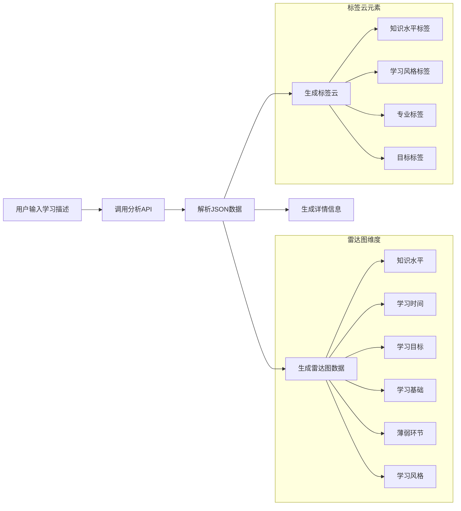

**图表来源**
- [frontend/src/components/PersonalizedLearning.vue:223-273](file://frontend/src/components/PersonalizedLearning.vue#L223-L273)

#### 学习路径生成

组件支持从学生画像自动生成个性化的学习路径，采用时间轴形式展示：

- **多状态显示**: 已完成、进行中、待开始三种状态
- **主题内容**: 支持学习内容、知识点、技能点等多维度
- **响应式布局**: 适配不同屏幕尺寸的设备

**章节来源**
- [frontend/src/components/PersonalizedLearning.vue:1-583](file://frontend/src/components/PersonalizedLearning.vue#L1-L583)

### ResourceGenerator 资源生成中心

资源生成中心支持五种类型的AI学习资源生成：

#### 资源类型与生成流程

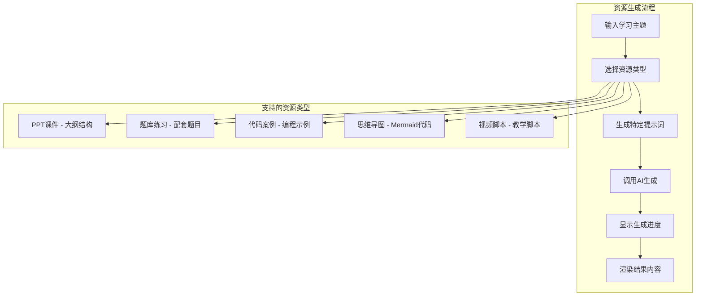

**图表来源**
- [frontend/src/components/ResourceGenerator.vue:119-156](file://frontend/src/components/ResourceGenerator.vue#L119-L156)

#### 特殊处理功能

- **代码高亮**: 使用highlight.js对代码块进行语法高亮
- **思维导图渲染**: 集成mermaid.js实现实时图表生成
- **进度模拟**: 通过定时器模拟AI生成过程，提升用户体验
- **多格式导出**: 支持复制到剪贴板和文件下载

**章节来源**
- [frontend/src/components/ResourceGenerator.vue:1-496](file://frontend/src/components/ResourceGenerator.vue#L1-L496)

### EvaluationCenter 学习评估中心

学习评估中心提供全面的学习效果分析和报告生成：

#### 评估数据收集与处理

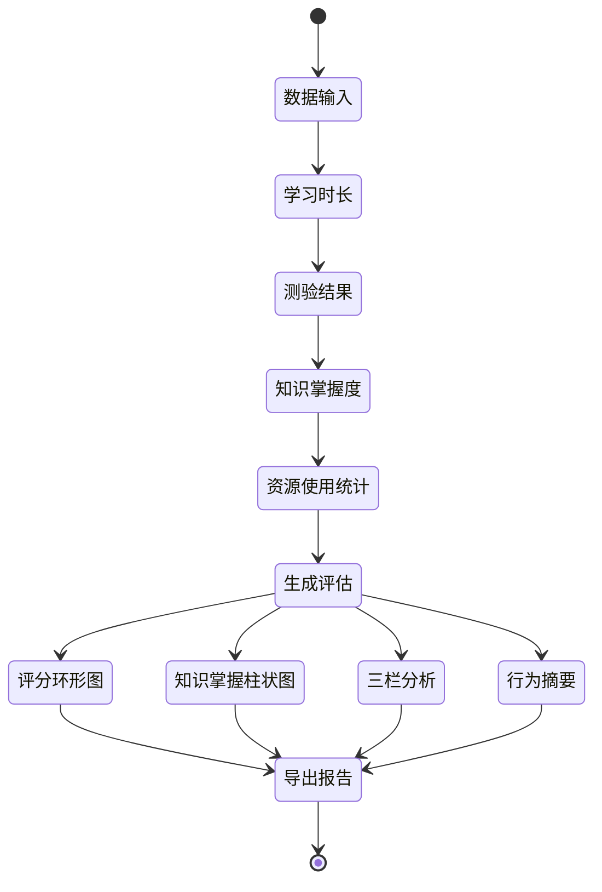

**图表来源**
- [frontend/src/components/EvaluationCenter.vue:113-142](file://frontend/src/components/EvaluationCenter.vue#L113-L142)

#### 报告生成与展示

系统支持JSON和Markdown两种格式的评估报告导出，包含：

- **总体评分**: 100分制的综合评价
- **等级标签**: 优秀/良好/中等/需加强
- **优势分析**: 学习中的突出表现
- **薄弱环节**: 需要改进的知识点
- **学习建议**: 个性化的改进建议

**章节来源**
- [frontend/src/components/EvaluationCenter.vue:1-578](file://frontend/src/components/EvaluationCenter.vue#L1-L578)

### VoiceLearning 语音学习组件

语音学习模块集成了先进的语音识别和合成技术：

#### 语音功能架构

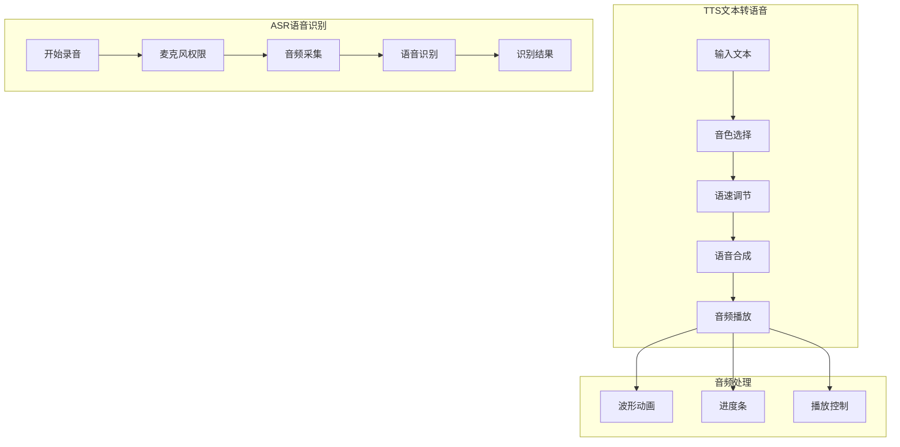

**图表来源**
- [frontend/src/components/VoiceLearning.vue:63-90](file://frontend/src/components/VoiceLearning.vue#L63-L90)

#### 技术实现特色

- **音色选择器**: 卡片式设计，支持多种音色和性别选择
- **语速控制**: 可视化滑块，支持慢/中/快三个预设
- **录音波形**: CSS动画模拟真实的音频波形效果
- **播放器控件**: 圆角设计的现代化音频播放器

**章节来源**
- [frontend/src/components/VoiceLearning.vue:1-449](file://frontend/src/components/VoiceLearning.vue#L1-L449)

## 依赖分析

### 外部依赖关系

前端项目采用模块化依赖管理，主要依赖包括：

```mermaid
graph TB
subgraph "核心运行时依赖"
Vue[Vue 3.5.32]
TS[TypeScript ~6.0.2]
Tailwind[TailwindCSS 4.3.0]
end
subgraph "开发工具依赖"
Vite[Vite 8.0.10]
VuePlugin[@vitejs/plugin-vue]
TSConfig[@vue/tsconfig]
NodeTypes[@types/node]
end
subgraph "第三方库"
Marked[marked 18.0.4]
HLJS[highlight.js 11.11.1]
Mermaid[mermaid 11.15.0]
end
Vue --> Marked
Vue --> HLJS
Vue --> Mermaid
Vite --> VuePlugin
Vite --> TSConfig
```

**图表来源**
- [frontend/package.json:11-26](file://frontend/package.json#L11-L26)

### 构建配置分析

项目使用Vite作为构建工具，配置了现代化的开发环境：

- **插件系统**: Vue插件和TailwindCSS插件的集成
- **代理配置**: 开发服务器到后端API的代理设置
- **类型检查**: TypeScript的严格类型检查配置
- **样式处理**: TailwindCSS的原子化样式系统

**章节来源**
- [frontend/vite.config.ts:1-17](file://frontend/vite.config.ts#L1-L17)
- [frontend/tsconfig.app.json:1-15](file://frontend/tsconfig.app.json#L1-L15)

## 性能考虑

### 响应式设计原则

系统采用移动优先的设计理念，通过以下方式确保良好的用户体验：

- **弹性布局**: 使用CSS Grid和Flexbox实现自适应布局
- **断点设计**: 针对不同屏幕尺寸的优化布局
- **触摸友好**: 按钮和交互元素的合适尺寸
- **性能优化**: 图片懒加载和关键资源优先加载

### 性能优化策略

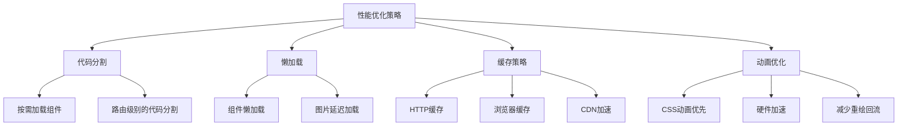

### 错误处理机制

系统实现了多层次的错误处理机制：

- **网络错误**: 自动重试和用户友好的错误提示
- **API错误**: 具体的错误信息和恢复建议
- **资源加载**: 占位符和降级方案
- **用户操作**: 实时反馈和撤销机制

## 故障排除指南

### 常见问题诊断

#### 组件通信问题

当组件间通信出现问题时，检查以下方面：

1. **props传递**: 确保父组件向子组件正确传递数据
2. **事件监听**: 验证子组件是否正确触发事件
3. **状态同步**: 检查响应式数据的更新时机

#### API调用问题

针对API调用失败的情况：

1. **网络连接**: 检查开发服务器代理配置
2. **CORS设置**: 确认后端API的跨域允许设置
3. **认证令牌**: 验证API访问权限

**章节来源**
- [frontend/src/App.vue:29-68](file://frontend/src/App.vue#L29-L68)

### 调试技巧

- **Vue DevTools**: 使用浏览器扩展调试Vue组件状态
- **网络面板**: 监控API请求和响应
- **控制台日志**: 添加适当的日志输出
- **错误边界**: 实现全局错误处理组件

## 结论

EduAgent前端架构展现了现代Web应用的最佳实践，通过Vue3的响应式系统、TypeScript的类型安全和Vite的现代化构建工具，实现了高性能、可维护的学习平台前端应用。

系统的主要优势包括：

- **模块化设计**: 清晰的组件层次和职责分离
- **用户体验**: 流畅的动画效果和响应式交互
- **技术栈先进**: 采用最新的前端技术和工具链
- **可扩展性**: 良好的架构设计支持功能扩展

未来可以在以下方面进一步优化：

- **状态管理**: 考虑引入Pinia或Vuex进行复杂状态管理
- **测试覆盖**: 增加单元测试和集成测试
- **性能监控**: 实施应用性能监控和用户体验分析
- **国际化**: 支持多语言环境

## 附录

### 组件关系图

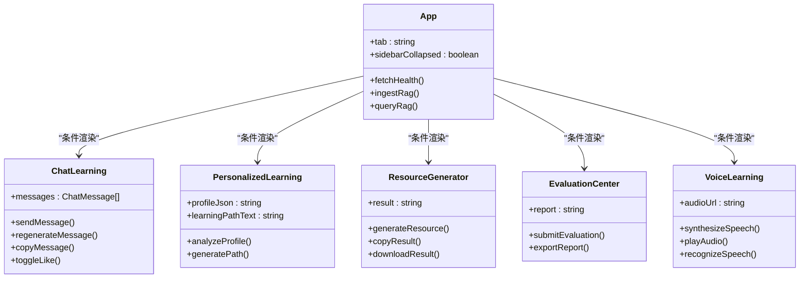

**图表来源**
- [frontend/src/App.vue:19-86](file://frontend/src/App.vue#L19-L86)
- [frontend/src/components/ChatLearning.vue:20-32](file://frontend/src/components/ChatLearning.vue#L20-L32)

### 数据流向图

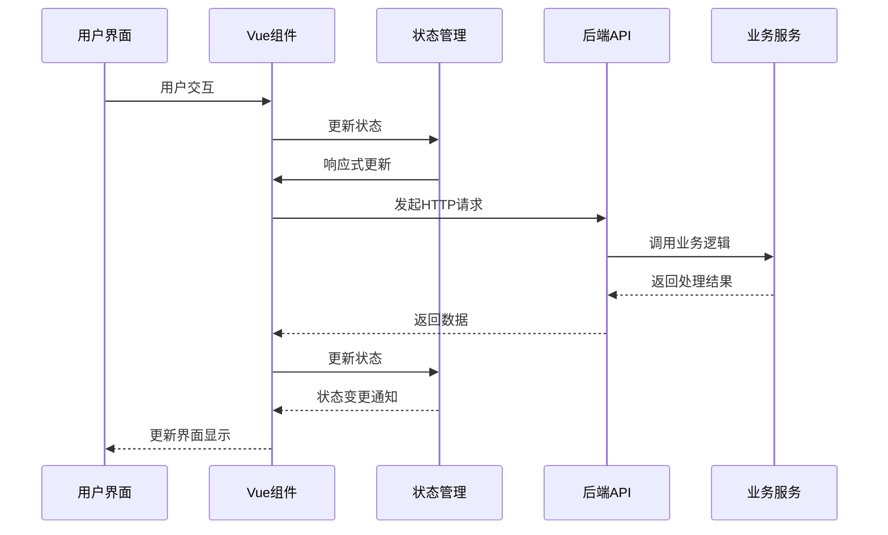

**图表来源**
- [frontend/src/components/ChatLearning.vue:133-182](file://frontend/src/components/ChatLearning.vue#L133-L182)
- [frontend/src/components/PersonalizedLearning.vue:223-273](file://frontend/src/components/PersonalizedLearning.vue#L223-L273)