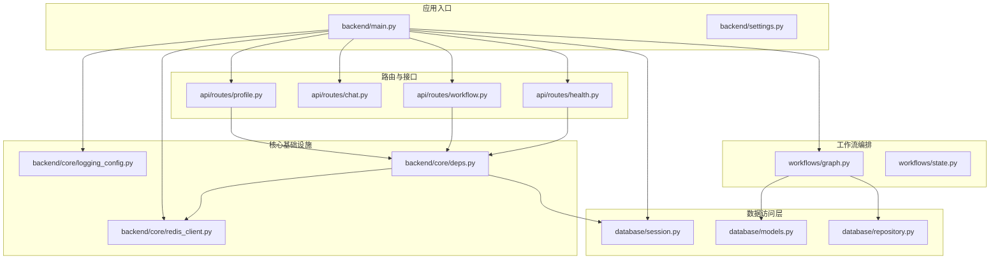
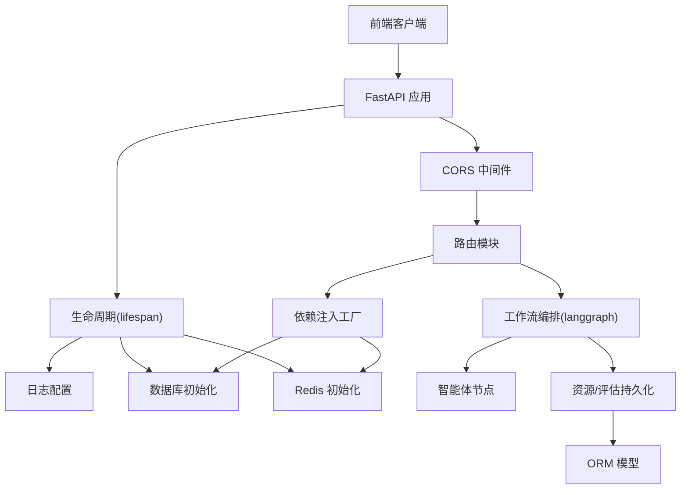
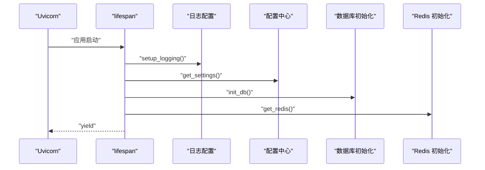
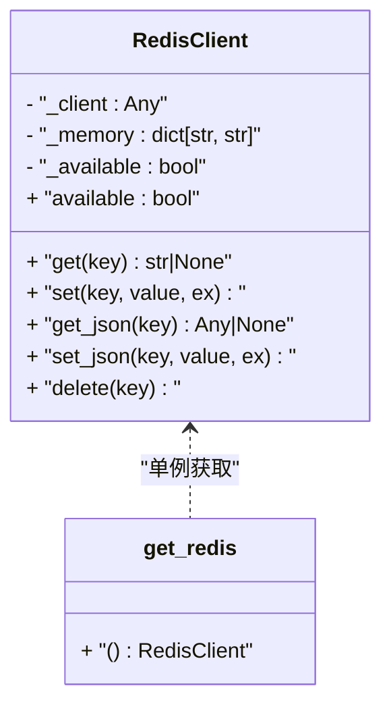
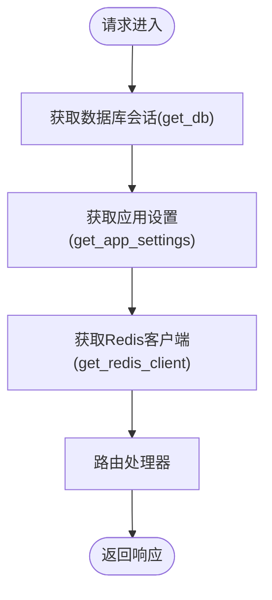
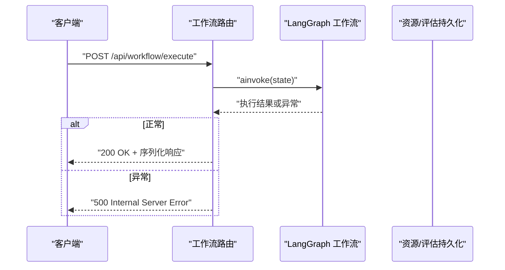
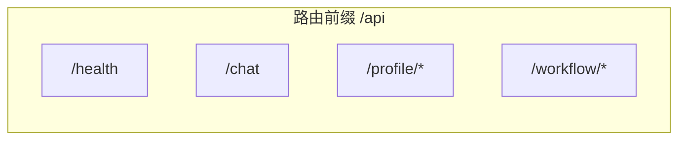
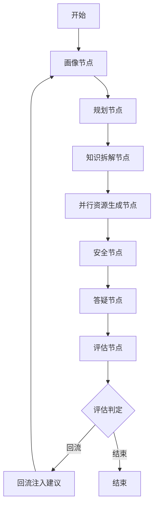
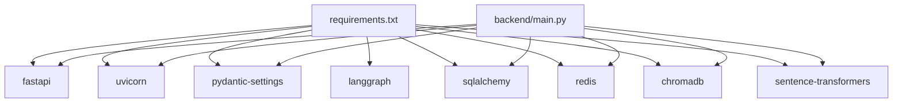

# 后端架构设计

<cite>
**本文档引用的文件**
- [backend/main.py](file://backend/main.py)
- [backend/settings.py](file://backend/settings.py)
- [backend/core/logging_config.py](file://backend/core/logging_config.py)
- [backend/core/redis_client.py](file://backend/core/redis_client.py)
- [backend/core/deps.py](file://backend/core/deps.py)
- [database/session.py](file://database/session.py)
- [database/models.py](file://database/models.py)
- [database/repository.py](file://database/repository.py)
- [api/routes/health.py](file://api/routes/health.py)
- [api/routes/chat.py](file://api/routes/chat.py)
- [api/routes/profile.py](file://api/routes/profile.py)
- [api/routes/workflow.py](file://api/routes/workflow.py)
- [workflows/graph.py](file://workflows/graph.py)
- [workflows/state.py](file://workflows/state.py)
- [schemas/profile.py](file://schemas/profile.py)
- [requirements.txt](file://requirements.txt)
</cite>

## 目录
1. [简介](#简介)
2. [项目结构](#项目结构)
3. [核心组件](#核心组件)
4. [架构总览](#架构总览)
5. [详细组件分析](#详细组件分析)
6. [依赖关系分析](#依赖关系分析)
7. [性能考虑](#性能考虑)
8. [故障排查指南](#故障排查指南)
9. [结论](#结论)
10. [附录](#附录)

## 简介
本文件面向EduAgent后端，围绕基于FastAPI的RESTful API架构进行系统性梳理，重点覆盖应用生命周期管理、中间件配置、路由系统设计、依赖注入机制、异常处理策略、API版本控制、请求验证与响应序列化等。同时给出架构图与组件交互流程图，帮助读者快速把握后端整体设计与数据流转。

## 项目结构
后端采用“分层+功能模块”混合组织方式：
- 应用入口与生命周期：backend/main.py
- 配置中心：backend/settings.py
- 核心基础设施：backend/core（日志、Redis客户端、依赖工厂）
- 数据访问层：database（SQLAlchemy引擎、模型、仓库）
- 路由与接口：api/routes（健康检查、聊天、画像、工作流等）
- 工作流编排：workflows（LangGraph状态机与节点）
- 业务服务与模式：services、schemas
- 外部集成：backend/integrations（讯飞ASR/TTS/WebSocket鉴权等）

图表来源
- [backend/main.py:1-70](file://backend/main.py#L1-L70)
- [backend/settings.py:1-67](file://backend/settings.py#L1-L67)
- [backend/core/logging_config.py:1-27](file://backend/core/logging_config.py#L1-L27)
- [backend/core/redis_client.py:1-73](file://backend/core/redis_client.py#L1-L73)
- [backend/core/deps.py:1-26](file://backend/core/deps.py#L1-L26)
- [database/session.py:1-23](file://database/session.py#L1-L23)
- [database/models.py:1-40](file://database/models.py#L1-L40)
- [database/repository.py:1-117](file://database/repository.py#L1-L117)
- [api/routes/health.py:1-52](file://api/routes/health.py#L1-L52)
- [api/routes/chat.py:1-37](file://api/routes/chat.py#L1-L37)
- [api/routes/profile.py:1-57](file://api/routes/profile.py#L1-L57)
- [api/routes/workflow.py:1-120](file://api/routes/workflow.py#L1-L120)
- [workflows/graph.py:1-220](file://workflows/graph.py#L1-L220)
- [workflows/state.py:1-24](file://workflows/state.py#L1-L24)

章节来源
- [backend/main.py:1-70](file://backend/main.py#L1-L70)
- [backend/settings.py:1-67](file://backend/settings.py#L1-L67)

## 核心组件
- 应用生命周期管理（lifespan）
  - 在应用启动时初始化数据库、建立Redis连接，并按需执行知识库自动入库；在应用关闭时释放资源。
- CORS跨域配置
  - 通过CORSMiddleware允许指定来源、凭证、方法与头，确保前端跨域访问安全可控。
- 日志系统配置
  - 基于设置动态配置日志级别、格式与编码，统一输出到标准输出。
- Redis客户端管理
  - 提供Redis封装，支持可用性检测与内存降级，保证主流程不被缓存异常阻断。
- 依赖注入机制
  - 通过Depends从依赖工厂函数获取数据库会话、应用设置与Redis客户端，实现路由层与服务层解耦。
- 异常处理策略
  - 路由层对工作流执行异常进行捕获并返回HTTP 500；健康检查接口对数据库连接进行探测并返回状态。
- API版本控制与请求验证
  - FastAPI应用声明版本号；Pydantic模型用于请求参数校验与响应序列化。
- 路由系统设计
  - 按功能模块划分路由前缀与标签，统一以/api开头，便于版本演进与维护。

章节来源
- [backend/main.py:23-70](file://backend/main.py#L23-L70)
- [backend/core/logging_config.py:9-27](file://backend/core/logging_config.py#L9-L27)
- [backend/core/redis_client.py:12-73](file://backend/core/redis_client.py#L12-L73)
- [backend/core/deps.py:12-26](file://backend/core/deps.py#L12-L26)
- [api/routes/health.py:14-52](file://api/routes/health.py#L14-L52)
- [api/routes/workflow.py:54-79](file://api/routes/workflow.py#L54-L79)

## 架构总览
下图展示EduAgent后端的整体架构与关键交互：

图表来源
- [backend/main.py:46-70](file://backend/main.py#L46-L70)
- [backend/core/logging_config.py:9-27](file://backend/core/logging_config.py#L9-L27)
- [backend/core/redis_client.py:12-73](file://backend/core/redis_client.py#L12-L73)
- [backend/core/deps.py:12-26](file://backend/core/deps.py#L12-L26)
- [database/session.py:21-23](file://database/session.py#L21-L23)
- [database/models.py:9-40](file://database/models.py#L9-L40)
- [database/repository.py:12-117](file://database/repository.py#L12-L117)
- [workflows/graph.py:186-220](file://workflows/graph.py#L186-L220)

## 详细组件分析

### 应用生命周期管理（lifespan）
- 启动阶段
  - 设置日志、读取配置、初始化数据库、建立Redis连接。
  - 可选：启动时自动执行知识库入库任务。
- 关闭阶段
  - 保持现有结构，yield之后的清理逻辑可扩展。

图表来源
- [backend/main.py:23-42](file://backend/main.py#L23-L42)
- [backend/core/logging_config.py:9-27](file://backend/core/logging_config.py#L9-L27)
- [database/session.py:21-23](file://database/session.py#L21-L23)
- [backend/core/redis_client.py:68-73](file://backend/core/redis_client.py#L68-L73)

章节来源
- [backend/main.py:23-42](file://backend/main.py#L23-L42)

### CORS跨域配置
- 中间件参数来源于配置中心，支持通配符方法与头，确保开发与生产环境的灵活性。
- 执行顺序：在路由注册之前添加，确保所有路由均受CORS保护。

章节来源
- [backend/main.py:53-59](file://backend/main.py#L53-L59)
- [backend/settings.py:54-55](file://backend/settings.py#L54-L55)

### 日志系统配置
- 动态读取日志级别，设置UTF-8编码，统一格式化输出，便于容器化与集中日志收集。

章节来源
- [backend/core/logging_config.py:9-27](file://backend/core/logging_config.py#L9-L27)
- [backend/settings.py:10-11](file://backend/settings.py#L10-L11)

### Redis客户端管理
- 可用性检测与内存降级：当Redis不可用时自动切换为内存字典，避免阻断主流程。
- JSON读写封装：提供JSON序列化/反序列化能力，兼容不同存储介质。

图表来源
- [backend/core/redis_client.py:12-73](file://backend/core/redis_client.py#L12-L73)

章节来源
- [backend/core/redis_client.py:12-73](file://backend/core/redis_client.py#L12-L73)

### 依赖注入机制
- 数据库会话：每次请求生成新会话，结束后关闭，避免连接泄漏。
- 应用设置：全局缓存配置，减少重复解析。
- Redis客户端：全局单例，贯穿应用生命周期。

图表来源
- [backend/core/deps.py:12-26](file://backend/core/deps.py#L12-L26)
- [database/session.py:14-18](file://database/session.py#L14-L18)
- [backend/settings.py:64-67](file://backend/settings.py#L64-L67)
- [backend/core/redis_client.py:68-73](file://backend/core/redis_client.py#L68-L73)

章节来源
- [backend/core/deps.py:12-26](file://backend/core/deps.py#L12-L26)

### 异常处理策略
- 健康检查：对数据库连接进行显式探测，返回“ok”或“degraded”，并包含Redis可用性提示。
- 工作流执行：捕获异常并返回HTTP 500，记录详细日志以便定位问题。

图表来源
- [api/routes/workflow.py:54-79](file://api/routes/workflow.py#L54-L79)

章节来源
- [api/routes/health.py:27-52](file://api/routes/health.py#L27-L52)
- [api/routes/workflow.py:61-66](file://api/routes/workflow.py#L61-L66)

### API版本控制、请求验证与响应序列化
- 版本控制：在FastAPI应用中声明版本号，便于未来演进与兼容性管理。
- 请求验证：使用Pydantic模型对入参进行字段级校验（最小长度、可空性、范围等）。
- 响应序列化：通过Pydantic模型自动序列化为JSON，保证一致性与可预测性。

章节来源
- [backend/main.py:46-51](file://backend/main.py#L46-L51)
- [api/routes/chat.py:11-21](file://api/routes/chat.py#L11-L21)
- [api/routes/profile.py:39-43](file://api/routes/profile.py#L39-L43)
- [api/routes/workflow.py:24-48](file://api/routes/workflow.py#L24-L48)
- [schemas/profile.py:8-37](file://schemas/profile.py#L8-L37)

### 路由系统设计
- 健康检查：提供基础与详细健康状态，包含数据库、Redis、Spark配置等。
- 聊天接口：简单工作流调用，返回回复、会话ID与状态快照。
- 画像接口：构建/查询学生画像，结合数据库与Redis缓存。
- 工作流接口：完整工作流执行与状态查询，涉及多智能体并行生成与持久化。

图表来源
- [api/routes/health.py:11](file://api/routes/health.py#L11)
- [api/routes/chat.py:8](file://api/routes/chat.py#L8)
- [api/routes/profile.py:14](file://api/routes/profile.py#L14)
- [api/routes/workflow.py:17](file://api/routes/workflow.py#L17)

章节来源
- [api/routes/health.py:14-52](file://api/routes/health.py#L14-L52)
- [api/routes/chat.py:23-37](file://api/routes/chat.py#L23-L37)
- [api/routes/profile.py:21-57](file://api/routes/profile.py#L21-L57)
- [api/routes/workflow.py:54-120](file://api/routes/workflow.py#L54-L120)

### 工作流编排与数据持久化
- 编排流程：画像 → 规划 → 知识拆解 → 并行资源生成 → 安全 → 答疑 → 评估；根据评估结果进行回流或结束。
- 并行生成：PPT、测验、代码、思维导图、视频脚本并行执行，聚合消息与产物。
- 持久化：学习资源与评估报告异步落库，失败仅记录警告，不影响主流程。

图表来源
- [workflows/graph.py:186-220](file://workflows/graph.py#L186-L220)
- [workflows/graph.py:73-98](file://workflows/graph.py#L73-L98)
- [workflows/graph.py:109-133](file://workflows/graph.py#L109-L133)
- [workflows/graph.py:136-184](file://workflows/graph.py#L136-L184)

章节来源
- [workflows/graph.py:39-133](file://workflows/graph.py#L39-L133)
- [workflows/graph.py:186-220](file://workflows/graph.py#L186-L220)

## 依赖关系分析
- 外部依赖
  - FastAPI、Uvicorn、Pydantic Settings、LangGraph/LangChain、SQLAlchemy、Redis、ChromaDB、Sentence Transformers等。
- 内部依赖
  - 应用入口依赖配置、日志、Redis与数据库初始化；路由依赖依赖工厂；工作流依赖智能体与仓库；仓库依赖ORM模型。

图表来源
- [requirements.txt:1-18](file://requirements.txt#L1-L18)
- [backend/main.py:12-18](file://backend/main.py#L12-L18)

章节来源
- [requirements.txt:1-18](file://requirements.txt#L1-L18)
- [backend/main.py:12-18](file://backend/main.py#L12-L18)

## 性能考虑
- 并行执行：工作流中资源生成节点采用并发执行，缩短端到端延迟。
- 异步持久化：资源与评估报告写入数据库在后台线程执行，避免阻塞主流程。
- 缓存降级：Redis不可用时自动降级为内存缓存，保障服务连续性。
- 连接池：数据库引擎按URL类型配置连接参数，SQLite使用线程限制，PostgreSQL启用二进制扩展。

章节来源
- [workflows/graph.py:75-98](file://workflows/graph.py#L75-L98)
- [workflows/graph.py:51-71](file://workflows/graph.py#L51-L71)
- [workflows/graph.py:109-133](file://workflows/graph.py#L109-L133)
- [backend/core/redis_client.py:20-31](file://backend/core/redis_client.py#L20-L31)
- [database/session.py:14-18](file://database/session.py#L14-L18)

## 故障排查指南
- 健康检查
  - 使用详细健康接口确认数据库与Redis连通性、Spark配置状态与嵌入模型信息。
- 工作流执行失败
  - 查看500错误详情与日志异常堆栈；确认各智能体是否正常运行、数据库写入是否成功。
- Redis不可用
  - 观察日志警告并确认内存降级行为；检查配置项与网络连通性。
- CORS问题
  - 核对配置中的来源列表与实际前端地址是否匹配。

章节来源
- [api/routes/health.py:27-52](file://api/routes/health.py#L27-L52)
- [api/routes/workflow.py:61-66](file://api/routes/workflow.py#L61-L66)
- [backend/core/redis_client.py:29-31](file://backend/core/redis_client.py#L29-L31)
- [backend/settings.py:54-55](file://backend/settings.py#L54-L55)

## 结论
EduAgent后端以FastAPI为核心，结合LangGraph工作流、SQLAlchemy ORM与Redis缓存，实现了从请求接入到多智能体协同生成再到持久化的完整链路。通过lifespan生命周期管理、CORS中间件、依赖注入与异常处理策略，系统具备良好的可维护性与可扩展性。后续可在路由版本化、统一异常映射、指标监控等方面进一步增强。

## 附录
- 配置项概览
  - 服务环境、日志级别、数据库URL、Redis开关与URL、CORS来源列表
  - 星火/ASR/TTS相关配置、RAG目录与向量库配置、自动入库开关
- 数据模型概览
  - 学生画像记录、学习资源、评估报告三类表，支持JSON字段存储结构化内容

章节来源
- [backend/settings.py:9-62](file://backend/settings.py#L9-L62)
- [database/models.py:13-40](file://database/models.py#L13-L40)