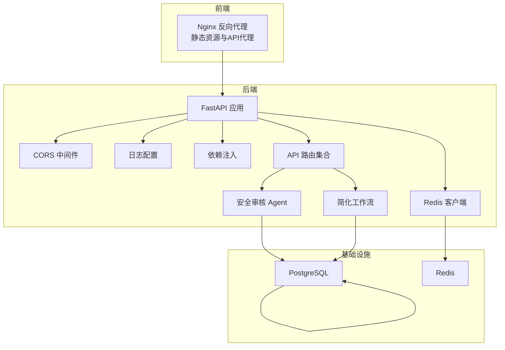
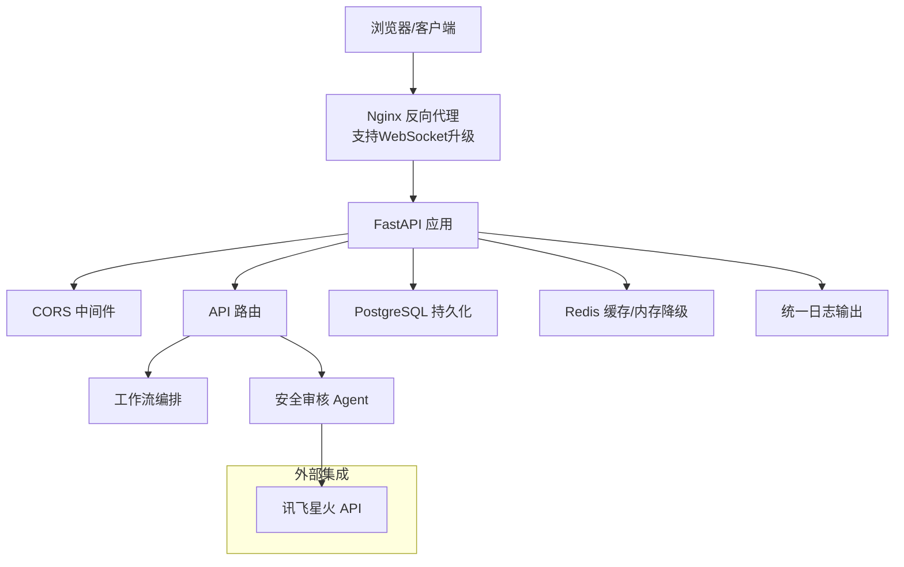
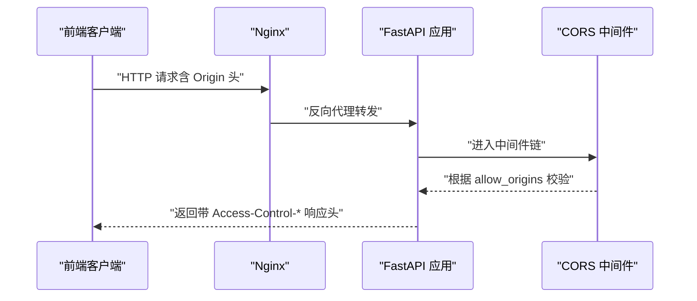
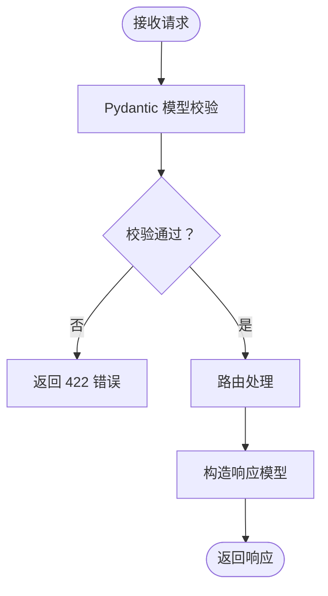
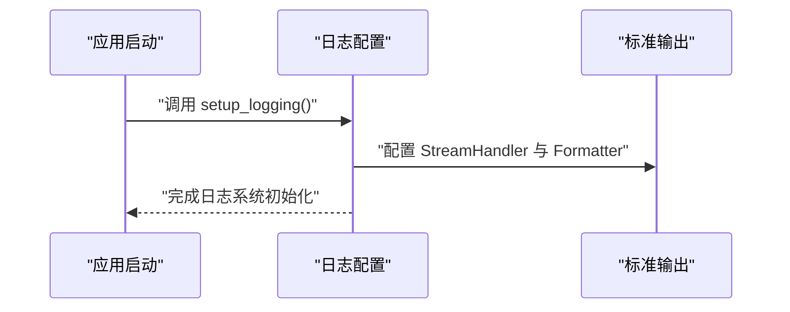
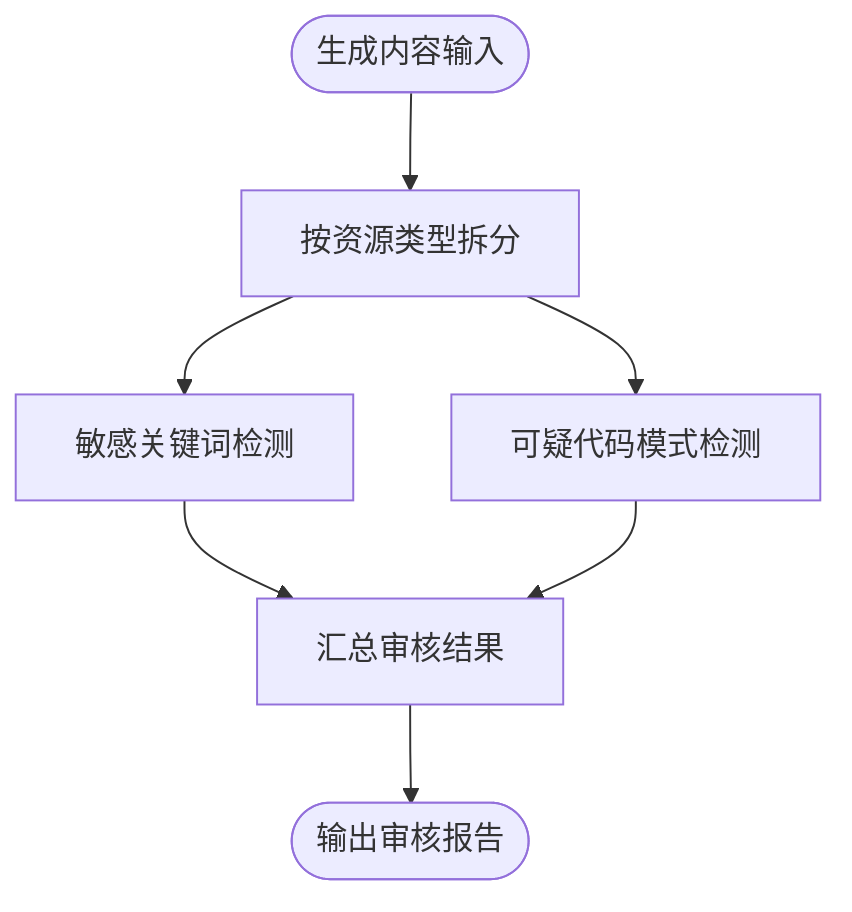
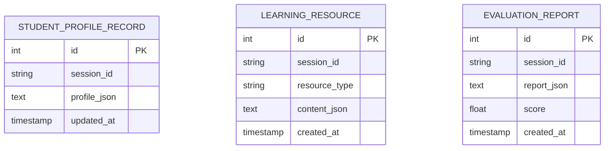
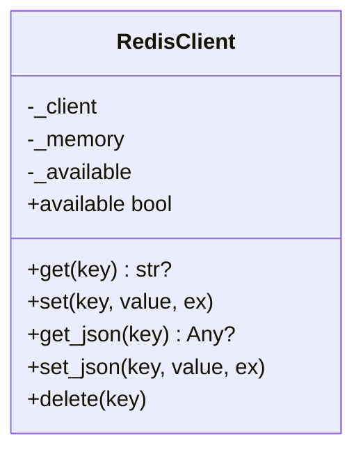
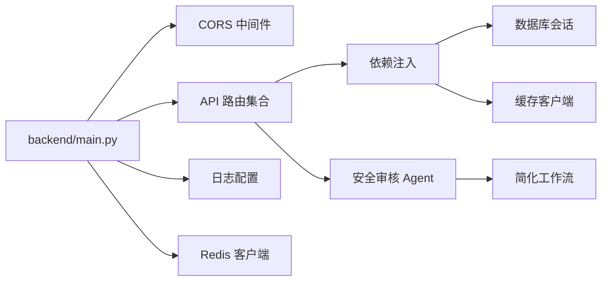

# 安全架构设计

<cite>
**本文档引用的文件**
- [backend/main.py](file://backend/main.py)
- [backend/settings.py](file://backend/settings.py)
- [backend/core/logging_config.py](file://backend/core/logging_config.py)
- [backend/core/redis_client.py](file://backend/core/redis_client.py)
- [backend/core/deps.py](file://backend/core/deps.py)
- [api/routes/chat.py](file://api/routes/chat.py)
- [api/routes/health.py](file://api/routes/health.py)
- [api/routes/resources.py](file://api/routes/resources.py)
- [agents/safety_agent.py](file://agents/safety_agent.py)
- [prompts/safety_agent.md](file://prompts/safety_agent.md)
- [database/models.py](file://database/models.py)
- [database/repository.py](file://database/repository.py)
- [docker/docker-compose.yml](file://docker/docker-compose.yml)
- [docker/nginx-frontend.conf](file://docker/nginx-frontend.conf)
- [workflows/simple_graph.py](file://workflows/simple_graph.py)
- [scripts/test_chat_api.py](file://scripts/test_chat_api.py)
</cite>

## 目录
1. [引言](#引言)
2. [项目结构](#项目结构)
3. [核心组件](#核心组件)
4. [架构总览](#架构总览)
5. [详细组件分析](#详细组件分析)
6. [依赖分析](#依赖分析)
7. [性能考虑](#性能考虑)
8. [故障排除指南](#故障排除指南)
9. [结论](#结论)
10. [附录](#附录)

## 引言
本文件面向EduAgent系统的安全架构，聚焦于跨域安全配置、API访问控制、日志审计机制、安全中间件实现、请求验证策略、敏感信息保护、环境变量与API密钥管理、数据传输加密、安全日志记录与异常监控、访问频率限制等主题。文档在保证技术深度的同时，力求以清晰易懂的方式呈现系统面临的安全挑战与应对策略，并提供安全架构图与威胁模型分析。

## 项目结构
EduAgent采用前后端分离架构，后端基于FastAPI构建，前端通过Nginx进行静态资源分发与反向代理，数据库与缓存通过Docker Compose统一编排。安全相关的关键位置包括：
- 后端入口与CORS中间件配置
- 配置与环境变量管理
- 日志与健康检查
- 缓存客户端与降级策略
- 数据模型与持久化
- 安全审核Agent与提示词
- Nginx反向代理与WebSocket支持

图表来源
- [backend/main.py:46-70](file://backend/main.py#L46-L70)
- [backend/core/logging_config.py:9-26](file://backend/core/logging_config.py#L9-L26)
- [backend/core/redis_client.py:12-73](file://backend/core/redis_client.py#L12-L73)
- [backend/core/deps.py:12-26](file://backend/core/deps.py#L12-L26)
- [docker/docker-compose.yml:34-66](file://docker/docker-compose.yml#L34-L66)
- [docker/nginx-frontend.conf:17-30](file://docker/nginx-frontend.conf#L17-L30)

章节来源
- [backend/main.py:46-70](file://backend/main.py#L46-L70)
- [docker/docker-compose.yml:34-66](file://docker/docker-compose.yml#L34-L66)
- [docker/nginx-frontend.conf:17-30](file://docker/nginx-frontend.conf#L17-L30)

## 核心组件
- CORS跨域中间件：在应用启动时注册，允许指定来源、凭证、方法与头，确保前端与后端的跨域通信安全可控。
- 配置与环境变量：集中定义服务参数、第三方API密钥、CORS来源列表、日志级别等，支持从.env文件加载。
- 日志系统：统一格式化输出，支持UTF-8编码，便于审计与问题排查。
- 缓存客户端：封装Redis访问，不可用时自动降级至内存字典，避免阻断主流程。
- 数据层：使用SQLAlchemy ORM映射，统一JSON序列化/反序列化，保障数据一致性与可审计性。
- 安全审核Agent：对生成内容进行敏感关键词与可疑代码模式检测，输出审核结果与问题清单。
- 健康检查路由：提供基础与详细健康状态，包含数据库、缓存、第三方集成等关键组件状态。

章节来源
- [backend/main.py:53-59](file://backend/main.py#L53-L59)
- [backend/settings.py:6-66](file://backend/settings.py#L6-L66)
- [backend/core/logging_config.py:9-26](file://backend/core/logging_config.py#L9-L26)
- [backend/core/redis_client.py:12-73](file://backend/core/redis_client.py#L12-L73)
- [database/models.py:13-40](file://database/models.py#L13-L40)
- [agents/safety_agent.py:26-108](file://agents/safety_agent.py#L26-L108)
- [api/routes/health.py:14-52](file://api/routes/health.py#L14-L52)

## 架构总览
下图展示EduAgent安全架构的关键交互路径：前端通过Nginx反向代理访问后端API，后端应用启用CORS中间件，路由层调用工作流与Agent，数据持久化到PostgreSQL，缓存使用Redis或内存降级，日志统一输出，健康检查暴露运行状态。

图表来源
- [docker/nginx-frontend.conf:17-30](file://docker/nginx-frontend.conf#L17-L30)
- [backend/main.py:53-59](file://backend/main.py#L53-L59)
- [workflows/simple_graph.py:37-59](file://workflows/simple_graph.py#L37-L59)
- [agents/safety_agent.py:111-158](file://agents/safety_agent.py#L111-L158)
- [backend/core/redis_client.py:12-73](file://backend/core/redis_client.py#L12-L73)
- [database/models.py:13-40](file://database/models.py#L13-L40)
- [backend/core/logging_config.py:9-26](file://backend/core/logging_config.py#L9-L26)

## 详细组件分析

### CORS跨域安全配置
- 配置来源：后端通过设置类读取CORS来源列表，中间件按来源白名单放行，允许凭证与所有方法/头。
- 安全要点：
  - 严格限定allow_origins，避免通配符导致跨站脚本风险。
  - 凭证允许需谨慎，建议仅对受信域名开启。
  - 允许方法与头为“*”时应结合业务场景评估，必要时细化。
- 运行时生效：应用生命周期内注册中间件，确保所有路由均受控。

图表来源
- [backend/main.py:53-59](file://backend/main.py#L53-L59)
- [backend/settings.py:54-55](file://backend/settings.py#L54-L55)

章节来源
- [backend/main.py:53-59](file://backend/main.py#L53-L59)
- [backend/settings.py:54-55](file://backend/settings.py#L54-L55)

### API访问控制与请求验证
- 路由与模型：各API路由使用Pydantic模型定义请求/响应结构，内置字段长度与类型约束，减少无效输入。
- 示例：聊天接口对消息长度进行最小值校验，确保非空输入。
- 健康检查：提供基础与详细健康状态，包含数据库连通性、缓存可用性与第三方集成状态。

图表来源
- [api/routes/chat.py:11-36](file://api/routes/chat.py#L11-L36)
- [api/routes/health.py:14-52](file://api/routes/health.py#L14-L52)

章节来源
- [api/routes/chat.py:11-36](file://api/routes/chat.py#L11-L36)
- [api/routes/health.py:14-52](file://api/routes/health.py#L14-L52)

### 日志审计机制
- 日志初始化：统一设置日志级别、输出处理器与格式化器，确保时间戳、级别、模块名与消息一致输出。
- 编码与格式：强制UTF-8编码，避免中文乱码影响审计。
- 使用场景：启动时初始化，贯穿应用生命周期，便于追踪异常与安全事件。

图表来源
- [backend/core/logging_config.py:9-26](file://backend/core/logging_config.py#L9-L26)

章节来源
- [backend/core/logging_config.py:9-26](file://backend/core/logging_config.py#L9-L26)

### 安全中间件与请求验证策略
- CORS中间件：已在应用中注册，确保跨域请求受控。
- 请求模型校验：路由层使用Pydantic模型，实现字段存在性、长度与类型校验。
- 健康检查：暴露数据库与缓存状态，辅助运维快速定位问题。

章节来源
- [backend/main.py:53-59](file://backend/main.py#L53-L59)
- [api/routes/chat.py:11-36](file://api/routes/chat.py#L11-L36)
- [api/routes/health.py:14-52](file://api/routes/health.py#L14-L52)

### 敏感信息保护措施
- 环境变量管理：配置类从.env文件加载，支持忽略额外键，避免误读。
- 第三方API密钥：通过配置类统一管理，提供“是否已配置”的判断属性，便于运行时决策。
- 数据存储：数据库模型统一使用JSON字段存储结构化内容，配合序列化/反序列化逻辑，降低数据篡改风险。

章节来源
- [backend/settings.py:6-66](file://backend/settings.py#L6-L66)
- [database/models.py:13-40](file://database/models.py#L13-L40)
- [database/repository.py:24-43](file://database/repository.py#L24-L43)

### API密钥保护与数据传输加密
- API密钥管理：通过配置类集中管理，建议在生产环境使用只读权限的部署账户与受限的密钥轮换策略。
- 数据传输：前端通过Nginx代理访问后端，建议在生产环境中启用HTTPS与TLS终止，确保数据传输加密。
- WebSocket支持：Nginx配置中包含Upgrade与Connection头设置，满足语音/聊天等长连接场景。

章节来源
- [backend/settings.py:17-40](file://backend/settings.py#L17-L40)
- [docker/nginx-frontend.conf:26-29](file://docker/nginx-frontend.conf#L26-L29)

### 安全日志记录与异常监控
- 日志格式：统一包含时间、级别、模块名与消息，便于集中收集与检索。
- 异常监控：健康检查路由捕获数据库异常并返回状态，有助于早期发现服务异常。
- 建议：接入集中式日志系统（如ELK/Fluentd），对安全相关事件设置告警规则。

章节来源
- [backend/core/logging_config.py:9-26](file://backend/core/logging_config.py#L9-L26)
- [api/routes/health.py:33-40](file://api/routes/health.py#L33-L40)

### 访问频率限制设计
- 当前实现：仓库未发现速率限制中间件或限流策略。
- 建议：在网关层（Nginx）或应用层（如FastAPI中间件）引入限流策略，结合IP/用户维度与滑动窗口算法，防止滥用与DDoS。

章节来源
- [scripts/test_chat_api.py:16-34](file://scripts/test_chat_api.py#L16-L34)

### 安全审核Agent与内容风控
- 审核范围：PPT、练习题、代码案例、思维导图、视频脚本。
- 审核标准：敏感关键词过滤、可疑代码模式检测、教育场景适配。
- 输出结构：包含资源类型、是否安全、问题清单与审核人标识。
- 提示词：独立提示词文件定义审核范围、标准与输出要求，便于维护与迭代。

图表来源
- [agents/safety_agent.py:26-108](file://agents/safety_agent.py#L26-L108)
- [prompts/safety_agent.md:10-19](file://prompts/safety_agent.md#L10-L19)

章节来源
- [agents/safety_agent.py:26-108](file://agents/safety_agent.py#L26-L108)
- [prompts/safety_agent.md:10-19](file://prompts/safety_agent.md#L10-L19)

### 数据模型与持久化安全
- 模型设计：统一使用JSON字段存储结构化内容，避免明文敏感信息直接写入。
- 序列化：Repository层负责序列化/反序列化，异常时保留原始内容，便于审计与恢复。
- 索引与查询：按session_id建立索引，优化查询性能并限制数据范围。

图表来源
- [database/models.py:13-40](file://database/models.py#L13-L40)
- [database/repository.py:24-43](file://database/repository.py#L24-L43)
- [database/repository.py:50-91](file://database/repository.py#L50-L91)

章节来源
- [database/models.py:13-40](file://database/models.py#L13-L40)
- [database/repository.py:24-43](file://database/repository.py#L24-L43)
- [database/repository.py:50-91](file://database/repository.py#L50-L91)

### 缓存客户端与降级策略
- 功能：封装Redis访问，不可用时自动降级为内存字典，保证主流程不中断。
- 安全：避免因缓存故障导致的拒绝服务，同时保持数据一致性与可恢复性。

图表来源
- [backend/core/redis_client.py:12-73](file://backend/core/redis_client.py#L12-L73)

章节来源
- [backend/core/redis_client.py:12-73](file://backend/core/redis_client.py#L12-L73)

### 健康检查与依赖注入
- 健康检查：提供基础与详细状态，包含数据库连通性、缓存可用性与第三方集成状态。
- 依赖注入：统一提供数据库、设置与缓存客户端的依赖解析函数，便于路由与服务层复用。

章节来源
- [api/routes/health.py:14-52](file://api/routes/health.py#L14-L52)
- [backend/core/deps.py:12-26](file://backend/core/deps.py#L12-L26)

## 依赖分析
- 应用入口依赖：FastAPI应用依赖CORS中间件、路由集合、日志配置与Redis客户端。
- 路由依赖：路由依赖依赖注入模块提供的数据库与缓存客户端。
- Agent与工作流：安全审核Agent与简化工作流共同构成内容生成后的安全校验环节。
- 基础设施：PostgreSQL与Redis通过Docker Compose编排，提供高可用与健康检查能力。

图表来源
- [backend/main.py:46-70](file://backend/main.py#L46-L70)
- [backend/core/deps.py:12-26](file://backend/core/deps.py#L12-L26)
- [workflows/simple_graph.py:37-59](file://workflows/simple_graph.py#L37-L59)
- [agents/safety_agent.py:111-158](file://agents/safety_agent.py#L111-L158)

章节来源
- [backend/main.py:46-70](file://backend/main.py#L46-L70)
- [backend/core/deps.py:12-26](file://backend/core/deps.py#L12-L26)
- [workflows/simple_graph.py:37-59](file://workflows/simple_graph.py#L37-L59)
- [agents/safety_agent.py:111-158](file://agents/safety_agent.py#L111-L158)

## 性能考虑
- 缓存降级：Redis不可用时自动切换内存缓存，避免阻断主流程，但需关注内存占用与一致性。
- 日志输出：统一格式化与编码，减少I/O开销，建议在生产环境接入异步日志处理器。
- 数据库索引：按session_id建立索引，提升查询效率，降低锁竞争。
- 健康检查：定期探测数据库与缓存状态，及时发现性能退化与故障。

## 故障排除指南
- CORS问题：确认CORS来源列表与实际前端地址一致，避免通配符导致的安全隐患。
- 数据库异常：健康检查路由会捕获并返回状态，优先检查连接字符串与网络连通性。
- 缓存不可用：Redis不可用时会降级为内存缓存，关注内存使用与数据丢失风险。
- 日志乱码：确保输出编码为UTF-8，避免中文字符显示异常。
- API测试：可使用测试脚本模拟请求，观察状态码与响应内容，定位接口问题。

章节来源
- [api/routes/health.py:33-40](file://api/routes/health.py#L33-L40)
- [backend/core/redis_client.py:29-30](file://backend/core/redis_client.py#L29-L30)
- [backend/core/logging_config.py:17-18](file://backend/core/logging_config.py#L17-L18)
- [scripts/test_chat_api.py:16-34](file://scripts/test_chat_api.py#L16-L34)

## 结论
EduAgent的安全架构围绕“可控的跨域访问、严格的请求验证、完善的日志审计、稳健的缓存降级、清晰的配置管理与内容安全审核”展开。当前实现已具备基础安全能力，建议在生产环境中进一步完善数据传输加密、访问频率限制、集中式日志与告警体系，以应对更复杂的威胁场景。

## 附录
- 威胁模型分析
  - 跨站脚本与CSRF：通过CORS白名单与同源策略缓解，建议在前端增加CSRF令牌与SameSite Cookie。
  - 敏感信息泄露：通过配置类集中管理密钥与敏感参数，避免硬编码；日志与响应中避免输出敏感信息。
  - 缓存击穿与雪崩：利用Redis降级与内存缓存，结合合理的TTL与热点数据预热策略。
  - 数据库DoS：通过健康检查与连接池配置，限制并发与超时，避免慢查询。
  - 内容安全风险：通过安全审核Agent与提示词模板，持续优化敏感关键词与代码模式检测规则。