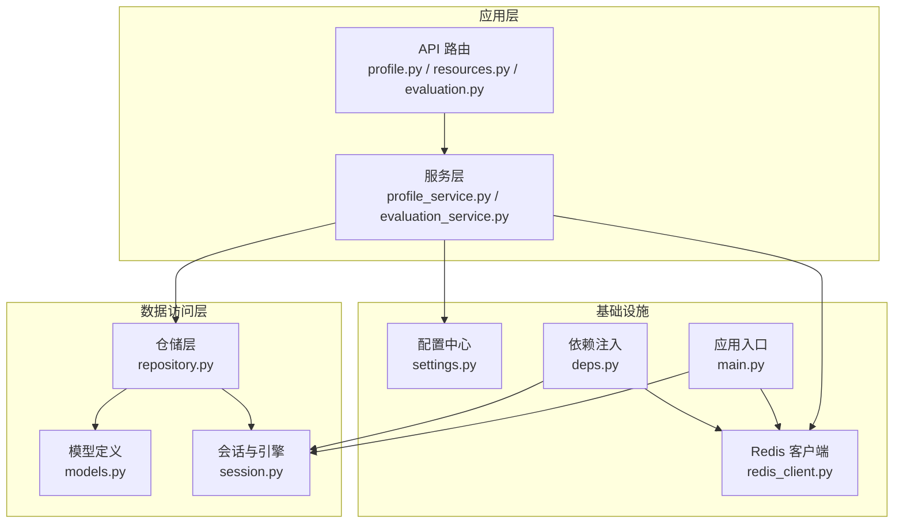
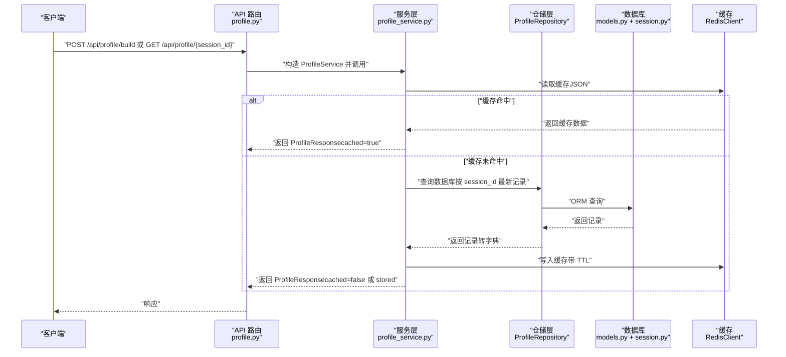
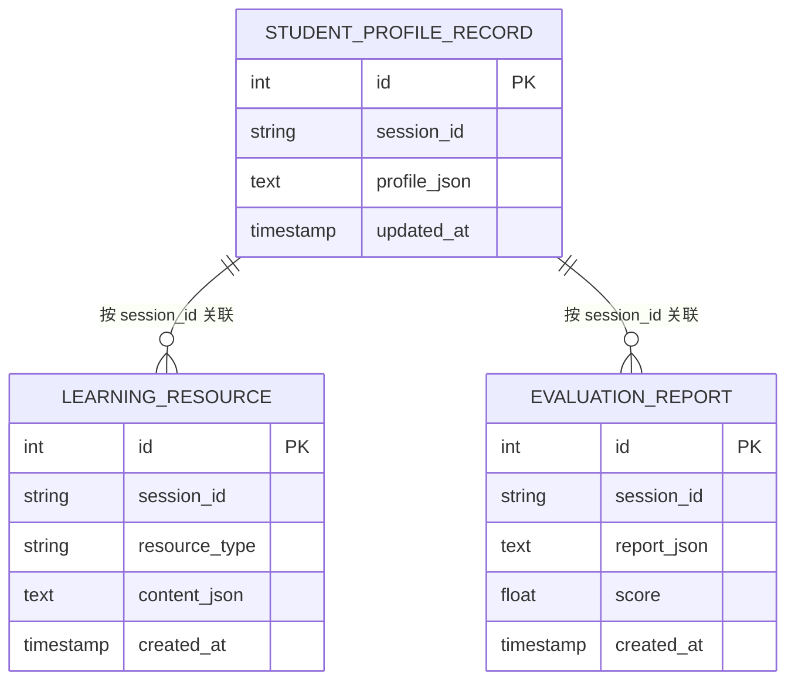
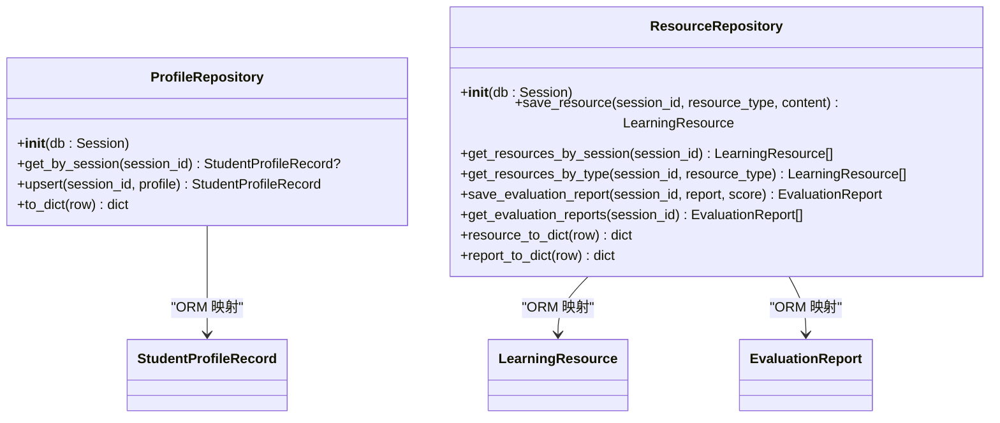
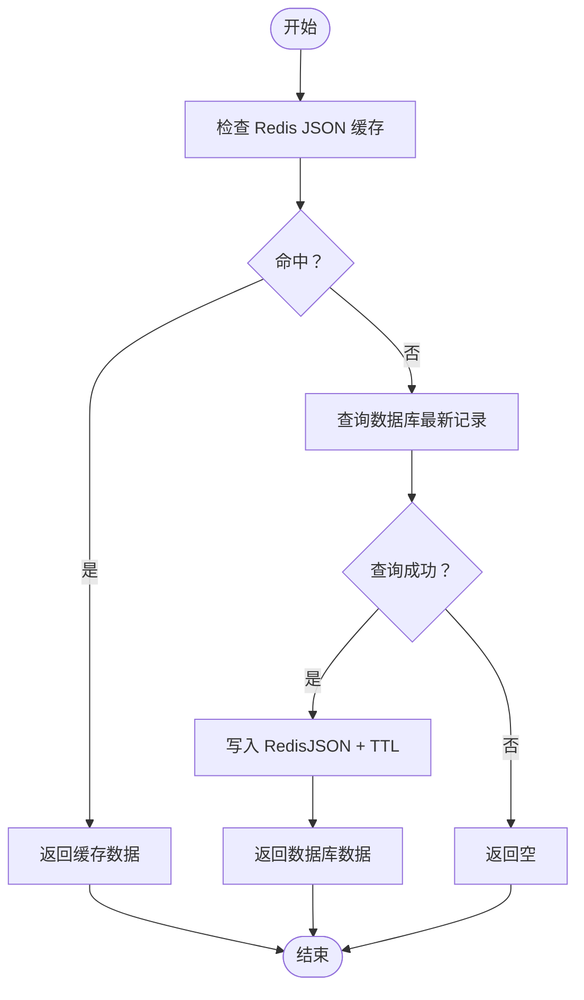
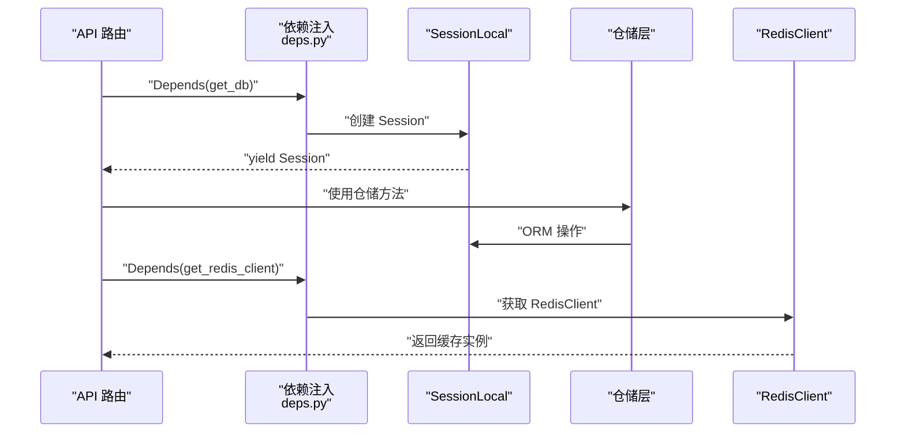
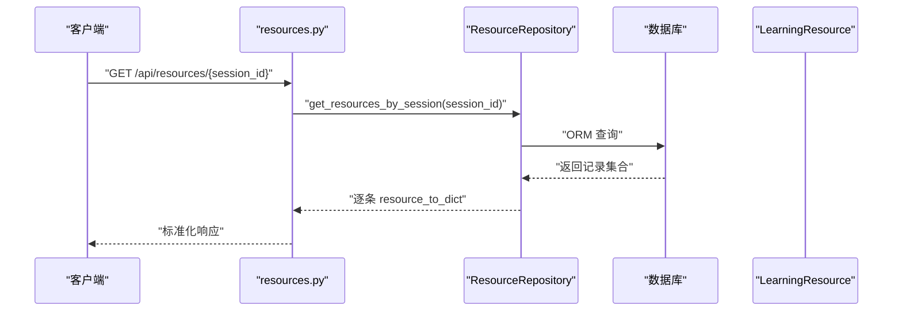
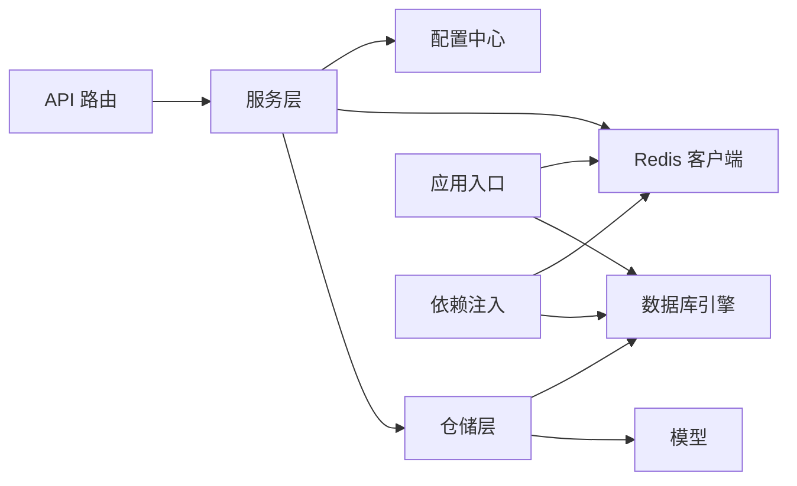

# 数据架构设计

<cite>
**本文引用的文件**
- [database/models.py](file://database/models.py)
- [database/repository.py](file://database/repository.py)
- [database/session.py](file://database/session.py)
- [backend/core/redis_client.py](file://backend/core/redis_client.py)
- [backend/settings.py](file://backend/settings.py)
- [backend/main.py](file://backend/main.py)
- [backend/core/deps.py](file://backend/core/deps.py)
- [api/routes/profile.py](file://api/routes/profile.py)
- [api/routes/resources.py](file://api/routes/resources.py)
- [api/routes/evaluation.py](file://api/routes/evaluation.py)
- [services/profile_service.py](file://services/profile_service.py)
- [services/evaluation_service.py](file://services/evaluation_service.py)
</cite>

## 目录
1. [简介](#简介)
2. [项目结构](#项目结构)
3. [核心组件](#核心组件)
4. [架构总览](#架构总览)
5. [详细组件分析](#详细组件分析)
6. [依赖分析](#依赖分析)
7. [性能考虑](#性能考虑)
8. [故障排查指南](#故障排查指南)
9. [结论](#结论)
10. [附录](#附录)

## 简介
本文件系统性阐述 EduAgent 的数据架构设计，围绕 SQLAlchemy ORM 与 Redis 缓存构建持久化与加速层，覆盖数据库模型定义、Repository 模式实现、数据库连接管理、缓存策略设计，并详细说明学生画像记录、学习资源、评估报告等实体关系。同时解释数据访问层的设计模式、事务管理、连接池配置，以及数据一致性保证、缓存失效策略与数据迁移方案。文末提供 ER 图与数据流图，帮助读者理解数据在系统中的流转与存储方式。

## 项目结构
EduAgent 后端采用分层架构：API 层负责路由与请求处理，服务层封装业务逻辑，数据层通过 SQLAlchemy ORM 定义模型与仓储，Redis 提供高性能缓存。应用生命周期在 FastAPI 的 lifespan 中初始化数据库与 Redis，并按需执行知识库入库。

图表来源
- [backend/main.py:23-41](file://backend/main.py#L23-L41)
- [database/session.py:14-22](file://database/session.py#L14-L22)
- [backend/core/redis_client.py:12-72](file://backend/core/redis_client.py#L12-L72)
- [backend/core/deps.py:12-25](file://backend/core/deps.py#L12-L25)
- [database/repository.py:12-117](file://database/repository.py#L12-L117)
- [database/models.py:9-40](file://database/models.py#L9-L40)
- [api/routes/profile.py:17-56](file://api/routes/profile.py#L17-L56)
- [api/routes/resources.py:34-50](file://api/routes/resources.py#L34-L50)
- [api/routes/evaluation.py:58-119](file://api/routes/evaluation.py#L58-L119)
- [services/profile_service.py:90-166](file://services/profile_service.py#L90-L166)
- [services/evaluation_service.py:89-251](file://services/evaluation_service.py#L89-L251)

章节来源
- [backend/main.py:23-41](file://backend/main.py#L23-L41)
- [database/session.py:14-22](file://database/session.py#L14-L22)
- [backend/core/redis_client.py:12-72](file://backend/core/redis_client.py#L12-L72)
- [backend/core/deps.py:12-25](file://backend/core/deps.py#L12-L25)

## 核心组件
- 数据库模型：定义三类核心实体，均继承自统一的 DeclarativeBase，具备会话标识、时间戳与 JSON 内容字段，满足动态结构存储与快速检索。
- 仓储层：提供 ProfileRepository 与 ResourceRepository，封装 CRUD 与查询聚合方法，负责数据序列化/反序列化与事务提交。
- 连接管理：通过 sessionmaker 创建 SessionLocal，按需创建 SQLite 文件或连接远程数据库，支持线程安全与连接池特性。
- 缓存层：RedisClient 封装 Redis 操作，不可用时自动降级为内存字典，保障主流程不中断；提供 TTL 控制与 JSON 序列化工具。
- 配置中心：集中管理数据库 URL、Redis URL、开关与缓存 TTL 等参数，支持环境变量加载与 CORS 配置。
- 依赖注入：提供 get_db 与 get_redis_client，确保路由与服务层以依赖注入方式获取会话与缓存实例。

章节来源
- [database/models.py:9-40](file://database/models.py#L9-L40)
- [database/repository.py:12-117](file://database/repository.py#L12-L117)
- [database/session.py:14-22](file://database/session.py#L14-L22)
- [backend/core/redis_client.py:12-72](file://backend/core/redis_client.py#L12-L72)
- [backend/settings.py:6-66](file://backend/settings.py#L6-L66)
- [backend/core/deps.py:12-25](file://backend/core/deps.py#L12-L25)

## 架构总览
下图展示从 API 到服务、仓储、数据库与缓存的整体交互路径，体现 Repository 模式与缓存优先策略。

图表来源
- [api/routes/profile.py:21-56](file://api/routes/profile.py#L21-L56)
- [services/profile_service.py:106-123](file://services/profile_service.py#L106-L123)
- [database/repository.py:16-44](file://database/repository.py#L16-L44)
- [database/models.py:13-20](file://database/models.py#L13-L20)
- [backend/core/redis_client.py:36-57](file://backend/core/redis_client.py#L36-L57)

## 详细组件分析

### 数据模型与实体关系
- 学生画像记录（StudentProfileRecord）：以 session_id 作为关联键，存储 JSON 字符串与更新时间，支持按最新更新排序。
- 学习资源（LearningResource）：记录资源类型与内容 JSON，按创建时间倒序查询，便于生成个性化资源。
- 评估报告（EvaluationReport）：记录评估 JSON、分数与创建时间，支持按会话查询历史报告。

图表来源
- [database/models.py:13-40](file://database/models.py#L13-L40)

章节来源
- [database/models.py:13-40](file://database/models.py#L13-L40)

### 仓储层设计与事务管理
- ProfileRepository
  - 读取：按 session_id 查询并按更新时间倒序取第一条，确保“最新”语义。
  - 写入：UPSERT 逻辑，序列化字典为 JSON，提交并刷新。
  - 反序列化：提供 to_dict，异常时回退为原始字符串包装。
- ResourceRepository
  - 资源保存：序列化内容 JSON，插入并提交。
  - 资源查询：按会话或类型过滤，按创建时间倒序。
  - 评估报告：保存 JSON 与可选分数，查询历史报告。
  - 反序列化：提供 resource_to_dict 与 report_to_dict，异常时回退。
- 事务管理：仓储方法内部 commit，确保单次操作原子性；Session 由依赖注入提供，路由结束自动关闭。

图表来源
- [database/repository.py:12-117](file://database/repository.py#L12-L117)
- [database/models.py:13-40](file://database/models.py#L13-L40)

章节来源
- [database/repository.py:12-117](file://database/repository.py#L12-L117)

### 缓存策略与一致性
- 缓存键命名：以固定前缀拼接 session_id，避免冲突。
- 读取顺序：优先读取 Redis JSON，未命中则回源数据库并反序列化。
- 写入策略：保存成功后同步写入 Redis，设置 TTL（来自配置），确保缓存新鲜度。
- 降级机制：Redis 不可用时自动切换内存字典，不影响主流程。
- 失效策略：基于 TTL 自然过期；未来可扩展在写入数据库成功后主动删除对应键，实现“强一致”。

图表来源
- [services/profile_service.py:106-123](file://services/profile_service.py#L106-L123)
- [backend/core/redis_client.py:36-57](file://backend/core/redis_client.py#L36-L57)
- [database/repository.py:16-44](file://database/repository.py#L16-L44)

章节来源
- [services/profile_service.py:106-123](file://services/profile_service.py#L106-L123)
- [backend/core/redis_client.py:12-72](file://backend/core/redis_client.py#L12-L72)

### 数据访问层与依赖注入
- get_db：创建 SessionLocal 实例，yield 给路由使用，finally 关闭，避免泄漏。
- get_redis_client：全局懒加载 RedisClient，确保应用启动时初始化。
- API 路由：profile.py 使用 ProfileService，resources.py 使用 ResourceRepository，evaluation.py 使用 EvaluationService，均通过依赖注入获取数据库与缓存。

图表来源
- [backend/core/deps.py:12-25](file://backend/core/deps.py#L12-L25)
- [database/session.py:14-18](file://database/session.py#L14-L18)
- [api/routes/profile.py:24-25](file://api/routes/profile.py#L24-L25)
- [api/routes/resources.py:37-38](file://api/routes/resources.py#L37-L38)
- [api/routes/evaluation.py:58-68](file://api/routes/evaluation.py#L58-L68)

章节来源
- [backend/core/deps.py:12-25](file://backend/core/deps.py#L12-L25)
- [database/session.py:14-18](file://database/session.py#L14-L18)

### 数据一致性与事务管理
- 单次写入事务：ProfileRepository.upsert、ResourceRepository.save_resource、save_evaluation_report 在同一事务内提交，保证原子性。
- 读写分离：缓存优先读取，写入后同步更新缓存，避免脏读。
- 连接管理：SQLite 使用线程安全参数，远程数据库按默认连接池行为；SessionLocal 默认非自动提交与自动刷新，由仓储显式控制。

章节来源
- [database/repository.py:24-36](file://database/repository.py#L24-L36)
- [database/repository.py:50-60](file://database/repository.py#L50-L60)
- [database/repository.py:81-91](file://database/repository.py#L81-L91)
- [database/session.py:14-18](file://database/session.py#L14-L18)

### 数据迁移方案
- 初始化：应用启动时调用 init_db，创建所有表结构，适用于 SQLite 文件或远程数据库。
- 版本演进：建议引入 Alembic 进行迁移脚本管理；当前仓库未包含迁移模块，后续可在此基础上扩展。
- 兼容性：新增字段建议保留默认值与非空约束变更时提供迁移脚本，避免破坏现有数据。

章节来源
- [backend/main.py:27-29](file://backend/main.py#L27-L29)
- [database/session.py:21-22](file://database/session.py#L21-L22)

### API 与数据流示例
- 获取资源列表：resources.py 路由调用 ResourceRepository.get_resources_by_session，逐条反序列化 content_json 并返回标准化结构。
- 评估报告：evaluation.py 路由接收学生画像与学习行为，交由 EvaluationService 生成报告并返回。

图表来源
- [api/routes/resources.py:34-50](file://api/routes/resources.py#L34-L50)
- [database/repository.py:62-79](file://database/repository.py#L62-L79)
- [database/models.py:22-30](file://database/models.py#L22-L30)

章节来源
- [api/routes/resources.py:34-50](file://api/routes/resources.py#L34-L50)
- [database/repository.py:62-79](file://database/repository.py#L62-L79)

## 依赖分析
- 组件耦合：服务层依赖仓储层与配置/缓存；仓储层依赖模型与 Session；API 路由依赖服务层与依赖注入。
- 外部依赖：SQLAlchemy ORM、Redis（可选）、FastAPI 生命周期钩子。
- 循环依赖：未发现直接循环；依赖方向清晰，符合分层原则。

图表来源
- [backend/main.py:23-41](file://backend/main.py#L23-L41)
- [backend/core/deps.py:12-25](file://backend/core/deps.py#L12-L25)
- [database/repository.py:12-117](file://database/repository.py#L12-L117)
- [database/models.py:9-40](file://database/models.py#L9-L40)
- [backend/core/redis_client.py:12-72](file://backend/core/redis_client.py#L12-L72)
- [backend/settings.py:6-66](file://backend/settings.py#L6-L66)

章节来源
- [backend/main.py:23-41](file://backend/main.py#L23-L41)
- [backend/core/deps.py:12-25](file://backend/core/deps.py#L12-L25)

## 性能考虑
- 缓存命中率：通过 profile_cache_ttl 控制缓存时效，结合高频读取场景可显著降低数据库压力。
- 查询优化：模型为 session_id 建立索引，仓储按时间倒序查询，减少扫描范围。
- 连接池：SessionLocal 默认行为适合当前并发模型；如需高并发，可调整连接池参数或引入连接池中间件。
- 序列化成本：JSON 字段频繁序列化/反序列化，建议在服务层进行批量处理与缓存复用。

## 故障排查指南
- Redis 不可用：RedisClient 会在初始化失败时记录警告并降级为内存字典，不影响主流程。可通过日志定位问题并修复 Redis 连接。
- 数据库连接异常：检查 database_url 配置与数据库可达性；SQLite 场景确认 ./database 目录权限。
- 缓存未命中：确认缓存键前缀与 TTL 设置；必要时清理旧键或缩短 TTL。
- 评估服务异常：evaluation.py 对异常进行捕获并返回 500，检查输入数据结构与服务日志。

章节来源
- [backend/core/redis_client.py:29-30](file://backend/core/redis_client.py#L29-L30)
- [backend/settings.py:12-14](file://backend/settings.py#L12-L14)
- [api/routes/evaluation.py:70-72](file://api/routes/evaluation.py#L70-L72)

## 结论
EduAgent 的数据架构以 SQLAlchemy ORM 与 Redis 缓存为核心，采用 Repository 模式实现清晰的数据访问边界，配合依赖注入与应用生命周期管理，实现了稳定、可扩展且易维护的数据层。通过缓存优先策略与事务控制，兼顾了性能与一致性。建议后续引入数据库迁移工具与更完善的缓存失效策略，持续提升系统的可靠性与可运维性。

## 附录
- 配置项摘要
  - database_url：数据库连接地址（默认 SQLite）
  - redis_url：Redis 连接地址（默认本地）
  - redis_enabled：是否启用 Redis
  - profile_cache_ttl：学生画像缓存 TTL（秒）

章节来源
- [backend/settings.py:12-14](file://backend/settings.py#L12-L14)
- [backend/settings.py:51](file://backend/settings.py#L51)