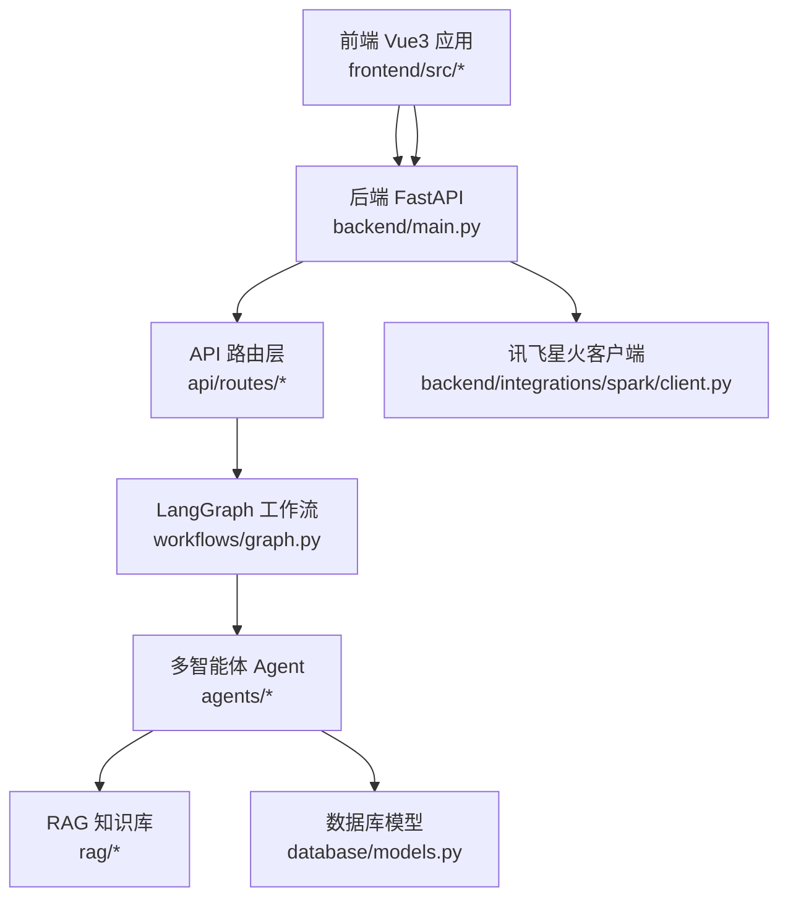
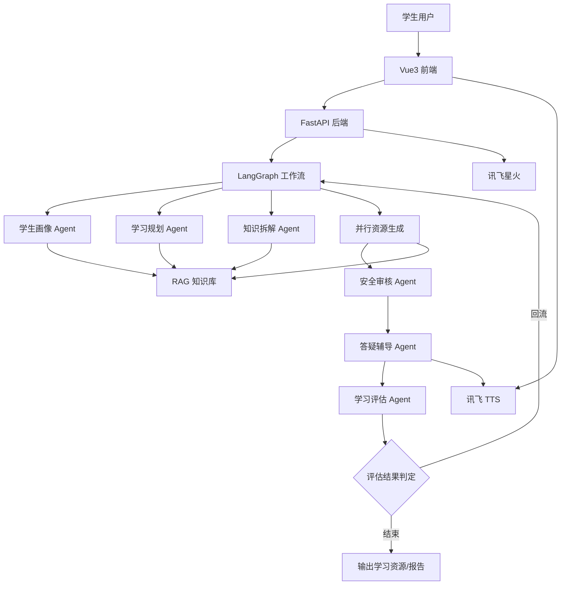
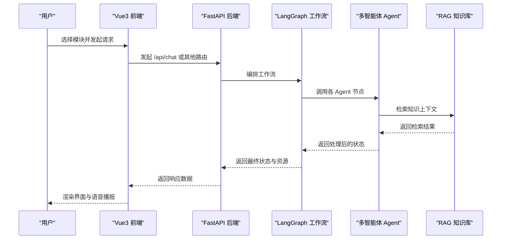
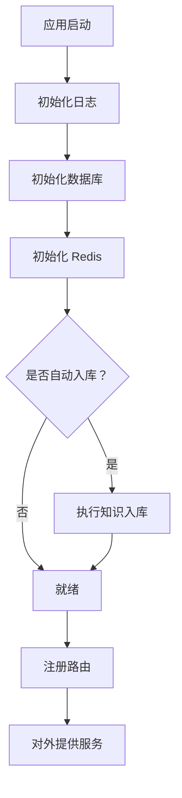
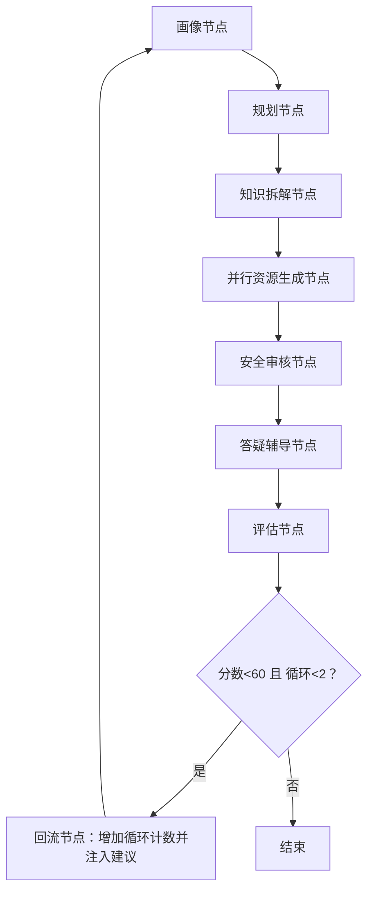
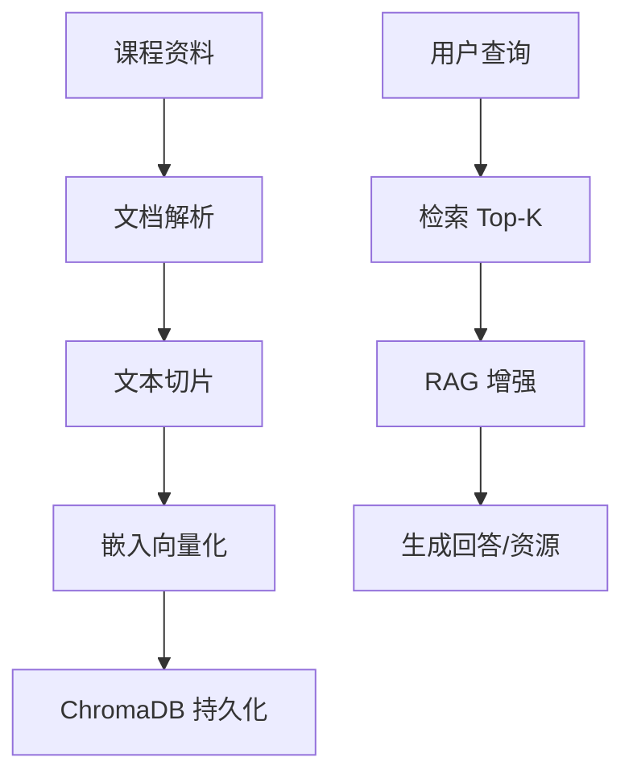
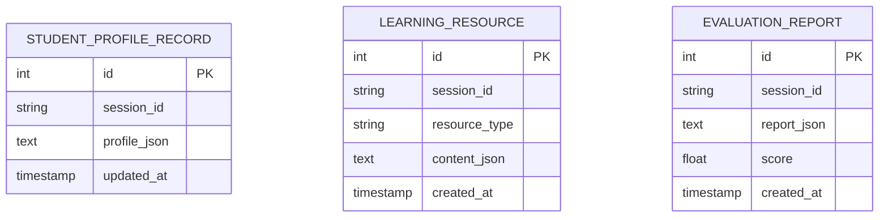
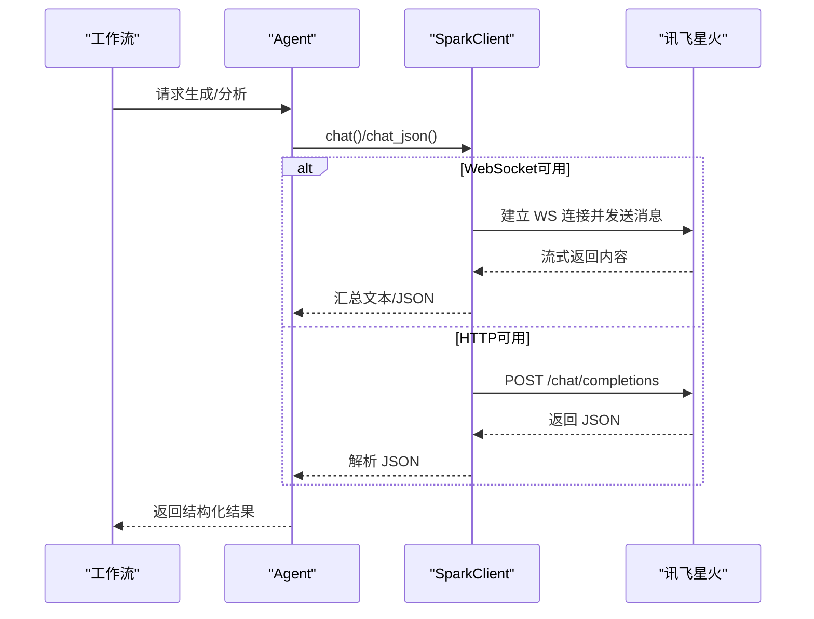
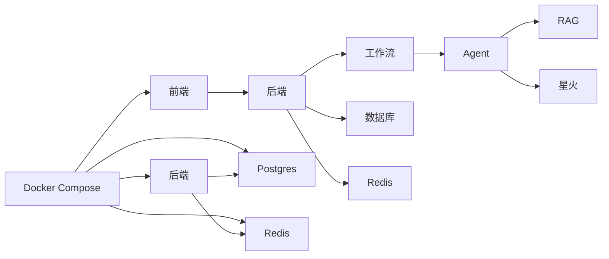

# 整体架构概览

<cite>
**本文引用的文件**
- [README.md](file://README.md)
- [software_cup_ai_education_system_architecture.md](file://software_cup_ai_education_system_architecture.md)
- [backend/main.py](file://backend/main.py)
- [backend/settings.py](file://backend/settings.py)
- [frontend/src/main.ts](file://frontend/src/main.ts)
- [frontend/src/App.vue](file://frontend/src/App.vue)
- [agents/base.py](file://agents/base.py)
- [workflows/graph.py](file://workflows/graph.py)
- [rag/__init__.py](file://rag/__init__.py)
- [rag/retriever.py](file://rag/retriever.py)
- [database/models.py](file://database/models.py)
- [docker/docker-compose.yml](file://docker/docker-compose.yml)
- [api/routes/chat.py](file://api/routes/chat.py)
- [backend/integrations/spark/client.py](file://backend/integrations/spark/client.py)
- [agents/profile_agent.py](file://agents/profile_agent.py)
</cite>

## 目录
1. [引言](#引言)
2. [项目结构](#项目结构)
3. [核心组件](#核心组件)
4. [架构总览](#架构总览)
5. [详细组件分析](#详细组件分析)
6. [依赖分析](#依赖分析)
7. [性能考量](#性能考量)
8. [故障排查指南](#故障排查指南)
9. [结论](#结论)
10. [附录](#附录)

## 引言
本文件面向EduAgent项目的整体架构，围绕“Vue3 + FastAPI + LangGraph + 讯飞星火”的分层设计，系统阐述前端单页应用、后端API层、多智能体系统层、RAG知识库层的职责划分、数据流向与通信机制；解释技术栈选择与架构权衡，并给出系统边界、第三方服务集成模式与安全设计要点，辅以架构图与组件关系图，帮助开发者快速理解与落地。

## 项目结构
EduAgent采用前后端分离与多层架构组织，主要目录与职责如下：
- frontend：Vue3 + TypeScript + TailwindCSS单页应用，负责用户交互与API调用
- backend：FastAPI入口与核心配置，提供统一API路由与中间件
- api/routes：按功能域划分的REST路由，如健康检查、RAG、语音、评估等
- agents：多智能体Agent抽象与实现，支撑画像、规划、资源生成、评估、安全等
- workflows：LangGraph工作流编排，串联多个Agent形成闭环
- rag：RAG知识库模块，包含加载、切片、嵌入、检索与向量存储
- database：SQLAlchemy模型与仓储，持久化学生画像、学习资源与评估报告
- docker：Docker镜像与Compose编排，统一服务编排与部署
- knowledge/prompts/scripts：课程资料、Prompt模板与辅助脚本

**图表来源**
- [backend/main.py:46-70](file://backend/main.py#L46-L70)
- [workflows/graph.py:186-211](file://workflows/graph.py#L186-L211)
- [rag/__init__.py:1-7](file://rag/__init__.py#L1-L7)
- [database/models.py:13-40](file://database/models.py#L13-L40)
- [backend/integrations/spark/client.py:19-198](file://backend/integrations/spark/client.py#L19-L198)

**章节来源**
- [README.md:23-40](file://README.md#L23-L40)
- [docker/docker-compose.yml:1-95](file://docker/docker-compose.yml#L1-L95)

## 核心组件
- 前端应用：基于Vue3的单页应用，通过fetch调用后端API，承载对话学习、个性化学习中心、资源生成、评估中心、语音学习与RAG知识库等模块。
- 后端API：FastAPI提供统一入口，注册CORS、健康检查与各功能路由；生命周期内初始化数据库、Redis与可选的知识入库。
- 多智能体系统：基于LangGraph的状态图，串联Profile、Planner、Knowledge、并行Resources、Safety、Tutor、Evaluation等节点，支持回流与闭环评估。
- RAG知识库：文档加载、切片、嵌入与ChromaDB向量检索，为Agent提供上下文增强。
- 第三方服务：讯飞星火（WebSocket/HTTP）、ASR/TTS，通过SparkClient与语音集成模块对接。
- 数据持久化：SQLAlchemy模型与仓储，分别存储学生画像、学习资源与评估报告。

**章节来源**
- [frontend/src/App.vue:12-86](file://frontend/src/App.vue#L12-L86)
- [backend/main.py:23-41](file://backend/main.py#L23-L41)
- [workflows/graph.py:26-36](file://workflows/graph.py#L26-L36)
- [rag/retriever.py:12-24](file://rag/retriever.py#L12-L24)
- [backend/integrations/spark/client.py:19-198](file://backend/integrations/spark/client.py#L19-L198)
- [database/models.py:13-40](file://database/models.py#L13-L40)

## 架构总览
EduAgent采用四层架构：
- 表现层：Vue3前端，负责用户交互与API调用
- API层：FastAPI，统一路由、中间件与生命周期管理
- 智能体层：LangGraph工作流 + 多Agent，实现画像、规划、资源生成、评估与安全闭环
- 基础设施层：RAG知识库、数据库、缓存、第三方服务（讯飞星火、ASR/TTS）

**图表来源**
- [software_cup_ai_education_system_architecture.md:68-127](file://software_cup_ai_education_system_architecture.md#L68-L127)
- [workflows/graph.py:186-211](file://workflows/graph.py#L186-L211)
- [backend/integrations/spark/client.py:19-198](file://backend/integrations/spark/client.py#L19-L198)

## 详细组件分析

### 前端组件分析（Vue3 SPA）
- 应用入口：创建Vue应用并挂载根组件
- 全局布局：侧边栏导航、顶部工具栏、页面切换与动画
- API调用：统一通过fetch访问后端API，如健康检查、RAG入库/查询、语音服务等
- 模块化组件：对话学习、个性化学习中心、资源生成、评估中心、语音学习、RAG知识库

**图表来源**
- [frontend/src/App.vue:29-68](file://frontend/src/App.vue#L29-L68)
- [api/routes/chat.py:23-36](file://api/routes/chat.py#L23-L36)
- [workflows/graph.py:186-211](file://workflows/graph.py#L186-L211)
- [rag/retriever.py:18-23](file://rag/retriever.py#L18-L23)

**章节来源**
- [frontend/src/main.ts:1-6](file://frontend/src/main.ts#L1-L6)
- [frontend/src/App.vue:12-86](file://frontend/src/App.vue#L12-L86)

### 后端API与路由（FastAPI）
- 生命周期：启动时初始化日志、数据库连接、Redis客户端；可选启动时自动RAG入库
- 中间件：CORS跨域配置，支持多Origin
- 路由注册：健康检查、聊天、RAG、画像、语音、评估、资源、进度、工作流等

**图表来源**
- [backend/main.py:23-41](file://backend/main.py#L23-L41)
- [backend/main.py:61-69](file://backend/main.py#L61-L69)

**章节来源**
- [backend/main.py:46-70](file://backend/main.py#L46-L70)
- [backend/settings.py:9-16](file://backend/settings.py#L9-L16)

### 多智能体与工作流（LangGraph）
- 节点与边：画像 → 规划 → 知识拆解 → 并行资源生成 → 安全 → 答疑 → 评估；评估后根据分数与循环次数决定回流或结束
- 并行资源生成：PPT、题库、代码、思维导图、视频脚本并行生成，聚合后持久化
- 回流机制：当评估分数低于阈值且循环次数未达上限时，注入建议并回到画像节点重新生成

**图表来源**
- [workflows/graph.py:186-211](file://workflows/graph.py#L186-L211)
- [workflows/graph.py:136-153](file://workflows/graph.py#L136-L153)
- [workflows/graph.py:156-183](file://workflows/graph.py#L156-L183)

**章节来源**
- [workflows/graph.py:26-36](file://workflows/graph.py#L26-L36)
- [workflows/graph.py:73-98](file://workflows/graph.py#L73-L98)
- [workflows/graph.py:125-133](file://workflows/graph.py#L125-L133)

### RAG知识库
- 组件职责：文档加载、文本切片、嵌入向量化、ChromaDB持久化、检索增强
- 检索器：封装向量检索调用，异常时返回空列表并记录警告

**图表来源**
- [rag/__init__.py:1-7](file://rag/__init__.py#L1-L7)
- [rag/retriever.py:12-24](file://rag/retriever.py#L12-L24)

**章节来源**
- [rag/__init__.py:1-7](file://rag/__init__.py#L1-L7)
- [rag/retriever.py:12-24](file://rag/retriever.py#L12-L24)

### 数据模型与持久化
- 学生画像记录：session_id、profile_json、更新时间
- 学习资源：session_id、resource_type、content_json、创建时间
- 评估报告：session_id、report_json、score、创建时间

**图表来源**
- [database/models.py:13-40](file://database/models.py#L13-L40)

**章节来源**
- [database/models.py:13-40](file://database/models.py#L13-L40)

### 第三方服务集成（讯飞星火）
- 星火客户端：支持WebSocket（Ultra）与HTTP两种模式，自动鉴权与消息格式转换
- 配置项：APPID、APIKey、APISecret、WS/HTTP地址、超时、模型参数等
- JSON解析：从模型输出中提取结构化JSON，兼容多种包裹形式

**图表来源**
- [backend/integrations/spark/client.py:19-198](file://backend/integrations/spark/client.py#L19-L198)
- [backend/settings.py:17-27](file://backend/settings.py#L17-L27)

**章节来源**
- [backend/integrations/spark/client.py:19-198](file://backend/integrations/spark/client.py#L19-L198)
- [backend/settings.py:17-27](file://backend/settings.py#L17-L27)

### 安全与配置
- 密钥管理：禁止将真实密钥提交到版本库，使用.env与CI Secrets，误提交需立即轮换
- CORS：通过配置允许前端Origin访问
- 日志：统一初始化日志级别与格式

**章节来源**
- [README.md:42-52](file://README.md#L42-L52)
- [backend/main.py:53-59](file://backend/main.py#L53-L59)
- [backend/settings.py:9-12](file://backend/settings.py#L9-L12)

## 依赖分析
- 前端依赖后端API，后端依赖LangGraph工作流与Agent，Agent依赖RAG与外部大模型
- 数据库与缓存贯穿画像、资源与评估环节，保障状态持久化与性能
- Docker Compose将Postgres、Redis、后端与前端编排为统一服务网络

**图表来源**
- [docker/docker-compose.yml:1-95](file://docker/docker-compose.yml#L1-L95)
- [backend/main.py:27-30](file://backend/main.py#L27-L30)

**章节来源**
- [docker/docker-compose.yml:1-95](file://docker/docker-compose.yml#L1-L95)
- [backend/main.py:27-30](file://backend/main.py#L27-L30)

## 性能考量
- 并行化：资源生成节点采用并发执行，缩短端到端时延
- 缓存：Redis用于画像与会话状态缓存，降低重复计算与数据库压力
- 向量化与检索：合理设置Top-K与切片策略，平衡召回与性能
- 限流与超时：星火客户端配置超时与最大令牌数，避免阻塞
- 部署：容器编排与健康检查，确保服务可用性与弹性恢复

## 故障排查指南
- 星火未配置：检查.env中的APPID/Key/Secret与WS/HTTP地址是否齐全
- CORS错误：确认后端CORS允许的Origin列表包含前端地址
- RAG检索失败：查看RAG检索器日志，确认向量库是否初始化成功
- 评估回流：关注评估分数与循环次数，必要时调整阈值与建议注入逻辑
- 健康检查：前端可调用/api/health验证后端可用性

**章节来源**
- [backend/integrations/spark/client.py:148-161](file://backend/integrations/spark/client.py#L148-L161)
- [backend/main.py:53-59](file://backend/main.py#L53-L59)
- [rag/retriever.py:20-23](file://rag/retriever.py#L20-L23)
- [workflows/graph.py:136-153](file://workflows/graph.py#L136-L153)

## 结论
EduAgent以Vue3 + FastAPI + LangGraph + 讯飞星火为核心，构建了可扩展的多智能体教育平台。通过清晰的分层与职责划分、完善的RAG知识库与闭环评估机制、以及严谨的安全与部署设计，系统在个性化学习、资源生成与智能答疑方面具备良好可维护性与演进空间。

## 附录
- 快速开始：安装依赖、启动后端、RAG入库、启动前端
- API参考：健康检查、RAG、画像、聊天、语音、评估、资源、进度、工作流等

**章节来源**
- [README.md:53-82](file://README.md#L53-L82)
- [README.md:83-94](file://README.md#L83-L94)