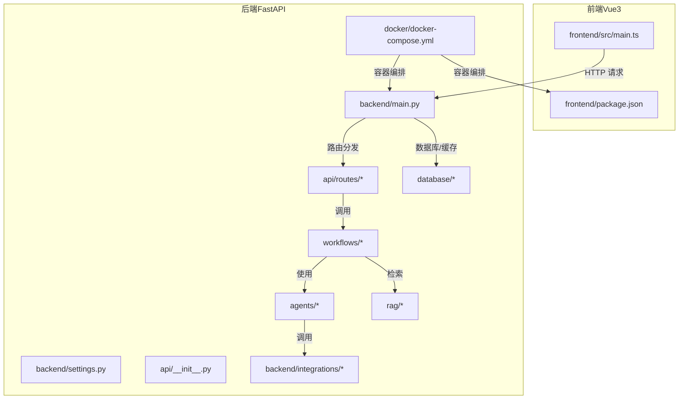
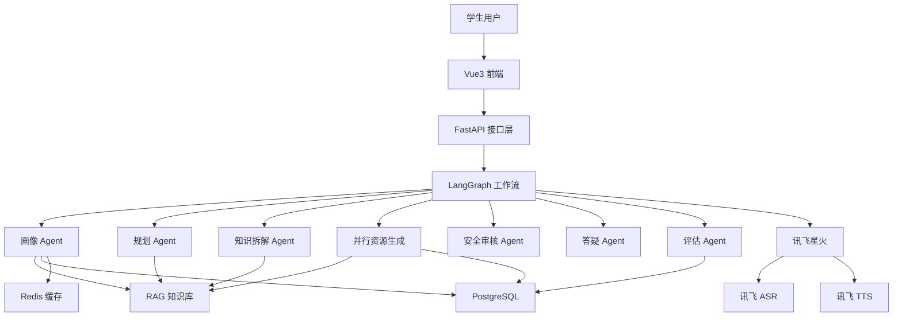
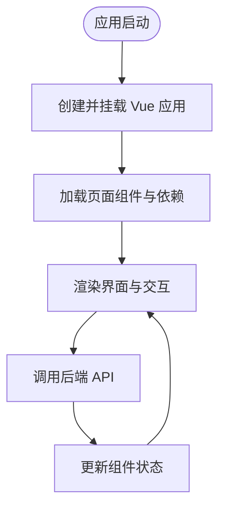
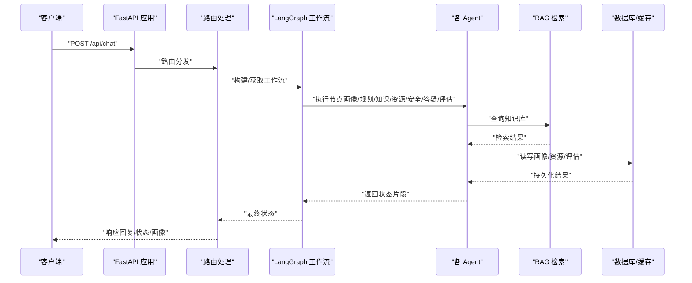
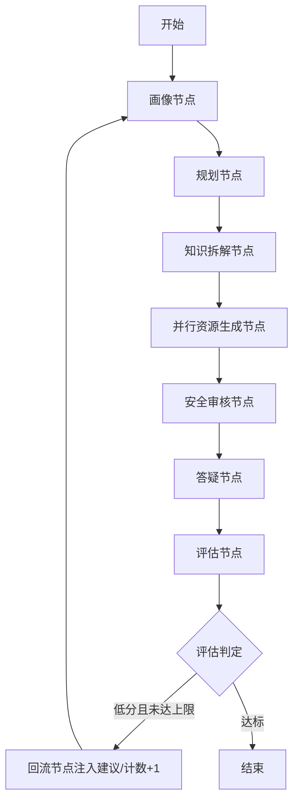
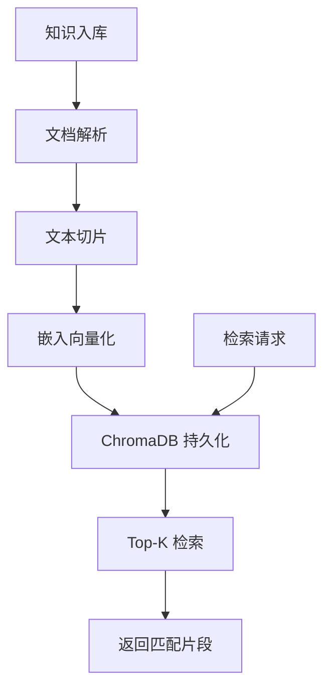
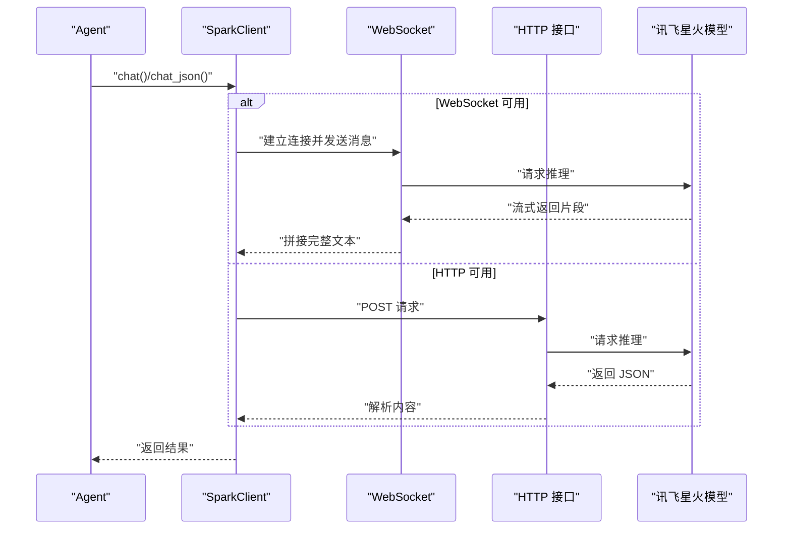
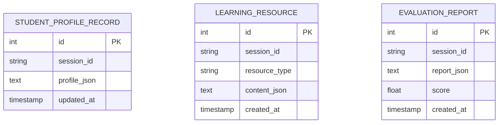
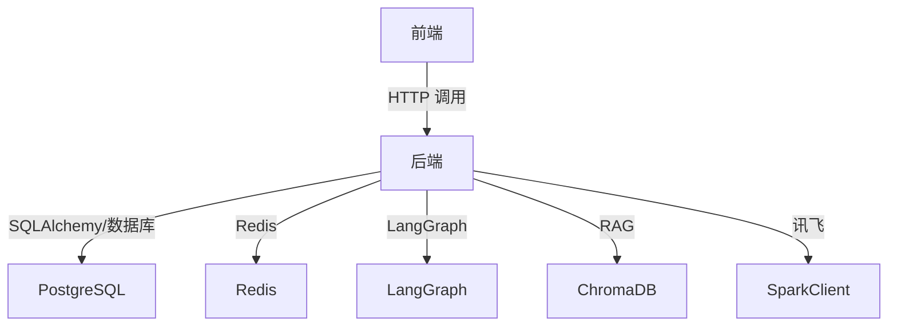

# 架构设计

<cite>
**本文引用的文件**
- [README.md](file://README.md)
- [software_cup_ai_education_system_architecture.md](file://software_cup_ai_education_system_architecture.md)
- [backend/main.py](file://backend/main.py)
- [backend/settings.py](file://backend/settings.py)
- [frontend/src/main.ts](file://frontend/src/main.ts)
- [frontend/package.json](file://frontend/package.json)
- [api/__init__.py](file://api/__init__.py)
- [api/routes/chat.py](file://api/routes/chat.py)
- [agents/base.py](file://agents/base.py)
- [agents/profile_agent.py](file://agents/profile_agent.py)
- [workflows/graph.py](file://workflows/graph.py)
- [rag/__init__.py](file://rag/__init__.py)
- [rag/retriever.py](file://rag/retriever.py)
- [backend/integrations/spark/client.py](file://backend/integrations/spark/client.py)
- [database/models.py](file://database/models.py)
- [docker/docker-compose.yml](file://docker/docker-compose.yml)
</cite>

## 目录
1. [引言](#引言)
2. [项目结构](#项目结构)
3. [核心组件](#核心组件)
4. [架构总览](#架构总览)
5. [详细组件分析](#详细组件分析)
6. [依赖分析](#依赖分析)
7. [性能考量](#性能考量)
8. [故障排查指南](#故障排查指南)
9. [结论](#结论)
10. [附录](#附录)

## 引言
本项目是一个基于 Vue3 + FastAPI + LangGraph + 讯飞星火的多智能体高校个性化学习平台。系统采用分层架构：前端 Vue3 单页应用负责交互与可视化；后端 FastAPI 提供统一 API；多智能体系统层由 LangGraph 编排；RAG 知识库层提供检索增强；同时集成讯飞语音识别与合成能力，形成“画像-规划-资源-评估”的闭环。

## 项目结构
系统采用按功能域划分的工程化目录组织方式，前后端分离，后端以模块化方式组织 API、Agent、Workflows、RAG、数据库与集成层，便于扩展与维护。

**图表来源**
- [backend/main.py:1-70](file://backend/main.py#L1-L70)
- [backend/settings.py:1-67](file://backend/settings.py#L1-L67)
- [frontend/src/main.ts:1-6](file://frontend/src/main.ts#L1-L6)
- [frontend/package.json:1-28](file://frontend/package.json#L1-L28)
- [api/__init__.py:1-2](file://api/__init__.py#L1-L2)
- [docker/docker-compose.yml:1-95](file://docker/docker-compose.yml#L1-L95)

**章节来源**
- [README.md:23-40](file://README.md#L23-L40)
- [backend/main.py:12-70](file://backend/main.py#L12-L70)
- [backend/settings.py:6-67](file://backend/settings.py#L6-L67)
- [frontend/src/main.ts:1-6](file://frontend/src/main.ts#L1-L6)
- [frontend/package.json:1-28](file://frontend/package.json#L1-L28)
- [docker/docker-compose.yml:1-95](file://docker/docker-compose.yml#L1-L95)

## 核心组件
- 前端 Vue3 应用：负责用户交互、组件化页面（对话学习、个性化学习中心、资源生成、学习评估、语音学习）、Markdown 渲染与可视化。
- 后端 FastAPI：统一入口、CORS、生命周期管理、路由注册、配置加载。
- 多智能体系统：基于 LangGraph 的状态机编排，包含画像、规划、知识拆解、资源生成、安全审核、答疑、评估等 Agent。
- RAG 知识库：文档解析、切片、嵌入、向量存储与检索。
- 第三方集成：讯飞星火（WebSocket/HTTP）、ASR、TTS。
- 数据与缓存：PostgreSQL、Redis。
- 部署：Docker Compose 多服务编排。

**章节来源**
- [README.md:27-39](file://README.md#L27-L39)
- [backend/main.py:23-70](file://backend/main.py#L23-L70)
- [workflows/graph.py:186-220](file://workflows/graph.py#L186-L220)
- [rag/__init__.py:1-7](file://rag/__init__.py#L1-L7)
- [backend/integrations/spark/client.py:19-198](file://backend/integrations/spark/client.py#L19-L198)
- [database/models.py:13-40](file://database/models.py#L13-L40)

## 架构总览
系统边界清晰：前端通过 HTTP 与后端交互；后端作为统一网关，聚合多智能体与 RAG 能力，并对接外部服务与内部数据库/缓存。多智能体通过 LangGraph 状态机串联，形成“画像-规划-知识拆解-并行资源生成-安全-答疑-评估”的闭环。

**图表来源**
- [software_cup_ai_education_system_architecture.md:68-127](file://software_cup_ai_education_system_architecture.md#L68-L127)
- [workflows/graph.py:26-36](file://workflows/graph.py#L26-L36)
- [backend/integrations/spark/client.py:19-198](file://backend/integrations/spark/client.py#L19-L198)
- [rag/retriever.py:12-24](file://rag/retriever.py#L12-L24)
- [database/models.py:13-40](file://database/models.py#L13-L40)

## 详细组件分析

### 前端组件分析（Vue3 + TypeScript + TailwindCSS）
- 应用入口：创建 Vue 应用并挂载根组件。
- 依赖：Vue3、Vite、TailwindCSS、Mermaid、Marked、Highlight.js。
- 页面模块：对话学习、个性化学习中心、资源生成、学习评估、语音学习等组件化页面。
- 交互：通过后端 API 获取状态与结果，渲染 Markdown、流程图与可视化。

**图表来源**
- [frontend/src/main.ts:1-6](file://frontend/src/main.ts#L1-L6)
- [frontend/package.json:11-27](file://frontend/package.json#L11-L27)

**章节来源**
- [frontend/src/main.ts:1-6](file://frontend/src/main.ts#L1-L6)
- [frontend/package.json:1-28](file://frontend/package.json#L1-L28)

### 后端组件分析（FastAPI）
- 生命周期：启动时初始化日志、数据库、Redis；可选自动 RAG 入库。
- 路由：健康检查、聊天、RAG、画像、语音、评估、资源、进度、工作流等。
- 配置：统一从环境变量加载，支持 CORS、讯飞、RAG、缓存等参数。
- 中间件：CORS 允许跨域访问。

**图表来源**
- [backend/main.py:23-70](file://backend/main.py#L23-L70)
- [api/routes/chat.py:23-37](file://api/routes/chat.py#L23-L37)
- [workflows/graph.py:186-220](file://workflows/graph.py#L186-L220)
- [rag/retriever.py:18-23](file://rag/retriever.py#L18-L23)
- [database/models.py:13-40](file://database/models.py#L13-L40)

**章节来源**
- [backend/main.py:23-70](file://backend/main.py#L23-L70)
- [backend/settings.py:6-67](file://backend/settings.py#L6-L67)
- [api/routes/chat.py:1-37](file://api/routes/chat.py#L1-L37)

### 多智能体系统（LangGraph）
- 编排：画像 → 规划 → 知识拆解 → 并行资源生成 → 安全 → 答疑 → 评估；支持回流机制（低分时回到画像调整）。
- 节点：每个 Agent 封装为异步节点，返回状态片段；资源节点并发执行多个子 Agent 并持久化。
- 回流：根据评估分数与循环次数判断是否回流至画像节点，并注入建议。

**图表来源**
- [workflows/graph.py:186-220](file://workflows/graph.py#L186-L220)
- [workflows/graph.py:136-154](file://workflows/graph.py#L136-L154)
- [workflows/graph.py:156-184](file://workflows/graph.py#L156-L184)

**章节来源**
- [workflows/graph.py:26-36](file://workflows/graph.py#L26-L36)
- [workflows/graph.py:73-99](file://workflows/graph.py#L73-L99)
- [workflows/graph.py:125-134](file://workflows/graph.py#L125-L134)
- [workflows/graph.py:136-154](file://workflows/graph.py#L136-L154)
- [workflows/graph.py:156-184](file://workflows/graph.py#L156-L184)

### RAG 知识库层
- 组件：文档解析、切片、嵌入、向量存储、检索器。
- 检索：基于 ChromaDB 向量库，支持 Top-K 查询；异常时返回空列表并记录警告。
- 入库：支持目录级批量入库与统计摘要。

**图表来源**
- [rag/retriever.py:12-24](file://rag/retriever.py#L12-L24)
- [rag/__init__.py:3-7](file://rag/__init__.py#L3-L7)

**章节来源**
- [rag/retriever.py:12-24](file://rag/retriever.py#L12-L24)
- [rag/__init__.py:1-7](file://rag/__init__.py#L1-L7)

### 讯飞星火集成
- 客户端：优先 WebSocket（Spark Ultra v4），可选 HTTP 开放接口；支持消息格式转换与错误处理。
- JSON 解析：从模型输出中提取 JSON 片段，兼容多种包裹形式。
- 配置：通过 Settings 加载密钥与域名；支持密码鉴权头。

**图表来源**
- [backend/integrations/spark/client.py:19-198](file://backend/integrations/spark/client.py#L19-L198)

**章节来源**
- [backend/integrations/spark/client.py:19-198](file://backend/integrations/spark/client.py#L19-L198)
- [backend/settings.py:17-27](file://backend/settings.py#L17-L27)

### 数据模型与持久化
- 模型：学生画像记录、学习资源、评估报告。
- 仓库：提供画像与资源的读写、缓存键管理。
- 缓存：Redis 缓存画像，提升重复请求性能；数据库持久化长期数据。

**图表来源**
- [database/models.py:13-40](file://database/models.py#L13-L40)

**章节来源**
- [database/models.py:13-40](file://database/models.py#L13-L40)

## 依赖分析
- 前端依赖：Vue3、Vite、TailwindCSS、Mermaid、Marked、Highlight.js。
- 后端依赖：FastAPI、SQLAlchemy、Pydantic、websockets、httpx、LangGraph、ChromaDB、Redis。
- 部署依赖：Docker、docker-compose。

**图表来源**
- [frontend/package.json:11-27](file://frontend/package.json#L11-L27)
- [backend/main.py:12-70](file://backend/main.py#L12-L70)
- [docker/docker-compose.yml:1-95](file://docker/docker-compose.yml#L1-95)

**章节来源**
- [frontend/package.json:1-28](file://frontend/package.json#L1-L28)
- [backend/main.py:12-70](file://backend/main.py#L12-L70)
- [docker/docker-compose.yml:1-95](file://docker/docker-compose.yml#L1-95)

## 性能考量
- 并行资源生成：工作流中的资源节点并发执行多个子 Agent，缩短端到端时延。
- 缓存策略：Redis 缓存画像与短期状态，减少重复计算与数据库压力。
- 检索优化：Top-K 检索限制上下文规模，结合温度与最大令牌控制生成稳定性。
- 连接池与超时：HTTP/WS 客户端设置合理超时，避免阻塞；WebSocket 流式返回降低首字延迟。
- 数据库索引：按 session_id 建立索引，加速画像与资源查询。

## 故障排查指南
- 星火未配置：当密钥未配置时，画像与相关功能将降级为规则引擎兜底；检查环境变量与配置项。
- RAG 检索失败：检索器捕获异常并返回空列表，确认向量库是否初始化成功。
- 评估回流：评估分数低于阈值且循环次数未达上限时自动回流至画像节点，检查评估报告与建议字段。
- CORS 问题：确保前端地址在后端 CORS 白名单中。
- Docker 服务不可用：检查容器健康检查与端口映射，确认数据库与缓存服务可用。

**章节来源**
- [backend/integrations/spark/client.py:148-162](file://backend/integrations/spark/client.py#L148-L162)
- [rag/retriever.py:18-23](file://rag/retriever.py#L18-L23)
- [workflows/graph.py:136-154](file://workflows/graph.py#L136-L154)
- [backend/main.py:53-59](file://backend/main.py#L53-L59)
- [docker/docker-compose.yml:57-62](file://docker/docker-compose.yml#L57-L62)

## 结论
该架构以 Vue3 为前端入口、FastAPI 为后端网关、LangGraph 为编排中枢、RAG 为知识增强、讯飞星火为大模型能力，结合 Redis 与 PostgreSQL 形成高内聚、低耦合的分层体系。通过并行资源生成、回流评估闭环与缓存策略，系统在可扩展性与用户体验之间取得平衡。建议后续持续完善监控与可观测性、引入限流与熔断策略，并加强安全审计与密钥轮换流程。

## 附录
- 技术选型与权衡
  - 前端：Vue3 + TailwindCSS，组件化与样式简洁，适合快速迭代。
  - 后端：FastAPI，类型安全与自动生成文档，便于 API 设计与协作。
  - 多智能体：LangGraph，状态机编排清晰，易于扩展与调试。
  - RAG：ChromaDB + BGE 嵌入，轻量易部署，适合教学场景。
  - 语音：讯飞 ASR/TTS，生态完善，适配中文场景。
  - 部署：Docker Compose，一键编排，便于本地与生产环境一致性。

- 系统边界与集成
  - 前后端边界：HTTP API，明确请求/响应契约。
  - 外部服务：讯飞星火、ASR、TTS，通过独立客户端封装。
  - 内部边界：Agent 间通过共享状态传递，避免紧耦合。

- 安全设计
  - 密钥管理：仅本地 .env，不提交到仓库；CI/CD 使用 Secrets。
  - CORS 白名单：仅允许受信前端域名。
  - 传输安全：WebSocket 与 HTTPS，错误信息避免泄露敏感细节。