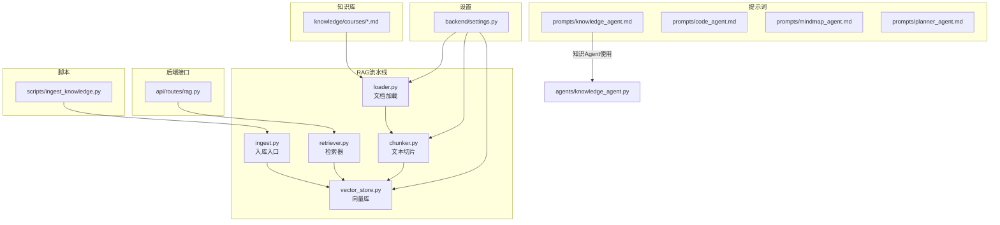
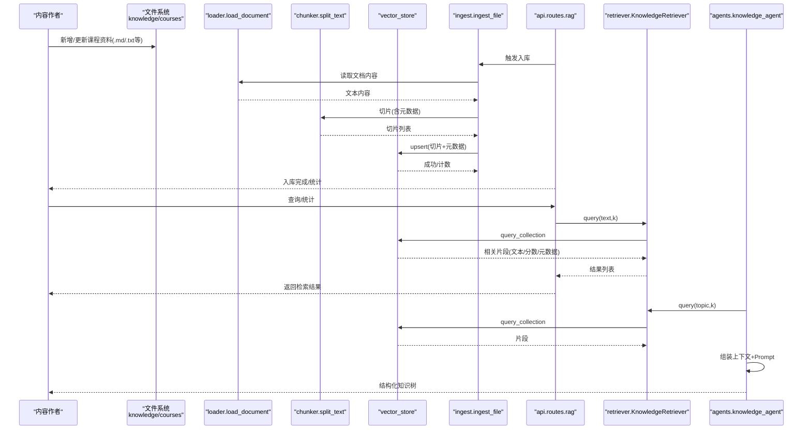
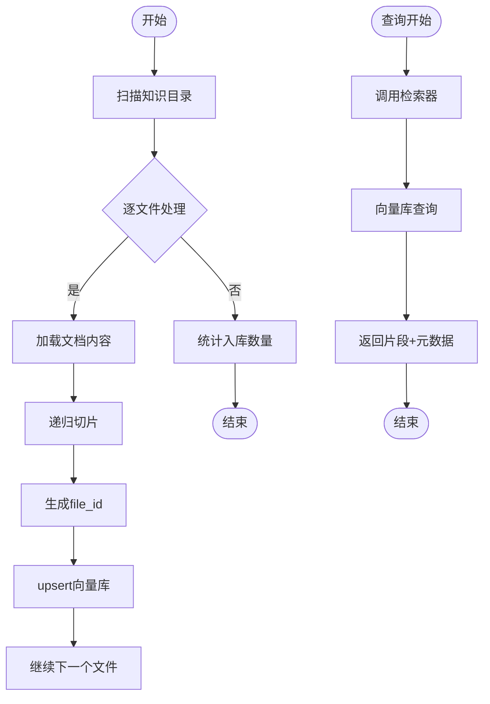
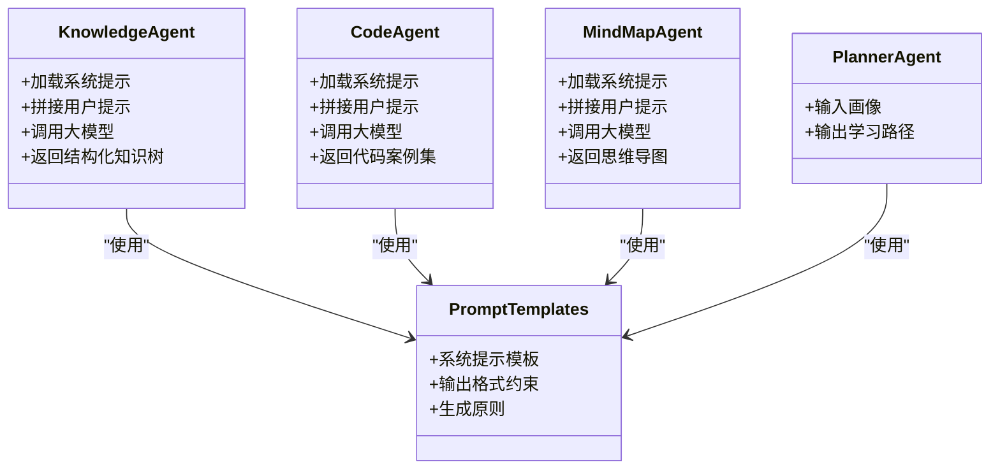
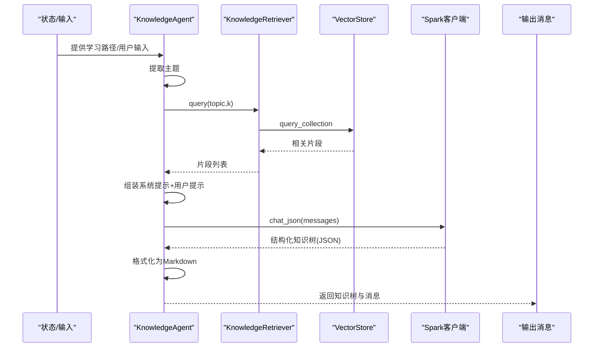
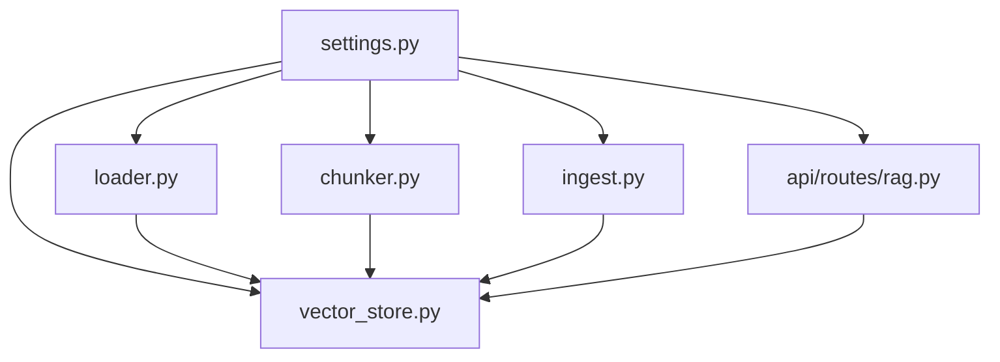

# 知识库和提示词管理

<cite>
**本文引用的文件**   
- [README.md](file://README.md)
- [software_cup_ai_education_system_architecture.md](file://software_cup_ai_education_system_architecture.md)
- [backend/settings.py](file://backend/settings.py)
- [rag/loader.py](file://rag/loader.py)
- [rag/chunker.py](file://rag/chunker.py)
- [rag/vector_store.py](file://rag/vector_store.py)
- [rag/ingest.py](file://rag/ingest.py)
- [rag/retriever.py](file://rag/retriever.py)
- [scripts/ingest_knowledge.py](file://scripts/ingest_knowledge.py)
- [api/routes/rag.py](file://api/routes/rag.py)
- [knowledge/courses/python_basics.md](file://knowledge/courses/python_basics.md)
- [knowledge/courses/lanqiao_python.md](file://knowledge/courses/lanqiao_python.md)
- [prompts/knowledge_agent.md](file://prompts/knowledge_agent.md)
- [prompts/code_agent.md](file://prompts/code_agent.md)
- [prompts/mindmap_agent.md](file://prompts/mindmap_agent.md)
- [prompts/planner_agent.md](file://prompts/planner_agent.md)
- [agents/knowledge_agent.py](file://agents/knowledge_agent.py)
- [schemas/profile.py](file://schemas/profile.py)
</cite>

## 目录
1. [引言](#引言)
2. [项目结构](#项目结构)
3. [核心组件](#核心组件)
4. [架构总览](#架构总览)
5. [详细组件分析](#详细组件分析)
6. [依赖分析](#依赖分析)
7. [性能考虑](#性能考虑)
8. [故障排查指南](#故障排查指南)
9. [结论](#结论)
10. [附录](#附录)

## 引言
本文件聚焦EduAgent的知识库与提示词管理体系，系统阐述课程知识库的组织结构、Markdown文档格式规范、知识内容的维护策略；描述Prompt模板的设计原则、参数化机制与上下文管理；解释知识库的扩展方式、内容更新流程与质量控制机制；并提供提示词优化指南、知识库维护最佳实践与内容创作规范。同时给出实际的知识库示例、提示词模板与内容管理工具使用指南，帮助读者快速上手并高质量运营知识库与提示词体系。

## 项目结构
EduAgent采用“知识库 + RAG + 多智能体”的架构模式，知识库以Markdown为主，配合脚本与API实现自动化入库与检索；提示词以独立文件形式集中管理，供各Agent按需加载与拼接上下文。

图表来源
- [backend/settings.py:1-67](file://backend/settings.py#L1-L67)
- [rag/loader.py:1-51](file://rag/loader.py#L1-L51)
- [rag/chunker.py:1-21](file://rag/chunker.py#L1-L21)
- [rag/vector_store.py:1-65](file://rag/vector_store.py#L1-L65)
- [rag/ingest.py:1-48](file://rag/ingest.py#L1-L48)
- [rag/retriever.py:1-24](file://rag/retriever.py#L1-L24)
- [scripts/ingest_knowledge.py:1-23](file://scripts/ingest_knowledge.py#L1-L23)
- [api/routes/rag.py:1-43](file://api/routes/rag.py#L1-L43)
- [prompts/knowledge_agent.md:1-17](file://prompts/knowledge_agent.md#L1-L17)
- [prompts/code_agent.md:1-22](file://prompts/code_agent.md#L1-L22)
- [prompts/mindmap_agent.md:1-16](file://prompts/mindmap_agent.md#L1-L16)
- [prompts/planner_agent.md:1-76](file://prompts/planner_agent.md#L1-L76)
- [agents/knowledge_agent.py:1-140](file://agents/knowledge_agent.py#L1-L140)

章节来源
- [README.md:23-40](file://README.md#L23-L40)
- [software_cup_ai_education_system_architecture.md:194-222](file://software_cup_ai_education_system_architecture.md#L194-L222)

## 核心组件
- 知识库组织与格式
  - 课程资料统一存放于knowledge/courses目录，采用Markdown格式，支持章节、列表、代码块等结构，便于后续解析与切片。
  - 示例文件包括Python基础与蓝桥杯备考要点，体现从基础到竞赛的层次化组织思路。
- RAG流水线
  - 文档加载：loader负责识别多种文档类型并提取纯文本。
  - 文本切片：chunker使用递归字符分割器，按段落、句子与空白进行切分，保留元数据以便溯源。
  - 向量库：vector_store对接ChromaDB持久化存储，提供upsert与查询能力。
  - 入库入口：ingest协调文件扫描、切片与入库，支持批量与错误处理。
  - 检索器：retriever封装查询逻辑，异常降级为空结果。
- 提示词模板
  - prompts目录集中管理各Agent的Prompt模板，包含输出格式、生成原则与上下文约束，便于版本化与复用。
- 设置与配置
  - settings集中定义知识库路径、向量库路径、集合名、嵌入模型、切片尺寸与重叠、TopK等关键参数。
- 接口与脚本
  - API提供入库、查询、统计等接口；脚本提供命令行一键入库与汇总信息打印。

章节来源
- [knowledge/courses/python_basics.md:1-54](file://knowledge/courses/python_basics.md#L1-L54)
- [knowledge/courses/lanqiao_python.md:1-25](file://knowledge/courses/lanqiao_python.md#L1-L25)
- [rag/loader.py:11-19](file://rag/loader.py#L11-L19)
- [rag/chunker.py:8-20](file://rag/chunker.py#L8-L20)
- [rag/vector_store.py:34-59](file://rag/vector_store.py#L34-L59)
- [rag/ingest.py:21-41](file://rag/ingest.py#L21-L41)
- [rag/retriever.py:18-23](file://rag/retriever.py#L18-L23)
- [backend/settings.py:41-49](file://backend/settings.py#L41-L49)
- [api/routes/rag.py:24-42](file://api/routes/rag.py#L24-L42)
- [scripts/ingest_knowledge.py:13-18](file://scripts/ingest_knowledge.py#L13-L18)

## 架构总览
下图展示从知识库到RAG检索再到Agent使用的整体流程，以及提示词在知识拆解过程中的上下文注入。

图表来源
- [api/routes/rag.py:29-42](file://api/routes/rag.py#L29-L42)
- [rag/ingest.py:21-41](file://rag/ingest.py#L21-L41)
- [rag/loader.py:11-19](file://rag/loader.py#L11-L19)
- [rag/chunker.py:8-20](file://rag/chunker.py#L8-L20)
- [rag/vector_store.py:45-59](file://rag/vector_store.py#L45-L59)
- [rag/retriever.py:18-23](file://rag/retriever.py#L18-L23)
- [agents/knowledge_agent.py:109-140](file://agents/knowledge_agent.py#L109-L140)

## 详细组件分析

### 知识库组织与维护策略
- 组织结构
  - 课程资料位于knowledge/courses，按主题分文件存放，便于检索与版本管理。
  - 文件命名建议采用语义化英文或拼音，避免特殊字符，利于自动化扫描与溯源。
- Markdown格式规范
  - 使用清晰的标题层级（主标题、章节、子章节），配合列表与代码块提升可读性。
  - 示例：Python基础与蓝桥杯备考要点展示了从基础语法到竞赛要点的结构化组织。
- 维护策略
  - 变更流程：新增/修改→本地校验→提交→触发入库→验证检索→发布。
  - 版本控制：每次重大修订保留历史版本，必要时标注修订日期与变更摘要。
  - 质量控制：内容应覆盖核心知识点、提供示例与易错点总结，避免冗余与模糊表述。

章节来源
- [knowledge/courses/python_basics.md:1-54](file://knowledge/courses/python_basics.md#L1-L54)
- [knowledge/courses/lanqiao_python.md:1-25](file://knowledge/courses/lanqiao_python.md#L1-L25)

### RAG入库与检索流程
- 入库流程
  - 扫描知识目录→逐文件加载→切片→生成唯一file_id→upsert至向量库→记录统计。
  - 错误处理：单文件异常不影响整体入库，日志记录失败路径与原因。
- 检索流程
  - 接收查询文本→调用检索器→查询向量库→返回文本、相似度与元数据→前端/Agent消费。
- 配置要点
  - 切片大小与重叠、TopK、集合名、持久化路径等均来自settings，便于统一管理与横向对比。

图表来源
- [rag/ingest.py:31-41](file://rag/ingest.py#L31-L41)
- [rag/loader.py:41-50](file://rag/loader.py#L41-L50)
- [rag/chunker.py:8-20](file://rag/chunker.py#L8-L20)
- [rag/vector_store.py:34-42](file://rag/vector_store.py#L34-L42)
- [rag/retriever.py:18-23](file://rag/retriever.py#L18-L23)

章节来源
- [rag/ingest.py:1-48](file://rag/ingest.py#L1-L48)
- [rag/loader.py:1-51](file://rag/loader.py#L1-L51)
- [rag/chunker.py:1-21](file://rag/chunker.py#L1-L21)
- [rag/vector_store.py:1-65](file://rag/vector_store.py#L1-L65)
- [rag/retriever.py:1-24](file://rag/retriever.py#L1-L24)
- [backend/settings.py:41-49](file://backend/settings.py#L41-L49)

### 提示词模板设计与参数化
- 设计原则
  - 明确输出格式：JSON字段、层级结构、可渲染格式（如Mermaid）。
  - 生成原则：结构清晰、层次合理、内容完整、适配用户画像、包含检索上下文。
- 参数化机制
  - 系统提示：从prompts目录读取模板，作为system角色固定上下文。
  - 用户提示：动态拼接主题、用户画像、RAG检索上下文与输出约束。
  - 上下文管理：限制检索片段数量与长度，避免上下文过长导致性能与成本问题。
- 示例模板
  - 知识拆解Agent：要求输出JSON结构化知识树，包含主题、层级与节点关系。
  - 代码案例Agent：要求输出包含示例标题、描述、代码、语言、预期输出、关键知识点与难度的JSON。
  - 思维导图Agent：要求输出根节点与递归子节点的JSON，并可转为Mermaid格式。
  - 学习规划Agent：定义完整的输入画像字段与输出JSON结构，包含学习路径名称、周数、步骤、关注领域与建议。

图表来源
- [prompts/knowledge_agent.md:1-17](file://prompts/knowledge_agent.md#L1-L17)
- [prompts/code_agent.md:1-22](file://prompts/code_agent.md#L1-L22)
- [prompts/mindmap_agent.md:1-16](file://prompts/mindmap_agent.md#L1-L16)
- [prompts/planner_agent.md:1-76](file://prompts/planner_agent.md#L1-L76)
- [agents/knowledge_agent.py:19-24](file://agents/knowledge_agent.py#L19-L24)

章节来源
- [prompts/knowledge_agent.md:1-17](file://prompts/knowledge_agent.md#L1-L17)
- [prompts/code_agent.md:1-22](file://prompts/code_agent.md#L1-L22)
- [prompts/mindmap_agent.md:1-16](file://prompts/mindmap_agent.md#L1-L16)
- [prompts/planner_agent.md:1-76](file://prompts/planner_agent.md#L1-L76)
- [agents/knowledge_agent.py:19-24](file://agents/knowledge_agent.py#L19-L24)

### 知识拆解Agent的工作流
- 主题提取：优先从学习路径中提取主题，否则回退到用户输入。
- 检索增强：调用RAG检索器获取相关片段，拼接为上下文。
- 大模型生成：加载系统提示与用户提示，调用星火客户端生成JSON结构化知识树。
- 规则兜底：当星火不可用或异常时，使用启发式规则生成知识树。
- 结果格式化：将知识树转为Markdown便于前端渲染与分享。

图表来源
- [agents/knowledge_agent.py:79-140](file://agents/knowledge_agent.py#L79-L140)
- [rag/retriever.py:18-23](file://rag/retriever.py#L18-L23)
- [rag/vector_store.py:45-59](file://rag/vector_store.py#L45-L59)

章节来源
- [agents/knowledge_agent.py:1-140](file://agents/knowledge_agent.py#L1-L140)
- [schemas/profile.py:8-36](file://schemas/profile.py#L8-L36)

### 内容管理工具使用指南
- 命令行入库
  - 使用脚本触发知识库入库，打印新增切片数量与向量库统计信息。
- API入库
  - 支持同步与异步两种模式：同步立即返回结果，异步后台任务完成后可通过统计接口查看进度。
- 检索与统计
  - 通过查询接口返回检索结果，通过统计接口查看当前集合中的切片数量与集合名。

章节来源
- [scripts/ingest_knowledge.py:13-18](file://scripts/ingest_knowledge.py#L13-L18)
- [api/routes/rag.py:29-42](file://api/routes/rag.py#L29-L42)

## 依赖分析
- 组件耦合
  - RAG流水线内部高内聚：loader→chunker→vector_store→ingest→retriever，职责清晰、链路稳定。
  - 提示词与Agent松耦合：通过文件路径加载，便于独立演进与A/B测试。
- 外部依赖
  - 向量库：ChromaDB持久化，支持Cosine距离空间。
  - 嵌入模型：BGE系列，settings中可配置。
  - 大模型：讯飞星火，支持WebSocket与HTTP两种接入方式。
- 配置集中化
  - settings统一管理知识库路径、集合名、切片参数、TopK等，便于运维与性能调优。

图表来源
- [backend/settings.py:41-49](file://backend/settings.py#L41-L49)
- [rag/loader.py:11-19](file://rag/loader.py#L11-L19)
- [rag/chunker.py:8-20](file://rag/chunker.py#L8-L20)
- [rag/vector_store.py:24-31](file://rag/vector_store.py#L24-L31)
- [rag/ingest.py:32-33](file://rag/ingest.py#L32-L33)
- [api/routes/rag.py:24-26](file://api/routes/rag.py#L24-L26)

章节来源
- [backend/settings.py:1-67](file://backend/settings.py#L1-L67)
- [rag/vector_store.py:16-31](file://rag/vector_store.py#L16-L31)

## 性能考虑
- 切片参数
  - chunk_size与chunk_overlap影响召回质量与上下文长度，需结合模型上下文窗口权衡。
- TopK与相似度
  - TopK越大召回越多但耗时增长；相似度阈值可根据业务需求调整。
- 并发与批处理
  - 入库支持批量文件处理，建议在磁盘与网络带宽允许范围内并发切片与upsert。
- 缓存与持久化
  - 向量库持久化路径与集合名需稳定，避免频繁重建导致的冷启动成本。

## 故障排查指南
- 入库失败
  - 现象：某文件入库异常，整体入库仍继续。
  - 排查：查看日志定位失败文件与异常堆栈；确认文件编码、格式与权限。
- 检索无结果
  - 现象：查询无返回或返回稀疏。
  - 排查：确认集合是否为空、是否已完成入库；检查查询关键词与切片粒度。
- 大模型不可用
  - 现象：知识拆解Agent回退到规则兜底。
  - 排查：检查星火配置项与网络连通性；必要时启用规则兜底并人工校正。

章节来源
- [rag/ingest.py:37-41](file://rag/ingest.py#L37-L41)
- [rag/retriever.py:18-23](file://rag/retriever.py#L18-L23)
- [agents/knowledge_agent.py:110-118](file://agents/knowledge_agent.py#L110-L118)

## 结论
EduAgent的知识库与提示词管理体系以“结构化知识 + 参数化提示 + 流水线化RAG”为核心，既保证了内容的可维护性与可扩展性，又通过提示词模板与上下文管理提升了生成质量与一致性。遵循本文提供的组织规范、维护策略与优化建议，可有效提升知识库的覆盖率与可用性，支撑多智能体的高质量协同。

## 附录

### 知识库示例
- Python基础：涵盖变量、条件、循环、函数与面向对象基础，适合入门学习路径。
- 蓝桥杯Python：聚焦竞赛高频考点、训练建议与学习路径，便于专项突破。

章节来源
- [knowledge/courses/python_basics.md:1-54](file://knowledge/courses/python_basics.md#L1-L54)
- [knowledge/courses/lanqiao_python.md:1-25](file://knowledge/courses/lanqiao_python.md#L1-L25)

### 提示词模板清单
- 知识拆解Agent：定义输出JSON结构、生成原则与上下文约束。
- 代码案例Agent：定义示例字段、难度与关键知识点要求。
- 思维导图Agent：定义根节点与递归子节点结构，并支持Mermaid输出。
- 学习规划Agent：定义输入画像字段与输出JSON结构，包含学习路径名称、周数、步骤与建议。

章节来源
- [prompts/knowledge_agent.md:1-17](file://prompts/knowledge_agent.md#L1-L17)
- [prompts/code_agent.md:1-22](file://prompts/code_agent.md#L1-L22)
- [prompts/mindmap_agent.md:1-16](file://prompts/mindmap_agent.md#L1-L16)
- [prompts/planner_agent.md:1-76](file://prompts/planner_agent.md#L1-L76)

### 内容创作规范与最佳实践
- 规范
  - 使用清晰标题层级与有序/无序列表；代码示例使用围栏代码块并标注语言。
  - 每个知识点提供简明定义、典型示例与常见陷阱，便于检索与理解。
- 最佳实践
  - 以“主题→子主题→知识点”的层级组织内容，保持每层不超过5个主要条目。
  - 为易混淆概念提供对比说明与反例，降低歧义。
  - 定期回顾与精简陈旧内容，确保时效性与准确性。

### 提示词优化指南
- 明确输出格式：在模板中固定JSON字段与层级，减少歧义。
- 控制上下文长度：限制检索片段数量与长度，避免截断关键信息。
- 引入用户画像：在提示中显式注入知识水平、学习风格与薄弱点，提升适配度。
- 可视化输出：对思维导图等结构化内容，提供可渲染格式（如Mermaid）。