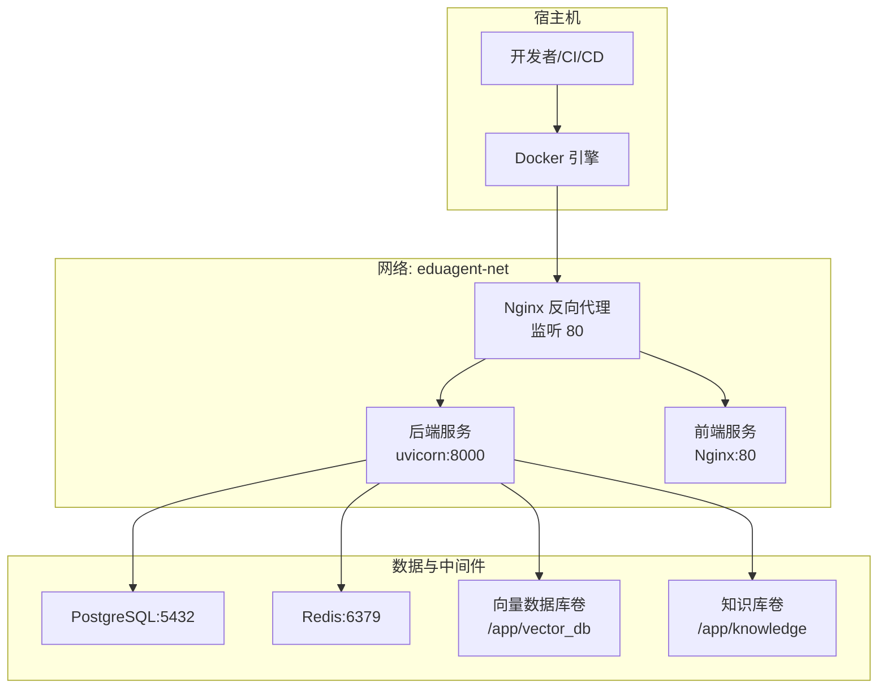
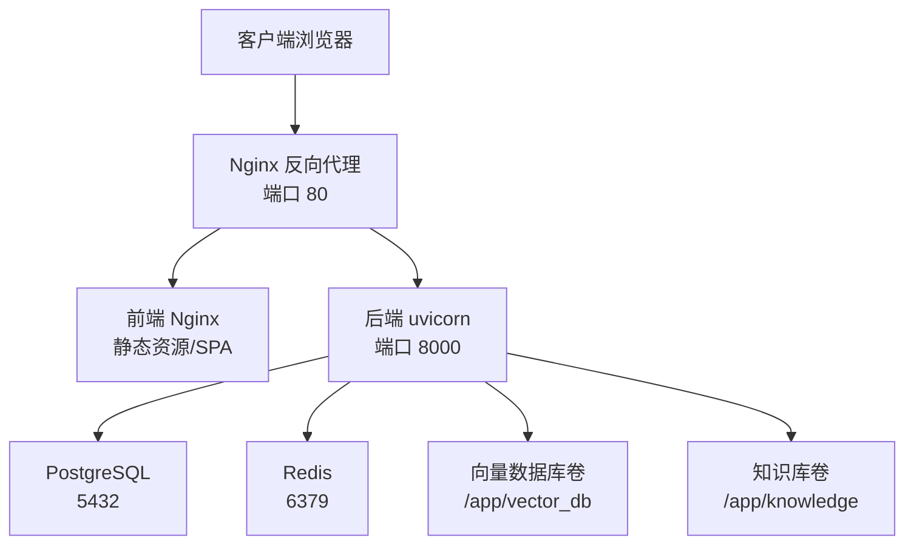
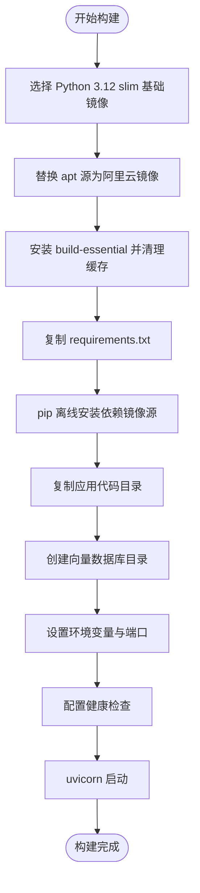
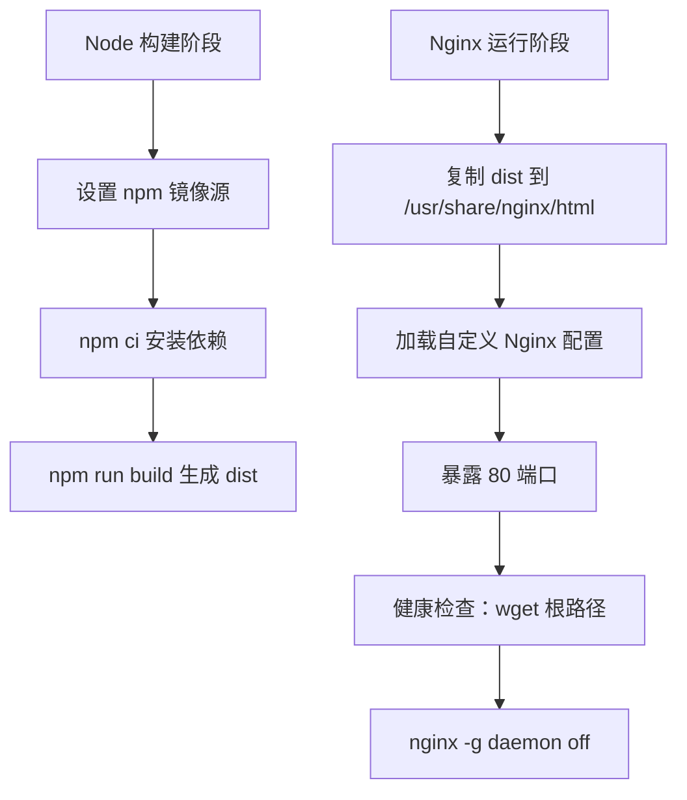
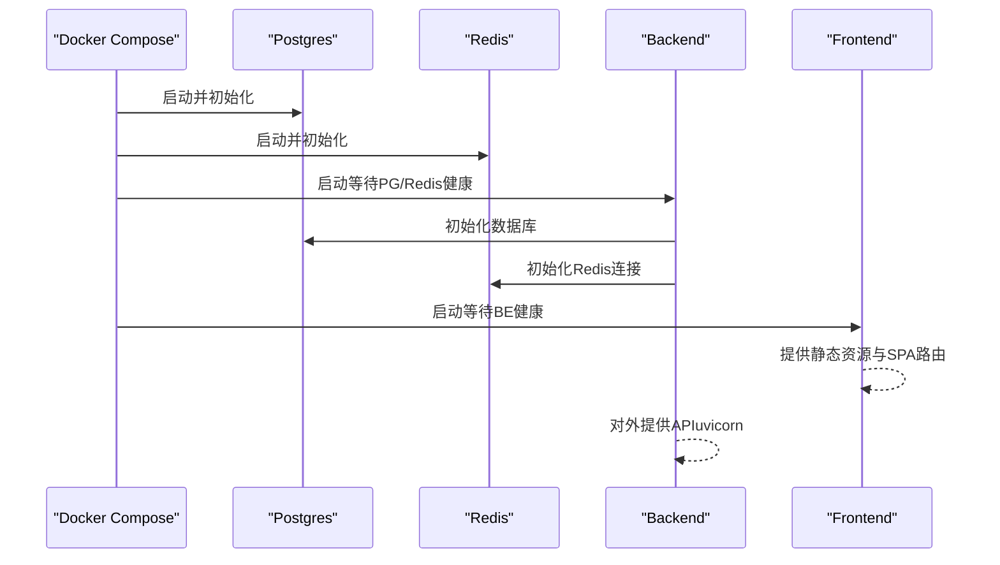
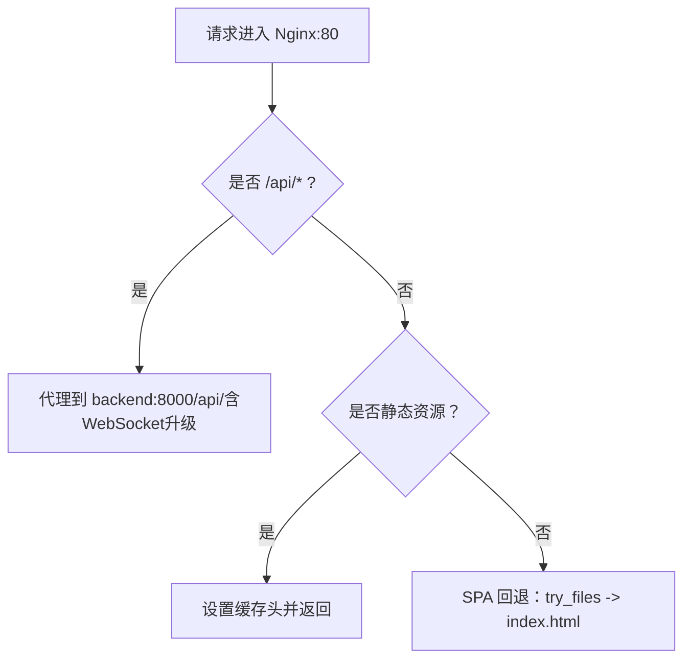
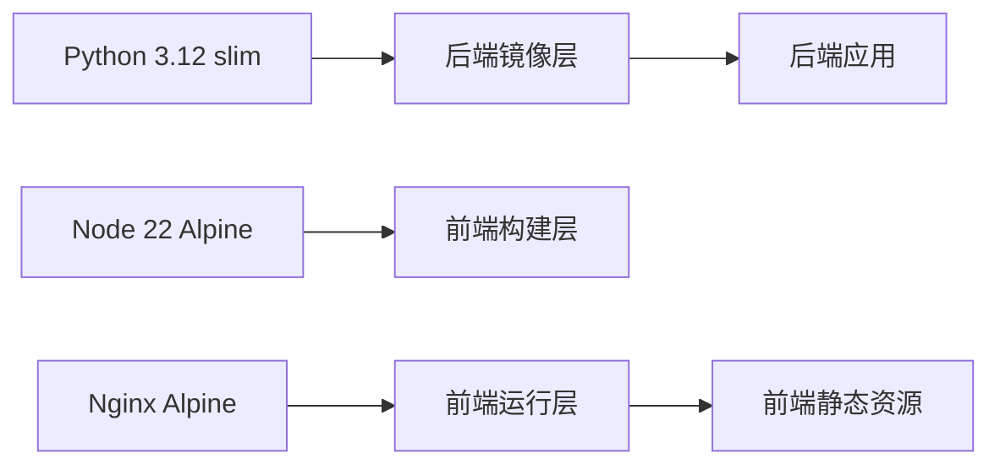

# 部署和运维

<cite>
**本文引用的文件**   
- [docker/Dockerfile.backend](file://docker/Dockerfile.backend)
- [docker/Dockerfile.frontend](file://docker/Dockerfile.frontend)
- [docker/docker-compose.yml](file://docker/docker-compose.yml)
- [docker/nginx-frontend.conf](file://docker/nginx-frontend.conf)
- [.dockerignore](file://.dockerignore)
- [backend/main.py](file://backend/main.py)
- [backend/settings.py](file://backend/settings.py)
- [api/routes/health.py](file://api/routes/health.py)
- [scripts/start.sh](file://scripts/start.sh)
- [scripts/stop.sh](file://scripts/stop.sh)
- [requirements.txt](file://requirements.txt)
- [frontend/package.json](file://frontend/package.json)
- [frontend/vite.config.ts](file://frontend/vite.config.ts)
</cite>

## 目录
1. [简介](#简介)
2. [项目结构](#项目结构)
3. [核心组件](#核心组件)
4. [架构总览](#架构总览)
5. [详细组件分析](#详细组件分析)
6. [依赖分析](#依赖分析)
7. [性能考虑](#性能考虑)
8. [故障排除指南](#故障排除指南)
9. [结论](#结论)
10. [附录](#附录)

## 简介
本文件面向EduAgent的部署与运维团队，系统性阐述基于Docker容器化与Docker Compose的编排方案，涵盖后端与前端的镜像构建策略、Nginx反向代理配置、生产环境部署流程、环境变量管理、服务发现与健康检查、监控与日志、性能调优以及运维最佳实践。读者无需深入代码即可理解整体架构与操作步骤。

## 项目结构
EduAgent采用前后端分离与数据库/缓存独立服务的容器化架构。核心部署资产位于docker目录，包含后端与前端的Dockerfile、Compose编排文件与Nginx配置；根目录提供.dockerignore与一键启动/停止脚本；后端通过FastAPI提供REST接口，并内置健康检查路由；前端通过Vite开发服务器与Nginx进行生产级静态资源服务与反向代理。

图表来源
- [docker/docker-compose.yml:1-95](file://docker/docker-compose.yml#L1-L95)
- [docker/nginx-frontend.conf:1-38](file://docker/nginx-frontend.conf#L1-L38)
- [docker/Dockerfile.backend:1-34](file://docker/Dockerfile.backend#L1-L34)
- [docker/Dockerfile.frontend:1-19](file://docker/Dockerfile.frontend#L1-L19)

章节来源
- [docker/docker-compose.yml:1-95](file://docker/docker-compose.yml#L1-L95)
- [.dockerignore:1-50](file://.dockerignore#L1-L50)

## 核心组件
- 容器镜像与构建
  - 后端镜像：基于Python 3.12 slim，启用阿里云镜像源，离线安装依赖，按目录复制应用代码，暴露8000端口，内置健康检查，使用uvicorn启动。
  - 前端镜像：基于Node 22 Alpine进行构建，使用npm镜像源，执行打包；运行时基于Alpine Nginx，复制dist至html，暴露80端口，内置健康检查。
- 编排与网络
  - Compose定义postgres、redis、backend、frontend四类服务，统一桥接网络eduagent-net；通过depends_on与健康检查实现有序启动。
- 反向代理与静态资源
  - Nginx配置gzip压缩、SPA路由回退、API代理转发至后端、WebSocket升级支持、静态资源缓存策略。
- 环境变量与持久化
  - Settings读取.env，支持数据库URL、Redis URL、CORS、讯飞集成、RAG参数等；通过卷挂载实现向量库与知识库持久化。
- 健康检查与启动脚本
  - 后端与Nginx均配置健康检查；一键启动/停止脚本封装Docker Compose命令与前置校验。

章节来源
- [docker/Dockerfile.backend:1-34](file://docker/Dockerfile.backend#L1-L34)
- [docker/Dockerfile.frontend:1-19](file://docker/Dockerfile.frontend#L1-L19)
- [docker/docker-compose.yml:1-95](file://docker/docker-compose.yml#L1-L95)
- [docker/nginx-frontend.conf:1-38](file://docker/nginx-frontend.conf#L1-L38)
- [backend/settings.py:1-67](file://backend/settings.py#L1-L67)
- [api/routes/health.py:1-52](file://api/routes/health.py#L1-L52)
- [scripts/start.sh:1-132](file://scripts/start.sh#L1-L132)
- [scripts/stop.sh:1-19](file://scripts/stop.sh#L1-L19)

## 架构总览
下图展示生产环境典型部署形态：Nginx作为入口反向代理，将API请求转发至后端服务，静态页面与单页路由交由前端Nginx处理；后端服务连接PostgreSQL与Redis，使用持久化卷承载向量数据库与知识库。

图表来源
- [docker/docker-compose.yml:1-95](file://docker/docker-compose.yml#L1-L95)
- [docker/nginx-frontend.conf:1-38](file://docker/nginx-frontend.conf#L1-L38)
- [backend/main.py:1-70](file://backend/main.py#L1-L70)

## 详细组件分析

### 后端镜像构建与优化
- 基础镜像与包管理
  - 使用Python 3.12 slim基础镜像，替换apt源为阿里云镜像，减少下载时间；一次性安装build-essential并清理缓存，降低镜像体积。
- 依赖安装
  - 通过requirements.txt离线安装，指定国内镜像源与可信主机，提升安装稳定性与速度。
- 应用代码复制
  - 仅复制agents、api、backend、database、workflows、services、rag、schemas、prompts、knowledge等必要目录，避免复制缓存与虚拟环境文件，缩短构建时间并减小镜像体积。
- 运行时准备
  - 创建向量数据库目录用于后续挂载；设置PYTHONPATH与端口8000；配置健康检查通过后端健康路由。
- 启动方式
  - 使用uvicorn直接启动后端应用，绑定0.0.0.0，便于容器间访问。

图表来源
- [docker/Dockerfile.backend:1-34](file://docker/Dockerfile.backend#L1-L34)
- [requirements.txt:1-18](file://requirements.txt#L1-L18)

章节来源
- [docker/Dockerfile.backend:1-34](file://docker/Dockerfile.backend#L1-L34)
- [requirements.txt:1-18](file://requirements.txt#L1-L18)

### 前端镜像构建与多阶段优化
- 多阶段构建
  - 第一阶段（build）：基于Node 22 Alpine，设置npm镜像源，安装依赖并执行构建，生成dist产物。
  - 第二阶段（runtime）：基于Alpine Nginx，复制dist至/usr/share/nginx/html，加载自定义Nginx配置，暴露80端口。
- 运行时健康检查
  - 通过wget探测根路径，确保Nginx正常对外提供静态资源。
- 生产优化
  - 启用gzip压缩、静态资源缓存、SPA路由回退至index.html，降低带宽与提高首屏速度。

图表来源
- [docker/Dockerfile.frontend:1-19](file://docker/Dockerfile.frontend#L1-L19)
- [docker/nginx-frontend.conf:1-38](file://docker/nginx-frontend.conf#L1-L38)

章节来源
- [docker/Dockerfile.frontend:1-19](file://docker/Dockerfile.frontend#L1-L19)
- [docker/nginx-frontend.conf:1-38](file://docker/nginx-frontend.conf#L1-L38)
- [frontend/package.json:1-28](file://frontend/package.json#L1-L28)

### Docker Compose 编排与服务发现
- 服务定义
  - postgres：PostgreSQL 16，持久化数据卷pgdata，健康检查使用pg_isready。
  - redis：Redis 7，持久化数据卷redisdata，健康检查使用redis-cli ping。
  - backend：基于Dockerfile.backend构建，注入DATABASE_URL、REDIS_URL、CORS_ORIGINS、知识库与向量库路径、自动入库开关；挂载向量库与知识库卷；依赖postgres与redis健康。
  - frontend：基于Dockerfile.frontend构建，依赖backend健康；映射宿主80端口。
- 网络与卷
  - 自定义bridge网络eduagent-net，隔离服务；定义pgdata、redisdata、vector_db、knowledge命名卷。
- 健康检查与重启策略
  - backend与frontend均配置健康检查与unless-stopped重启策略，提升可用性。

图表来源
- [docker/docker-compose.yml:1-95](file://docker/docker-compose.yml#L1-L95)
- [backend/main.py:23-42](file://backend/main.py#L23-L42)

章节来源
- [docker/docker-compose.yml:1-95](file://docker/docker-compose.yml#L1-L95)
- [backend/main.py:1-70](file://backend/main.py#L1-L70)

### Nginx 反向代理与路由策略
- 监听与根目录
  - 监听80端口，root指向Nginx html目录，index为index.html。
- 压缩与缓存
  - 开启gzip压缩，针对文本/JSON/JS/CSS/XML/字体等类型；静态资源（js/css/png/jpg/gif/ico/svg/woff/woff2）设置7天缓存与immutable标志。
- 单页应用路由
  - try_files回退至index.html，保证前端路由刷新不返回404。
- API代理
  - 将/api/前缀代理至后端uvicorn:8000，保留Host、X-Real-IP、X-Forwarded-*头；WebSocket场景设置Upgrade/Connection头并延长超时。
- 健康检查
  - 健康检查通过wget探测根路径。

图表来源
- [docker/nginx-frontend.conf:1-38](file://docker/nginx-frontend.conf#L1-L38)

章节来源
- [docker/nginx-frontend.conf:1-38](file://docker/nginx-frontend.conf#L1-L38)

### 环境变量与配置管理
- 后端配置来源
  - Settings类通过.env文件加载键值，支持数据库URL、Redis URL、CORS、讯飞集成（WS/HTTP）、RAG参数、自动入库开关等；提供spark_configured便捷判断。
- Compose中的注入
  - DATABASE_URL、REDIS_URL、CORS_ORIGINS、知识库与向量库路径、AUTO_INGEST_ON_STARTUP通过environment/env_file注入；.env通过env_file: ../.env挂载。
- 前端开发代理
  - Vite开发服务器通过proxy将/api转发至本地后端端口（示例为8001），便于联调。

章节来源
- [backend/settings.py:1-67](file://backend/settings.py#L1-L67)
- [docker/docker-compose.yml:38-46](file://docker/docker-compose.yml#L38-L46)
- [frontend/vite.config.ts:1-17](file://frontend/vite.config.ts#L1-L17)

### 健康检查与服务发现
- 后端健康检查
  - Compose与Dockerfile均配置健康检查，通过后端/api/health路由验证服务可用性。
- 数据库与缓存健康检查
  - PostgreSQL使用pg_isready；Redis使用redis-cli ping。
- 服务发现
  - 所有服务在同一bridge网络eduagent-net，容器间通过服务名访问（如postgres、redis、backend），无需暴露宿主端口。

章节来源
- [api/routes/health.py:1-52](file://api/routes/health.py#L1-L52)
- [docker/docker-compose.yml:12-16](file://docker/docker-compose.yml#L12-L16)
- [docker/docker-compose.yml:26-30](file://docker/docker-compose.yml#L26-L30)
- [docker/docker-compose.yml:57-62](file://docker/docker-compose.yml#L57-L62)

### 一键启动与停止脚本
- start.sh
  - 校验Docker与Docker Compose版本；支持--skip-build与--backend-only参数；默认启动全部服务并打印访问地址与API文档地址；最后检查后端与前端健康状态。
- stop.sh
  - 统一停止所有服务，兼容Compose v1/v2。

章节来源
- [scripts/start.sh:1-132](file://scripts/start.sh#L1-L132)
- [scripts/stop.sh:1-19](file://scripts/stop.sh#L1-L19)

## 依赖分析
- 后端依赖
  - FastAPI、Uvicorn、Pydantic-Settings、LangChain生态、ChromaDB、SQLAlchemy、PostgreSQL驱动、Redis、HTTP/WebSocket客户端、文件解析库等。
- 前端依赖
  - Vue 3、Vite、TailwindCSS、Mermaid、Marked等。
- 镜像层依赖
  - 后端镜像依赖Python 3.12 slim与build-essential；前端镜像依赖Node 22 Alpine与Nginx Alpine。

图表来源
- [docker/Dockerfile.backend:1-34](file://docker/Dockerfile.backend#L1-L34)
- [docker/Dockerfile.frontend:1-19](file://docker/Dockerfile.frontend#L1-L19)
- [requirements.txt:1-18](file://requirements.txt#L1-L18)
- [frontend/package.json:1-28](file://frontend/package.json#L1-L28)

章节来源
- [requirements.txt:1-18](file://requirements.txt#L1-L18)
- [frontend/package.json:1-28](file://frontend/package.json#L1-L28)

## 性能考虑
- 镜像体积与启动速度
  - 使用slim基础镜像、替换apt/npm源、一次性安装依赖、清理缓存、按目录复制代码，有效控制镜像大小与构建时间。
- 网络与代理
  - Nginx开启gzip与静态资源缓存，减少带宽占用；SPA回退避免重复请求；WebSocket代理保持长连接。
- 数据持久化与I/O
  - 向量数据库与知识库通过命名卷挂载，避免容器重建导致数据丢失；建议在生产环境为卷配置合适的存储后端与快照策略。
- 连接池与并发
  - 后端使用Uvicorn标准变体，建议结合反向代理与容器编排的副本数策略实现水平扩展；数据库与Redis连接应配置合理的超时与重试策略。

## 故障排除指南
- 无法访问后端API
  - 检查后端健康检查是否通过；确认uvicorn监听0.0.0.0且端口8000映射正确；查看后端日志定位异常。
- 前端空白或路由404
  - 检查Nginx配置是否正确加载；确认SPA回退规则生效；验证静态资源缓存头是否影响调试。
- 数据库/Redis不可用
  - 查看对应服务健康检查输出；确认连接字符串与网络连通性；检查卷挂载与权限。
- 环境变量未生效
  - 确认.env文件存在且被正确挂载；检查Settings类字段拼写与默认值；在Compose中核对env_file与environment配置。
- 一键脚本报错
  - 确认Docker与Docker Compose已安装并可执行；若使用--skip-build，请确保镜像已存在；--backend-only模式下仅启动后端与中间件。

章节来源
- [api/routes/health.py:1-52](file://api/routes/health.py#L1-L52)
- [docker/docker-compose.yml:1-95](file://docker/docker-compose.yml#L1-L95)
- [scripts/start.sh:1-132](file://scripts/start.sh#L1-L132)
- [scripts/stop.sh:1-19](file://scripts/stop.sh#L1-L19)

## 结论
EduAgent采用清晰的容器化与编排架构，后端与前端镜像分别通过多阶段构建与slim基础镜像实现体积与启动效率的平衡；Nginx提供高效的静态资源服务与API代理；Compose统一管理服务生命周期与健康检查。结合本文提供的部署流程、监控与日志建议、性能调优与故障排除指南，可快速在生产环境中稳定运行该系统。

## 附录

### 生产环境部署清单
- 准备工作
  - 安装Docker与Docker Compose；准备.env文件（密钥与敏感信息需严格保密）。
- 部署步骤
  - 使用一键启动脚本启动全部服务；或通过Compose命令行启动；确认各服务健康状态。
- 验证
  - 访问前端地址与后端API文档；调用/api/health与/api/health/detailed确认后端状态。
- 维护
  - 定期备份pgdata、redisdata、vector_db、knowledge卷；更新镜像并滚动重启；关注健康检查与日志告警。

章节来源
- [scripts/start.sh:1-132](file://scripts/start.sh#L1-L132)
- [docker/docker-compose.yml:1-95](file://docker/docker-compose.yml#L1-L95)
- [api/routes/health.py:1-52](file://api/routes/health.py#L1-L52)