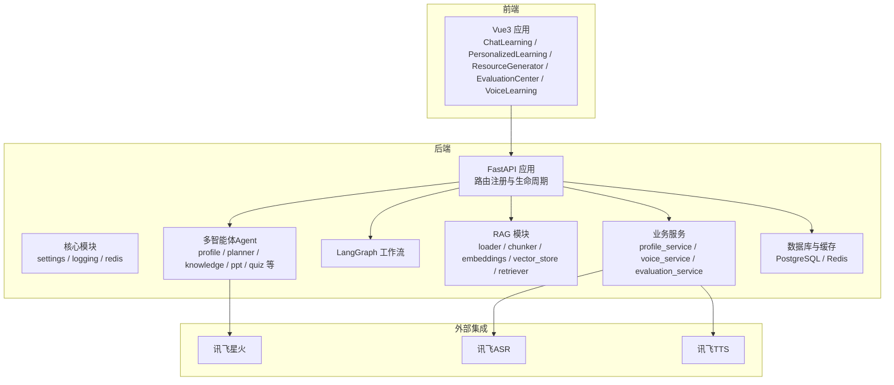
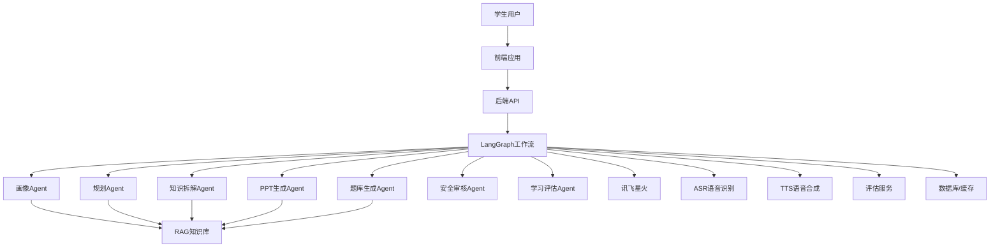
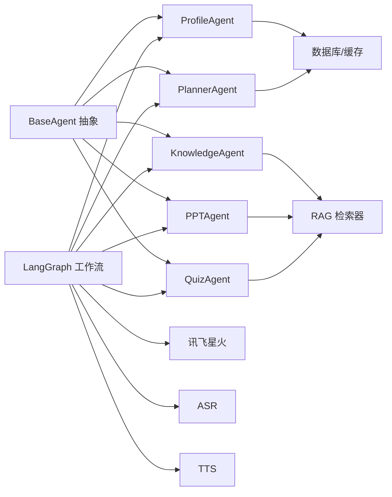

# 实现阶段说明

<cite>
**本文引用的文件**
- [README.md](file://README.md)
- [docs/phases/README.md](file://docs/phases/README.md)
- [software_cup_ai_education_system_architecture.md](file://software_cup_ai_education_system_architecture.md)
- [backend/main.py](file://backend/main.py)
- [backend/settings.py](file://backend/settings.py)
- [agents/__init__.py](file://agents/__init__.py)
- [agents/base.py](file://agents/base.py)
- [agents/profile_agent.py](file://agents/profile_agent.py)
- [agents/planner_agent.py](file://agents/planner_agent.py)
- [agents/knowledge_agent.py](file://agents/knowledge_agent.py)
- [agents/ppt_agent.py](file://agents/ppt_agent.py)
- [agents/quiz_agent.py](file://agents/quiz_agent.py)
- [rag/__init__.py](file://rag/__init__.py)
- [workflows/__init__.py](file://workflows/__init__.py)
</cite>

## 目录
1. [引言](#引言)
2. [项目结构](#项目结构)
3. [核心组件](#核心组件)
4. [架构总览](#架构总览)
5. [详细组件分析](#详细组件分析)
6. [依赖分析](#依赖分析)
7. [性能考虑](#性能考虑)
8. [故障排查指南](#故障排查指南)
9. [结论](#结论)
10. [附录](#附录)

## 引言
本文件面向EduAgent平台的实现阶段说明，依据项目进度表系统梳理从基础环境到Docker部署的十个阶段，逐阶段阐述目标、实现内容、技术难点与解决方案，并以架构图与流程图呈现关键实现路径，帮助开发者理解功能迭代过程与技术决策。

## 项目结构
EduAgent采用前后端分离架构，后端基于FastAPI，前端基于Vue3，核心模块包括多智能体Agent、LangGraph工作流、RAG知识库、讯飞语音集成、学习评估闭环与Docker部署。项目遵循“阶段推进”的工程化路线，便于快速验证与迭代。

**图表来源**
- [backend/main.py:46-70](file://backend/main.py#L46-L70)
- [backend/settings.py:6-67](file://backend/settings.py#L6-L67)
- [agents/__init__.py:16-29](file://agents/__init__.py#L16-L29)
- [rag/__init__.py:3-6](file://rag/__init__.py#L3-L6)
- [workflows/__init__.py:3-5](file://workflows/__init__.py#L3-L5)

**章节来源**
- [README.md:33-50](file://README.md#L33-L50)
- [software_cup_ai_education_system_architecture.md:7-31](file://software_cup_ai_education_system_architecture.md#L7-L31)

## 核心组件
- 多智能体Agent：统一抽象基类，各Agent按职责分工，支持星火生成与规则兜底双通道。
- LangGraph工作流：串联画像、规划、知识拆解、资源生成、安全审核与学习评估，形成闭环。
- RAG知识库：文档解析、切片、嵌入与向量检索，支撑智能问答与知识拆解。
- 讯飞语音：ASR识别与TTS合成，封装为语音服务供前端调用。
- 评估闭环：学习行为采集、指标计算与报告生成，驱动画像动态更新。
- 前端UI：五大模块（对话学习、个性化学习、资源生成、学习评估、语音学习）。
- Docker部署：Compose编排、Nginx反向代理与一键启动脚本。

**章节来源**
- [agents/base.py:7-13](file://agents/base.py#L7-L13)
- [agents/__init__.py:16-29](file://agents/__init__.py#L16-L29)
- [workflows/__init__.py:3-5](file://workflows/__init__.py#L3-L5)
- [rag/__init__.py:3-6](file://rag/__init__.py#L3-L6)

## 架构总览
下图展示EduAgent的整体架构与数据流：前端通过API与后端交互，后端通过多智能体与RAG协作，结合讯飞能力与评估闭环，最终输出个性化学习资源与语音播报。

**图表来源**
- [software_cup_ai_education_system_architecture.md:70-127](file://software_cup_ai_education_system_architecture.md#L70-L127)
- [backend/main.py:15-70](file://backend/main.py#L15-L70)

## 详细组件分析

### 阶段一：基础环境
- 目标：统一配置、日志、Redis、依赖注入、健康检查与星火HTTP客户端。
- 实现内容：
  - 配置加载与CORS设置：[backend/settings.py:6-67](file://backend/settings.py#L6-L67)
  - 生命周期初始化：数据库连接、Redis连接、可选自动RAG入库：[backend/main.py:23-41](file://backend/main.py#L23-L41)
  - 路由注册与健康检查：[backend/main.py:61-70](file://backend/main.py#L61-L70)
- 技术难点与解决：
  - 配置分散与密钥安全：通过.env与Pydantic Settings集中管理，避免硬编码。
  - 启动时依赖可用性：在lifespan中初始化DB与Redis，失败时记录告警但不阻断服务。
- 验收：访问健康检查端点，确认数据库、Redis、星火状态。

**章节来源**
- [docs/phases/README.md:3-14](file://docs/phases/README.md#L3-L14)
- [backend/settings.py:6-67](file://backend/settings.py#L6-L67)
- [backend/main.py:23-41](file://backend/main.py#L23-L41)
- [backend/main.py:61-70](file://backend/main.py#L61-L70)

### 阶段二：RAG知识库
- 目标：文档解析、切片、嵌入、ChromaDB向量库与检索API。
- 实现内容：
  - 模块导出：检索器与入库入口：[rag/__init__.py:3-6](file://rag/__init__.py#L3-L6)
  - 配置项：知识目录、向量库持久化、嵌入模型、切片策略、检索TopK：[backend/settings.py:41-49](file://backend/settings.py#L41-L49)
- 技术难点与解决：
  - 多格式解析与一致性：统一文本切片策略，保证检索质量。
  - 向量入库与检索：批量入库脚本与检索API解耦，便于独立测试。
- 验收：执行入库脚本并通过检索端点验证。

**章节来源**
- [docs/phases/README.md:18-34](file://docs/phases/README.md#L18-L34)
- [rag/__init__.py:3-6](file://rag/__init__.py#L3-L6)
- [backend/settings.py:41-49](file://backend/settings.py#L41-L49)

### 阶段三：学生画像Agent
- 目标：Prompt工程、星火/规则引擎、数据库与Redis缓存。
- 实现内容：
  - Agent实现：接收用户输入，调用ProfileService，返回结构化画像与摘要消息：[agents/profile_agent.py:17-39](file://agents/profile_agent.py#L17-L39)
  - 服务与缓存：ProfileService结合PostgreSQL/SQLite与Redis缓存，支持画像构建与查询。
- 技术难点与解决：
  - 多来源画像融合：优先星火生成，失败时启用规则兜底，保证可用性。
  - 状态与会话：通过session_id串联多轮对话与画像更新。
- 验收：未配置星火时仍能返回规则兜底画像；配置后source字段为spark。

**章节来源**
- [docs/phases/README.md:37-55](file://docs/phases/README.md#L37-L55)
- [agents/profile_agent.py:17-39](file://agents/profile_agent.py#L17-L39)

### 阶段四：学习规划Agent
- 目标：基于画像生成个性化学习路径，支持星火+规则兜底。
- 实现内容：
  - 规划Prompt加载与星火调用：[agents/planner_agent.py:18-23](file://agents/planner_agent.py#L18-L23)、[agents/planner_agent.py:192-209](file://agents/planner_agent.py#L192-L209)
  - 规则兜底：heuristic_path根据知识水平、目标、薄弱点与学习时长生成路径：[agents/planner_agent.py:25-150](file://agents/planner_agent.py#L25-L150)
  - Agent运行：读取画像，生成路径并返回摘要与Markdown：[agents/planner_agent.py:161-181](file://agents/planner_agent.py#L161-L181)
- 技术难点与解决：
  - 路径动态性：根据学习时长与目标动态调整周期与重点区域。
  - 星火失败降级：捕获异常后回退至规则引擎，保障连续性。
- 验收：未配置星火时返回heuristic路径；配置后source为spark。

**章节来源**
- [docs/phases/README.md:58-99](file://docs/phases/README.md#L58-L99)
- [agents/planner_agent.py:18-23](file://agents/planner_agent.py#L18-L23)
- [agents/planner_agent.py:25-150](file://agents/planner_agent.py#L25-L150)
- [agents/planner_agent.py:161-181](file://agents/planner_agent.py#L161-L181)
- [agents/planner_agent.py:192-209](file://agents/planner_agent.py#L192-L209)

### 阶段五：资源生成Agent
- 目标：PPT/题库/代码/思维导图/视频脚本生成，统一星火+规则兜底。
- 实现内容：
  - PPT生成：Prompt加载与星火生成，规则兜底heuristic_ppt：[agents/ppt_agent.py:18-23](file://agents/ppt_agent.py#L18-L23)、[agents/ppt_agent.py:25-47](file://agents/ppt_agent.py#L25-L47)、[agents/ppt_agent.py:138-165](file://agents/ppt_agent.py#L138-L165)
  - 题库生成：heuristic_quiz按主题与难度生成多题型题目集：[agents/quiz_agent.py:25-46](file://agents/quiz_agent.py#L25-L46)、[agents/quiz_agent.py:222-250](file://agents/quiz_agent.py#L222-L250)
  - Agent运行：提取主题，调用生成逻辑，返回摘要与Markdown：[agents/ppt_agent.py:115-128](file://agents/ppt_agent.py#L115-L128)、[agents/quiz_agent.py:201-214](file://agents/quiz_agent.py#L201-L214)
- 技术难点与解决：
  - 多模态资源结构化：统一输出模型（PPTDeck、QuizSet等）便于前端渲染与持久化。
  - 星火失败降级：异常捕获后回退规则引擎，保证功能可用。
- 验收：规则引擎可直接生成资源样例；配置星火后source为spark。

**章节来源**
- [docs/phases/README.md:102-194](file://docs/phases/README.md#L102-L194)
- [agents/ppt_agent.py:18-23](file://agents/ppt_agent.py#L18-L23)
- [agents/ppt_agent.py:25-47](file://agents/ppt_agent.py#L25-L47)
- [agents/ppt_agent.py:138-165](file://agents/ppt_agent.py#L138-L165)
- [agents/quiz_agent.py:25-46](file://agents/quiz_agent.py#L25-L46)
- [agents/quiz_agent.py:222-250](file://agents/quiz_agent.py#L222-L250)
- [agents/ppt_agent.py:115-128](file://agents/ppt_agent.py#L115-L128)
- [agents/quiz_agent.py:201-214](file://agents/quiz_agent.py#L201-L214)

### 阶段六：LangGraph工作流
- 目标：多智能体协同编排、知识拆解、答疑辅导、安全审核、学习评估与闭环回流。
- 实现内容：
  - 工作流编排与状态：[workflows/__init__.py:3-5](file://workflows/__init__.py#L3-L5)
  - 知识拆解Agent：结合RAG与星火生成知识树，规则兜底：[agents/knowledge_agent.py:79-92](file://agents/knowledge_agent.py#L79-L92)、[agents/knowledge_agent.py:109-118](file://agents/knowledge_agent.py#L109-L118)
  - 资源并行生成：PPT/题库/代码/思维导图/视频脚本并行触发。
  - 安全审核与评估：安全审核Agent与EvaluationAgent贯穿工作流。
- 技术难点与解决：
  - 并行与串行混合：通过LangGraph实现多Agent并行与结果聚合。
  - 回流机制：评估不达标时自动回流画像Agent，最多两次，动态调整路径。
- 验收：通过聊天接口触发完整工作流，观察Agent间协作与回流。

**章节来源**
- [docs/phases/README.md:197-270](file://docs/phases/README.md#L197-L270)
- [agents/knowledge_agent.py:79-92](file://agents/knowledge_agent.py#L79-L92)
- [agents/knowledge_agent.py:109-118](file://agents/knowledge_agent.py#L109-L118)
- [workflows/__init__.py:3-5](file://workflows/__init__.py#L3-L5)

### 阶段七：讯飞语音接入
- 目标：ASR语音识别、TTS语音合成、语音服务封装与API路由。
- 实现内容：
  - 配置项：ASR/TTS AppId、ApiKey、ApiSecret与WS地址：[backend/settings.py:29-39](file://backend/settings.py#L29-L39)
  - 语音服务：封装speech_to_text与text_to_speech方法，支持多种音色：[docs/phases/README.md:305-315](file://docs/phases/README.md#L305-L315)
  - API端点：/api/voice/asr、/api/voice/tts、/api/voice/status：[docs/phases/README.md:299-302](file://docs/phases/README.md#L299-L302)
- 技术难点与解决：
  - 音色选择与兼容性：提供多种音色选项，满足不同场景。
  - 异常与降级：未配置时提供状态查询，避免阻断主流程。
- 验收：状态查询正常；ASR/TTS端点可返回结果。

**章节来源**
- [docs/phases/README.md:273-339](file://docs/phases/README.md#L273-L339)
- [backend/settings.py:29-39](file://backend/settings.py#L29-L39)

### 阶段八：学习评估闭环
- 目标：学习行为采集、评估指标计算、报告生成与画像动态更新。
- 实现内容：
  - 评估维度：练习正确率、知识掌握度、资源利用率、学习投入度：[docs/phases/README.md:351-356](file://docs/phases/README.md#L351-L356)
  - 综合评分公式：[docs/phases/README.md:357-360](file://docs/phases/README.md#L357-L360)
  - 行为数据结构与报告结构：[docs/phases/README.md:368-402](file://docs/phases/README.md#L368-L402)
  - API端点：/api/evaluation/report、/api/evaluation/behavior、/api/evaluation/metrics、/api/evaluation/profile-update：[docs/phases/README.md:362-366](file://docs/phases/README.md#L362-L366)
- 技术难点与解决：
  - 多维度融合：通过加权公式综合评估，兼顾学习效果与投入度。
  - 动态画像：评估报告作为输入更新学生画像，驱动后续路径优化。
- 验收：提交学习行为数据，生成评估报告并验证维度与建议。

**章节来源**
- [docs/phases/README.md:342-429](file://docs/phases/README.md#L342-L429)

### 阶段九：前端UI优化
- 目标：五大核心模块（对话学习、个性化学习、资源生成、学习评估、语音学习）。
- 实现内容：
  - 模块划分：ChatLearning、PersonalizedLearning、ResourceGenerator、EvaluationCenter、VoiceLearning：[docs/phases/README.md:437-441](file://docs/phases/README.md#L437-L441)
  - 技术栈：Vue3 + TypeScript + TailwindCSS + Composition API + 异步API调用：[docs/phases/README.md:452-456](file://docs/phases/README.md#L452-L456)
- 技术难点与解决：
  - 组件化与状态管理：模块化设计，异步调用后端API，提升用户体验。
  - 可视化与交互：Mermaid渲染思维导图，增强学习体验。
- 验收：前端启动后可见导航与各模块功能，可调用后端API。

**章节来源**
- [docs/phases/README.md:433-470](file://docs/phases/README.md#L433-L470)

### 阶段十：Docker部署
- 目标：Docker Compose编排、Nginx反向代理、一键启动与停止脚本。
- 实现内容：
  - 服务架构：Nginx前端静态资源、FastAPI后端API、Postgres与Redis：[docs/phases/README.md:484-502](file://docs/phases/README.md#L484-L502)
  - Compose与Dockerfile：后端/前端镜像与Nginx配置：[docs/phases/README.md:477-482](file://docs/phases/README.md#L477-L482)
  - 一键启动脚本：Windows与Linux/macOS脚本，支持跳过构建与仅后端模式：[docs/phases/README.md:504-531](file://docs/phases/README.md#L504-L531)
- 技术难点与解决：
  - 端口与服务映射：Nginx暴露8080，后端8000，API文档可达。
  - 健康检查与依赖等待：脚本自动检查Docker环境与服务健康状态。
- 验收：访问前端与后端API文档，停止脚本可正常关闭服务。

**章节来源**
- [docs/phases/README.md:473-555](file://docs/phases/README.md#L473-L555)

## 依赖分析
- 组件耦合与内聚：
  - Agent层：统一BaseAgent抽象，降低耦合；各Agent职责清晰，内聚于特定任务。
  - 工作流层：LangGraph编排多Agent协作，状态共享与结果聚合。
  - RAG层：loader/chunker/embeddings/vector_store/retriever解耦，便于替换与扩展。
  - 配置层：Settings集中管理，避免散落配置。
- 外部依赖与集成：
  - 讯飞星火：作为大模型与语音服务的统一出口。
  - Redis：缓存画像与会话状态，提升响应速度。
  - Postgres：持久化画像、资源与评估报告。
- 潜在循环依赖：
  - Agent与Spark客户端通过工厂方法延迟绑定，避免循环导入。
  - RAG与Agent通过检索器接口解耦，无直接循环依赖。

**图表来源**
- [agents/base.py:7-13](file://agents/base.py#L7-L13)
- [agents/profile_agent.py:17-39](file://agents/profile_agent.py#L17-L39)
- [agents/planner_agent.py:153-181](file://agents/planner_agent.py#L153-L181)
- [agents/knowledge_agent.py:70-92](file://agents/knowledge_agent.py#L70-L92)
- [agents/ppt_agent.py:107-128](file://agents/ppt_agent.py#L107-L128)
- [agents/quiz_agent.py:193-214](file://agents/quiz_agent.py#L193-L214)
- [workflows/__init__.py:3-5](file://workflows/__init__.py#L3-L5)

**章节来源**
- [agents/base.py:7-13](file://agents/base.py#L7-L13)
- [agents/__init__.py:16-29](file://agents/__init__.py#L16-L29)

## 性能考虑
- 启动性能：lifespan中仅初始化DB与Redis，避免阻塞请求；可选自动RAG入库在后台执行。
- 缓存策略：Redis缓存画像与会话状态，减少重复计算与数据库压力。
- 检索效率：RAG TopK与向量库索引优化，缩短响应时间。
- 并行生成：资源生成Agent并行执行，缩短整体工作流时延。
- 语音处理：ASR/TTS异步处理，避免阻塞主线程。

## 故障排查指南
- 健康检查失败：
  - 检查数据库连接字符串与Redis地址：[backend/settings.py:12-14](file://backend/settings.py#L12-L14)
  - 查看后端日志定位具体依赖问题。
- 星火调用异常：
  - 确认AppId/ApiKey/ApiSecret配置与域名设置：[backend/settings.py:17-27](file://backend/settings.py#L17-L27)
  - 若异常，系统自动回退至规则兜底，检查日志获取详细错误。
- RAG入库失败：
  - 检查知识目录与嵌入模型路径：[backend/settings.py:42-49](file://backend/settings.py#L42-L49)
  - 确认网络可访问HuggingFace模型仓库。
- 语音服务异常：
  - 核对ASR/TTS配置项：[backend/settings.py:29-39](file://backend/settings.py#L29-L39)
  - 使用状态端点确认服务可用性。

**章节来源**
- [backend/settings.py:12-14](file://backend/settings.py#L12-L14)
- [backend/settings.py:17-27](file://backend/settings.py#L17-L27)
- [backend/settings.py:42-49](file://backend/settings.py#L42-L49)
- [backend/settings.py:29-39](file://backend/settings.py#L29-L39)

## 结论
EduAgent按阶段完成了从基础环境到Docker部署的完整落地，实现了多智能体协同、RAG知识库、语音能力与评估闭环的工程化集成。通过规则引擎兜底与星火大模型双通道，系统在不可用环境下仍保持稳定运行；通过LangGraph工作流与评估回流机制，形成持续优化的学习闭环。前端模块化设计与Docker一键部署进一步提升了可维护性与交付效率。

## 附录
- 快速开始与API参考见项目根README与阶段文档。
- 架构设计与Agent工作流详见架构文档。