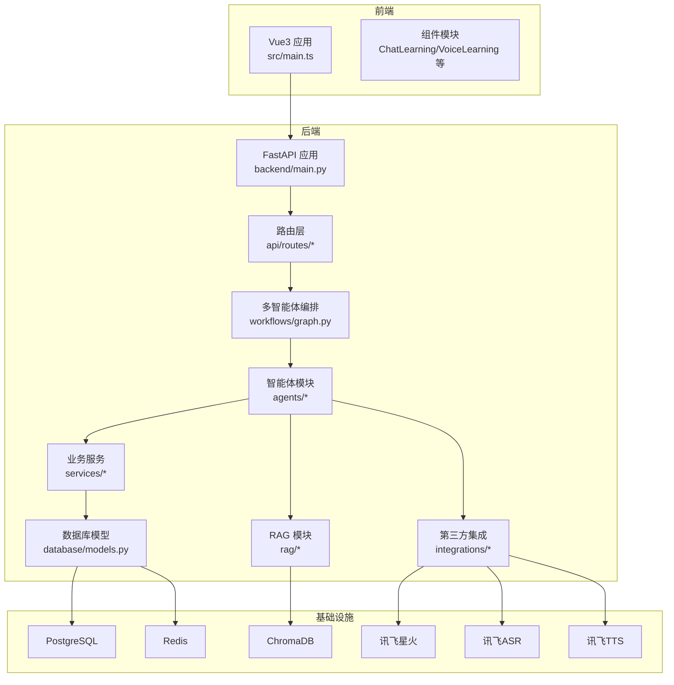
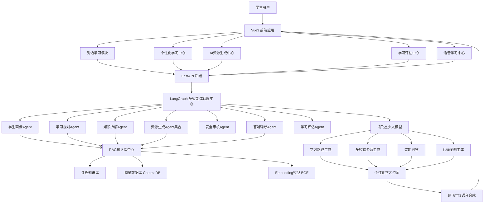
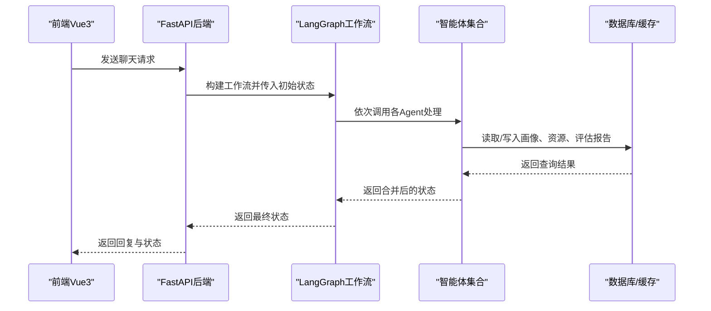
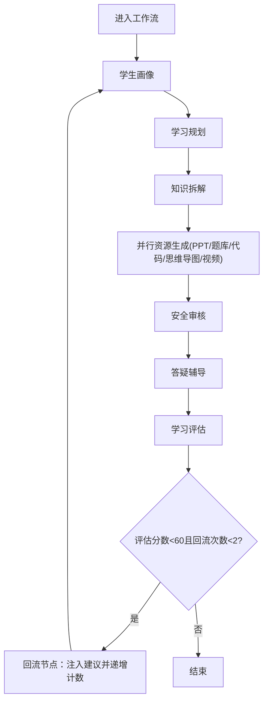
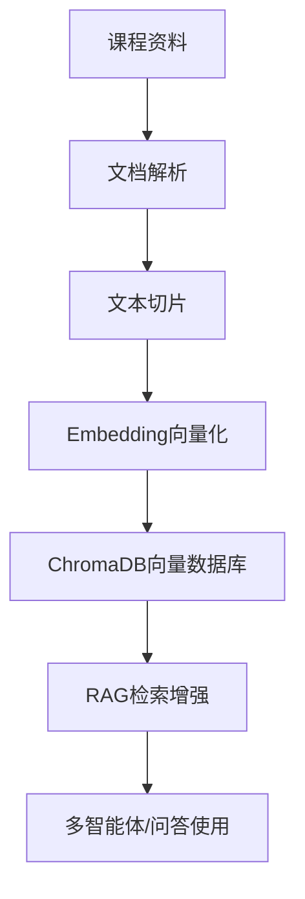
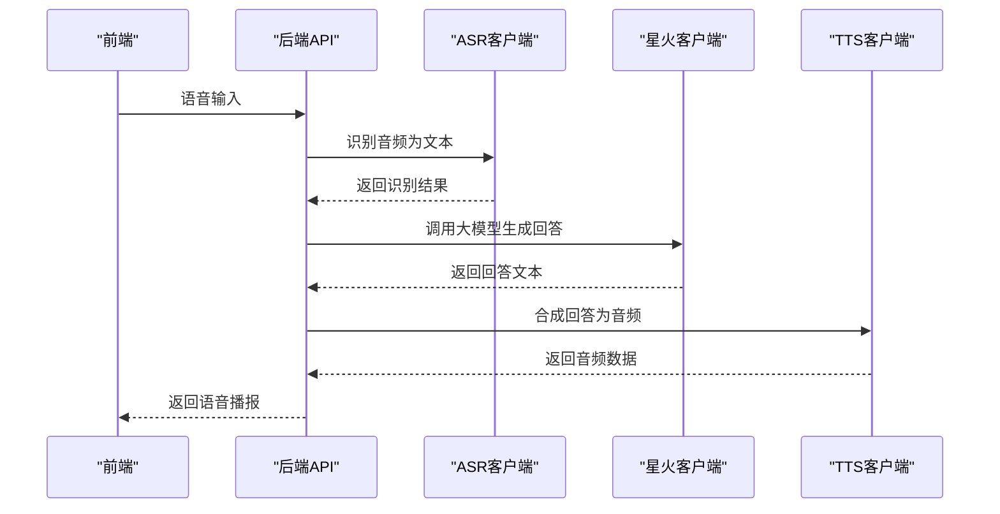
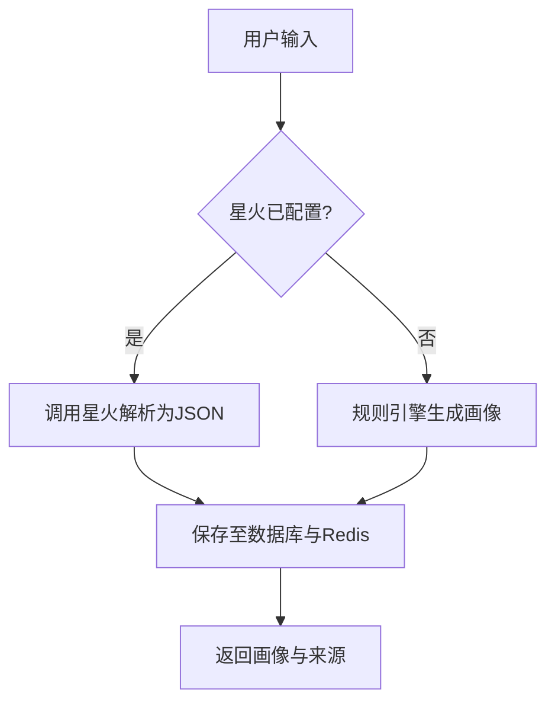
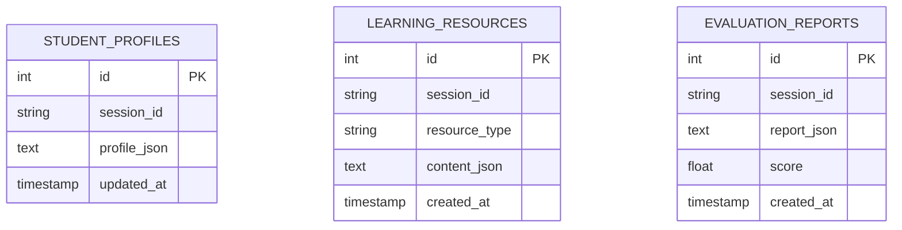
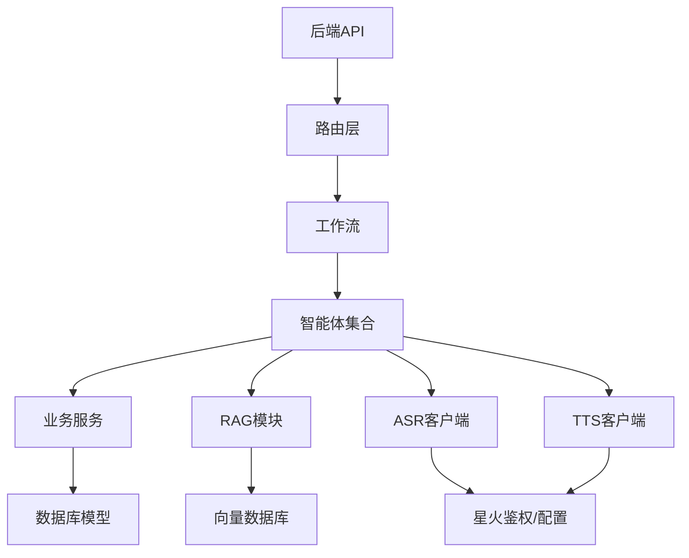

# 技术架构总览

<cite>
**本文档引用的文件**
- [README.md](file://README.md)
- [software_cup_ai_education_system_architecture.md](file://software_cup_ai_education_system_architecture.md)
- [backend/main.py](file://backend/main.py)
- [backend/settings.py](file://backend/settings.py)
- [backend/integrations/spark/client.py](file://backend/integrations/spark/client.py)
- [backend/integrations/asr/client.py](file://backend/integrations/asr/client.py)
- [backend/integrations/tts/client.py](file://backend/integrations/tts/client.py)
- [api/routes/chat.py](file://api/routes/chat.py)
- [workflows/graph.py](file://workflows/graph.py)
- [agents/base.py](file://agents/base.py)
- [rag/__init__.py](file://rag/__init__.py)
- [rag/retriever.py](file://rag/retriever.py)
- [services/profile_service.py](file://services/profile_service.py)
- [database/models.py](file://database/models.py)
- [frontend/package.json](file://frontend/package.json)
- [frontend/src/main.ts](file://frontend/src/main.ts)
- [docker/docker-compose.yml](file://docker/docker-compose.yml)
</cite>

## 目录
1. [引言](#引言)
2. [项目结构](#项目结构)
3. [核心组件](#核心组件)
4. [架构总览](#架构总览)
5. [详细组件分析](#详细组件分析)
6. [依赖关系分析](#依赖关系分析)
7. [性能考虑](#性能考虑)
8. [故障排除指南](#故障排除指南)
9. [结论](#结论)

## 引言
本文件为EduAgent平台的技术架构总览文档，面向开发者与架构师，系统阐述平台的整体架构设计、前后端分离架构、多智能体系统架构、RAG知识库架构以及语音服务架构。文档重点解释各层之间的交互关系与数据流向，并说明技术栈的选择原因与优势，帮助读者快速建立对系统实现方案的清晰认知。

## 项目结构
EduAgent采用前后端分离的工程化组织方式，后端以FastAPI为核心，提供REST API；前端基于Vue3 + TypeScript + TailwindCSS构建；多智能体编排由LangGraph实现；RAG知识库集成ChromaDB与嵌入模型；语音能力接入讯飞ASR/TTS；数据库采用PostgreSQL，缓存采用Redis；Docker Compose支持一键部署。

**图表来源**
- [backend/main.py:46-70](file://backend/main.py#L46-L70)
- [docker/docker-compose.yml:34-84](file://docker/docker-compose.yml#L34-L84)

**章节来源**
- [README.md:23-40](file://README.md#L23-L40)
- [frontend/package.json:11-26](file://frontend/package.json#L11-L26)
- [docker/docker-compose.yml:1-95](file://docker/docker-compose.yml#L1-L95)

## 核心组件
- 前端应用：基于Vue3 + TypeScript + TailwindCSS，提供对话学习、个性化学习中心、资源生成、学习评估、语音学习五大模块。
- 后端服务：FastAPI提供统一API入口，内置CORS、日志、数据库初始化与RAG自动入库等生命周期管理。
- 多智能体系统：基于LangGraph的状态图编排，包含学生画像、学习规划、知识拆解、资源生成、安全审核、答疑辅导、学习评估等Agent。
- RAG知识库：文档解析、切片、嵌入、向量存储与检索，支撑智能问答与资源生成。
- 语音服务：ASR语音识别、TTS语音合成，结合星火大模型实现语音驱动的学习体验。
- 数据与缓存：PostgreSQL持久化学生画像、学习资源与评估报告；Redis缓存画像与临时状态。
- 部署：Docker Compose编排PostgreSQL、Redis、后端与前端服务，支持一键启动。

**章节来源**
- [frontend/package.json:11-26](file://frontend/package.json#L11-L26)
- [backend/main.py:23-41](file://backend/main.py#L23-L41)
- [workflows/graph.py:186-211](file://workflows/graph.py#L186-L211)
- [rag/__init__.py:1-7](file://rag/__init__.py#L1-L7)
- [backend/integrations/asr/client.py:18-95](file://backend/integrations/asr/client.py#L18-L95)
- [backend/integrations/tts/client.py:19-97](file://backend/integrations/tts/client.py#L19-L97)
- [database/models.py:13-40](file://database/models.py#L13-L40)
- [docker/docker-compose.yml:34-84](file://docker/docker-compose.yml#L34-L84)

## 架构总览
EduAgent采用“前端Vue3 + 后端FastAPI + 多智能体编排 + RAG知识库 + 语音服务”的整体架构。前端通过REST API与后端交互，后端通过LangGraph协调多个Agent完成从画像分析到资源生成再到评估闭环的全流程；RAG模块为Agent提供知识检索能力；讯飞语音服务贯穿ASR与TTS，实现语音输入与播报。

**图表来源**
- [software_cup_ai_education_system_architecture.md:70-127](file://software_cup_ai_education_system_architecture.md#L70-L127)
- [workflows/graph.py:26-36](file://workflows/graph.py#L26-L36)
- [rag/__init__.py:1-7](file://rag/__init__.py#L1-L7)
- [backend/integrations/spark/client.py:19-35](file://backend/integrations/spark/client.py#L19-L35)

## 详细组件分析

### 前后端分离架构
- 前端：Vue3 + TypeScript + TailwindCSS，入口文件负责应用初始化与挂载。
- 后端：FastAPI应用在生命周期内完成日志初始化、数据库初始化、Redis连接与RAG自动入库；注册健康检查、聊天、RAG、画像、语音、评估、资源、进度与工作流等路由。
- 跨域：通过CORS中间件允许指定来源访问。
- 部署：Docker Compose编排数据库、缓存、后端与前端服务，分别暴露端口并定义健康检查。

**图表来源**
- [api/routes/chat.py:23-36](file://api/routes/chat.py#L23-L36)
- [workflows/graph.py:186-211](file://workflows/graph.py#L186-L211)
- [backend/main.py:61-69](file://backend/main.py#L61-L69)

**章节来源**
- [frontend/src/main.ts:1-6](file://frontend/src/main.ts#L1-L6)
- [backend/main.py:46-70](file://backend/main.py#L46-L70)
- [docker/docker-compose.yml:34-84](file://docker/docker-compose.yml#L34-L84)

### 多智能体系统架构
- Agent抽象：所有Agent继承统一基类，接收共享状态并返回需要合并回状态的片段。
- 工作流编排：通过LangGraph构建状态图，节点包括画像、规划、知识拆解、并行资源生成、安全、答疑、评估与回流节点；条件边根据评估结果决定是否回流至画像节点。
- 资源持久化：在资源生成节点完成后异步保存学习资源与评估报告至数据库。
- 回流机制：当评估分数低于阈值且回流次数未达上限时，将评估建议注入状态并回到画像节点重新生成。

**图表来源**
- [workflows/graph.py:186-211](file://workflows/graph.py#L186-L211)
- [workflows/graph.py:136-153](file://workflows/graph.py#L136-L153)
- [workflows/graph.py:156-183](file://workflows/graph.py#L156-L183)

**章节来源**
- [agents/base.py:7-13](file://agents/base.py#L7-L13)
- [workflows/graph.py:26-36](file://workflows/graph.py#L26-L36)
- [workflows/graph.py:51-98](file://workflows/graph.py#L51-L98)
- [workflows/graph.py:109-133](file://workflows/graph.py#L109-L133)

### RAG知识库架构
- 模块职责：提供知识入库与检索能力，封装向量化与ChromaDB查询。
- 检索器：基于设置中的向量库持久化目录，执行查询并返回匹配片段列表。
- 集成方式：多智能体在需要时调用检索器获取上下文，增强生成质量。

**图表来源**
- [software_cup_ai_education_system_architecture.md:194-222](file://software_cup_ai_education_system_architecture.md#L194-L222)
- [rag/__init__.py:1-7](file://rag/__init__.py#L1-L7)
- [rag/retriever.py:12-24](file://rag/retriever.py#L12-L24)

**章节来源**
- [rag/__init__.py:1-7](file://rag/__init__.py#L1-L7)
- [rag/retriever.py:12-24](file://rag/retriever.py#L12-L24)

### 语音服务架构
- ASR语音识别：通过WebSocket连接讯飞ASR服务，支持多种音频格式，返回识别文本。
- TTS语音合成：通过WebSocket连接讯飞TTS服务，将文本合成为音频数据。
- 星火集成：SparkClient支持WebSocket与HTTP两种模式，自动解析模型输出中的JSON结构。

**图表来源**
- [backend/integrations/asr/client.py:36-76](file://backend/integrations/asr/client.py#L36-L76)
- [backend/integrations/tts/client.py:37-85](file://backend/integrations/tts/client.py#L37-L85)
- [backend/integrations/spark/client.py:141-161](file://backend/integrations/spark/client.py#L141-L161)

**章节来源**
- [backend/integrations/asr/client.py:18-95](file://backend/integrations/asr/client.py#L18-L95)
- [backend/integrations/tts/client.py:19-97](file://backend/integrations/tts/client.py#L19-L97)
- [backend/integrations/spark/client.py:19-35](file://backend/integrations/spark/client.py#L19-L35)

### 学生画像服务
- 规则兜底：当星火未配置时，使用启发式规则快速生成画像，保证本地开发可用性。
- 星火分析：加载Prompt模板，构造系统与用户消息，调用星火解析为结构化JSON并转为模型对象。
- 缓存策略：使用Redis缓存画像，同时持久化至数据库，支持按会话ID查询与更新。

**图表来源**
- [services/profile_service.py:124-150](file://services/profile_service.py#L124-L150)
- [services/profile_service.py:152-166](file://services/profile_service.py#L152-L166)
- [services/profile_service.py:32-87](file://services/profile_service.py#L32-L87)

**章节来源**
- [services/profile_service.py:90-166](file://services/profile_service.py#L90-L166)

### 数据模型与持久化
- 学生画像记录：包含会话ID、画像JSON与更新时间。
- 学习资源：包含会话ID、资源类型与内容JSON。
- 评估报告：包含会话ID、报告JSON与分数。

**图表来源**
- [database/models.py:13-40](file://database/models.py#L13-L40)

**章节来源**
- [database/models.py:13-40](file://database/models.py#L13-L40)

## 依赖关系分析
- 组件耦合：后端通过路由层与工作流解耦具体Agent实现；Agent之间通过共享状态传递数据；RAG与语音服务作为可插拔模块被Agent调用。
- 外部依赖：讯飞星火、ASR、TTS服务；ChromaDB向量数据库；PostgreSQL与Redis。
- 部署依赖：Docker Compose编排数据库、缓存、后端与前端服务，定义网络与卷。

**图表来源**
- [backend/main.py:61-69](file://backend/main.py#L61-L69)
- [workflows/graph.py:26-36](file://workflows/graph.py#L26-L36)
- [backend/integrations/spark/client.py:22-27](file://backend/integrations/spark/client.py#L22-L27)
- [rag/retriever.py:18-23](file://rag/retriever.py#L18-L23)

**章节来源**
- [backend/main.py:15-18](file://backend/main.py#L15-L18)
- [docker/docker-compose.yml:34-84](file://docker/docker-compose.yml#L34-L84)

## 性能考虑
- 并行资源生成：工作流中资源生成节点采用并发执行，提升吞吐量。
- 缓存策略：画像与临时状态使用Redis缓存，减少重复计算与数据库压力。
- 自动入库：后端启动时可自动执行RAG知识入库，避免运行期延迟。
- 语音传输：ASR/TTS使用WebSocket长连接，降低握手开销并支持流式传输。
- 数据库连接：通过会话管理数据库连接，避免连接泄漏。

**章节来源**
- [workflows/graph.py:75-81](file://workflows/graph.py#L75-L81)
- [services/profile_service.py:106-122](file://services/profile_service.py#L106-L122)
- [backend/main.py:32-40](file://backend/main.py#L32-L40)
- [backend/integrations/asr/client.py:44-76](file://backend/integrations/asr/client.py#L44-L76)
- [backend/integrations/tts/client.py:45-85](file://backend/integrations/tts/client.py#L45-L85)

## 故障排除指南
- 星火未配置：当未提供APPID/APIKey/Secret时，相关功能将抛出异常；系统会回退至规则引擎或返回错误提示。
- ASR/TTS连接失败：WebSocket连接异常或鉴权失败会导致运行时错误，需检查密钥配置与网络连通性。
- RAG检索失败：向量库不可用或查询异常时返回空结果，需确认ChromaDB状态与嵌入模型加载。
- 评估回流：当评估分数低于阈值且回流次数未达上限，系统会自动回流至画像节点，可在日志中查看回流次数与建议注入情况。

**章节来源**
- [backend/integrations/spark/client.py:148-161](file://backend/integrations/spark/client.py#L148-L161)
- [backend/integrations/asr/client.py:38-40](file://backend/integrations/asr/client.py#L38-L40)
- [backend/integrations/tts/client.py:39-41](file://backend/integrations/tts/client.py#L39-L41)
- [rag/retriever.py:20-23](file://rag/retriever.py#L20-L23)
- [workflows/graph.py:146-153](file://workflows/graph.py#L146-L153)

## 结论
EduAgent平台通过前后端分离、多智能体编排、RAG知识库与语音服务的有机结合，构建了从画像分析到资源生成再到评估闭环的完整学习体系。该架构在保证可扩展性的同时，兼顾了开发效率与部署便利性，适合在高校场景下提供个性化、智能化的AI学习体验。