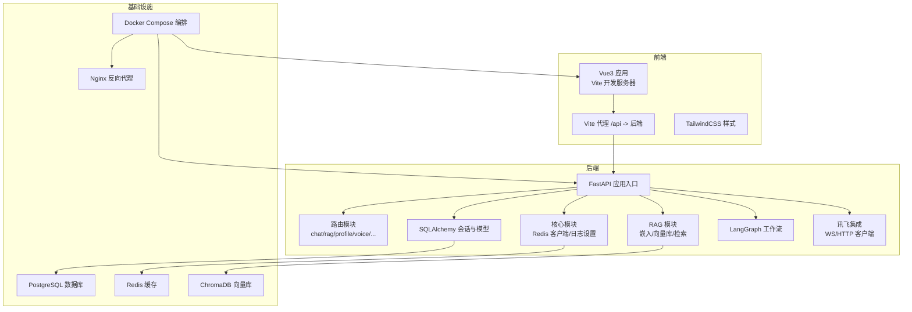
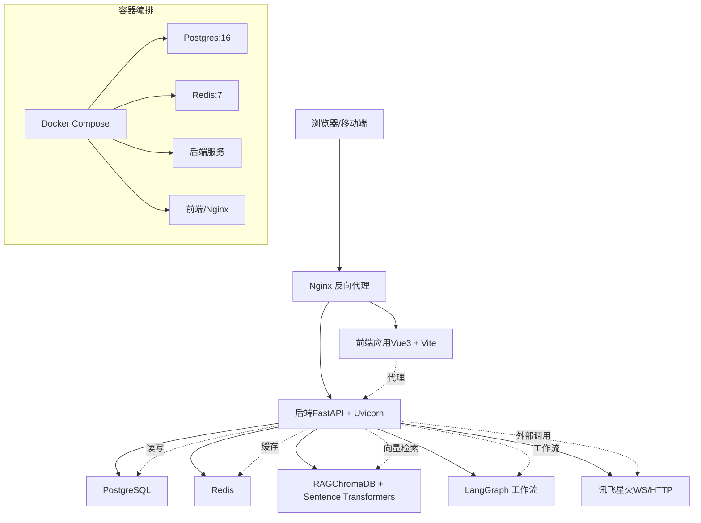
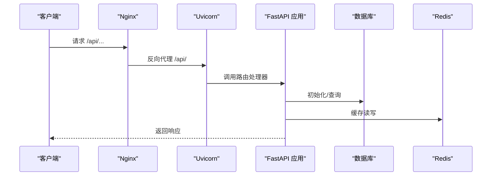
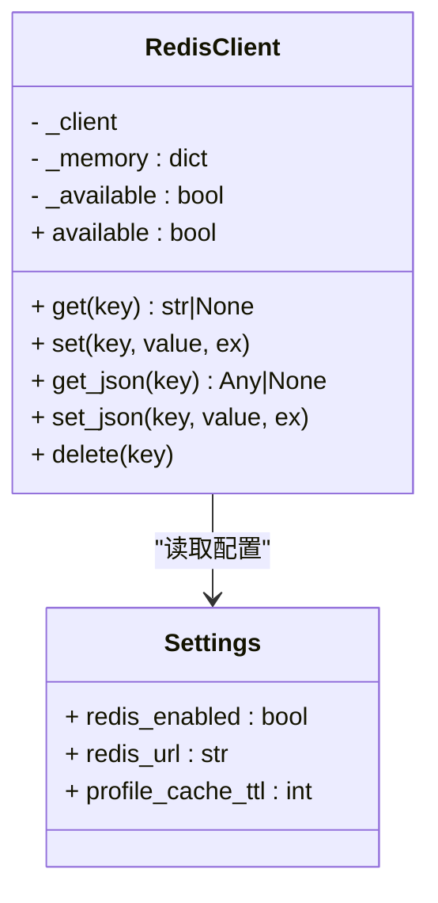
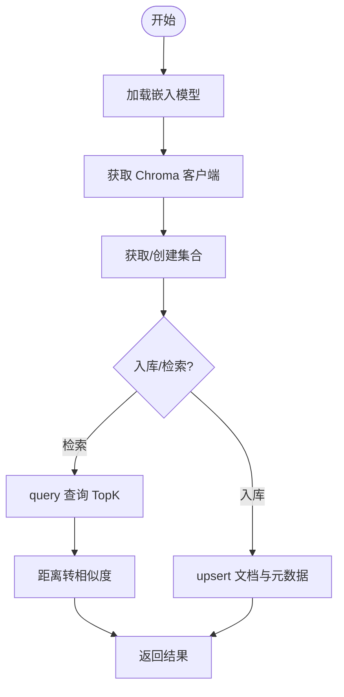
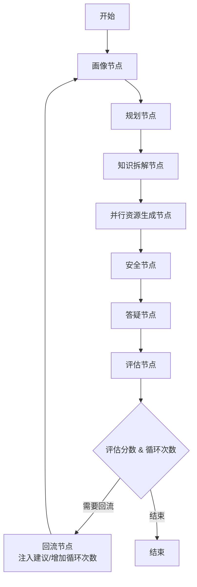
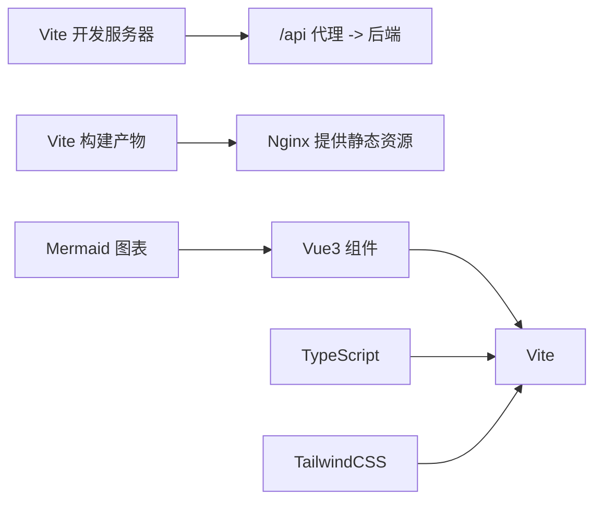
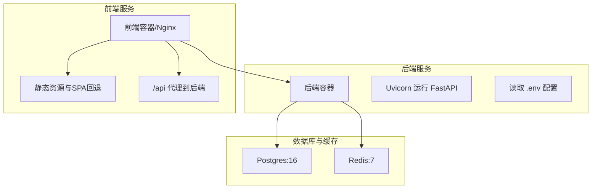
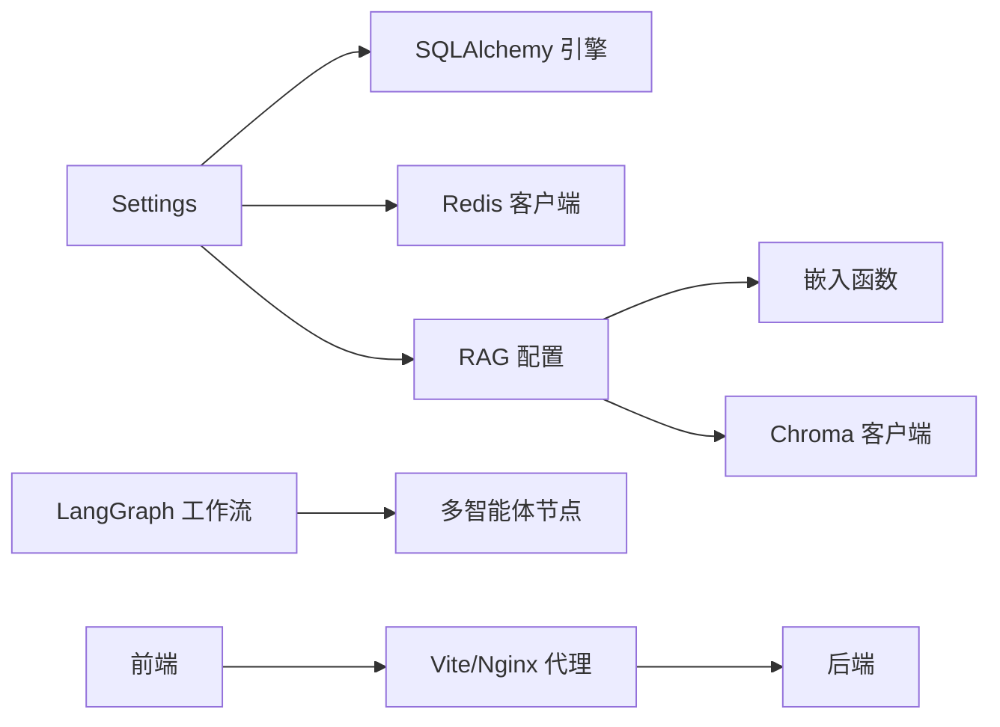

# 技术栈说明

<cite>
**本文引用的文件**
- [README.md](file://README.md)
- [requirements.txt](file://requirements.txt)
- [backend/main.py](file://backend/main.py)
- [backend/settings.py](file://backend/settings.py)
- [backend/core/redis_client.py](file://backend/core/redis_client.py)
- [database/session.py](file://database/session.py)
- [rag/embeddings.py](file://rag/embeddings.py)
- [rag/vector_store.py](file://rag/vector_store.py)
- [workflows/graph.py](file://workflows/graph.py)
- [frontend/package.json](file://frontend/package.json)
- [frontend/vite.config.ts](file://frontend/vite.config.ts)
- [frontend/src/main.ts](file://frontend/src/main.ts)
- [docker/docker-compose.yml](file://docker/docker-compose.yml)
- [docker/Dockerfile.backend](file://docker/Dockerfile.backend)
- [docker/Dockerfile.frontend](file://docker/Dockerfile.frontend)
- [docker/nginx-frontend.conf](file://docker/nginx-frontend.conf)
</cite>

## 目录
1. [引言](#引言)
2. [项目结构](#项目结构)
3. [核心组件](#核心组件)
4. [架构总览](#架构总览)
5. [详细组件分析](#详细组件分析)
6. [依赖关系分析](#依赖关系分析)
7. [性能考量](#性能考量)
8. [故障排查指南](#故障排查指南)
9. [结论](#结论)
10. [附录](#附录)

## 引言
本技术栈说明面向EduAgent平台的开发者与运维人员，系统性梳理后端（FastAPI、Python、SQLAlchemy、Redis、PostgreSQL）、前端（Vue3、TypeScript、Vite、TailwindCSS）、AI/ML（LangGraph、LangChain、ChromaDB、Sentence Transformers、讯飞星火API）、以及开发与基础设施（Docker、Docker Compose、Nginx）的选型依据、版本要求与配置要点。文档以实际代码为依据，辅以架构与流程图，帮助读者快速理解并高效落地。

## 项目结构
EduAgent采用前后端分离与容器化编排的工程组织方式，核心模块包括：
- 后端：FastAPI应用入口、路由、核心中间件与配置、数据库会话与模型、RAG向量化与检索、多智能体工作流、讯飞语音与ASR/TTS集成。
- 前端：Vue3 + TypeScript + Vite + TailwindCSS，通过代理访问后端API。
- AI/ML：LangGraph工作流编排、LangChain生态、ChromaDB向量库、Sentence Transformers嵌入、RAG知识入库与检索。
- 基础设施：Docker镜像构建、Docker Compose编排、Nginx反向代理与静态资源服务。

**图表来源**
- [backend/main.py:46-70](file://backend/main.py#L46-L70)
- [docker/docker-compose.yml:1-95](file://docker/docker-compose.yml#L1-L95)
- [docker/nginx-frontend.conf:17-30](file://docker/nginx-frontend.conf#L17-L30)

**章节来源**
- [README.md:33-50](file://README.md#L33-L50)
- [backend/main.py:12-70](file://backend/main.py#L12-L70)
- [docker/docker-compose.yml:1-95](file://docker/docker-compose.yml#L1-L95)

## 核心组件
本节从技术栈维度概述各组件的职责、版本与配置要点，并给出选择理由。

- 后端技术栈
  - Python：3.12（后端镜像基础）。
  - FastAPI：异步高性能Web框架，内置OpenAPI/Swagger，支持依赖注入与生命周期管理。
  - SQLAlchemy：ORM与会话管理，支持SQLite/PostgreSQL。
  - Redis：键值缓存与JSON序列化，不可用时降级为内存字典。
  - PostgreSQL：生产数据库，Docker Compose提供健康检查与持久化卷。
  - 讯飞星火：WebSocket/HTTP双模式客户端，支持对话与语音能力。
  - LangGraph/LangChain：工作流编排与链式处理，支撑多智能体协作。
  - ChromaDB + Sentence Transformers：本地向量检索，支持持久化与Cosine相似度。
  - Uvicorn：ASGI服务器，用于开发与容器内运行。

- 前端技术栈
  - Vue3：响应式组件与组合式API，适合渐进式学习场景。
  - TypeScript：类型安全与更好的IDE体验。
  - Vite：快速开发与构建工具，内置热更新与代理。
  - TailwindCSS：原子化样式框架，便于快速搭建界面。
  - Mermaid：思维导图渲染，提升可视化表达。

- AI/ML技术栈
  - LangGraph：有向无环图/有环图工作流，支持条件分支与回流机制。
  - LangChain：提示词模板、文本分割器与链式调用。
  - ChromaDB：轻量级向量数据库，支持持久化目录。
  - Sentence Transformers：中文嵌入模型（BGE系列），用于语义向量化。
  - 讯飞星火API：WebSocket/HTTP两种接入方式，支持多模型域。

- 开发工具与基础设施
  - Docker：后端/前端镜像构建与运行。
  - Docker Compose：服务编排（Postgres、Redis、后端、前端/Nginx）。
  - Nginx：静态资源服务、SPA路由回退、API代理与WebSocket升级。

**章节来源**
- [requirements.txt:1-18](file://requirements.txt#L1-L18)
- [backend/settings.py:6-66](file://backend/settings.py#L6-L66)
- [backend/core/redis_client.py:12-73](file://backend/core/redis_client.py#L12-L73)
- [database/session.py:14-22](file://database/session.py#L14-L22)
- [rag/embeddings.py:11-21](file://rag/embeddings.py#L11-L21)
- [rag/vector_store.py:16-65](file://rag/vector_store.py#L16-L65)
- [workflows/graph.py:186-220](file://workflows/graph.py#L186-L220)
- [frontend/package.json:11-26](file://frontend/package.json#L11-L26)
- [frontend/vite.config.ts:6-16](file://frontend/vite.config.ts#L6-L16)
- [docker/Dockerfile.backend:1-34](file://docker/Dockerfile.backend#L1-L34)
- [docker/Dockerfile.frontend:1-19](file://docker/Dockerfile.frontend#L1-L19)
- [docker/docker-compose.yml:1-95](file://docker/docker-compose.yml#L1-L95)
- [docker/nginx-frontend.conf:1-38](file://docker/nginx-frontend.conf#L1-L38)

## 架构总览
下图展示EduAgent的整体架构：前端通过Nginx代理访问后端API；后端负责路由、业务逻辑、数据库与缓存；RAG模块提供知识检索；工作流编排多智能体；外部集成讯飞API；容器化统一部署。

**图表来源**
- [docker/docker-compose.yml:1-95](file://docker/docker-compose.yml#L1-L95)
- [docker/nginx-frontend.conf:1-38](file://docker/nginx-frontend.conf#L1-L38)
- [backend/main.py:46-70](file://backend/main.py#L46-L70)
- [rag/vector_store.py:16-31](file://rag/vector_store.py#L16-L31)
- [workflows/graph.py:186-211](file://workflows/graph.py#L186-L211)

## 详细组件分析

### 后端：FastAPI 应用与生命周期
- 应用入口与中间件：注册CORS、包含健康检查、聊天、RAG、画像、语音、评估、资源、进度、工作流等路由。
- 生命周期：启动时初始化数据库、建立Redis连接；可选自动RAG知识入库。
- 版本与依赖：基于requirements.txt中的版本范围，确保兼容性。

**图表来源**
- [backend/main.py:23-41](file://backend/main.py#L23-L41)
- [backend/main.py:46-70](file://backend/main.py#L46-L70)
- [docker/nginx-frontend.conf:17-30](file://docker/nginx-frontend.conf#L17-L30)

**章节来源**
- [backend/main.py:12-70](file://backend/main.py#L12-L70)
- [requirements.txt:1-18](file://requirements.txt#L1-L18)

### 配置与环境变量：Settings
- 服务与日志：应用环境、日志级别、CORS来源列表。
- 数据库与缓存：数据库URL、Redis连接参数与开关。
- 讯飞星火：API类型、APPID/APIKey/Secret、WebSocket/HTTP地址、模型域、超时等。
- RAG：知识目录、向量库持久化目录、集合名、嵌入模型、切片参数、TopK、启动时自动入库。
- 缓存TTL：画像缓存过期时间。
- 辅助属性：CORS来源列表解析、星火配置完整性检测。

**章节来源**
- [backend/settings.py:6-66](file://backend/settings.py#L6-L66)

### 缓存：Redis 客户端封装
- 功能：统一get/set/get_json/set_json/delete；不可用时降级为内存字典。
- 行为：连接成功标记可用；异常时记录警告并回退内存缓存。
- TTL：支持过期参数；画像缓存TTL由Settings提供。

**图表来源**
- [backend/core/redis_client.py:12-73](file://backend/core/redis_client.py#L12-L73)
- [backend/settings.py:13-14](file://backend/settings.py#L13-L14)

**章节来源**
- [backend/core/redis_client.py:12-73](file://backend/core/redis_client.py#L12-L73)
- [backend/settings.py:13-14](file://backend/settings.py#L13-L14)

### 数据库：SQLAlchemy 会话与初始化
- 引擎创建：根据Settings.database_url选择SQLite或PostgreSQL连接参数。
- 会话工厂：非自动提交/刷新，绑定engine。
- 初始化：创建Base.metadata所有表。

**章节来源**
- [database/session.py:14-22](file://database/session.py#L14-L22)
- [backend/settings.py:12](file://backend/settings.py#L12)

### RAG：嵌入与向量检索
- 嵌入函数：懒加载SentenceTransformer嵌入（BGE系列），按Settings.embedding_model指定。
- 向量库：ChromaDB持久化客户端，集合不存在则创建，设置余弦相似度空间。
- 入库：upsert批量写入，ID格式包含file_id与chunk_index。
- 检索：query返回top_k条结果，转换距离为相似度分数。
- 统计：返回集合名称与数量。

**图表来源**
- [rag/embeddings.py:11-21](file://rag/embeddings.py#L11-L21)
- [rag/vector_store.py:16-65](file://rag/vector_store.py#L16-L65)

**章节来源**
- [rag/embeddings.py:11-21](file://rag/embeddings.py#L11-L21)
- [rag/vector_store.py:16-65](file://rag/vector_store.py#L16-L65)
- [backend/settings.py:42-49](file://backend/settings.py#L42-L49)

### 工作流：LangGraph 多智能体编排
- 节点：画像、规划、知识拆解、并行资源生成（PPT/题库/代码/思维导图/视频）、安全、答疑、评估。
- 回流：评估分数低于阈值且循环次数小于上限时，注入建议并回到画像节点重新生成。
- 资源持久化：并行生成完成后统一落库。
- 评估持久化：评估报告与分数落库。

**图表来源**
- [workflows/graph.py:186-211](file://workflows/graph.py#L186-L211)
- [workflows/graph.py:136-153](file://workflows/graph.py#L136-L153)
- [workflows/graph.py:51-71](file://workflows/graph.py#L51-L71)
- [workflows/graph.py:109-123](file://workflows/graph.py#L109-L123)

**章节来源**
- [workflows/graph.py:26-36](file://workflows/graph.py#L26-L36)
- [workflows/graph.py:73-98](file://workflows/graph.py#L73-L98)
- [workflows/graph.py:125-133](file://workflows/graph.py#L125-L133)
- [workflows/graph.py:136-153](file://workflows/graph.py#L136-L153)

### 前端：Vue3 + Vite + TailwindCSS
- 依赖：Vue3、TypeScript、Vite、TailwindCSS、Mermaid、highlight.js、marked。
- 开发：Vite代理将/api转发至后端；热更新提升开发效率。
- 构建：生产环境由Nginx提供静态资源服务。

**图表来源**
- [frontend/vite.config.ts:6-16](file://frontend/vite.config.ts#L6-L16)
- [frontend/package.json:11-26](file://frontend/package.json#L11-L26)
- [docker/Dockerfile.frontend:1-19](file://docker/Dockerfile.frontend#L1-L19)

**章节来源**
- [frontend/package.json:11-26](file://frontend/package.json#L11-L26)
- [frontend/vite.config.ts:6-16](file://frontend/vite.config.ts#L6-L16)
- [frontend/src/main.ts:1-6](file://frontend/src/main.ts#L1-L6)

### 讯飞集成：WebSocket/HTTP 客户端
- 配置：APPID、APIKey、APISecret、WebSocket/HTTP地址、模型域、超时。
- 降级：未配置时，部分Agent使用规则引擎兜底，保证功能可用。
- 安全：密钥仅写入本地.env，避免提交到仓库。

**章节来源**
- [backend/settings.py:17-27](file://backend/settings.py#L17-L27)
- [backend/settings.py:58-61](file://backend/settings.py#L58-L61)
- [README.md:134-149](file://README.md#L134-L149)

### 容器化与部署：Docker + Docker Compose + Nginx
- 后端镜像：基于python:3.12-slim，安装build-essential，使用阿里云镜像源加速pip安装，暴露8000端口。
- 前端镜像：Node 22 Alpine构建，Nginx提供静态资源服务，启用gzip与SPA路由回退。
- 编排：Postgres（16-alpine）、Redis（7-alpine）、后端、前端/Nginx，定义健康检查与持久化卷。
- Nginx：代理/api到后端，支持WebSocket升级，静态资源缓存。

**图表来源**
- [docker/Dockerfile.backend:1-34](file://docker/Dockerfile.backend#L1-L34)
- [docker/Dockerfile.frontend:1-19](file://docker/Dockerfile.frontend#L1-L19)
- [docker/docker-compose.yml:1-95](file://docker/docker-compose.yml#L1-L95)
- [docker/nginx-frontend.conf:1-38](file://docker/nginx-frontend.conf#L1-L38)

**章节来源**
- [docker/Dockerfile.backend:1-34](file://docker/Dockerfile.backend#L1-L34)
- [docker/Dockerfile.frontend:1-19](file://docker/Dockerfile.frontend#L1-L19)
- [docker/docker-compose.yml:1-95](file://docker/docker-compose.yml#L1-L95)
- [docker/nginx-frontend.conf:1-38](file://docker/nginx-frontend.conf#L1-L38)

## 依赖关系分析
- 后端对数据库与缓存的耦合：通过Settings集中配置，SessionLocal与RedisClient提供统一接口。
- RAG模块对嵌入与向量库的依赖：嵌入函数懒加载，向量库持久化目录可配置。
- 工作流对多Agent的依赖：节点间通过状态流转与条件边连接，资源与评估节点分别进行持久化。
- 前端对后端API的依赖：通过Vite代理与Nginx代理实现跨域与长连接支持。
- 容器编排对服务健康与持久化的依赖：Postgres/Redis健康检查、卷挂载保证数据持久。

**图表来源**
- [backend/settings.py:6-66](file://backend/settings.py#L6-L66)
- [database/session.py:14-22](file://database/session.py#L14-L22)
- [backend/core/redis_client.py:19-30](file://backend/core/redis_client.py#L19-L30)
- [rag/embeddings.py:11-21](file://rag/embeddings.py#L11-L21)
- [rag/vector_store.py:16-31](file://rag/vector_store.py#L16-L31)
- [workflows/graph.py:186-211](file://workflows/graph.py#L186-L211)

**章节来源**
- [backend/settings.py:6-66](file://backend/settings.py#L6-L66)
- [database/session.py:14-22](file://database/session.py#L14-L22)
- [backend/core/redis_client.py:19-30](file://backend/core/redis_client.py#L19-L30)
- [rag/embeddings.py:11-21](file://rag/embeddings.py#L11-L21)
- [rag/vector_store.py:16-31](file://rag/vector_store.py#L16-L31)
- [workflows/graph.py:186-211](file://workflows/graph.py#L186-L211)

## 性能考量
- 嵌入模型懒加载：首次请求加载Sentence Transformers模型，后续复用，减少冷启动开销。
- 向量库TopK限制：默认TopK可配置，避免过多相似度计算。
- 并行资源生成：多Agent并行执行，缩短整体时延。
- 缓存降级：Redis不可用时自动切换内存缓存，保障主流程可用。
- Nginx压缩与缓存：开启gzip与静态资源缓存，降低带宽与延迟。
- 数据库连接参数：SQLite跨线程检查按需配置，PostgreSQL无需额外参数。

**章节来源**
- [rag/embeddings.py:11-21](file://rag/embeddings.py#L11-L21)
- [rag/vector_store.py:45-59](file://rag/vector_store.py#L45-L59)
- [workflows/graph.py:75-81](file://workflows/graph.py#L75-L81)
- [backend/core/redis_client.py:20-30](file://backend/core/redis_client.py#L20-L30)
- [docker/nginx-frontend.conf:7-36](file://docker/nginx-frontend.conf#L7-L36)
- [database/session.py:16](file://database/session.py#L16)

## 故障排查指南
- 启动失败（健康检查）
  - 后端：确认Uvicorn监听8000端口，健康检查路径为/api/health。
  - 前端/Nginx：确认Nginx监听80端口，SPA回退与/api代理配置正确。
  - 数据库/缓存：确认Postgres/Redis健康检查通过，卷挂载正常。
- Redis不可用
  - 检查Settings.redis_enabled与redis_url；查看日志降级为内存缓存的警告。
- RAG检索为空
  - 检查知识目录与向量库持久化目录；确认已执行知识入库脚本；验证集合名称与嵌入模型。
- 讯飞API未配置
  - 查看Settings中星火相关字段是否为空；未配置时部分Agent使用规则引擎兜底。
- CORS问题
  - 检查Settings.cors_origins与前端代理配置；确认后端CORS中间件已启用。

**章节来源**
- [docker/docker-compose.yml:57-62](file://docker/docker-compose.yml#L57-L62)
- [docker/docker-compose.yml:76-82](file://docker/docker-compose.yml#L76-L82)
- [backend/main.py:53-59](file://backend/main.py#L53-L59)
- [backend/core/redis_client.py:20-30](file://backend/core/redis_client.py#L20-L30)
- [backend/settings.py:17-27](file://backend/settings.py#L17-L27)
- [docker/nginx-frontend.conf:17-30](file://docker/nginx-frontend.conf#L17-L30)

## 结论
EduAgent以FastAPI为核心，结合LangGraph工作流与RAG技术，构建了可扩展的多智能体教育平台。前后端分离与容器化部署提升了开发与运维效率；Redis与PostgreSQL提供可靠的缓存与持久化；讯飞API与规则引擎共同保障功能可用性。该技术栈在性能、可维护性与可扩展性之间取得平衡，适合高校个性化学习场景的持续演进。

## 附录
- 快速开始与主要API参见项目自述文件与路由定义。
- Docker一键启动脚本位于scripts目录，支持Windows与类Unix环境。

**章节来源**
- [README.md:63-127](file://README.md#L63-L127)
- [backend/main.py:61-69](file://backend/main.py#L61-L69)