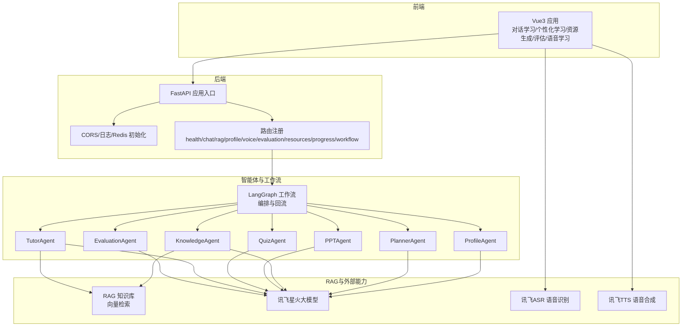
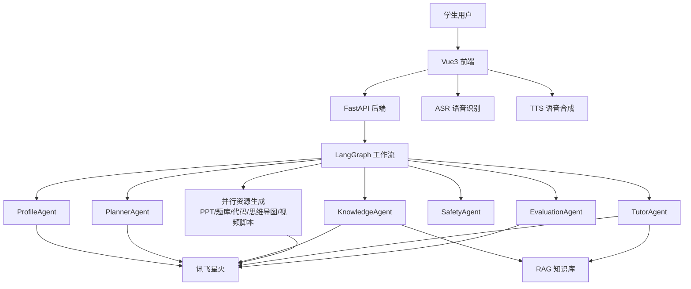
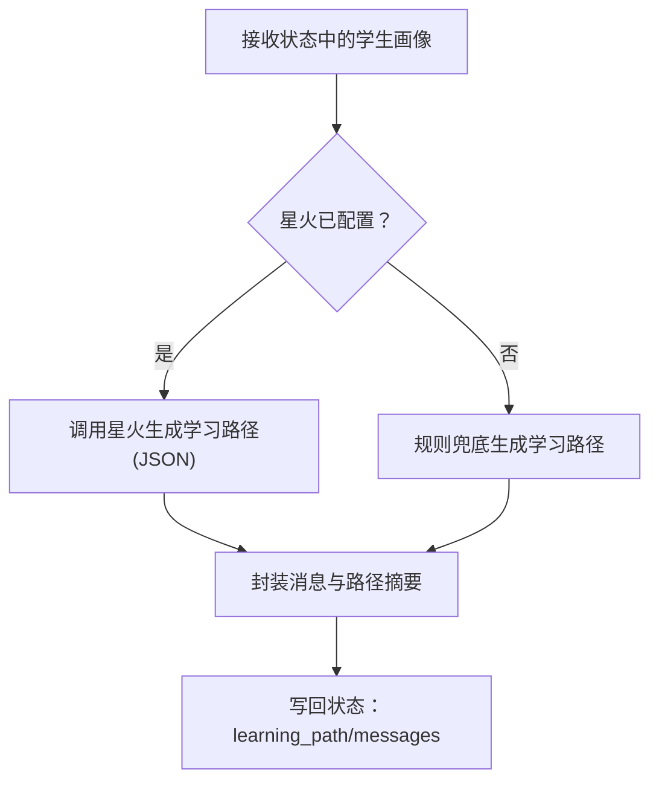
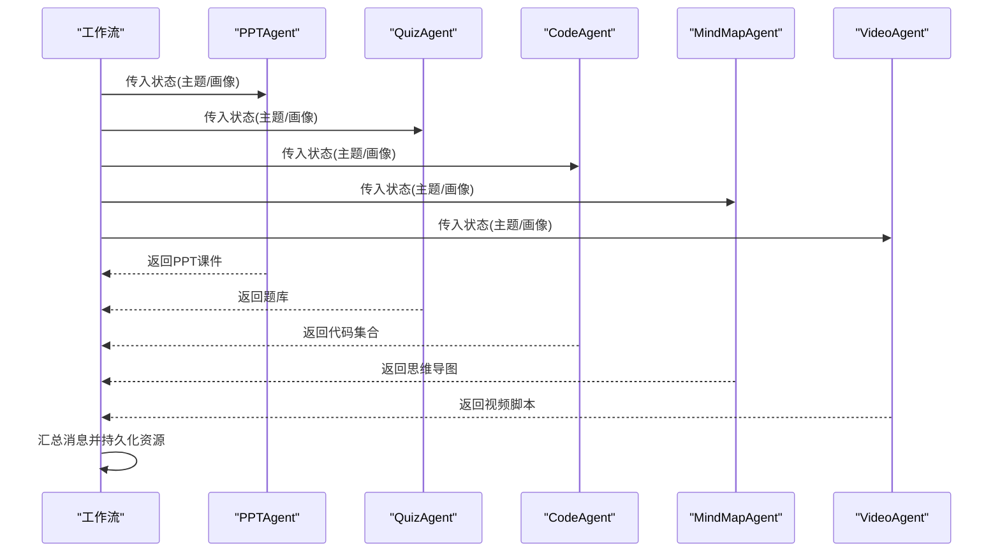
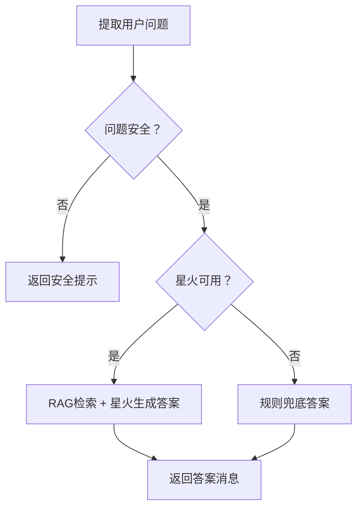
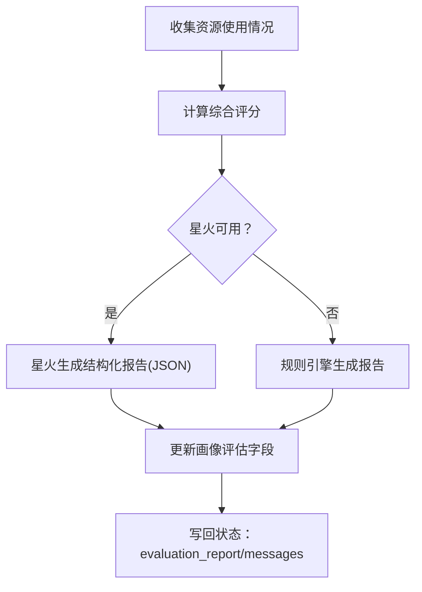
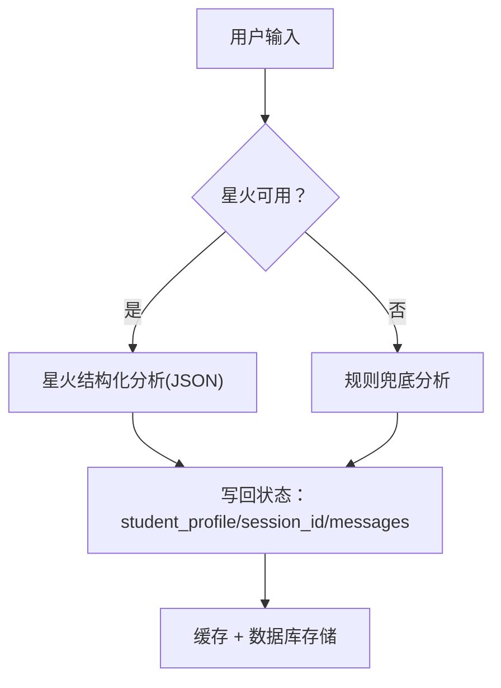
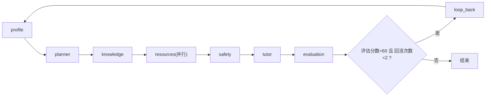
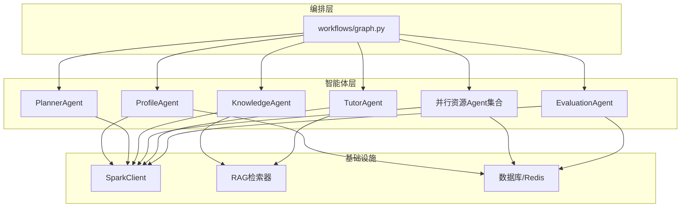
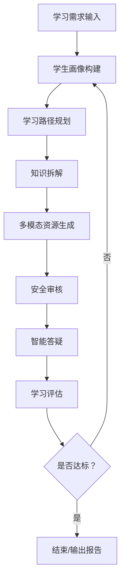

# 核心功能特性

<cite>
**本文引用的文件**
- [README.md](file://README.md)
- [software_cup_ai_education_system_architecture.md](file://software_cup_ai_education_system_architecture.md)
- [backend/main.py](file://backend/main.py)
- [agents/__init__.py](file://agents/__init__.py)
- [agents/base.py](file://agents/base.py)
- [agents/profile_agent.py](file://agents/profile_agent.py)
- [agents/planner_agent.py](file://agents/planner_agent.py)
- [agents/knowledge_agent.py](file://agents/knowledge_agent.py)
- [agents/ppt_agent.py](file://agents/ppt_agent.py)
- [agents/quiz_agent.py](file://agents/quiz_agent.py)
- [agents/tutor_agent.py](file://agents/tutor_agent.py)
- [agents/evaluation_agent.py](file://agents/evaluation_agent.py)
- [workflows/graph.py](file://workflows/graph.py)
- [services/profile_service.py](file://services/profile_service.py)
</cite>

## 目录
1. [简介](#简介)
2. [项目结构](#项目结构)
3. [核心组件](#核心组件)
4. [架构总览](#架构总览)
5. [详细组件分析](#详细组件分析)
6. [依赖关系分析](#依赖关系分析)
7. [性能考量](#性能考量)
8. [故障排查指南](#故障排查指南)
9. [结论](#结论)
10. [附录](#附录)

## 简介
本文件围绕EduAgent平台的核心功能特性进行系统化说明，覆盖智能学习路径规划、多模态资源生成、智能问答系统、语音交互服务、学习评估闭环等模块。文档以“多智能体协同”为主线，解释各Agent如何在LangGraph工作流中协作，如何结合RAG知识库与讯飞星火大模型实现个性化学习体验，并提供功能全景图帮助用户快速理解平台能力边界与应用价值。

## 项目结构
EduAgent采用前后端分离架构，后端基于FastAPI，前端基于Vue3，核心能力由多智能体Agent与LangGraph工作流编排构成，同时集成RAG知识库、讯飞ASR/TTS语音能力与学习评估闭环。

图表来源
- [backend/main.py:46-70](file://backend/main.py#L46-L70)
- [workflows/graph.py:186-211](file://workflows/graph.py#L186-L211)
- [agents/profile_agent.py:12-39](file://agents/profile_agent.py#L12-L39)
- [agents/planner_agent.py:153-181](file://agents/planner_agent.py#L153-L181)
- [agents/knowledge_agent.py:70-92](file://agents/knowledge_agent.py#L70-L92)
- [agents/ppt_agent.py:107-128](file://agents/ppt_agent.py#L107-L128)
- [agents/quiz_agent.py:193-214](file://agents/quiz_agent.py#L193-L214)
- [agents/tutor_agent.py:90-114](file://agents/tutor_agent.py#L90-L114)
- [agents/evaluation_agent.py:106-141](file://agents/evaluation_agent.py#L106-L141)

章节来源
- [README.md:23-40](file://README.md#L23-L40)
- [backend/main.py:46-70](file://backend/main.py#L46-L70)

## 核心组件
- 多智能体Agent：负责各自领域的专项任务，统一继承抽象基类，遵循一致的run接口，接收共享状态并返回增量结果。
- LangGraph工作流：串联画像、规划、知识拆解、并行资源生成、安全审核、答疑、评估等节点，支持回流与持久化。
- RAG知识库：文档解析、切片、向量化与检索，为知识拆解与答疑提供上下文。
- 讯飞星火：作为主大模型，提供结构化输出与对话能力；未配置时提供规则兜底。
- 语音服务：ASR识别与TTS播报，支撑语音学习中心。
- 评估闭环：基于学习行为与资源使用情况生成评估报告，动态更新画像并回流优化。

章节来源
- [agents/base.py:7-13](file://agents/base.py#L7-L13)
- [agents/__init__.py:16-29](file://agents/__init__.py#L16-L29)
- [workflows/graph.py:39-133](file://workflows/graph.py#L39-L133)

## 架构总览
下图展示了平台整体架构与数据流：前端通过API与后端交互，后端编排多智能体工作流，智能体结合RAG与星火大模型生成个性化学习资源与评估报告，语音模块贯穿ASR与TTS。

图表来源
- [software_cup_ai_education_system_architecture.md:68-127](file://software_cup_ai_education_system_architecture.md#L68-L127)
- [workflows/graph.py:186-211](file://workflows/graph.py#L186-L211)
- [agents/tutor_agent.py:123-153](file://agents/tutor_agent.py#L123-L153)

## 详细组件分析

### 智能学习路径规划（PlannerAgent）
- 工作原理
  - 读取学生画像，结合学习目标、薄弱点、学习时间等要素生成学习路径。
  - 若星火可用，优先使用大模型生成结构化路径；否则使用规则兜底策略。
- 实现方式
  - 通过Prompt加载与星火JSON对话接口生成LearningPath。
  - 将路径摘要与Markdown形式的消息写回共享状态。
- 使用场景
  - 新用户首次输入学习需求后的路径生成。
  - 评估后回流至画像节点，结合建议动态优化路径。
- 关键路径
  - run/state流转与消息写回：[agents/planner_agent.py:161-181](file://agents/planner_agent.py#L161-L181)
  - 规则兜底路径生成：[agents/planner_agent.py:25-150](file://agents/planner_agent.py#L25-L150)
  - 星火生成路径（JSON）：[agents/planner_agent.py:192-209](file://agents/planner_agent.py#L192-L209)

图表来源
- [agents/planner_agent.py:183-191](file://agents/planner_agent.py#L183-L191)
- [agents/planner_agent.py:161-181](file://agents/planner_agent.py#L161-L181)

章节来源
- [agents/planner_agent.py:153-209](file://agents/planner_agent.py#L153-L209)

### 多模态资源生成（PPT/题库/代码/思维导图/视频脚本）
- 工作原理
  - 并行执行多个资源生成Agent，统一从共享状态读取学习主题与画像，产出多种学习资源。
  - 支持星火结构化生成与规则兜底。
- 实现方式
  - PPTAgent：根据主题与画像生成PPT课件结构。
  - QuizAgent：生成多题型练习题集与建议。
  - CodeAgent/MindMapAgent/VideoAgent：分别生成代码示例、思维导图与视频脚本。
- 使用场景
  - 知识拆解完成后批量生成配套资源，支撑个性化学习。
- 关键路径
  - 并行资源节点与持久化：[workflows/graph.py:73-98](file://workflows/graph.py#L73-L98)
  - PPT生成（星火/规则）：[agents/ppt_agent.py:115-145](file://agents/ppt_agent.py#L115-L145)
  - 题库生成（星火/规则）：[agents/quiz_agent.py:201-229](file://agents/quiz_agent.py#L201-L229)

图表来源
- [workflows/graph.py:73-98](file://workflows/graph.py#L73-L98)
- [agents/ppt_agent.py:115-128](file://agents/ppt_agent.py#L115-L128)
- [agents/quiz_agent.py:201-214](file://agents/quiz_agent.py#L201-L214)

章节来源
- [workflows/graph.py:73-98](file://workflows/graph.py#L73-L98)
- [agents/ppt_agent.py:107-165](file://agents/ppt_agent.py#L107-L165)
- [agents/quiz_agent.py:193-250](file://agents/quiz_agent.py#L193-L250)

### 智能问答系统（TutorAgent）
- 工作原理
  - 从历史消息中提取最新问题，结合RAG检索与星火大模型生成可理解的答案。
  - 支持安全关键词过滤与规则兜底。
- 实现方式
  - 安全检查与阻断敏感话题。
  - RAG检索增强问答，必要时回退规则答案。
- 使用场景
  - 学习过程中的即时答疑与学习建议。
- 关键路径
  - 问题提取与安全检查：[agents/tutor_agent.py:99-114](file://agents/tutor_agent.py#L99-L114)
  - RAG检索与星火生成：[agents/tutor_agent.py:123-153](file://agents/tutor_agent.py#L123-L153)

图表来源
- [agents/tutor_agent.py:99-114](file://agents/tutor_agent.py#L99-L114)
- [agents/tutor_agent.py:123-153](file://agents/tutor_agent.py#L123-L153)

章节来源
- [agents/tutor_agent.py:90-153](file://agents/tutor_agent.py#L90-L153)

### 学习评估闭环（EvaluationAgent）
- 工作原理
  - 综合资源使用情况与画像信息，计算评分并生成评估报告。
  - 支持星火结构化生成与规则引擎兜底。
- 实现方式
  - 计算评分与生成报告，更新学生画像中的评估字段。
  - 将报告以Markdown形式写回状态，供前端展示。
- 使用场景
  - 学习周期结束后的效果评估与建议输出。
- 关键路径
  - 评分计算与报告生成：[agents/evaluation_agent.py:25-103](file://agents/evaluation_agent.py#L25-L103)
  - 星火结构化生成：[agents/evaluation_agent.py:176-201](file://agents/evaluation_agent.py#L176-L201)

图表来源
- [agents/evaluation_agent.py:114-141](file://agents/evaluation_agent.py#L114-L141)
- [agents/evaluation_agent.py:167-174](file://agents/evaluation_agent.py#L167-L174)

章节来源
- [agents/evaluation_agent.py:106-201](file://agents/evaluation_agent.py#L106-L201)

### 学生画像构建（ProfileAgent + ProfileService）
- 工作原理
  - 通过自然语言输入分析学习目标、专业方向、学习风格、知识基础、薄弱点、学习时间等维度。
  - 支持缓存与数据库持久化，星火不可用时使用规则兜底。
- 实现方式
  - ProfileAgent封装运行逻辑，ProfileService负责与数据库与Redis交互。
  - Prompt工程与星火JSON输出保证结构化画像。
- 使用场景
  - 任何需要个性化推荐与路径规划的前置步骤。
- 关键路径
  - Agent运行与消息写回：[agents/profile_agent.py:17-39](file://agents/profile_agent.py#L17-L39)
  - 缓存与持久化：[services/profile_service.py:106-123](file://services/profile_service.py#L106-L123)
  - 规则兜底画像生成：[services/profile_service.py:32-87](file://services/profile_service.py#L32-L87)

图表来源
- [agents/profile_agent.py:17-39](file://agents/profile_agent.py#L17-L39)
- [services/profile_service.py:124-150](file://services/profile_service.py#L124-L150)

章节来源
- [agents/profile_agent.py:12-40](file://agents/profile_agent.py#L12-L40)
- [services/profile_service.py:90-166](file://services/profile_service.py#L90-L166)

### 多智能体协同与工作流（LangGraph）
- 工作原理
  - 串行：画像 → 规划 → 知识拆解 → 并行资源生成 → 安全 → 答疑 → 评估。
  - 条件：评估分数低于阈值且回流次数未达上限时，回流至画像节点注入建议。
  - 持久化：资源与评估报告异步落库。
- 实现方式
  - 节点函数封装各Agent.run，条件边根据评估结果路由。
- 使用场景
  - 自动化学习流程编排，形成“生成-使用-评估-优化”的闭环。
- 关键路径
  - 工作流编排与路由：[workflows/graph.py:186-211](file://workflows/graph.py#L186-L211)
  - 回流逻辑与注入建议：[workflows/graph.py:136-183](file://workflows/graph.py#L136-L183)

图表来源
- [workflows/graph.py:186-211](file://workflows/graph.py#L186-L211)
- [workflows/graph.py:136-153](file://workflows/graph.py#L136-L153)

章节来源
- [workflows/graph.py:39-133](file://workflows/graph.py#L39-L133)
- [workflows/graph.py:186-211](file://workflows/graph.py#L186-L211)

## 依赖关系分析
- 组件耦合
  - Agent之间通过共享状态解耦，仅依赖状态键与消息协议。
  - 工作流作为编排器，集中管理节点间流转与条件路由。
- 外部依赖
  - 星火大模型：提供结构化生成与对话能力。
  - RAG知识库：为知识拆解与答疑提供检索增强。
  - Redis与数据库：缓存与持久化画像与评估报告。
- 潜在风险
  - 星火不可用时的规则兜底质量与覆盖率。
  - 并行资源生成的并发与持久化一致性。

图表来源
- [workflows/graph.py:26-36](file://workflows/graph.py#L26-L36)
- [agents/knowledge_agent.py:75-77](file://agents/knowledge_agent.py#L75-L77)
- [agents/tutor_agent.py:95-97](file://agents/tutor_agent.py#L95-L97)
- [services/profile_service.py:96-101](file://services/profile_service.py#L96-L101)

章节来源
- [workflows/graph.py:26-36](file://workflows/graph.py#L26-L36)
- [agents/knowledge_agent.py:75-77](file://agents/knowledge_agent.py#L75-L77)
- [agents/tutor_agent.py:95-97](file://agents/tutor_agent.py#L95-L97)
- [services/profile_service.py:96-101](file://services/profile_service.py#L96-L101)

## 性能考量
- 并行化收益
  - 资源生成节点采用并行执行，显著缩短端到端时延。
- 缓存策略
  - 画像与评估报告写入Redis，减少重复计算与数据库压力。
- 星火降级
  - 星火失败时自动回退规则兜底，保障系统可用性。
- I/O优化
  - RAG检索限制k值，降低上下文长度与生成成本。
- 建议
  - 合理设置回流次数上限，避免无限循环。
  - 对高频资源生成增加本地缓存与版本控制。

## 故障排查指南
- 星火相关
  - 症状：路径/资源/问答/评估均回退规则兜底。
  - 排查：确认密钥配置与网络连通，查看后端日志警告。
- RAG检索
  - 症状：知识拆解/答疑无上下文或质量差。
  - 排查：确认知识库入库成功、向量维度与检索参数合理。
- 评估分数异常
  - 症状：评分偏低或波动大。
  - 排查：核对资源使用情况统计与画像字段，必要时启用规则兜底。
- 工作流卡滞
  - 症状：评估后未回流画像。
  - 排查：检查评估分数阈值与回流计数，确认条件边路由逻辑。

章节来源
- [agents/planner_agent.py:184-190](file://agents/planner_agent.py#L184-L190)
- [agents/knowledge_agent.py:110-118](file://agents/knowledge_agent.py#L110-L118)
- [agents/evaluation_agent.py:167-174](file://agents/evaluation_agent.py#L167-L174)
- [workflows/graph.py:136-153](file://workflows/graph.py#L136-L153)

## 结论
EduAgent通过多智能体与LangGraph工作流实现了从“画像-规划-资源-答疑-评估”的完整闭环，结合RAG与星火大模型提供个性化学习体验。平台在保证可扩展性的同时，通过规则兜底与缓存策略提升了稳定性与性能，适用于高校与个人用户的多样化学习场景。

## 附录
- 功能全景图（概念示意）

[此图为概念示意，无需图表来源]