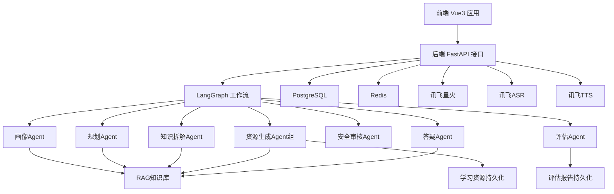
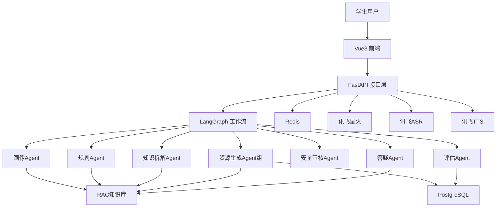
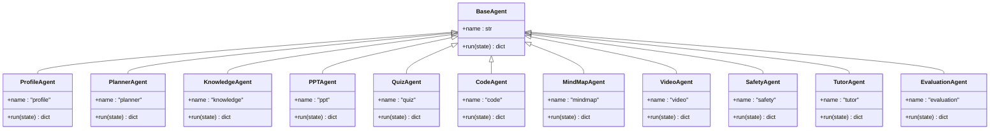
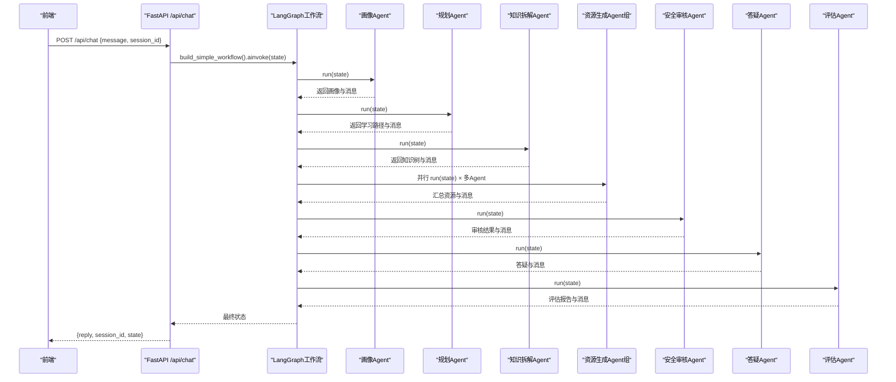
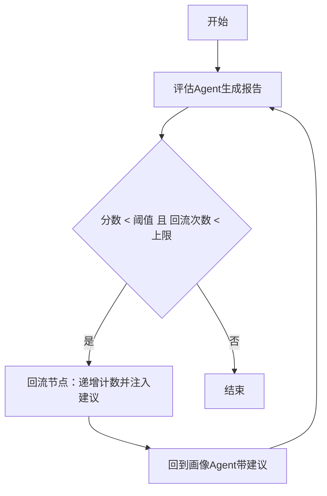
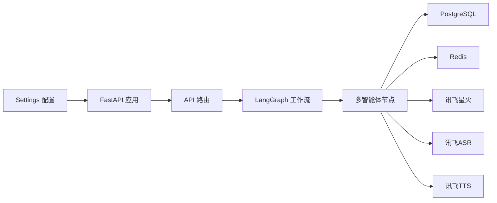

# 项目介绍

<cite>
**本文引用的文件**
- [README.md](file://README.md)
- [software_cup_ai_education_system_architecture.md](file://software_cup_ai_education_system_architecture.md)
- [backend/main.py](file://backend/main.py)
- [backend/settings.py](file://backend/settings.py)
- [agents/base.py](file://agents/base.py)
- [agents/profile_agent.py](file://agents/profile_agent.py)
- [agents/planner_agent.py](file://agents/planner_agent.py)
- [workflows/graph.py](file://workflows/graph.py)
- [prompts/profile_agent.md](file://prompts/profile_agent.md)
- [api/routes/chat.py](file://api/routes/chat.py)
- [api/routes/workflow.py](file://api/routes/workflow.py)
- [services/profile_service.py](file://services/profile_service.py)
- [frontend/src/main.ts](file://frontend/src/main.ts)
- [frontend/src/components/ChatLearning.vue](file://frontend/src/components/ChatLearning.vue)
- [frontend/src/components/PersonalizedLearning.vue](file://frontend/src/components/PersonalizedLearning.vue)
</cite>

## 目录
1. [引言](#引言)
2. [项目结构](#项目结构)
3. [核心组件](#核心组件)
4. [架构总览](#架构总览)
5. [详细组件分析](#详细组件分析)
6. [依赖关系分析](#依赖关系分析)
7. [性能考量](#性能考量)
8. [故障排查指南](#故障排查指南)
9. [结论](#结论)
10. [附录](#附录)

## 引言
EduAgent 是一个基于 Vue3 + FastAPI + LangGraph + 讯飞星火的多智能体高校个性化学习平台。项目以“学生画像”为起点，通过“学习规划”“知识拆解”“资源生成”“安全审核”“答疑辅导”“学习评估”的闭环工作流，结合 RAG 知识库与语音能力，为学生提供从“理解现状”到“生成路径”再到“产出资源”的一站式个性化学习体验。

项目愿景
- 让每个学生都能拥有“懂你”的AI学习伙伴
- 以多智能体协同实现“因材施教”的智能化路径
- 以RAG与大模型能力支撑“可解释、可追踪、可迭代”的学习闭环

为什么选择这个技术组合
- 前端：Vue3 + TypeScript + Tailwind，兼顾开发效率与交互体验
- 后端：FastAPI，高性能异步接口，便于扩展与部署
- 多智能体：LangGraph，天然的状态流转与条件分支，适合学习工作流编排
- 大模型：讯飞星火，中文场景优势明显，支持 WebSocket/HTTP两种接入方式
- 知识库：RAG + ChromaDB + BGE嵌入，实现“问得准、答得深”
- 语音：讯飞ASR/TTS，打通口语化学习入口与播报出口
- 数据与缓存：PostgreSQL + Redis，保障画像与会话的持久化与性能

应用场景与解决的核心问题
- 应用场景
  - 高校课堂与课后：个性化学习路径生成、AI答疑、资源生成
  - 自主学习：学生画像驱动的阶段性目标管理与学习节奏优化
  - 教师辅助：评估闭环与学习报告，辅助教学改进
- 核心问题
  - 如何从“零散描述”中抽取“结构化画像”
  - 如何将“画像”转化为“可执行的学习路径”
  - 如何在“多模态资源”生成中保证质量与合规
  - 如何在“语音交互”中提升可用性与沉浸感
  - 如何形成“学习行为→评估→画像更新→路径再优化”的闭环

## 项目结构
整体采用前后端分离、模块化清晰的工程化组织：
- frontend：Vue3 + TS + Tailwind 前端界面，包含对话学习、个性化学习中心、资源生成、语音学习等模块
- backend：FastAPI 应用，统一注册路由、初始化数据库与Redis、按需自动RAG入库
- api/routes：REST API 路由层，暴露健康检查、RAG、画像、语音、评估、工作流等接口
- agents：多智能体模块，覆盖画像、规划、知识拆解、资源生成、答疑、评估、安全等Agent
- workflows：LangGraph 工作流编排，串联各Agent并实现评估回流
- rag：RAG 知识库构建与检索
- services：业务服务层，如画像服务、语音服务、评估服务
- database：ORM + Repository + 数据库会话
- integrations：讯飞相关集成（Spark、ASR、TTS）
- scripts：知识入库、工作流冒烟测试等脚本
- docker：Dockerfile 与 docker-compose，支持一键部署

图表来源
- [backend/main.py:46-70](file://backend/main.py#L46-L70)
- [workflows/graph.py:186-211](file://workflows/graph.py#L186-L211)
- [agents/profile_agent.py:17-39](file://agents/profile_agent.py#L17-L39)
- [agents/planner_agent.py:161-181](file://agents/planner_agent.py#L161-L181)

章节来源
- [README.md:23-40](file://README.md#L23-L40)
- [backend/main.py:12-70](file://backend/main.py#L12-L70)

## 核心组件
- 多智能体框架
  - 基类抽象：统一的异步 run 接口，便于在工作流中编排
  - 画像Agent：从自然语言中抽取结构化画像，支持缓存与兜底策略
  - 规划Agent：基于画像生成学习路径，支持星火与规则双通道
  - 知识拆解Agent：结合RAG检索，输出结构化知识点
  - 资源生成Agent组：并行生成PPT、题库、代码、思维导图、视频脚本
  - 安全审核Agent：对生成内容进行合规性过滤
  - 答疑Agent：结合RAG与星火，提供图文并茂的讲解
  - 评估Agent：采集学习行为，生成评估报告并驱动回流
- 工作流编排
  - 串行：画像 → 规划 → 知识拆解 → 并行资源生成 → 安全 → 答疑 → 评估
  - 条件：评估分数低于阈值且回流次数未达上限时，回流至画像节点
- 前端模块
  - 对话学习：流式打字机、Markdown渲染、代码高亮、消息操作
  - 个性化学习中心：画像雷达图、标签云、学习路径时间轴
  - 资源生成、语音学习、学习评估等模块

章节来源
- [agents/base.py:7-13](file://agents/base.py#L7-L13)
- [agents/profile_agent.py:12-39](file://agents/profile_agent.py#L12-L39)
- [agents/planner_agent.py:153-181](file://agents/planner_agent.py#L153-L181)
- [workflows/graph.py:186-211](file://workflows/graph.py#L186-L211)
- [frontend/src/components/ChatLearning.vue:133-182](file://frontend/src/components/ChatLearning.vue#L133-L182)
- [frontend/src/components/PersonalizedLearning.vue:223-273](file://frontend/src/components/PersonalizedLearning.vue#L223-L273)

## 架构总览
下图展示了从前端到后端、从多智能体到外部服务的整体交互：

图表来源
- [software_cup_ai_education_system_architecture.md:68-127](file://software_cup_ai_education_system_architecture.md#L68-L127)
- [workflows/graph.py:26-36](file://workflows/graph.py#L26-L36)
- [backend/main.py:46-70](file://backend/main.py#L46-L70)

## 详细组件分析

### 多智能体类关系

图表来源
- [agents/base.py:7-13](file://agents/base.py#L7-L13)
- [agents/profile_agent.py:12-39](file://agents/profile_agent.py#L12-L39)
- [agents/planner_agent.py:153-181](file://agents/planner_agent.py#L153-L181)

章节来源
- [agents/base.py:7-13](file://agents/base.py#L7-L13)
- [agents/profile_agent.py:12-39](file://agents/profile_agent.py#L12-L39)
- [agents/planner_agent.py:153-181](file://agents/planner_agent.py#L153-L181)

### 工作流执行序列（从API到多智能体）

图表来源
- [api/routes/chat.py:23-36](file://api/routes/chat.py#L23-L36)
- [workflows/graph.py:186-211](file://workflows/graph.py#L186-L211)
- [agents/profile_agent.py:17-39](file://agents/profile_agent.py#L17-L39)
- [agents/planner_agent.py:161-181](file://agents/planner_agent.py#L161-L181)

章节来源
- [api/routes/chat.py:23-36](file://api/routes/chat.py#L23-L36)
- [workflows/graph.py:186-211](file://workflows/graph.py#L186-L211)

### 评估回流机制（闭环）

图表来源
- [workflows/graph.py:136-183](file://workflows/graph.py#L136-L183)

章节来源
- [workflows/graph.py:136-183](file://workflows/graph.py#L136-L183)

### 学生画像生成（Prompt与兜底）
- Prompt工程：通过结构化字段约束，确保输出可解析
- 星火通道：在配置可用时优先使用，失败时自动降级
- 缓存与持久化：Redis + PostgreSQL 双写，提升响应速度与一致性

章节来源
- [prompts/profile_agent.md:1-28](file://prompts/profile_agent.md#L1-L28)
- [services/profile_service.py:124-150](file://services/profile_service.py#L124-L150)
- [services/profile_service.py:152-165](file://services/profile_service.py#L152-L165)

### 前端交互要点
- 对话学习：流式打字机、Markdown渲染、代码高亮、消息操作（点赞/复制/重新生成）
- 个性化学习中心：雷达图、标签云、学习路径时间轴；支持从画像到路径的链路调用
- 语音学习：预留ASR/TTS接入点，后续可扩展语音输入/播报

章节来源
- [frontend/src/components/ChatLearning.vue:133-182](file://frontend/src/components/ChatLearning.vue#L133-L182)
- [frontend/src/components/PersonalizedLearning.vue:223-273](file://frontend/src/components/PersonalizedLearning.vue#L223-L273)
- [frontend/src/main.ts:1-6](file://frontend/src/main.ts#L1-L6)

## 依赖关系分析
- 后端依赖注入与生命周期
  - CORS、日志、数据库初始化、Redis连接、RAG自动入库
- 配置与密钥
  - 通过 Settings 统一管理，支持 WebSocket/HTTP 星火接入、ASR/TTS、RAG参数、CORS等
- 多智能体与工作流
  - 通过 LangGraph StateGraph 组织节点，条件边实现评估回流
- 前后端通信
  - 前端通过 /api/chat 与 /api/workflow/execute 调用后端，后端返回结构化状态与资源

图表来源
- [backend/settings.py:6-66](file://backend/settings.py#L6-L66)
- [backend/main.py:23-41](file://backend/main.py#L23-L41)
- [workflows/graph.py:26-36](file://workflows/graph.py#L26-L36)

章节来源
- [backend/settings.py:6-66](file://backend/settings.py#L6-L66)
- [backend/main.py:23-41](file://backend/main.py#L23-L41)

## 性能考量
- 并行资源生成：在知识拆解完成后，PPT、题库、代码、思维导图、视频脚本并行生成，显著缩短总时延
- 缓存策略：画像与会话状态通过 Redis 缓存，减少重复计算与大模型调用
- 回流控制：评估回流次数与阈值限制，避免无限循环
- 数据库与向量库：RAG入库与检索分离，向量库独立持久化，降低查询延迟
- 前端渲染：Markdown与代码高亮按需加载，骨架屏与流式渲染提升感知性能

## 故障排查指南
- 星火密钥配置
  - 若未配置或错误，系统将自动使用规则兜底；请在 .env 中正确填写 APPID/APIKey/APISecret，并确认域名与URL
- CORS跨域
  - 确认 Settings.cors_origins 与前端地址一致
- RAG入库失败
  - 检查知识目录与向量库路径权限，首次运行会自动下载嵌入模型
- 评估回流异常
  - 查看评估报告与回流计数，确认是否达到上限或阈值设置
- 前端无法连接后端
  - 确认后端监听地址与端口，以及代理/防火墙设置

章节来源
- [README.md:95-111](file://README.md#L95-L111)
- [backend/settings.py:53-61](file://backend/settings.py#L53-L61)
- [backend/main.py:32-40](file://backend/main.py#L32-L40)

## 结论
EduAgent 以“多智能体 + RAG + 语音”的技术栈，构建了从“理解学生现状”到“生成学习路径”再到“产出高质量资源”的完整闭环。通过 LangGraph 的工作流编排与评估回流机制，平台实现了“可解释、可追踪、可迭代”的个性化学习体验。对于初学者，建议从“前端交互”“画像与规划”“工作流编排”三个维度逐步深入；对于开发者，可在现有Agent基础上扩展更多资源生成与评估维度，持续完善闭环。

## 附录
- 快速开始
  - 环境准备：复制 .env.example 为 .env，安装后端依赖
  - 启动后端：uvicorn 启动 FastAPI 应用
  - RAG入库：运行知识入库脚本
  - 启动前端：进入 frontend 目录安装依赖并运行
- API参考
  - /api/health 健康检查
  - /api/rag/* RAG相关接口
  - /api/profile/* 画像分析
  - /api/chat 对话接口
  - /api/workflow/* 工作流执行与状态查询

章节来源
- [README.md:53-82](file://README.md#L53-L82)
- [README.md:83-94](file://README.md#L83-L94)