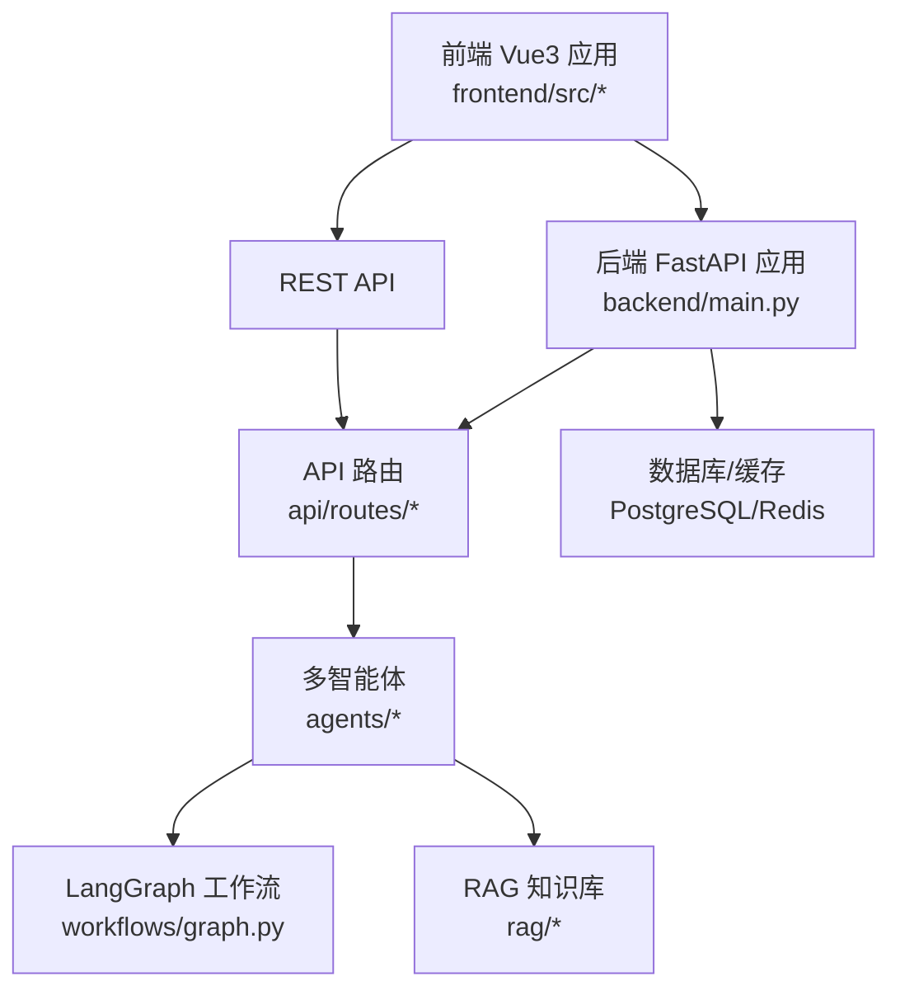
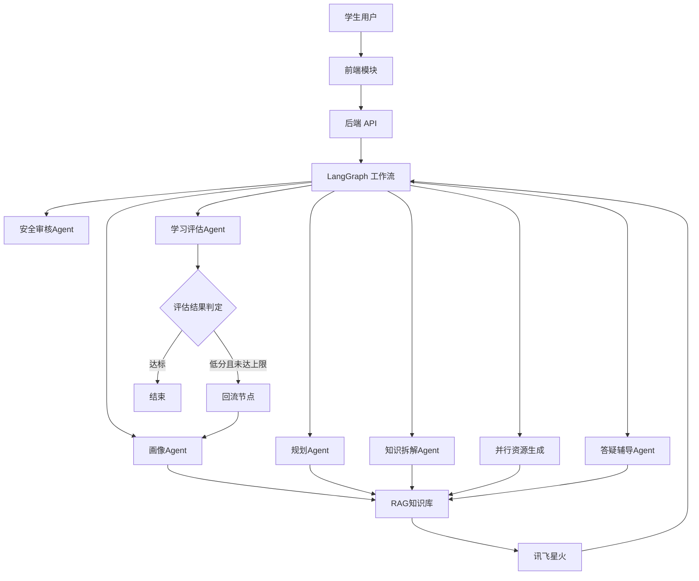
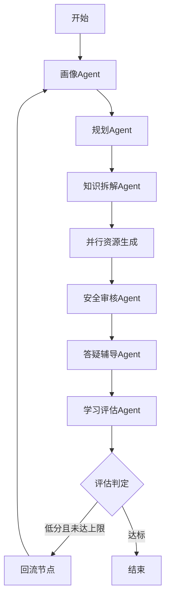
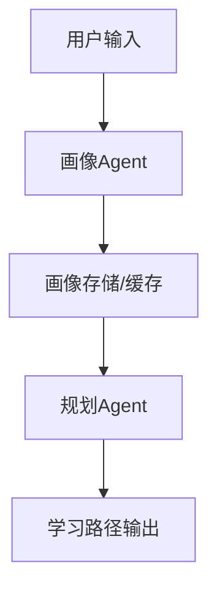
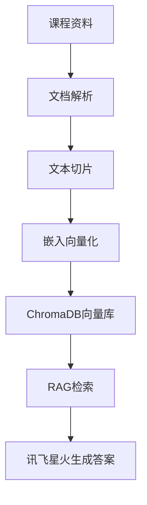
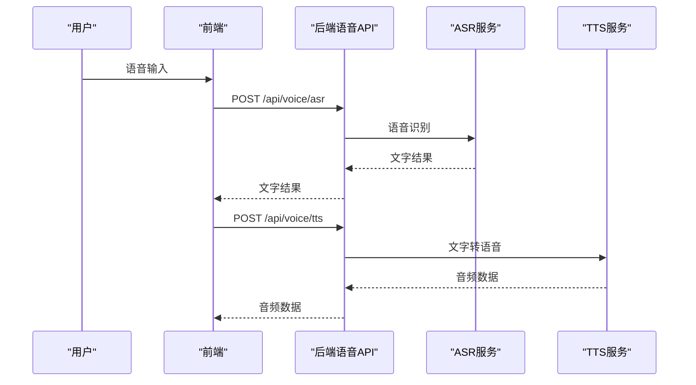
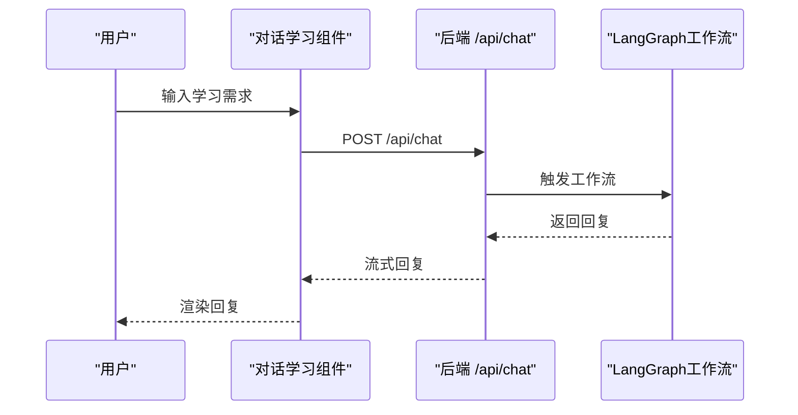
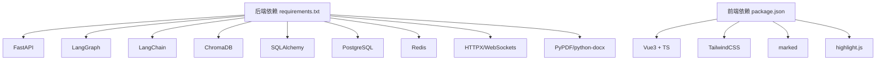

# 项目概述

<cite>
**本文引用的文件**
- [README.md](file://README.md)
- [software_cup_ai_education_system_architecture.md](file://software_cup_ai_education_system_architecture.md)
- [backend/main.py](file://backend/main.py)
- [backend/settings.py](file://backend/settings.py)
- [agents/base.py](file://agents/base.py)
- [agents/profile_agent.py](file://agents/profile_agent.py)
- [workflows/graph.py](file://workflows/graph.py)
- [rag/__init__.py](file://rag/__init__.py)
- [docker/docker-compose.yml](file://docker/docker-compose.yml)
- [frontend/src/main.ts](file://frontend/src/main.ts)
- [frontend/src/components/ChatLearning.vue](file://frontend/src/components/ChatLearning.vue)
- [docs/phases/README.md](file://docs/phases/README.md)
- [scripts/start.sh](file://scripts/start.sh)
- [requirements.txt](file://requirements.txt)
</cite>

## 目录
1. [引言](#引言)
2. [项目结构](#项目结构)
3. [核心组件](#核心组件)
4. [架构总览](#架构总览)
5. [详细组件分析](#详细组件分析)
6. [依赖分析](#依赖分析)
7. [性能考虑](#性能考虑)
8. [故障排查指南](#故障排查指南)
9. [结论](#结论)
10. [附录](#附录)

## 引言
EduAgent 是一个基于 Vue3 + FastAPI + LangGraph + 讯飞星火的多智能体高校个性化学习平台。项目围绕“学生画像 → 学习规划 → 知识拆解 → 并行资源生成 → 安全审核 → 答疑辅导 → 学习评估”的完整闭环，通过多智能体协同实现从“需求输入”到“个性化资源输出”的自动化学习路径编排，并结合 RAG 知识库、语音识别与合成、评估闭环等能力，为高校学生提供沉浸式、可追踪、可优化的AI辅助学习体验。

项目采用分阶段交付策略，目前已完成基础环境、RAG 知识库、学生画像、学习规划、资源生成、LangGraph 工作流、讯飞语音接入、学习评估闭环、前端 UI 优化与 Docker 部署等十个阶段，形成可扩展、可维护的工程化架构。

## 项目结构
项目采用前后端分离与模块化组织，核心目录与职责如下：
- frontend：Vue3 + TypeScript + TailwindCSS 前端应用，包含五大模块（对话学习、个性化学习中心、AI资源生成中心、学习评估中心、语音学习中心）
- backend：FastAPI 后端入口与路由，统一配置、日志、CORS、数据库与缓存初始化
- api/routes：REST API 路由集合（健康检查、聊天、RAG、画像、语音、评估、工作流等）
- agents：多智能体实现（画像、规划、知识拆解、PPT/题库/代码/思维导图/视频脚本、答疑、安全、评估）
- workflows：LangGraph 工作流编排与状态管理
- rag：RAG 知识库（文档解析、切片、嵌入、向量库、检索）
- services：业务服务（画像、语音、评估）
- database：ORM 与仓储模式
- docker：Docker Compose 编排与一键启动脚本
- scripts：知识入库、工作流测试、环境启动脚本
- docs：分阶段实施说明与架构文档

图表来源
- [backend/main.py:46-70](file://backend/main.py#L46-L70)
- [docker/docker-compose.yml:34-84](file://docker/docker-compose.yml#L34-L84)

章节来源
- [README.md:23-40](file://README.md#L23-L40)
- [docs/phases/README.md:1-10](file://docs/phases/README.md#L1-L10)

## 核心组件
- 多智能体框架：基于 LangGraph 的状态图编排，支持同步与并行节点、条件边与回流机制
- RAG 知识库：文档解析、文本切片、BGE 嵌入、ChromaDB 向量存储与检索
- 学生画像与学习规划：结合讯飞星火与规则引擎，动态生成画像与学习路径
- 资源生成：并行生成 PPT、题库、代码案例、思维导图、视频脚本
- 语音能力：ASR 语音识别与 TTS 语音合成，封装为服务与 API
- 评估闭环：学习行为采集、指标计算、评估报告生成与画像动态更新
- 前端模块：对话学习、个性化学习中心、资源生成、学习评估、语音学习五大模块
- 部署：Docker Compose 编排，一键启动脚本，Nginx 前端代理

章节来源
- [workflows/graph.py:186-211](file://workflows/graph.py#L186-L211)
- [rag/__init__.py:1-7](file://rag/__init__.py#L1-L7)
- [agents/profile_agent.py:12-39](file://agents/profile_agent.py#L12-L39)
- [frontend/src/components/ChatLearning.vue:133-182](file://frontend/src/components/ChatLearning.vue#L133-L182)
- [docker/docker-compose.yml:1-95](file://docker/docker-compose.yml#L1-L95)

## 架构总览
系统采用“前端 + 后端 + 多智能体 + RAG + 语音 + 评估闭环”的分层架构，核心交互链路如下：
- 学生通过前端模块输入学习需求，后端 API 接收请求并进入 LangGraph 工作流
- 工作流按序执行：画像 → 规划 → 知识拆解 → 并行资源生成 → 安全审核 → 答疑 → 评估
- 评估完成后根据分数与建议进行回流，再次进入画像节点优化学习路径
- RAG 知识库贯穿知识检索与生成环节，确保内容质量与一致性
- 语音模块提供 ASR 与 TTS 能力，支持语音输入与播报

图表来源
- [software_cup_ai_education_system_architecture.md:68-127](file://software_cup_ai_education_system_architecture.md#L68-L127)
- [workflows/graph.py:186-211](file://workflows/graph.py#L186-L211)

## 详细组件分析

### 多智能体与工作流编排
- 工作流节点：画像、规划、知识拆解、并行资源生成、安全审核、答疑、评估、回流
- 条件边：根据评估报告分数与循环次数决定是否回流
- 并行资源生成：PPT、题库、代码、思维导图、视频脚本并行执行，提升吞吐
- 回流机制：注入评估建议，递增循环计数，最多两次回流

图表来源
- [workflows/graph.py:186-211](file://workflows/graph.py#L186-L211)
- [workflows/graph.py:136-153](file://workflows/graph.py#L136-L153)
- [workflows/graph.py:156-183](file://workflows/graph.py#L156-L183)

章节来源
- [workflows/graph.py:39-98](file://workflows/graph.py#L39-L98)
- [workflows/graph.py:109-133](file://workflows/graph.py#L109-L133)

### 学生画像与学习规划
- 画像生成：接收用户输入，结合讯飞星火或规则引擎，输出结构化画像（专业、水平、风格、目标、薄弱点、时长等）
- 规划生成：基于画像与学习目标，生成结构化学习路径（周计划、知识点、资源推荐、评估方式）

图表来源
- [agents/profile_agent.py:17-39](file://agents/profile_agent.py#L17-L39)
- [docs/phases/README.md:37-99](file://docs/phases/README.md#L37-L99)

章节来源
- [agents/profile_agent.py:12-39](file://agents/profile_agent.py#L12-L39)
- [docs/phases/README.md:37-99](file://docs/phases/README.md#L37-L99)

### RAG 知识库
- 文档解析：支持 Markdown、PDF、PPT、Word、实验案例等
- 文本切片：基于固定长度与重叠窗口切分
- 向量化与检索：BGE 嵌入 + ChromaDB，支持检索增强生成

图表来源
- [software_cup_ai_education_system_architecture.md:194-222](file://software_cup_ai_education_system_architecture.md#L194-L222)
- [rag/__init__.py:1-7](file://rag/__init__.py#L1-L7)

章节来源
- [rag/__init__.py:1-7](file://rag/__init__.py#L1-L7)
- [software_cup_ai_education_system_architecture.md:194-222](file://software_cup_ai_education_system_architecture.md#L194-L222)

### 语音能力（ASR/TTS）
- ASR：语音识别，将音频转为文字
- TTS：文字转语音，支持多种音色
- 服务封装：统一接口，便于前端调用

图表来源
- [docs/phases/README.md:273-339](file://docs/phases/README.md#L273-L339)

章节来源
- [docs/phases/README.md:273-339](file://docs/phases/README.md#L273-L339)

### 前端模块与交互
- 对话学习模块：支持流式打字机效果、Markdown 渲染、消息气泡、点赞/复制/重新生成等
- 个性化学习中心：画像与路径展示
- AI资源生成中心：PPT/题库/代码/思维导图/视频脚本生成
- 学习评估中心：行为数据提交与评估报告查看
- 语音学习中心：ASR/TTS 体验

图表来源
- [frontend/src/components/ChatLearning.vue:133-182](file://frontend/src/components/ChatLearning.vue#L133-L182)
- [backend/main.py:61-69](file://backend/main.py#L61-L69)

章节来源
- [frontend/src/components/ChatLearning.vue:133-182](file://frontend/src/components/ChatLearning.vue#L133-L182)
- [frontend/src/main.ts:1-6](file://frontend/src/main.ts#L1-L6)

## 依赖分析
- 后端依赖：FastAPI、LangGraph、LangChain、ChromaDB、SQLAlchemy、PostgreSQL、Redis、HTTPX、WebSockets、PyPDF、python-docx 等
- 前端依赖：Vue3、TypeScript、TailwindCSS、marked、highlight.js 等
- 部署依赖：Docker、Docker Compose、Nginx

图表来源
- [requirements.txt:1-18](file://requirements.txt#L1-L18)

章节来源
- [requirements.txt:1-18](file://requirements.txt#L1-L18)

## 性能考虑
- 并行资源生成：通过并发执行 PPT、题库、代码、思维导图、视频脚本生成，缩短端到端响应时间
- 缓存与持久化：Redis 缓存画像与中间状态，PostgreSQL 持久化用户会话与评估报告
- RAG 检索优化：合理设置 top_k、chunk_size 与 chunk_overlap，平衡召回与速度
- 语音处理：异步处理 ASR/TTS，避免阻塞主线程
- Docker 编排：独立服务容器化，便于弹性扩容与资源隔离

## 故障排查指南
- 启动失败：检查 Docker 与 Compose 是否安装并运行；确认 .env 配置（讯飞密钥、数据库、Redis）是否正确
- API 不可用：访问 /api/health 检查后端健康状态；查看日志定位异常
- RAG 入库失败：确认知识目录与嵌入模型可用；检查 ChromaDB 持久化目录权限
- 语音服务异常：检查 ASR/TTS 配置项与网络连通性
- 评估报告为空：确认学习行为数据结构与提交端点

章节来源
- [scripts/start.sh:40-66](file://scripts/start.sh#L40-L66)
- [backend/settings.py:17-40](file://backend/settings.py#L17-L40)
- [docs/phases/README.md:473-555](file://docs/phases/README.md#L473-L555)

## 结论
EduAgent 通过“Vue3 + FastAPI + LangGraph + 讯飞星火”的技术组合，构建了可扩展、可演进的多智能体高校个性化学习平台。其核心优势在于：
- 多智能体协同编排：以 LangGraph 串联画像、规划、知识拆解、资源生成、安全审核、答疑与评估，形成闭环
- RAG 知识库与大模型融合：确保内容质量与个性化输出的一致性
- 语音能力与前端模块：提升交互体验与可访问性
- 工程化与可运维性：Docker 编排、一键启动脚本、分阶段交付，降低部署与维护成本

该架构既适合初学者理解多智能体与 RAG 的落地实践，也为经验丰富的开发者提供了可扩展的工程范式与技术决策参考。

## 附录
- 快速开始：复制 .env.example 为 .env，安装依赖，启动后端与前端，首次运行需执行知识入库脚本
- API 列表：健康检查、RAG 入库/查询/统计、画像分析/查询、聊天、语音识别/合成、评估报告等
- 分阶段实施：从基础环境到 Docker 部署的完整路线图与验收标准

章节来源
- [README.md:53-111](file://README.md#L53-L111)
- [docs/phases/README.md:1-555](file://docs/phases/README.md#L1-L555)