# EduAgent —— 基于讯飞星火与多智能体协同的高校个性化学习平台

> 本文档已转换为标准 Markdown（.md）工程文档格式，可直接用于 Trae、Cursor、Claude Code、Windsurf 等 AI IDE 进行 Vibe Coding 开发。

## 推荐工程目录

```text
EduAgent/
├── frontend/                  # Vue3前端
├── backend/                   # FastAPI后端
├── agents/                    # 多智能体模块
│   ├── profile_agent.py
│   ├── planner_agent.py
│   ├── knowledge_agent.py
│   ├── ppt_agent.py
│   ├── quiz_agent.py
│   ├── code_agent.py
│   ├── tutor_agent.py
│   ├── evaluation_agent.py
│   └── safety_agent.py
├── workflows/                 # LangGraph工作流
├── prompts/                   # Prompt模板
├── rag/                       # RAG模块
├── vector_db/                 # 向量数据库
├── knowledge/                 # 课程知识库
├── api/                       # 接口层
├── database/                  # 数据库模型
├── docs/                      # 项目文档
├── docker/                    # Docker部署
└── README.md
```

## 推荐开发顺序

```text
第一阶段：项目基础环境
第二阶段：RAG知识库
第三阶段：学生画像Agent
第四阶段：学习规划Agent
第五阶段：资源生成Agent
第六阶段：LangGraph工作流
第七阶段：讯飞语音能力接入
第八阶段：学习评估系统
第九阶段：前端UI优化
第十阶段：Docker部署
```

## 推荐Trae Vibe Coding提示词

```text
请基于以下系统架构，使用 Vue3 + TypeScript + FastAPI + LangGraph + 讯飞星火 实现一个多智能体AI教育平台。

要求：
1. 前端使用Vue3+TailwindCSS
2. 后端使用FastAPI
3. Agent框架使用LangGraph
4. 接入讯飞星火API
5. 实现RAG知识库
6. 支持学生画像构建
7. 支持个性化学习路径
8. 支持PPT、题库、思维导图生成
9. 支持语音识别与语音播报
10. 所有模块采用工程化目录结构
11. 代码需具备可维护性与模块化设计
```


# 一、系统总体架构图

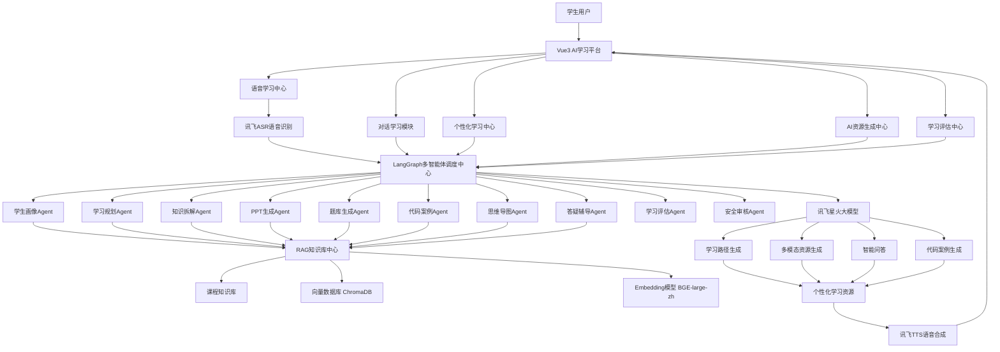

---

# 二、多智能体协同架构图

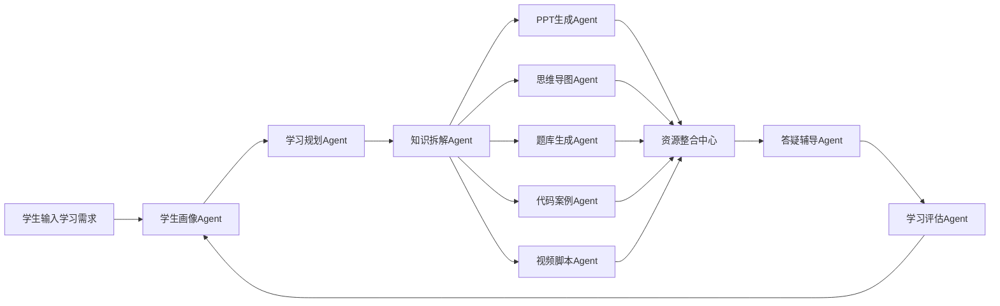

---

# 三、学生画像系统架构图

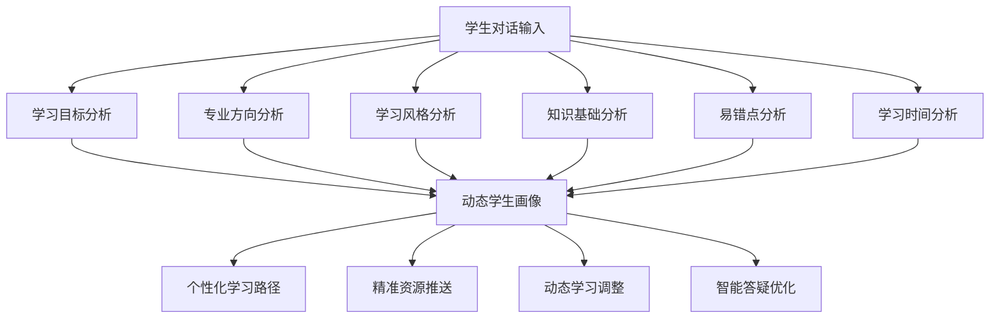

---

# 四、RAG知识库架构图

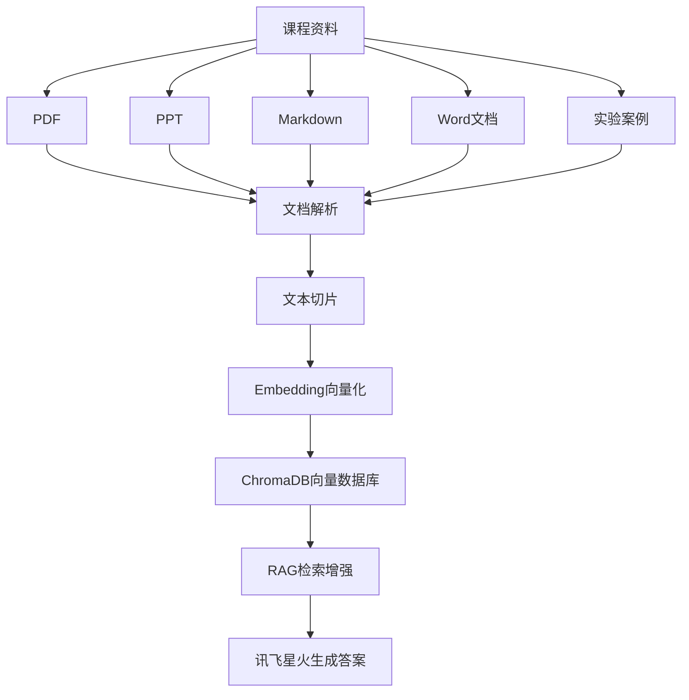

---

# 五、学习路径生成流程图

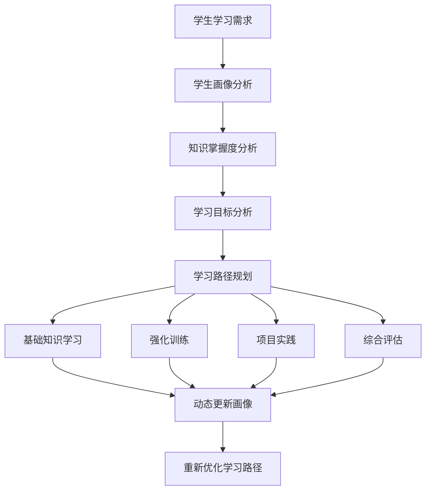

---

# 六、AI资源生成流程图

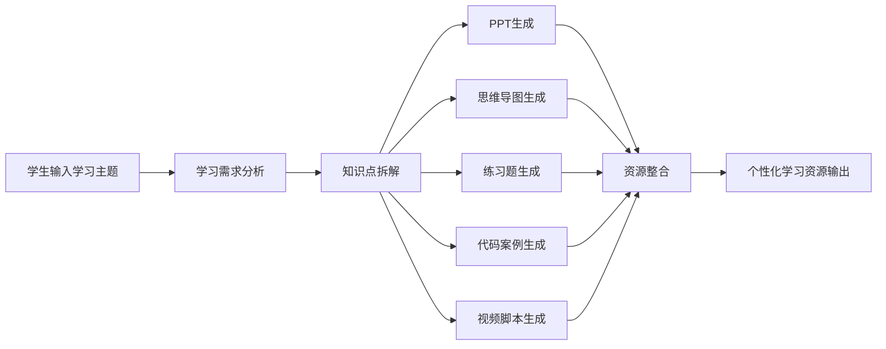

---

# 七、智能答疑流程图

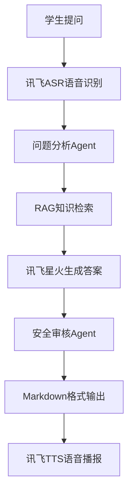

---

# 八、学习评估闭环架构图

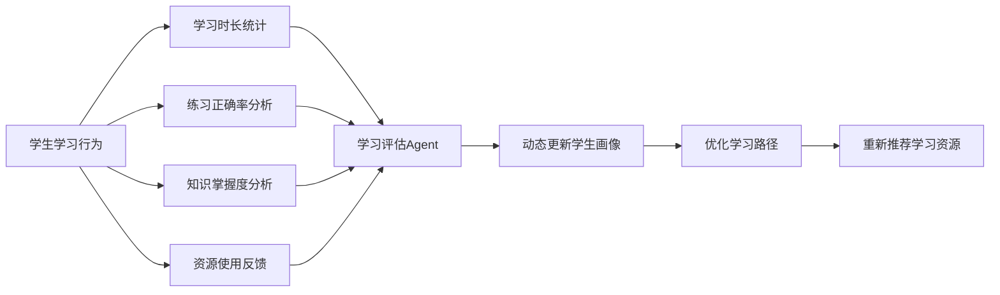

---

# 九、推荐技术架构

| 模块 | 技术方案 |
|---|---|
| 前端 | Vue3 + TypeScript + TailwindCSS |
| 后端 | FastAPI |
| Agent框架 | LangGraph |
| RAG框架 | LangChain |
| 向量数据库 | ChromaDB |
| 主大模型 | 讯飞星火 Spark |
| 语音识别 | 讯飞ASR |
| 语音合成 | 讯飞TTS |
| 图表可视化 | ECharts |
| 数据库 | PostgreSQL |
| 缓存 | Redis |
| 部署方案 | Docker |

---

# 十、多智能体详细工作流设计

## 1、系统总体工作流

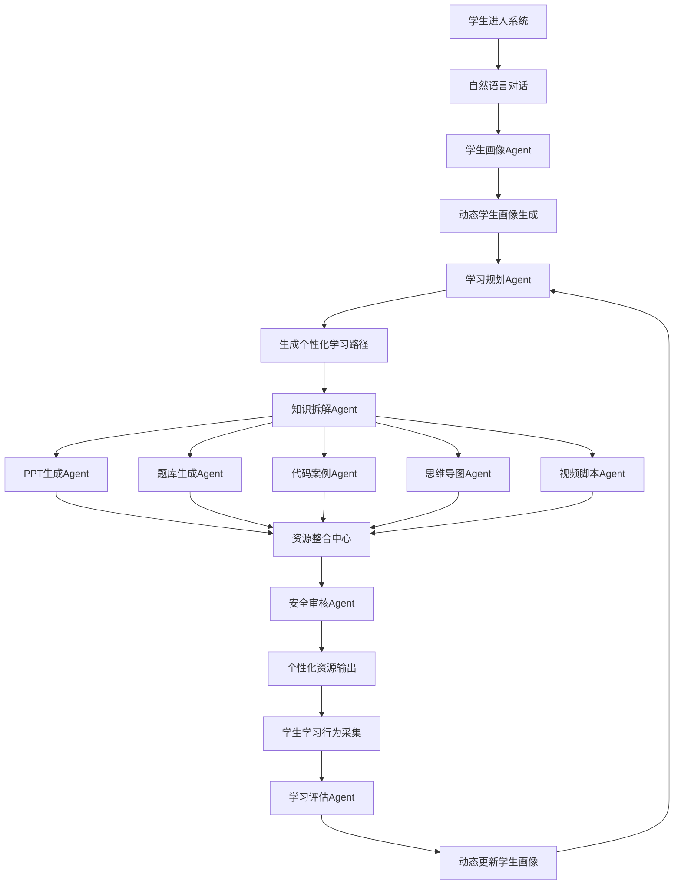

---

# 十一、核心Agent详细设计

# 1. 学生画像Agent（Profile Agent）

## Agent职责

用于通过自然语言对话自动分析学生特征，生成动态学生画像。

---

## 输入信息

```json
{
  "专业":"计算机科学",
  "学习目标":"蓝桥杯",
  "学习基础":"初学",
  "学习风格":"图解学习",
  "学习时间":"每天1小时"
}
```

---

## 输出画像

```json
{
  "knowledge_level":"beginner",
  "learning_style":"visual",
  "weakness":"loop",
  "goal":"lanqiao_competition",
  "study_time":"1h/day"
}
```

---

## 内部工作流

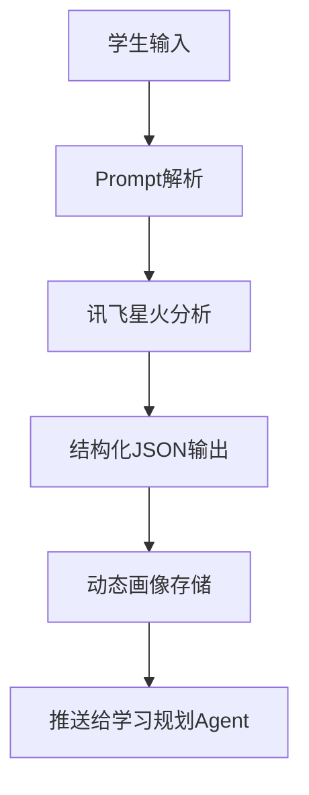

---

## 核心技术

| 模块 | 技术 |
|---|---|
| 大模型分析 | 讯飞星火 |
| Prompt工程 | LangChain |
| 数据存储 | PostgreSQL |
| 状态更新 | Redis |

---

# 2. 学习规划Agent（Planner Agent）

## Agent职责

根据学生画像生成动态学习路径。

---

## 输入

- 学生画像
- 当前学习进度
- 知识掌握情况
- 学习目标

---

## 输出

```text
Python基础
 → 条件语句
 → 循环结构
 → 函数
 → 面向对象
```

---

## 工作流

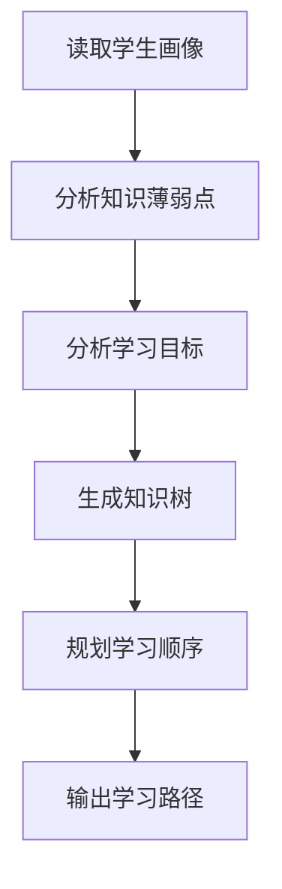

---

## 创新点

- 动态学习路径
- 实时学习调整
- 个性化推荐
- AI自动规划

---

# 3. 知识拆解Agent（Knowledge Agent）

## Agent职责

对课程知识进行结构化拆解。

---

## 示例

输入：

```text
Python函数
```

输出：

```text
1. 函数概念
2. 参数机制
3. 返回值
4. 局部变量
5. 实践案例
```

---

## 工作流

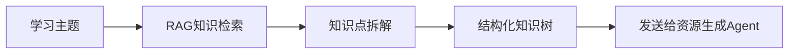

---

# 4. PPT生成Agent（PPT Agent）

## Agent职责

自动生成课程PPT。

---

## 输入

- 学习主题
- 学生水平
- 学习风格

---

## 输出

```markdown
# Python循环
## for循环
## while循环
## 案例演示
```

---

## 工作流

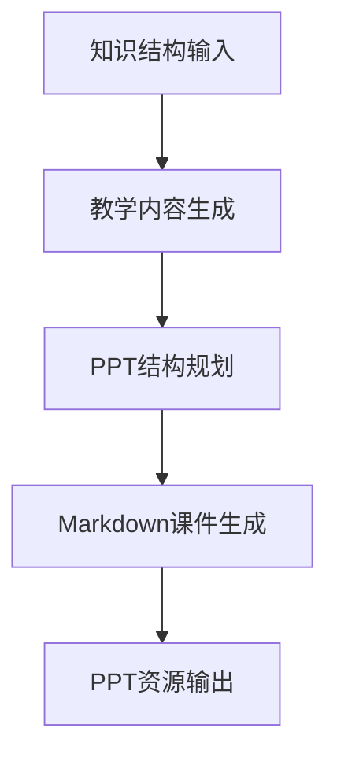

---

# 5. 题库生成Agent（Quiz Agent）

## Agent职责

自动生成个性化练习题。

---

## 支持题型

- 选择题
- 判断题
- 填空题
- 编程题
- 综合案例题

---

## 工作流

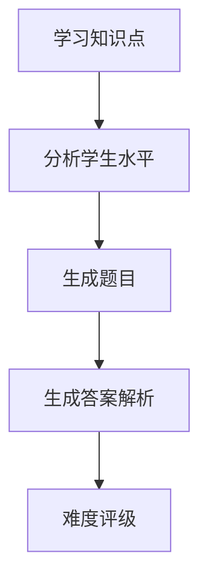

---

# 6. 代码案例Agent（Code Agent）

## Agent职责

自动生成编程实践案例。

---

## 示例输出

```python
for i in range(5):
    print(i)
```

---

## 工作流

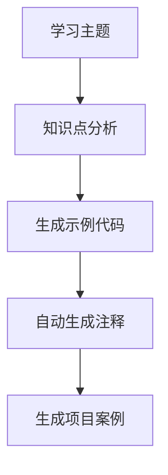

---

# 7. 思维导图Agent（MindMap Agent）

## Agent职责

自动生成知识结构图。

---

## 工作流

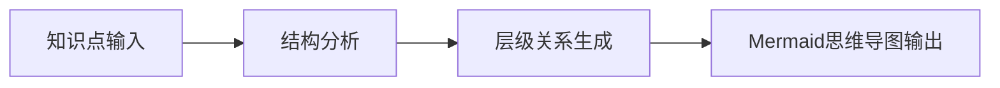

---

# 8. 视频脚本Agent（Video Agent）

## Agent职责

生成教学视频脚本。

---

## 输出示例

```text
镜头1：介绍循环概念
镜头2：展示for循环流程图
镜头3：代码案例演示
```

---

## 工作流

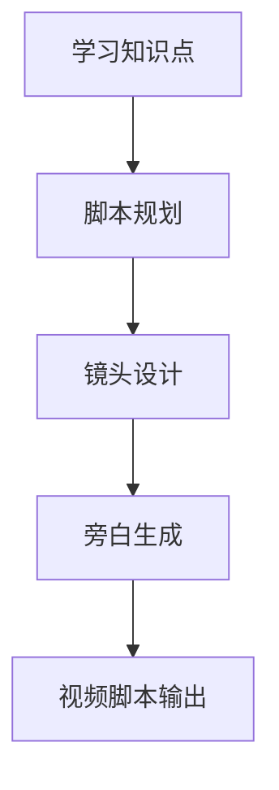

---

# 9. 答疑辅导Agent（Tutor Agent）

## Agent职责

提供实时AI答疑。

---

## 工作流

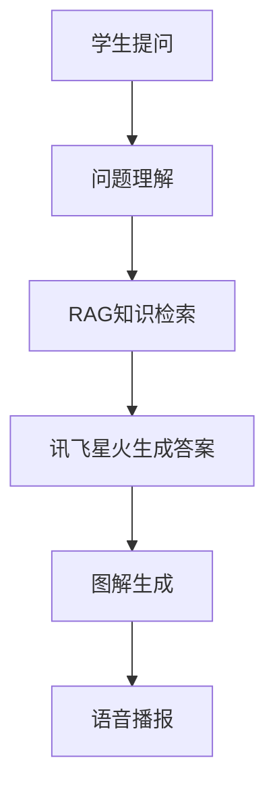

---

# 10. 学习评估Agent（Evaluation Agent）

## Agent职责

评估学生学习效果。

---

## 分析维度

| 维度 | 内容 |
|---|---|
| 学习时长 | 学习时间统计 |
| 正确率 | 题目完成情况 |
| 知识掌握 | 薄弱知识分析 |
| 学习行为 | 学习习惯分析 |
| 资源反馈 | 资源有效性 |

---

## 工作流

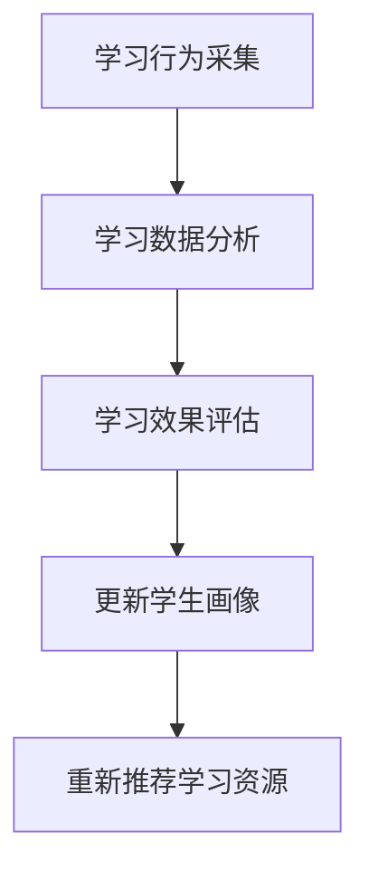

---

# 11. 安全审核Agent（Safety Agent）

## Agent职责

防止AI幻觉与错误内容生成。

---

## 审核内容

- 学术内容真实性
- 敏感违规内容
- 错误知识点
- 非课程内容
- 代码风险检测

---

## 工作流

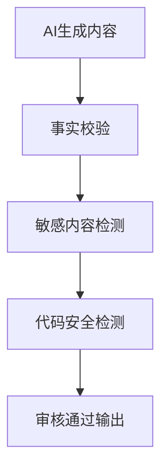

---

# 十二、LangGraph多智能体编排架构

```mermaid
flowchart LR

    START --> ProfileAgent

    ProfileAgent --> PlannerAgent

    PlannerAgent --> KnowledgeAgent

    KnowledgeAgent --> PPTAgent
    KnowledgeAgent --> QuizAgent
    KnowledgeAgent --> CodeAgent
    KnowledgeAgent --> MindMapAgent
    KnowledgeAgent --> VideoAgent

    PPTAgent --> MergeCenter
    QuizAgent --> MergeCenter
    CodeAgent --> MergeCenter
    MindMapAgent --> MergeCenter
    VideoAgent --> MergeCenter

    MergeCenter --> SafetyAgent

    SafetyAgent --> TutorAgent

    TutorAgent --> EvaluationAgent

    EvaluationAgent --> END
```

---

# 十三、系统任务调度机制

## 调度核心

系统采用LangGraph实现多智能体工作流调度。

---

## 调度特点

### 1. 状态共享

所有Agent共享统一状态：

```json
{
  "student_profile":{},
  "learning_path":{},
  "knowledge_tree":{},
  "resource_result":{}
}
```

---

### 2. 并行资源生成

多个资源生成Agent同时工作：

- PPT Agent
- Quiz Agent
- Code Agent
- Video Agent

提高生成效率。

---

### 3. 动态回流机制

学习评估结果重新进入学生画像系统，实现动态学习闭环。

---

# 十四、Agent协同创新点

## 1. 多Agent协同教学

不同教学智能体承担不同角色，实现真正意义上的AI协同教学。

---

## 2. 动态学习闭环

系统形成：

```text
学习
→ 评估
→ 调整
→ 再推荐
```

持续优化学习效果。

---

## 3. 多模态学习资源生成

系统支持：

- PPT
- 思维导图
- 练习题
- 视频脚本
- 代码案例
- 图解内容

---

## 4. 讯飞AI深度融合

深度融合：

- 讯飞星火
- 讯飞ASR
- 讯飞TTS

实现语音化、智能化学习体验。

---

# 十五、系统核心创新点

## 1. 多智能体协同教学

系统采用LangGraph多智能体协同架构，实现不同教学智能体之间的协作分工，提升教学资源生成质量与系统智能化水平。

## 2. 动态学生画像

系统通过自然语言对话持续更新学生画像，实现“随学随新”的个性化学习分析机制。

## 3. 个性化学习路径

基于学生学习能力、知识掌握情况与学习目标动态生成学习路径，实现真正意义上的“因材施教”。

## 4. 多模态学习资源生成

系统能够自动生成PPT、思维导图、练习题、代码案例、视频脚本等多种类型学习资源。

## 5. 讯飞AI深度融合

系统深度融合讯飞星火、讯飞ASR与讯飞TTS，实现语音化、智能化、沉浸式学习体验。

## 6. AI学习闭环

系统形成“学习—评估—调整—再推荐”的完整学习闭环，实现持续优化的智能学习机制。

